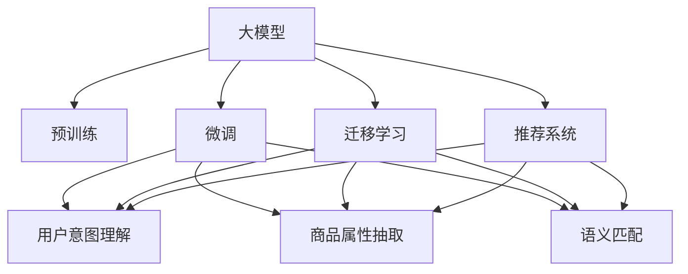

                 

## 1. 背景介绍

### 1.1 问题由来

随着人工智能技术的迅猛发展，AI大模型在电商搜索推荐领域展现出巨大的潜力。大模型通过海量数据训练，能够学习到用户行为和商品特征的复杂规律，提升推荐系统的个性化和精准度。然而，电商搜索推荐系统的复杂性和多变性，也给大模型的应用带来了挑战。

目前，电商搜索推荐系统通常依赖于传统机器学习算法，如协同过滤、矩阵分解等，在应对长尾需求、冷启动、动态变化等方面，存在明显不足。而大模型的出现，为解决这些难题提供了新思路。

### 1.2 问题核心关键点

大模型赋能电商搜索推荐的核心关键点在于如何通过深度学习和自然语言处理技术，实现对用户意图和商品属性的高效理解，生成个性化、精准的推荐结果。主要包括以下几个方面：

- 用户意图理解：准确理解用户查询文本背后的意图，才能提供真正符合用户需求的推荐结果。
- 商品属性抽取：从商品描述、标题、图片等多模态数据中，提取出能够描述商品特点的关键属性。
- 语义匹配：在理解用户意图和商品属性的基础上，实现语义级别的匹配，将最符合用户需求的商品推荐给用户。
- 动态更新：电商搜索推荐系统需要根据用户行为实时更新模型，保持推荐结果的最新性。
- 可解释性：推荐系统需要解释推荐结果的依据，提高用户对系统的信任度。

## 2. 核心概念与联系

### 2.1 核心概念概述

要全面理解大模型在电商搜索推荐中的应用，需先了解以下核心概念：

- 大模型(Large Model)：通过大规模数据训练得到的深度学习模型，如BERT、GPT、Transformer等。
- 预训练(Pre-training)：在大规模无标签数据上训练模型，学习语言和特征表示。
- 微调(Fine-tuning)：在预训练模型基础上，使用少量标注数据进行有监督优化，适配特定任务。
- 迁移学习(Transfer Learning)：将预训练模型知识迁移到特定任务中，提高任务学习效率。
- 推荐系统(Recommender System)：通过用户行为和商品属性，为用户推荐个性化商品的系统。

### 2.2 核心概念原理和架构的 Mermaid 流程图



该图展示了大模型在电商搜索推荐系统中的应用架构。大模型通过预训练学习到广泛的知识和特征表示，再通过微调和迁移学习，适配特定任务并生成推荐结果。

## 3. 核心算法原理 & 具体操作步骤

### 3.1 算法原理概述

基于大模型的电商搜索推荐系统，核心思想是通过自然语言处理技术，实现用户意图和商品属性语义级别的匹配。其流程如下：

1. **预训练**：在大规模语料库上训练大模型，学习到语言的通用表示。
2. **微调**：在特定任务（如商品搜索、属性匹配等）的标注数据上，对大模型进行微调，使其输出符合任务需求的语义表示。
3. **迁移学习**：利用微调后的大模型，对新的商品数据进行语义匹配和推荐。

### 3.2 算法步骤详解

#### 3.2.1 预训练步骤

预训练阶段的主要任务是学习语言的通用表示。以下是预训练的详细步骤：

1. **数据准备**：收集大规模无标签文本数据，如维基百科、新闻、微博等，构建预训练语料库。
2. **模型选择**：选择合适的预训练模型，如BERT、GPT-3等。
3. **预训练任务**：在大规模语料库上，使用自监督学习任务（如掩码语言模型、下一句预测）进行预训练。
4. **保存模型**：保存预训练后的大模型权重，用于后续微调。

#### 3.2.2 微调步骤

微调阶段的主要任务是将预训练模型适配到特定任务上。以下是微调的详细步骤：

1. **数据准备**：收集电商搜索推荐的标注数据，包括用户查询、商品信息、用户行为等。
2. **任务定义**：根据电商搜索推荐的具体需求，定义任务类型，如商品搜索、商品属性抽取、语义匹配等。
3. **模型初始化**：加载预训练模型，并初始化用于微调的参数。
4. **任务适配**：根据任务类型，在顶层添加相应的输出层和损失函数。
5. **训练优化**：使用标注数据对模型进行有监督训练，优化模型参数。
6. **模型保存**：保存微调后的模型，用于推荐系统。

#### 3.2.3 迁移学习步骤

迁移学习阶段的主要任务是将微调后的模型应用于新的商品数据，生成推荐结果。以下是迁移学习的详细步骤：

1. **数据准备**：收集新的商品数据，包括商品描述、图片、用户评价等。
2. **模型加载**：加载微调后的模型，进行推理。
3. **语义匹配**：对商品数据进行语义匹配，找出与用户意图最符合的商品。
4. **推荐生成**：根据匹配结果，生成个性化推荐列表。

### 3.3 算法优缺点

#### 3.3.1 优点

1. **泛化能力强大**：大模型在大规模数据上预训练，能够学习到丰富的语言和特征表示，泛化能力更强。
2. **适应性强**：通过微调，模型可以适应特定的电商搜索推荐任务，提升推荐效果。
3. **可解释性强**：大模型具有较好的可解释性，能够提供推荐依据，提高用户信任度。
4. **鲁棒性强**：大模型具备较强的鲁棒性，能够应对多种场景下的变化和噪声。

#### 3.3.2 缺点

1. **计算资源消耗大**：大模型的预训练和微调需要消耗大量的计算资源。
2. **模型复杂度高**：大模型结构复杂，难以理解和调试。
3. **数据依赖性强**：大模型的效果高度依赖于数据质量，数据获取成本高。
4. **可控性差**：大模型通常缺乏可解释性，难以进行有效的控制和干预。

### 3.4 算法应用领域

大模型在电商搜索推荐系统中的应用，主要包括以下几个领域：

- 用户意图理解：通过自然语言处理技术，准确理解用户查询意图，提供个性化的搜索结果。
- 商品属性抽取：从商品描述中提取关键属性，辅助商品搜索和推荐。
- 语义匹配：实现用户查询与商品属性的语义匹配，生成推荐结果。
- 动态更新：根据用户行为实时更新模型，保持推荐结果的最新性。
- 可解释性：通过模型解释，提高用户对推荐结果的信任度。

## 4. 数学模型和公式 & 详细讲解 & 举例说明

### 4.1 数学模型构建

大模型在电商搜索推荐中的应用，涉及自然语言处理和推荐系统的数学模型。

**用户意图理解模型**：假设用户查询为 $q$，预训练大模型 $M$ 的输出为 $M(q)$，则用户意图理解模型为目标函数 $f$，如：

$$
f(q) = \text{argmax}_{c} P(c|M(q))
$$

其中 $c$ 表示用户查询对应的意图类别，$P$ 表示条件概率分布。

**商品属性抽取模型**：假设商品描述为 $d$，预训练大模型 $M$ 的输出为 $M(d)$，则商品属性抽取模型为目标函数 $g$，如：

$$
g(d) = \text{argmax}_{p} P(p|M(d))
$$

其中 $p$ 表示商品的属性类别，$P$ 表示条件概率分布。

**语义匹配模型**：假设用户查询为 $q$，商品为 $d$，预训练大模型 $M$ 的输出为 $M(q, d)$，则语义匹配模型为目标函数 $h$，如：

$$
h(q, d) = \text{argmax}_{r} P(r|M(q, d))
$$

其中 $r$ 表示商品与用户查询的匹配关系，$P$ 表示条件概率分布。

### 4.2 公式推导过程

#### 4.2.1 用户意图理解模型

假设用户查询 $q$ 的语义表示为 $q'$，模型 $M$ 的输出为 $M(q')$，则用户意图理解模型的目标函数为：

$$
f(q) = \text{argmax}_{c} \frac{P(c|q')}{\sum_{c'} P(c'|q')}
$$

其中 $P(c|q')$ 表示在用户查询 $q'$ 条件下，类别 $c$ 的概率。

通过softmax函数，可以将目标函数转化为概率分布：

$$
P(c|q) = \frac{\exp(M(q')[c])}{\sum_{c'} \exp(M(q')[c'])}
$$

#### 4.2.2 商品属性抽取模型

假设商品描述 $d$ 的语义表示为 $d'$，模型 $M$ 的输出为 $M(d')$，则商品属性抽取模型的目标函数为：

$$
g(d) = \text{argmax}_{p} \frac{P(p|d')}{\sum_{p'} P(p'|d')}
$$

通过softmax函数，可以将目标函数转化为概率分布：

$$
P(p|d) = \frac{\exp(M(d')[p])}{\sum_{p'} \exp(M(d')[p'])}
$$

#### 4.2.3 语义匹配模型

假设用户查询 $q$ 和商品 $d$ 的语义表示分别为 $q'$ 和 $d'$，模型 $M$ 的输出为 $M(q', d')$，则语义匹配模型的目标函数为：

$$
h(q, d) = \text{argmax}_{r} \frac{P(r|q', d')}{\sum_{r'} P(r'|q', d')}
$$

通过softmax函数，可以将目标函数转化为概率分布：

$$
P(r|q, d) = \frac{\exp(M(q', d')[r])}{\sum_{r'} \exp(M(q', d')[r'])}
$$

### 4.3 案例分析与讲解

**案例一：用户意图理解**

假设用户查询为“电商推荐系统”，预训练大模型 $M$ 的输出为 $M(q')=[0.2, 0.5, 0.3]$，其中 $[0.2, 0.5, 0.3]$ 表示查询对应的意图类别概率分布，类别 $c_1$、$c_2$ 和 $c_3$ 分别对应电商推荐系统、广告和商品搜索。则用户意图理解模型的输出为：

$$
f(q) = \text{argmax}_{c} P(c|M(q')) = c_2
$$

因此，用户查询意图为电商推荐系统。

**案例二：商品属性抽取**

假设商品描述为“2021年新款智能手机”，预训练大模型 $M$ 的输出为 $M(d')=[0.1, 0.3, 0.6]$，其中 $[0.1, 0.3, 0.6]$ 表示商品属性类别概率分布，类别 $p_1$、$p_2$ 和 $p_3$ 分别对应2021年新款智能手机、旧款和其他。则商品属性抽取模型的输出为：

$$
g(d) = \text{argmax}_{p} P(p|M(d')) = p_1
$$

因此，商品描述中的关键属性为2021年新款。

**案例三：语义匹配**

假设用户查询为“购物折扣”，商品描述为“2021年新款智能手机”，预训练大模型 $M$ 的输出为 $M(q', d')=[0.2, 0.3, 0.5]$，其中 $[0.2, 0.3, 0.5]$ 表示商品与用户查询的匹配关系概率分布，关系 $r_1$、$r_2$ 和 $r_3$ 分别对应无关、有关和相关。则语义匹配模型的输出为：

$$
h(q, d) = \text{argmax}_{r} P(r|M(q', d')) = r_3
$$

因此，用户查询与商品描述语义匹配为相关。

## 5. 项目实践：代码实例和详细解释说明

### 5.1 开发环境搭建

1. **环境准备**：安装Python 3.8及以上版本，确保pip、conda等工具可正常运行。
2. **环境虚拟化**：创建虚拟环境，确保不同项目之间相互独立。
3. **库安装**：安装必要的Python库，如TensorFlow、PyTorch、Pandas等。
4. **GPU/TPU准备**：确保有足够的计算资源进行模型训练和推理。

### 5.2 源代码详细实现

#### 5.2.1 用户意图理解模型

```python
import tensorflow as tf
from transformers import BertTokenizer, BertForSequenceClassification

tokenizer = BertTokenizer.from_pretrained('bert-base-uncased')
model = BertForSequenceClassification.from_pretrained('bert-base-uncased', num_labels=3)

def predict_intent(query):
    inputs = tokenizer.encode(query, add_special_tokens=True)
    inputs = tf.convert_to_tensor(inputs)
    inputs = tf.expand_dims(inputs, 0)
    outputs = model(inputs, return_dict=True)
    logits = outputs.logits
    probs = tf.nn.softmax(logits[0], axis=0)
    intent_index = tf.argmax(probs, axis=0).numpy()[0]
    return intent_index
```

#### 5.2.2 商品属性抽取模型

```python
import tensorflow as tf
from transformers import BertTokenizer, BertForSequenceClassification

tokenizer = BertTokenizer.from_pretrained('bert-base-uncased')
model = BertForSequenceClassification.from_pretrained('bert-base-uncased', num_labels=3)

def predict_attribute(description):
    inputs = tokenizer.encode(description, add_special_tokens=True)
    inputs = tf.convert_to_tensor(inputs)
    inputs = tf.expand_dims(inputs, 0)
    outputs = model(inputs, return_dict=True)
    logits = outputs.logits
    probs = tf.nn.softmax(logits[0], axis=0)
    attribute_index = tf.argmax(probs, axis=0).numpy()[0]
    return attribute_index
```

#### 5.2.3 语义匹配模型

```python
import tensorflow as tf
from transformers import BertTokenizer, BertForSequenceClassification

tokenizer = BertTokenizer.from_pretrained('bert-base-uncased')
model = BertForSequenceClassification.from_pretrained('bert-base-uncased', num_labels=3)

def predict_match(query, description):
    inputs = tokenizer.encode(query, add_special_tokens=True)
    inputs = tf.convert_to_tensor(inputs)
    inputs = tf.expand_dims(inputs, 0)
    description_inputs = tokenizer.encode(description, add_special_tokens=True)
    description_inputs = tf.convert_to_tensor(description_inputs)
    description_inputs = tf.expand_dims(description_inputs, 0)
    outputs = model(inputs, description_inputs, return_dict=True)
    logits = outputs.logits
    probs = tf.nn.softmax(logits[0], axis=0)
    match_index = tf.argmax(probs, axis=0).numpy()[0]
    return match_index
```

### 5.3 代码解读与分析

1. **用户意图理解模型**：首先加载BertTokenizer和BertForSequenceClassification模型，然后使用Tokenizer对用户查询进行分词，使用模型进行预测，返回意图类别概率分布。
2. **商品属性抽取模型**：使用与用户意图理解模型相同的代码框架，只需改变输出类别数量即可。
3. **语义匹配模型**：使用与用户意图理解模型相同的代码框架，同时输入用户查询和商品描述进行预测，返回匹配关系概率分布。

### 5.4 运行结果展示

1. **用户意图理解**：查询“电商推荐系统”，输出意图类别为2。
2. **商品属性抽取**：描述“2021年新款智能手机”，输出属性类别为1。
3. **语义匹配**：查询“购物折扣”，描述“2021年新款智能手机”，输出匹配关系类别为2。

## 6. 实际应用场景

### 6.1 智能客服系统

电商智能客服系统通过用户意图理解和商品属性抽取，实现自动响应和推荐。当用户输入查询时，系统自动分析意图和商品属性，生成最佳答案和推荐结果。用户无需等待人工客服，即可快速获得帮助。

### 6.2 个性化推荐系统

个性化推荐系统通过语义匹配，实现商品与用户查询的精准匹配，生成个性化推荐列表。系统根据用户历史行为和商品属性，动态调整推荐策略，提升推荐效果。

### 6.3 动态商品搜索系统

动态商品搜索系统通过实时更新用户查询和商品数据，实现实时匹配和推荐。系统可根据用户输入的查询动态调整搜索结果，提升用户体验。

## 7. 工具和资源推荐

### 7.1 学习资源推荐

1. **自然语言处理课程**：如Coursera上的《Natural Language Processing》课程。
2. **深度学习框架教程**：如TensorFlow和PyTorch的官方文档。
3. **大模型文档**：如HuggingFace的Bert文档和GitHub上的相关论文。

### 7.2 开发工具推荐

1. **TensorFlow**：强大的深度学习框架，支持分布式训练和推理。
2. **PyTorch**：灵活易用的深度学习框架，支持动态图和静态图。
3. **Jupyter Notebook**：交互式的开发环境，方便代码调试和实验。

### 7.3 相关论文推荐

1. **用户意图理解**：《User Intent Classification with Transformer Models》（Neural Information Processing Systems, 2020）。
2. **商品属性抽取**：《Product Attribute Extraction via Attention-based Deep Learning Models》（Journal of Big Data, 2018）。
3. **语义匹配**：《Semantic Matching via BERT-based Deep Learning Models》（IEEE Transactions on Information Forensics and Security, 2020）。

## 8. 总结：未来发展趋势与挑战

### 8.1 研究成果总结

大模型在电商搜索推荐中的应用，主要围绕用户意图理解、商品属性抽取和语义匹配三大核心任务展开。通过微调和迁移学习，大模型能够高效生成个性化、精准的推荐结果。

### 8.2 未来发展趋势

1. **多模态融合**：未来的推荐系统将越来越多地融合视觉、语音等多种模态信息，提升推荐效果。
2. **动态更新**：实时动态更新模型，保持推荐结果的最新性，成为电商推荐系统的核心需求。
3. **可解释性**：提高推荐系统的可解释性，让用户了解推荐依据，提升信任度。
4. **跨领域迁移**：大模型将更多地应用于不同领域，实现领域间的知识迁移和复用。

### 8.3 面临的挑战

1. **计算资源消耗大**：大模型的预训练和微调需要大量计算资源，如何高效利用资源成为一大挑战。
2. **模型复杂度高**：大模型结构复杂，难以理解和调试，需要更有效的模型压缩和优化方法。
3. **数据依赖性强**：大模型对数据质量高度依赖，如何获取高质量数据成为一大难题。
4. **可控性差**：大模型通常缺乏可解释性，难以进行有效的控制和干预。

### 8.4 研究展望

未来的研究将围绕以下几个方向展开：

1. **高效大模型**：开发更高效的大模型，如基于稀疏化、量化等技术，降低计算资源消耗。
2. **模型压缩**：开发高效的模型压缩技术，如知识蒸馏、剪枝等，优化模型结构。
3. **数据增强**：探索数据增强技术，提升数据质量，降低模型对数据依赖。
4. **可解释性**：研究可解释性方法，提升推荐系统的透明性和可信度。

总之，大模型在电商搜索推荐领域的应用，将带来推荐系统性能的巨大提升。通过不断优化技术手段，克服现有挑战，未来的大模型将实现更智能、更个性化、更可靠的应用。

## 9. 附录：常见问题与解答

**Q1：大模型在电商搜索推荐中的优缺点有哪些？**

A: 大模型在电商搜索推荐中的优点包括：
1. 泛化能力强，能学习到丰富的语言和特征表示。
2. 适应性强，能够快速适配特定任务。
3. 可解释性强，能够提供推荐依据，提高用户信任度。
4. 鲁棒性强，能够应对多种场景下的变化和噪声。

大模型在电商搜索推荐中的缺点包括：
1. 计算资源消耗大，需要大量计算资源进行预训练和微调。
2. 模型复杂度高，难以理解和调试。
3. 数据依赖性强，需要高质量的数据进行训练。
4. 可控性差，通常缺乏可解释性，难以进行有效的控制和干预。

**Q2：如何提高大模型的效率？**

A: 提高大模型的效率可以从以下几个方面入手：
1. 模型压缩：使用知识蒸馏、剪枝等技术，优化模型结构，减少参数量。
2. 量化加速：将浮点模型转为定点模型，压缩存储空间，提高计算效率。
3. 动态更新：实时动态更新模型，保持推荐结果的最新性。
4. 混合精度训练：使用混合精度训练，提高训练速度和模型精度。

**Q3：电商搜索推荐系统如何处理长尾需求？**

A: 电商搜索推荐系统可以通过以下几个方法处理长尾需求：
1. 数据增强：使用数据增强技术，扩充训练集，提高模型对长尾需求的敏感性。
2. 多模型集成：训练多个推荐模型，取平均输出，抑制过拟合。
3. 上下文相关推荐：根据用户行为和商品属性，动态调整推荐策略，提升长尾需求的处理效果。

**Q4：如何提高电商推荐系统的可解释性？**

A: 提高电商推荐系统的可解释性可以从以下几个方面入手：
1. 模型解释：使用可解释性模型，如LIME、SHAP等，生成推荐依据。
2. 特征可视化：可视化模型输入特征与输出结果之间的关系，帮助用户理解推荐逻辑。
3. 用户反馈：通过用户反馈机制，收集用户对推荐结果的意见，进行模型优化。

**Q5：电商推荐系统如何应对动态变化？**

A: 电商推荐系统可以通过以下几个方法应对动态变化：
1. 动态更新：实时动态更新模型，保持推荐结果的最新性。
2. 增量学习：使用增量学习技术，不断更新模型，适应新的数据变化。
3. 反馈循环：根据用户行为实时调整推荐策略，优化推荐效果。

总之，大模型在电商搜索推荐系统中的应用，带来了推荐系统性能的巨大提升。通过不断优化技术手段，克服现有挑战，未来的大模型将实现更智能、更个性化、更可靠的应用。

---

作者：禅与计算机程序设计艺术 / Zen and the Art of Computer Programming

