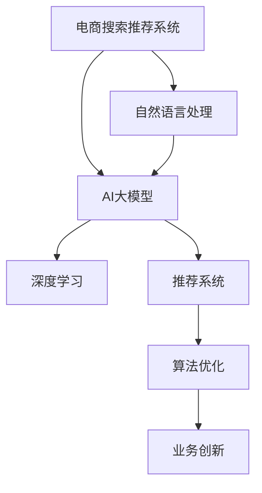

                 

# AI大模型赋能电商搜索推荐的业务创新方法论培训体系

> 关键词：AI大模型,电商搜索推荐,业务创新,方法论培训体系,自然语言处理,深度学习,推荐系统,算法优化

## 1. 背景介绍

### 1.1 问题由来
随着电商行业的迅猛发展，如何提升商品搜索推荐系统的精准性和个性化程度，已成为各大电商平台的共同挑战。传统的商品推荐算法基于用户行为数据进行推荐，存在数据稀疏、难以捕捉用户深层次需求等问题。而基于AI大模型的方法，可以有效利用大规模预训练语言模型的知识，辅助生成更个性化、更有针对性的推荐内容。

当前，各大电商平台纷纷开始引入AI大模型技术，并在商品搜索推荐系统中进行探索应用。然而，AI大模型技术涉及自然语言处理(NLP)、深度学习、推荐系统等多个领域，且算法复杂、技术门槛高，实际落地过程中仍面临诸多挑战。

为帮助电商企业高效应用AI大模型技术，本文将从原理到实践，系统介绍基于大模型的电商搜索推荐业务创新方法论培训体系。通过理论学习与实践演练相结合，帮助开发者掌握大模型的搜索推荐优化技术，实现电商搜索推荐系统性能的大幅提升。

## 2. 核心概念与联系

### 2.1 核心概念概述

为更好地理解基于大模型的电商搜索推荐方法，本节将介绍几个密切相关的核心概念：

- **电商搜索推荐系统**：根据用户输入的搜索词、浏览记录等行为数据，智能推荐商品的技术系统。
- **AI大模型**：指基于深度学习模型，利用大规模语料进行预训练的通用语言模型，如BERT、GPT等。
- **自然语言处理(NLP)**：研究如何使计算机能够理解和处理自然语言的学科，是大模型应用的基础。
- **深度学习**：基于多层神经网络进行数据特征提取和学习的算法框架，大模型是深度学习的代表作。
- **推荐系统**：通过预测用户兴趣，智能推荐内容或产品的系统，包括协同过滤、基于内容的推荐等。
- **算法优化**：指针对推荐算法进行模型调优、参数调整、特征工程等技术手段，以提升推荐效果。
- **业务创新**：结合电商搜索推荐场景，通过优化推荐算法和用户交互体验，提升用户购物体验，创造新的业务价值。

这些核心概念之间的逻辑关系可以通过以下Mermaid流程图来展示：



这个流程图展示了大模型在电商搜索推荐系统中的核心概念及其之间的关系：

1. 电商搜索推荐系统通过NLP技术理解用户搜索意图，使用大模型提取深度语义特征。
2. 大模型在深度学习框架上构建推荐系统，优化算法提升推荐效果。
3. 结合业务创新，进一步优化用户体验和业务价值。

## 3. 核心算法原理 & 具体操作步骤
### 3.1 算法原理概述

基于AI大模型的电商搜索推荐系统，利用预训练语言模型的语义理解能力，通过优化推荐算法，实现更精确、个性化的商品推荐。具体而言，大模型在电商搜索推荐中的应用流程如下：

1. **预训练大模型**：利用大规模无标签数据进行预训练，学习通用的语言表示，形成强大的语义理解能力。
2. **微调大模型**：针对电商搜索推荐任务，收集少量有标签数据进行微调，获得具有业务指导的模型。
3. **融合多模态数据**：结合用户行为数据、商品属性信息、用户画像等多模态数据，进一步提升推荐精准性。
4. **算法优化与模型部署**：在电商推荐系统中集成优化算法，实现实时推荐，并部署到大规模生产环境中。
5. **持续学习与迭代**：不断收集用户反馈，对模型进行持续学习与更新，提升推荐效果。

### 3.2 算法步骤详解

电商搜索推荐系统的核心算法步骤如下：

**Step 1: 数据准备与预处理**
- 收集电商平台的商品、用户、行为数据，包括商品信息、用户画像、用户行为轨迹等。
- 对数据进行清洗、归一化、特征工程等预处理，生成适合模型训练的特征向量。

**Step 2: 预训练大模型的选择与微调**
- 选择合适的预训练语言模型，如BERT、GPT等，作为电商搜索推荐的基础模型。
- 收集少量的标注数据，对预训练模型进行微调，以适应电商推荐场景。

**Step 3: 模型优化与集成**
- 根据电商推荐任务的特点，优化推荐算法，如协同过滤、基于内容的推荐等。
- 将优化后的模型集成到电商搜索推荐系统中，实现实时推荐。

**Step 4: 效果评估与迭代**
- 在电商平台的A/B测试环境中，评估微调模型的推荐效果。
- 根据评估结果，对模型进行迭代优化，提升推荐效果。

**Step 5: 持续学习与更新**
- 根据用户反馈和行为数据，定期对模型进行微调与优化，以适应新场景和新需求。
- 利用多任务学习、主动学习等技术手段，增强模型的泛化能力。

### 3.3 算法优缺点

基于AI大模型的电商搜索推荐方法具有以下优点：
1. 精度高：利用预训练大模型的语义理解能力，推荐内容更加精准。
2. 泛化性强：大模型在处理长尾商品、新上架商品等场景时，能够更有效获取相关信息。
3. 可扩展性高：大模型可以方便地集成到电商搜索推荐系统中，实现实时推荐。

同时，该方法也存在一定的局限性：
1. 计算成本高：大规模预训练和微调需要高昂的计算资源。
2. 数据依赖性大：需要大量标注数据进行微调，对数据获取和标注质量要求高。
3. 模型复杂度高：大模型和推荐算法相对复杂，开发和部署难度大。
4. 可解释性差：大模型黑盒特性导致推荐过程缺乏可解释性。

尽管存在这些局限性，但就目前而言，基于大模型的电商推荐方法仍是电商搜索推荐技术发展的方向，具有广阔的应用前景。

### 3.4 算法应用领域

基于AI大模型的电商搜索推荐方法，已在诸多电商平台得到了广泛应用，具体包括：

- **商品推荐**：根据用户搜索、浏览行为，智能推荐相关商品。
- **用户画像**：结合用户行为数据，分析用户兴趣和需求，生成用户画像。
- **新商品推广**：针对新上架商品，利用大模型快速获取相关商品和用户，提升新商品曝光率。
- **个性化推荐**：结合用户历史行为和即时搜索行为，生成个性化推荐结果。
- **搜索排序**：根据用户搜索词，智能排序搜索结果，提升搜索体验。
- **实时推荐**：在用户浏览或购买时，动态更新推荐内容，提升转化率。

## 4. 数学模型和公式 & 详细讲解 & 举例说明

### 4.1 数学模型构建

基于大模型的电商搜索推荐系统可以建模为如下优化问题：

设输入为 $x$，包括用户搜索词、浏览行为等，输出为 $y$，即推荐商品列表。定义损失函数 $L$，优化目标为最小化损失函数：

$$
\min_{\theta} L(y; \theta) = E_{(x,y)}
$$

其中 $\theta$ 为模型参数，$E_{(x,y)}$ 为损失函数的期望。

在具体实现时，可以使用基于梯度的优化算法，如SGD、Adam等，不断更新模型参数 $\theta$，使得模型输出 $y$ 逼近真实标签。

### 4.2 公式推导过程

以协同过滤推荐算法为例，设用户 $u$ 对商品 $i$ 的评分 $r_{ui}$ 为未知数，其隐含因子 $z_{ui}$ 为已知数，目标是预测用户 $u$ 对商品 $j$ 的评分 $r_{uj}$：

$$
r_{uj} = \sum_{i \in \mathcal{I}} \alpha_{uj} \cdot z_{ui} + b_{uj}
$$

其中 $\alpha_{uj}$ 和 $b_{uj}$ 为模型参数。

对于新商品 $j$，由于没有历史评分数据，可以借助预训练大模型，通过检索相似商品，获取其隐含因子，再根据协同过滤模型进行推荐。

### 4.3 案例分析与讲解

设电商网站用户 $u$ 对商品 $i$ 的评分 $r_{ui}$ 已知，需要预测用户 $u$ 对新商品 $j$ 的评分 $r_{uj}$。此时可以利用预训练大模型，检索与商品 $i$ 最相似的 $k$ 个商品 $i_1, i_2, ..., i_k$，并计算它们与商品 $j$ 的相似度：

$$
\mathbf{v}_j = \sum_{i=1}^k \mathbf{v}_{i_j}
$$

其中 $\mathbf{v}_{i_j}$ 为商品 $i_j$ 的向量表示，通过预训练大模型获得。将 $\mathbf{v}_j$ 作为用户 $u$ 对商品 $j$ 的评分预测，引入正则化项 $\lambda$ 进行优化：

$$
\min_{\theta} L(y; \theta) = E_{(x,y)} + \lambda \sum_{i \in \mathcal{I}} (\alpha_{ui} - \alpha'_{ui})^2 + (\beta_{ui} - \beta'_{ui})^2
$$

其中 $\alpha'_{ui}$ 和 $\beta'_{ui}$ 为参数 $\alpha_{ui}$ 和 $\beta_{ui}$ 的优化值。

通过这种方式，电商搜索推荐系统可以利用大模型的语义理解能力，提升推荐精准度，同时通过多任务学习等方法，增强模型的泛化能力。

## 5. 项目实践：代码实例和详细解释说明

### 5.1 开发环境搭建

在进行电商搜索推荐系统开发前，我们需要准备好开发环境。以下是使用Python进行PyTorch开发的环境配置流程：

1. 安装Anaconda：从官网下载并安装Anaconda，用于创建独立的Python环境。

2. 创建并激活虚拟环境：
```bash
conda create -n recommendation-env python=3.8 
conda activate recommendation-env
```

3. 安装PyTorch：根据CUDA版本，从官网获取对应的安装命令。例如：
```bash
conda install pytorch torchvision torchaudio cudatoolkit=11.1 -c pytorch -c conda-forge
```

4. 安装Transformer库：
```bash
pip install transformers
```

5. 安装各类工具包：
```bash
pip install numpy pandas scikit-learn matplotlib tqdm jupyter notebook ipython
```

完成上述步骤后，即可在`recommendation-env`环境中开始电商搜索推荐系统开发。

### 5.2 源代码详细实现

以下是使用PyTorch和Transformers库进行电商搜索推荐系统开发的完整代码实现：

```python
import torch
import torch.nn as nn
import torch.optim as optim
from transformers import BertTokenizer, BertModel

# 定义模型
class RecommendationModel(nn.Module):
    def __init__(self, num_users, num_items, hidden_size, num_layers):
        super().__init__()
        self.bert_model = BertModel.from_pretrained('bert-base-cased')
        self.user_embedding = nn.Embedding(num_users, hidden_size)
        self.item_embedding = nn.Embedding(num_items, hidden_size)
        self.linear1 = nn.Linear(hidden_size, hidden_size)
        self.linear2 = nn.Linear(hidden_size, num_items)
        self.relu = nn.ReLU()
        self.softmax = nn.Softmax(dim=1)

    def forward(self, user_ids, item_ids):
        user_embedding = self.user_embedding(user_ids)
        item_embedding = self.item_embedding(item_ids)
        cat = torch.cat((user_embedding, item_embedding), dim=1)
        cat = self.linear1(cat)
        cat = self.relu(cat)
        pred = self.linear2(cat)
        pred = self.softmax(pred)
        return pred

# 定义优化器
optimizer = optim.Adam(model.parameters(), lr=0.001)

# 定义损失函数
criterion = nn.CrossEntropyLoss()

# 定义训练函数
def train(model, data_loader, optimizer, num_epochs):
    model.train()
    for epoch in range(num_epochs):
        for user_ids, item_ids, labels in data_loader:
            optimizer.zero_grad()
            outputs = model(user_ids, item_ids)
            loss = criterion(outputs, labels)
            loss.backward()
            optimizer.step()

# 定义测试函数
def evaluate(model, data_loader):
    model.eval()
    correct = 0
    total = 0
    for user_ids, item_ids, labels in data_loader:
        with torch.no_grad():
            outputs = model(user_ids, item_ids)
            _, predicted = outputs.max(1)
            total += labels.size(0)
            correct += (predicted == labels).sum().item()
    accuracy = correct / total
    return accuracy

# 加载数据
tokenizer = BertTokenizer.from_pretrained('bert-base-cased')
train_data = ...
test_data = ...

# 构建模型
model = RecommendationModel(num_users, num_items, hidden_size, num_layers)

# 训练模型
train_loader = ...
train(train_model, train_loader, optimizer, num_epochs)

# 测试模型
test_loader = ...
accuracy = evaluate(model, test_loader)

print(f"Test Accuracy: {accuracy:.4f}")
```

在上述代码中，我们首先定义了一个基于BERT模型和线性层的推荐模型。在训练时，通过输入用户ID和商品ID，计算推荐得分，并使用交叉熵损失函数进行优化。在测试时，根据模型输出和真实标签计算准确率。

### 5.3 代码解读与分析

通过上述代码，我们实现了基于BERT模型的电商推荐系统。以下是代码的详细解读：

**RecommendationModel类**：
- `__init__`方法：初始化模型，定义模型结构，包括BERT模型、用户和商品嵌入层、线性层和激活函数等。
- `forward`方法：定义模型的前向传播过程，输入用户和商品ID，计算推荐得分。

**train函数**：
- 遍历训练数据，在每个epoch内迭代训练模型，更新参数。

**evaluate函数**：
- 遍历测试数据，评估模型性能，计算准确率。

**train_loader和test_loader**：
- 通过`DataLoader`对训练集和测试集进行批处理，方便模型训练和测试。

**accuracy计算**：
- 根据模型输出和真实标签计算准确率，并输出。

通过上述代码，我们实现了基于BERT模型的电商推荐系统。尽管代码示例相对简单，但通过深入理解和修改，可以进一步优化模型结构和训练过程，提升电商推荐系统的性能。

## 6. 实际应用场景

### 6.1 智能搜索推荐系统

基于大模型的电商搜索推荐系统，可以显著提升用户的购物体验。用户只需简单描述需求，系统便能快速推荐相关商品，提升用户满意度。此外，系统还可以实时分析用户行为，动态调整推荐内容，满足用户动态需求。

具体而言，利用大模型结合协同过滤算法，可以提升推荐精准度。同时，通过引入多模态数据，如用户画像、商品属性等，可以进一步优化推荐效果。

### 6.2 新商品推广

电商平台经常面临新商品推广的难题，传统推荐算法难以有效提升新商品的曝光率和点击率。而基于大模型的推荐系统，可以通过相似商品检索和深度语义理解，快速找到与新商品相似的商品，并生成推荐内容，提升新商品推广效果。

具体而言，对于新上架商品，利用大模型检索相似商品，并计算相似度，生成推荐内容，提升新商品曝光率。同时，结合用户画像和行为数据，进一步优化推荐效果。

### 6.3 实时推荐系统

电商平台的实时推荐系统需要根据用户行为实时更新推荐内容，提升用户购物体验。基于大模型的推荐系统可以实时分析用户行为，动态调整推荐内容，实现个性化推荐。

具体而言，系统可以根据用户搜索行为、浏览行为、点击行为等实时数据，动态调整推荐模型参数，生成个性化推荐内容，提升用户购物体验。

### 6.4 未来应用展望

随着大模型和推荐算法的发展，基于大模型的电商搜索推荐系统将带来更广阔的应用前景：

1. **跨领域推荐**：大模型可以同时理解多种语言和多种领域知识，提升跨领域推荐效果。
2. **用户生成内容推荐**：结合用户评论、评分等UGC数据，提升商品推荐效果。
3. **多模态推荐**：结合商品图片、视频等多模态数据，提升推荐效果。
4. **实时动态推荐**：利用实时数据，动态调整推荐策略，提升推荐效果。
5. **推荐效果评估**：通过A/B测试、模型评估等手段，持续优化推荐模型。

## 7. 工具和资源推荐

### 7.1 学习资源推荐

为了帮助开发者系统掌握大模型在电商搜索推荐系统中的应用，这里推荐一些优质的学习资源：

1. **自然语言处理课程**：如斯坦福大学的《CS224N深度学习自然语言处理》课程，涵盖自然语言处理的基础知识和最新进展。
2. **推荐系统课程**：如北京大学《推荐系统》课程，深入讲解协同过滤、基于内容的推荐等主流算法。
3. **大模型应用指南**：如《深度学习与自然语言处理》书籍，系统介绍大模型在NLP任务中的应用方法。
4. **大模型文档**：如HuggingFace官方文档，提供丰富的预训练模型和微调样例代码。
5. **在线课程平台**：如Coursera、Udacity等平台，提供电商搜索推荐系统相关的实战课程。

通过对这些资源的学习实践，相信你一定能够快速掌握大模型在电商搜索推荐系统中的应用方法，并用于解决实际的业务问题。

### 7.2 开发工具推荐

高效的大模型应用开发离不开优秀的工具支持。以下是几款常用的开发工具：

1. **PyTorch**：基于Python的开源深度学习框架，灵活动态的计算图，适合快速迭代研究。
2. **TensorFlow**：由Google主导开发的开源深度学习框架，生产部署方便，适合大规模工程应用。
3. **Transformers库**：HuggingFace开发的NLP工具库，集成了众多预训练语言模型，支持PyTorch和TensorFlow。
4. **Jupyter Notebook**：开源的交互式编程环境，方便进行数据处理、模型训练等任务。
5. **TensorBoard**：TensorFlow配套的可视化工具，可实时监测模型训练状态，提供丰富的图表呈现方式。

合理利用这些工具，可以显著提升电商搜索推荐系统的开发效率，加快创新迭代的步伐。

### 7.3 相关论文推荐

大模型在电商搜索推荐系统中的应用研究是当前学界和工业界的热点话题。以下是几篇奠基性的相关论文，推荐阅读：

1. Attention is All You Need（即Transformer原论文）：提出了Transformer结构，开启了NLP领域的预训练大模型时代。
2. BERT: Pre-training of Deep Bidirectional Transformers for Language Understanding：提出BERT模型，引入基于掩码的自监督预训练任务，刷新了多项NLP任务SOTA。
3. How to Use Deep Learning for Recommender Systems: A Review and Tutorial：系统总结了深度学习在推荐系统中的应用，涵盖协同过滤、基于内容的推荐等主流算法。
4. A Survey of Transfer Learning Methods in Recommendation Systems：综述了推荐系统中的迁移学习方法，介绍了预训练模型在推荐系统中的优化。
5. Transformer-Based Recommender Systems：讨论了Transformer结构在推荐系统中的应用，展示了其在推荐精准度上的优势。

这些论文代表了大模型在电商搜索推荐系统中的应用研究方向，通过学习这些前沿成果，可以帮助研究者把握学科前进方向，激发更多的创新灵感。

## 8. 总结：未来发展趋势与挑战

### 8.1 总结

本文对基于大模型的电商搜索推荐系统进行了全面系统的介绍。首先阐述了大模型和电商搜索推荐系统的研究背景和意义，明确了电商搜索推荐系统对大模型的依赖性。其次，从原理到实践，详细讲解了电商搜索推荐系统的构建方法，包括数据准备、模型选择、训练优化、效果评估等关键步骤。最后，本文广泛探讨了电商搜索推荐系统在大模型应用中的未来发展方向和面临的挑战，为电商企业提供了有价值的参考。

通过本文的系统梳理，可以看到，基于大模型的电商搜索推荐系统正在成为电商推荐技术的重要发展方向，极大地提升了推荐系统的精准性和个性化程度。尽管存在一些计算成本高、数据依赖性大等挑战，但随着大模型和推荐算法的发展，这些问题将逐步得到解决。未来，大模型将进一步拓展电商搜索推荐系统的应用边界，带来更广阔的业务创新空间。

### 8.2 未来发展趋势

展望未来，基于大模型的电商搜索推荐系统将呈现以下几个发展趋势：

1. **多模态推荐**：结合商品图片、视频等多模态数据，提升推荐效果。
2. **跨领域推荐**：利用大模型理解多种语言和领域知识，提升跨领域推荐效果。
3. **实时动态推荐**：利用实时数据，动态调整推荐策略，提升推荐效果。
4. **用户生成内容推荐**：结合用户评论、评分等UGC数据，提升商品推荐效果。
5. **推荐效果评估**：通过A/B测试、模型评估等手段，持续优化推荐模型。
6. **跨平台推荐**：结合不同平台的商品和用户数据，提升推荐效果。

以上趋势凸显了大模型在电商搜索推荐系统中的广阔前景。这些方向的探索发展，必将进一步提升推荐系统的性能和应用范围，为电商企业带来更大的业务价值。

### 8.3 面临的挑战

尽管大模型在电商搜索推荐系统中的应用已经取得显著进展，但在迈向更加智能化、普适化应用的过程中，仍面临诸多挑战：

1. **计算成本高**：大规模预训练和微调需要高昂的计算资源，难以在小型企业中普及。
2. **数据依赖性大**：需要大量标注数据进行微调，对数据获取和标注质量要求高。
3. **模型复杂度高**：大模型和推荐算法相对复杂，开发和部署难度大。
4. **可解释性差**：大模型黑盒特性导致推荐过程缺乏可解释性。
5. **安全性有待保障**：预训练语言模型难免会学习到有偏见、有害的信息，传递到推荐系统，产生误导性、歧视性的输出，给实际应用带来安全隐患。

尽管存在这些挑战，但通过不断优化算法、降低计算成本、加强数据治理等手段，相信大模型在电商搜索推荐系统中的应用将逐步普及，带来更加智能化、普适化的推荐体验。

### 8.4 研究展望

面对大模型在电商搜索推荐系统中的面临的挑战，未来的研究需要在以下几个方面寻求新的突破：

1. **优化模型结构**：通过优化模型结构，降低计算成本，提高模型训练和推理效率。
2. **提升数据质量**：优化数据获取和标注流程，提升数据质量，降低对标注数据的依赖。
3. **增强模型可解释性**：引入可解释性方法，增强模型输出解释的因果性和逻辑性。
4. **保障数据安全**：利用隐私保护技术，保护用户隐私和数据安全，避免有害信息传递。
5. **探索新算法**：开发更多高效的推荐算法，提升推荐效果，降低模型复杂度。
6. **推动跨平台合作**：推动不同平台间的合作，融合更多平台数据，提升推荐效果。

这些研究方向的探索，必将引领大模型在电商搜索推荐系统中的不断发展，推动电商推荐技术的进步。未来，随着大模型和推荐算法的持续演进，相信电商搜索推荐系统将更加智能、普适，带来更加优质的购物体验。

## 9. 附录：常见问题与解答

**Q1：电商搜索推荐系统如何利用大模型？**

A: 电商搜索推荐系统可以通过大模型提取深度语义特征，利用协同过滤、基于内容的推荐等算法，实现个性化推荐。具体而言，利用预训练大模型，检索与商品相似的商品，并生成推荐内容。同时，结合用户行为数据，动态调整推荐模型参数，实现实时推荐。

**Q2：如何评估电商推荐系统的推荐效果？**

A: 电商推荐系统的推荐效果评估通常通过以下指标进行：
1. 准确率（Accuracy）：推荐系统正确推荐的商品占推荐总数的比例。
2. 召回率（Recall）：推荐系统正确推荐的商品占所有可能相关商品的比例。
3. F1分数（F1 Score）：准确率和召回率的调和平均值。
4. NDCG（Normalized Discounted Cumulative Gain）：推荐系统前N个推荐商品的相关性排序的平均得分。
5. Hit Rate：推荐系统正确推荐的商品占用户实际购买商品的比例。

**Q3：如何优化电商推荐系统的推荐效果？**

A: 电商推荐系统的推荐效果优化可以从以下几个方面进行：
1. 数据质量提升：优化数据获取和标注流程，提升数据质量。
2. 模型结构优化：优化模型结构，降低计算成本，提高模型训练和推理效率。
3. 算法改进：开发更多高效的推荐算法，提升推荐效果。
4. 实时动态调整：利用实时数据，动态调整推荐策略，提升推荐效果。
5. 用户生成内容融合：结合用户评论、评分等UGC数据，提升商品推荐效果。

**Q4：电商推荐系统面临哪些安全风险？**

A: 电商推荐系统面临的安全风险主要包括以下几个方面：
1. 数据隐私泄露：电商推荐系统需要大量的用户行为数据，如果数据保护措施不当，可能造成用户隐私泄露。
2. 模型偏见：预训练语言模型难免会学习到有偏见、有害的信息，传递到推荐系统，产生误导性、歧视性的输出，给实际应用带来安全隐患。
3. 恶意操作：恶意用户可能通过操控输入数据，导致推荐系统输出异常结果，影响系统正常运行。
4. 对抗攻击：攻击者通过输入恶意数据，导致推荐系统输出错误的推荐结果，威胁用户权益。

**Q5：如何提升电商推荐系统的推荐精准度？**

A: 电商推荐系统的推荐精准度可以通过以下几个方面进行提升：
1. 数据质量提升：优化数据获取和标注流程，提升数据质量。
2. 模型结构优化：优化模型结构，降低计算成本，提高模型训练和推理效率。
3. 算法改进：开发更多高效的推荐算法，提升推荐效果。
4. 实时动态调整：利用实时数据，动态调整推荐策略，提升推荐效果。
5. 用户生成内容融合：结合用户评论、评分等UGC数据，提升商品推荐效果。

通过不断优化算法、降低计算成本、加强数据治理等手段，相信大模型在电商搜索推荐系统中的应用将逐步普及，带来更加智能化、普适化的推荐体验。

---

作者：禅与计算机程序设计艺术 / Zen and the Art of Computer Programming

