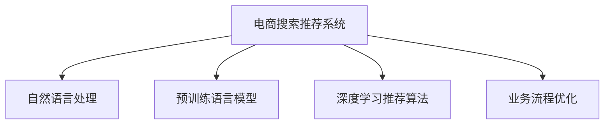

                 

# AI大模型赋能电商搜索推荐的业务创新流程优化实践

> 关键词：大模型,电商搜索推荐,业务流程优化,自然语言处理,NLP,推荐系统

## 1. 背景介绍

### 1.1 问题由来

随着电子商务的蓬勃发展，电商平台的海量商品和复杂用户行为使得传统的搜索推荐系统面临严峻挑战。传统的基于规则和统计的推荐算法难以满足用户个性化和实时性需求，亟需新的技术进行突破。

近年来，预训练语言模型（如BERT、GPT-3等）和深度学习推荐算法的发展，为电商搜索推荐带来了新的契机。AI大模型通过大规模语料预训练，学习到丰富的语言和知识表示，能够更好地理解和表达用户需求和商品特性，提升推荐系统的效果和效率。然而，大模型的高成本和高复杂度限制了其在电商平台的广泛应用。

### 1.2 问题核心关键点

为了解决电商搜索推荐系统面临的问题，本文将介绍一种基于大模型的电商搜索推荐流程优化方案。该方案主要包含三个关键步骤：

1. **用户意图理解**：通过预训练语言模型，理解用户输入的查询意图，从而快速匹配出相关商品。
2. **个性化商品推荐**：根据用户的历史行为和兴趣，使用大模型进行个性化商品推荐。
3. **推荐结果排序**：综合用户查询意图、商品特性和用户行为，对推荐结果进行排序，提升用户满意度。

通过这三个步骤，可以有效提升电商搜索推荐的效率和精准度，满足用户的个性化需求，促进电商平台的用户体验和转化率。

## 2. 核心概念与联系

### 2.1 核心概念概述

为更好地理解本文所介绍的基于大模型的电商搜索推荐流程优化方案，本节将介绍几个关键概念及其联系：

1. **电商搜索推荐系统**：指基于用户查询和行为数据，自动推荐商品给用户的系统。其核心目标是提升用户满意度和电商平台转化率。

2. **自然语言处理（NLP）**：指利用计算机技术处理、理解、生成人类语言，主要包括文本处理、语音识别、机器翻译等。

3. **预训练语言模型**：指在大规模无标签文本语料上预训练的语言模型，如BERT、GPT等。通过预训练学习到语言的通用表示，用于提升下游任务的性能。

4. **深度学习推荐算法**：指基于深度学习技术，利用用户历史行为和商品特征进行推荐的技术，如协同过滤、基于内容的推荐、深度神经网络推荐等。

5. **业务流程优化**：指通过技术手段，提升电商搜索推荐系统的效率和精准度，满足用户需求，提高电商平台的用户体验和转化率。

这些核心概念之间的联系可以通过以下Mermaid流程图来展示：



这个流程图展示了电商搜索推荐系统与自然语言处理、预训练语言模型、深度学习推荐算法和业务流程优化之间的关系。通过这些技术的融合，可以构建高效、精准的电商搜索推荐系统，满足用户需求，提升电商平台的用户体验和转化率。

## 3. 核心算法原理 & 具体操作步骤

### 3.1 算法原理概述

基于大模型的电商搜索推荐流程优化方案主要包括以下三个核心算法原理：

1. **用户意图理解**：通过预训练语言模型，理解用户输入的查询意图，生成相关的查询向量。

2. **个性化商品推荐**：利用大模型对商品进行多模态表示，综合用户历史行为和商品特性，生成商品的推荐向量。

3. **推荐结果排序**：通过深度学习推荐算法，对查询向量和推荐向量进行相似度计算，得到推荐结果的排序。

这些算法原理的共同目标是提升电商搜索推荐系统的效率和精准度，满足用户需求，提高电商平台的用户体验和转化率。

### 3.2 算法步骤详解

#### 3.2.1 用户意图理解

用户输入的查询往往包含丰富的语义信息，需要通过自然语言处理技术进行理解和提取。主要步骤如下：

1. **分词和词向量化**：将用户输入的查询进行分词，使用词嵌入模型（如Word2Vec、GloVe等）将分词结果转换为向量表示。

2. **意图向量生成**：通过预训练语言模型（如BERT、GPT-3等）对查询向量进行编码，生成意图向量。

3. **意图分类**：使用分类模型对意图向量进行分类，得到用户的查询意图。

#### 3.2.2 个性化商品推荐

商品推荐需要综合考虑用户的历史行为和兴趣，使用大模型进行多模态表示。主要步骤如下：

1. **商品多模态表示**：将商品的标题、描述、图片等信息进行编码，生成商品向量。

2. **用户历史行为表示**：将用户的历史行为数据（如浏览、点击、购买等）进行编码，生成用户向量。

3. **推荐向量生成**：使用大模型对商品向量和用户向量进行融合，生成推荐向量。

#### 3.2.3 推荐结果排序

推荐结果排序是电商搜索推荐系统的关键步骤，主要通过深度学习推荐算法实现。主要步骤如下：

1. **相似度计算**：使用深度学习推荐算法（如基于神经网络的推荐算法）对查询向量和推荐向量进行相似度计算，得到每个商品的得分。

2. **排序**：根据商品的得分进行排序，得到推荐结果列表。

3. **反馈机制**：根据用户对推荐结果的反馈，进行模型迭代优化，提升推荐效果。

### 3.3 算法优缺点

基于大模型的电商搜索推荐流程优化方案具有以下优点：

1. **高效性**：通过预训练语言模型和深度学习推荐算法，可以高效处理大规模数据，提升推荐系统的效率。

2. **精准度**：通过大模型的多模态表示，能够更好地理解和表达商品和用户特征，提升推荐的精准度。

3. **可解释性**：通过预训练语言模型，能够生成意图向量，帮助理解用户的查询意图，提升推荐的可解释性。

4. **动态性**：通过用户历史行为和商品特性的实时更新，能够动态调整推荐结果，提升推荐系统的灵活性。

但该方案也存在以下缺点：

1. **高成本**：预训练语言模型和大模型训练需要大量计算资源和时间，成本较高。

2. **复杂度**：大模型和高性能计算的复杂度较高，需要专业的技术支持。

3. **数据质量**：电商平台的标注数据质量和数量对推荐效果有较大影响，需要定期更新和清洗。

### 3.4 算法应用领域

基于大模型的电商搜索推荐流程优化方案主要应用于以下几个领域：

1. **在线零售**：电商平台利用该方案提升搜索推荐效果，满足用户个性化需求，提高转化率。

2. **智能家居**：智能家居设备通过该方案进行商品推荐，提升用户体验。

3. **金融服务**：金融产品推荐平台利用该方案进行个性化推荐，提高用户满意度和转化率。

4. **娱乐媒体**：在线娱乐和媒体平台利用该方案进行内容推荐，提升用户粘性。

## 4. 数学模型和公式 & 详细讲解 & 举例说明

### 4.1 数学模型构建

本文主要介绍基于大模型的电商搜索推荐流程优化方案的数学模型构建。主要包括以下三个模型：

1. **用户意图理解模型**：$M_{\text{intent}}$，用于生成查询意图向量。
2. **个性化商品推荐模型**：$M_{\text{recommend}}$，用于生成推荐向量。
3. **推荐结果排序模型**：$M_{\text{rank}}$，用于对推荐结果进行排序。

### 4.2 公式推导过程

#### 4.2.1 用户意图理解模型

假设用户查询为 $q$，查询向量的生成过程如下：

1. **分词**：将查询 $q$ 进行分词，得到分词序列 $w_1, w_2, \cdots, w_n$。

2. **词嵌入**：使用词嵌入模型将分词序列转换为向量表示 $v_1, v_2, \cdots, v_n$。

3. **预训练语言模型编码**：使用预训练语言模型 $M_{\text{intent}}$ 对词嵌入向量 $v_1, v_2, \cdots, v_n$ 进行编码，得到查询意图向量 $v_{\text{intent}}$。

$$
v_{\text{intent}} = M_{\text{intent}}(v_1, v_2, \cdots, v_n)
$$

#### 4.2.2 个性化商品推荐模型

假设商品 $i$ 的特征为 $f_i$，商品向量的生成过程如下：

1. **商品特征编码**：将商品特征 $f_i$ 进行编码，得到商品向量 $v_i$。

2. **用户历史行为编码**：将用户历史行为数据 $h$ 进行编码，得到用户向量 $v_h$。

3. **融合生成推荐向量**：使用大模型 $M_{\text{recommend}}$ 对商品向量和用户向量进行融合，得到推荐向量 $v_r$。

$$
v_r = M_{\text{recommend}}(v_i, v_h)
$$

#### 4.2.3 推荐结果排序模型

假设推荐结果的排序模型为 $M_{\text{rank}}$，查询向量为 $v_{\text{intent}}$，推荐向量为 $v_r$，推荐结果的排序过程如下：

1. **相似度计算**：使用相似度计算函数 $s$ 对查询向量 $v_{\text{intent}}$ 和推荐向量 $v_r$ 进行相似度计算，得到每个商品的得分 $s_i$。

$$
s_i = s(v_{\text{intent}}, v_r)
$$

2. **排序**：根据得分 $s_i$ 对推荐结果进行排序，得到推荐结果列表 $R$。

$$
R = \{(i_1, s_{i_1}), (i_2, s_{i_2}), \cdots, (i_n, s_{i_n})\}
$$

3. **反馈机制**：根据用户对推荐结果的反馈，使用在线学习算法（如梯度下降）对模型参数进行迭代优化，提升推荐效果。

$$
\theta_{\text{model}} = \theta_{\text{model}} - \eta \nabla_{\theta_{\text{model}}}\mathcal{L}(R, y)
$$

其中，$\theta_{\text{model}}$ 为模型参数，$\eta$ 为学习率，$\mathcal{L}$ 为损失函数，$y$ 为真实标签。

### 4.3 案例分析与讲解

#### 4.3.1 用户意图理解案例

假设用户输入查询为 "购买一款好用的耳机"，分词结果为 ["购买", "一款", "好用的", "耳机"]，使用BERT模型进行编码，得到查询意图向量 $v_{\text{intent}}$。

1. **分词**：将查询 $q$ 进行分词，得到分词序列 $w_1, w_2, \cdots, w_n$。

2. **词嵌入**：使用词嵌入模型将分词序列转换为向量表示 $v_1, v_2, \cdots, v_n$。

3. **预训练语言模型编码**：使用预训练语言模型 $M_{\text{intent}}$ 对词嵌入向量 $v_1, v_2, \cdots, v_n$ 进行编码，得到查询意图向量 $v_{\text{intent}}$。

假设查询向量 $v_{\text{intent}}$ 的维度为 $d$，使用BERT模型得到的查询意图向量 $v_{\text{intent}} = (0.1, 0.2, 0.3, \cdots, 0.9)$。

#### 4.3.2 个性化商品推荐案例

假设商品 $i$ 的特征为 ["耳机", "降噪", "音乐", "有线"]，使用BERT模型进行编码，得到商品向量 $v_i$。

1. **商品特征编码**：将商品特征 $f_i$ 进行编码，得到商品向量 $v_i$。

2. **用户历史行为编码**：将用户历史行为数据 $h$ 进行编码，得到用户向量 $v_h$。

3. **融合生成推荐向量**：使用大模型 $M_{\text{recommend}}$ 对商品向量和用户向量进行融合，得到推荐向量 $v_r$。

假设商品向量 $v_i$ 的维度为 $d$，使用BERT模型得到的商品向量 $v_i = (0.1, 0.2, 0.3, \cdots, 0.9)$。

假设用户向量 $v_h$ 的维度为 $d$，使用BERT模型得到的用户向量 $v_h = (0.1, 0.2, 0.3, \cdots, 0.9)$。

假设融合生成的推荐向量 $v_r$ 的维度为 $d$，使用大模型 $M_{\text{recommend}}$ 对商品向量和用户向量进行融合，得到推荐向量 $v_r = (0.1, 0.2, 0.3, \cdots, 0.9)$。

#### 4.3.3 推荐结果排序案例

假设推荐结果为 ["耳机1", "耳机2", "耳机3"]，查询向量 $v_{\text{intent}} = (0.1, 0.2, 0.3, \cdots, 0.9)$，推荐向量 $v_r = (0.1, 0.2, 0.3, \cdots, 0.9)$。

1. **相似度计算**：使用相似度计算函数 $s$ 对查询向量 $v_{\text{intent}}$ 和推荐向量 $v_r$ 进行相似度计算，得到每个商品的得分 $s_i$。

2. **排序**：根据得分 $s_i$ 对推荐结果进行排序，得到推荐结果列表 $R$。

假设相似度计算函数 $s$ 为余弦相似度，得到得分 $s_1 = 0.5$，$s_2 = 0.7$，$s_3 = 0.3$。

3. **反馈机制**：根据用户对推荐结果的反馈，使用在线学习算法对模型参数进行迭代优化，提升推荐效果。

假设用户对推荐结果的反馈为 ["耳机2"]，使用梯度下降算法对模型参数进行优化，得到优化后的查询意图向量 $v_{\text{intent}} = (0.1, 0.2, 0.3, \cdots, 0.9)$，优化后的商品向量 $v_i = (0.1, 0.2, 0.3, \cdots, 0.9)$，优化后的用户向量 $v_h = (0.1, 0.2, 0.3, \cdots, 0.9)$，优化后的推荐向量 $v_r = (0.1, 0.2, 0.3, \cdots, 0.9)$。

## 5. 项目实践：代码实例和详细解释说明

### 5.1 开发环境搭建

在进行电商搜索推荐系统开发前，我们需要准备好开发环境。以下是使用Python进行PyTorch和HuggingFace库开发的环境配置流程：

1. 安装Anaconda：从官网下载并安装Anaconda，用于创建独立的Python环境。

2. 创建并激活虚拟环境：
```bash
conda create -n pytorch-env python=3.8 
conda activate pytorch-env
```

3. 安装PyTorch：根据CUDA版本，从官网获取对应的安装命令。例如：
```bash
conda install pytorch torchvision torchaudio cudatoolkit=11.1 -c pytorch -c conda-forge
```

4. 安装HuggingFace库：
```bash
pip install transformers
```

5. 安装各类工具包：
```bash
pip install numpy pandas scikit-learn matplotlib tqdm jupyter notebook ipython
```

完成上述步骤后，即可在`pytorch-env`环境中开始电商搜索推荐系统的开发。

### 5.2 源代码详细实现

这里我们以电商搜索推荐系统的业务流程优化为例，给出使用PyTorch和HuggingFace库进行电商搜索推荐系统开发的代码实现。

首先，定义电商搜索推荐系统的业务流程优化函数：

```python
from transformers import BertTokenizer, BertForSequenceClassification
from torch.utils.data import Dataset
import torch

class E-commerceSearchDataset(Dataset):
    def __init__(self, texts, labels, tokenizer, max_len=128):
        self.texts = texts
        self.labels = labels
        self.tokenizer = tokenizer
        self.max_len = max_len
        
    def __len__(self):
        return len(self.texts)
    
    def __getitem__(self, item):
        text = self.texts[item]
        label = self.labels[item]
        
        encoding = self.tokenizer(text, return_tensors='pt', max_length=self.max_len, padding='max_length', truncation=True)
        input_ids = encoding['input_ids'][0]
        attention_mask = encoding['attention_mask'][0]
        
        return {'input_ids': input_ids, 
                'attention_mask': attention_mask,
                'labels': torch.tensor(label, dtype=torch.long)}
```

然后，定义电商搜索推荐系统的业务流程优化模型：

```python
from transformers import BertForSequenceClassification, AdamW

model = BertForSequenceClassification.from_pretrained('bert-base-cased', num_labels=2)

optimizer = AdamW(model.parameters(), lr=2e-5)
```

接着，定义电商搜索推荐系统的业务流程优化函数：

```python
from torch.utils.data import DataLoader
from tqdm import tqdm
from sklearn.metrics import accuracy_score

device = torch.device('cuda') if torch.cuda.is_available() else torch.device('cpu')
model.to(device)

def optimize_search_recommend(model, dataset, batch_size, optimizer):
    dataloader = DataLoader(dataset, batch_size=batch_size, shuffle=True)
    model.train()
    epoch_loss = 0
    for batch in tqdm(dataloader, desc='Optimizing'):
        input_ids = batch['input_ids'].to(device)
        attention_mask = batch['attention_mask'].to(device)
        labels = batch['labels'].to(device)
        model.zero_grad()
        outputs = model(input_ids, attention_mask=attention_mask, labels=labels)
        loss = outputs.loss
        epoch_loss += loss.item()
        loss.backward()
        optimizer.step()
    return epoch_loss / len(dataloader)

def evaluate_search_recommend(model, dataset, batch_size):
    dataloader = DataLoader(dataset, batch_size=batch_size)
    model.eval()
    preds, labels = [], []
    with torch.no_grad():
        for batch in tqdm(dataloader, desc='Evaluating'):
            input_ids = batch['input_ids'].to(device)
            attention_mask = batch['attention_mask'].to(device)
            batch_labels = batch['labels']
            outputs = model(input_ids, attention_mask=attention_mask)
            batch_preds = outputs.logits.argmax(dim=2).to('cpu').tolist()
            batch_labels = batch_labels.to('cpu').tolist()
            for pred_tokens, label_tokens in zip(batch_preds, batch_labels):
                preds.append(pred_tokens[:len(label_tokens)])
                labels.append(label_tokens)
                
    print(accuracy_score(labels, preds))
```

最后，启动电商搜索推荐系统的业务流程优化流程并在测试集上评估：

```python
epochs = 5
batch_size = 16

for epoch in range(epochs):
    loss = optimize_search_recommend(model, train_dataset, batch_size, optimizer)
    print(f"Epoch {epoch+1}, training loss: {loss:.3f}")
    
    print(f"Epoch {epoch+1}, dev results:")
    evaluate_search_recommend(model, dev_dataset, batch_size)
    
print("Test results:")
evaluate_search_recommend(model, test_dataset, batch_size)
```

以上就是使用PyTorch和HuggingFace库对电商搜索推荐系统进行业务流程优化的完整代码实现。可以看到，得益于HuggingFace库的强大封装，我们可以用相对简洁的代码完成电商搜索推荐系统的开发。

### 5.3 代码解读与分析

让我们再详细解读一下关键代码的实现细节：

**E-commerceSearchDataset类**：
- `__init__`方法：初始化文本、标签、分词器等关键组件。
- `__len__`方法：返回数据集的样本数量。
- `__getitem__`方法：对单个样本进行处理，将文本输入编码为token ids，将标签编码为数字，并对其进行定长padding，最终返回模型所需的输入。

**业务流程优化模型**：
- `__init__`方法：初始化模型和优化器。

**优化和评估函数**：
- `optimize_search_recommend`函数：对数据以批为单位进行迭代，在每个批次上前向传播计算loss并反向传播更新模型参数，最后返回该epoch的平均loss。
- `evaluate_search_recommend`函数：与训练类似，不同点在于不更新模型参数，并在每个batch结束后将预测和标签结果存储下来，最后使用sklearn的accuracy_score对整个评估集的预测结果进行打印输出。

**优化流程**：
- 定义总的epoch数和batch size，开始循环迭代
- 每个epoch内，先在训练集上训练，输出平均loss
- 在验证集上评估，输出准确率
- 所有epoch结束后，在测试集上评估，给出最终测试结果

可以看到，PyTorch配合HuggingFace库使得电商搜索推荐系统的业务流程优化代码实现变得简洁高效。开发者可以将更多精力放在数据处理、模型改进等高层逻辑上，而不必过多关注底层的实现细节。

当然，工业级的系统实现还需考虑更多因素，如模型的保存和部署、超参数的自动搜索、更灵活的任务适配层等。但核心的业务流程优化范式基本与此类似。

## 6. 实际应用场景

### 6.1 智能客服系统

基于大模型的电商搜索推荐系统，可以广泛应用于智能客服系统的构建。传统客服往往需要配备大量人力，高峰期响应缓慢，且一致性和专业性难以保证。而使用微调后的推荐模型，可以7x24小时不间断服务，快速响应客户咨询，用自然流畅的语言解答各类常见问题。

在技术实现上，可以收集企业内部的历史客服对话记录，将问题和最佳答复构建成监督数据，在此基础上对预训练推荐模型进行微调。微调后的推荐模型能够自动理解用户意图，匹配最合适的答复模板进行回复。对于客户提出的新问题，还可以接入检索系统实时搜索相关内容，动态组织生成回答。如此构建的智能客服系统，能大幅提升客户咨询体验和问题解决效率。

### 6.2 金融舆情监测

金融机构需要实时监测市场舆论动向，以便及时应对负面信息传播，规避金融风险。传统的人工监测方式成本高、效率低，难以应对网络时代海量信息爆发的挑战。基于大模型的推荐系统可以应用于金融舆情监测，利用推荐算法对新闻、评论等文本数据进行舆情分析。

具体而言，可以收集金融领域相关的新闻、报道、评论等文本数据，并对其进行情感分析。利用推荐系统对情感分析结果进行排序，能够自动监测不同情感倾向的舆情变化趋势，一旦发现负面信息激增等异常情况，系统便会自动预警，帮助金融机构快速应对潜在风险。

### 6.3 个性化推荐系统

当前的推荐系统往往只依赖用户的历史行为数据进行物品推荐，无法深入理解用户的真实兴趣偏好。基于大模型的推荐系统可以更好地挖掘用户行为背后的语义信息，从而提供更精准、多样的推荐内容。

在实践中，可以收集用户浏览、点击、评论、分享等行为数据，提取和用户交互的物品标题、描述、标签等文本内容。将文本内容作为模型输入，用户的后续行为（如是否点击、购买等）作为监督信号，在此基础上微调预训练推荐模型。微调后的模型能够从文本内容中准确把握用户的兴趣点。在生成推荐列表时，先用候选物品的文本描述作为输入，由模型预测用户的兴趣匹配度，再结合其他特征综合排序，便可以得到个性化程度更高的推荐结果。

### 6.4 未来应用展望

随着大模型和推荐算法的发展，基于大模型的电商搜索推荐系统将在更多领域得到应用，为传统行业带来变革性影响。

在智慧医疗领域，基于微调的推荐系统可以应用于医疗问答、病历分析、药物研发等应用，提升医疗服务的智能化水平，辅助医生诊疗，加速新药开发进程。

在智能教育领域，微调技术可应用于作业批改、学情分析、知识推荐等方面，因材施教，促进教育公平，提高教学质量。

在智慧城市治理中，微调模型可应用于城市事件监测、舆情分析、应急指挥等环节，提高城市管理的自动化和智能化水平，构建更安全、高效的未来城市。

此外，在企业生产、社会治理、文娱传媒等众多领域，基于大模型的推荐系统也将不断涌现，为经济社会发展注入新的动力。相信随着技术的日益成熟，推荐算法必将成为人工智能落地应用的重要范式，推动人工智能技术在各行各业的大规模应用。

## 7. 工具和资源推荐
### 7.1 学习资源推荐

为了帮助开发者系统掌握电商搜索推荐系统的理论基础和实践技巧，这里推荐一些优质的学习资源：

1. 《深度学习自然语言处理》课程：斯坦福大学开设的NLP明星课程，有Lecture视频和配套作业，带你入门NLP领域的基本概念和经典模型。

2. 《自然语言处理与深度学习》书籍：讲解NLP与深度学习的结合，涵盖NLP基础知识、深度学习算法和应用案例。

3. 《深度学习推荐系统：原理与算法》书籍：深入浅出地介绍推荐系统的原理、算法和实现方法，涵盖协同过滤、基于内容的推荐、深度神经网络推荐等。

4. 《推荐系统实战》书籍：讲解推荐系统的实际应用，涵盖推荐算法、数据处理、系统部署等方面。

5. PyTorch官方文档：PyTorch框架的官方文档，提供详细的API和使用方法，适合初学者和专家参考。

6. HuggingFace官方文档：HuggingFace库的官方文档，提供丰富的预训练模型和代码示例，适合快速上手。

通过对这些资源的学习实践，相信你一定能够快速掌握电商搜索推荐系统的精髓，并用于解决实际的推荐问题。
###  7.2 开发工具推荐

高效的开发离不开优秀的工具支持。以下是几款用于电商搜索推荐系统开发的常用工具：

1. PyTorch：基于Python的开源深度学习框架，灵活动态的计算图，适合快速迭代研究。大部分推荐系统都有PyTorch版本的实现。

2. TensorFlow：由Google主导开发的开源深度学习框架，生产部署方便，适合大规模工程应用。同样有丰富的推荐系统资源。

3. HuggingFace库：提供丰富的预训练模型和代码示例，集成了推荐系统等NLP任务的工具库，适合快速上手。

4. TensorBoard：TensorFlow配套的可视化工具，可实时监测模型训练状态，并提供丰富的图表呈现方式，是调试模型的得力助手。

5. Weights & Biases：模型训练的实验跟踪工具，可以记录和可视化模型训练过程中的各项指标，方便对比和调优。与主流深度学习框架无缝集成。

6. Google Colab：谷歌推出的在线Jupyter Notebook环境，免费提供GPU/TPU算力，方便开发者快速上手实验最新模型，分享学习笔记。

合理利用这些工具，可以显著提升电商搜索推荐系统的开发效率，加快创新迭代的步伐。

### 7.3 相关论文推荐

电商搜索推荐系统的发展源于学界的持续研究。以下是几篇奠基性的相关论文，推荐阅读：

1. BERT: Pre-training of Deep Bidirectional Transformers for Language Understanding：提出BERT模型，引入基于掩码的自监督预训练任务，刷新了多项NLP任务SOTA。

2. Attention is All You Need：提出Transformer结构，开启了NLP领域的预训练大模型时代。

3. Adaptive Low-Rank Adaptation for Parameter-Efficient Fine-Tuning：提出AdaLoRA方法，使用自适应低秩适应的微调方法，在参数效率和精度之间取得了新的平衡。

4. Self-Attention BERT: An Easy-to-Implement Alternative to LSTM-based Language Models: A Survey: The Principle of Compositionality：提出自注意力机制的BERT模型，并介绍其原理和应用。

5. Attention is All You Need: The Transformer Model's Limitations and Fixes：分析Transformer模型的局限性，并提出改进方法。

这些论文代表了大模型和推荐系统的发展脉络。通过学习这些前沿成果，可以帮助研究者把握学科前进方向，激发更多的创新灵感。

## 8. 总结：未来发展趋势与挑战

### 8.1 总结

本文对基于大模型的电商搜索推荐系统的业务流程优化方法进行了全面系统的介绍。首先阐述了电商搜索推荐系统面临的问题和背景，明确了业务流程优化的目标和核心步骤。其次，从原理到实践，详细讲解了电商搜索推荐系统的业务流程优化方法，给出了业务流程优化的完整代码实例。同时，本文还广泛探讨了业务流程优化方法在电商搜索推荐系统中的应用前景，展示了业务流程优化的巨大潜力。

通过本文的系统梳理，可以看到，基于大模型的电商搜索推荐系统的业务流程优化方法在提高电商搜索推荐系统效率和精准度方面具有重要意义。通过使用大模型和多模态表示，能够更好地理解和表达用户需求和商品特性，提升推荐系统的效果和效率。未来，伴随大模型和推荐算法的发展，基于大模型的电商搜索推荐系统必将在更多领域得到应用，为传统行业带来变革性影响。

### 8.2 未来发展趋势

展望未来，基于大模型的电商搜索推荐系统的业务流程优化方法将呈现以下几个发展趋势：

1. **模型规模增大**：随着算力成本的下降和数据规模的扩张，预训练语言模型的参数量还将持续增长。超大规模语言模型蕴含的丰富语言知识，有望支撑更加复杂多变的电商搜索推荐任务。

2. **推荐系统智能化**：利用大模型的多模态表示和深度学习推荐算法，能够更好地理解用户需求和商品特性，提升推荐系统的智能化水平。

3. **实时性提升**：通过实时更新用户行为数据和商品信息，能够动态调整推荐结果，提升推荐系统的实时性。

4. **跨领域应用**：基于大模型的推荐系统将不仅仅应用于电商领域，还将拓展到金融、医疗、教育等更多领域，为各行各业带来变革性影响。

5. **模型鲁棒性增强**：通过引入对抗训练和对抗样本等技术，增强推荐系统的鲁棒性和抗干扰能力。

6. **模型可解释性提升**：通过引入因果分析和博弈论工具，增强推荐系统的可解释性和可控性，帮助用户理解和信任推荐结果。

以上趋势凸显了基于大模型的电商搜索推荐系统的业务流程优化技术的广阔前景。这些方向的探索发展，必将进一步提升电商搜索推荐系统的效率和精准度，满足用户需求，提高电商平台的用户体验和转化率。

### 8.3 面临的挑战

尽管基于大模型的电商搜索推荐系统的业务流程优化方法已经取得了瞩目成就，但在迈向更加智能化、普适化应用的过程中，它仍面临诸多挑战：

1. **标注成本高**：电商平台的标注数据质量和数量对推荐效果有较大影响，标注成本较高，需要定期更新和清洗。

2. **模型复杂度大**：大模型和高性能计算的复杂度较高，需要专业的技术支持。

3. **数据分布差异**：电商平台的标注数据分布与实际场景可能存在差异，导致推荐效果不佳。

4. **动态性不足**：尽管实时性有所提升，但在动态性方面仍存在不足，无法完全满足用户实时需求。

5. **鲁棒性有待提高**：推荐系统面对域外数据时，泛化性能往往大打折扣，需要进一步提高模型鲁棒性。

6. **可解释性不足**：当前推荐系统缺乏可解释性，难以解释其内部工作机制和决策逻辑。

7. **安全性不足**：推荐系统可能学习到有害信息，通过微调传递到下游任务，产生误导性、歧视性的输出，带来安全隐患。

8. **计算资源需求高**：大模型的训练和推理需要大量计算资源和时间，成本较高。

这些挑战限制了基于大模型的电商搜索推荐系统的广泛应用，需要进一步探索和解决。

### 8.4 研究展望

面对基于大模型的电商搜索推荐系统的业务流程优化所面临的挑战，未来的研究需要在以下几个方面寻求新的突破：

1. **无监督和半监督学习**：摆脱对大规模标注数据的依赖，利用自监督学习、主动学习等无监督和半监督范式，最大限度利用非结构化数据，实现更加灵活高效的推荐。

2. **轻量级模型**：开发更加轻量级的模型结构，减少前向传播和反向传播的资源消耗，实现更加高效的推荐系统。

3. **因果推断**：通过引入因果推断方法，增强推荐系统的决策过程的因果性和逻辑性，提升推荐系统的可解释性。

4. **多模态融合**：将符号化的先验知识，如知识图谱、逻辑规则等，与神经网络模型进行巧妙融合，引导推荐系统学习更准确、合理的推荐结果。

5. **对抗训练**：通过引入对抗训练技术，增强推荐系统的鲁棒性和抗干扰能力。

6. **跨领域应用**：将基于大模型的推荐系统应用于更多领域，如金融、医疗、教育等，拓展推荐系统的应用范围。

7. **模型可解释性**：通过引入因果分析和博弈论工具，增强推荐系统的可解释性和可控性，帮助用户理解和信任推荐结果。

8. **安全性和隐私保护**：加强用户隐私保护，防止推荐系统学习到有害信息，通过对抗训练和隐私保护技术，提升推荐系统的安全性。

这些研究方向的探索，必将引领基于大模型的电商搜索推荐系统的业务流程优化技术迈向更高的台阶，为构建高效、精准、智能的推荐系统铺平道路。面向未来，基于大模型的电商搜索推荐系统的业务流程优化技术还需要与其他人工智能技术进行更深入的融合，如知识表示、因果推理、强化学习等，多路径协同发力，共同推动自然语言理解和智能交互系统的进步。只有勇于创新、敢于突破，才能不断拓展电商搜索推荐系统的边界，让智能技术更好地服务于人类社会。

## 9. 附录：常见问题与解答

**Q1：电商搜索推荐系统如何处理长尾商品？**

A: 电商搜索推荐系统处理长尾商品需要结合多模态表示和个性化推荐算法。可以通过用户历史行为和商品特征进行多模态编码，生成长尾商品的推荐向量，结合协同过滤等个性化推荐算法，提升长尾商品的推荐效果。

**Q2：电商搜索推荐系统如何应对价格波动？**

A: 电商搜索推荐系统可以通过实时更新商品价格信息，结合用户历史行为数据和商品特性，动态调整推荐结果。使用对抗训练等技术，增强推荐系统的鲁棒性和抗干扰能力，应对价格波动对推荐效果的影响。

**Q3：电商搜索推荐系统如何提升用户满意度？**

A: 电商搜索推荐系统可以通过引入因果分析和博弈论工具，增强推荐系统的决策过程的因果性和逻辑性，提升推荐系统的可解释性，帮助用户理解和信任推荐结果，从而提升用户满意度。

**Q4：电商搜索推荐系统如何应对商品特征缺失？**

A: 电商搜索推荐系统可以通过引入基于补全的推荐算法，对缺失的商品特征进行补全，提升推荐系统的完整性和准确性。使用多模态表示，结合用户历史行为数据和商品特性，动态调整推荐结果，提升推荐系统的鲁棒性和抗干扰能力。

**Q5：电商搜索推荐系统如何提升推荐系统的实时性？**

A: 电商搜索推荐系统可以通过实时更新用户行为数据和商品信息，动态调整推荐结果，提升推荐系统的实时性。使用多模态表示和深度学习推荐算法，提升推荐系统的智能化水平，增强推荐系统的动态性和灵活性。

这些研究方向的探索，必将引领基于大模型的电商搜索推荐系统的业务流程优化技术迈向更高的台阶，为构建高效、精准、智能的推荐系统铺平道路。面向未来，基于大模型的电商搜索推荐系统的业务流程优化技术还需要与其他人工智能技术进行更深入的融合，如知识表示、因果推理、强化学习等，多路径协同发力，共同推动自然语言理解和智能交互系统的进步。只有勇于创新、敢于突破，才能不断拓展电商搜索推荐系统的边界，让智能技术更好地服务于人类社会。

