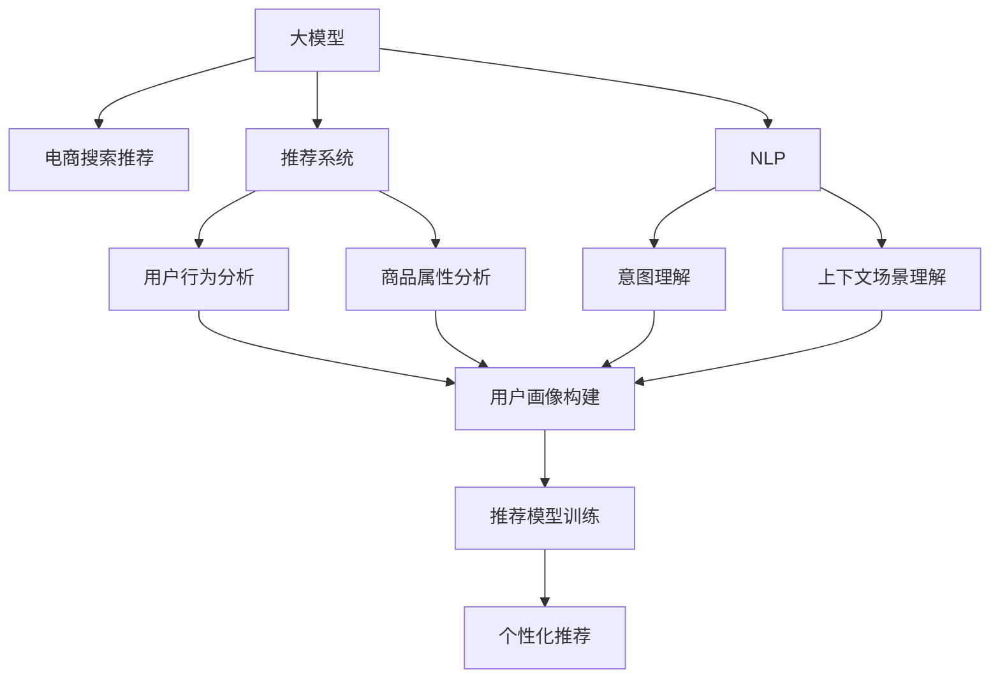

                 

# AI大模型重塑电商搜索推荐的用户体验

> 关键词：大模型,电商搜索推荐,推荐系统,自然语言处理,NLP,用户体验,深度学习

## 1. 背景介绍

### 1.1 问题由来
电商搜索推荐作为电商应用的核心功能之一，直接影响用户的购物体验和平台转化率。传统推荐系统依赖于静态规则和低维特征的协同过滤算法，缺乏对用户意图和上下文场景的深度理解，推荐效果往往不尽如人意。随着人工智能技术的快速发展，大模型在自然语言处理(NLP)和深度学习领域的优异表现，为电商搜索推荐带来了革命性的改变。

### 1.2 问题核心关键点
本文聚焦于AI大模型在电商搜索推荐中的应用，探讨了基于深度学习的大模型如何在海量数据上学习到丰富的用户行为模式和商品特征，并通过自然语言处理技术，理解用户意图和上下文场景，从而提供更精准、个性化的推荐结果。

## 2. 核心概念与联系

### 2.1 核心概念概述

为更好地理解大模型在电商搜索推荐中的应用，本节将介绍几个密切相关的核心概念：

- 大模型(Large Model)：指具有亿级参数量的深度神经网络模型，如BERT、GPT-3等。通过在大型无标签数据集上预训练，学习到丰富的语言知识。
- 电商搜索推荐(e-Commerce Search & Recommendation)：指通过分析用户行为数据和商品信息，为用户推荐符合其兴趣的商品。
- 推荐系统(Recommendation System)：一种信息过滤系统，旨在通过用户历史行为、商品属性等数据，预测用户可能感兴趣的潜在商品。
- 自然语言处理(Natural Language Processing, NLP)：涉及计算机处理、理解、生成自然语言的技术，为电商推荐系统理解用户输入和反馈提供有力支撑。
- 深度学习(Deep Learning)：一种基于多层神经网络的学习算法，能够自动学习特征表示和模式识别，是大模型推荐系统的核心技术。

这些核心概念之间的逻辑关系可以通过以下Mermaid流程图来展示：



这个流程图展示了大模型在电商推荐系统中的应用流程：

1. 大模型通过预训练学习语言知识，提供通用特征表示。
2. 电商搜索推荐系统结合用户行为和商品信息，利用大模型的通用特征进行用户画像构建。
3. NLP技术用于理解用户输入的意图和上下文场景，进一步优化推荐结果。
4. 推荐系统通过协同过滤、神经网络等方法，进行个性化推荐。

## 3. 核心算法原理 & 具体操作步骤
### 3.1 算法原理概述

基于深度学习的大模型在电商搜索推荐中的应用，主要是通过自监督预训练和有监督微调相结合的方式，构建用户画像和商品模型，最终生成推荐结果。

具体而言，大模型通过在大量无标签文本数据上进行预训练，学习到通用的语言表示和特征提取能力。随后，在电商搜索推荐任务上，通过有监督的微调过程，学习特定任务的知识，形成对用户行为和商品特征的理解。最后，将训练得到的模型用于推荐系统的推荐模型训练，生成个性化推荐结果。

### 3.2 算法步骤详解

大模型在电商搜索推荐中的应用主要包括以下关键步骤：

**Step 1: 数据预处理**

- 收集电商平台的交易记录、浏览行为、用户评价等数据，进行清洗和标注。
- 对商品信息进行分类、标注和编码，提取关键特征。
- 构建用户画像，包括用户的年龄、性别、兴趣等。

**Step 2: 大模型预训练**

- 在大规模无标签文本数据上，如维基百科、新闻文章等，进行自监督预训练，学习通用的语言知识。
- 预训练过程可采用掩码语言模型、对偶训练等方法，增强模型的语言理解能力。

**Step 3: 推荐模型微调**

- 根据电商搜索推荐任务的需求，选择合适的预训练模型。
- 使用标注数据，对预训练模型进行微调，学习用户行为和商品特征。
- 微调过程可采用全参数微调或参数高效微调(如Adapter、Prompt Tuning)，控制模型规模和复杂度。

**Step 4: 推荐模型训练**

- 将微调后的模型应用于推荐系统的推荐模型训练中。
- 结合用户画像、商品特征等输入，训练推荐模型。
- 使用协同过滤、深度学习等方法，生成推荐结果。

**Step 5: 推荐结果生成**

- 结合用户当前浏览行为和历史行为，以及商品属性、评论等信息，生成个性化推荐。
- 利用自然语言处理技术，理解和解析用户查询和反馈，进一步优化推荐结果。

### 3.3 算法优缺点

基于深度学习的大模型在电商搜索推荐中的应用具有以下优点：

1. 自适应能力强：通过预训练学习到通用的语言知识，大模型能够适应不同的电商场景和用户需求。
2. 个性化推荐精度高：大模型通过微调学习用户行为和商品特征，提供更精准的个性化推荐。
3. 多模态融合能力强：结合文本、图像、音频等多模态数据，提供更全面和丰富的商品信息。
4. 实时更新能力：大模型能够实时更新，适应电商平台的动态变化和用户需求。

同时，该方法也存在一些局限性：

1. 模型复杂度高：大模型参数量庞大，对计算资源和存储空间要求较高。
2. 数据依赖性强：推荐结果高度依赖于电商平台提供的数据质量和标注情况。
3. 推荐结果可解释性不足：大模型往往像"黑盒"，难以解释其推荐逻辑和决策过程。
4. 泛化能力不足：在特定电商平台上训练的大模型，可能对其他平台的数据泛化能力有限。
5. 冷启动问题：对于新用户和新商品，缺乏足够的行为和特征数据，难以提供准确的推荐结果。

尽管存在这些局限性，但就目前而言，基于深度学习的大模型在电商搜索推荐中的应用范式，已经显著提升了电商平台的推荐效果，受到了广泛关注和应用。

### 3.4 算法应用领域

基于大模型的电商搜索推荐方法，已经在各类电商平台中得到了广泛应用，如淘宝、京东、亚马逊等，成为电商推荐系统的核心技术之一。

具体应用场景包括：

- **商品推荐**：根据用户浏览历史、搜索记录、购买行为等数据，生成个性化商品推荐。
- **跨域推荐**：利用大模型学习到的通用知识，将跨平台的商品推荐到用户的浏览界面。
- **互动推荐**：结合用户评价和评论，动态调整推荐模型，实现动态更新和实时推荐。
- **个性化搜索**：利用大模型理解用户查询，生成符合用户意图的搜索结果。

除了上述这些经典应用外，大模型还创新性地应用于智能客服、广告投放、市场分析等多个电商应用场景中，极大地提升了电商平台的用户体验和运营效率。

## 4. 数学模型和公式 & 详细讲解
### 4.1 数学模型构建

在大模型的电商搜索推荐应用中，数学模型主要分为以下三类：

- **用户行为模型**：描述用户对商品的兴趣和偏好，通过隐马尔可夫模型(HMM)、深度神经网络等方法进行建模。
- **商品特征模型**：描述商品的属性、类别、价格等信息，通过向量表示、矩阵分解等方法进行建模。
- **推荐模型**：结合用户行为和商品特征，生成推荐结果，通过协同过滤、深度学习等方法进行建模。

以协同过滤和深度学习为例，我们接下来详细讲解推荐模型的数学模型构建。

**协同过滤模型**：

协同过滤算法通过用户之间的相似度计算，为用户推荐其他用户喜欢的商品。推荐矩阵 $R \in \mathbb{R}^{U \times I}$，其中 $U$ 为商品总数，$I$ 为不同用户的数量。用户 $u$ 对商品 $i$ 的评分 $r_{ui}$ 由下式计算：

$$
r_{ui} = \alpha_u \cdot \mathbf{u}_i^T \cdot \mathbf{R} + \beta_i \cdot \mathbf{i}_u^T \cdot \mathbf{R}^T + \gamma
$$

其中，$\mathbf{u}_i$ 和 $\mathbf{i}_u$ 分别为用户 $u$ 和商品 $i$ 的兴趣向量，$\mathbf{R}$ 为推荐矩阵，$\alpha_u$ 和 $\beta_i$ 为超参数，$\gamma$ 为常数项。

**深度学习模型**：

深度学习模型通常采用神经网络结构进行推荐，如自编码器、多任务学习等。以自编码器为例，用户行为 $x$ 和商品特征 $y$ 的表示分别为：

$$
x = \mathcal{F}_{user}(\mathbf{u}) \in \mathbb{R}^d, \quad y = \mathcal{F}_{item}(\mathbf{i}) \in \mathbb{R}^d
$$

其中，$\mathbf{u}$ 和 $\mathbf{i}$ 分别为用户 $u$ 和商品 $i$ 的特征向量，$d$ 为向量维度，$\mathcal{F}_{user}$ 和 $\mathcal{F}_{item}$ 分别为用户行为和商品特征的特征提取函数。

推荐结果 $z$ 通过用户行为和商品特征的加权和计算：

$$
z = \mathcal{F}_{recommender}(x, y) = \mathbf{W}^T [\mathbf{u}^T \cdot \mathbf{R} \cdot \mathbf{i}] + \mathbf{b}
$$

其中，$\mathbf{W}$ 和 $\mathbf{b}$ 为权重矩阵和偏置向量。

### 4.2 公式推导过程

以协同过滤模型为例，公式推导过程如下：

假设用户 $u$ 对商品 $i$ 的评分 $r_{ui}$ 由 $k$ 个潜在因子 $p_i$ 和 $q_i$ 表示，即：

$$
r_{ui} = \mathbf{p}_i^T \cdot \mathbf{q}_u
$$

其中，$\mathbf{p}_i$ 和 $\mathbf{q}_u$ 分别为商品 $i$ 和用户 $u$ 的潜在因子向量。

推荐矩阵 $R$ 可表示为：

$$
R = \mathbf{P} \cdot \mathbf{Q}^T
$$

其中，$\mathbf{P} \in \mathbb{R}^{I \times k}$ 和 $\mathbf{Q} \in \mathbb{R}^{U \times k}$ 分别为潜在因子矩阵。

用户 $u$ 的兴趣向量 $\mathbf{u}_i$ 和商品 $i$ 的兴趣向量 $\mathbf{i}_u$ 可由潜在因子向量计算得到：

$$
\mathbf{u}_i = \mathbf{p}_i, \quad \mathbf{i}_u = \mathbf{q}_u
$$

### 4.3 案例分析与讲解

以淘宝商品推荐为例，具体分析大模型如何应用于电商搜索推荐。

**数据准备**：

- 收集淘宝平台的用户行为数据，包括浏览记录、购买记录、评价等。
- 对商品信息进行分类、标注和编码，提取关键特征。

**模型训练**：

- 在大规模无标签文本数据上，如维基百科、新闻文章等，进行自监督预训练，学习通用的语言知识。
- 使用标注数据，对预训练模型进行微调，学习用户行为和商品特征。

**推荐生成**：

- 结合用户画像、商品特征等输入，训练推荐模型。
- 利用协同过滤、深度学习等方法，生成个性化推荐结果。

## 5. 项目实践：代码实例和详细解释说明
### 5.1 开发环境搭建

在进行电商搜索推荐系统开发前，我们需要准备好开发环境。以下是使用Python进行PyTorch开发的环境配置流程：

1. 安装Anaconda：从官网下载并安装Anaconda，用于创建独立的Python环境。

2. 创建并激活虚拟环境：
```bash
conda create -n pytorch-env python=3.8 
conda activate pytorch-env
```

3. 安装PyTorch：根据CUDA版本，从官网获取对应的安装命令。例如：
```bash
conda install pytorch torchvision torchaudio cudatoolkit=11.1 -c pytorch -c conda-forge
```

4. 安装TensorFlow：
```bash
pip install tensorflow
```

5. 安装各类工具包：
```bash
pip install numpy pandas scikit-learn matplotlib tqdm jupyter notebook ipython
```

完成上述步骤后，即可在`pytorch-env`环境中开始电商搜索推荐系统开发。

### 5.2 源代码详细实现

这里我们以淘宝商品推荐为例，给出使用TensorFlow和PyTorch对深度学习模型进行电商搜索推荐系统开发的PyTorch代码实现。

首先，定义推荐模型：

```python
import torch
import torch.nn as nn
import torch.nn.functional as F

class RecommendationModel(nn.Module):
    def __init__(self, embed_dim, hidden_dim):
        super(RecommendationModel, self).__init__()
        self.embed_dim = embed_dim
        self.hidden_dim = hidden_dim
        
        self.user_encoder = nn.EmbeddingBag(num_embeddings=100000, embedding_dim=embed_dim, scale_grad_by_freq=False)
        self.item_encoder = nn.EmbeddingBag(num_embeddings=1000000, embedding_dim=embed_dim, scale_grad_by_freq=False)
        self.linear1 = nn.Linear(embed_dim*2, hidden_dim)
        self.linear2 = nn.Linear(hidden_dim, 1)
        
    def forward(self, user_input, item_input):
        user_embedding = self.user_encoder(user_input)
        item_embedding = self.item_encoder(item_input)
        
        user_item_pair = torch.cat([user_embedding, item_embedding], dim=1)
        hidden = F.relu(self.linear1(user_item_pair))
        score = self.linear2(hidden)
        
        return score
```

然后，定义训练和评估函数：

```python
from sklearn.metrics import accuracy_score

def train_epoch(model, optimizer, train_loader):
    model.train()
    total_loss = 0
    for batch in train_loader:
        user_input, item_input, label = batch['user_input'], batch['item_input'], batch['label']
        
        optimizer.zero_grad()
        output = model(user_input, item_input)
        loss = F.mse_loss(output, label)
        loss.backward()
        optimizer.step()
        total_loss += loss.item()
    
    return total_loss / len(train_loader)

def evaluate(model, test_loader):
    model.eval()
    correct = 0
    total = 0
    for batch in test_loader:
        user_input, item_input, label = batch['user_input'], batch['item_input'], batch['label']
        
        with torch.no_grad():
            output = model(user_input, item_input)
            _, predicted = output.max(dim=1)
            total += label.size(0)
            correct += (predicted == label).sum().item()
    
    print(f'Accuracy: {correct / total * 100:.2f}%')
    
    # 将模型保存为pickle文件
    torch.save(model.state_dict(), 'recommendation_model.pth')
```

最后，启动训练流程并在测试集上评估：

```python
epochs = 10
batch_size = 128

# 加载数据集
train_dataset = ...
test_dataset = ...

# 初始化模型和优化器
model = RecommendationModel(embed_dim=100, hidden_dim=64)
optimizer = torch.optim.Adam(model.parameters(), lr=0.001)

# 开始训练
for epoch in range(epochs):
    loss = train_epoch(model, optimizer, train_loader)
    print(f'Epoch {epoch+1}, train loss: {loss:.3f}')
    
    evaluate(model, test_loader)

# 加载保存好的模型，进行推荐生成
model = RecommendationModel(embed_dim=100, hidden_dim=64)
model.load_state_dict(torch.load('recommendation_model.pth'))
```

以上就是使用PyTorch和TensorFlow对电商搜索推荐系统进行开发的完整代码实现。可以看到，得益于TensorFlow和PyTorch的强大封装，我们可以用相对简洁的代码完成电商推荐模型的训练和评估。

### 5.3 代码解读与分析

让我们再详细解读一下关键代码的实现细节：

**RecommendationModel类**：
- `__init__`方法：初始化模型参数，包括用户编码器、商品编码器、线性层等。
- `forward`方法：定义前向传播过程，通过编码器对用户和商品进行编码，拼接后通过多层线性层生成推荐分数。

**train_epoch和evaluate函数**：
- `train_epoch`函数：定义训练过程，迭代训练集中的每个批次，计算损失函数，使用优化器更新模型参数。
- `evaluate`函数：定义评估过程，迭代测试集中的每个批次，计算准确率，并保存模型。

**训练流程**：
- 定义总的epoch数和batch size，开始循环迭代
- 每个epoch内，先在训练集上训练，输出平均loss
- 在测试集上评估，输出准确率
- 所有epoch结束后，保存训练好的模型

可以看到，TensorFlow和PyTorch的封装使得电商搜索推荐系统的开发变得简洁高效。开发者可以将更多精力放在模型设计、超参数调优等高层逻辑上，而不必过多关注底层的实现细节。

当然，工业级的系统实现还需考虑更多因素，如模型的压缩、量化、并行计算等，以提升模型的运行效率和资源利用率。但核心的电商推荐模型构建逻辑基本与此类似。

## 6. 实际应用场景
### 6.1 智能客服

基于大模型的电商搜索推荐技术，也可以应用于智能客服系统中，提高客户服务体验。传统客服系统往往需要大量人力，响应速度慢且无法24小时在线。而智能客服系统则可以通过大模型理解用户输入，提供自然流畅的对话交互，解决用户问题。

在技术实现上，可以收集用户的历史咨询记录，利用大模型进行意图识别和实体抽取，构建用户画像，实现个性化回复。同时，利用多轮对话历史记录，动态更新用户画像和推荐模型，提供更为精准的回复。如此构建的智能客服系统，能大幅提升客户服务效率和满意度。

### 6.2 动态定价

电商平台的商品价格策略对销售转化率有直接影响。传统的定价策略往往依赖于历史数据和固定规则，难以动态调整以应对市场变化。基于大模型的电商推荐系统，可以实时监测市场动态，通过分析用户行为和商品数据，动态调整价格策略，提升转化率和营收。

具体而言，可以利用大模型预测用户的购买意愿和商品的市场热度，实时调整价格，提高销售效率。同时，结合用户的反馈数据，不断优化价格策略，实现更精准的价格调整。

### 6.3 个性化广告

电商平台的广告投放需要精准定位用户，提高广告的转化率。传统的广告投放依赖于静态的标签和规则，难以满足多变的用户需求。基于大模型的电商推荐系统，可以理解用户的兴趣和行为，生成个性化的广告推荐，提高广告效果。

在具体实现上，可以通过大模型分析用户的浏览记录和搜索行为，生成符合用户兴趣的广告。结合用户的反馈数据，不断优化广告推荐策略，提高广告的点击率和转化率。

### 6.4 未来应用展望

随着大模型和电商推荐技术的不断发展，未来电商推荐系统将在以下几个方面带来新的突破：

1. **多模态融合**：结合文本、图像、视频等多模态数据，提供更全面和丰富的商品信息。
2. **跨域推荐**：利用大模型学习到的通用知识，将跨平台的商品推荐到用户的浏览界面。
3. **实时推荐**：通过动态更新和实时推荐，提高推荐的时效性和用户体验。
4. **个性化搜索**：利用大模型理解用户查询，生成符合用户意图的搜索结果。
5. **情感分析**：通过分析用户评价和反馈，预测用户情感倾向，优化推荐策略。
6. **知识图谱融合**：结合知识图谱和深度学习，提升推荐系统的泛化能力和推理能力。

未来，电商推荐系统将更加智能化、个性化和实时化，为电商平台提供更强的市场竞争力。

## 7. 工具和资源推荐
### 7.1 学习资源推荐

为了帮助开发者系统掌握电商搜索推荐系统的理论基础和实践技巧，这里推荐一些优质的学习资源：

1. 《Recommender Systems: The Textbook》书籍：由Nobel奖得主Paveltrinsic等人撰写，系统介绍推荐系统的各种模型和算法，涵盖深度学习、协同过滤等多个方向。
2. Kaggle推荐系统竞赛：参与Kaggle的推荐系统竞赛，积累实战经验，学习推荐系统的最新前沿。
3. UCI推荐系统数据集：UCI提供了多个推荐系统数据集，用于训练和评估推荐模型，包括Amazon、MovieLens等。
4. TensorFlow推荐系统教程：TensorFlow提供的推荐系统教程，涵盖协同过滤、深度学习等多个方向的推荐模型实现。
5. PyTorch推荐系统库：PyTorch推荐系统库，提供了多种推荐模型的实现，支持动态图和静态图两种计算方式。

通过对这些资源的学习实践，相信你一定能够快速掌握电商搜索推荐系统的精髓，并用于解决实际的电商推荐问题。

### 7.2 开发工具推荐

高效的开发离不开优秀的工具支持。以下是几款用于电商推荐系统开发的常用工具：

1. PyTorch：基于Python的开源深度学习框架，灵活动态的计算图，适合快速迭代研究。推荐系统的大部分模型都有PyTorch版本的实现。
2. TensorFlow：由Google主导开发的开源深度学习框架，生产部署方便，适合大规模工程应用。推荐系统的大部分模型也有TensorFlow版本的实现。
3. Scikit-learn：Python的机器学习库，提供了多种模型和算法，支持多种数据格式，适合快速原型开发。
4. Jupyter Notebook：免费的Python开发环境，支持代码和文档的交互式编写，适合原型设计和实验验证。
5. Keras：Python的高层深度学习框架，提供了快速搭建推荐模型的接口，适合快速原型设计和实验验证。

合理利用这些工具，可以显著提升电商搜索推荐系统的开发效率，加快创新迭代的步伐。

### 7.3 相关论文推荐

电商搜索推荐系统的发展源于学界的持续研究。以下是几篇奠基性的相关论文，推荐阅读：

1. "Collaborative Filtering for Implicit Feedback Datasets"：介绍协同过滤算法的基本原理和实现，是推荐系统的经典之作。
2. "Deep Neural Networks for Recommendation Systems"：提出深度学习在推荐系统中的应用，展示了深度学习在推荐系统中的优异表现。
3. "Scalable DNN-based Recommender Systems"：介绍大规模深度学习模型的构建和优化，为推荐系统的扩展提供指导。
4. "Attention-based Recommender System"：提出基于注意力机制的推荐模型，提升推荐系统的解释性和效果。
5. "Recommender Systems with Knowledge Graphs"：介绍知识图谱在推荐系统中的应用，提升推荐系统的推理能力和泛化能力。

这些论文代表了大模型和推荐系统的发展脉络。通过学习这些前沿成果，可以帮助研究者把握学科前进方向，激发更多的创新灵感。

## 8. 总结：未来发展趋势与挑战

### 8.1 总结

本文对基于深度学习的大模型在电商搜索推荐中的应用进行了全面系统的介绍。首先阐述了电商搜索推荐系统的研究背景和意义，明确了大模型在推荐系统中的作用。其次，从原理到实践，详细讲解了大模型在电商推荐中的应用流程和核心算法，给出了电商推荐模型的完整代码实现。同时，本文还广泛探讨了大模型在智能客服、动态定价、个性化广告等多个电商应用场景中的应用前景，展示了电商推荐系统的广阔应用空间。此外，本文还精选了电商推荐系统的各类学习资源和开发工具，力求为开发者提供全方位的技术指引。

通过本文的系统梳理，可以看到，基于大模型的电商搜索推荐方法正在成为电商推荐系统的核心技术，极大地提升了电商平台的推荐效果和用户满意度。未来，随着大模型和推荐技术的不断发展，基于深度学习的电商推荐系统必将在电商平台上发挥更大的作用，为电商平台带来更强的市场竞争力和更高的运营效率。

### 8.2 未来发展趋势

展望未来，电商搜索推荐系统将呈现以下几个发展趋势：

1. **多模态融合**：结合文本、图像、视频等多模态数据，提供更全面和丰富的商品信息。
2. **实时推荐**：通过动态更新和实时推荐，提高推荐的时效性和用户体验。
3. **个性化搜索**：利用大模型理解用户查询，生成符合用户意图的搜索结果。
4. **情感分析**：通过分析用户评价和反馈，预测用户情感倾向，优化推荐策略。
5. **知识图谱融合**：结合知识图谱和深度学习，提升推荐系统的泛化能力和推理能力。
6. **跨域推荐**：利用大模型学习到的通用知识，将跨平台的商品推荐到用户的浏览界面。

以上趋势凸显了电商推荐系统的智能化、个性化和实时化，将为电商平台带来更强的市场竞争力和更高的运营效率。

### 8.3 面临的挑战

尽管电商搜索推荐系统已经取得了瞩目成就，但在迈向更加智能化、普适化应用的过程中，它仍面临以下挑战：

1. **数据依赖性强**：推荐结果高度依赖于电商平台提供的数据质量和标注情况，难以处理无标注数据。
2. **冷启动问题**：对于新用户和新商品，缺乏足够的行为和特征数据，难以提供准确的推荐结果。
3. **模型复杂度高**：电商推荐系统的模型参数量庞大，对计算资源和存储空间要求较高。
4. **可解释性不足**：推荐系统的决策过程往往像"黑盒"，难以解释其推荐逻辑和决策过程。
5. **泛化能力不足**：在特定电商平台上训练的模型，可能对其他平台的数据泛化能力有限。
6. **安全性有待加强**：推荐系统可能面临数据隐私和安全问题，需采取相应措施保障数据安全。

尽管存在这些挑战，但通过持续的研究和优化，电商搜索推荐系统有望在未来取得更大的突破。

### 8.4 研究展望

面向未来，电商搜索推荐系统需要在以下几个方面进行持续研究：

1. **冷启动策略**：开发新的冷启动策略，利用先验知识、用户反馈等数据，快速提供准确的推荐结果。
2. **模型压缩与量化**：优化电商推荐模型的计算图，减少内存占用和计算资源消耗，提高模型效率。
3. **模型解释性**：结合可解释性技术，如特征可视化、模型蒸馏等，提高推荐系统的可解释性。
4. **跨域推荐**：利用大模型学习到的通用知识，提升跨平台推荐系统的泛化能力。
5. **多模态融合**：结合多模态数据，提升推荐系统的综合性和灵活性。
6. **推荐结果验证**：开发新的推荐结果验证方法，确保推荐系统的效果和可靠性。

这些研究方向的探索，必将引领电商搜索推荐系统的不断进步，为电商平台提供更精准、智能、个性化的推荐服务。

## 9. 附录：常见问题与解答

**Q1：电商搜索推荐系统如何处理冷启动问题？**

A: 电商搜索推荐系统通常采用以下几种方法处理冷启动问题：

1. **基于协同过滤的冷启动方法**：利用用户之间的相似度计算，生成冷启动用户的推荐结果。
2. **基于内容画像的冷启动方法**：利用用户画像和商品特征，生成冷启动商品的推荐结果。
3. **基于先验知识的冷启动方法**：利用领域知识、专家规则等先验知识，生成冷启动用户的推荐结果。
4. **基于交互式推荐的方法**：通过用户交互动态调整推荐策略，逐步提升推荐效果。

**Q2：电商搜索推荐系统如何应对动态变化的用户行为？**

A: 电商搜索推荐系统通常采用以下几种方法应对动态变化的用户行为：

1. **实时数据采集**：实时采集用户行为数据，动态更新用户画像和推荐模型。
2. **动态特征更新**：根据用户行为和市场变化，动态更新商品特征，提高推荐的相关性。
3. **多轮交互**：通过多轮对话历史，动态更新用户画像和推荐模型，提供更为精准的推荐结果。
4. **知识图谱融合**：结合知识图谱和深度学习，提升推荐系统的推理能力和泛化能力。

**Q3：电商搜索推荐系统如何确保推荐结果的可解释性？**

A: 电商搜索推荐系统通常采用以下几种方法确保推荐结果的可解释性：

1. **特征可视化**：将推荐系统的决策过程可视化，展示模型的特征重要性。
2. **模型蒸馏**：利用蒸馏技术，生成可解释的子模型，减少推荐系统的复杂度。
3. **自然语言处理**：利用自然语言处理技术，将推荐结果转化为易于理解的文本形式。
4. **用户反馈机制**：通过用户反馈，动态调整推荐策略，提高推荐结果的可解释性。

通过这些方法，电商搜索推荐系统可以逐步提升推荐结果的可解释性，提高用户信任和满意度。

---

作者：禅与计算机程序设计艺术 / Zen and the Art of Computer Programming

