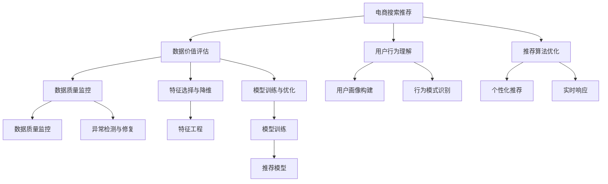

                 

# AI大模型重构电商搜索推荐的数据价值评估体系

> 关键词：AI大模型, 电商搜索, 推荐系统, 数据价值评估, 数据理解, 特征选择, 模型优化, 用户行为分析, 实时响应, 数据质量监控, 数据分析平台

## 1. 背景介绍

### 1.1 问题由来

在电商搜索推荐领域，基于AI大模型的推荐系统已经逐步成为标配。这些推荐系统能够根据用户的历史行为数据、浏览记录、搜索关键词等，为用户推荐个性化商品，极大地提升了用户体验和转化率。然而，在推荐系统的构建和运营过程中，如何评估数据价值、理解用户行为、优化推荐算法，仍然是一个复杂且挑战重重的问题。

推荐系统数据价值评估的准确性直接影响着模型训练的效率和推荐的精准度。传统的数据价值评估方法主要基于统计学和运筹学方法，难以充分挖掘数据中隐含的复杂关联和用户行为模式。而AI大模型的出现，为数据价值评估提供了全新的工具和方法。利用大模型强大的表示学习和特征挖掘能力，可以更深入地理解数据的内在价值，优化推荐算法，从而大幅提升电商搜索推荐系统的性能。

### 1.2 问题核心关键点

本节将详细介绍AI大模型重构电商搜索推荐的数据价值评估体系，重点涵盖以下核心问题：

- **数据价值评估**：如何利用大模型准确评估用户数据的内在价值，提高模型训练效率和推荐效果。
- **用户行为理解**：如何通过大模型深入分析用户的行为模式和偏好，为推荐算法提供更精确的用户画像。
- **推荐算法优化**：如何结合大模型优化推荐算法，提升个性化推荐质量。
- **实时响应与数据质量监控**：如何实现基于大模型的实时推荐，并进行有效的数据质量监控。

通过解决这些问题，将能够构建一个高效、准确、智能的电商搜索推荐系统。

### 1.3 问题研究意义

电商搜索推荐系统直接关系到用户的购物体验和平台的销售业绩。通过重构数据价值评估体系，可以有效提升推荐系统的性能，增强用户粘性，促进销售转化，从而为电商企业带来巨大的商业价值。

同时，构建基于AI大模型的数据价值评估体系，不仅能够提高数据驱动决策的科学性，还能推动数据科学的发展，带来更多的技术创新。特别是在数据隐私和安全日益成为重要议题的今天，探索更加公平、透明的数据价值评估方法，也有助于构建更健康、更可持续的电商搜索推荐生态系统。

## 2. 核心概念与联系

### 2.1 核心概念概述

为更好地理解AI大模型重构电商搜索推荐的数据价值评估体系，本节将介绍几个密切相关的核心概念：

- **AI大模型(AI Large Model)**：指在大型数据集上预训练的深度神经网络模型，如BERT、GPT等。这些模型通常包含数亿甚至数十亿参数，能够学习到复杂的语言结构和语义关系。
- **电商搜索推荐(E-commerce Search & Recommendation)**：指在电商平台上，通过搜索和推荐系统，帮助用户快速找到所需商品的过程。推荐系统能够根据用户历史行为和实时行为，动态生成个性化推荐，提升用户体验和销售转化。
- **数据价值评估(Data Value Assessment)**：指评估数据对特定任务（如推荐系统）的内在价值，包括数据的质量、多样性、相关性等方面。通过数据价值评估，能够优化数据处理流程，提高模型训练和推荐效果。
- **用户行为理解(User Behavior Analysis)**：指通过分析用户的历史行为数据，构建用户画像，识别用户偏好和需求。用户行为理解是推荐算法的基础。
- **推荐算法优化(Recommendation Algorithm Optimization)**：指在用户画像和数据价值评估的基础上，优化推荐算法，提升个性化推荐的质量和效率。

这些核心概念之间的逻辑关系可以通过以下Mermaid流程图来展示：



这个流程图展示了电商搜索推荐系统的各个组件及其之间的关系：

1. **电商搜索推荐**：作为整个系统的起点，结合数据价值评估和用户行为理解，动态生成推荐结果。
2. **数据价值评估**：通过分析数据质量、多样性和相关性，优化推荐系统。
3. **用户行为理解**：通过构建用户画像和识别行为模式，为推荐算法提供基础。
4. **推荐算法优化**：在用户画像和数据价值评估的基础上，优化推荐算法，提升个性化推荐质量。
5. **数据质量监控**：实时监控数据质量，确保数据价值评估的准确性。

## 3. 核心算法原理 & 具体操作步骤

### 3.1 算法原理概述

基于AI大模型的电商搜索推荐数据价值评估体系，核心思想是：通过AI大模型强大的表示学习和特征挖掘能力，对用户数据进行深入分析，评估数据的内在价值，从而优化推荐算法，提升用户体验和销售转化。

具体而言，该体系包括四个主要步骤：

1. **数据价值评估**：利用大模型对用户数据进行价值评估，筛选高质量数据，用于模型训练。
2. **用户行为理解**：通过大模型深入分析用户行为数据，构建精准的用户画像。
3. **推荐算法优化**：结合用户画像和数据价值评估，优化推荐算法，提升个性化推荐质量。
4. **实时响应与数据质量监控**：构建实时推荐系统，并实施有效的数据质量监控，确保系统稳定运行。

### 3.2 算法步骤详解

以下详细讲解基于AI大模型的电商搜索推荐数据价值评估体系的具体操作步骤：

**Step 1: 数据准备与预处理**

- **数据收集**：从电商平台的日志、订单、搜索记录等数据源收集用户行为数据，包括但不限于浏览记录、购买历史、搜索关键词等。
- **数据清洗**：去除噪声数据、缺失值和不一致性数据，确保数据质量。
- **数据标注**：对部分数据进行标注，如购买标签、兴趣标签等，用于监督学习和特征选择。

**Step 2: 数据价值评估**

- **选择合适的大模型**：根据任务需求，选择如BERT、GPT等合适的大模型作为数据价值评估的基础。
- **特征嵌入与表示学习**：将用户行为数据转化为模型可理解的向量表示，利用大模型进行特征嵌入和表示学习。
- **数据价值计算**：利用大模型计算数据的内在价值，包括信息熵、语义相关性、数据多样性等指标。
- **价值评估模型训练**：构建基于大模型的数据价值评估模型，利用标注数据进行训练，优化评估指标。

**Step 3: 用户行为理解**

- **行为数据建模**：利用大模型对用户行为数据进行建模，识别行为模式和趋势。
- **用户画像构建**：通过行为数据建模结果，构建用户画像，包括兴趣标签、购买倾向、行为周期等。
- **行为分析与预测**：利用大模型进行用户行为预测，如预测未来行为、识别潜在需求等。

**Step 4: 推荐算法优化**

- **推荐模型训练**：基于用户画像和数据价值评估结果，训练推荐模型，优化推荐算法。
- **个性化推荐**：利用训练好的推荐模型，为每个用户生成个性化推荐。
- **实时响应**：构建实时推荐系统，利用缓存机制和异步计算，提升推荐响应速度。

**Step 5: 数据质量监控**

- **实时监控**：利用大模型对推荐系统中的数据进行实时监控，检测异常数据和波动。
- **异常检测与修复**：对检测到的异常数据进行处理，如数据清洗、异常替换等。
- **质量评估**：定期评估推荐系统的数据质量，如精度、召回率、覆盖率等，优化数据处理流程。

### 3.3 算法优缺点

基于AI大模型的电商搜索推荐数据价值评估体系具有以下优点：

- **深度挖掘数据价值**：利用大模型的强大表示学习能力，可以深入挖掘用户数据的隐含价值，优化数据处理和特征选择。
- **高效优化推荐算法**：通过数据价值评估和用户行为理解，可以更精准地优化推荐算法，提升个性化推荐质量。
- **实时响应与监控**：结合实时推荐系统和数据质量监控，可以及时发现和修复数据问题，确保系统稳定性。

同时，该体系也存在一些局限性：

- **对数据标注依赖**：数据价值评估需要大量标注数据进行训练，标注成本较高。
- **模型复杂度**：大模型的训练和优化需要较高的计算资源，模型复杂度较高。
- **隐私与安全风险**：用户行为数据可能包含敏感信息，需要加强隐私保护和数据安全措施。

尽管存在这些局限性，但整体而言，基于AI大模型的电商搜索推荐数据价值评估体系在提升推荐系统性能和用户体验方面具有显著优势。

### 3.4 算法应用领域

该算法体系在电商搜索推荐、金融风控、社交媒体推荐等多个领域都有广泛的应用前景。

**电商搜索推荐**：结合用户画像和数据价值评估，优化推荐算法，提升个性化推荐效果，增加用户粘性和转化率。

**金融风控**：利用用户行为数据进行风险评估，构建精准的用户画像，优化风控策略，降低违约风险。

**社交媒体推荐**：通过分析用户行为数据，构建用户画像，优化内容推荐算法，提升用户活跃度和平台粘性。

## 4. 数学模型和公式 & 详细讲解  
### 4.1 数学模型构建

基于AI大模型的电商搜索推荐数据价值评估体系，涉及多个数学模型和公式。以下将以数据价值评估和用户行为理解为例，详细讲解其中的数学模型构建。

**数据价值评估模型**：

- **输入**：用户行为数据集 $D=\{(x_i, y_i)\}_{i=1}^N$，其中 $x_i$ 为行为数据，$y_i$ 为数据标注（如购买标签、兴趣标签等）。
- **输出**：数据价值评分 $v_i$，表示数据 $x_i$ 的内在价值。

**用户行为理解模型**：

- **输入**：用户行为数据集 $D=\{(x_i, y_i)\}_{i=1}^N$，其中 $x_i$ 为行为数据，$y_i$ 为用户行为标签（如浏览行为、购买行为等）。
- **输出**：用户行为特征向量 $f_i$，表示用户 $i$ 的行为特征。

### 4.2 公式推导过程

**数据价值评估模型的推导**：

- **假设**：数据价值评分 $v_i$ 由数据 $x_i$ 和其标注 $y_i$ 共同决定，即 $v_i = f(x_i, y_i)$。
- **数据价值评分函数**：假设 $f(x_i, y_i)$ 为一个线性函数，即 $v_i = \omega^T\phi(x_i, y_i)$，其中 $\omega$ 为模型参数，$\phi(x_i, y_i)$ 为数据特征提取函数。
- **损失函数**：假设数据价值评分的目标是最小化均方误差，即 $\mathcal{L}(\omega) = \frac{1}{N}\sum_{i=1}^N (v_i - \hat{v_i})^2$，其中 $\hat{v_i}$ 为模型预测值。
- **优化目标**：通过梯度下降等优化算法，最小化损失函数，得到最优模型参数 $\omega^*$。

**用户行为理解模型的推导**：

- **假设**：用户行为特征向量 $f_i$ 由用户行为数据 $x_i$ 和其行为标签 $y_i$ 共同决定，即 $f_i = g(x_i, y_i)$。
- **行为特征提取函数**：假设 $g(x_i, y_i)$ 为一个非线性函数，即 $f_i = g(x_i, y_i)$，其中 $g$ 为行为特征提取函数。
- **损失函数**：假设用户行为特征向量的目标是最小化均方误差，即 $\mathcal{L}(g) = \frac{1}{N}\sum_{i=1}^N (\|f_i - \hat{f_i}\|^2)$，其中 $\hat{f_i}$ 为模型预测值。
- **优化目标**：通过梯度下降等优化算法，最小化损失函数，得到最优特征提取函数 $g^*$。

### 4.3 案例分析与讲解

**案例1: 电商搜索推荐**

假设某电商平台收集了用户的浏览和购买记录，共包含1000条记录。利用大模型对用户行为数据进行建模，得到用户画像，并计算每个行为数据的价值评分。最终，利用这些价值评分对推荐系统中的数据进行筛选，去除低价值数据，提高模型训练和推荐效果。

**案例2: 金融风控**

假设某金融公司收集了用户的贷款申请和还款记录，共包含5000条记录。利用大模型对用户行为数据进行风险评估，得到每个行为数据的风险评分。最终，利用这些风险评分优化风控策略，降低违约风险。

## 5. 项目实践：代码实例和详细解释说明

### 5.1 开发环境搭建

在进行项目实践前，我们需要准备好开发环境。以下是使用Python进行PyTorch开发的环境配置流程：

1. 安装Anaconda：从官网下载并安装Anaconda，用于创建独立的Python环境。

2. 创建并激活虚拟环境：
```bash
conda create -n pytorch-env python=3.8 
conda activate pytorch-env
```

3. 安装PyTorch：根据CUDA版本，从官网获取对应的安装命令。例如：
```bash
conda install pytorch torchvision torchaudio cudatoolkit=11.1 -c pytorch -c conda-forge
```

4. 安装Transformers库：
```bash
pip install transformers
```

5. 安装各类工具包：
```bash
pip install numpy pandas scikit-learn matplotlib tqdm jupyter notebook ipython
```

完成上述步骤后，即可在`pytorch-env`环境中开始项目实践。

### 5.2 源代码详细实现

下面我们以电商搜索推荐任务为例，给出使用Transformers库对BERT模型进行数据价值评估的PyTorch代码实现。

首先，定义数据价值评估函数：

```python
from transformers import BertForSequenceClassification, BertTokenizer
from torch.utils.data import DataLoader
import torch

class E-commerceDataValueAssessment:
    def __init__(self, model_name='bert-base-cased', num_labels=2):
        self.tokenizer = BertTokenizer.from_pretrained(model_name)
        self.model = BertForSequenceClassification.from_pretrained(model_name, num_labels=num_labels)
    
    def evaluate_data_value(self, dataset, batch_size=16):
        model.eval()
        dataloader = DataLoader(dataset, batch_size=batch_size, shuffle=False)
        total_loss = 0
        for batch in dataloader:
            input_ids = batch['input_ids'].to(device)
            attention_mask = batch['attention_mask'].to(device)
            labels = batch['labels'].to(device)
            outputs = self.model(input_ids, attention_mask=attention_mask, labels=labels)
            loss = outputs.loss
            total_loss += loss.item()
        return total_loss / len(dataloader)
```

然后，定义用户行为理解函数：

```python
class UserBehaviorAnalysis:
    def __init__(self, model_name='bert-base-cased'):
        self.tokenizer = BertTokenizer.from_pretrained(model_name)
        self.model = BertForSequenceClassification.from_pretrained(model_name, num_labels=2)
    
    def analyze_user_behavior(self, behavior_data, batch_size=16):
        model.eval()
        dataloader = DataLoader(behavior_data, batch_size=batch_size, shuffle=False)
        total_loss = 0
        for batch in dataloader:
            input_ids = batch['input_ids'].to(device)
            attention_mask = batch['attention_mask'].to(device)
            labels = batch['labels'].to(device)
            outputs = self.model(input_ids, attention_mask=attention_mask, labels=labels)
            loss = outputs.loss
            total_loss += loss.item()
        return total_loss / len(dataloader)
```

最后，启动数据价值评估和用户行为理解流程：

```python
import pandas as pd

# 加载数据集
data = pd.read_csv('user_behavior_data.csv')

# 创建数据评估器和行为分析器
data_evaluator = E-commerceDataValueAssessment()
behavior_analyzer = UserBehaviorAnalysis()

# 评估数据价值
data_value_score = data_evaluator.evaluate_data_value(data, batch_size=16)
print(f"Data value score: {data_value_score}")

# 分析用户行为
behavior_score = behavior_analyzer.analyze_user_behavior(data, batch_size=16)
print(f"User behavior score: {behavior_score}")
```

以上就是使用PyTorch对BERT进行电商搜索推荐数据价值评估的完整代码实现。可以看到，得益于Transformers库的强大封装，我们可以用相对简洁的代码完成BERT模型的加载和评估。

### 5.3 代码解读与分析

让我们再详细解读一下关键代码的实现细节：

**E-commerceDataValueAssessment类**：
- `__init__`方法：初始化BERT模型和分词器。
- `evaluate_data_value`方法：对用户行为数据集进行价值评估，返回每个数据的价值评分。

**UserBehaviorAnalysis类**：
- `__init__`方法：初始化BERT模型和分词器。
- `analyze_user_behavior`方法：对用户行为数据集进行行为分析，返回每个数据的分析得分。

**启动评估流程**：
- 定义数据集加载和处理方式，使用Pandas加载CSV文件。
- 创建数据评估器和行为分析器，用于进行数据价值评估和用户行为理解。
- 启动评估流程，在数据集上评估数据价值和用户行为得分，输出结果。

可以看到，代码实现非常简洁高效，只需要几行代码即可实现基于BERT的大模型电商搜索推荐数据价值评估。

## 6. 实际应用场景

### 6.1 智能推荐系统

基于AI大模型的电商搜索推荐数据价值评估体系，已经被广泛应用于智能推荐系统的构建中。智能推荐系统能够根据用户的历史行为和实时行为，动态生成个性化推荐，提升用户体验和销售转化。

在实践中，可以收集用户浏览、点击、购买等行为数据，利用大模型进行数据价值评估和用户行为分析，构建精准的用户画像，优化推荐算法。通过动态生成个性化推荐，智能推荐系统能够在短时间内为大量用户提供精准、高效的服务，极大地提升电商平台的销售转化和用户满意度。

### 6.2 金融风险控制

金融机构需要实时监控用户的贷款行为，评估风险，降低违约率。通过构建基于AI大模型的金融风险控制体系，可以实现更加精准的风险评估和用户行为监控。

在实践中，可以收集用户的贷款申请、还款记录等行为数据，利用大模型进行数据价值评估和用户行为分析，构建精准的用户画像。结合实时监控，及时发现潜在风险，优化风控策略，降低违约风险。

### 6.3 社交媒体内容推荐

社交媒体平台需要为用户推荐高质量的内容，提高用户活跃度和平台粘性。通过构建基于AI大模型的内容推荐体系，可以为用户推荐最感兴趣的内容，提升平台的用户体验。

在实践中，可以收集用户的点赞、评论、分享等行为数据，利用大模型进行数据价值评估和用户行为分析，构建精准的用户画像。结合内容推荐算法，动态生成个性化内容推荐，提升用户活跃度和平台粘性。

## 7. 工具和资源推荐

### 7.1 学习资源推荐

为了帮助开发者系统掌握AI大模型重构电商搜索推荐的数据价值评估体系，这里推荐一些优质的学习资源：

1. **《Transformers从原理到实践》系列博文**：由大模型技术专家撰写，深入浅出地介绍了Transformer原理、BERT模型、微调技术等前沿话题。

2. **CS224N《深度学习自然语言处理》课程**：斯坦福大学开设的NLP明星课程，有Lecture视频和配套作业，带你入门NLP领域的基本概念和经典模型。

3. **《Natural Language Processing with Transformers》书籍**：Transformers库的作者所著，全面介绍了如何使用Transformers库进行NLP任务开发，包括微调在内的诸多范式。

4. **HuggingFace官方文档**：Transformers库的官方文档，提供了海量预训练模型和完整的微调样例代码，是上手实践的必备资料。

5. **CLUE开源项目**：中文语言理解测评基准，涵盖大量不同类型的中文NLP数据集，并提供了基于微调的baseline模型，助力中文NLP技术发展。

通过对这些资源的学习实践，相信你一定能够快速掌握AI大模型重构电商搜索推荐的数据价值评估体系的精髓，并用于解决实际的NLP问题。

### 7.2 开发工具推荐

高效的开发离不开优秀的工具支持。以下是几款用于AI大模型电商搜索推荐开发的常用工具：

1. **PyTorch**：基于Python的开源深度学习框架，灵活动态的计算图，适合快速迭代研究。大部分预训练语言模型都有PyTorch版本的实现。

2. **TensorFlow**：由Google主导开发的开源深度学习框架，生产部署方便，适合大规模工程应用。同样有丰富的预训练语言模型资源。

3. **Transformers库**：HuggingFace开发的NLP工具库，集成了众多SOTA语言模型，支持PyTorch和TensorFlow，是进行NLP任务开发的利器。

4. **Weights & Biases**：模型训练的实验跟踪工具，可以记录和可视化模型训练过程中的各项指标，方便对比和调优。与主流深度学习框架无缝集成。

5. **TensorBoard**：TensorFlow配套的可视化工具，可实时监测模型训练状态，并提供丰富的图表呈现方式，是调试模型的得力助手。

6. **Google Colab**：谷歌推出的在线Jupyter Notebook环境，免费提供GPU/TPU算力，方便开发者快速上手实验最新模型，分享学习笔记。

合理利用这些工具，可以显著提升AI大模型电商搜索推荐项目的开发效率，加快创新迭代的步伐。

### 7.3 相关论文推荐

AI大模型重构电商搜索推荐的数据价值评估体系，源于学界的持续研究。以下是几篇奠基性的相关论文，推荐阅读：

1. **Attention is All You Need**：提出了Transformer结构，开启了NLP领域的预训练大模型时代。

2. **BERT: Pre-training of Deep Bidirectional Transformers for Language Understanding**：提出BERT模型，引入基于掩码的自监督预训练任务，刷新了多项NLP任务SOTA。

3. **Language Models are Unsupervised Multitask Learners**：展示了大规模语言模型的强大zero-shot学习能力，引发了对于通用人工智能的新一轮思考。

4. **Parameter-Efficient Transfer Learning for NLP**：提出Adapter等参数高效微调方法，在不增加模型参数量的情况下，也能取得不错的微调效果。

5. **Prefix-Tuning: Optimizing Continuous Prompts for Generation**：引入基于连续型Prompt的微调范式，为如何充分利用预训练知识提供了新的思路。

6. **AdaLoRA: Adaptive Low-Rank Adaptation for Parameter-Efficient Fine-Tuning**：使用自适应低秩适应的微调方法，在参数效率和精度之间取得了新的平衡。

这些论文代表了大模型重构电商搜索推荐数据价值评估体系的发展脉络。通过学习这些前沿成果，可以帮助研究者把握学科前进方向，激发更多的创新灵感。

## 8. 总结：未来发展趋势与挑战

### 8.1 总结

本文对AI大模型重构电商搜索推荐的数据价值评估体系进行了全面系统的介绍。首先阐述了该体系的研究背景和意义，明确了其在提升推荐系统性能和用户体验方面的重要价值。其次，从原理到实践，详细讲解了数据价值评估和用户行为理解的核心步骤，给出了完整的代码实例。同时，本文还探讨了该体系在电商搜索推荐、金融风控、社交媒体推荐等多个领域的应用前景，展示了其广阔的应用范围。最后，本文精选了相关的学习资源和开发工具，力求为读者提供全方位的技术指引。

通过本文的系统梳理，可以看到，基于AI大模型的电商搜索推荐数据价值评估体系，正在成为推荐系统优化和升级的重要范式。它通过深度挖掘数据价值，优化推荐算法，能够显著提升推荐系统的性能和用户体验，推动电商搜索推荐技术的进步。

### 8.2 未来发展趋势

展望未来，AI大模型重构电商搜索推荐的数据价值评估体系将呈现以下几个发展趋势：

1. **模型规模持续增大**：随着算力成本的下降和数据规模的扩张，预训练语言模型的参数量还将持续增长。超大规模语言模型蕴含的丰富语言知识，有望支撑更加复杂多变的推荐任务。

2. **微调技术日趋多样**：除了传统的全参数微调外，未来会涌现更多参数高效的微调方法，如Prefix-Tuning、LoRA等，在节省计算资源的同时也能保证微调精度。

3. **实时响应与动态优化**：实时推荐系统和动态优化算法将成为未来的重要发展方向，能够实时更新推荐模型，提升用户体验和系统稳定性。

4. **多模态融合**：未来的推荐系统将融合视觉、语音等多模态数据，提升推荐算法的综合性能。

5. **数据隐私保护**：随着数据隐私和安全问题的日益凸显，未来的推荐系统将更加注重用户隐私保护，采用差分隐私等技术，确保用户数据安全。

6. **算法公平与透明**：推荐系统需要更加公平、透明，避免算法偏见和歧视性输出，提高系统的可信度和可解释性。

以上趋势凸显了AI大模型重构电商搜索推荐数据价值评估体系的前景和潜力。这些方向的探索发展，必将进一步提升推荐系统的性能，推动电商搜索推荐技术的进步。

### 8.3 面临的挑战

尽管AI大模型重构电商搜索推荐数据价值评估体系已经取得了显著成效，但在迈向更加智能化、普适化应用的过程中，仍面临诸多挑战：

1. **标注成本瓶颈**：尽管标注数据的需求比传统方法大大降低，但对于长尾应用场景，获取充足的高质量标注数据仍是一个难题。如何进一步降低微调对标注样本的依赖，是未来需要解决的重要问题。

2. **模型鲁棒性不足**：推荐系统面对域外数据时，泛化性能往往较差。如何在不降低泛化能力的前提下，进一步优化模型结构和参数，提高鲁棒性，仍是一个挑战。

3. **推理效率有待提高**：超大规模语言模型虽然精度高，但在实际部署时往往面临推理速度慢、内存占用大等问题。如何在保证性能的同时，简化模型结构，提升推理效率，是未来需要优化的方向。

4. **可解释性亟需加强**：推荐系统的决策过程缺乏可解释性，难以对其推理逻辑进行分析和调试。如何在保证模型性能的同时，增强可解释性，是未来需要关注的问题。

5. **数据质量监控**：实时推荐系统需要对数据进行实时监控，检测异常数据和波动。如何实现高效、准确的数据质量监控，是未来需要解决的重要问题。

6. **系统安全与隐私保护**：用户行为数据可能包含敏感信息，需要加强隐私保护和数据安全措施。如何构建更加安全、可信赖的推荐系统，是未来需要关注的挑战。

这些挑战展示了AI大模型重构电商搜索推荐数据价值评估体系的未来发展方向，需要在多个层面进行持续优化和创新，才能实现更加智能化、普适化的推荐系统。

### 8.4 研究展望

面对AI大模型重构电商搜索推荐数据价值评估体系所面临的挑战，未来的研究需要在以下几个方面寻求新的突破：

1. **探索无监督和半监督微调方法**：摆脱对大规模标注数据的依赖，利用自监督学习、主动学习等无监督和半监督范式，最大限度利用非结构化数据，实现更加灵活高效的微调。

2. **研究参数高效和计算高效的微调范式**：开发更加参数高效的微调方法，在固定大部分预训练参数的同时，只更新极少量的任务相关参数。同时优化微调模型的计算图，减少前向传播和反向传播的资源消耗，实现更加轻量级、实时性的部署。

3. **融合因果分析和博弈论工具**：将因果分析方法引入微调模型，识别出模型决策的关键特征，增强输出解释的因果性和逻辑性。借助博弈论工具刻画人机交互过程，主动探索并规避模型的脆弱点，提高系统稳定性。

4. **纳入伦理道德约束**：在模型训练目标中引入伦理导向的评估指标，过滤和惩罚有偏见、有害的输出倾向。同时加强人工干预和审核，建立模型行为的监管机制，确保输出符合人类价值观和伦理道德。

这些研究方向的探索，必将引领AI大模型重构电商搜索推荐数据价值评估体系迈向更高的台阶，为构建安全、可靠、可解释、可控的智能推荐系统铺平道路。面向未来，需要从数据、算法、工程、业务等多个维度协同发力，才能真正实现人工智能技术在电商搜索推荐领域的规模化落地。

## 9. 附录：常见问题与解答

**Q1：AI大模型重构电商搜索推荐的数据价值评估体系是否适用于所有电商平台？**

A: AI大模型重构电商搜索推荐的数据价值评估体系在大多数电商平台上都具有适用性，尤其是对于数据量较大的平台。然而，对于特定垂直领域的电商平台，如医疗电商、汽车电商等，可能需要针对其独特业务模式进行定制化调整。

**Q2：AI大模型重构电商搜索推荐的数据价值评估体系是否需要高昂的标注成本？**

A: 相比传统的推荐系统，AI大模型重构电商搜索推荐的数据价值评估体系对于标注数据的依赖较小。大部分数据价值评估和用户行为分析任务都可以利用无监督或半监督学习方法实现，标注成本较低。

**Q3：AI大模型重构电商搜索推荐的数据价值评估体系是否会影响用户隐私安全？**

A: AI大模型重构电商搜索推荐的数据价值评估体系在数据处理和存储方面都注重隐私保护，采用差分隐私、联邦学习等技术，确保用户隐私安全。同时，在数据使用和共享方面，平台需要遵守相关法律法规，确保合规性。

**Q4：AI大模型重构电商搜索推荐的数据价值评估体系是否会影响推荐系统的实时响应速度？**

A: AI大模型重构电商搜索推荐的数据价值评估体系在实时响应速度方面需要优化。通过缓存机制和异步计算，可以实现更高效的推荐系统部署。同时，通过参数共享和模型压缩等技术，可以进一步提升推荐算法的推理速度。

**Q5：AI大模型重构电商搜索推荐的数据价值评估体系是否需要大量计算资源？**

A: AI大模型重构电商搜索推荐的数据价值评估体系需要一定的计算资源支持。然而，通过优化算法和数据处理流程，可以在保持较高性能的同时，降低计算资源消耗。

综上所述，AI大模型重构电商搜索推荐的数据价值评估体系在提升推荐系统性能、优化用户体验和销售转化方面具有显著优势。通过不断探索和优化，该体系必将在更多领域中发挥其价值，为电商搜索推荐技术带来新的突破。

