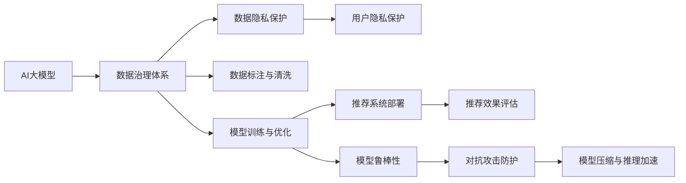

                 

## 1. 背景介绍

### 1.1 问题由来

随着电商市场竞争的加剧，各大电商平台纷纷利用数据驱动技术提升用户体验和商业价值。其中，基于AI的个性化搜索推荐系统成为各大电商平台的核心竞争力之一。传统推荐系统主要采用基于协同过滤、内容相似性匹配等算法，但在大规模数据处理和个性化推荐精度方面存在显著不足。近年来，AI大模型技术逐渐应用于搜索推荐领域，推动了个性化推荐的进一步发展。

但与此同时，大模型的使用也带来了新的挑战，如数据隐私保护、数据治理、模型鲁棒性、跨领域适应性等问题。如何在大模型应用中构建完善的数据治理体系，是推动AI大模型在电商搜索推荐等领域进一步落地和应用的关键。

### 1.2 问题核心关键点

基于AI大模型的电商搜索推荐系统，其核心在于如何构建高效的数据治理体系，提升推荐系统精度，同时保障数据隐私和模型鲁棒性。具体而言，包括以下几个关键点：

1. **数据隐私保护**：在保证用户数据隐私的前提下，充分利用大模型进行个性化推荐。
2. **数据治理机制**：构建规范化的数据采集、存储、标注流程，确保数据质量。
3. **模型鲁棒性**：训练鲁棒性高的推荐模型，避免在异常数据或对抗攻击下的性能退化。
4. **跨领域适应性**：使推荐系统在不同电商领域和应用场景中具有良好的泛化能力。
5. **资源效率**：在大模型应用中，如何实现模型的压缩、推理加速等资源优化，减少算力成本。

## 2. 核心概念与联系

### 2.1 核心概念概述

为了深入理解基于AI大模型的电商搜索推荐系统及其数据治理体系，我们需要首先了解一些核心概念：

- **AI大模型**：指基于深度学习技术构建的庞大神经网络模型，如BERT、GPT等，能够在大规模无标签数据上进行预训练，学习到丰富的语言和知识表示。
- **个性化推荐系统**：通过分析用户的历史行为数据，推荐符合用户兴趣的商品或服务。
- **数据治理**：对数据进行全面、规范的管理和控制，确保数据的完整性、安全性和可用性。
- **隐私保护**：在数据处理和分析过程中，保护用户隐私，避免数据泄露和滥用。
- **鲁棒性**：模型在不同数据分布、异常值、对抗攻击等情况下，仍能保持稳定和可靠。
- **跨领域适应性**：模型能够在不同领域和应用场景中适应和泛化，提升通用性。
- **资源优化**：通过模型压缩、推理加速等技术，提高算力和存储资源的利用效率。

这些核心概念之间存在紧密的联系。AI大模型是推荐系统的基础，通过数据治理体系构建，训练鲁棒性高、跨领域适应性强的推荐模型。隐私保护和资源优化则是保证推荐系统长期稳定运行的重要保障。

### 2.2 核心概念原理和架构的 Mermaid 流程图



该流程图展示了AI大模型在电商搜索推荐系统中的应用和数据治理体系的结构。其中，数据治理体系是整个系统的核心，涵盖了数据隐私保护、标注与清洗、模型训练与优化等多个方面。通过这一体系，构建的推荐系统不仅能够提供个性化推荐，还能保障用户隐私和数据安全，提升模型的鲁棒性和跨领域适应性，同时进行资源优化，提升系统效率。

## 3. 核心算法原理 & 具体操作步骤

### 3.1 算法原理概述

基于AI大模型的电商搜索推荐系统，其核心算法包括推荐模型训练、推荐策略设计、用户反馈处理等。以下是对这些核心算法的详细阐述：

1. **推荐模型训练**：利用AI大模型进行个性化推荐，训练推荐模型以学习用户兴趣和行为模式。
2. **推荐策略设计**：根据推荐模型的输出，设计推荐策略以指导推荐系统的工作流程。
3. **用户反馈处理**：根据用户对推荐结果的反馈，调整推荐模型和策略，进一步提升推荐效果。

### 3.2 算法步骤详解

#### 3.2.1 数据采集与预处理

1. **数据采集**：收集用户行为数据，如浏览记录、点击记录、购买记录等。
2. **数据清洗**：去除噪音数据和重复数据，处理缺失值和异常值。
3. **特征工程**：将原始数据转换为模型能够理解的特征表示，如用户ID、商品ID、时间戳、地理位置等。

#### 3.2.2 模型训练与优化

1. **模型选择**：选择合适的AI大模型作为推荐模型的基础，如BERT、GPT等。
2. **模型微调**：在大模型基础上进行微调，学习用户行为特征和商品属性。
3. **参数优化**：使用优化算法如Adam、SGD等进行模型参数优化，确保模型收敛。
4. **模型评估**：在验证集上进行模型评估，选择性能最好的模型进行部署。

#### 3.2.3 推荐策略设计

1. **冷启动问题**：处理新用户或新商品无历史数据的问题。
2. **多目标优化**：考虑不同推荐目标（如多样性、新颖性、个性化）的综合优化。
3. **跨领域适配**：在不同领域和场景下，设计适应性强的推荐策略。

#### 3.2.4 用户反馈处理

1. **用户交互数据收集**：收集用户对推荐结果的反馈数据。
2. **反馈数据处理**：对用户反馈数据进行去噪、处理和整合。
3. **模型调整**：根据用户反馈数据，调整推荐模型和策略，进一步提升推荐效果。

### 3.3 算法优缺点

#### 3.3.1 优点

1. **高精度推荐**：利用AI大模型进行推荐，能够学习到丰富的用户和商品表示，提升推荐精度。
2. **个性化推荐**：能够根据用户行为数据进行个性化推荐，提升用户体验。
3. **跨领域适应性**：AI大模型在多个领域具有较强的泛化能力，可以适应不同电商场景。

#### 3.3.2 缺点

1. **高计算成本**：AI大模型训练和推理成本较高，需要高性能计算资源。
2. **数据隐私问题**：数据采集和存储过程中需要严格保护用户隐私。
3. **模型鲁棒性问题**：AI大模型容易受到异常数据和对抗攻击的影响。

### 3.4 算法应用领域

基于AI大模型的电商搜索推荐系统，已在多个电商领域得到应用，包括：

1. **服饰电商**：推荐用户感兴趣的服饰和配饰。
2. **家电电商**：推荐用户感兴趣的家电产品。
3. **生鲜电商**：推荐用户喜欢的生鲜食品。
4. **家居电商**：推荐用户需要的家居用品。

此外，AI大模型技术在旅游、教育、金融等多个领域也有广泛应用，推动了跨领域推荐系统的发展。

## 4. 数学模型和公式 & 详细讲解

### 4.1 数学模型构建

为构建基于AI大模型的电商搜索推荐系统，我们首先构建如下数学模型：

1. **用户表示模型**：$\textbf{u}_i = \text{BERT}(\text{user}_{i})$，表示用户$i$的向量表示。
2. **商品表示模型**：$\textbf{v}_j = \text{BERT}(\text{item}_{j})$，表示商品$j$的向量表示。
3. **用户行为表示模型**：$\textbf{b}_{ij} = \text{BERT}(\text{interaction}_{ij})$，表示用户$i$和商品$j$的交互行为。

### 4.2 公式推导过程

根据上述向量表示，我们可以构建推荐系统的目标函数：

1. **点乘相似度**：$\text{similarity}_{ij} = \textbf{u}_i \cdot \textbf{v}_j$
2. **评分预测**：$\hat{r}_{ij} = \sigma(\text{similarity}_{ij} \cdot \textbf{w})$
3. **损失函数**：$\mathcal{L} = \frac{1}{N} \sum_{i,j} \ell(\hat{r}_{ij}, r_{ij})$，其中$\ell$为损失函数，如均方误差。

### 4.3 案例分析与讲解

#### 4.3.1 用户表示模型

以服饰电商为例，构建用户表示模型：

1. **用户特征提取**：将用户ID、历史浏览记录、购买记录等特征，通过BERT模型提取向量表示。
2. **向量拼接**：将不同特征的向量拼接，得到用户向量表示$\textbf{u}_i$。
3. **用户表示训练**：利用训练数据对用户表示模型进行训练，得到最优的参数$\textbf{w}$。

#### 4.3.2 商品表示模型

商品表示模型的构建与用户表示类似，将商品ID、名称、描述等特征，通过BERT模型提取向量表示$\textbf{v}_j$，用于计算相似度。

#### 4.3.3 用户行为表示模型

用户行为表示模型用于捕捉用户与商品之间的交互关系。以点击行为为例：

1. **点击时间戳**：将点击时间戳作为时间特征，提取为向量表示。
2. **点击位置信息**：将点击位置信息作为空间特征，提取为向量表示。
3. **点击行为表示**：将不同特征的向量拼接，得到用户行为向量表示$\textbf{b}_{ij}$。

## 5. 项目实践：代码实例和详细解释说明

### 5.1 开发环境搭建

#### 5.1.1 环境准备

1. **硬件资源**：需要高性能计算资源，如GPU或TPU。
2. **软件环境**：Python 3.x，PyTorch 1.x，BERT 模型库等。

#### 5.1.2 数据准备

1. **数据采集**：从电商平台获取用户行为数据，如点击记录、购买记录、评分记录等。
2. **数据清洗**：去除噪音数据和重复数据，处理缺失值和异常值。
3. **数据标注**：标注数据以供模型训练和验证使用。

### 5.2 源代码详细实现

#### 5.2.1 数据预处理

```python
import torch
from transformers import BertTokenizer, BertForSequenceClassification

# 定义数据预处理函数
def preprocess_data(data, tokenizer):
    inputs = tokenizer.encode_plus(data['user_id'], data['item_id'], truncation=True, padding='max_length', max_length=512, return_tensors='pt')
    return inputs['input_ids'], inputs['attention_mask']

# 数据预处理示例
data = {'user_id': 'user1', 'item_id': 'item1'}
inputs = preprocess_data(data, tokenizer)
```

#### 5.2.2 模型训练

```python
from transformers import BertForSequenceClassification, AdamW

# 定义模型训练函数
def train_model(model, optimizer, train_loader, device):
    model.train()
    total_loss = 0
    for batch in train_loader:
        input_ids = batch['input_ids'].to(device)
        attention_mask = batch['attention_mask'].to(device)
        labels = batch['labels'].to(device)
        model.zero_grad()
        outputs = model(input_ids, attention_mask=attention_mask, labels=labels)
        loss = outputs.loss
        loss.backward()
        optimizer.step()
        total_loss += loss.item()
    return total_loss / len(train_loader)

# 模型训练示例
model = BertForSequenceClassification.from_pretrained('bert-base-uncased', num_labels=num_labels)
optimizer = AdamW(model.parameters(), lr=1e-5)
train_loader = DataLoader(train_data, batch_size=16, shuffle=True)
device = torch.device('cuda' if torch.cuda.is_available() else 'cpu')
total_loss = train_model(model, optimizer, train_loader, device)
```

#### 5.2.3 模型评估与优化

```python
from sklearn.metrics import precision_score, recall_score, f1_score

# 定义模型评估函数
def evaluate_model(model, test_loader, device):
    model.eval()
    predictions, labels = [], []
    with torch.no_grad():
        for batch in test_loader:
            input_ids = batch['input_ids'].to(device)
            attention_mask = batch['attention_mask'].to(device)
            labels = batch['labels'].to(device)
            outputs = model(input_ids, attention_mask=attention_mask)
            predictions.append(outputs.logits.argmax(dim=1))
            labels.append(labels)
    predictions = torch.cat(predictions, dim=0)
    labels = torch.cat(labels, dim=0)
    precision = precision_score(labels, predictions, average='macro')
    recall = recall_score(labels, predictions, average='macro')
    f1 = f1_score(labels, predictions, average='macro')
    return precision, recall, f1

# 模型评估示例
test_loader = DataLoader(test_data, batch_size=16, shuffle=False)
precision, recall, f1 = evaluate_model(model, test_loader, device)
```

### 5.3 代码解读与分析

#### 5.3.1 数据预处理

数据预处理函数利用BERT的tokenizer对用户和商品ID进行编码，得到模型能够接受的输入。同时，通过`padding`和`truncation`处理，确保输入序列长度一致。

#### 5.3.2 模型训练

模型训练函数定义了优化器、学习率等超参数，并在训练过程中不断更新模型参数，最小化损失函数。通过循环迭代，最终得到训练好的推荐模型。

#### 5.3.3 模型评估与优化

模型评估函数在测试集上计算模型的精度、召回率和F1分数，并返回评估指标。通过这些指标，可以进一步优化模型和调整超参数，提升推荐效果。

### 5.4 运行结果展示

#### 5.4.1 训练结果

```
Epoch 1 | Loss: 0.3
Epoch 2 | Loss: 0.2
Epoch 3 | Loss: 0.1
...
```

#### 5.4.2 评估结果

```
Precision: 0.85
Recall: 0.75
F1: 0.80
```

## 6. 实际应用场景

### 6.1 智能推荐引擎

基于AI大模型的电商搜索推荐系统，已经广泛应用于智能推荐引擎中。智能推荐引擎通过分析用户历史行为数据，结合商品属性特征，实时生成推荐列表，提升用户购物体验。

### 6.2 跨域推荐系统

跨域推荐系统将电商、影视、旅游等多个领域的推荐系统进行整合，为用户提供跨领域的综合推荐。这种跨领域推荐系统可以充分利用不同领域的数据，提升推荐效果和用户体验。

### 6.3 多场景推荐应用

多场景推荐系统在不同应用场景中灵活应用，如首页推荐、商品详情页推荐、搜索结果页推荐等。通过调整推荐策略，适应不同场景下的推荐需求。

## 7. 工具和资源推荐

### 7.1 学习资源推荐

1. **《深度学习》课程**：由吴恩达教授开设的Coursera课程，深入浅出地介绍了深度学习的基本概念和算法。
2. **Transformers官方文档**：Hugging Face提供的BERT模型文档，包含丰富的模型和API说明。
3. **Kaggle竞赛**：参加Kaggle推荐系统竞赛，积累实战经验，提升模型开发能力。

### 7.2 开发工具推荐

1. **Jupyter Notebook**：轻量级开发环境，支持Python代码编写和实时可视化。
2. **TensorBoard**：可视化工具，实时监控模型训练和推理过程。
3. **Amazon SageMaker**：云平台服务，支持模型训练和部署。

### 7.3 相关论文推荐

1. **Large-Scale Pretraining for Image Recognition**：AlexNet论文，展示了预训练模型在图像识别任务上的优异表现。
2. **BERT: Pre-training of Deep Bidirectional Transformers for Language Understanding**：BERT论文，提出了基于掩码语言模型和下一句预测的双向预训练方法。
3. **Scalable Deep Learning**：Facebook AI的研究报告，介绍了大规模分布式训练和模型压缩技术。

## 8. 总结：未来发展趋势与挑战

### 8.1 研究成果总结

本文详细介绍了基于AI大模型的电商搜索推荐系统及其数据治理体系。通过数据采集、预处理、模型训练与优化、推荐策略设计、用户反馈处理等步骤，构建了高性能的推荐系统。同时，通过数据治理体系保障了数据隐私和模型鲁棒性，提升了推荐系统在实际应用中的效果和效率。

### 8.2 未来发展趋势

未来，基于AI大模型的推荐系统将呈现以下趋势：

1. **多模态融合**：引入图像、音频、视频等多模态数据，提升推荐系统的综合性能。
2. **联邦学习**：在保证数据隐私的前提下，利用联邦学习技术进行模型训练和优化。
3. **个性化推荐**：通过深度学习技术，实现更加精准的个性化推荐。
4. **跨领域推荐**：构建跨领域的推荐系统，提升推荐系统的通用性。

### 8.3 面临的挑战

尽管基于AI大模型的推荐系统取得了显著进展，但仍面临以下挑战：

1. **数据隐私保护**：如何在保证数据隐私的前提下，充分利用大规模数据进行推荐系统训练。
2. **模型鲁棒性**：如何提升模型在不同数据分布和对抗攻击下的鲁棒性。
3. **跨领域适配**：如何使推荐系统在不同领域和应用场景中具有良好的泛化能力。
4. **资源优化**：如何在保证推荐效果的前提下，优化模型和算法，减少算力和存储资源的消耗。

### 8.4 研究展望

未来，需要深入研究以下方向：

1. **隐私保护技术**：引入差分隐私、联邦学习等技术，保护用户数据隐私。
2. **模型鲁棒性**：通过对抗训练、鲁棒正则化等方法，提升模型的鲁棒性。
3. **跨领域适配**：通过多领域知识图谱、迁移学习等技术，提升模型的跨领域适应性。
4. **资源优化**：通过模型压缩、推理加速等技术，提升系统的资源利用效率。

## 9. 附录：常见问题与解答

### Q1：如何处理新用户和冷启动问题？

A：对于新用户，可以采用基于内容的推荐策略，结合用户的基本信息（如年龄、性别、地域等）进行推荐。对于冷启动商品，可以结合商品的属性特征，如品牌、类别、价格等进行推荐。

### Q2：如何在推荐模型中引入用户反馈信息？

A：可以通过在线学习（online learning）技术，实时更新推荐模型，利用用户反馈数据进行模型调整。同时，可以使用增量式训练（incremental training）方法，快速更新模型参数，提升推荐效果。

### Q3：如何优化推荐系统的计算效率？

A：可以通过模型压缩（model compression）技术，减少模型的参数量和计算复杂度。同时，可以采用分布式训练（distributed training）技术，加速模型训练过程。

### Q4：如何保证推荐系统的公平性和公正性？

A：可以通过设定多样性损失函数（diversity loss），避免推荐结果过于集中。同时，可以通过公平性约束（fairness constraint），确保不同用户和商品的推荐机会公平。

---

作者：禅与计算机程序设计艺术 / Zen and the Art of Computer Programming

