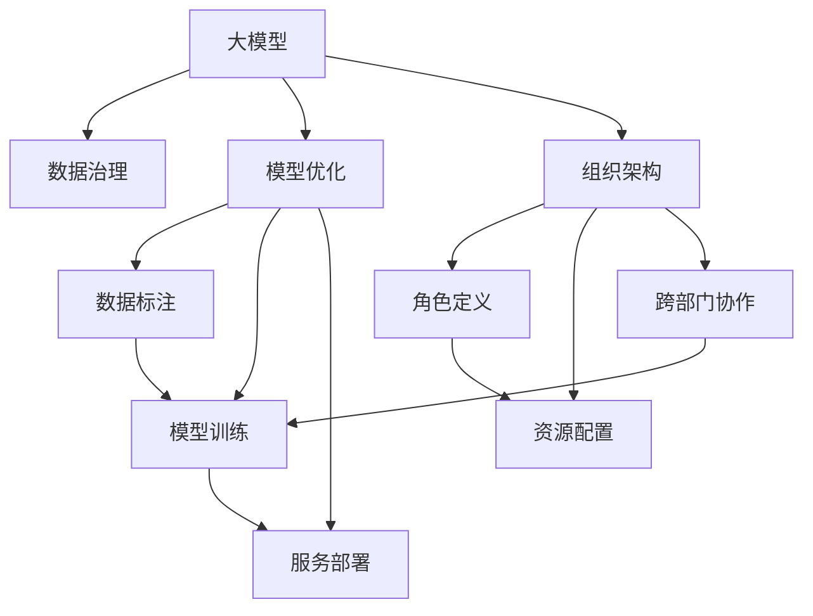

                 

# AI大模型重构电商搜索推荐的数据治理组织架构优化方案设计

在当前数字化转型的大潮中，电商行业迎来了重大的变革机遇，而以大模型为代表的人工智能技术，则为这场变革提供了强大的引擎。然而，大模型的应用并不是一蹴而就的，其背后涉及到的数据治理、组织架构优化等环节，同样需要精心设计和周密部署。本文将围绕这些问题展开探讨，为电商搜索推荐系统的重构提供全面的指导方案。

## 1. 背景介绍

### 1.1 问题由来

随着电商行业的迅速发展，用户体验和个性化推荐成为了提升用户满意度和业务效率的关键。传统的推荐算法，如协同过滤、基于内容的推荐等，已经难以满足用户的多样化需求和海量数据处理的要求。在此背景下，以大模型为代表的深度学习技术，以其强大的泛化能力和自适应性，被广泛引入电商推荐系统中。

然而，大模型在电商推荐中的应用也面临着一系列挑战。例如，数据治理的不规范、数据质量的不稳定、模型训练和部署的复杂性等问题，都可能成为阻碍其大规模应用的因素。为了解决这些问题，必须从数据治理和组织架构优化入手，构建起一套高效、可靠、可持续的AI驱动推荐系统。

### 1.2 问题核心关键点

电商搜索推荐系统重构的核心关键点包括：
- 数据治理：构建标准化、高质量的数据治理体系，确保数据的一致性和准确性。
- 组织架构：设计合理的组织架构，实现跨职能协作，提升AI技术的应用效率。
- 模型优化：采用先进的大模型优化技术，提升推荐系统的性能和用户体验。
- 生态体系：建立完善的AI生态体系，包括数据标注、模型训练、服务部署等环节，确保技术应用的持续性和扩展性。

## 2. 核心概念与联系

### 2.1 核心概念概述

在电商搜索推荐系统的重构过程中，涉及到的核心概念包括：

- **大模型**：指以深度学习为代表的大规模预训练模型，如BERT、GPT等，能够在大规模数据上学习到丰富的语言知识和行为模式。
- **数据治理**：指通过数据标准化、质量控制、数据安全等手段，确保数据的一致性和可用性，为大模型训练和推荐系统应用提供坚实的数据基础。
- **组织架构**：指通过跨部门协作、角色定义、资源配置等方式，确保AI技术在电商推荐系统中的应用效率和效果。
- **模型优化**：指通过调优大模型架构、调整超参数、引入正则化等手段，提升模型的性能和泛化能力。
- **生态体系**：指构建起包括数据标注、模型训练、服务部署等环节在内的完整生态，为持续优化和迭代AI技术提供支持。

这些概念之间相互关联，共同构成了电商搜索推荐系统重构的完整框架。通过理解这些核心概念，我们可以更好地把握电商推荐系统重构的关键点和实施路径。

### 2.2 核心概念原理和架构的 Mermaid 流程图



这个流程图展示了核心概念之间的逻辑关系：

1. 大模型作为基础，从数据治理中获取高质量数据，经过模型优化，最终通过组织架构和生态体系的支持，服务于电商搜索推荐系统。
2. 数据标注、模型训练和模型部署是模型优化的关键环节，通过跨部门协作和资源配置，确保各个环节的高效运行。
3. 角色定义和跨部门协作，则是组织架构优化的重要内容，确保各职能部门能够紧密协作，实现高效的AI技术应用。

## 3. 核心算法原理 & 具体操作步骤

### 3.1 算法原理概述

电商搜索推荐系统的重构，本质上是通过优化组织架构和大模型技术，提升系统的用户体验和业务效率。其核心算法原理包括：

1. **数据治理**：通过数据标准化、数据清洗、数据安全等手段，确保数据的一致性和完整性，为大模型训练提供可靠的数据基础。
2. **模型优化**：采用先进的大模型架构，如Transformer、BERT等，通过微调、迁移学习、参数高效微调等手段，提升模型的性能和泛化能力。
3. **组织架构**：通过角色定义、跨部门协作、资源配置等措施，确保各职能部门的高效协同，提升AI技术的应用效果。
4. **生态体系**：构建包括数据标注、模型训练、模型部署等环节在内的完整生态，确保AI技术的可持续发展和持续优化。

### 3.2 算法步骤详解

#### 3.2.1 数据治理

1. **数据标准化**：定义统一的数据标准，包括数据格式、编码方式、数据字段等，确保数据的规范性。
2. **数据清洗**：通过去重、去噪、填补缺失值等手段，提升数据的质量。
3. **数据安全**：实施数据加密、访问控制等措施，确保数据的安全性和隐私保护。

#### 3.2.2 模型优化

1. **模型选择**：根据业务需求和数据特点，选择合适的预训练大模型。
2. **微调**：在大模型基础上，利用少量标注数据进行微调，提升模型对特定任务的适应性。
3. **迁移学习**：将大模型在不同任务间进行迁移，提升模型的泛化能力和迁移学习效率。
4. **参数高效微调**：只调整模型的一部分参数，减小计算资源消耗，提升模型训练和推理效率。

#### 3.2.3 组织架构

1. **角色定义**：明确各职能部门和岗位的职责和分工，确保跨部门协作的高效性。
2. **跨部门协作**：建立定期会议、项目组等机制，促进数据科学家、数据工程师、业务专家之间的沟通和协作。
3. **资源配置**：合理配置计算资源、数据资源、人力资源等，确保各项工作的顺利进行。

#### 3.2.4 生态体系

1. **数据标注**：建立高效的数据标注流程，确保标注数据的质量和时效性。
2. **模型训练**：构建高效的模型训练平台，支持大规模模型训练和分布式训练。
3. **模型部署**：设计可扩展的模型部署方案，支持模型的快速上线和迭代。
4. **持续优化**：建立持续优化机制，定期评估模型效果和系统性能，进行优化和改进。

### 3.3 算法优缺点

**优点**：
- **性能提升**：大模型具备强大的泛化能力和自适应性，能够显著提升推荐系统的性能。
- **应用灵活**：大模型可以用于多种推荐任务，包括商品推荐、个性化推荐等，具有较高的应用灵活性。
- **可扩展性**：大模型可以逐步优化和迭代，支持持续的业务改进和创新。

**缺点**：
- **计算资源需求高**：大模型的训练和推理需要高计算资源，成本较高。
- **数据质量要求高**：大模型的性能依赖于高质量的数据，数据治理和清洗难度较大。
- **复杂度增加**：引入大模型后，系统复杂度增加，需要更专业的技术支持。

### 3.4 算法应用领域

大模型在电商搜索推荐系统中的应用领域包括：
- **商品推荐**：通过分析用户行为和商品特征，推荐用户感兴趣的商品。
- **个性化推荐**：根据用户的历史行为和偏好，提供个性化的推荐服务。
- **搜索结果排序**：通过优化算法，提升搜索结果的准确性和相关性。
- **客户服务**：利用大模型进行自然语言处理，提供智能客服和自动回复服务。
- **营销分析**：通过分析用户行为数据，提供营销策略优化和效果评估。

## 4. 数学模型和公式 & 详细讲解 & 举例说明

### 4.1 数学模型构建

在电商搜索推荐系统中，常用的数学模型包括：
- **协同过滤**：通过分析用户和商品之间的交互行为，推荐相似的商品。
- **基于内容的推荐**：利用商品的属性和用户的历史行为，推荐相似的商品。
- **深度学习模型**：如BERT、GPT等大模型，通过学习商品和用户行为的高阶特征，提升推荐效果。

### 4.2 公式推导过程

以深度学习模型为例，其核心公式包括：
- **前向传播**：$x = f(Wx + b)$，其中$x$为输入，$W$为权重矩阵，$b$为偏置向量，$f$为激活函数。
- **损失函数**：$L = \frac{1}{N}\sum_{i=1}^N \|y_i - f(Wx_i + b)\|^2$，其中$y_i$为真实标签，$\|.\|$为L2范数。
- **梯度下降**：$\theta_{k+1} = \theta_k - \eta \nabla_{\theta}L$，其中$\eta$为学习率，$\nabla_{\theta}L$为损失函数对参数$\theta$的梯度。

### 4.3 案例分析与讲解

以推荐系统的深度学习模型为例，通过以下步骤进行模型优化：
1. **数据准备**：收集用户行为数据，并进行数据清洗和标准化。
2. **模型训练**：选择预训练模型，如BERT，并利用标注数据进行微调。
3. **超参数调整**：调整模型的超参数，如学习率、批次大小等，提升模型性能。
4. **模型评估**：在验证集上评估模型效果，调整模型结构和超参数。
5. **模型部署**：将模型部署到线上环境，进行实时推荐。
6. **持续优化**：通过用户反馈和数据积累，持续优化模型和系统。

## 5. 项目实践：代码实例和详细解释说明

### 5.1 开发环境搭建

为了构建高效的电商搜索推荐系统，需要搭建相应的开发环境。以下是具体步骤：

1. **安装Python**：确保Python版本与目标环境一致，并配置路径。
2. **安装深度学习框架**：安装TensorFlow或PyTorch，并配置GPU/TPU等高性能设备。
3. **安装数据处理库**：安装Pandas、NumPy等数据处理库，用于数据清洗和分析。
4. **安装机器学习库**：安装Scikit-learn、Keras等机器学习库，用于模型训练和评估。
5. **安装Web服务框架**：安装Flask或Django等Web框架，用于搭建推荐系统服务。

### 5.2 源代码详细实现

以下是一个简单的电商推荐系统代码实现：

```python
# 导入必要的库和模块
import pandas as pd
import numpy as np
from sklearn.model_selection import train_test_split
from sklearn.metrics import mean_squared_error
from tensorflow.keras.models import Sequential
from tensorflow.keras.layers import Dense, Dropout

# 加载数据集
data = pd.read_csv('user_behavior_data.csv')
X = data.drop(['item_id', 'user_id', 'timestamp'], axis=1)
y = data['item_id']

# 数据分割
X_train, X_test, y_train, y_test = train_test_split(X, y, test_size=0.2, random_state=42)

# 构建模型
model = Sequential()
model.add(Dense(64, input_dim=X_train.shape[1], activation='relu'))
model.add(Dropout(0.5))
model.add(Dense(32, activation='relu'))
model.add(Dropout(0.5))
model.add(Dense(1, activation='linear'))

# 编译模型
model.compile(loss='mse', optimizer='adam', metrics=['mse'])

# 训练模型
model.fit(X_train, y_train, epochs=100, batch_size=32, validation_split=0.2)

# 评估模型
mse = mean_squared_error(y_test, model.predict(X_test))
print(f'Mean Squared Error: {mse}')
```

### 5.3 代码解读与分析

在上述代码中，我们使用了TensorFlow框架构建了一个简单的电商推荐模型。具体步骤包括：
1. **数据准备**：加载用户行为数据，并划分训练集和测试集。
2. **模型构建**：构建一个包含两个Dense层和一个Dropout层的模型，用于预测用户偏好。
3. **模型编译**：使用MSE损失函数和Adam优化器，编译模型。
4. **模型训练**：在训练集上进行模型训练，并在验证集上进行模型验证。
5. **模型评估**：在测试集上评估模型性能，输出均方误差。

## 6. 实际应用场景

### 6.1 智能客服系统

电商搜索推荐系统的一个重要应用场景是智能客服系统。通过大模型进行自然语言处理，智能客服系统能够快速响应用户咨询，提供个性化的服务。例如，通过分析用户输入的文本，智能客服能够准确识别用户需求，提供相应的解答和推荐。

在实际应用中，智能客服系统可以通过大模型的微调来提升其智能水平。例如，利用用户的历史对话数据进行微调，提升模型的理解能力和响应速度，使用户获得更好的服务体验。

### 6.2 个性化推荐系统

大模型在个性化推荐系统中的应用非常广泛。通过分析用户的历史行为和偏好，大模型能够提供高度个性化的推荐服务。例如，根据用户浏览、购买的历史记录，生成个性化的商品推荐列表，提升用户的购物体验。

在实际应用中，大模型可以通过微调来适应具体的业务需求。例如，在电商推荐系统中，可以使用微调后的BERT模型，对用户的行为数据进行分析和处理，生成个性化的推荐结果。

### 6.3 营销分析

大模型在电商营销分析中的应用，主要体现在用户行为分析和市场趋势预测上。通过分析用户的行为数据，大模型能够识别出用户偏好和需求，帮助电商企业制定更精准的营销策略。

在实际应用中，大模型可以通过微调和迁移学习，适应不同的营销分析任务。例如，在用户行为分析中，可以使用微调后的GPT模型，对用户的行为数据进行建模和分析，生成有价值的营销洞察。

### 6.4 未来应用展望

未来，大模型在电商搜索推荐系统中的应用将更加广泛和深入。随着技术的不断进步，电商搜索推荐系统将逐步实现智能化、个性化、精准化的目标，提升用户的购物体验和企业的业务效率。

1. **实时推荐**：通过实时分析用户行为数据，提供即时的推荐服务。
2. **跨平台推荐**：通过跨平台的数据融合和分析，实现更精准的推荐。
3. **多模态推荐**：结合文本、图像、视频等多模态数据，提升推荐的准确性和多样性。
4. **联合推荐**：通过联合不同来源的数据，提升推荐系统的多样性和覆盖率。
5. **动态调整**：根据用户反馈和市场变化，动态调整推荐策略，实现持续优化。

## 7. 工具和资源推荐

### 7.1 学习资源推荐

为了帮助开发者掌握大模型在电商搜索推荐系统中的应用，以下是一些推荐的学习资源：

1. **深度学习与自然语言处理课程**：如斯坦福大学的CS224N课程，介绍自然语言处理的基本概念和前沿技术。
2. **TensorFlow官方文档**：提供TensorFlow框架的详细使用说明，包括模型构建、训练和部署等环节。
3. **TensorFlow实战指南**：结合实际案例，介绍TensorFlow在电商推荐系统中的应用。
4. **自然语言处理实战**：介绍自然语言处理技术在电商推荐中的应用，包括数据处理、模型训练和优化等。
5. **大模型优化技术**：介绍大模型优化技术的最新进展，如参数高效微调、模型裁剪等。

### 7.2 开发工具推荐

为了提高电商搜索推荐系统的开发效率，以下是一些推荐的工具：

1. **TensorFlow**：Google推出的深度学习框架，支持高效的模型训练和推理。
2. **PyTorch**：Facebook开发的深度学习框架，支持动态图和静态图模式，灵活高效。
3. **Pandas**：Python数据分析库，支持数据清洗和处理。
4. **NumPy**：Python数值计算库，支持高效的数据处理和运算。
5. **Flask**：轻量级Web框架，支持快速搭建电商推荐系统服务。

### 7.3 相关论文推荐

以下是一些推荐的相关论文，供进一步深入学习：

1. **大模型在电商推荐中的应用**：探讨大模型在电商推荐系统中的应用，如商品推荐、个性化推荐等。
2. **电商推荐系统的协同过滤算法**：介绍协同过滤算法在电商推荐系统中的应用和优化方法。
3. **电商推荐系统的基于内容的推荐算法**：介绍基于内容的推荐算法在电商推荐系统中的应用和优化方法。
4. **电商推荐系统的大模型优化**：探讨大模型优化技术在电商推荐系统中的应用和效果。
5. **电商推荐系统的数据治理与组织架构优化**：介绍电商推荐系统的数据治理和组织架构优化方法。

## 8. 总结：未来发展趋势与挑战

### 8.1 研究成果总结

通过上述研究，我们系统地探讨了大模型在电商搜索推荐系统中的应用，从数据治理、组织架构优化到模型优化，全面梳理了电商推荐系统重构的关键环节。研究结果表明，大模型在电商推荐系统中具有强大的应用潜力，可以通过优化组织架构和算法，提升推荐系统的性能和用户体验。

### 8.2 未来发展趋势

未来，大模型在电商搜索推荐系统中的应用将呈现出以下几个趋势：

1. **技术进步**：随着深度学习技术的不断进步，大模型的性能和泛化能力将进一步提升，推荐系统的精度和覆盖率将显著提高。
2. **数据质量提升**：随着数据治理和清洗技术的不断进步，电商推荐系统将能够利用更高质量的数据，提升推荐系统的准确性和稳定性。
3. **多模态融合**：结合文本、图像、视频等多模态数据，提升推荐的准确性和多样性，实现更全面的用户需求分析。
4. **实时推荐**：通过实时分析用户行为数据，提供即时的推荐服务，提升用户购物体验和系统响应速度。
5. **跨平台推荐**：通过跨平台的数据融合和分析，实现更精准的推荐，提升推荐系统的覆盖率和多样性。

### 8.3 面临的挑战

尽管大模型在电商推荐系统中的应用前景广阔，但也面临着一些挑战：

1. **数据隐私与安全**：电商推荐系统涉及大量用户隐私数据，如何在数据治理和利用中保障用户隐私，是一个重要的挑战。
2. **计算资源需求高**：大模型的训练和推理需要高计算资源，成本较高，如何在有限的计算资源下优化模型，是一个重要的研究方向。
3. **模型复杂度增加**：引入大模型后，系统复杂度增加，需要更专业的技术支持，如何简化模型架构，提升系统可维护性，是一个重要的研究方向。
4. **跨部门协作难度大**：电商推荐系统的重构涉及多个部门，如何确保跨部门协作的高效性和协同化，是一个重要的挑战。

### 8.4 研究展望

针对上述挑战，未来的研究可以从以下几个方向进行：

1. **数据隐私与安全技术**：探索数据隐私保护技术，如差分隐私、联邦学习等，保障用户隐私，提升数据治理的公平性和可信赖性。
2. **计算资源优化技术**：探索高效的计算资源优化技术，如模型裁剪、梯度压缩等，提升模型的计算效率和资源利用率。
3. **模型简化与可维护性提升**：探索模型简化与可维护性提升技术，如模块化设计、模型压缩等，提升系统的可维护性和可扩展性。
4. **跨部门协作机制优化**：探索跨部门协作机制优化技术，如项目管理、协同平台等，提升跨部门协作的高效性和协同化。

## 9. 附录：常见问题与解答

**Q1: 如何选择合适的电商推荐系统大模型？**

A: 选择合适的电商推荐系统大模型需要考虑以下几个因素：
1. **数据特点**：根据电商推荐系统的数据特点，选择合适的预训练大模型。如对于商品推荐任务，可以选择基于内容的模型。
2. **任务需求**：根据电商推荐系统的任务需求，选择合适的模型。如对于实时推荐任务，可以选择轻量级模型。
3. **计算资源**：根据计算资源的限制，选择合适的模型。如对于资源有限的场景，可以选择参数较小的模型。
4. **效果评估**：通过实验评估，选择效果最佳的模型。可以通过AUC、MSE等指标进行评估。

**Q2: 如何优化电商推荐系统的数据治理？**

A: 电商推荐系统的数据治理优化可以从以下几个方面进行：
1. **数据标准化**：定义统一的数据标准，确保数据的规范性。
2. **数据清洗**：通过去重、去噪、填补缺失值等手段，提升数据的质量。
3. **数据安全**：实施数据加密、访问控制等措施，确保数据的安全性和隐私保护。
4. **数据存储与检索**：采用高效的数据存储与检索技术，提升数据处理的效率。
5. **数据审计与监控**：建立数据审计与监控机制，确保数据的一致性和完整性。

**Q3: 如何提高电商推荐系统的推荐精度？**

A: 提高电商推荐系统的推荐精度可以从以下几个方面进行：
1. **数据质量提升**：通过数据治理，提升数据的质量和一致性，为推荐系统提供可靠的数据基础。
2. **模型优化**：通过参数高效微调、模型裁剪等技术，提升模型的性能和泛化能力。
3. **多模态融合**：结合文本、图像、视频等多模态数据，提升推荐的准确性和多样性。
4. **个性化推荐**：通过分析用户的历史行为和偏好，提供个性化的推荐服务，提升用户体验。
5. **实时推荐**：通过实时分析用户行为数据，提供即时的推荐服务，提升用户购物体验和系统响应速度。

**Q4: 如何确保电商推荐系统的跨部门协作高效？**

A: 确保电商推荐系统的跨部门协作高效可以从以下几个方面进行：
1. **明确职责分工**：明确各职能部门和岗位的职责和分工，确保跨部门协作的高效性。
2. **建立定期会议**：建立定期会议机制，促进数据科学家、数据工程师、业务专家之间的沟通和协作。
3. **共享数据与模型**：建立共享数据与模型的机制，确保各职能部门能够共享资源，提升协作效率。
4. **协同开发平台**：建立协同开发平台，支持跨部门协作，提升开发效率。
5. **绩效考核机制**：建立绩效考核机制，确保各职能部门的协同化与高效率。

**Q5: 如何提升电商推荐系统的可维护性和可扩展性？**

A: 提升电商推荐系统的可维护性和可扩展性可以从以下几个方面进行：
1. **模块化设计**：采用模块化设计，提升系统的可维护性和可扩展性。
2. **组件化开发**：采用组件化开发技术，提升系统的模块化和可复用性。
3. **持续集成与部署**：建立持续集成与部署机制，确保系统的快速迭代与部署。
4. **数据驱动优化**：通过数据分析，发现系统的瓶颈和优化点，提升系统的性能和稳定性。
5. **技术栈升级**：采用先进的技术栈，提升系统的技术先进性和可扩展性。

---

作者：禅与计算机程序设计艺术 / Zen and the Art of Computer Programming

