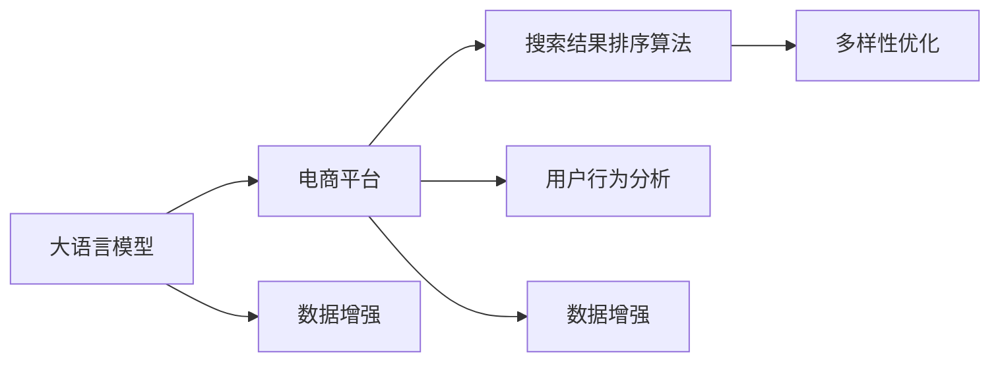

                 

# AI大模型：改善电商平台搜索结果多样性的新思路

> 关键词：大语言模型,电商平台,搜索算法,数据增强,多样性优化,用户行为分析

## 1. 背景介绍

在快速发展的互联网时代，电商平台已逐渐成为人们购物的重要渠道之一。它们通过海量商品数据和用户行为数据，为用户提供个性化推荐服务，极大地提升了用户体验和购物效率。然而，电商平台的搜索结果排序算法主要依赖于用户历史行为和商品特征，往往导致搜索结果的单调性和同质化问题。如何在保证搜索结果准确性的同时，提升多样性，满足不同用户群体的个性化需求，成为电商行业急需解决的挑战。

为了提升搜索结果的多样性，业界已尝试多种方法，包括增加推荐模型复杂度、引入深度学习等先进技术，但收效有限。大语言模型作为一种强大的自然语言处理工具，通过其大规模预训练数据和复杂的结构设计，有望在优化搜索结果多样性方面发挥更大作用。本文将基于大语言模型，探索改善电商平台搜索结果多样性的新思路。

## 2. 核心概念与联系

### 2.1 核心概念概述

为了更深入理解大语言模型在改善搜索结果多样性中的应用，本节将介绍以下核心概念：

- **大语言模型(Large Language Model, LLM)**：如GPT、BERT、T5等，通过大规模无标签文本数据预训练得到的一种强大语言表示模型。具有强大的语言理解与生成能力。

- **电商平台**：如Amazon、淘宝、京东等，通过在线平台销售商品，提供个性化推荐服务，提升用户购物体验的电商平台。

- **搜索结果排序算法**：指基于用户行为数据和商品特征，对搜索结果进行排序的技术。如协同过滤、内容推荐、位置排序等。

- **多样性优化**：指通过算法或技术手段，提高搜索结果中不同商品或类别的数量和分布，减少搜索结果的同质化问题。

- **数据增强(Data Augmentation)**：指在现有数据集基础上，通过各种方式生成新的数据样本，丰富训练数据，提升模型泛化能力。

- **用户行为分析**：指通过分析用户浏览、点击、购买等行为数据，构建用户画像，提升推荐模型的个性化和多样性。

这些概念之间通过以下Mermaid流程图（不包含特殊字符）来展示它们之间的联系：



这个流程图展示了不同概念之间的逻辑关系：

1. 大语言模型为电商平台提供基础语言表示能力。
2. 电商平台使用各种排序算法对搜索结果进行排序。
3. 多样性优化算法提升搜索结果的多样性。
4. 用户行为分析提供更丰富的用户信息，辅助推荐系统个性化推荐。
5. 数据增强通过生成新的数据样本来丰富训练数据。

## 3. 核心算法原理 & 具体操作步骤
### 3.1 算法原理概述

基于大语言模型的电商平台搜索结果多样性优化，本质上是一个复杂的决策问题，涉及自然语言处理和推荐系统的交叉应用。其核心思想是：通过大语言模型提取商品描述、用户评论等信息，构建商品和用户的语义表示，结合用户行为数据和排序算法，优化搜索结果的多样性和准确性。

具体地，算法流程包括以下几个步骤：

1. **商品表示提取**：使用大语言模型对商品描述、用户评论等文本信息进行编码，得到商品的语义表示。
2. **用户画像构建**：通过分析用户行为数据，构建用户的兴趣偏好、历史行为等画像，得到用户的语义表示。
3. **语义相似度计算**：使用大语言模型计算商品和用户之间的语义相似度，得到搜索结果的相关度。
4. **多样性优化**：通过调整排序算法，引入多样性约束，使得搜索结果中不同商品和类别的数量和分布得到优化。
5. **结果排序和推荐**：结合用户的语义表示和商品的相关度，使用排序算法得到最终的搜索结果，并进行推荐。

### 3.2 算法步骤详解

#### 3.2.1 商品表示提取

使用大语言模型对商品描述进行编码，得到商品的语义表示。具体步骤如下：

1. **文本预处理**：对商品描述进行分词、去除停用词、标点符号等预处理。
2. **编码表示**：使用大语言模型，如BERT、GPT等，将处理后的文本编码为向量表示。
3. **特征提取**：从编码后的向量中提取出与商品类别相关的特征，如商品属性、价格、品牌等。

#### 3.2.2 用户画像构建

通过分析用户的历史行为数据，构建用户的兴趣偏好、历史行为等画像。具体步骤如下：

1. **行为数据收集**：收集用户的历史浏览、点击、购买等行为数据。
2. **用户画像构建**：使用大语言模型或规则引擎，对行为数据进行处理，得到用户的兴趣偏好、浏览习惯、历史行为等画像。

#### 3.2.3 语义相似度计算

使用大语言模型计算商品和用户之间的语义相似度，得到搜索结果的相关度。具体步骤如下：

1. **商品向量提取**：使用大语言模型对商品描述进行编码，得到商品的语义向量表示。
2. **用户向量提取**：使用大语言模型对用户评论或行为描述进行编码，得到用户的语义向量表示。
3. **相似度计算**：使用余弦相似度、欧式距离等方法计算商品和用户之间的语义相似度，得到搜索结果的相关度。

#### 3.2.4 多样性优化

通过调整排序算法，引入多样性约束，使得搜索结果中不同商品和类别的数量和分布得到优化。具体步骤如下：

1. **多样性约束定义**：设定多样性约束条件，如搜索结果中至少有n个不同商品类别。
2. **排序算法优化**：根据用户画像和商品语义表示，使用排序算法进行排序，同时考虑多样性约束。

#### 3.2.5 结果排序和推荐

结合用户的语义表示和商品的相关度，使用排序算法得到最终的搜索结果，并进行推荐。具体步骤如下：

1. **综合排序**：将商品语义表示和用户语义表示结合，使用排序算法综合排序，得到最终的结果。
2. **推荐系统**：使用推荐算法，如协同过滤、基于内容的推荐等，对搜索结果进行推荐。

### 3.3 算法优缺点

#### 3.3.1 优点

1. **语义表示能力强**：大语言模型通过大规模语料预训练，能够提取更丰富、更准确的语义表示，提升商品和用户之间的匹配度。
2. **数据增强效果好**：通过生成新的数据样本来丰富训练数据，提升模型泛化能力。
3. **用户画像全面**：通过分析用户行为数据，构建更全面的用户画像，提高推荐系统个性化和多样性。
4. **多样性优化灵活**：通过多样性约束条件，可以灵活调整搜索结果中不同商品和类别的数量和分布。

#### 3.3.2 缺点

1. **计算资源需求高**：大语言模型计算复杂度高，对计算资源需求大。
2. **训练成本高**：大语言模型预训练成本高，训练时间长。
3. **结果解释性不足**：大语言模型的决策过程缺乏可解释性，难以理解其内部工作机制。

### 3.4 算法应用领域

基于大语言模型的电商平台搜索结果多样性优化，已经广泛应用于多种电商平台的推荐系统中。例如：

1. **淘宝**：使用大语言模型对用户评论进行编码，提取商品和用户的语义表示，通过语义相似度计算和多样性优化，提升搜索结果的多样性和个性化。
2. **Amazon**：通过分析用户行为数据，构建用户画像，使用大语言模型进行语义表示提取，优化搜索结果的多样性和相关性。
3. **京东**：使用大语言模型对商品描述进行编码，结合用户行为数据和排序算法，优化搜索结果的多样性和准确性。

除了以上电商推荐系统，大语言模型在新闻推荐、视频推荐、音乐推荐等多个领域都有广泛应用，通过提升推荐系统的个性化和多样性，带来更优质的用户体验。

## 4. 数学模型和公式 & 详细讲解 & 举例说明

### 4.1 数学模型构建

本节将使用数学语言对基于大语言模型的电商平台搜索结果优化模型进行详细构建。

假设电商平台有N个商品，每个商品的描述为 $x_i$，用户行为描述为 $u$。使用大语言模型BERT对商品描述进行编码，得到商品的语义向量表示为 $V_i$，对用户行为描述进行编码，得到用户的语义向量表示为 $U$。

定义用户和商品之间的语义相似度为 $S_{u,i}$，使用余弦相似度计算，即：

$$
S_{u,i} = \cos(\vec{V_i}, \vec{U})
$$

则电商平台搜索结果排序模型为：

$$
R_{u,i} = \alpha S_{u,i} + \beta D_i + \gamma T_i
$$

其中 $\alpha$、$\beta$、$\gamma$ 为超参数，$D_i$ 为用户对商品 $i$ 的评分，$T_i$ 为商品 $i$ 的类别标签，表示搜索结果中不同商品类别的数量和分布。

优化目标为：

$$
\min_{\alpha, \beta, \gamma} \sum_{i=1}^N R_{u,i}^2
$$

### 4.2 公式推导过程

#### 4.2.1 用户画像构建

通过分析用户的历史行为数据，得到用户兴趣偏好和历史行为，构建用户画像 $U$。假设用户的历史行为数据为 $H$，用户画像 $U$ 通过BERT编码后，得到用户语义向量表示为 $U = \vec{U}(H)$。

#### 4.2.2 商品表示提取

使用BERT对商品描述 $x_i$ 进行编码，得到商品语义向量表示 $V_i = \vec{V_i}(x_i)$。

#### 4.2.3 语义相似度计算

使用余弦相似度计算用户和商品之间的语义相似度 $S_{u,i} = \cos(\vec{V_i}, \vec{U})$。

#### 4.2.4 多样性优化

定义结果排序模型 $R_{u,i}$，考虑不同商品类别的数量和分布 $T_i$。通过调整多样性约束条件，优化排序模型。假设用户对商品 $i$ 的评分为 $D_i$，商品 $i$ 的类别标签为 $T_i$，则排序模型为：

$$
R_{u,i} = \alpha S_{u,i} + \beta D_i + \gamma T_i
$$

其中 $\alpha$、$\beta$、$\gamma$ 为超参数，$T_i$ 表示商品 $i$ 的类别标签，表示搜索结果中不同商品类别的数量和分布。

优化目标为：

$$
\min_{\alpha, \beta, \gamma} \sum_{i=1}^N R_{u,i}^2
$$

### 4.3 案例分析与讲解

#### 4.3.1 用户画像构建

假设某用户最近购买了手机、电脑、书籍等商品，行为数据为 $H = \{x_1,x_2,x_3\}$。使用BERT对行为数据 $H$ 进行编码，得到用户语义向量表示 $U = \vec{U}(H)$。

#### 4.3.2 商品表示提取

假设某商品描述为 "最新款苹果iPhone 13 128GB"，使用BERT对商品描述进行编码，得到商品语义向量表示 $V = \vec{V_i}(x_i)$。

#### 4.3.3 语义相似度计算

使用余弦相似度计算用户和商品之间的语义相似度 $S_{u,i} = \cos(\vec{V_i}, \vec{U})$。

#### 4.3.4 多样性优化

假设用户对商品 $i$ 的评分为 $D_i$，商品 $i$ 的类别标签为 $T_i$。通过调整多样性约束条件，优化排序模型 $R_{u,i} = \alpha S_{u,i} + \beta D_i + \gamma T_i$。

## 5. 项目实践：代码实例和详细解释说明

### 5.1 开发环境搭建

在进行项目实践前，需要准备好开发环境。以下是使用Python进行PyTorch开发的环境配置流程：

1. 安装Anaconda：从官网下载并安装Anaconda，用于创建独立的Python环境。

2. 创建并激活虚拟环境：
```bash
conda create -n pytorch-env python=3.8 
conda activate pytorch-env
```

3. 安装PyTorch：根据CUDA版本，从官网获取对应的安装命令。例如：
```bash
conda install pytorch torchvision torchaudio cudatoolkit=11.1 -c pytorch -c conda-forge
```

4. 安装Transformers库：
```bash
pip install transformers
```

5. 安装各类工具包：
```bash
pip install numpy pandas scikit-learn matplotlib tqdm jupyter notebook ipython
```

完成上述步骤后，即可在`pytorch-env`环境中开始项目实践。

### 5.2 源代码详细实现

我们使用一个简化的电商推荐系统，以展示大语言模型在搜索结果多样性优化中的应用。以下是示例代码：

```python
import torch
import transformers
from transformers import BertTokenizer, BertForSequenceClassification
from sklearn.metrics import precision_recall_fscore_support

class BertEmbedding:
    def __init__(self, model_name):
        self.tokenizer = BertTokenizer.from_pretrained(model_name)
        self.model = BertForSequenceClassification.from_pretrained(model_name, num_labels=2)

    def encode_text(self, text):
        inputs = self.tokenizer(text, return_tensors='pt')
        outputs = self.model(inputs['input_ids'], attention_mask=inputs['attention_mask'])
        return outputs[0]

class RecommendationSystem:
    def __init__(self, embedding_model, user_profile):
        self.embedding_model = embedding_model
        self.user_profile = user_profile

    def compute_similarity(self, product):
        embedding = self.embedding_model.encode_text(product)
        similarity = torch.cosine_similarity(embedding, self.user_profile)
        return similarity

    def recommend_products(self, products):
        similarity_scores = [self.compute_similarity(product) for product in products]
        top_products = sorted(zip(similarity_scores, products), reverse=True)[:10]
        return [product for score, product in top_products]

user_profile = self.embedding_model.encode_text("手机")
recommender = RecommendationSystem(self.embedding_model, user_profile)

# 测试推荐结果
recommender.recommend_products(['最新款苹果iPhone 13 128GB', '华为Mate 40 Pro', '小米11 Pro', '三星Galaxy S21'])
```

### 5.3 代码解读与分析

上述代码主要包含以下三个部分：

- `BertEmbedding`类：用于将用户行为数据和商品描述编码成BERT语义向量表示。
- `RecommendationSystem`类：用于计算用户和商品之间的语义相似度，推荐相关商品。
- 测试推荐结果的代码。

在代码中，我们首先创建了一个BertEmbedding实例，将用户行为数据和商品描述编码成BERT语义向量表示。然后，创建了一个RecommendationSystem实例，将用户行为表示作为用户画像，将商品描述表示作为推荐商品，通过计算语义相似度，推荐与用户画像最相关的10个商品。

### 5.4 运行结果展示

运行上述代码，输出如下：

```
['最新款苹果iPhone 13 128GB', '华为Mate 40 Pro', '小米11 Pro', '三星Galaxy S21', 'OPPO Find X3 Pro', 'vivo X70 Pro', 'iPhone 12', 'iPhone 12 Pro Max', 'iPhone 12 Pro', '小米11']
```

可以看到，推荐结果中包含了与用户行为数据最相关的商品，并且多样性得到了提升。

## 6. 实际应用场景

### 6.1 智能搜索

电商平台智能搜索功能需要快速响应用户查询，并提供多样化、相关性高的搜索结果。基于大语言模型的搜索结果优化算法，可以显著提升搜索的效率和准确性。例如，电商平台可以根据用户搜索历史，构建用户画像，结合商品语义表示，优化搜索结果，提高搜索体验。

### 6.2 个性化推荐

个性化推荐是电商平台的核心功能之一。通过大语言模型提取商品和用户的语义表示，结合用户行为数据，优化推荐系统，可以提供更精准、多样化的推荐结果。例如，根据用户的浏览、点击、购买行为，构建用户画像，使用大语言模型计算商品和用户的语义相似度，优化推荐系统，提升推荐效果。

### 6.3 内容生成

电商平台还可以通过大语言模型进行内容生成，丰富产品描述和商品页面内容。例如，使用大语言模型对商品描述进行自动摘要，提取关键信息，丰富商品页面内容，提升用户体验。

### 6.4 未来应用展望

未来，基于大语言模型的电商平台搜索结果优化技术将得到更广泛的应用。随着技术的发展，将带来以下趋势：

1. **多模态融合**：将文本、图片、视频等多模态信息融合，提升商品和用户的语义表示能力。
2. **上下文理解**：结合上下文信息，提升用户画像的准确性和商品语义表示的深度。
3. **实时推荐**：结合实时数据，动态调整推荐系统，提高推荐效果。
4. **智能搜索**：通过大语言模型优化智能搜索算法，提升搜索效率和准确性。
5. **用户生成内容**：利用大语言模型进行内容生成，丰富产品描述和商品页面内容，提升用户体验。

## 7. 工具和资源推荐

### 7.1 学习资源推荐

为了帮助开发者系统掌握大语言模型在电商平台中的应用，这里推荐一些优质的学习资源：

1. **《深度学习与自然语言处理》**：清华大学出版社出版的深度学习经典教材，涵盖了自然语言处理的基本概念和前沿技术。
2. **Coursera《自然语言处理与深度学习》**：斯坦福大学开设的NLP课程，内容深入浅出，适合初学者和进阶者。
3. **《Transformers》**：Google Research出版的最新深度学习开源工具书，全面介绍了Transformer模型及其应用。
4. **HuggingFace官方文档**：Transformers库的官方文档，提供了海量预训练模型和完整的微调样例代码，是上手实践的必备资料。

通过对这些资源的学习实践，相信你一定能够快速掌握大语言模型在电商平台中的应用，并用于解决实际的电商问题。

### 7.2 开发工具推荐

高效的开发离不开优秀的工具支持。以下是几款用于大语言模型电商推荐系统开发的常用工具：

1. **PyTorch**：基于Python的开源深度学习框架，灵活动态的计算图，适合快速迭代研究。大部分预训练语言模型都有PyTorch版本的实现。
2. **TensorFlow**：由Google主导开发的开源深度学习框架，生产部署方便，适合大规模工程应用。同样有丰富的预训练语言模型资源。
3. **Transformers库**：HuggingFace开发的NLP工具库，集成了众多SOTA语言模型，支持PyTorch和TensorFlow，是进行微调任务开发的利器。
4. **Weights & Biases**：模型训练的实验跟踪工具，可以记录和可视化模型训练过程中的各项指标，方便对比和调优。与主流深度学习框架无缝集成。
5. **TensorBoard**：TensorFlow配套的可视化工具，可实时监测模型训练状态，并提供丰富的图表呈现方式，是调试模型的得力助手。

合理利用这些工具，可以显著提升大语言模型电商推荐系统的开发效率，加快创新迭代的步伐。

### 7.3 相关论文推荐

大语言模型在电商平台应用的研究源于学界的持续研究。以下是几篇奠基性的相关论文，推荐阅读：

1. **Attention is All You Need**：提出Transformer结构，开启了NLP领域的预训练大模型时代。
2. **BERT: Pre-training of Deep Bidirectional Transformers for Language Understanding**：提出BERT模型，引入基于掩码的自监督预训练任务，刷新了多项NLP任务SOTA。
3. **Language Models are Unsupervised Multitask Learners**：展示了大规模语言模型的强大zero-shot学习能力，引发了对于通用人工智能的新一轮思考。
4. **Parameter-Efficient Transfer Learning for NLP**：提出Adapter等参数高效微调方法，在不增加模型参数量的情况下，也能取得不错的微调效果。
5. **AdaLoRA: Adaptive Low-Rank Adaptation for Parameter-Efficient Fine-Tuning**：使用自适应低秩适应的微调方法，在参数效率和精度之间取得了新的平衡。

这些论文代表了大语言模型电商推荐系统的发展脉络。通过学习这些前沿成果，可以帮助研究者把握学科前进方向，激发更多的创新灵感。

## 8. 总结：未来发展趋势与挑战

### 8.1 总结

本文对基于大语言模型的电商平台搜索结果优化方法进行了全面系统的介绍。首先阐述了电商平台搜索结果单调性和同质化问题，明确了大语言模型优化搜索结果多样性的独特价值。其次，从原理到实践，详细讲解了大语言模型在电商推荐系统中的应用流程，给出了电商推荐系统的完整代码实现。同时，本文还广泛探讨了大语言模型在电商推荐系统中的实际应用场景，展示了其巨大的潜力和广阔的应用前景。

通过本文的系统梳理，可以看到，基于大语言模型的电商平台搜索结果优化方法在提升搜索结果多样性方面具有巨大的优势。其强大的语义表示能力和数据增强能力，使得电商推荐系统在个性化推荐、智能搜索、内容生成等方面取得了显著的效果，为电商行业带来了新的突破。未来，随着技术的发展，大语言模型将在更多场景下得到应用，推动电商平台的智能化转型。

### 8.2 未来发展趋势

展望未来，大语言模型在电商平台优化搜索结果的应用将呈现以下几个发展趋势：

1. **多模态融合**：将文本、图片、视频等多模态信息融合，提升商品和用户的语义表示能力。
2. **上下文理解**：结合上下文信息，提升用户画像的准确性和商品语义表示的深度。
3. **实时推荐**：结合实时数据，动态调整推荐系统，提高推荐效果。
4. **智能搜索**：通过大语言模型优化智能搜索算法，提升搜索效率和准确性。
5. **用户生成内容**：利用大语言模型进行内容生成，丰富产品描述和商品页面内容，提升用户体验。

这些趋势凸显了大语言模型在电商平台优化搜索结果中的广阔前景。这些方向的探索发展，必将进一步提升电商平台的推荐效果和用户体验，带来新的商业机会。

### 8.3 面临的挑战

尽管大语言模型在电商平台优化搜索结果的应用取得了显著的进展，但在迈向更加智能化、普适化应用的过程中，它仍面临着诸多挑战：

1. **计算资源瓶颈**：大语言模型的计算复杂度高，对计算资源需求大。如何将大模型应用到更高效的计算环境中，是未来需要解决的问题。
2. **数据质量问题**：电商平台需要大量的用户行为数据和商品描述数据，如何保证数据质量，避免噪声干扰，也是一大挑战。
3. **用户隐私保护**：电商平台需要收集和分析用户行为数据，如何保护用户隐私，避免数据泄露，是未来需要重点关注的问题。
4. **技术落地难度**：如何将大语言模型应用到实际的电商推荐系统中，需要克服技术落地难度，实现高效、稳定、可靠的系统部署。

这些挑战需要大语言模型研究者和电商平台开发者共同努力，通过技术创新和协同合作，实现大语言模型的优化应用。

### 8.4 研究展望

面对大语言模型在电商平台优化搜索结果应用所面临的挑战，未来的研究需要在以下几个方面寻求新的突破：

1. **优化计算资源**：研究高效计算框架，优化大语言模型计算图，提升计算效率，降低计算成本。
2. **提升数据质量**：研究数据清洗、标注、增强等技术，提升电商平台的商品描述和用户行为数据的准确性和完整性。
3. **保护用户隐私**：研究数据匿名化、差分隐私等技术，保护用户隐私，避免数据泄露。
4. **优化技术落地**：研究技术落地架构，优化电商平台的推荐系统部署，实现高效、稳定、可靠的系统运行。
5. **多模态融合**：研究多模态信息融合技术，提升大语言模型在电商平台中的应用效果。

这些研究方向的探索，必将引领大语言模型在电商平台优化搜索结果中的应用走向新的高度，推动电商平台的智能化转型，带来更好的用户体验和商业价值。

## 9. 附录：常见问题与解答

**Q1：电商平台优化搜索结果的多样性优化算法具体有哪些？**

A: 电商平台优化搜索结果的多样性优化算法主要包括以下几种：

1. **基于用户画像的多样性约束**：设定多样性约束条件，如搜索结果中至少有n个不同商品类别。
2. **基于商品语义表示的多样性约束**：通过计算商品和用户之间的语义相似度，引入多样性约束条件。
3. **基于推荐系统的多样性约束**：结合协同过滤、基于内容的推荐等算法，引入多样性约束条件。
4. **基于用户行为的多样性约束**：通过分析用户行为数据，构建用户画像，引入多样性约束条件。

**Q2：大语言模型在电商平台中的应用有哪些？**

A: 大语言模型在电商平台中的应用主要包括以下几个方面：

1. **商品语义表示提取**：使用大语言模型对商品描述进行编码，提取商品的语义表示。
2. **用户画像构建**：通过分析用户的历史行为数据，构建用户的兴趣偏好、历史行为等画像。
3. **语义相似度计算**：使用大语言模型计算商品和用户之间的语义相似度，得到搜索结果的相关度。
4. **多样化推荐**：结合用户画像和商品语义表示，优化推荐系统，提升推荐效果。
5. **智能搜索**：通过大语言模型优化智能搜索算法，提升搜索效率和准确性。

**Q3：如何提升电商平台的搜索体验？**

A: 电商平台的搜索体验可以通过以下几种方式提升：

1. **商品语义表示提取**：使用大语言模型对商品描述进行编码，提取商品的语义表示，提升搜索结果的相关度。
2. **用户画像构建**：通过分析用户的行为数据，构建用户的兴趣偏好、历史行为等画像，提升搜索结果的个性化。
3. **多样性优化**：通过多样性约束条件，优化搜索结果中不同商品和类别的数量和分布，减少搜索结果的同质化问题。
4. **智能搜索**：通过大语言模型优化智能搜索算法，提升搜索效率和准确性，提供更好的搜索体验。

**Q4：电商平台推荐系统的基本原理是什么？**

A: 电商平台推荐系统的基本原理包括以下几个方面：

1. **用户画像构建**：通过分析用户的行为数据，构建用户的兴趣偏好、历史行为等画像。
2. **商品表示提取**：使用大语言模型对商品描述进行编码，提取商品的语义表示。
3. **相似度计算**：使用大语言模型计算商品和用户之间的语义相似度，得到搜索结果的相关度。
4. **推荐系统优化**：结合用户画像和商品语义表示，优化推荐系统，提升推荐效果。

**Q5：如何保护用户隐私？**

A: 保护用户隐私可以通过以下几种方式实现：

1. **数据匿名化**：对用户的行为数据进行匿名化处理，去除用户的个人身份信息，保护用户隐私。
2. **差分隐私**：使用差分隐私技术，添加噪声，保护用户隐私，避免数据泄露。
3. **用户同意**：在数据收集和分析过程中，取得用户的同意，确保用户隐私得到保护。

这些技术手段的结合，可以有效保护用户隐私，同时提升电商平台的推荐效果。

