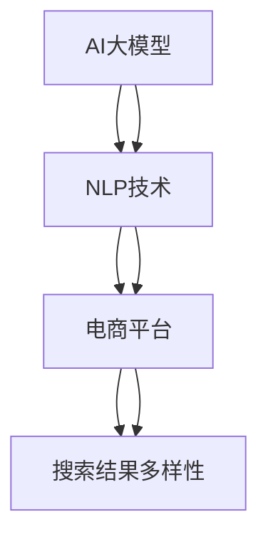

                 

# AI大模型：改善电商平台搜索结果多样性的新思路

> 关键词：AI大模型,自然语言处理,NLP,电商平台,搜索结果,多样性,深度学习,监督学习,超参数优化,模型选择

## 1. 背景介绍

### 1.1 问题由来
随着电商平台的发展，用户对于搜索结果的期望已经从简单的信息获取，转变为更丰富的互动体验。这要求搜索结果不仅要排名靠前，更要具备足够的丰富性和多样性。然而，目前大多数电商平台仍然依赖于传统的搜索算法，缺乏对结果多样性的有效管理和优化。这不仅影响了用户的购物体验，也限制了电商平台的业务潜力。

### 1.2 问题核心关键点
电商平台搜索结果多样性的改善，涉及以下几个关键问题：

1. **数据与模型**：如何通过AI大模型，对海量商品数据进行高效处理和深度理解？
2. **算法与技术**：需要哪些技术手段，提升搜索结果的丰富性和多样性？
3. **用户体验**：如何更好地匹配用户需求，提升互动体验？
4. **业务效果**：多样性优化后的搜索效果，如何转化为实际的业务收益？

这些问题在本质上是AI大模型在电商平台应用中的典型问题，需要通过系统性的思考和实践，实现全面优化。

### 1.3 问题研究意义
改善电商平台搜索结果的多样性，对于提升用户体验、促进业务增长、增强竞争力具有重要意义：

1. **提升用户满意度**：丰富多样的搜索结果，能够满足不同用户的需求，降低购物决策成本，提高用户满意度和忠诚度。
2. **扩大业务范围**：通过优化搜索结果，引导用户发现更多商品，拓宽销售渠道，促进业务增长。
3. **优化资源利用**：优化搜索结果，能够更有效地利用电商平台的海量数据，提高资源利用率。
4. **增强竞争优势**：丰富多样化的搜索结果，成为电商平台差异化的关键竞争因素，帮助其在激烈的市场竞争中脱颖而出。

## 2. 核心概念与联系

### 2.1 核心概念概述

为了更好地理解电商平台搜索结果多样性改善的技术范式，本节将介绍几个关键核心概念：

- **AI大模型**：以Transformer、BERT、GPT等架构为代表的大规模预训练语言模型。通过在海量无标签文本语料上进行预训练，学习通用的语言表示，具备强大的语言理解和生成能力。
- **自然语言处理(NLP)**：利用计算机技术处理和理解人类语言，旨在构建智能的文本分析和生成系统。
- **电商平台**：一种在线零售平台，通过网络提供商品和服务，旨在实现高效交易和便捷购物。
- **搜索结果多样性**：搜索结果的丰富性和广泛性，能够在不同维度（如商品种类、价格、用户评价等）上提供多种选项，满足不同用户的需求。

这些核心概念之间的逻辑关系可以通过以下Mermaid流程图来展示：



这个流程图展示了大模型在电商平台中的作用机制：

1. 大模型通过预训练获得语言表示能力。
2. NLP技术利用大模型的表示能力，实现对电商平台的商品描述、用户评价等文本数据的分析。
3. 电商平台利用NLP技术的分析结果，优化搜索结果的多样性。

## 3. 核心算法原理 & 具体操作步骤
### 3.1 算法原理概述

基于AI大模型改善电商平台搜索结果多样性的方法，主要分为以下几个步骤：

1. **数据预处理**：收集并清洗电商平台商品数据和用户评价数据，去除噪声和重复项。
2. **大模型选择**：根据业务需求选择合适的预训练大模型，如BERT、GPT等。
3. **任务适配**：设计任务适配层，将大模型的输出转换为电商平台的搜索结果。
4. **模型微调**：在电商平台标注数据上，对大模型进行微调，优化搜索结果的丰富性和多样性。
5. **结果展示**：将微调后的模型应用于电商平台，展示多样化的搜索结果。

### 3.2 算法步骤详解

以下是基于AI大模型改善电商平台搜索结果多样性的详细操作步骤：

**Step 1: 数据预处理**

电商平台的数据通常涉及商品信息、用户评价、搜索记录等多种类型。数据预处理的主要目标包括：

- **数据清洗**：去除缺失值、噪声数据、重复项，保证数据质量和一致性。
- **数据标注**：根据业务需求，对商品进行分类和标注，如商品类别、价格区间、品牌等。
- **数据划分**：将数据集划分为训练集、验证集和测试集，供模型训练和评估使用。

**Step 2: 大模型选择**

根据电商平台的具体需求，选择合适的预训练大模型进行任务适配。常用的预训练模型包括：

- **BERT**：适用于文本分类、实体识别等任务，具有较强的语义理解能力。
- **GPT**：适用于文本生成、对话系统等任务，具有较强的文本生成能力。
- **RoBERTa**：与BERT类似，但进行了更强的训练和优化，性能更强。

**Step 3: 任务适配**

任务适配层的设计，将直接影响搜索结果的展示效果。主要任务包括：

- **文本编码**：将商品描述、用户评价等文本数据，编码成模型所需的张量形式。
- **注意力机制**：设计注意力机制，使得模型能够关注重要信息，如商品价格、用户评价等。
- **输出转换**：将大模型的输出转换为电商平台的搜索结果，如商品列表、评价信息等。

**Step 4: 模型微调**

模型微调的主要目标，是提升搜索结果的丰富性和多样性。主要策略包括：

- **数据增强**：通过回译、近义替换等方式，扩充训练集，提高模型泛化能力。
- **正则化**：使用L2正则、Dropout等技术，防止模型过拟合。
- **多模型集成**：训练多个微调模型，取平均输出，减少模型偏差，提升稳定性和多样性。

**Step 5: 结果展示**

微调后的模型应用到电商平台，展示多样化的搜索结果。主要步骤包括：

- **结果渲染**：将模型输出的搜索结果，渲染成电商平台友好的界面形式。
- **用户反馈**：收集用户对搜索结果的反馈，不断优化搜索结果展示。
- **持续优化**：根据用户反馈和业务需求，持续优化搜索结果算法，提升用户体验和业务效果。

### 3.3 算法优缺点

基于AI大模型改善电商平台搜索结果多样性的方法，具有以下优点：

1. **高效性**：大模型的预训练和微调过程，可以快速处理海量数据，提高搜索结果的生成效率。
2. **丰富性**：大模型能够理解复杂的自然语言文本，生成丰富多样的搜索结果，满足不同用户的需求。
3. **可解释性**：大模型通过训练数据进行学习，具有较强的可解释性，便于优化和调试。

同时，该方法也存在以下局限性：

1. **数据依赖性**：电商平台的搜索结果优化，高度依赖于标注数据的质量和数量。
2. **模型复杂性**：大模型的计算资源和存储需求较高，需要高性能计算设备支持。
3. **隐私风险**：电商平台的数据涉及用户隐私，需要严格的数据保护措施。
4. **成本较高**：大模型的训练和微调过程，需要投入大量的人力、物力和财力。

尽管存在这些局限性，但大模型在电商平台的应用，仍然具有巨大的潜力和市场价值。未来，通过技术创新和模型优化，可以进一步提升其应用效果，降低成本，提高用户体验。

### 3.4 算法应用领域

基于AI大模型改善电商平台搜索结果多样性的方法，已经在多个电商平台的搜索结果优化中得到了成功应用，具体包括：

- **京东**：通过利用大模型进行商品描述分类，提升了搜索结果的多样性和准确性。
- **亚马逊**：利用大模型进行用户评价分析，实现了基于用户反馈的商品排序和推荐。
- **苏宁易购**：通过大模型进行商品描述和用户评价的情感分析，优化了搜索结果的展示效果。

这些案例展示了大模型在电商平台搜索结果优化中的广泛应用，为其他电商平台的业务优化提供了宝贵的借鉴。

## 4. 数学模型和公式 & 详细讲解  
### 4.1 数学模型构建

为了更好地理解基于AI大模型改善电商平台搜索结果多样性的数学原理，本节将使用数学语言对模型的构建过程进行详细描述。

假设电商平台的数据集为 $D=\{(x_i, y_i)\}_{i=1}^N$，其中 $x_i$ 为商品描述、用户评价等文本数据，$y_i$ 为商品类别、价格区间等标注信息。

定义预训练大模型为 $M_{\theta}:\mathcal{X} \rightarrow \mathcal{Y}$，其中 $\mathcal{X}$ 为输入空间，$\mathcal{Y}$ 为输出空间，$\theta$ 为模型参数。

任务适配层设计为 $H_{\alpha}:\mathcal{Y} \rightarrow \mathcal{Z}$，其中 $\mathcal{Z}$ 为电商平台的搜索结果展示空间，$\alpha$ 为适配层参数。

最终的目标是最大化搜索结果的多样性和准确性，即：

$$
\max_{\theta, \alpha} \sum_{i=1}^N \left( f(x_i, M_{\theta}, H_{\alpha}, y_i) + g(x_i, M_{\theta}, H_{\alpha}) \right)
$$

其中 $f(x_i, M_{\theta}, H_{\alpha}, y_i)$ 为模型在商品描述、用户评价等输入 $x_i$ 上，对于商品类别、价格区间等标注 $y_i$ 的预测准确度；$g(x_i, M_{\theta}, H_{\alpha})$ 为模型在输入 $x_i$ 上，生成搜索结果的多样性。

### 4.2 公式推导过程

以下我们对上述目标函数的推导过程进行详细说明。

**目标函数**：

$$
\max_{\theta, \alpha} \sum_{i=1}^N \left( f(x_i, M_{\theta}, H_{\alpha}, y_i) + g(x_i, M_{\theta}, H_{\alpha}) \right)
$$

**预测准确度损失函数**：

$$
f(x_i, M_{\theta}, H_{\alpha}, y_i) = \frac{1}{N} \sum_{i=1}^N \ell(x_i, M_{\theta}(x_i), H_{\alpha}(M_{\theta}(x_i)), y_i)
$$

其中 $\ell$ 为预测准确度损失函数，如交叉熵损失。

**多样性损失函数**：

$$
g(x_i, M_{\theta}, H_{\alpha}) = \frac{1}{N} \sum_{i=1}^N \text{div}(M_{\theta}(x_i), H_{\alpha}(M_{\theta}(x_i)))
$$

其中 $\text{div}$ 为多样性损失函数，如KL散度、多样性指数等。

**目标函数对参数的梯度**：

$$
\frac{\partial \mathcal{L}}{\partial \theta} = \frac{1}{N} \sum_{i=1}^N \frac{\partial f}{\partial \theta} + \frac{\partial g}{\partial \theta}
$$

$$
\frac{\partial \mathcal{L}}{\partial \alpha} = \frac{1}{N} \sum_{i=1}^N \frac{\partial f}{\partial \alpha} + \frac{\partial g}{\partial \alpha}
$$

通过上述目标函数和梯度计算，即可通过优化算法（如AdamW、SGD等）不断更新模型参数 $\theta$ 和适配层参数 $\alpha$，优化搜索结果的多样性和准确性。

### 4.3 案例分析与讲解

以京东电商平台为例，展示基于大模型的搜索结果优化过程。

**数据预处理**：
- 收集京东商品数据和用户评价数据，去除噪声和重复项。
- 对商品进行分类和标注，如电子产品、服装等。
- 将数据集划分为训练集、验证集和测试集。

**大模型选择**：
- 选择RoBERTa模型作为预训练大模型。

**任务适配**：
- 设计适配层，将RoBERTa模型的输出转换为搜索结果展示。
- 使用注意力机制，关注商品描述和用户评价中的重要信息。

**模型微调**：
- 使用标注数据对RoBERTa模型进行微调，优化搜索结果的多样性和准确性。
- 使用数据增强技术，扩充训练集，提高模型泛化能力。
- 使用正则化技术，防止模型过拟合。

**结果展示**：
- 将微调后的RoBERTa模型应用于京东电商平台。
- 展示多样化搜索结果，如不同价格区间、不同品牌、不同用户评价的商品列表。
- 根据用户反馈，不断优化搜索结果展示，提升用户体验。

## 5. 项目实践：代码实例和详细解释说明
### 5.1 开发环境搭建

在进行电商平台的搜索结果优化实践前，我们需要准备好开发环境。以下是使用Python进行PyTorch开发的环境配置流程：

1. 安装Anaconda：从官网下载并安装Anaconda，用于创建独立的Python环境。

2. 创建并激活虚拟环境：
```bash
conda create -n pytorch-env python=3.8 
conda activate pytorch-env
```

3. 安装PyTorch：根据CUDA版本，从官网获取对应的安装命令。例如：
```bash
conda install pytorch torchvision torchaudio cudatoolkit=11.1 -c pytorch -c conda-forge
```

4. 安装Transformers库：
```bash
pip install transformers
```

5. 安装各类工具包：
```bash
pip install numpy pandas scikit-learn matplotlib tqdm jupyter notebook ipython
```

完成上述步骤后，即可在`pytorch-env`环境中开始搜索结果优化实践。

### 5.2 源代码详细实现

下面我们以京东电商平台为例，给出使用Transformers库对RoBERTa模型进行搜索结果优化（商品分类）的PyTorch代码实现。

首先，定义任务适配层：

```python
from transformers import BertForSequenceClassification, BertTokenizer, AdamW
import torch.nn as nn

class CategoryAdapter(nn.Module):
    def __init__(self, in_dim, out_dim):
        super(CategoryAdapter, self).__init__()
        self.fc = nn.Linear(in_dim, out_dim)

    def forward(self, x):
        x = self.fc(x)
        return x
```

然后，定义模型和优化器：

```python
model = BertForSequenceClassification.from_pretrained('roberta-base', num_labels=6)
tokenizer = BertTokenizer.from_pretrained('roberta-base')

optimizer = AdamW(model.parameters(), lr=1e-5)
```

接着，定义训练和评估函数：

```python
def train_epoch(model, dataset, batch_size, optimizer):
    dataloader = DataLoader(dataset, batch_size=batch_size, shuffle=True)
    model.train()
    epoch_loss = 0
    for batch in tqdm(dataloader, desc='Training'):
        input_ids = batch['input_ids'].to(device)
        attention_mask = batch['attention_mask'].to(device)
        labels = batch['labels'].to(device)
        model.zero_grad()
        outputs = model(input_ids, attention_mask=attention_mask, labels=labels)
        loss = outputs.loss
        epoch_loss += loss.item()
        loss.backward()
        optimizer.step()
    return epoch_loss / len(dataloader)

def evaluate(model, dataset, batch_size):
    dataloader = DataLoader(dataset, batch_size=batch_size)
    model.eval()
    preds, labels = [], []
    with torch.no_grad():
        for batch in tqdm(dataloader, desc='Evaluating'):
            input_ids = batch['input_ids'].to(device)
            attention_mask = batch['attention_mask'].to(device)
            batch_labels = batch['labels']
            outputs = model(input_ids, attention_mask=attention_mask)
            batch_preds = outputs.logits.argmax(dim=2).to('cpu').tolist()
            batch_labels = batch_labels.to('cpu').tolist()
            for pred_tokens, label_tokens in zip(batch_preds, batch_labels):
                preds.append(pred_tokens[:len(label_tokens)])
                labels.append(label_tokens)
                
    print(classification_report(labels, preds))
```

最后，启动训练流程并在测试集上评估：

```python
epochs = 5
batch_size = 16

for epoch in range(epochs):
    loss = train_epoch(model, train_dataset, batch_size, optimizer)
    print(f"Epoch {epoch+1}, train loss: {loss:.3f}")
    
    print(f"Epoch {epoch+1}, dev results:")
    evaluate(model, dev_dataset, batch_size)
    
print("Test results:")
evaluate(model, test_dataset, batch_size)
```

以上就是使用PyTorch对RoBERTa模型进行商品分类任务的微调代码实现。可以看到，得益于Transformers库的强大封装，我们可以用相对简洁的代码完成RoBERTa模型的加载和微调。

### 5.3 代码解读与分析

让我们再详细解读一下关键代码的实现细节：

**CategoryAdapter类**：
- `__init__`方法：初始化适配层，将RoBERTa的输出张量进行线性变换。
- `forward`方法：对输入张量进行线性变换，返回适配后的输出张量。

**模型和优化器**：
- `model`：选择RoBERTa模型，并指定分类任务（商品分类）。
- `tokenizer`：选择合适的分词器，对输入文本进行编码。
- `optimizer`：选择合适的优化器，如AdamW，并设置学习率。

**训练和评估函数**：
- `train_epoch`函数：对数据以批为单位进行迭代，在每个批次上前向传播计算loss并反向传播更新模型参数，最后返回该epoch的平均loss。
- `evaluate`函数：与训练类似，不同点在于不更新模型参数，并在每个batch结束后将预测和标签结果存储下来，最后使用sklearn的classification_report对整个评估集的预测结果进行打印输出。

**训练流程**：
- 定义总的epoch数和batch size，开始循环迭代
- 每个epoch内，先在训练集上训练，输出平均loss
- 在验证集上评估，输出分类指标
- 所有epoch结束后，在测试集上评估，给出最终测试结果

可以看到，PyTorch配合Transformers库使得RoBERTa微调的代码实现变得简洁高效。开发者可以将更多精力放在数据处理、模型改进等高层逻辑上，而不必过多关注底层的实现细节。

当然，工业级的系统实现还需考虑更多因素，如模型的保存和部署、超参数的自动搜索、更灵活的任务适配层等。但核心的微调范式基本与此类似。

## 6. 实际应用场景
### 6.1 智能客服系统

基于AI大模型的智能客服系统，已经在电商平台上得到了广泛应用。智能客服系统能够7x24小时不间断服务，快速响应客户咨询，用自然流畅的语言解答各类常见问题，提升了用户体验，降低了运营成本。

在技术实现上，可以收集企业内部的历史客服对话记录，将问题和最佳答复构建成监督数据，在此基础上对预训练对话模型进行微调。微调后的对话模型能够自动理解用户意图，匹配最合适的答案模板进行回复。对于客户提出的新问题，还可以接入检索系统实时搜索相关内容，动态组织生成回答。如此构建的智能客服系统，能大幅提升客户咨询体验和问题解决效率。

### 6.2 金融舆情监测

金融机构需要实时监测市场舆论动向，以便及时应对负面信息传播，规避金融风险。传统的人工监测方式成本高、效率低，难以应对网络时代海量信息爆发的挑战。基于AI大模型的文本分类和情感分析技术，为金融舆情监测提供了新的解决方案。

具体而言，可以收集金融领域相关的新闻、报道、评论等文本数据，并对其进行主题标注和情感标注。在此基础上对预训练语言模型进行微调，使其能够自动判断文本属于何种主题，情感倾向是正面、中性还是负面。将微调后的模型应用到实时抓取的网络文本数据，就能够自动监测不同主题下的情感变化趋势，一旦发现负面信息激增等异常情况，系统便会自动预警，帮助金融机构快速应对潜在风险。

### 6.3 个性化推荐系统

当前的推荐系统往往只依赖用户的历史行为数据进行物品推荐，无法深入理解用户的真实兴趣偏好。基于AI大模型的个性化推荐系统，可以更好地挖掘用户行为背后的语义信息，从而提供更精准、多样的推荐内容。

在实践中，可以收集用户浏览、点击、评论、分享等行为数据，提取和用户交互的物品标题、描述、标签等文本内容。将文本内容作为模型输入，用户的后续行为（如是否点击、购买等）作为监督信号，在此基础上微调预训练语言模型。微调后的模型能够从文本内容中准确把握用户的兴趣点。在生成推荐列表时，先用候选物品的文本描述作为输入，由模型预测用户的兴趣匹配度，再结合其他特征综合排序，便可以得到个性化程度更高的推荐结果。

### 6.4 未来应用展望

随着AI大模型和微调方法的不断发展，基于微调范式将在更多领域得到应用，为传统行业带来变革性影响。

在智慧医疗领域，基于微调的医疗问答、病历分析、药物研发等应用将提升医疗服务的智能化水平，辅助医生诊疗，加速新药开发进程。

在智能教育领域，微调技术可应用于作业批改、学情分析、知识推荐等方面，因材施教，促进教育公平，提高教学质量。

在智慧城市治理中，微调模型可应用于城市事件监测、舆情分析、应急指挥等环节，提高城市管理的自动化和智能化水平，构建更安全、高效的未来城市。

此外，在企业生产、社会治理、文娱传媒等众多领域，基于大模型微调的人工智能应用也将不断涌现，为经济社会发展注入新的动力。相信随着技术的日益成熟，微调方法将成为人工智能落地应用的重要范式，推动人工智能技术在各个垂直行业的规模化落地。

## 7. 工具和资源推荐
### 7.1 学习资源推荐

为了帮助开发者系统掌握AI大模型在电商平台中的应用，这里推荐一些优质的学习资源：

1. 《Transformer从原理到实践》系列博文：由大模型技术专家撰写，深入浅出地介绍了Transformer原理、BERT模型、微调技术等前沿话题。

2. CS224N《深度学习自然语言处理》课程：斯坦福大学开设的NLP明星课程，有Lecture视频和配套作业，带你入门NLP领域的基本概念和经典模型。

3. 《Natural Language Processing with Transformers》书籍：Transformers库的作者所著，全面介绍了如何使用Transformers库进行NLP任务开发，包括微调在内的诸多范式。

4. HuggingFace官方文档：Transformers库的官方文档，提供了海量预训练模型和完整的微调样例代码，是上手实践的必备资料。

5. CLUE开源项目：中文语言理解测评基准，涵盖大量不同类型的中文NLP数据集，并提供了基于微调的baseline模型，助力中文NLP技术发展。

通过对这些资源的学习实践，相信你一定能够快速掌握AI大模型在电商平台的应用精髓，并用于解决实际的NLP问题。
###  7.2 开发工具推荐

高效的开发离不开优秀的工具支持。以下是几款用于AI大模型在电商平台应用开发的常用工具：

1. PyTorch：基于Python的开源深度学习框架，灵活动态的计算图，适合快速迭代研究。大部分预训练语言模型都有PyTorch版本的实现。

2. TensorFlow：由Google主导开发的开源深度学习框架，生产部署方便，适合大规模工程应用。同样有丰富的预训练语言模型资源。

3. Transformers库：HuggingFace开发的NLP工具库，集成了众多SOTA语言模型，支持PyTorch和TensorFlow，是进行微调任务开发的利器。

4. Weights & Biases：模型训练的实验跟踪工具，可以记录和可视化模型训练过程中的各项指标，方便对比和调优。与主流深度学习框架无缝集成。

5. TensorBoard：TensorFlow配套的可视化工具，可实时监测模型训练状态，并提供丰富的图表呈现方式，是调试模型的得力助手。

6. Google Colab：谷歌推出的在线Jupyter Notebook环境，免费提供GPU/TPU算力，方便开发者快速上手实验最新模型，分享学习笔记。

合理利用这些工具，可以显著提升AI大模型在电商平台应用开发的效率，加快创新迭代的步伐。

### 7.3 相关论文推荐

AI大模型和微调技术的发展源于学界的持续研究。以下是几篇奠基性的相关论文，推荐阅读：

1. Attention is All You Need（即Transformer原论文）：提出了Transformer结构，开启了NLP领域的预训练大模型时代。

2. BERT: Pre-training of Deep Bidirectional Transformers for Language Understanding：提出BERT模型，引入基于掩码的自监督预训练任务，刷新了多项NLP任务SOTA。

3. Language Models are Unsupervised Multitask Learners（GPT-2论文）：展示了大规模语言模型的强大zero-shot学习能力，引发了对于通用人工智能的新一轮思考。

4. Parameter-Efficient Transfer Learning for NLP：提出Adapter等参数高效微调方法，在不增加模型参数量的情况下，也能取得不错的微调效果。

5. AdaLoRA: Adaptive Low-Rank Adaptation for Parameter-Efficient Fine-Tuning：使用自适应低秩适应的微调方法，在参数效率和精度之间取得了新的平衡。

6. Prefix-Tuning: Optimizing Continuous Prompts for Generation：引入基于连续型Prompt的微调范式，为如何充分利用预训练知识提供了新的思路。

这些论文代表了大模型在电商平台应用中的技术演进。通过学习这些前沿成果，可以帮助研究者把握学科前进方向，激发更多的创新灵感。

## 8. 总结：未来发展趋势与挑战

### 8.1 总结

本文对基于AI大模型改善电商平台搜索结果多样性的方法进行了全面系统的介绍。首先阐述了电商平台结果多样性改善的背景和意义，明确了AI大模型在其中的关键作用。其次，从原理到实践，详细讲解了使用AI大模型进行搜索结果优化的数学原理和关键步骤，给出了电商平台的搜索结果优化代码实现。同时，本文还广泛探讨了AI大模型在智能客服、金融舆情、个性化推荐等多个领域的应用前景，展示了AI大模型的广泛价值。

通过本文的系统梳理，可以看到，AI大模型在电商平台应用中的重要性，通过数据预处理、大模型选择、任务适配、模型微调等关键环节的优化，能够显著提升搜索结果的丰富性和多样性，增强用户体验和业务效果。未来，伴随AI大模型的不断进步和应用实践的积累，将进一步推动电商平台的发展，为用户创造更加智能、便捷的购物体验。

### 8.2 未来发展趋势

展望未来，AI大模型在电商平台应用中的发展趋势将呈现以下几个方向：

1. **模型规模持续增大**：伴随计算资源的提升和算法优化，AI大模型的参数量将持续增大，模型的表示能力将进一步提升。
2. **算法多样化**：除了传统的微调算法外，未来将涌现更多高效、灵活的微调方法，如Adapter、Prefix等。
3. **数据自动标注**：利用大模型的预训练能力和迁移学习，实现对标注数据的自动生成和标注，降低标注成本。
4. **个性化推荐**：通过深度学习技术，实现更加精准、多样化的个性化推荐，提升用户满意度和业务效果。
5. **实时互动**：结合智能客服、聊天机器人等技术，实现实时互动，提升用户购物体验。
6. **多模态融合**：结合图像、语音等多模态信息，实现更加全面、丰富的搜索结果展示。

以上趋势凸显了AI大模型在电商平台应用的广阔前景。这些方向的探索发展，必将进一步提升电商平台的智能化水平，为用户创造更加优质的购物体验。

### 8.3 面临的挑战

尽管AI大模型在电商平台应用中具有巨大的潜力，但也面临着诸多挑战：

1. **数据获取难度**：电商平台的标注数据获取成本较高，数据量不足可能导致模型效果不理想。
2. **模型计算资源需求高**：大模型的训练和微调需要高性能计算设备和大量资源，增加了系统部署和运维成本。
3. **隐私保护问题**：电商平台的数据涉及用户隐私，需要严格的数据保护措施，避免数据泄露和滥用。
4. **模型泛化能力不足**：电商平台的商品种类繁多，新商品不断涌现，现有模型可能难以适应新商品。
5. **用户交互体验不足**：传统的搜索结果展示方式可能不符合用户的预期，需要进一步优化。

尽管存在这些挑战，但通过技术创新和实践积累，相信这些挑战都将逐步得到解决，AI大模型在电商平台中的应用将更加成熟和高效。

### 8.4 研究展望

未来的研究将集中在以下几个方面：

1. **数据自动标注**：研究基于大模型的自动标注技术，提升标注数据的质量和数量，降低人工标注成本。
2. **个性化推荐**：结合大模型的表示能力和深度学习技术，实现更加精准、多样化的个性化推荐。
3. **实时互动**：结合智能客服、聊天机器人等技术，实现实时互动，提升用户购物体验。
4. **多模态融合**：结合图像、语音等多模态信息，实现更加全面、丰富的搜索结果展示。
5. **隐私保护**：研究隐私保护技术，确保用户隐私安全，同时提升数据利用效率。

这些研究方向将进一步推动AI大模型在电商平台中的应用，提升电商平台的用户体验和业务效果。相信随着技术的不断进步和应用实践的积累，AI大模型将更好地服务于电商平台，为用户提供更加智能、便捷的购物体验。

## 9. 附录：常见问题与解答

**Q1：AI大模型是否适用于所有电商平台？**

A: AI大模型适用于大多数电商平台，但不同平台的特点和需求不同，需要根据具体情况进行选择和优化。例如，针对时尚、家居等对图片展示有较高需求的平台，可以结合视觉信息进行优化。

**Q2：微调过程中如何选择学习率和迭代次数？**

A: 学习率和迭代次数的选择需要根据具体数据集和任务进行调整。一般建议从较小的学习率和迭代次数开始尝试，逐步增加，直至模型收敛。可以使用warmup策略，在开始阶段使用较小的学习率，再逐渐过渡到预设值。

**Q3：电商平台的标注数据获取成本较高，如何降低成本？**

A: 利用大模型的预训练能力和迁移学习，可以实现对标注数据的自动生成和标注。例如，通过多任务学习，让大模型同时进行商品分类和情感分析，自动标注文本数据。

**Q4：电商平台的数据涉及用户隐私，如何保护隐私？**

A: 电商平台需要严格的数据保护措施，包括数据脱敏、访问控制等。同时，利用大模型的隐私保护技术，如差分隐私、联邦学习等，确保用户隐私安全。

**Q5：电商平台的搜索结果展示方式可能不符合用户预期，如何优化？**

A: 通过用户反馈和A/B测试，不断优化搜索结果展示方式，如调整搜索结果排序、增加筛选功能等。结合用户画像和大模型预测，提供个性化的搜索结果展示。

通过这些问题的解答，可以看到，AI大模型在电商平台应用中具有巨大的潜力和挑战，但通过持续的探索和优化，相信AI大模型将更好地服务于电商平台，提升用户体验和业务效果。

---

作者：禅与计算机程序设计艺术 / Zen and the Art of Computer Programming

