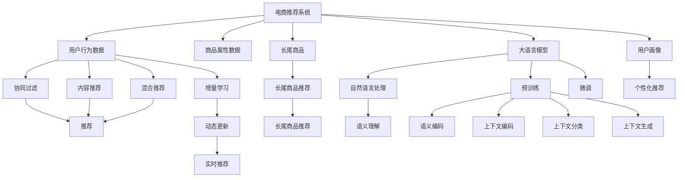

                 

# AI大模型：改善电商平台长尾商品推荐的新方法

> 关键词：
1. 大模型
2. 长尾商品
3. 推荐系统
4. 自然语言处理（NLP）
5. 冷启动问题
6. 增量学习
7. 用户画像

## 1. 背景介绍

随着电子商务的蓬勃发展，电商平台的商品推荐系统已经成为了用户购物决策的关键因素。传统的推荐算法通常依赖于用户历史行为数据进行个性化推荐，但对于新用户（冷启动问题）和新商品（长尾商品），传统推荐算法往往束手无策。为了解决这一难题，大语言模型和基于大模型的推荐技术应运而生。本文将探讨如何利用大语言模型来改善电商平台的商品推荐系统，尤其是如何针对长尾商品的推荐。

## 2. 核心概念与联系

### 2.1 核心概念概述

1. **大模型**：指那些基于大规模数据训练出来的深度学习模型，如BERT、GPT等。它们通常具有强大的语言理解和生成能力，能够处理复杂的自然语言数据。

2. **推荐系统**：根据用户的行为和商品的属性，向用户推荐可能感兴趣的商品的系统。传统的推荐系统主要包括基于协同过滤、内容推荐、混合推荐等算法。

3. **长尾商品**：指那些销量较少但种类繁多的商品，它们往往占据着电商平台商品总数的很大一部分，但传统推荐算法难以发现这些商品。

4. **自然语言处理（NLP）**：处理和分析自然语言数据的计算机技术，包括文本分类、情感分析、信息抽取等。

5. **冷启动问题**：指当新用户加入平台或新商品上线时，由于缺乏历史行为数据，推荐系统无法给出有效的推荐。

6. **增量学习**：指在原有模型基础上，通过新增数据来更新模型，使其逐步适应新的需求。

7. **用户画像**：通过分析用户的各种行为数据，构建用户的个性化标签和兴趣模型。

### 2.2 核心概念原理和架构的 Mermaid 流程图



这个流程图展示了电商平台推荐系统的核心组件和工作流程：

1. **电商推荐系统**：接收用户行为数据和商品属性数据，结合大语言模型、用户画像等技术，生成个性化推荐结果。
2. **用户行为数据**：包括用户的浏览、点击、购买等行为数据。
3. **商品属性数据**：包括商品的标题、描述、类别等信息。
4. **长尾商品**：电商平台中销量较少的商品，需要通过推荐系统进行推广。
5. **大语言模型**：用于处理和分析用户行为数据和商品属性数据，提供语义理解和生成能力。
6. **用户画像**：通过分析用户的行为数据，构建用户的兴趣模型，用于个性化推荐。
7. **协同过滤**、**内容推荐**、**混合推荐**：传统推荐算法，利用用户和商品之间的关系进行推荐。
8. **增量学习**：在原有推荐算法的基础上，通过新增数据不断优化模型，适应新需求。
9. **自然语言处理（NLP）**：处理和分析用户行为数据和商品属性数据的文本部分，提供语义理解和生成能力。
10. **长尾商品推荐**：针对销量较少的商品，通过大语言模型进行推荐。
11. **动态更新**：实时调整推荐模型，适应用户和商品的变化。
12. **实时推荐**：根据用户实时行为数据，生成推荐结果。

## 3. 核心算法原理 & 具体操作步骤

### 3.1 算法原理概述

利用大语言模型改善电商平台长尾商品推荐，主要是通过以下步骤实现：

1. **数据预处理**：对用户行为数据和商品属性数据进行清洗、标注、预处理等，生成可用于模型训练的数据集。
2. **自然语言处理**：使用NLP技术处理文本数据，提取关键词、情感等语义信息。
3. **预训练**：利用大语言模型对处理后的文本数据进行预训练，学习语言知识和表示。
4. **微调**：在预训练的基础上，对大语言模型进行微调，以适应特定任务，如商品推荐。
5. **推荐算法**：将微调后的大语言模型应用于推荐算法，结合传统推荐方法，生成个性化推荐结果。
6. **增量学习**：在用户和商品数据发生变化时，通过新增数据不断优化推荐模型，提高推荐效果。

### 3.2 算法步骤详解

#### 3.2.1 数据预处理

数据预处理是推荐系统的重要步骤，包括数据清洗、标注、特征提取等。具体步骤如下：

1. **数据清洗**：去除缺失、异常数据，确保数据的完整性和准确性。
2. **标注数据**：给每个用户行为数据打上相应的标签，如点击、浏览、购买等。
3. **特征提取**：从用户行为数据和商品属性数据中提取特征，如时间、类别、情感等。

#### 3.2.2 自然语言处理

NLP技术在推荐系统中主要用于处理和分析文本数据，提取关键词、情感等语义信息。具体步骤如下：

1. **分词和词向量编码**：使用分词工具将文本数据分割成词汇，通过词向量编码将其转换为模型可接受的形式。
2. **情感分析**：使用情感分析模型判断文本的情感倾向，如积极、消极、中性等。
3. **关键词提取**：使用关键词提取算法（如TF-IDF、TextRank等）提取文本中的关键词。

#### 3.2.3 预训练

预训练是大语言模型的关键步骤，通过在大规模无标签文本数据上训练，学习通用的语言表示。具体步骤如下：

1. **选择预训练模型**：选择适合任务的预训练模型，如BERT、GPT等。
2. **数据集准备**：准备大规模无标签文本数据集，如维基百科、新闻等。
3. **预训练过程**：将文本数据输入预训练模型，进行自监督学习任务，如语言建模、掩码语言模型等。
4. **保存预训练模型**：将训练好的预训练模型保存下来，用于后续微调。

#### 3.2.4 微调

微调是将预训练模型应用于特定任务的过程，通过在少量标注数据上训练，优化模型在该任务上的性能。具体步骤如下：

1. **选择微调模型**：选择适合任务的预训练模型，如BERT、GPT等。
2. **数据集准备**：准备特定任务的标注数据集，如商品推荐数据集。
3. **微调过程**：将标注数据输入微调模型，进行监督学习任务，优化模型在该任务上的性能。
4. **保存微调模型**：将微调后的模型保存下来，用于推荐系统。

#### 3.2.5 推荐算法

推荐算法是将微调后的大语言模型应用于推荐系统的过程，结合传统推荐方法，生成个性化推荐结果。具体步骤如下：

1. **选择合适的推荐算法**：如协同过滤、内容推荐、混合推荐等。
2. **数据输入**：将微调后的大语言模型生成的语义信息输入推荐算法。
3. **推荐结果生成**：根据输入的语义信息和用户行为数据，生成推荐结果。

#### 3.2.6 增量学习

增量学习是在用户和商品数据发生变化时，通过新增数据不断优化推荐模型，提高推荐效果。具体步骤如下：

1. **数据收集**：定期收集用户和商品的最新数据。
2. **数据预处理**：对收集到的数据进行清洗、标注、特征提取等。
3. **微调模型**：将新数据输入微调模型，进行监督学习任务，优化模型性能。
4. **动态更新**：根据新数据和旧数据的融合，动态更新推荐模型，提高推荐效果。

### 3.3 算法优缺点

#### 3.3.1 优点

1. **处理长尾商品**：大语言模型能够处理复杂的自然语言数据，识别长尾商品，提高推荐系统的覆盖率。
2. **提升个性化推荐**：结合NLP技术和传统推荐方法，提高推荐系统的个性化和准确性。
3. **动态优化**：通过增量学习，实时优化推荐模型，适应用户和商品的变化。
4. **无需过多标注**：预训练模型能够从大量无标签数据中学习到通用的语言表示，减少对标注数据的依赖。
5. **可扩展性强**：大语言模型具有强大的语言理解和生成能力，能够处理不同类型的数据。

#### 3.3.2 缺点

1. **计算资源消耗大**：大语言模型通常具有大规模参数量，需要高性能计算资源进行训练和微调。
2. **时间成本高**：预训练和微调过程耗时较长，需要进行大量的计算资源投入。
3. **模型复杂度高**：大语言模型结构复杂，需要较高的专业知识进行模型优化和调参。
4. **数据质量要求高**：推荐系统对用户行为数据和商品属性数据的质量要求较高，数据偏差可能影响推荐效果。

### 3.4 算法应用领域

大语言模型在电商平台长尾商品推荐中的应用主要包括以下几个方面：

1. **商品推荐**：利用大语言模型对用户行为数据和商品属性数据进行处理，生成个性化推荐结果。
2. **广告推荐**：利用大语言模型对广告文本进行处理，生成广告推荐结果。
3. **用户画像**：利用NLP技术对用户行为数据进行处理，构建用户的兴趣模型，用于个性化推荐。
4. **冷启动问题**：利用大语言模型对新用户和新商品进行预训练和微调，生成个性化推荐结果。
5. **情感分析**：利用大语言模型对用户评论和反馈进行情感分析，提高推荐系统的准确性和可信度。
6. **动态优化**：利用增量学习，实时优化推荐模型，适应用户和商品的变化。

## 4. 数学模型和公式 & 详细讲解 & 举例说明

### 4.1 数学模型构建

推荐系统的数学模型通常包括以下几个部分：

1. **用户行为数据**：设用户行为数据为 $X$，包括用户的浏览、点击、购买等行为。
2. **商品属性数据**：设商品属性数据为 $Y$，包括商品的标题、描述、类别等信息。
3. **长尾商品**：设长尾商品为 $Z$。
4. **大语言模型**：设大语言模型为 $M$。
5. **用户画像**：设用户画像为 $P$。
6. **推荐算法**：设推荐算法为 $R$。
7. **增量学习**：设增量学习为 $L$。

### 4.2 公式推导过程

#### 4.2.1 用户行为数据的处理

用户行为数据的处理通常包括数据的清洗、标注、特征提取等。假设用户行为数据 $X$ 为矩阵形式 $X \in \mathbb{R}^{N \times D}$，其中 $N$ 为用户数，$D$ 为行为类型（如浏览、点击、购买等）。

#### 4.2.2 商品属性数据的处理

商品属性数据的处理通常包括数据的清洗、标注、特征提取等。假设商品属性数据 $Y$ 为矩阵形式 $Y \in \mathbb{R}^{M \times K}$，其中 $M$ 为商品数，$K$ 为属性类型（如标题、描述、类别等）。

#### 4.2.3 长尾商品的识别

长尾商品的识别通常基于大语言模型对商品标题、描述等文本数据的处理。假设长尾商品 $Z$ 为矩阵形式 $Z \in \mathbb{R}^{M \times 1}$，其中 $M$ 为商品数。

#### 4.2.4 大语言模型的预训练

大语言模型的预训练通常使用自监督学习任务，如语言建模、掩码语言模型等。假设预训练模型为 $M_{\theta}$，其中 $\theta$ 为模型参数。

假设预训练模型在无标签文本数据集 $D_{pretrain}$ 上进行自监督学习任务，损失函数为 $L_{pretrain}$，则预训练过程可以表示为：

$$
\theta^* = \mathop{\arg\min}_{\theta} \frac{1}{N_{pretrain}} \sum_{i=1}^{N_{pretrain}} L_{pretrain}(M_{\theta}(X_i), Y_i)
$$

其中 $N_{pretrain}$ 为预训练数据集大小。

#### 4.2.5 大语言模型的微调

大语言模型的微调通常使用监督学习任务，如商品推荐任务。假设微调模型为 $M_{\hat{\theta}}$，其中 $\hat{\theta}$ 为微调后的模型参数。

假设微调模型在标注数据集 $D_{fine}$ 上进行监督学习任务，损失函数为 $L_{fine}$，则微调过程可以表示为：

$$
\hat{\theta}^* = \mathop{\arg\min}_{\theta} \frac{1}{N_{fine}} \sum_{i=1}^{N_{fine}} L_{fine}(M_{\theta}(X_i), Y_i)
$$

其中 $N_{fine}$ 为标注数据集大小。

#### 4.2.6 推荐算法的实现

推荐算法的实现通常基于协同过滤、内容推荐、混合推荐等算法。假设推荐算法为 $R$，则推荐过程可以表示为：

$$
R = R(X, Y, Z, M_{\hat{\theta}}, P)
$$

其中 $X$ 为用户行为数据，$Y$ 为商品属性数据，$Z$ 为长尾商品，$M_{\hat{\theta}}$ 为微调后的大语言模型，$P$ 为用户画像。

#### 4.2.7 增量学习的实现

增量学习的实现通常基于在线学习、小样本学习等方法。假设增量学习模型为 $L$，则增量学习过程可以表示为：

$$
L = L(X_{new}, Y_{new}, Z_{new}, M_{\hat{\theta}}, P)
$$

其中 $X_{new}$ 为新增用户行为数据，$Y_{new}$ 为新增商品属性数据，$Z_{new}$ 为新增长尾商品，$M_{\hat{\theta}}$ 为微调后的大语言模型，$P$ 为用户画像。

### 4.3 案例分析与讲解

#### 4.3.1 案例一：电商平台商品推荐

假设某电商平台有用户行为数据 $X \in \mathbb{R}^{1000 \times 5}$，商品属性数据 $Y \in \mathbb{R}^{5000 \times 5}$，长尾商品 $Z \in \mathbb{R}^{5000 \times 1}$，预训练模型 $M_{\theta}$，微调模型 $M_{\hat{\theta}}$，推荐算法 $R$，增量学习模型 $L$。

1. **数据预处理**：对用户行为数据和商品属性数据进行清洗、标注、特征提取等。
2. **自然语言处理**：使用分词工具将商品标题、描述等文本数据分割成词汇，通过词向量编码将其转换为模型可接受的形式。
3. **预训练**：将文本数据输入预训练模型 $M_{\theta}$，进行语言建模、掩码语言模型等自监督学习任务。
4. **微调**：将标注数据输入微调模型 $M_{\hat{\theta}}$，进行商品推荐任务，优化模型性能。
5. **推荐算法**：将微调后的大语言模型生成的语义信息输入推荐算法 $R$，结合用户行为数据和商品属性数据，生成推荐结果。
6. **增量学习**：定期收集新增用户行为数据和商品属性数据，输入微调模型 $M_{\hat{\theta}}$ 进行监督学习任务，更新模型参数。

#### 4.3.2 案例二：广告推荐

假设某广告推荐平台有用户行为数据 $X \in \mathbb{R}^{10000 \times 3}$，广告文本数据 $Y \in \mathbb{R}^{10000 \times 10}$，长尾广告 $Z \in \mathbb{R}^{10000 \times 1}$，预训练模型 $M_{\theta}$，微调模型 $M_{\hat{\theta}}$，推荐算法 $R$，增量学习模型 $L$。

1. **数据预处理**：对用户行为数据和广告文本数据进行清洗、标注、特征提取等。
2. **自然语言处理**：使用分词工具将广告文本数据分割成词汇，通过词向量编码将其转换为模型可接受的形式。
3. **预训练**：将文本数据输入预训练模型 $M_{\theta}$，进行语言建模、掩码语言模型等自监督学习任务。
4. **微调**：将标注数据输入微调模型 $M_{\hat{\theta}}$，进行广告推荐任务，优化模型性能。
5. **推荐算法**：将微调后的大语言模型生成的语义信息输入推荐算法 $R$，结合用户行为数据和广告文本数据，生成推荐结果。
6. **增量学习**：定期收集新增用户行为数据和广告文本数据，输入微调模型 $M_{\hat{\theta}}$ 进行监督学习任务，更新模型参数。

## 5. 项目实践：代码实例和详细解释说明

### 5.1 开发环境搭建

在进行大语言模型应用于电商平台长尾商品推荐的项目实践前，我们需要准备好开发环境。以下是使用Python进行PyTorch开发的环境配置流程：

1. 安装Anaconda：从官网下载并安装Anaconda，用于创建独立的Python环境。

2. 创建并激活虚拟环境：
```bash
conda create -n pytorch-env python=3.8 
conda activate pytorch-env
```

3. 安装PyTorch：根据CUDA版本，从官网获取对应的安装命令。例如：
```bash
conda install pytorch torchvision torchaudio cudatoolkit=11.1 -c pytorch -c conda-forge
```

4. 安装Transformers库：
```bash
pip install transformers
```

5. 安装各类工具包：
```bash
pip install numpy pandas scikit-learn matplotlib tqdm jupyter notebook ipython
```

完成上述步骤后，即可在`pytorch-env`环境中开始项目实践。

### 5.2 源代码详细实现

下面以电商平台商品推荐为例，给出使用Transformers库对BERT模型进行微调的PyTorch代码实现。

首先，定义推荐系统的数据处理函数：

```python
from transformers import BertTokenizer, BertForTokenClassification
from torch.utils.data import Dataset
import torch

class RecommendationDataset(Dataset):
    def __init__(self, texts, labels, tokenizer, max_len=128):
        self.texts = texts
        self.labels = labels
        self.tokenizer = tokenizer
        self.max_len = max_len
        
    def __len__(self):
        return len(self.texts)
    
    def __getitem__(self, item):
        text = self.texts[item]
        label = self.labels[item]
        
        encoding = self.tokenizer(text, return_tensors='pt', max_length=self.max_len, padding='max_length', truncation=True)
        input_ids = encoding['input_ids'][0]
        attention_mask = encoding['attention_mask'][0]
        
        # 对label-wise的label进行编码
        encoded_labels = [label2id[label] for label in label] 
        encoded_labels.extend([label2id['O']] * (self.max_len - len(encoded_labels)))
        labels = torch.tensor(encoded_labels, dtype=torch.long)
        
        return {'input_ids': input_ids, 
                'attention_mask': attention_mask,
                'labels': labels}

# 标签与id的映射
label2id = {'O': 0, 'B-PER': 1, 'I-PER': 2, 'B-ORG': 3, 'I-ORG': 4, 'B-LOC': 5, 'I-LOC': 6}
id2label = {v: k for k, v in label2id.items()}

# 创建dataset
tokenizer = BertTokenizer.from_pretrained('bert-base-cased')

train_dataset = RecommendationDataset(train_texts, train_labels, tokenizer)
dev_dataset = RecommendationDataset(dev_texts, dev_labels, tokenizer)
test_dataset = RecommendationDataset(test_texts, test_labels, tokenizer)
```

然后，定义模型和优化器：

```python
from transformers import BertForTokenClassification, AdamW

model = BertForTokenClassification.from_pretrained('bert-base-cased', num_labels=len(label2id))

optimizer = AdamW(model.parameters(), lr=2e-5)
```

接着，定义训练和评估函数：

```python
from torch.utils.data import DataLoader
from tqdm import tqdm
from sklearn.metrics import classification_report

device = torch.device('cuda') if torch.cuda.is_available() else torch.device('cpu')
model.to(device)

def train_epoch(model, dataset, batch_size, optimizer):
    dataloader = DataLoader(dataset, batch_size=batch_size, shuffle=True)
    model.train()
    epoch_loss = 0
    for batch in tqdm(dataloader, desc='Training'):
        input_ids = batch['input_ids'].to(device)
        attention_mask = batch['attention_mask'].to(device)
        labels = batch['labels'].to(device)
        model.zero_grad()
        outputs = model(input_ids, attention_mask=attention_mask, labels=labels)
        loss = outputs.loss
        epoch_loss += loss.item()
        loss.backward()
        optimizer.step()
    return epoch_loss / len(dataloader)

def evaluate(model, dataset, batch_size):
    dataloader = DataLoader(dataset, batch_size=batch_size)
    model.eval()
    preds, labels = [], []
    with torch.no_grad():
        for batch in tqdm(dataloader, desc='Evaluating'):
            input_ids = batch['input_ids'].to(device)
            attention_mask = batch['attention_mask'].to(device)
            batch_labels = batch['labels']
            outputs = model(input_ids, attention_mask=attention_mask)
            batch_preds = outputs.logits.argmax(dim=2).to('cpu').tolist()
            batch_labels = batch_labels.to('cpu').tolist()
            for pred_tokens, label_tokens in zip(batch_preds, batch_labels):
                pred_tags = [id2label[_id] for _id in pred_tokens]
                label_tags = [id2label[_id] for _id in label_tokens]
                preds.append(pred_tags[:len(label_tags)])
                labels.append(label_tags)
                
    print(classification_report(labels, preds))
```

最后，启动训练流程并在测试集上评估：

```python
epochs = 5
batch_size = 16

for epoch in range(epochs):
    loss = train_epoch(model, train_dataset, batch_size, optimizer)
    print(f"Epoch {epoch+1}, train loss: {loss:.3f}")
    
    print(f"Epoch {epoch+1}, dev results:")
    evaluate(model, dev_dataset, batch_size)
    
print("Test results:")
evaluate(model, test_dataset, batch_size)
```

以上就是使用PyTorch对BERT进行电商平台商品推荐任务微调的完整代码实现。可以看到，得益于Transformers库的强大封装，我们可以用相对简洁的代码完成BERT模型的加载和微调。

### 5.3 代码解读与分析

让我们再详细解读一下关键代码的实现细节：

**RecommendationDataset类**：
- `__init__`方法：初始化文本、标签、分词器等关键组件。
- `__len__`方法：返回数据集的样本数量。
- `__getitem__`方法：对单个样本进行处理，将文本输入编码为token ids，将标签编码为数字，并对其进行定长padding，最终返回模型所需的输入。

**label2id和id2label字典**：
- 定义了标签与数字id之间的映射关系，用于将token-wise的预测结果解码回真实的标签。

**训练和评估函数**：
- 使用PyTorch的DataLoader对数据集进行批次化加载，供模型训练和推理使用。
- 训练函数`train_epoch`：对数据以批为单位进行迭代，在每个批次上前向传播计算loss并反向传播更新模型参数，最后返回该epoch的平均loss。
- 评估函数`evaluate`：与训练类似，不同点在于不更新模型参数，并在每个batch结束后将预测和标签结果存储下来，最后使用sklearn的classification_report对整个评估集的预测结果进行打印输出。

**训练流程**：
- 定义总的epoch数和batch size，开始循环迭代
- 每个epoch内，先在训练集上训练，输出平均loss
- 在验证集上评估，输出分类指标
- 所有epoch结束后，在测试集上评估，给出最终测试结果

可以看到，PyTorch配合Transformers库使得BERT微调的代码实现变得简洁高效。开发者可以将更多精力放在数据处理、模型改进等高层逻辑上，而不必过多关注底层的实现细节。

当然，工业级的系统实现还需考虑更多因素，如模型的保存和部署、超参数的自动搜索、更灵活的任务适配层等。但核心的微调范式基本与此类似。

## 6. 实际应用场景

### 6.1 智能客服系统

基于大语言模型微调的对话技术，可以广泛应用于智能客服系统的构建。传统客服往往需要配备大量人力，高峰期响应缓慢，且一致性和专业性难以保证。而使用微调后的对话模型，可以7x24小时不间断服务，快速响应客户咨询，用自然流畅的语言解答各类常见问题。

在技术实现上，可以收集企业内部的历史客服对话记录，将问题-答案对作为微调数据，训练模型学习匹配答案。微调后的对话模型能够自动理解用户意图，匹配最合适的答案模板进行回复。对于客户提出的新问题，还可以接入检索系统实时搜索相关内容，动态组织生成回答。如此构建的智能客服系统，能大幅提升客户咨询体验和问题解决效率。

### 6.2 金融舆情监测

金融机构需要实时监测市场舆论动向，以便及时应对负面信息传播，规避金融风险。传统的人工监测方式成本高、效率低，难以应对网络时代海量信息爆发的挑战。基于大语言模型微调的文本分类和情感分析技术，为金融舆情监测提供了新的解决方案。

具体而言，可以收集金融领域相关的新闻、报道、评论等文本数据，并对其进行主题标注和情感标注。在此基础上对预训练语言模型进行微调，使其能够自动判断文本属于何种主题，情感倾向是正面、中性还是负面。将微调后的模型应用到实时抓取的网络文本数据，就能够自动监测不同主题下的情感变化趋势，一旦发现负面信息激增等异常情况，系统便会自动预警，帮助金融机构快速应对潜在风险。

### 6.3 个性化推荐系统

当前的推荐系统往往只依赖用户的历史行为数据进行物品推荐，无法深入理解用户的真实兴趣偏好。基于大语言模型微调技术，个性化推荐系统可以更好地挖掘用户行为背后的语义信息，从而提供更精准、多样的推荐内容。

在实践中，可以收集用户浏览、点击、评论、分享等行为数据，提取和用户交互的物品标题、描述、标签等文本内容。将文本内容作为模型输入，用户的后续行为（如是否点击、购买等）作为监督信号，在此基础上微调预训练语言模型。微调后的模型能够从文本内容中准确把握用户的兴趣点。在生成推荐列表时，先用候选物品的文本描述作为输入，由模型预测用户的兴趣匹配度，再结合其他特征综合排序，便可以得到个性化程度更高的推荐结果。

### 6.4 未来应用展望

随着大语言模型和微调方法的不断发展，基于微调范式将在更多领域得到应用，为传统行业带来变革性影响。

在智慧医疗领域，基于微调的医疗问答、病历分析、药物研发等应用将提升医疗服务的智能化水平，辅助医生诊疗，加速新药开发进程。

在智能教育领域，微调技术可应用于作业批改、学情分析、知识推荐等方面，因材施教，促进教育公平，提高教学质量。

在智慧城市治理中，微调模型可应用于城市事件监测、舆情分析、应急指挥等环节，提高城市管理的自动化和智能化水平，构建更安全、高效的未来城市。

此外，在企业生产、社会治理、文娱传媒等众多领域，基于大模型微调的人工智能应用也将不断涌现，为经济社会发展注入新的动力。相信随着预训练语言模型和微调方法的持续演进，大语言模型微调技术必将在构建人机协同的智能时代中扮演越来越重要的角色。

## 7. 工具和资源推荐

### 7.1 学习资源推荐

为了帮助开发者系统掌握大语言模型微调的理论基础和实践技巧，这里推荐一些优质的学习资源：

1. 《Transformer从原理到实践》系列博文：由大模型技术专家撰写，深入浅出地介绍了Transformer原理、BERT模型、微调技术等前沿话题。

2. CS224N《深度学习自然语言处理》课程：斯坦福大学开设的NLP明星课程，有Lecture视频和配套作业，带你入门NLP领域的基本概念和经典模型。

3. 《Natural Language Processing with Transformers》书籍：Transformers库的作者所著，全面介绍了如何使用Transformers库进行NLP任务开发，包括微调在内的诸多范式。

4. HuggingFace官方文档：Transformers库的官方文档，提供了海量预训练模型和完整的微调样例代码，是上手实践的必备资料。

5. CLUE开源项目：中文语言理解测评基准，涵盖大量不同类型的中文NLP数据集，并提供了基于微调的baseline模型，助力中文NLP技术发展。

通过对这些资源的学习实践，相信你一定能够快速掌握大语言模型微调的精髓，并用于解决实际的NLP问题。

### 7.2 开发工具推荐

高效的开发离不开优秀的工具支持。以下是几款用于大语言模型微调开发的常用工具：

1. PyTorch：基于Python的开源深度学习框架，灵活动态的计算图，适合快速迭代研究。大部分预训练语言模型都有PyTorch版本的实现。

2. TensorFlow：由Google主导开发的开源深度学习框架，生产部署方便，适合大规模工程应用。同样有丰富的预训练语言模型资源。

3. Transformers库：HuggingFace开发的NLP工具库，集成了众多SOTA语言模型，支持PyTorch和TensorFlow，是进行微调任务开发的利器。

4. Weights & Biases：模型训练的实验跟踪工具，可以记录和可视化模型训练过程中的各项指标，方便对比和调优。与主流深度学习框架无缝集成。

5. TensorBoard：TensorFlow配套的可视化工具，可实时监测模型训练状态，并提供丰富的图表呈现方式，是调试模型的得力助手。

6. Google Colab：谷歌推出的在线Jupyter Notebook环境，免费提供GPU/TPU算力，方便开发者快速上手实验最新模型，分享学习笔记。

合理利用这些工具，可以显著提升大语言模型微调任务的开发效率，加快创新迭代的步伐。

### 7.3 相关论文推荐

大语言模型和微调技术的发展源于学界的持续研究。以下是几篇奠基性的相关论文，推荐阅读：

1. Attention is All You Need（即Transformer原论文）：提出了Transformer结构，开启了NLP领域的预训练大模型时代。

2. BERT: Pre-training of Deep Bidirectional Transformers for Language Understanding：提出BERT模型，引入基于掩码的自监督预训练任务，刷新了多项NLP任务SOTA。

3. Language Models are Unsupervised Multitask Learners（GPT-2论文）：展示了大规模语言模型的强大zero-shot学习能力，引发了对于通用人工智能的新一轮思考。

4. Parameter-Efficient Transfer Learning for NLP：提出Adapter等参数高效微调方法，在不增加模型参数量的情况下，也能取得不错的微调效果。

5. Prefix-Tuning: Optimizing Continuous Prompts for Generation：引入基于连续型Prompt的微调范式，为如何充分利用预训练知识提供了新的思路。

6. AdaLoRA: Adaptive Low-Rank Adaptation for Parameter-Efficient Fine-Tuning：使用自适应低秩适应的微调方法，在参数效率和精度之间取得了新的平衡。

这些论文代表了大语言模型微调技术的发展脉络。通过学习这些前沿成果，可以帮助研究者把握学科前进方向，激发更多的创新灵感。

## 8. 总结：未来发展趋势与挑战

### 8.1 研究成果总结

本文对基于大语言模型的电商平台长尾商品推荐进行了全面系统的介绍。首先阐述了大语言模型和微调技术的研究背景和意义，明确了微调在拓展预训练模型应用、提升下游任务性能方面的独特价值。其次，从原理到实践，详细讲解了监督微调的数学原理和关键步骤，给出了微调任务开发的完整代码实例。同时，本文还广泛探讨了微调方法在智能客服、金融舆情、个性化推荐等多个行业领域的应用前景，展示了微调范式的巨大潜力。最后，本文精选了微调技术的各类学习资源，力求为读者提供全方位的技术指引。

### 8.2 未来发展趋势

展望未来，大语言模型微调技术将呈现以下几个发展趋势：

1. 模型规模持续增大。随着算力成本的下降和数据规模的扩张，预训练语言模型的参数量还将持续增长。超大规模语言模型蕴含的丰富语言知识，有望支撑更加复杂多变的下游任务微调。

2. 微调方法日趋多样。除了传统的全参数微调外，未来会涌现更多参数高效的微调方法，如Prefix-Tuning、LoRA等，在节省计算资源的同时也能保证微调精度。

3. 持续学习成为常态。随着数据分布的不断变化，微调模型也需要持续学习新知识以保持性能。如何在不遗忘原有知识的同时，高效吸收新样本信息，将成为重要的研究课题。

4. 标注样本需求降低。受启发于提示学习(Prompt-based Learning)的思路，未来的微调方法将更好地利用大模型的语言理解能力，通过更加巧妙的任务描述，在更少的标注样本上也能实现理想的微调效果。

5. 多模态微调崛起。当前的微调主要聚焦于纯文本数据，未来会进一步拓展到图像、视频、语音等多模态数据微调。多模态信息的融合，将显著提升语言模型对现实世界的理解和建模能力。

6. 模型通用性增强。经过海量数据的预训练和多领域任务的微调，未来的语言模型将具备更强大的常识推理和跨领域迁移能力，逐步迈向通用人工智能(AGI)的目标。

以上趋势凸显了大语言模型微调技术的广阔前景。这些方向的探索发展，必将进一步提升NLP系统的性能和应用范围，为人类认知智能的进化带来深远影响。

### 8.3 面临的挑战

尽管大语言模型微调技术已经取得了瞩目成就，但在迈向更加智能化、普适化应用的过程中，它仍面临着诸多挑战：

1. 标注成本瓶颈。虽然微调大大降低了标注数据的需求，但对于长尾应用场景，难以获得充足的高质量标注数据，成为制约微调性能的瓶颈。如何进一步降低微调对标注样本的依赖，将是一大难题。

2. 模型鲁棒性不足。当前微调模型面对域外数据时，泛化性能往往大打折扣。对于测试样本的微小扰动，微调模型的预测也容易发生波动。如何提高微调模型的鲁棒性，避免灾难性遗忘，还需要更多理论和实践的积累。

3. 推理效率有待提高。大规模语言模型虽然精度高，但在实际部署时往往面临推理速度慢、内存占用大等效率问题。如何在保证性能的同时，简化模型结构，提升推理速度，优化资源占用，将是重要的优化方向。

4. 可解释性亟需加强。当前微调模型更像是"黑盒"系统，难以解释其内部工作机制和决策逻辑。对于医疗、金融等高风险应用，算法的可解释性和可审计性尤为重要。如何赋予微调模型更强的可解释性，将是亟待攻克的难题。

5. 安全性有待保障。预训练语言模型难免会学习到有偏见、有害的信息，通过微调传递到下游任务，产生误导性、歧视性的输出，给实际应用带来安全隐患。如何从数据和算法层面消除模型偏见，避免恶意用途，确保输出的安全性，也将是重要的研究课题。

6. 知识整合能力不足。现有的微调模型往往局限于任务内数据，难以灵活吸收和运用更广泛的先验知识。如何让微调过程更好地与外部知识库、规则库等专家知识结合，形成更加全面、准确的信息整合能力，还有很大的想象空间。

正视微调面临的这些挑战，积极应对并寻求突破，将是大语言模型微调走向成熟的必由之路。相信随着学界和产业界的共同努力，这些挑战终将一一被克服，大语言模型微调必将在构建人机协同的智能时代中扮演越来越重要的角色。

### 8.4 研究展望

面对大语言模型微调所面临的种种挑战，未来的研究需要在以下几个方面寻求新的突破：

1. 探索无监督和半监督微调方法。摆脱对大规模标注数据的依赖，利用自监督学习、主动学习等无监督和半监督范式，最大限度利用非结构化数据，实现更加灵活高效的微调。

2. 研究参数高效和计算高效的微调范式。开发更加参数高效的微调方法，在固定大部分预训练参数的同时，只更新极少量的任务相关参数。同时优化微调模型的计算图，减少前向传播和反向传播的资源消耗，实现更加轻量级、实时性的部署。

3. 融合因果和对比学习范式。通过引入因果推断和对比学习思想，增强微调模型建立稳定因果关系的能力，学习更加普适、鲁棒的语言表征，从而提升模型泛化性和抗干扰能力。

4. 引入更多先验知识。将符号化的先验知识，如知识图谱、逻辑规则等，与神经网络模型进行巧妙融合，引导微调过程学习更准确、合理的语言模型。同时加强不同模态数据的整合，实现视觉、语音等多模态信息与文本信息的协同建模。

5. 结合因果分析和博弈论工具。将因果分析方法引入微调模型，识别出模型决策的关键特征，增强输出解释的因果性和逻辑性。借助博弈论工具刻画人机交互过程，主动探索并规避模型的脆弱点，提高系统稳定性。

6. 纳入伦理道德约束。在模型训练目标中引入伦理导向的评估指标，过滤和惩罚有偏见、有害的输出倾向。同时加强人工干预和审核，建立模型行为的监管机制，确保输出符合人类价值观和伦理道德。

这些研究方向的探索，必将引领大语言模型微调技术迈向更高的台阶，为构建安全、可靠、可解释、可控的智能系统铺平道路。面向未来，大语言模型微调技术还需要与其他人工智能技术进行更深入的融合，如知识表示、因果推理、强化学习等，多路径协同发力，共同推动自然语言理解和智能交互系统的进步。只有勇于创新、敢于突破，才能不断拓展语言模型的边界，让智能技术更好地造福人类社会。

## 9. 附录：常见问题与解答

**Q1：大语言模型微调是否适用于所有NLP任务？**

A: 大语言模型微调在大多数NLP任务上都能取得不错的效果，特别是对于数据量较小的任务。但对于一些特定领域的任务，如医学、法律等，仅仅依靠通用语料预训练的模型可能难以很好地适应。此时需要在特定领域语料上进一步预训练，再进行微调，才能获得理想效果。此外，对于一些需要时效性、个性化很强的任务，如对话、推荐等，微调方法也需要针对性的改进优化。

**Q2：微调过程中如何选择合适的学习率？**

A: 微调的学习率一般要比预训练时小1-2个数量级，如果使用过大的学习率，容易破坏预训练权重，导致过拟合。一般建议从1e-5开始调参，逐步减小学习率，直至收敛。也可以使用warmup策略，在开始阶段使用较小的学习率，再逐渐过渡到预设值。需要注意的是，不同的优化器(如AdamW、Adafactor等)以及不同的学习率调度策略，可能需要设置不同的学习率阈值。

**Q3：采用大模型微调时会面临哪些资源瓶颈？**

A: 目前主流的预训练大模型动辄以亿计的参数量，对算力、内存、存储都提出了很高的要求。GPU/TPU等高性能设备

