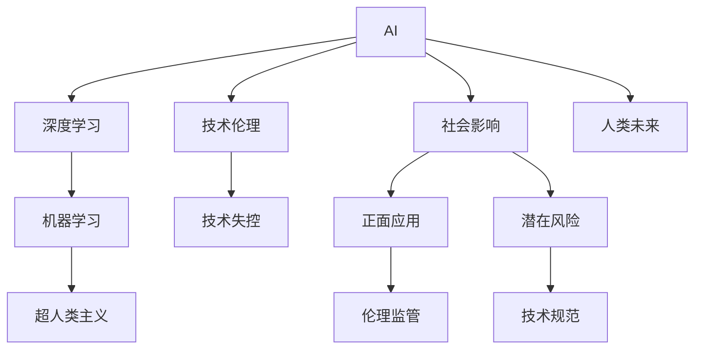

                 

# AI失控的神话：技术发展的真相

> 关键词：AI失控、技术神话、人工智能发展、人类未来、技术伦理、AI与人类关系

## 1. 背景介绍

### 1.1 问题由来
近年来，人工智能(AI)技术的快速发展，尤其是深度学习技术的突破，引起了广泛的关注和热议。人工智能在医疗、金融、教育、交通等各个领域的应用，不断刷新着人们的认知。然而，随着AI技术的深入发展，关于“AI失控”的担忧也日益加剧，甚至有人将AI视为“潘多拉魔盒”，认为它将威胁人类的存在和发展。这种观点，无疑是对技术进步的过度担忧和误解。

### 1.2 问题核心关键点
本文将对“AI失控”的神话进行深入剖析，通过探讨AI技术的本质和现实应用，阐述技术发展与人类未来之间的真实关系。我们将在以下四个方面展开论述：

- AI技术的本质与现状
- 技术发展对人类社会的积极影响
- 当前对AI技术的过度担忧与误解
- AI技术的未来发展与人类应对策略

### 1.3 问题研究意义
本文旨在帮助读者理清AI技术的发展脉络，理解AI技术对人类社会的深远影响，树立正确的AI观念，并为未来的技术应用和伦理治理提供参考。

## 2. 核心概念与联系

### 2.1 核心概念概述

为更好地理解“AI失控的神话”，我们首先需要了解几个核心概念：

- 人工智能(Artificial Intelligence, AI)：模拟人类智能的技术，包括学习、推理、规划、自然语言处理等能力。
- 深度学习(Deep Learning)：基于神经网络的机器学习技术，通过多层次的特征提取和抽象，实现对复杂模式的学习。
- 机器学习(Machine Learning)：让计算机通过数据学习，自动改进算法和模型，以实现特定任务的技术。
- 超人类主义(Transhumanism)：认为技术发展将超越人类生物极限，赋予人类更强大能力的思想。
- 技术伦理(Ethics of Technology)：对技术发展与应用过程中伦理道德问题的探讨。
- 技术失控(Collapse of Control)：技术过度依赖或失控，可能带来负面后果的观点。

这些核心概念之间存在密切联系，共同构成了关于AI技术的认知框架。理解这些概念的相互关系，将有助于我们更准确地评估AI技术的现实影响。

### 2.2 核心概念原理和架构的 Mermaid 流程图



这个流程图展示了AI技术的发展路径及其与人类社会的复杂关系。AI技术通过深度学习等手段，提升机器学习能力，进而催生超人类主义的理想。同时，AI技术对社会的影响是多方面的，既包括正面应用（如医疗、教育），也可能带来潜在风险（如隐私泄露、就业失业）。技术伦理和规范是确保技术应用健康发展的重要保障，而技术失控的担忧则反映了对技术发展的过度恐惧。

## 3. 核心算法原理 & 具体操作步骤

### 3.1 算法原理概述

人工智能的核心在于通过算法和数据，实现对现实世界的模拟和预测。其基本原理可以概括为以下几个步骤：

1. **数据获取与预处理**：收集相关数据，并进行清洗、标注等预处理。
2. **特征提取与表示**：使用算法将原始数据转化为机器可以理解的特征表示。
3. **模型训练与优化**：通过反向传播等算法，不断调整模型参数，最小化损失函数。
4. **模型测试与评估**：在测试集上评估模型性能，确保其在新数据上的泛化能力。
5. **模型部署与应用**：将训练好的模型应用于实际问题，解决特定任务。

### 3.2 算法步骤详解

以下将详细描述深度学习模型的训练和优化步骤：

**Step 1: 数据准备**
- 收集相关数据，并进行预处理，如去噪、归一化等。
- 将数据划分为训练集、验证集和测试集。

**Step 2: 模型构建**
- 选择合适的深度学习框架（如TensorFlow、PyTorch等）。
- 定义模型结构，如卷积神经网络(CNN)、循环神经网络(RNN)、Transformer等。

**Step 3: 模型训练**
- 设置优化器（如Adam、SGD等），并设定学习率、批大小等超参数。
- 定义损失函数（如交叉熵、均方误差等）。
- 通过反向传播算法，更新模型参数。
- 在每个epoch后评估模型在验证集上的性能。
- 根据性能调整超参数，继续训练直到收敛。

**Step 4: 模型测试与评估**
- 在测试集上评估模型性能。
- 使用指标如准确率、精确率、召回率等评估模型表现。
- 根据测试结果调整模型和参数，进行迭代优化。

**Step 5: 模型部署**
- 将训练好的模型部署到实际应用场景中。
- 进行A/B测试，确保模型在实际环境中的稳定性和性能。
- 持续收集反馈数据，优化模型。

### 3.3 算法优缺点

深度学习模型具有以下优点：
- 强大的特征提取能力，适用于复杂的非线性问题。
- 可以通过大规模数据训练，获得高精度的模型。
- 模型结构灵活，可以应用于各种类型的任务。

同时，也存在以下缺点：
- 需要大量的数据和计算资源，训练周期较长。
- 模型复杂度高，难以解释，容易产生“黑盒”问题。
- 对数据质量依赖性强，数据偏差可能影响模型表现。
- 存在过拟合风险，需要正则化技术来防止。

### 3.4 算法应用领域

深度学习模型在各个领域都有广泛应用，例如：

- 计算机视觉：如图像分类、目标检测、图像生成等。
- 自然语言处理：如机器翻译、文本分类、情感分析等。
- 语音识别：如语音转文本、语音合成等。
- 推荐系统：如电商推荐、视频推荐等。
- 游戏AI：如自动游戏玩家、游戏场景生成等。
- 医疗诊断：如医学影像分析、疾病预测等。

深度学习模型的强大性能，使其在多个领域展现出广泛的应用前景，不断推动技术进步和产业创新。

## 4. 数学模型和公式 & 详细讲解

### 4.1 数学模型构建

深度学习模型的基本数学框架包括以下几个关键部分：

- **神经网络结构**：包括输入层、隐藏层和输出层，每个层由多个神经元组成。
- **激活函数**：如ReLU、Sigmoid等，用于引入非线性因素。
- **损失函数**：如均方误差、交叉熵等，用于衡量模型预测与真实值之间的差异。
- **优化器**：如Adam、SGD等，用于更新模型参数，最小化损失函数。
- **正则化技术**：如L2正则、Dropout等，用于防止过拟合。

### 4.2 公式推导过程

以下以二分类问题为例，推导一个简单的神经网络模型的损失函数和梯度更新公式：

设输入为 $x$，输出为 $y$，模型为 $h_{\theta}(x)$，损失函数为 $L(h_{\theta}(x), y)$，优化器为 $\nabla L(h_{\theta}(x), y)$。

- **交叉熵损失函数**：
$$
L(h_{\theta}(x), y) = -(y\log h_{\theta}(x) + (1-y)\log(1-h_{\theta}(x)))
$$

- **梯度更新公式**：
$$
\theta \leftarrow \theta - \eta\nabla_{\theta}L(h_{\theta}(x), y)
$$

其中，$\eta$ 为学习率。

### 4.3 案例分析与讲解

以图像分类任务为例，探讨深度学习模型的训练过程：

- **数据准备**：收集大量标注好的图片数据，将其划分为训练集、验证集和测试集。
- **模型构建**：使用卷积神经网络(CNN)作为模型结构，定义输入、隐藏和输出层。
- **模型训练**：通过反向传播算法，最小化交叉熵损失函数，不断更新模型参数。
- **模型测试**：在测试集上评估模型性能，使用准确率、精确率等指标衡量。
- **模型部署**：将训练好的模型部署到实际应用中，进行A/B测试，确保其稳定性和性能。

## 5. 项目实践：代码实例和详细解释说明

### 5.1 开发环境搭建

开发深度学习模型，首先需要搭建一个良好的开发环境。以下是使用Python进行TensorFlow开发的流程：

1. 安装Anaconda：从官网下载并安装Anaconda，用于创建独立的Python环境。

2. 创建并激活虚拟环境：
```bash
conda create -n tf-env python=3.8
conda activate tf-env
```

3. 安装TensorFlow：根据CUDA版本，从官网获取对应的安装命令。例如：
```bash
conda install tensorflow -c pytorch -c conda-forge
```

4. 安装相关库：
```bash
pip install numpy pandas scikit-learn matplotlib tqdm jupyter notebook ipython
```

完成上述步骤后，即可在`tf-env`环境中开始深度学习开发。

### 5.2 源代码详细实现

以下是一个简单的TensorFlow代码实例，用于实现手写数字识别任务：

```python
import tensorflow as tf
from tensorflow.keras import datasets, layers, models

# 加载数据集
(train_images, train_labels), (test_images, test_labels) = datasets.mnist.load_data()

# 数据预处理
train_images = train_images / 255.0
test_images = test_images / 255.0

# 构建模型
model = models.Sequential([
    layers.Flatten(input_shape=(28, 28)),
    layers.Dense(128, activation='relu'),
    layers.Dense(10)
])

# 编译模型
model.compile(optimizer='adam',
              loss=tf.keras.losses.SparseCategoricalCrossentropy(from_logits=True),
              metrics=['accuracy'])

# 训练模型
model.fit(train_images, train_labels, epochs=10, validation_data=(test_images, test_labels))

# 评估模型
test_loss, test_acc = model.evaluate(test_images,  test_labels, verbose=2)
print('\nTest accuracy:', test_acc)
```

### 5.3 代码解读与分析

让我们详细解读一下代码中的关键实现细节：

**数据预处理**：
- 将图像像素值归一化到0-1之间。

**模型构建**：
- 使用Flatten层将输入的二维图像展平为一维向量。
- 添加两个Dense层，第一层有128个神经元，使用ReLU激活函数。
- 第二层有10个神经元，输出层。

**模型编译**：
- 使用Adam优化器，设置交叉熵损失函数。
- 设置评估指标为准确率。

**模型训练**：
- 使用训练集数据，迭代10个epoch，并在验证集上评估性能。

**模型评估**：
- 使用测试集评估模型性能，输出准确率。

## 6. 实际应用场景

### 6.1 医疗影像分析

深度学习模型在医疗影像分析中有着广泛应用。例如，使用卷积神经网络(CNN)对医学影像进行分类，可以辅助医生诊断疾病，提高诊断准确率。

**实际案例**：
- **乳腺癌检测**：通过训练深度学习模型，可以对乳腺X光片进行分类，判断是否存在乳腺癌病变。
- **肺部结节检测**：利用深度学习模型对CT影像进行分析，检测肺部结节，辅助肺癌筛查。

**技术优势**：
- 高精度：深度学习模型可以准确识别细微病变，提供高质量的辅助诊断。
- 自动化：自动分析影像数据，大大减轻医生的工作负担。
- 高效率：可以快速处理大量医学影像，提高诊断速度。

### 6.2 自动驾驶

自动驾驶技术依赖于深度学习模型，通过视觉、雷达等传感器输入数据，实现对车辆周围环境的感知和决策。

**实际案例**：
- **车道保持**：使用深度学习模型对道路标志进行识别，实现自动车道保持功能。
- **障碍物检测**：通过深度学习模型对雷达信号进行分类，识别并避让障碍物。

**技术优势**：
- 高感知能力：能够准确感知复杂环境，识别各种道路标志和障碍物。
- 高实时性：在毫秒级别处理传感器数据，实现实时决策。
- 高可靠性：通过多传感器融合，提高系统鲁棒性和可靠性。

### 6.3 金融市场预测

深度学习模型在金融市场预测中也有重要应用。通过对历史数据的分析，预测市场趋势，帮助投资者做出决策。

**实际案例**：
- **股票价格预测**：使用深度学习模型对历史股票价格进行回归，预测未来股价走势。
- **风险管理**：通过深度学习模型分析市场数据，预测金融风险。

**技术优势**：
- 高精度：能够准确预测市场趋势，提供高质量的投资建议。
- 高实时性：能够实时分析市场数据，快速做出决策。
- 高稳定性：通过多模型融合，提高系统稳定性和可靠性。

## 7. 工具和资源推荐

### 7.1 学习资源推荐

为了帮助开发者系统掌握深度学习技术，这里推荐一些优质的学习资源：

1. 《深度学习》（Deep Learning）一书：Ian Goodfellow等人所著，全面介绍深度学习的基础理论和实践技巧。

2. CS231n《深度学习计算机视觉》课程：斯坦福大学开设的计算机视觉课程，提供丰富的视频和代码资源，深入浅出地讲解计算机视觉的各个环节。

3. CS224n《深度学习自然语言处理》课程：斯坦福大学开设的自然语言处理课程，涵盖NLP的各个方面，包括语言模型、文本分类、机器翻译等。

4. DeepLearning.AI（DL.AI）：Andrew Ng等人创办的深度学习在线教育平台，提供深度学习课程和实战项目，适合初学者和进阶者。

5. GitHub：全球最大的代码托管平台，可以浏览和学习大量的深度学习项目和代码。

通过对这些资源的学习实践，相信你一定能够快速掌握深度学习技术的精髓，并用于解决实际的NLP问题。

### 7.2 开发工具推荐

高效的开发离不开优秀的工具支持。以下是几款用于深度学习开发的常用工具：

1. PyTorch：基于Python的开源深度学习框架，灵活动态的计算图，适合快速迭代研究。

2. TensorFlow：由Google主导开发的开源深度学习框架，生产部署方便，适合大规模工程应用。

3. Keras：基于TensorFlow和Theano等后端的高级深度学习API，易于上手，适合快速原型开发。

4. Weights & Biases：模型训练的实验跟踪工具，可以记录和可视化模型训练过程中的各项指标，方便对比和调优。

5. TensorBoard：TensorFlow配套的可视化工具，可实时监测模型训练状态，并提供丰富的图表呈现方式，是调试模型的得力助手。

6. Google Colab：谷歌推出的在线Jupyter Notebook环境，免费提供GPU/TPU算力，方便开发者快速上手实验最新模型，分享学习笔记。

合理利用这些工具，可以显著提升深度学习任务的开发效率，加快创新迭代的步伐。

### 7.3 相关论文推荐

深度学习技术的发展源于学界的持续研究。以下是几篇奠基性的相关论文，推荐阅读：

1. 《ImageNet Classification with Deep Convolutional Neural Networks》（AlexNet论文）：提出了卷积神经网络(CNN)，是计算机视觉领域的里程碑。

2. 《Google's Neural Machine Translation System: Bridging the Gap Between Human and Machine Translation》：Google提出的基于Transformer的机器翻译模型，刷新了机器翻译的性能记录。

3. 《Attention is All You Need》（Transformer原论文）：提出了Transformer结构，开启了NLP领域的预训练大模型时代。

4. 《Generating Text with Transformers》：提出了GPT-2模型，展示了大型预训练语言模型的强大零样本学习能力。

5. 《Training Large Transformer Models with Self-Attention》：提出了BERT模型，引入掩码语言模型等预训练任务，大幅提升了语言理解能力。

6. 《Language Models are Unsupervised Multitask Learners》：展示了大型语言模型的零样本和少样本学习能力，引发了对通用人工智能的思考。

这些论文代表了大规模深度学习模型的发展脉络。通过学习这些前沿成果，可以帮助研究者把握学科前进方向，激发更多的创新灵感。

## 8. 总结：未来发展趋势与挑战

### 8.1 总结

本文对深度学习技术的本质和现实应用进行了详细分析，并探讨了当前对AI技术的过度担忧与误解。我们认为，AI技术的发展并非失控，而是正在逐步融入人类的生活和生产。通过科学使用，AI技术将为人类带来巨大的福祉。

### 8.2 未来发展趋势

展望未来，深度学习技术将呈现以下几个发展趋势：

1. 模型规模持续增大。随着算力成本的下降和数据规模的扩张，深度学习模型的参数量还将持续增长。超大规模模型蕴含的丰富知识，有望支撑更加复杂多变的下游任务。

2. 模型通用性增强。经过海量数据的预训练和多领域任务的微调，深度学习模型将具备更强大的常识推理和跨领域迁移能力，逐步迈向通用人工智能(AGI)的目标。

3. 深度学习与人工智能的融合。深度学习技术与符号推理、知识图谱等方法结合，将形成更全面、更智能的人工智能系统。

4. 数据驱动与算法并重。未来深度学习将更加注重数据的多样性和质量，同时优化算法架构和参数设计，提高模型的稳定性和泛化能力。

5. 伦理与安全的双重保障。深度学习技术的普及应用，将带来越来越多的伦理和安全问题。如何确保技术的透明性和可解释性，防范滥用风险，将是重要的研究方向。

6. 工业级应用加速。深度学习技术将更多地应用到工业领域，如制造业、金融业、医疗业等，推动产业转型升级。

### 8.3 面临的挑战

尽管深度学习技术在各个领域取得了显著成果，但仍面临诸多挑战：

1. 数据依赖性强。深度学习模型对数据质量的高依赖性，使其在数据稀缺或分布不均衡的情况下难以发挥效果。

2. 模型复杂度高。深度学习模型的复杂性，使其难以解释，难以调试和维护。

3. 计算资源消耗大。深度学习模型的训练和推理需要大量的计算资源，对于中小型企业而言，成本较高。

4. 伦理和安全风险。深度学习模型的决策过程不透明，可能导致偏见和不公正，引发伦理和安全问题。

5. 技术失控的风险。深度学习技术的过度依赖，可能带来技术失控的风险，如算法黑箱、决策失控等。

### 8.4 研究展望

面对深度学习技术的未来发展，研究者需要在以下几个方面寻求新的突破：

1. 探索无监督和半监督学习方法。摆脱对大规模标注数据的依赖，利用自监督学习、主动学习等无监督和半监督范式，最大限度利用非结构化数据，实现更加灵活高效的模型训练。

2. 研究参数高效和计算高效的深度学习范式。开发更加参数高效的深度学习模型，如参数共享、蒸馏、 Adapter等，在固定大部分参数的情况下，只更新极少量的任务相关参数，同时优化计算图，减少前向传播和反向传播的资源消耗。

3. 引入更多先验知识。将符号化的先验知识，如知识图谱、逻辑规则等，与深度学习模型进行巧妙融合，引导模型学习更准确、合理的知识表示。同时加强不同模态数据的整合，实现视觉、语音等多模态信息与文本信息的协同建模。

4. 结合因果分析和博弈论工具。将因果分析方法引入深度学习模型，识别出模型决策的关键特征，增强输出解释的因果性和逻辑性。借助博弈论工具刻画人机交互过程，主动探索并规避模型的脆弱点，提高系统稳定性。

5. 纳入伦理道德约束。在模型训练目标中引入伦理导向的评估指标，过滤和惩罚有偏见、有害的输出倾向。同时加强人工干预和审核，建立模型行为的监管机制，确保输出符合人类价值观和伦理道德。

这些研究方向的探索，将引领深度学习技术迈向更高的台阶，为构建安全、可靠、可解释、可控的智能系统铺平道路。面向未来，深度学习技术还需要与其他人工智能技术进行更深入的融合，如知识表示、因果推理、强化学习等，多路径协同发力，共同推动人工智能技术的发展。只有勇于创新、敢于突破，才能不断拓展深度学习技术的边界，让人工智能技术更好地造福人类社会。

## 9. 附录：常见问题与解答

**Q1：深度学习模型是否能够完全取代传统机器学习方法？**

A: 深度学习模型在许多任务上已经超过了传统机器学习方法的性能，但其优势并非完全取代传统方法。在某些特定任务上，如推荐系统、游戏AI等，传统方法仍然具有优势。同时，深度学习模型需要大量的数据和计算资源，对于一些资源有限的小型项目，传统方法可能更适合。因此，深度学习模型和传统方法各有优劣，应根据具体任务选择合适的算法。

**Q2：深度学习模型的训练是否总是需要大量的标注数据？**

A: 深度学习模型的训练通常需要大量标注数据，但对于一些无监督学习和半监督学习方法，如自编码器、生成对抗网络(GAN)等，可以在没有标注数据的情况下进行训练。同时，通过迁移学习、零样本学习和少样本学习等方法，可以在数据稀缺的情况下，通过已有知识进行模型训练。因此，深度学习模型并非总是需要大量的标注数据。

**Q3：深度学习模型是否容易过拟合？**

A: 深度学习模型在训练过程中，由于其复杂性，容易过拟合。为了缓解过拟合问题，可以采用正则化技术，如L2正则、Dropout等，并使用早停策略防止过拟合。同时，通过数据增强、模型压缩等方法，可以进一步提高模型的泛化能力。

**Q4：深度学习模型是否存在算法黑箱问题？**

A: 深度学习模型通常被视为黑盒模型，其决策过程难以解释。为了解决这一问题，可以采用可解释性技术，如可视化、模型蒸馏等方法，提高模型的透明性和可解释性。同时，通过引入符号推理、知识图谱等方法，也可以增强模型的可解释性。

**Q5：深度学习模型是否存在伦理和安全风险？**

A: 深度学习模型的伦理和安全风险是一个重要问题。为了防止模型偏见的产生，可以引入公平性约束、偏见检测等技术。为了确保模型的安全性，可以采用隐私保护、模型监控等措施，防范模型滥用和误导。同时，建立严格的伦理规范和监管机制，确保模型的应用符合伦理要求。

---

作者：禅与计算机程序设计艺术 / Zen and the Art of Computer Programming

