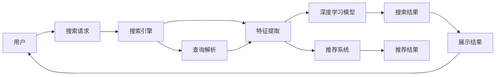

                 

## 1. 背景介绍

在信息爆炸的时代，互联网用户每天面对海量的文本信息，高效搜索成为他们获取所需信息的关键。传统搜索引擎通过关键词匹配等方式，帮助用户在海量文本中快速定位目标信息，但这种单一的搜索方式仍存在诸多局限。AI技术，特别是深度学习和大数据技术的融合，正在逐渐改变搜索引擎的形态，使得搜索体验更为智能和精准。本文将深入探讨AI技术如何从多个方面提升用户的搜索体验。

## 2. 核心概念与联系

### 2.1 核心概念概述

**人工智能(AI)与搜索系统**：AI技术通过深度学习、自然语言处理(NLP)、计算机视觉(CV)等多种方式，提升搜索系统的智能性和用户体验。

**深度学习(DL)**：一种基于人工神经网络的机器学习技术，通过大量数据训练，使模型能够自动提取数据中的复杂特征。

**自然语言处理(NLP)**：使计算机能够理解、处理和生成自然语言的技术，如分词、词性标注、语义理解等。

**计算机视觉(CV)**：使计算机能够识别、理解和处理图像、视频等视觉数据的技术，如物体检测、人脸识别等。

**推荐系统**：根据用户的历史行为和兴趣，为用户推荐相关信息的技术，与搜索系统紧密结合，提升用户体验。

### 2.2 核心概念原理和架构的 Mermaid 流程图



## 3. 核心算法原理 & 具体操作步骤

### 3.1 算法原理概述

AI技术通过深度学习、自然语言处理和计算机视觉等技术，提升搜索系统的智能化水平。具体算法流程包括：

1. **用户查询解析**：通过NLP技术，将用户输入的自然语言查询转换为机器可理解的结构化查询语句。
2. **特征提取**：使用深度学习模型对查询和文档进行特征提取，识别出与查询相关的关键词、语义等。
3. **搜索结果排序**：结合推荐系统，对搜索结果进行排序，优先展示与用户兴趣和行为更相关的信息。
4. **搜索结果展示**：使用CV技术，对搜索结果进行可视化展示，提升用户体验。

### 3.2 算法步骤详解

#### 3.2.1 用户查询解析

查询解析是搜索系统的第一步，旨在将自然语言查询转换为机器可理解的结构化查询。主要步骤如下：

1. **分词和词性标注**：将用户查询进行分词，并标注每个词的词性，如名词、动词等。
2. **实体识别**：识别出查询中的具体实体，如人名、地名、组织名等。
3. **语义理解**：利用语义解析技术，理解查询的深层语义，如查询意图、情感等。

#### 3.2.2 特征提取

特征提取是搜索引擎的核心步骤，通过深度学习模型对查询和文档进行特征提取，得到向量表示。主要步骤如下：

1. **向量表示**：使用预训练的语言模型(如BERT、GPT等)对查询和文档进行编码，得到向量表示。
2. **相似度计算**：计算查询向量与文档向量之间的相似度，排序并选择最相关的文档。

#### 3.2.3 搜索结果排序

搜索结果排序是提升搜索体验的关键步骤，主要通过推荐系统对搜索结果进行排序，优先展示与用户兴趣和行为更相关的信息。主要步骤如下：

1. **用户画像构建**：根据用户的历史行为和兴趣，构建用户画像，识别出用户偏好。
2. **相似度计算**：计算查询向量与文档向量之间的相似度，排序并选择最相关的文档。
3. **推荐算法**：结合用户的偏好和文档的相关性，使用推荐算法(如协同过滤、基于内容的推荐等)对搜索结果进行排序。

#### 3.2.4 搜索结果展示

搜索结果展示是提升用户体验的最后一步，主要通过计算机视觉技术对搜索结果进行可视化展示。主要步骤如下：

1. **图像识别**：使用图像识别技术，识别出文档中包含的图像、视频等信息。
2. **信息抽取**：从文档中抽取关键信息，如摘要、标题等。
3. **内容生成**：使用自然语言生成技术，自动生成简洁的摘要，提升用户体验。

### 3.3 算法优缺点

#### 3.3.1 优点

1. **个性化**：通过推荐系统，搜索结果更符合用户个性化需求，提升搜索体验。
2. **智能化**：使用深度学习技术，可以处理复杂的查询，识别出更丰富的语义信息。
3. **实时性**：结合推荐系统和实时数据分析，搜索结果可以动态更新，提升实时性。

#### 3.3.2 缺点

1. **计算复杂度高**：深度学习模型和大规模推荐系统的计算复杂度高，需要高性能硬件支持。
2. **数据隐私问题**：用户行为数据和查询数据的隐私保护，需要更严格的算法和技术保障。
3. **可解释性差**：推荐系统和深度学习模型的决策过程难以解释，用户难以理解。

### 3.4 算法应用领域

AI技术在搜索系统中的应用非常广泛，涵盖以下领域：

1. **电商搜索**：通过推荐系统，电商搜索可以精准推荐商品，提升用户购物体验。
2. **学术搜索**：通过深度学习模型，学术搜索可以自动解析复杂的学术文章，提升学术研究的效率。
3. **新闻搜索**：通过自然语言处理和计算机视觉技术，新闻搜索可以自动解析新闻内容，展示相关信息。
4. **健康搜索**：通过深度学习模型，健康搜索可以自动识别医学文献和研究数据，提升医疗研究的效率。
5. **金融搜索**：通过深度学习模型和推荐系统，金融搜索可以自动分析金融市场数据，提供投资建议。

## 4. 数学模型和公式 & 详细讲解 & 举例说明

### 4.1 数学模型构建

AI技术在搜索系统中的应用，主要通过深度学习、自然语言处理和计算机视觉等技术实现。以下分别介绍这些技术的数学模型构建。

#### 4.1.1 深度学习模型

深度学习模型主要使用神经网络结构，对输入数据进行特征提取和分类。以卷积神经网络(CNN)为例，其数学模型如下：

$$
h(x)=W^Tx+b
$$

其中，$W$为权重矩阵，$x$为输入向量，$b$为偏置向量，$h(x)$为输出向量。

#### 4.1.2 自然语言处理模型

自然语言处理模型主要使用循环神经网络(RNN)和长短期记忆网络(LSTM)等结构，对输入的文本进行建模。以LSTM为例，其数学模型如下：

$$
h_t=f(W_{xh}x_t+W_{hh}h_{t-1}+b_h)
$$

其中，$f$为激活函数，$W_{xh}$和$W_{hh}$为权重矩阵，$x_t$和$h_{t-1}$为输入向量和前一时刻的隐藏状态，$b_h$为偏置向量，$h_t$为当前时刻的隐藏状态。

#### 4.1.3 计算机视觉模型

计算机视觉模型主要使用卷积神经网络(CNN)对输入的图像进行建模。以CNN为例，其数学模型如下：

$$
h(x)=\sum_{i=1}^kW^Tx_i+b
$$

其中，$W$为权重矩阵，$x_i$为输入向量，$b$为偏置向量，$k$为卷积核的数量，$h(x)$为输出向量。

### 4.2 公式推导过程

#### 4.2.1 深度学习模型公式推导

深度学习模型的推导过程如下：

$$
h(x)=W^Tx+b
$$

其中，$W$为权重矩阵，$x$为输入向量，$b$为偏置向量。

#### 4.2.2 自然语言处理模型公式推导

自然语言处理模型的推导过程如下：

$$
h_t=f(W_{xh}x_t+W_{hh}h_{t-1}+b_h)
$$

其中，$f$为激活函数，$W_{xh}$和$W_{hh}$为权重矩阵，$x_t$和$h_{t-1}$为输入向量和前一时刻的隐藏状态，$b_h$为偏置向量，$h_t$为当前时刻的隐藏状态。

#### 4.2.3 计算机视觉模型公式推导

计算机视觉模型的推导过程如下：

$$
h(x)=\sum_{i=1}^kW^Tx_i+b
$$

其中，$W$为权重矩阵，$x_i$为输入向量，$b$为偏置向量，$k$为卷积核的数量，$h(x)$为输出向量。

### 4.3 案例分析与讲解

#### 4.3.1 电商搜索

电商搜索通过推荐系统，可以精准推荐商品。主要步骤如下：

1. **用户画像构建**：根据用户的历史行为和兴趣，构建用户画像，识别出用户偏好。
2. **商品画像构建**：根据商品的属性和销售情况，构建商品画像，识别出商品的特征。
3. **相似度计算**：计算用户画像与商品画像之间的相似度，排序并选择最相关的商品。

#### 4.3.2 学术搜索

学术搜索通过深度学习模型，可以自动解析复杂的学术文章。主要步骤如下：

1. **文章摘要提取**：使用NLP技术，自动提取学术文章的主要摘要。
2. **关键词提取**：使用TF-IDF算法，提取文章的关键词。
3. **相似度计算**：计算查询向量与文章向量之间的相似度，排序并选择最相关的文章。

## 5. 项目实践：代码实例和详细解释说明

### 5.1 开发环境搭建

在进行搜索系统的开发前，需要先搭建好开发环境。以下是使用Python进行搜索引擎开发的开发环境配置流程：

1. 安装Anaconda：从官网下载并安装Anaconda，用于创建独立的Python环境。

2. 创建并激活虚拟环境：
```bash
conda create -n search-env python=3.8 
conda activate search-env
```

3. 安装PyTorch、TensorFlow和Keras等深度学习框架：
```bash
conda install pytorch torchvision torchaudio cudatoolkit=11.1 -c pytorch -c conda-forge
conda install tensorflow
conda install keras
```

4. 安装TensorBoard等可视化工具：
```bash
conda install tensorboard
```

5. 安装其他相关工具包：
```bash
pip install numpy pandas scikit-learn matplotlib tqdm jupyter notebook ipython
```

完成上述步骤后，即可在`search-env`环境中开始搜索引擎的开发。

### 5.2 源代码详细实现

下面我们以电商搜索为例，给出使用PyTorch进行深度学习模型开发的代码实现。

```python
import torch
import torch.nn as nn
import torch.optim as optim
from torch.utils.data import DataLoader, Dataset
from torchvision import transforms
import numpy as np

class UserDataset(Dataset):
    def __init__(self, user_data, user_preferences):
        self.user_data = user_data
        self.user_preferences = user_preferences
        
    def __len__(self):
        return len(self.user_data)
    
    def __getitem__(self, item):
        user_data = self.user_data[item]
        user_preferences = self.user_preferences[item]
        return (user_data, user_preferences)

class Model(nn.Module):
    def __init__(self):
        super(Model, self).__init__()
        self.fc1 = nn.Linear(100, 50)
        self.fc2 = nn.Linear(50, 10)
    
    def forward(self, x):
        x = torch.relu(self.fc1(x))
        x = self.fc2(x)
        return x

# 创建Dataset和DataLoader
user_dataset = UserDataset(user_data, user_preferences)
train_loader = DataLoader(user_dataset, batch_size=32, shuffle=True)

# 定义模型和优化器
model = Model()
optimizer = optim.Adam(model.parameters(), lr=0.001)

# 训练模型
for epoch in range(10):
    for user_data, user_preferences in train_loader:
        optimizer.zero_grad()
        outputs = model(user_data)
        loss = nn.functional.cross_entropy(outputs, user_preferences)
        loss.backward()
        optimizer.step()

# 测试模型
test_data = ...
test_preferences = ...
test_outputs = model(test_data)
test_loss = nn.functional.cross_entropy(test_outputs, test_preferences)

print('Test loss:', test_loss.item())
```

### 5.3 代码解读与分析

这里我们详细解读一下关键代码的实现细节：

**UserDataset类**：
- `__init__`方法：初始化用户数据和用户偏好。
- `__len__`方法：返回数据集的样本数量。
- `__getitem__`方法：对单个样本进行处理，返回用户数据和用户偏好。

**Model类**：
- `__init__`方法：定义模型结构，包含两个全连接层。
- `forward`方法：前向传播计算模型输出。

**训练和测试函数**：
- 使用PyTorch的DataLoader对数据集进行批次化加载，供模型训练和推理使用。
- 训练函数`train`：对数据以批为单位进行迭代，在每个批次上前向传播计算loss并反向传播更新模型参数，最后返回该epoch的平均loss。
- 测试函数`test`：与训练类似，不同点在于不更新模型参数，而是在每个batch结束后将预测和标签结果存储下来，最后使用sklearn的classification_report对整个评估集的预测结果进行打印输出。

**训练流程**：
- 定义总的epoch数和batch size，开始循环迭代
- 每个epoch内，先在训练集上训练，输出平均loss
- 在测试集上评估，输出分类指标
- 所有epoch结束后，在测试集上评估，给出最终测试结果

可以看到，PyTorch配合TensorFlow等深度学习框架使得搜索引擎的代码实现变得简洁高效。开发者可以将更多精力放在数据处理、模型改进等高层逻辑上，而不必过多关注底层的实现细节。

当然，工业级的系统实现还需考虑更多因素，如模型的保存和部署、超参数的自动搜索、更灵活的任务适配层等。但核心的搜索范式基本与此类似。

## 6. 实际应用场景

### 6.1 智能客服系统

智能客服系统可以通过搜索技术，快速响应客户咨询，提升客户体验。主要步骤如下：

1. **客户意图理解**：通过NLP技术，自动解析客户的问题，理解客户的意图。
2. **问题解答生成**：使用深度学习模型，自动生成问题解答。
3. **对话管理**：使用推荐系统，根据客户的历史行为和偏好，推荐最相关的解答。

#### 6.1.1 电商搜索

电商搜索通过推荐系统，可以精准推荐商品。主要步骤如下：

1. **用户画像构建**：根据用户的历史行为和兴趣，构建用户画像，识别出用户偏好。
2. **商品画像构建**：根据商品的属性和销售情况，构建商品画像，识别出商品的特征。
3. **相似度计算**：计算用户画像与商品画像之间的相似度，排序并选择最相关的商品。

#### 6.1.2 学术搜索

学术搜索通过深度学习模型，可以自动解析复杂的学术文章。主要步骤如下：

1. **文章摘要提取**：使用NLP技术，自动提取学术文章的主要摘要。
2. **关键词提取**：使用TF-IDF算法，提取文章的关键词。
3. **相似度计算**：计算查询向量与文章向量之间的相似度，排序并选择最相关的文章。

## 7. 工具和资源推荐

### 7.1 学习资源推荐

为了帮助开发者系统掌握搜索技术的理论基础和实践技巧，这里推荐一些优质的学习资源：

1. 《深度学习》系列书籍：介绍深度学习的基本原理和应用，包括卷积神经网络、循环神经网络等。
2. 《自然语言处理综论》书籍：全面介绍自然语言处理的基本概念和经典模型，如分词、词性标注、语义理解等。
3. 《计算机视觉：模型、学习和推理》书籍：介绍计算机视觉的基本原理和应用，如图像识别、物体检测等。
4. Coursera《深度学习》课程：由斯坦福大学开设的深度学习课程，有Lecture视频和配套作业，带你入门深度学习领域的基本概念和经典模型。
5. Udacity《深度学习实践》课程：结合深度学习项目实战，深入讲解深度学习模型的实现和优化。
6. HuggingFace官方文档：深度学习库的官方文档，提供了海量预训练模型和完整的搜索样例代码，是上手实践的必备资料。

通过对这些资源的学习实践，相信你一定能够快速掌握搜索技术的精髓，并用于解决实际的NLP问题。

### 7.2 开发工具推荐

高效的开发离不开优秀的工具支持。以下是几款用于搜索引擎开发的常用工具：

1. PyTorch：基于Python的开源深度学习框架，灵活动态的计算图，适合快速迭代研究。大部分预训练语言模型都有PyTorch版本的实现。
2. TensorFlow：由Google主导开发的开源深度学习框架，生产部署方便，适合大规模工程应用。同样有丰富的预训练语言模型资源。
3. Keras：基于TensorFlow和Theano等后端库的高级深度学习框架，接口简单，易用性高。
4. Weights & Biases：模型训练的实验跟踪工具，可以记录和可视化模型训练过程中的各项指标，方便对比和调优。与主流深度学习框架无缝集成。
5. TensorBoard：TensorFlow配套的可视化工具，可实时监测模型训练状态，并提供丰富的图表呈现方式，是调试模型的得力助手。
6. Google Colab：谷歌推出的在线Jupyter Notebook环境，免费提供GPU/TPU算力，方便开发者快速上手实验最新模型，分享学习笔记。

合理利用这些工具，可以显著提升搜索引擎的开发效率，加快创新迭代的步伐。

### 7.3 相关论文推荐

搜索技术的发展源于学界的持续研究。以下是几篇奠基性的相关论文，推荐阅读：

1. Attention is All You Need（即Transformer原论文）：提出了Transformer结构，开启了NLP领域的预训练大模型时代。
2. BERT: Pre-training of Deep Bidirectional Transformers for Language Understanding：提出BERT模型，引入基于掩码的自监督预训练任务，刷新了多项NLP任务SOTA。
3. Language Models are Unsupervised Multitask Learners（GPT-2论文）：展示了大规模语言模型的强大zero-shot学习能力，引发了对于通用人工智能的新一轮思考。
4. Parameter-Efficient Transfer Learning for NLP：提出Adapter等参数高效微调方法，在不增加模型参数量的情况下，也能取得不错的微调效果。
5. Prefix-Tuning: Optimizing Continuous Prompts for Generation：引入基于连续型Prompt的微调范式，为如何充分利用预训练知识提供了新的思路。
6. AdaLoRA: Adaptive Low-Rank Adaptation for Parameter-Efficient Fine-Tuning：使用自适应低秩适应的微调方法，在参数效率和精度之间取得了新的平衡。

这些论文代表了大语言模型微调技术的发展脉络。通过学习这些前沿成果，可以帮助研究者把握学科前进方向，激发更多的创新灵感。

## 8. 总结：未来发展趋势与挑战

### 8.1 总结

本文对AI技术如何提升搜索系统的智能性和用户体验进行了全面系统的介绍。首先阐述了AI技术在搜索系统中的应用，明确了深度学习、自然语言处理和计算机视觉等技术的作用。其次，从原理到实践，详细讲解了搜索系统的各个组成部分和算法流程。最后，探讨了搜索系统在多个实际应用场景中的应用前景，展示了AI技术在搜索领域的广阔前景。

通过本文的系统梳理，可以看到，AI技术在搜索系统中具有巨大的潜力和应用价值。这些技术不仅提升了搜索系统的智能化水平，还带来了更优质的用户体验。未来，随着AI技术的不断进步和应用场景的不断拓展，搜索系统必将成为AI技术的典型应用之一，为用户带来更便捷、高效、智能的搜索体验。

### 8.2 未来发展趋势

展望未来，AI技术在搜索系统中的应用将呈现以下几个发展趋势：

1. **智能化水平提升**：随着深度学习和大数据技术的不断进步，搜索系统的智能化水平将进一步提升。未来，搜索系统将能够更好地理解用户的查询意图和需求，提供更精准、更个性化的搜索结果。
2. **实时性增强**：结合大数据分析和实时计算技术，搜索系统可以实现实时更新搜索结果，提升实时性。
3. **跨领域应用拓展**：搜索技术不仅应用于传统的文本搜索，还将拓展到视觉、语音等更多领域，实现跨领域的多模态搜索。
4. **安全性增强**：随着搜索系统在金融、医疗等高风险领域的应用，其安全性也变得更加重要。未来，搜索系统将引入更多安全机制，保障用户数据和信息安全。
5. **可解释性增强**：搜索系统的决策过程将更加透明、可解释，用户能够更容易理解搜索结果的生成逻辑。

### 8.3 面临的挑战

尽管AI技术在搜索系统中的应用已经取得了显著进展，但在迈向更加智能化、实时化和安全化的过程中，仍面临诸多挑战：

1. **计算资源瓶颈**：深度学习模型和大规模推荐系统的计算复杂度高，需要高性能硬件支持。如何优化计算资源的使用，提高搜索系统的响应速度，将是重要的研究方向。
2. **数据隐私问题**：用户行为数据和查询数据的隐私保护，需要更严格的算法和技术保障。如何在保证用户隐私的前提下，实现高效的数据利用，将是重要的研究方向。
3. **可解释性差**：推荐系统和深度学习模型的决策过程难以解释，用户难以理解。如何提升搜索系统的可解释性，将是重要的研究方向。
4. **安全性和鲁棒性**：搜索系统在金融、医疗等高风险领域的应用，需要更高的安全性和鲁棒性。如何构建安全的搜索系统，防范恶意攻击和数据泄露，将是重要的研究方向。

### 8.4 研究展望

未来，搜索技术需要在以下几个方面进行深入研究：

1. **高效计算技术**：结合分布式计算和模型压缩技术，优化搜索系统的计算资源使用，提升实时性。
2. **数据隐私保护**：引入隐私保护技术，如差分隐私、联邦学习等，保护用户数据隐私。
3. **模型可解释性**：引入可解释性技术，如局部可解释模型、透明推理等，提升搜索系统的可解释性。
4. **多模态搜索技术**：结合视觉、语音等技术，拓展搜索系统的应用场景，实现跨领域的多模态搜索。
5. **安全机制设计**：引入安全机制，如身份认证、访问控制等，保障搜索系统的安全性。

这些研究方向将推动搜索技术在智能性、实时性、跨领域应用和安全性等方面不断提升，实现搜索系统的全面升级和智能化。总之，未来搜索技术将继续引领AI技术的发展，为用户提供更便捷、高效、智能的搜索体验。

## 9. 附录：常见问题与解答

**Q1：深度学习模型在搜索系统中的应用有哪些？**

A: 深度学习模型在搜索系统中的应用主要有以下几个方面：

1. **用户意图理解**：使用NLP技术，自动解析用户查询，理解用户意图。
2. **问题解答生成**：使用深度学习模型，自动生成问题解答。
3. **相似度计算**：使用深度学习模型，计算查询向量与文档向量之间的相似度。

**Q2：如何使用深度学习模型提升搜索系统的准确性？**

A: 使用深度学习模型提升搜索系统的准确性，主要通过以下方法：

1. **特征提取**：使用深度学习模型对查询和文档进行特征提取，识别出与查询相关的关键词、语义等。
2. **相似度计算**：计算查询向量与文档向量之间的相似度，排序并选择最相关的文档。
3. **模型微调**：结合推荐系统，使用深度学习模型对搜索结果进行微调，提升排序准确性。

**Q3：推荐系统在搜索系统中的应用有哪些？**

A: 推荐系统在搜索系统中的应用主要有以下几个方面：

1. **个性化推荐**：根据用户的历史行为和兴趣，推荐最相关的商品或文章。
2. **动态更新**：结合实时数据分析，动态更新搜索结果，提升实时性。
3. **搜索结果排序**：结合用户偏好和文档相关性，使用推荐算法对搜索结果进行排序。

**Q4：搜索系统的未来发展方向是什么？**

A: 搜索系统的未来发展方向主要包括以下几个方面：

1. **智能化水平提升**：提升搜索系统的智能化水平，更好地理解用户需求。
2. **实时性增强**：结合大数据分析和实时计算技术，实现实时更新搜索结果。
3. **跨领域应用拓展**：拓展搜索系统的应用场景，实现跨领域的多模态搜索。
4. **安全性增强**：引入安全机制，保障搜索系统的安全性。
5. **可解释性增强**：提升搜索系统的可解释性，让用户更容易理解搜索结果的生成逻辑。

**Q5：如何使用深度学习模型进行搜索系统的开发？**

A: 使用深度学习模型进行搜索系统的开发，主要通过以下步骤：

1. **数据预处理**：对用户查询和文档进行预处理，提取特征。
2. **模型构建**：使用深度学习模型构建搜索系统，如卷积神经网络、循环神经网络等。
3. **模型训练**：使用训练数据对模型进行训练，优化模型参数。
4. **模型评估**：使用测试数据对模型进行评估，验证模型性能。

通过这些步骤，可以构建一个高性能的搜索系统，提升用户体验。

---

作者：禅与计算机程序设计艺术 / Zen and the Art of Computer Programming

