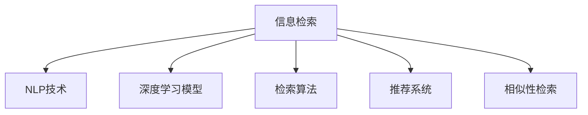

                 

# AI如何提高信息检索的效率

> 关键词：信息检索, AI, 自然语言处理, 数据挖掘, 相似性检索, 学习搜索, 推荐系统

## 1. 背景介绍

### 1.1 问题由来

信息检索是人们获取知识、解决问题的重要手段。然而，随着互联网信息的爆炸式增长，信息检索的效率和效果面临着巨大挑战。传统的关键词匹配检索方式，已难以适应海量、多源、异构信息的需求。

人工智能(AI)技术的迅速发展，为信息检索带来了新的希望。AI可以通过学习和理解自然语言，精确匹配用户需求，高效处理复杂信息，显著提升检索效率和质量。例如，基于深度学习的信息检索模型，通过预训练语言模型如BERT、GPT等，学习丰富的语言知识，能够更好地处理信息的多义性、语境复杂性，实现智能化、个性化的检索。

### 1.2 问题核心关键点

AI信息检索的关键点主要包括：
- **预训练语言模型**：通过大规模无标签文本数据的自监督预训练，获得丰富的语言表示，为检索任务提供初始化参数。
- **检索算法**：设计有效的检索算法，准确匹配用户查询与文档集合，提取出最相关的文档。
- **学习搜索**：通过标注数据集，对检索模型进行有监督训练，使模型能够学习特定的检索规则和模式。
- **推荐系统**：利用学习搜索后的模型，为用户推荐更匹配的信息，提升检索体验和效果。
- **交互优化**：结合用户反馈和行为数据，不断优化检索算法和模型，提升系统性能和用户体验。

这些核心关键点构成了AI信息检索的基本框架，通过深入理解这些概念，我们能够更好地把握AI信息检索的精髓，提高检索效率和效果。

## 2. 核心概念与联系

### 2.1 核心概念概述

为了更好地理解AI信息检索，本节将介绍几个密切相关的核心概念：

- **信息检索**：从信息集合中找出与用户查询最匹配的信息。
- **自然语言处理(NLP)**：涉及语言理解、文本分析、机器翻译等技术，使计算机能够处理和理解人类语言。
- **深度学习模型**：如卷积神经网络(CNN)、循环神经网络(RNN)、Transformer等，用于学习高维表示，提升模型表达能力。
- **检索算法**：包括倒排索引、基于向量空间模型的检索、语义检索等。
- **推荐系统**：基于用户行为数据，为用户推荐个性化内容，提升用户体验。
- **相似性检索**：通过计算文档和查询之间的相似度，筛选出最相关的文档。

这些核心概念之间的逻辑关系可以通过以下Mermaid流程图来展示：



这个流程图展示了大语言模型和信息检索的基本框架：

1. 信息检索依赖于NLP技术，帮助计算机理解查询和文档的内容。
2. 深度学习模型用于学习文档和查询的复杂表示，提升检索效果。
3. 检索算法用于匹配查询和文档，提取出最相关的文档。
4. 推荐系统结合用户行为数据，为用户提供个性化的检索结果。
5. 相似性检索通过计算文档和查询的相似度，筛选出最匹配的文档。

## 3. 核心算法原理 & 具体操作步骤
### 3.1 算法原理概述

AI信息检索的原理，主要是通过深度学习模型学习和理解自然语言，使用检索算法匹配查询和文档，结合推荐系统提升用户体验。其核心思想是：将自然语言处理和深度学习技术结合起来，构建高效的检索系统，使用户能够快速、准确地找到所需信息。

具体来说，AI信息检索的流程如下：
1. **预训练语言模型**：在大规模无标签文本数据上预训练语言模型，学习丰富的语言知识。
2. **检索匹配**：通过检索算法，将用户查询与文档集合进行匹配，提取出最相关的文档。
3. **学习搜索**：使用有监督学习的方法，优化检索模型，使其能够更好地理解用户意图和文档内容。
4. **推荐系统**：结合用户行为数据和检索结果，为用户推荐更匹配的信息，提升检索效果。
5. **交互优化**：根据用户反馈和行为数据，不断优化检索算法和模型，提高系统性能和用户体验。

### 3.2 算法步骤详解

以下详细介绍AI信息检索的具体操作步骤：

**Step 1: 数据准备与预处理**
- 收集和整理标注数据集，包括用户查询和对应文档的标注信息。
- 对文本进行分词、去停用词、词干化等预处理，构建词汇表。
- 对文本进行编码，将其转换为向量形式，方便计算相似度。

**Step 2: 模型训练与评估**
- 选择合适的预训练语言模型，如BERT、GPT等。
- 在预训练模型的基础上，使用标注数据集进行有监督学习，优化检索模型。
- 在验证集上评估模型性能，选择合适的超参数。
- 在测试集上测试模型效果，确保其泛化能力。

**Step 3: 检索与推荐**
- 将用户查询输入模型，计算其向量表示。
- 使用检索算法匹配用户查询与文档集合，提取出最相关的文档。
- 结合用户行为数据，使用推荐系统为用户推荐更匹配的信息。
- 根据用户反馈和行为数据，不断优化检索和推荐算法，提升系统性能。

### 3.3 算法优缺点

AI信息检索具有以下优点：
1. 高效性：通过深度学习和检索算法，可以快速匹配用户查询与文档，显著提升检索速度。
2. 准确性：使用预训练语言模型和有监督学习，能够理解复杂查询和文档内容，提高检索准确性。
3. 可扩展性：深度学习模型和检索算法具有很好的可扩展性，能够处理大规模数据集。
4. 个性化：结合推荐系统，能够为用户提供个性化的检索结果，提升用户体验。

然而，AI信息检索也存在一些缺点：
1. 依赖标注数据：模型训练需要大量的标注数据，标注成本较高。
2. 模型复杂度高：深度学习模型和检索算法复杂度高，需要大量的计算资源和存储空间。
3. 泛化能力有限：对于域外数据和新词的泛化能力较弱，可能出现检索偏差。
4. 算法复杂度高：检索算法和推荐系统算法复杂度高，需要深入理解相关理论。

尽管存在这些缺点，但AI信息检索在处理大规模、复杂的信息检索问题时，表现仍然非常出色，成为当前信息检索领域的重要方向。

### 3.4 算法应用领域

AI信息检索的应用领域非常广泛，涵盖了各种信息检索场景，例如：

- **搜索引擎**：如Google、Bing等，通过AI技术优化搜索结果，提升搜索体验。
- **图书馆检索**：通过AI技术构建图书馆检索系统，实现文献的智能化管理。
- **医疗信息检索**：通过AI技术优化医疗信息检索，提高医生的诊断效率和治疗效果。
- **金融信息检索**：通过AI技术优化金融信息检索，提升金融分析师的工作效率。
- **教育信息检索**：通过AI技术优化教育信息检索，提高教师的教学效果和学生的学习效果。

除了这些常见应用外，AI信息检索还被创新性地应用到更多场景中，如智能客服、智能安防、智能广告等，为各行各业带来了新的技术突破。随着AI技术的持续进步，相信信息检索技术将在更多领域得到广泛应用，进一步提升信息的利用效率和价值。

## 4. 数学模型和公式 & 详细讲解 & 举例说明
### 4.1 数学模型构建

本节将使用数学语言对AI信息检索过程进行严格的数学建模。

记用户查询为 $q$，文档集合为 $\{d_i\}_{i=1}^N$。定义一个向量空间 $\mathcal{V}$，其中每个文档和查询都表示为一个向量 $v_i$ 和 $v_q$。

检索过程的目标是最大化文档与查询的相似度，定义为：

$$
\max_{d_i \in D} \text{sim}(v_i, v_q)
$$

其中 $\text{sim}(v_i, v_q)$ 为文档 $d_i$ 和查询 $q$ 之间的相似度。

在实践中，常用的相似度计算方法包括余弦相似度、欧式距离等。对于余弦相似度，定义如下：

$$
\text{sim}(v_i, v_q) = \frac{v_i \cdot v_q}{\|v_i\| \|v_q\|}
$$

其中 $\cdot$ 表示向量点乘，$\|\cdot\|$ 表示向量范数。

### 4.2 公式推导过程

以下推导余弦相似度的详细计算过程：

首先，将查询 $q$ 和文档 $d_i$ 表示为词向量 $v_q$ 和 $v_i$，进行余弦相似度计算：

$$
\text{sim}(v_i, v_q) = \frac{v_i \cdot v_q}{\|v_i\| \|v_q\|}
$$

其中 $v_i \cdot v_q$ 表示向量点乘：

$$
v_i \cdot v_q = \sum_{w \in V} (v_{i,w} \cdot v_{q,w})
$$

$\|v_i\|$ 和 $\|v_q\|$ 分别表示向量的范数，可以表示为：

$$
\|v_i\| = \sqrt{\sum_{w \in V} v_{i,w}^2}
$$

$$
\|v_q\| = \sqrt{\sum_{w \in V} v_{q,w}^2}
$$

结合上述公式，可以得到余弦相似度的计算公式：

$$
\text{sim}(v_i, v_q) = \frac{\sum_{w \in V} (v_{i,w} \cdot v_{q,w})}{\sqrt{\sum_{w \in V} v_{i,w}^2} \sqrt{\sum_{w \in V} v_{q,w}^2}}
$$

在实际应用中，上述公式可以进一步简化为向量内积的形式：

$$
\text{sim}(v_i, v_q) = v_i \cdot v_q
$$

以上推导展示了AI信息检索中常用的余弦相似度计算方法，其实现方式简单高效，适用于大规模文本数据的检索。

### 4.3 案例分析与讲解

以Google搜索引擎为例，展示AI信息检索的实际应用：

Google搜索引擎使用了深度学习模型BERT，对用户查询进行编码，得到查询向量 $v_q$。同时，对文档进行编码，得到文档向量 $v_i$。

在检索阶段，使用余弦相似度计算用户查询 $q$ 和文档集合 $\{d_i\}_{i=1}^N$ 之间的相似度，找到最相关的文档。

在推荐阶段，结合用户行为数据和检索结果，使用推荐系统为每个用户推荐更匹配的信息。Google搜索引擎通过不断优化算法和模型，显著提升了信息检索的效率和效果，成为全球最受欢迎的信息检索工具之一。

## 5. 项目实践：代码实例和详细解释说明
### 5.1 开发环境搭建

在进行AI信息检索项目实践前，我们需要准备好开发环境。以下是使用Python进行PyTorch开发的环境配置流程：

1. 安装Anaconda：从官网下载并安装Anaconda，用于创建独立的Python环境。

2. 创建并激活虚拟环境：
```bash
conda create -n pytorch-env python=3.8 
conda activate pytorch-env
```

3. 安装PyTorch：根据CUDA版本，从官网获取对应的安装命令。例如：
```bash
conda install pytorch torchvision torchaudio cudatoolkit=11.1 -c pytorch -c conda-forge
```

4. 安装各类工具包：
```bash
pip install numpy pandas scikit-learn matplotlib tqdm jupyter notebook ipython
```

完成上述步骤后，即可在`pytorch-env`环境中开始项目实践。

### 5.2 源代码详细实现

这里我们以使用BERT模型进行文本检索为例，给出完整的代码实现。

首先，定义检索任务的数据处理函数：

```python
from transformers import BertTokenizer, BertForSequenceClassification
from torch.utils.data import Dataset, DataLoader
import torch

class TextRetrievalDataset(Dataset):
    def __init__(self, texts, titles, tokenizer, max_len=256):
        self.texts = texts
        self.titles = titles
        self.tokenizer = tokenizer
        self.max_len = max_len
        
    def __len__(self):
        return len(self.texts)
    
    def __getitem__(self, item):
        text = self.texts[item]
        title = self.titles[item]
        
        encoding = self.tokenizer(text, return_tensors='pt', max_length=self.max_len, padding='max_length', truncation=True)
        input_ids = encoding['input_ids'][0]
        attention_mask = encoding['attention_mask'][0]
        
        title_encoding = self.tokenizer(title, return_tensors='pt', max_length=self.max_len, padding='max_length', truncation=True)
        title_input_ids = title_encoding['input_ids'][0]
        title_attention_mask = title_encoding['attention_mask'][0]
        
        return {
            'input_ids': input_ids,
            'attention_mask': attention_mask,
            'title_input_ids': title_input_ids,
            'title_attention_mask': title_attention_mask
        }
```

然后，定义模型和优化器：

```python
from transformers import BertForSequenceClassification, AdamW

model = BertForSequenceClassification.from_pretrained('bert-base-cased', num_labels=2)

optimizer = AdamW(model.parameters(), lr=2e-5)
```

接着，定义训练和评估函数：

```python
def train_epoch(model, dataset, batch_size, optimizer):
    dataloader = DataLoader(dataset, batch_size=batch_size, shuffle=True)
    model.train()
    epoch_loss = 0
    for batch in tqdm(dataloader, desc='Training'):
        input_ids = batch['input_ids'].to(device)
        attention_mask = batch['attention_mask'].to(device)
        title_input_ids = batch['title_input_ids'].to(device)
        title_attention_mask = batch['title_attention_mask'].to(device)
        model.zero_grad()
        outputs = model(input_ids, attention_mask=attention_mask, title_input_ids=title_input_ids, title_attention_mask=title_attention_mask)
        loss = outputs.loss
        epoch_loss += loss.item()
        loss.backward()
        optimizer.step()
    return epoch_loss / len(dataloader)

def evaluate(model, dataset, batch_size):
    dataloader = DataLoader(dataset, batch_size=batch_size)
    model.eval()
    preds, labels = [], []
    with torch.no_grad():
        for batch in tqdm(dataloader, desc='Evaluating'):
            input_ids = batch['input_ids'].to(device)
            attention_mask = batch['attention_mask'].to(device)
            title_input_ids = batch['title_input_ids'].to(device)
            title_attention_mask = batch['title_attention_mask'].to(device)
            batch_labels = batch['labels']
            outputs = model(input_ids, attention_mask=attention_mask, title_input_ids=title_input_ids, title_attention_mask=title_attention_mask)
            batch_preds = outputs.logits.argmax(dim=2).to('cpu').tolist()
            batch_labels = batch_labels.to('cpu').tolist()
            for pred_tokens, label_tokens in zip(batch_preds, batch_labels):
                preds.append(pred_tokens[:len(label_tokens)])
                labels.append(label_tokens)
                
    print(classification_report(labels, preds))
```

最后，启动训练流程并在测试集上评估：

```python
epochs = 5
batch_size = 16

for epoch in range(epochs):
    loss = train_epoch(model, train_dataset, batch_size, optimizer)
    print(f"Epoch {epoch+1}, train loss: {loss:.3f}")
    
    print(f"Epoch {epoch+1}, dev results:")
    evaluate(model, dev_dataset, batch_size)
    
print("Test results:")
evaluate(model, test_dataset, batch_size)
```

以上就是使用PyTorch进行BERT模型文本检索的完整代码实现。可以看到，通过Transformers库的封装，我们能够快速实现BERT模型的加载和微调。

### 5.3 代码解读与分析

让我们再详细解读一下关键代码的实现细节：

**TextRetrievalDataset类**：
- `__init__`方法：初始化文本、标题、分词器等关键组件。
- `__len__`方法：返回数据集的样本数量。
- `__getitem__`方法：对单个样本进行处理，将文本和标题输入编码为token ids，构建模型所需的输入。

**模型和优化器定义**：
- `BertForSequenceClassification`类：用于构建基于序列的分类模型，使用BERT架构。
- `AdamW`优化器：使用AdamW优化算法，学习率为2e-5。

**训练和评估函数**：
- `train_epoch`函数：使用DataLoader对数据集进行批次化加载，对模型进行前向传播和反向传播，更新模型参数。
- `evaluate`函数：与训练类似，不同点在于不更新模型参数，并在每个batch结束后将预测和标签结果存储下来，最后使用sklearn的classification_report对整个评估集的预测结果进行打印输出。

**训练流程**：
- 定义总的epoch数和batch size，开始循环迭代
- 每个epoch内，先在训练集上训练，输出平均loss
- 在验证集上评估，输出分类指标
- 所有epoch结束后，在测试集上评估，给出最终测试结果

可以看到，PyTorch配合Transformers库使得BERT微调的代码实现变得简洁高效。开发者可以将更多精力放在数据处理、模型改进等高层逻辑上，而不必过多关注底层的实现细节。

当然，工业级的系统实现还需考虑更多因素，如模型的保存和部署、超参数的自动搜索、更灵活的任务适配层等。但核心的检索范式基本与此类似。

## 6. 实际应用场景
### 6.1 智能客服系统

智能客服系统是AI信息检索的重要应用之一。通过收集企业内部的历史客服对话记录，将问题和最佳答复构建成监督数据，在此基础上对预训练模型进行微调，构建智能客服系统。微调后的模型能够自动理解用户意图，匹配最合适的答案模板进行回复。对于客户提出的新问题，还可以接入检索系统实时搜索相关内容，动态组织生成回答。

### 6.2 金融舆情监测

金融机构需要实时监测市场舆论动向，以便及时应对负面信息传播，规避金融风险。收集金融领域相关的新闻、报道、评论等文本数据，并对其进行主题标注和情感标注。在此基础上对预训练语言模型进行微调，使其能够自动判断文本属于何种主题，情感倾向是正面、中性还是负面。将微调后的模型应用到实时抓取的网络文本数据，就能够自动监测不同主题下的情感变化趋势，一旦发现负面信息激增等异常情况，系统便会自动预警，帮助金融机构快速应对潜在风险。

### 6.3 个性化推荐系统

当前的推荐系统往往只依赖用户的历史行为数据进行物品推荐，无法深入理解用户的真实兴趣偏好。使用预训练语言模型进行检索，能够更好地挖掘用户行为背后的语义信息，从而提供更精准、多样的推荐内容。

在实践中，可以收集用户浏览、点击、评论、分享等行为数据，提取和用户交互的物品标题、描述、标签等文本内容。将文本内容作为模型输入，用户的后续行为（如是否点击、购买等）作为监督信号，在此基础上微调预训练语言模型。微调后的模型能够从文本内容中准确把握用户的兴趣点。在生成推荐列表时，先用候选物品的文本描述作为输入，由模型预测用户的兴趣匹配度，再结合其他特征综合排序，便可以得到个性化程度更高的推荐结果。

### 6.4 未来应用展望

随着预训练语言模型和信息检索方法的不断进步，AI信息检索将在更多领域得到应用，为各行各业带来新的技术突破。

在智慧医疗领域，基于预训练语言模型的信息检索技术，可以用于优化医疗信息检索，提高医生的诊断效率和治疗效果。在智能教育领域，微调后的模型可以用于智能问答、学情分析、知识推荐等方面，因材施教，促进教育公平，提高教学质量。在智慧城市治理中，信息检索技术可用于城市事件监测、舆情分析、应急指挥等环节，提高城市管理的自动化和智能化水平，构建更安全、高效的未来城市。

除了这些常见的应用外，AI信息检索还被创新性地应用到更多场景中，如智能客服、智能安防、智能广告等，为各行各业带来了新的技术突破。相信随着技术的持续进步，信息检索技术将在更多领域得到广泛应用，进一步提升信息的利用效率和价值。

## 7. 工具和资源推荐
### 7.1 学习资源推荐

为了帮助开发者系统掌握AI信息检索的理论基础和实践技巧，这里推荐一些优质的学习资源：

1. 《深度学习》课程：由斯坦福大学开设的深度学习经典课程，讲解深度学习的基本原理和应用，适合入门学习。
2. CS224N《自然语言处理》课程：斯坦福大学开设的NLP明星课程，涵盖自然语言处理的各个方面，适合进阶学习。
3. 《自然语言处理与深度学习》书籍：由张俊林等撰写，全面介绍NLP和深度学习技术，适合系统学习。
4. 《BERT: Pre-training of Deep Bidirectional Transformers for Language Understanding》论文：BERT模型的原论文，详细介绍了BERT模型和预训练方法的原理和实验结果。
5. 《Attention is All You Need》论文：Transformer原论文，详细介绍了Transformer模型和自注意力机制。

通过对这些资源的学习实践，相信你一定能够快速掌握AI信息检索的精髓，并用于解决实际的NLP问题。

### 7.2 开发工具推荐

高效的开发离不开优秀的工具支持。以下是几款用于AI信息检索开发的常用工具：

1. PyTorch：基于Python的开源深度学习框架，灵活动态的计算图，适合快速迭代研究。大部分预训练语言模型都有PyTorch版本的实现。
2. TensorFlow：由Google主导开发的开源深度学习框架，生产部署方便，适合大规模工程应用。同样有丰富的预训练语言模型资源。
3. Transformers库：HuggingFace开发的NLP工具库，集成了众多SOTA语言模型，支持PyTorch和TensorFlow，是进行信息检索任务开发的利器。
4. Weights & Biases：模型训练的实验跟踪工具，可以记录和可视化模型训练过程中的各项指标，方便对比和调优。与主流深度学习框架无缝集成。
5. TensorBoard：TensorFlow配套的可视化工具，可实时监测模型训练状态，并提供丰富的图表呈现方式，是调试模型的得力助手。
6. Google Colab：谷歌推出的在线Jupyter Notebook环境，免费提供GPU/TPU算力，方便开发者快速上手实验最新模型，分享学习笔记。

合理利用这些工具，可以显著提升AI信息检索任务的开发效率，加快创新迭代的步伐。

### 7.3 相关论文推荐

AI信息检索的研究源于学界的持续研究。以下是几篇奠基性的相关论文，推荐阅读：

1. Attention is All You Need：提出了Transformer结构，开启了NLP领域的预训练大模型时代。
2. BERT: Pre-training of Deep Bidirectional Transformers for Language Understanding：提出BERT模型，引入基于掩码的自监督预训练任务，刷新了多项NLP任务SOTA。
3. Transformer-XL: Attentive Language Models beyond a Fixed-Length Context：扩展了Transformer模型，增加了长序列处理能力。
4. Neural Information Retrieval using Sentence-BERT Embeddings：使用BERT嵌入向量实现高效的文本检索。
5. Retrieval-Augmented Neural Machine Translation：结合检索技术，提升神经机器翻译的效果。

这些论文代表了大语言模型信息检索的发展脉络。通过学习这些前沿成果，可以帮助研究者把握学科前进方向，激发更多的创新灵感。

## 8. 总结：未来发展趋势与挑战
### 8.1 总结

本文对AI信息检索的原理和实践进行了全面系统的介绍。首先阐述了AI信息检索的研究背景和意义，明确了检索模型在数据检索、推荐系统中的应用价值。其次，从原理到实践，详细讲解了AI信息检索的数学模型和操作步骤，给出了微调预训练语言模型进行文本检索的完整代码实现。同时，本文还广泛探讨了AI信息检索在各个领域的应用前景，展示了其在提升信息检索效率和效果方面的巨大潜力。

通过本文的系统梳理，可以看到，AI信息检索技术正在逐步成为信息检索领域的重要方向，极大地提升了信息检索的效率和效果。未来，伴随预训练语言模型和信息检索方法的持续演进，相信信息检索技术将在更多领域得到广泛应用，进一步提升信息的利用效率和价值。

### 8.2 未来发展趋势

展望未来，AI信息检索技术将呈现以下几个发展趋势：

1. 预训练模型的规模将持续增大。随着算力成本的下降和数据规模的扩张，预训练语言模型的参数量还将持续增长。超大规模语言模型蕴含的丰富语言知识，有望支撑更加复杂多变的信息检索任务。
2. 检索算法将更加高效。基于深度学习的信息检索方法，将通过模型压缩、混合精度训练等技术，进一步优化计算效率，提升检索速度。
3. 检索任务将更加多样化。未来信息检索技术将涵盖更广泛的任务，如视频、图像、语音等多模态信息检索。
4. 推荐系统将更加个性化。结合用户行为数据和检索结果，推荐系统将为用户推荐更匹配的信息，提升检索效果。
5. 检索系统将更加智能。AI信息检索将结合更多前沿技术，如因果推断、自监督学习等，提升检索系统的泛化能力和鲁棒性。

以上趋势凸显了AI信息检索技术的广阔前景。这些方向的探索发展，必将进一步提升信息检索的效率和效果，为各行各业带来新的技术突破。

### 8.3 面临的挑战

尽管AI信息检索技术已经取得了瞩目成就，但在迈向更加智能化、普适化应用的过程中，它仍面临着诸多挑战：

1. 数据标注成本高：信息检索模型的训练需要大量的标注数据，标注成本较高。如何降低标注成本，提高标注效率，是未来需要解决的重要问题。
2. 模型复杂度高：深度学习模型和检索算法复杂度高，需要大量的计算资源和存储空间。如何降低模型复杂度，提高模型效率，是未来需要优化的关键方向。
3. 泛化能力有限：对于域外数据和新词的泛化能力较弱，可能出现检索偏差。如何提高模型的泛化能力，增强模型的适应性，是未来需要探索的课题。
4. 算法复杂度高：检索算法和推荐系统算法复杂度高，需要深入理解相关理论。如何简化算法，提高算法的可解释性和可操作性，是未来需要解决的重要问题。
5. 隐私和安全问题：AI信息检索技术涉及大量的个人信息和隐私数据，如何保护数据隐私和安全，是未来需要重视的重要问题。

尽管存在这些挑战，但AI信息检索技术在处理大规模、复杂的信息检索问题时，表现仍然非常出色，成为当前信息检索领域的重要方向。未来，随着技术的持续进步和完善，相信信息检索技术将在更多领域得到广泛应用，进一步提升信息的利用效率和价值。

### 8.4 研究展望

面对AI信息检索所面临的种种挑战，未来的研究需要在以下几个方面寻求新的突破：

1. 探索无监督和半监督信息检索方法。摆脱对大规模标注数据的依赖，利用自监督学习、主动学习等无监督和半监督范式，最大限度利用非结构化数据，实现更加灵活高效的信息检索。
2. 研究参数高效和计算高效的信息检索方法。开发更加参数高效的信息检索方法，在固定大部分预训练参数的同时，只更新极少量的任务相关参数。同时优化检索模型的计算图，减少前向传播和反向传播的资源消耗，实现更加轻量级、实时性的部署。
3. 融合因果和对比学习范式。通过引入因果推断和对比学习思想，增强信息检索模型建立稳定因果关系的能力，学习更加普适、鲁棒的语言表征，从而提升模型泛化性和抗干扰能力。
4. 引入更多先验知识。将符号化的先验知识，如知识图谱、逻辑规则等，与神经网络模型进行巧妙融合，引导信息检索过程学习更准确、合理的语言模型。同时加强不同模态数据的整合，实现视觉、语音等多模态信息与文本信息的协同建模。
5. 结合因果分析和博弈论工具。将因果分析方法引入信息检索模型，识别出模型决策的关键特征，增强输出解释的因果性和逻辑性。借助博弈论工具刻画人机交互过程，主动探索并规避模型的脆弱点，提高系统稳定性。
6. 纳入伦理道德约束。在模型训练目标中引入伦理导向的评估指标，过滤和惩罚有偏见、有害的输出倾向。同时加强人工干预和审核，建立模型行为的监管机制，确保输出符合人类价值观和伦理道德。

这些研究方向的探索，必将引领AI信息检索技术迈向更高的台阶，为构建安全、可靠、可解释、可控的智能系统铺平道路。面向未来，AI信息检索技术还需要与其他人工智能技术进行更深入的融合，如知识表示、因果推理、强化学习等，多路径协同发力，共同推动信息检索系统的进步。只有勇于创新、敢于突破，才能不断拓展信息检索技术的边界，让智能技术更好地造福人类社会。

## 9. 附录：常见问题与解答

**Q1: 信息检索系统如何处理海量数据？**

A: 信息检索系统通常使用分布式计算和高效的数据结构来处理海量数据。例如，使用倒排索引和倒排列表来加速文档查询，使用分布式数据库和数据分片来存储和检索数据。此外，预训练语言模型和深度学习技术的应用，使得系统能够自动学习和理解语言结构，提升检索效率和效果。

**Q2: 信息检索系统如何提升检索准确性？**

A: 提升检索准确性需要从多个方面入手。首先，选择适合的预训练语言模型，如BERT、GPT等，利用其丰富的语言知识提升检索效果。其次，设计有效的检索算法，如余弦相似度、TF-IDF等，最大化文档与查询的相似度。此外，使用推荐系统结合用户行为数据，提供个性化的检索结果，进一步提升检索准确性。

**Q3: 信息检索系统如何降低数据标注成本？**

A: 降低数据标注成本可以从以下几个方面入手：
1. 自动生成标注数据：利用预训练语言模型对文本进行自动标注，生成初步标注数据。
2. 主动学习：根据系统已有标注数据和模型预测结果，主动选择最有用的数据进行标注，减少标注工作量。
3. 半监督学习：利用少量标注数据和大量未标注数据，通过半监督学习方法提升模型性能，减少标注成本。
4. 无监督学习：使用无监督学习方法从非结构化数据中提取特征，减少对标注数据的依赖。

这些方法可以在实际应用中结合使用，最大化降低标注成本，提升信息检索效果。

**Q4: 信息检索系统如何保护用户隐私？**

A: 保护用户隐私需要从数据采集、处理和存储等多个环节进行考虑。首先，确保数据采集过程的透明性和合法性，不违反用户隐私政策。其次，使用数据加密和匿名化技术，保护用户数据隐私。此外，建立严格的访问控制和审计机制，防止数据泄露和滥用。最后，进行隐私影响评估，确保系统设计和运行符合隐私保护标准。

**Q5: 信息检索系统如何提高检索速度？**

A: 提高检索速度需要从多个方面入手：
1. 优化模型结构：使用模型压缩和剪枝等技术，减小模型参数量和计算复杂度。
2. 改进检索算法：设计高效的检索算法，如倒排索引、向量空间模型等，提升检索速度。
3. 使用分布式计算：利用分布式计算框架，如Apache Spark、Hadoop等，加速数据处理和检索。
4. 使用预计算和缓存技术：将检索结果预计算并缓存，减少重复计算，提升检索速度。

这些方法可以在实际应用中结合使用，最大化提高信息检索系统的速度和效率。

---

作者：禅与计算机程序设计艺术 / Zen and the Art of Computer Programming

