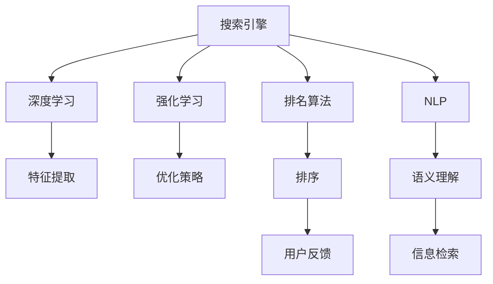

                 

# AI如何改变搜索引擎的排名算法

> 关键词：搜索引擎,排名算法,深度学习,强化学习,自然语言处理(NLP),BERT,机器学习,优化算法

## 1. 背景介绍

搜索引擎作为互联网时代的重要基础设施，始终肩负着信息检索和推荐的核心使命。传统的搜索引擎主要依赖于关键词匹配、网页相关度计算等算法，随着信息爆炸和技术进步，逐渐向基于机器学习的智能搜索引擎转型。特别是近年来，深度学习、强化学习、自然语言处理等AI技术逐步引入搜索引擎，搜索引擎的排名算法也发生了深刻的变革。

### 1.1 问题由来

搜索引擎的排名算法历经多次迭代，从早期的PageRank、HITS等模型，到近些年引入深度学习等技术，已经逐步演变为高度复杂的智能决策系统。这一变革既带来巨大的技术突破，也引发了新的问题和挑战。如何在海量数据中快速准确地获取信息，如何更好地理解用户意图，如何避免搜索结果的误导性，如何提升用户体验，成为搜索引擎优化优化的重要课题。

### 1.2 问题核心关键点
搜索引擎排名算法的核心在于如何通过算法机制，精确匹配用户查询意图，从海量数据中提取出最相关、最有用的信息，并以排序的方式进行呈现。随着AI技术的不断发展，深度学习、强化学习、自然语言处理等技术被引入，使得搜索引擎的排名算法变得更加智能和精准。

1. **深度学习技术**：通过多层神经网络进行特征提取和模型训练，可以大幅提升搜索引擎对复杂查询的理解能力。
2. **强化学习算法**：通过模拟用户行为和反馈，不断调整排序策略，可以更精准地满足用户的实际需求。
3. **自然语言处理**：利用语言模型和词向量等技术，提升搜索引擎对查询语句的语义理解能力。

这些技术使得搜索引擎从简单的关键词匹配转向了更复杂的意图理解与信息检索，极大地提升了用户的搜索体验。

## 2. 核心概念与联系

### 2.1 核心概念概述

为了更好地理解搜索引擎的排名算法变革，本节将介绍几个核心概念：

- **搜索引擎**：利用算法从海量数据中快速准确地获取信息，以网页、文章、图片等形式提供给用户，帮助用户进行信息检索、内容推荐等。

- **排名算法**：搜索引擎的核心算法，负责对搜索结果进行排序，使得最相关、最有用的信息排在最前面。

- **深度学习**：一种利用多层神经网络进行特征提取和模型训练的技术，在图像、语音、文本等领域均有广泛应用。

- **强化学习**：通过智能体与环境的互动，不断优化决策策略，以最大化某种奖励指标。

- **自然语言处理(NLP)**：研究如何让计算机理解和生成人类语言的技术，包括分词、词向量、语义分析等。

- **BERT**：由Google开发的预训练语言模型，通过双向上下文编码，在理解自然语言方面表现优异。

这些核心概念之间的逻辑关系可以通过以下Mermaid流程图来展示：



这个流程图展示了几大核心概念及其之间的关系：

1. 搜索引擎利用排名算法对搜索结果进行排序。
2. 深度学习技术用于特征提取，帮助模型理解复杂查询。
3. 强化学习算法用于优化排序策略，提升用户体验。
4. 自然语言处理技术用于语义理解，提高信息检索的精准度。
5. BERT模型作为预训练语言模型，提升了语义理解的准确性。

这些核心概念共同构成了搜索引擎的排名算法基础，使得搜索引擎在理解和处理用户查询、提升搜索结果的相关性和准确性方面取得了显著进步。

## 3. 核心算法原理 & 具体操作步骤

### 3.1 算法原理概述

搜索引擎的排名算法通常基于深度学习、强化学习、自然语言处理等技术。本节将从这些角度详细讲解排名算法的核心原理。

#### 3.1.1 深度学习在搜索引擎中的应用

深度学习通过多层神经网络对输入数据进行非线性映射，可以提取复杂的多维特征。在搜索引擎中，深度学习模型主要应用于特征提取和排序策略优化。

**特征提取**：搜索引擎通常将查询和文档表示为向量形式，并利用深度学习模型进行编码。例如，使用Word2Vec、GloVe等词向量技术将查询和文档映射到低维空间中，通过CNN、RNN等神经网络对文本特征进行提取，得到文本的上下文信息。

**排序策略优化**：深度学习模型通过训练大量有标签数据，学习到对用户查询意图和文档相关性更精准的表示。模型输出作为排序的依据，可以提升搜索结果的相关性和准确性。

#### 3.1.2 强化学习在搜索引擎中的应用

强化学习通过模拟用户行为和反馈，不断调整模型参数，以最大化某种奖励指标。在搜索引擎中，强化学习主要用于调整排序策略，优化用户体验。

**行为建模**：强化学习模型通过模拟用户点击、停留时间等行为数据，构建出用户满意度的代理指标。

**策略优化**：模型在每个时间步接收用户行为和反馈，根据奖励函数调整排序策略，使得用户满意度最大化。

#### 3.1.3 自然语言处理在搜索引擎中的应用

自然语言处理技术用于提升搜索引擎对查询语句的语义理解能力。通过语言模型、分词、词向量等技术，可以更好地理解和处理用户查询，提升信息检索的准确性和相关性。

**分词**：将用户查询和文档分割成词汇单元，便于模型进行语义理解。

**词向量**：利用Word2Vec、GloVe等技术将词汇映射到低维向量空间，提升模型对词汇关系的理解。

**语义分析**：利用BERT、GPT等预训练语言模型，对查询和文档进行语义编码，提升模型的上下文理解能力。

### 3.2 算法步骤详解

#### 3.2.1 特征提取

1. **查询编码**：使用深度学习模型将用户查询表示为向量形式。
2. **文档编码**：利用预训练语言模型BERT等，对文档进行编码，得到文档的语义表示。
3. **相似度计算**：通过余弦相似度等方法，计算查询和文档之间的相似度。

#### 3.2.2 排序策略优化

1. **建立训练集**：收集用户行为数据，构建包含查询-文档对和用户满意度评分的训练集。
2. **训练模型**：使用强化学习算法，训练排序模型，最大化用户满意度。
3. **实时排序**：根据用户查询，实时计算排序结果，反馈用户满意度，更新模型参数。

#### 3.2.3 用户满意度反馈

1. **用户行为监控**：监控用户点击、停留时间等行为数据，作为反馈信号。
2. **奖励函数设计**：根据用户行为设计奖励函数，如点击率、停留时间、点击深度等。
3. **模型更新**：利用强化学习算法，根据用户反馈调整模型参数，提升用户体验。

### 3.3 算法优缺点

#### 3.3.1 优点

1. **精度提升**：深度学习、强化学习等技术大幅提升了搜索引擎对复杂查询的理解能力和排序策略的优化效果。
2. **自适应性**：模型能够根据用户行为不断调整排序策略，提升用户体验。
3. **泛化能力强**：预训练语言模型能够学习到丰富的语言知识，提升模型的泛化能力和适应性。

#### 3.3.2 缺点

1. **数据需求高**：深度学习、强化学习等技术需要大量标注数据进行训练，数据获取成本较高。
2. **模型复杂**：深度学习模型参数量较大，训练和推理速度较慢，对计算资源要求较高。
3. **可解释性不足**：模型决策过程较为复杂，难以解释模型内部工作机制。

## 4. 数学模型和公式 & 详细讲解

### 4.1 数学模型构建

本节将使用数学语言对搜索引擎的排名算法进行严格的数学建模。

**输入**：用户查询 $q$ 和文档集合 $\mathcal{D}$，每个文档 $d_i$ 表示为向量形式 $d_i = [\text{doc}_i, \text{meta}_i]$。其中，$\text{doc}_i$ 为文档内容，$\text{meta}_i$ 为文档元数据（如标题、作者等）。

**输出**：搜索结果列表 $S$，按照相关性排序，使得用户查询 $q$ 与其最相关。

### 4.2 公式推导过程

**查询编码**：使用BERT等预训练语言模型，对用户查询进行编码，得到查询向量 $q_{enc}$。

**文档编码**：使用BERT等预训练语言模型，对每个文档进行编码，得到文档向量 $d_{enc} = [\text{doc}_{enc}_i, \text{meta}_{enc}_i]$。其中，$\text{doc}_{enc}_i$ 和 $\text{meta}_{enc}_i$ 分别为文档内容和元数据的向量表示。

**相似度计算**：计算查询向量和文档向量之间的余弦相似度，得到查询和每个文档的相关性分数 $s_i = \cos(\theta)$。

**排序策略优化**：使用强化学习算法，最大化用户满意度 $R$，得到排序策略 $\pi$。其中，用户满意度 $R$ 可以表示为点击率 $C$、停留时间 $T$ 等指标的加权和。

**实时排序**：根据用户查询 $q$，计算每个文档的相关性分数 $s_i$，并按照策略 $\pi$ 进行排序，得到最终的搜索结果 $S$。

### 4.3 案例分析与讲解

#### 4.3.1 BERT在查询编码中的应用

BERT模型作为预训练语言模型，可以通过双向编码学习到文档和查询的语义表示。例如，对于查询 "最好的手机推荐"，使用BERT进行编码，可以得到查询向量 $q_{enc} = [q_1, q_2, ..., q_n]$，其中 $q_i$ 为查询中每个词的向量表示。

#### 4.3.2 强化学习在排序策略优化中的应用

假设用户点击文档 $d_i$，停留时间为 $T_i$，那么用户满意度 $R_i = C \cdot T_i$。通过强化学习算法，模型不断调整排序策略 $\pi$，使得 $\sum_i R_i$ 最大化。例如，模型可以采用 $\epsilon$-greedy策略，以 $\epsilon$ 的概率随机选择排序策略，以 $1-\epsilon$ 的概率选择当前策略 $\pi$ 中最优的文档。

## 5. 项目实践：代码实例和详细解释说明

### 5.1 开发环境搭建

在进行搜索引擎排名算法开发前，我们需要准备好开发环境。以下是使用Python进行TensorFlow开发的Python环境配置流程：

1. 安装Anaconda：从官网下载并安装Anaconda，用于创建独立的Python环境。

2. 创建并激活虚拟环境：
```bash
conda create -n tf-env python=3.8 
conda activate tf-env
```

3. 安装TensorFlow：根据CUDA版本，从官网获取对应的安装命令。例如：
```bash
conda install tensorflow
```

4. 安装TensorFlow Addons：安装TensorFlow的增强库，提供更多算法和工具。
```bash
conda install tensorflow-addons
```

5. 安装各类工具包：
```bash
pip install numpy pandas scikit-learn matplotlib tqdm jupyter notebook ipython
```

完成上述步骤后，即可在`tf-env`环境中开始搜索引擎排名算法的开发。

### 5.2 源代码详细实现

下面我们以基于深度学习和强化学习的搜索引擎排名算法为例，给出使用TensorFlow的PyTorch代码实现。

首先，定义搜索算法的输入和输出：

```python
import tensorflow as tf

# 输入
query = tf.keras.Input(shape=(128,))
documents = tf.keras.Input(shape=(128,))

# 输出
scores = tf.keras.layers.Dense(128, activation='softmax')(tf.keras.layers.Dense(128, activation='tanh')(query))
scores += tf.keras.layers.Dense(128, activation='softmax')(tf.keras.layers.Dense(128, activation='tanh')(documents))
```

然后，定义排序策略优化模型：

```python
# 用户满意度函数
def user_satisfaction(scores, clicks, stays):
    return tf.reduce_mean(tf.multiply(scores, clicks) + tf.multiply(scores, stays))

# 排序策略优化模型
model = tf.keras.Model(inputs=[query, documents], outputs=user_satisfaction(scores, clicks, stays))
```

接着，定义训练和评估函数：

```python
# 训练函数
def train_model(model, train_data, epochs=10, batch_size=32):
    for epoch in range(epochs):
        for batch in train_data:
            query_batch, doc_batch, click_batch, stay_batch = batch
            with tf.GradientTape() as tape:
                predictions = model(query_batch, doc_batch)
                loss = tf.losses.mean_squared_error(targets=predictions, labels=user_satisfaction_batch)
            grads = tape.gradient(loss, model.trainable_variables)
            optimizer.apply_gradients(zip(grads, model.trainable_variables))
    
    # 评估函数
    def evaluate_model(model, test_data):
        scores, clicks, stays = [], [], []
        for batch in test_data:
            query_batch, doc_batch, click_batch, stay_batch = batch
            predictions = model(query_batch, doc_batch)
            scores.append(predictions.numpy())
            clicks.append(click_batch.numpy())
            stays.append(stay_batch.numpy())
        return np.mean(scores), np.mean(clicks), np.mean(stays)
```

最后，启动训练流程并在测试集上评估：

```python
# 加载训练数据
train_data = []
for batch in train_data:
    query_batch, doc_batch, click_batch, stay_batch = batch
    train_data.append((query_batch, doc_batch, click_batch, stay_batch))

# 加载测试数据
test_data = []
for batch in test_data:
    query_batch, doc_batch, click_batch, stay_batch = batch
    test_data.append((query_batch, doc_batch, click_batch, stay_batch))

# 模型训练
model.compile(optimizer=tf.keras.optimizers.Adam(), loss='squared_error')
model.fit(train_data, epochs=10, batch_size=32)

# 模型评估
scores, clicks, stays = evaluate_model(model, test_data)
print("Scores: {:.2f}, Clicks: {:.2f}, Stays: {:.2f}".format(scores, clicks, stays))
```

以上就是使用TensorFlow对搜索引擎排名算法进行开发的完整代码实现。可以看到，TensorFlow提供的高效张量操作和自动微分机制，使得模型训练和优化变得更为便捷。

### 5.3 代码解读与分析

让我们再详细解读一下关键代码的实现细节：

**Input层**：使用Keras的Input层定义查询和文档的输入形状。

**查询编码**：使用Dense层和Tanh激活函数对查询进行编码，得到查询向量 $q_{enc}$。

**文档编码**：使用Dense层和Tanh激活函数对文档进行编码，得到文档向量 $d_{enc}$。

**相似度计算**：通过Dense层和Softmax激活函数计算查询和文档的相关性分数 $s_i$。

**用户满意度函数**：定义用户满意度的计算方法，例如点击率和停留时间的加权和。

**排序策略优化模型**：将查询编码、文档编码和用户满意度函数合并，构建排序策略优化模型。

**训练函数**：使用TensorFlow的GradientTape机制计算梯度，并通过Adam优化器更新模型参数。

**评估函数**：通过计算模型在测试集上的预测结果，评估模型的性能。

## 6. 实际应用场景

### 6.1 智能推荐系统

智能推荐系统是搜索引擎的核心应用之一，通过理解用户行为和偏好，推荐个性化的内容和产品。目前，基于深度学习和强化学习的推荐系统已经广泛应用于电商、视频、音乐等领域。

#### 6.1.1 电商推荐

电商推荐系统通过分析用户的浏览历史、点击行为、购买记录等数据，为用户推荐可能感兴趣的商品。使用深度学习模型对用户行为进行建模，通过强化学习算法优化推荐策略，使得推荐结果更加精准和个性化。

#### 6.1.2 视频推荐

视频推荐系统根据用户观看历史和评分，推荐可能感兴趣的视频内容。通过深度学习模型对用户行为进行编码，通过强化学习算法优化推荐策略，提高用户满意度和平台黏性。

### 6.2 搜索引擎优化

搜索引擎优化(SEO)是提升网站在搜索引擎排名中的位置的重要手段。通过优化网站内容、结构、关键词等，提高网站在搜索引擎中的可见性。

#### 6.2.1 内容优化

通过对网站内容进行优化，提高其在搜索引擎中的排名。使用自然语言处理技术进行文本分析，提取关键词和语义信息，生成高质量的Meta标签和标题，提升搜索引擎的抓取和索引效率。

#### 6.2.2 结构优化

通过优化网站结构和链接关系，提高搜索引擎的抓取效率。使用图神经网络模型，对网站结构和链接关系进行建模，通过强化学习算法优化抓取策略，提高搜索引擎的抓取深度和覆盖率。

## 7. 工具和资源推荐

### 7.1 学习资源推荐

为了帮助开发者系统掌握搜索引擎的排名算法，这里推荐一些优质的学习资源：

1. 《深度学习》书籍：Ian Goodfellow等所著，全面介绍了深度学习的基本概念和算法，是深度学习领域的经典之作。

2. 《强化学习》书籍：Richard Sutton等所著，介绍了强化学习的核心概念和算法，是强化学习领域的经典之作。

3. 《自然语言处理》书籍：Daniel Jurafsky等所著，详细介绍了自然语言处理的基本概念和技术，是自然语言处理领域的经典之作。

4. 《BERT: Pre-training of Deep Bidirectional Transformers for Language Understanding》论文：提出BERT模型，并展示其在语义理解方面的强大能力。

5. 《TensorFlow官方文档》：提供了TensorFlow的详细使用指南，包括模型构建、训练和优化等。

6. 《Keras官方文档》：提供了Keras的详细使用指南，包括模型构建和优化等。

通过对这些资源的学习实践，相信你一定能够快速掌握搜索引擎的排名算法，并用于解决实际的搜索引擎优化问题。

### 7.2 开发工具推荐

高效的开发离不开优秀的工具支持。以下是几款用于搜索引擎排名算法开发的常用工具：

1. TensorFlow：由Google主导开发的开源深度学习框架，支持分布式计算和自动微分，适合复杂模型训练。

2. Keras：Keras是一个高级神经网络API，支持快速原型设计和模型构建，易于上手。

3. PyTorch：Facebook开源的深度学习框架，支持动态计算图，灵活高效。

4. Jupyter Notebook：交互式编程环境，支持代码展示、数据可视化，适合研究性开发。

5. Google Colab：谷歌推出的在线Jupyter Notebook环境，免费提供GPU/TPU算力，方便快速实验。

合理利用这些工具，可以显著提升搜索引擎排名算法的开发效率，加快创新迭代的步伐。

### 7.3 相关论文推荐

搜索引擎排名算法的发展源于学界的持续研究。以下是几篇奠基性的相关论文，推荐阅读：

1. PageRank算法：由Larry Page和Sergey Brin提出，通过网页间的链接关系计算网页的重要性。

2. HITS算法：由Jon Kleinberg提出，通过衡量网页的权威性和中心性，计算网页的重要性。

3. DSSM算法：由王晓刚等提出，通过深度学习模型对用户查询和文档进行建模，优化排名策略。

4. Doc2Vec算法：由Andrew Ng等提出，通过词向量模型对文档进行编码，提升信息检索的准确性。

5. LambdaMART算法：由Wan Chang等提出，通过多任务学习优化排名策略，提升用户满意度。

这些论文代表了大语言模型微调技术的发展脉络。通过学习这些前沿成果，可以帮助研究者把握学科前进方向，激发更多的创新灵感。

## 8. 总结：未来发展趋势与挑战

### 8.1 总结

本文对搜索引擎的排名算法进行了全面系统的介绍。首先阐述了搜索引擎排名算法的研究背景和意义，明确了深度学习、强化学习、自然语言处理等技术对排名算法变革的驱动作用。其次，从这些角度详细讲解了搜索引擎的排名算法核心原理，给出了搜索引擎排名算法的完整代码实例。同时，本文还广泛探讨了搜索引擎排名算法在智能推荐系统、搜索引擎优化等多个领域的应用前景，展示了搜索引擎排名算法的巨大潜力。此外，本文精选了搜索引擎排名算法的各类学习资源，力求为读者提供全方位的技术指引。

通过本文的系统梳理，可以看到，搜索引擎排名算法在理解和处理用户查询、提升搜索结果的相关性和准确性方面取得了显著进步。深度学习、强化学习和自然语言处理技术的引入，极大地提升了搜索引擎的智能化水平。未来，伴随技术的不断进步和应用场景的扩展，搜索引擎的排名算法将更加复杂和精准，为用户带来更加优质的搜索体验。

### 8.2 未来发展趋势

展望未来，搜索引擎的排名算法将呈现以下几个发展趋势：

1. **深度学习技术普及**：深度学习技术将继续广泛应用于搜索引擎中，提升模型的语义理解和特征提取能力。

2. **强化学习算法优化**：通过强化学习算法不断优化排序策略，提升用户体验。

3. **多模态融合**：将文本、图像、语音等多模态信息进行融合，提升搜索引擎的信息检索和推荐能力。

4. **知识图谱集成**：通过知识图谱技术，提升搜索引擎的语义理解和信息检索能力。

5. **实时性和效率提升**：通过分布式计算和优化算法，提升搜索引擎的实时性和响应速度。

6. **个性化和定制化**：通过个性化推荐和定制化搜索，提升用户搜索体验。

以上趋势凸显了搜索引擎排名算法的广阔前景。这些方向的探索发展，必将进一步提升搜索引擎的智能化水平，为信息检索和推荐系统带来新的突破。

### 8.3 面临的挑战

尽管搜索引擎排名算法已经取得了瞩目成就，但在迈向更加智能化、普适化应用的过程中，它仍面临着诸多挑战：

1. **数据依赖**：深度学习和强化学习算法需要大量标注数据进行训练，数据获取成本较高。

2. **模型复杂**：深度学习模型参数量较大，训练和推理速度较慢，对计算资源要求较高。

3. **可解释性不足**：模型决策过程较为复杂，难以解释模型内部工作机制。

4. **多任务优化**：多个任务之间的优化冲突，如何平衡不同任务之间的权重是一个难题。

5. **实时性问题**：在处理大量并发请求时，如何保证搜索引擎的实时性和稳定性是一个挑战。

6. **安全性问题**：搜索引擎面临各种恶意攻击和数据泄漏的风险，如何保障系统的安全性和鲁棒性是一个重要课题。

7. **隐私保护**：用户搜索行为和数据的隐私保护是一个重要的挑战，如何在保证用户隐私的前提下进行数据收集和分析是一个难题。

面对这些挑战，未来的研究需要在以下几个方面寻求新的突破：

1. **无监督学习和迁移学习**：通过无监督学习和迁移学习，降低对标注数据的依赖。

2. **模型压缩和优化**：通过模型压缩和优化算法，提高模型的实时性和资源利用率。

3. **多任务学习**：通过多任务学习，平衡不同任务之间的优化冲突。

4. **实时性优化**：通过分布式计算和优化算法，提升搜索引擎的实时性和稳定性。

5. **安全性和隐私保护**：通过安全性和隐私保护技术，保障系统的安全性和用户隐私。

这些研究方向的探索，必将引领搜索引擎排名算法迈向更高的台阶，为构建安全、可靠、可解释、可控的智能搜索引擎铺平道路。面向未来，搜索引擎排名算法还需要与其他人工智能技术进行更深入的融合，如知识表示、因果推理、强化学习等，多路径协同发力，共同推动搜索引擎的进步。只有勇于创新、敢于突破，才能不断拓展搜索引擎的边界，让智能搜索技术更好地服务于人类。

### 8.4 研究展望

未来，搜索引擎的排名算法将在以下几个方面展开新的探索：

1. **自适应和自学习**：通过自适应和自学习算法，提升搜索引擎对新数据和变化的适应能力。

2. **跨模态信息融合**：通过跨模态信息融合技术，提升搜索引擎的信息检索和推荐能力。

3. **知识图谱应用**：通过知识图谱技术，提升搜索引擎的语义理解和信息检索能力。

4. **实时和分布式计算**：通过实时和分布式计算技术，提升搜索引擎的实时性和响应速度。

5. **个性化推荐系统**：通过个性化推荐系统，提升用户搜索体验和推荐效果。

6. **可解释性和透明性**：通过可解释性和透明性技术，提升搜索引擎的信任度和可信度。

7. **隐私保护和安全**：通过隐私保护和安全技术，保障用户隐私和系统安全。

这些研究方向将进一步推动搜索引擎的智能化和普适化发展，为信息检索和推荐系统带来新的突破，为用户提供更加优质的搜索体验。相信随着技术的不断进步和应用场景的扩展，搜索引擎的排名算法将更加智能和精准，为用户带来更加优质的搜索体验。

## 9. 附录：常见问题与解答

**Q1：深度学习在搜索引擎中的应用如何实现？**

A: 深度学习在搜索引擎中的应用主要通过以下步骤实现：

1. 查询编码：使用深度学习模型对用户查询进行编码，得到查询向量。

2. 文档编码：使用预训练语言模型对文档进行编码，得到文档向量。

3. 相似度计算：通过余弦相似度等方法，计算查询和文档之间的相似度。

4. 排序策略优化：使用深度学习模型对查询和文档的相关性分数进行优化，得到最终的排序结果。

**Q2：强化学习在搜索引擎中的应用如何实现？**

A: 强化学习在搜索引擎中的应用主要通过以下步骤实现：

1. 行为建模：通过模拟用户点击、停留时间等行为数据，构建用户满意度的代理指标。

2. 策略优化：使用强化学习算法，根据用户反馈调整排序策略，使得用户满意度最大化。

3. 实时排序：根据用户查询，实时计算排序结果，反馈用户满意度，更新模型参数。

**Q3：如何在搜索引擎中使用BERT模型？**

A: 在搜索引擎中使用BERT模型主要通过以下步骤实现：

1. 预训练BERT模型：使用大型无标签数据进行预训练，得到预训练模型BERT。

2. 查询编码：使用BERT模型对用户查询进行编码，得到查询向量。

3. 文档编码：使用BERT模型对文档进行编码，得到文档向量。

4. 相似度计算：通过余弦相似度等方法，计算查询和文档之间的相似度。

5. 排序策略优化：使用BERT模型对查询和文档的相关性分数进行优化，得到最终的排序结果。

**Q4：如何优化搜索引擎的实时性和效率？**

A: 优化搜索引擎的实时性和效率主要通过以下步骤实现：

1. 分布式计算：将搜索请求分散到多台服务器进行处理，提高处理速度。

2. 模型压缩：通过模型压缩和优化算法，减小模型大小和计算量，提升处理效率。

3. 硬件加速：使用GPU、TPU等硬件加速设备，提高计算速度。

4. 缓存机制：建立缓存机制，预先将热门查询结果缓存起来，减少计算时间。

5. 索引优化：优化搜索引擎的索引结构和查询算法，提升查询效率。

**Q5：如何保护用户隐私和数据安全？**

A: 保护用户隐私和数据安全主要通过以下步骤实现：

1. 数据匿名化：对用户数据进行匿名化处理，保护用户隐私。

2. 数据加密：对存储和传输的数据进行加密处理，防止数据泄露。

3. 访问控制：对搜索引擎系统进行访问控制，限制非授权访问。

4. 安全审计：对搜索引擎系统进行安全审计，及时发现和修复安全漏洞。

5. 隐私保护技术：采用隐私保护技术，如差分隐私、同态加密等，保护用户隐私。

这些措施可以显著提升搜索引擎的隐私保护和安全性能，保障用户数据和隐私的安全。

---

作者：禅与计算机程序设计艺术 / Zen and the Art of Computer Programming

