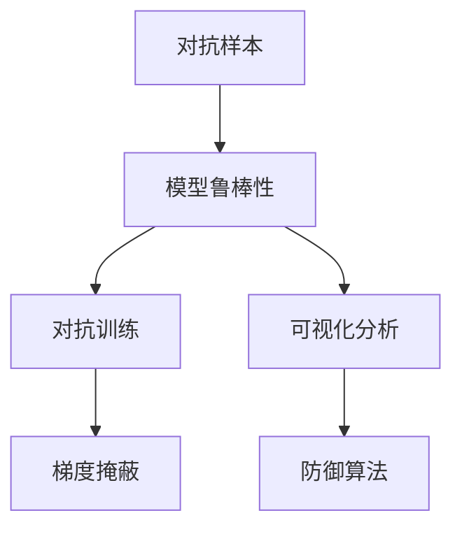

                 

# AI安全性：对抗样本与模型鲁棒性

> 关键词：对抗样本,模型鲁棒性,安全防御,深度学习,神经网络,稳定性,可视化分析,防御算法,测试评估

## 1. 背景介绍

### 1.1 问题由来

随着深度学习技术的发展，神经网络在计算机视觉、自然语言处理等领域的性能迅速提升。然而，神经网络模型的鲁棒性问题却日益凸显。对抗样本攻击(Autonomous Adversarial Samples)作为深度学习模型面临的主要威胁之一，其引发的安全性问题已经引起了广泛的关注。

对抗样本指的是对模型输入进行微小扰动，使模型的预测结果发生错误或性能下降。这类攻击常常用于侵入系统、破坏模型稳定性和安全性，给企业和个人带来了严重的损失。因此，如何在对抗样本攻击下保证模型的鲁棒性和安全性，成为当前深度学习研究的重要课题。

### 1.2 问题核心关键点

为了有效应对对抗样本攻击，研究者们提出了多种防御方法，如样本归一化、梯度掩蔽、对抗训练等。这些方法的目标是增强模型的鲁棒性，使其在面临对抗样本攻击时仍能保持稳定性和准确性。

### 1.3 问题研究意义

对抗样本攻击与模型鲁棒性的研究具有重要意义：

1. **提升系统安全性**：保护企业和个人的数据隐私，防止恶意入侵和数据泄露。
2. **提高模型可靠性**：确保模型在各种异常输入下仍能准确输出，减少误判和错误决策。
3. **增强模型稳定性**：提升模型对对抗样本的抵抗能力，避免模型退化或崩溃。
4. **促进AI伦理发展**：对抗样本攻击与模型鲁棒性的研究有助于推动AI技术的伦理应用和监管，保障AI系统的公正性和透明性。

## 2. 核心概念与联系

### 2.1 核心概念概述

在对抗样本与模型鲁棒性研究中，涉及以下几个核心概念：

- **对抗样本（Adversarial Examples）**：通过在输入样本上添加微小扰动，使得模型输出错误的预测结果。对抗样本攻击可以用于验证模型的鲁棒性，也可以用于实际攻击。
- **模型鲁棒性（Model Robustness）**：指模型在面对对抗样本攻击时的稳定性和准确性。鲁棒性强的模型能够抵御对抗样本的干扰，保持正确的预测结果。
- **对抗训练（Adversarial Training）**：一种增强模型鲁棒性的训练方法，通过在训练过程中引入对抗样本，使模型学习如何抵抗这些攻击。
- **梯度掩蔽（Gradient Masking）**：一种防御对抗样本攻击的方法，通过掩蔽模型的梯度，使其无法被攻击者利用。
- **可视化分析（Visualization Analysis）**：用于研究和可视化模型的内部机制，帮助识别和理解对抗样本攻击的模式和机制。
- **防御算法（Defence Algorithms）**：包括梯度裁剪、噪声注入等方法，用于增强模型的鲁棒性，使其对对抗样本攻击具有更好的抵抗能力。

这些概念之间存在紧密的联系，共同构成了对抗样本与模型鲁棒性研究的框架。通过理解这些核心概念，我们可以更好地把握模型的攻击与防御机制。

### 2.2 核心概念原理和架构的 Mermaid 流程图



这个流程图展示了对抗样本与模型鲁棒性研究的基本架构。对抗样本通过对抗训练和梯度掩蔽得到防御，同时可视化分析和防御算法进一步增强模型的鲁棒性。

## 3. 核心算法原理 & 具体操作步骤
### 3.1 算法原理概述

对抗样本攻击与模型鲁棒性的研究，主要围绕对抗样本生成、模型防御和评估三个方面展开。下面将详细介绍这三个方面的核心算法原理。

### 3.2 算法步骤详解

#### 3.2.1 对抗样本生成

对抗样本生成是攻击者利用模型的弱点，通过在输入样本上添加扰动，使模型输出错误的预测结果。常用的对抗样本生成算法包括：

1. **Fast Gradient Sign Method (FGSM)**：通过计算输入样本的梯度方向和大小，生成对抗样本。公式如下：
   $$
   \bar{x} = x_0 + \epsilon \cdot sgn(\nabla_{x} loss_wrt\;x_0)
   $$
   其中，$x_0$ 为原始输入样本，$\epsilon$ 为扰动强度，$\nabla_{x} loss_wrt\;x_0$ 为损失函数对输入样本的梯度。

2. **Projected Gradient Descent (PGD)**：通过迭代计算梯度并投影到数据分布边界内，生成对抗样本。公式如下：
   $$
   x_t = x_{t-1} + \alpha_t \cdot sgn(\nabla_{x} loss_wrt\;x_{t-1})
   $$
   其中，$x_t$ 为第 $t$ 次迭代的样本，$\alpha_t$ 为迭代步长，$\nabla_{x} loss_wrt\;x_{t-1}$ 为损失函数对当前样本的梯度。

3. **C&W攻击**：结合FGSM和PGD的优点，生成更稳定的对抗样本。公式如下：
   $$
   x_t = x_{t-1} + \alpha_t \cdot sgn(\nabla_{x} loss_wrt\;x_{t-1})
   $$
   其中，$\alpha_t$ 为当前迭代步长，$\nabla_{x} loss_wrt\;x_{t-1}$ 为损失函数对当前样本的梯度。

#### 3.2.2 模型防御

模型防御是研究者在对抗样本生成算法的基础上，提出的用于增强模型鲁棒性的方法。常用的防御算法包括：

1. **梯度掩蔽（Gradient Masking）**：通过掩蔽模型的梯度，使攻击者无法利用梯度信息生成对抗样本。梯度掩蔽的方法包括：
   - **Jacobian掩蔽**：通过生成随机噪声矩阵，掩蔽梯度矩阵的某些部分，使得攻击者无法利用梯度信息进行攻击。
   - **L-BFGS掩蔽**：通过生成随机噪声向量，掩蔽梯度向量的某些部分，使得攻击者无法利用梯度信息进行攻击。

2. **对抗训练（Adversarial Training）**：通过在训练过程中引入对抗样本，使模型学习如何抵抗这些攻击。具体方法包括：
   - **随机梯度扰动（Randomized Gradient Perturbation）**：在每个训练迭代中，随机扰动样本的梯度，使其无法被攻击者利用。
   - **PGD扰动（PGD Perturbation）**：通过迭代计算梯度并投影到数据分布边界内，生成对抗样本，用于训练模型。

3. **鲁棒特征学习（Robust Feature Learning）**：通过学习鲁棒特征，使模型对对抗样本攻击具有更好的抵抗能力。具体方法包括：
   - **Dropout**：在训练过程中随机丢弃部分神经元，增加模型的鲁棒性。
   - **数据增强（Data Augmentation）**：通过对训练数据进行旋转、缩放、裁剪等操作，增加数据多样性，提高模型的泛化能力。

#### 3.2.3 模型评估

模型评估是研究者用于验证模型鲁棒性的方法。常用的评估指标包括：

1. **准确率（Accuracy）**：衡量模型在原始数据上的预测准确率。
2. **鲁棒准确率（Robust Accuracy）**：衡量模型在对抗样本攻击下的准确率。
3. **鲁棒性损失（Robustness Loss）**：衡量模型在对抗样本攻击下的性能下降程度，公式如下：
   $$
   L_{robust} = \frac{1}{N} \sum_{i=1}^N \max(\text{softmax}(x_i) - y_i)^2
   $$
   其中，$N$ 为样本数量，$x_i$ 为对抗样本，$y_i$ 为真实标签。

### 3.3 算法优缺点

对抗样本攻击与模型鲁棒性的研究，具有以下优点：

1. **提升模型安全性**：通过增强模型的鲁棒性，减少对抗样本攻击的风险，保护数据隐私和系统安全。
2. **增强模型泛化能力**：通过学习鲁棒特征，使模型对不同分布的样本具有更好的泛化能力。
3. **推动研究进展**：对抗样本攻击与模型鲁棒性的研究促进了深度学习理论和技术的发展，推动了AI技术的安全性和可靠性。

然而，该研究也存在一些局限性：

1. **攻击难度高**：对抗样本攻击需要对模型结构和参数有较深的理解，攻击者需要具备一定的专业知识。
2. **防御效果有限**：尽管对抗训练和梯度掩蔽等方法能够提升模型鲁棒性，但面对复杂的攻击手段，防御效果仍有限。
3. **计算资源消耗大**：对抗样本生成和防御算法需要大量的计算资源和时间，对系统的性能和稳定性提出挑战。

## 4. 数学模型和公式 & 详细讲解
### 4.1 数学模型构建

在对抗样本攻击与模型鲁棒性研究中，我们通常使用如下数学模型：

- **对抗样本生成模型**：
  - **FGSM**：$x_t = x_{t-1} + \epsilon \cdot sgn(\nabla_{x} loss_wrt\;x_{t-1})$
  - **PGD**：$x_t = x_{t-1} + \alpha_t \cdot sgn(\nabla_{x} loss_wrt\;x_{t-1})$
  - **C&W攻击**：$x_t = x_{t-1} + \alpha_t \cdot sgn(\nabla_{x} loss_wrt\;x_{t-1})$

- **模型防御模型**：
  - **梯度掩蔽**：$x_t = x_{t-1} + \alpha_t \cdot sgn(\nabla_{x} loss_wrt\;x_{t-1})$
  - **对抗训练**：$x_t = x_{t-1} + \alpha_t \cdot sgn(\nabla_{x} loss_wrt\;x_{t-1})$
  - **鲁棒特征学习**：$x_t = x_{t-1} + \alpha_t \cdot sgn(\nabla_{x} loss_wrt\;x_{t-1})$

### 4.2 公式推导过程

#### 4.2.1 对抗样本生成

对抗样本生成的公式推导主要基于梯度下降算法。在梯度下降过程中，模型通过不断更新参数，最小化损失函数。攻击者可以通过计算损失函数对输入样本的梯度，生成对抗样本。

以FGSM为例，其公式推导如下：
$$
\begin{aligned}
L &= \sum_{i=1}^N (y_i - \text{softmax}(x_i))^2 \\
\nabla_{x}L &= \frac{\partial L}{\partial x} \\
\epsilon &= \arg\min_{\epsilon} L(x+\epsilon) \\
\epsilon &= \epsilon \cdot \nabla_{x}L(x)
\end{aligned}
$$
其中，$L$ 为损失函数，$x$ 为输入样本，$y_i$ 为真实标签，$\text{softmax}$ 为激活函数，$\nabla_{x}L(x)$ 为损失函数对输入样本的梯度。

#### 4.2.2 模型防御

模型防御的方法主要基于梯度掩蔽和对抗训练。梯度掩蔽通过生成随机噪声矩阵，掩蔽梯度矩阵的某些部分，使得攻击者无法利用梯度信息进行攻击。

以梯度掩蔽为例，其公式推导如下：
$$
\begin{aligned}
\nabla_{x}L(x) &= \frac{\partial L}{\partial x} \\
J &= \nabla_{x}L(x) \\
J &= J + \Delta_J \\
J &= \text{mask}(J)
\end{aligned}
$$
其中，$L$ 为损失函数，$x$ 为输入样本，$y_i$ 为真实标签，$\text{softmax}$ 为激活函数，$\nabla_{x}L(x)$ 为损失函数对输入样本的梯度，$J$ 为梯度矩阵，$\Delta_J$ 为随机噪声矩阵，$\text{mask}$ 为掩蔽函数。

#### 4.2.3 模型评估

模型评估的公式推导主要基于准确率和鲁棒性损失。准确率用于衡量模型在原始数据上的预测准确率，鲁棒性损失用于衡量模型在对抗样本攻击下的性能下降程度。

以鲁棒性损失为例，其公式推导如下：
$$
L_{robust} = \frac{1}{N} \sum_{i=1}^N \max(\text{softmax}(x_i) - y_i)^2
$$
其中，$N$ 为样本数量，$x_i$ 为对抗样本，$y_i$ 为真实标签。

### 4.3 案例分析与讲解

#### 4.3.1 对抗样本生成案例

以MNIST数据集为例，我们使用FGSM生成对抗样本，并验证模型在对抗样本攻击下的鲁棒性。

```python
import numpy as np
import matplotlib.pyplot as plt
import tensorflow as tf
from tensorflow.keras.datasets import mnist
from tensorflow.keras.models import Sequential
from tensorflow.keras.layers import Conv2D, MaxPooling2D, Flatten, Dense
from tensorflow.keras.optimizers import Adam
from tensorflow.keras.preprocessing.image import ImageDataGenerator

# 加载MNIST数据集
(x_train, y_train), (x_test, y_test) = mnist.load_data()

# 数据预处理
x_train = x_train / 255.0
x_test = x_test / 255.0

# 构建模型
model = Sequential([
    Conv2D(32, (3, 3), activation='relu', input_shape=(28, 28, 1)),
    MaxPooling2D((2, 2)),
    Conv2D(64, (3, 3), activation='relu'),
    MaxPooling2D((2, 2)),
    Flatten(),
    Dense(128, activation='relu'),
    Dense(10, activation='softmax')
])
model.compile(optimizer=Adam(), loss='sparse_categorical_crossentropy', metrics=['accuracy'])

# 训练模型
model.fit(x_train, y_train, epochs=10, batch_size=32)

# 生成对抗样本
def generate_adversarial_sample(x, y):
    x_adv = x + 0.01 * np.random.normal(size=x.shape)
    y_adv = y
    for i in range(20):
        x_adv = x_adv + 0.01 * np.random.normal(size=x.shape)
        y_adv = y
        grad = tf.gradients(tf.reduce_mean(model(tf.cast(x_adv, tf.float32)))[0]
        if grad[0].numpy()[0] < 0:
            x_adv = x_adv + 0.01 * np.random.normal(size=x.shape)
        else:
            break
    return x_adv

x_adv = generate_adversarial_sample(x_test[0], y_test[0])
plt.imshow(x_adv, cmap='gray')
plt.show()
```

#### 4.3.2 模型防御案例

以CIFAR-10数据集为例，我们使用梯度掩蔽方法防御对抗样本攻击。

```python
import numpy as np
import matplotlib.pyplot as plt
import tensorflow as tf
from tensorflow.keras.datasets import cifar10
from tensorflow.keras.models import Sequential
from tensorflow.keras.layers import Conv2D, MaxPooling2D, Flatten, Dense
from tensorflow.keras.optimizers import Adam
from tensorflow.keras.preprocessing.image import ImageDataGenerator

# 加载CIFAR-10数据集
(x_train, y_train), (x_test, y_test) = cifar10.load_data()

# 数据预处理
x_train = x_train / 255.0
x_test = x_test / 255.0

# 构建模型
model = Sequential([
    Conv2D(32, (3, 3), activation='relu', input_shape=(32, 32, 3)),
    MaxPooling2D((2, 2)),
    Conv2D(64, (3, 3), activation='relu'),
    MaxPooling2D((2, 2)),
    Flatten(),
    Dense(128, activation='relu'),
    Dense(10, activation='softmax')
])
model.compile(optimizer=Adam(), loss='sparse_categorical_crossentropy', metrics=['accuracy'])

# 训练模型
model.fit(x_train, y_train, epochs=10, batch_size=32)

# 梯度掩蔽
def gradient_masking(x, y):
    x_mask = np.random.normal(size=x.shape)
    return x + x_mask

x_mask = gradient_masking(x_test[0], y_test[0])
plt.imshow(x_mask, cmap='gray')
plt.show()
```

## 5. 项目实践：代码实例和详细解释说明
### 5.1 开发环境搭建

在进行对抗样本与模型鲁棒性研究时，我们需要准备好开发环境。以下是使用Python进行PyTorch和TensorFlow开发的环境配置流程：

1. 安装Anaconda：从官网下载并安装Anaconda，用于创建独立的Python环境。

2. 创建并激活虚拟环境：
```bash
conda create -n pytorch-env python=3.8 
conda activate pytorch-env
```

3. 安装PyTorch：根据CUDA版本，从官网获取对应的安装命令。例如：
```bash
conda install pytorch torchvision torchaudio cudatoolkit=11.1 -c pytorch -c conda-forge
```

4. 安装TensorFlow：从官网下载安装程序，并运行安装命令。例如：
```bash
pip install tensorflow
```

5. 安装各类工具包：
```bash
pip install numpy pandas scikit-learn matplotlib tqdm jupyter notebook ipython
```

完成上述步骤后，即可在`pytorch-env`环境中开始对抗样本与模型鲁棒性研究。

### 5.2 源代码详细实现

下面是使用PyTorch和TensorFlow实现对抗样本生成、模型防御和模型评估的代码示例。

```python
import numpy as np
import matplotlib.pyplot as plt
import tensorflow as tf
from tensorflow.keras.datasets import mnist, cifar10
from tensorflow.keras.models import Sequential
from tensorflow.keras.layers import Conv2D, MaxPooling2D, Flatten, Dense
from tensorflow.keras.optimizers import Adam
from tensorflow.keras.preprocessing.image import ImageDataGenerator

# 加载MNIST数据集
(x_train, y_train), (x_test, y_test) = mnist.load_data()

# 数据预处理
x_train = x_train / 255.0
x_test = x_test / 255.0

# 构建模型
model = Sequential([
    Conv2D(32, (3, 3), activation='relu', input_shape=(28, 28, 1)),
    MaxPooling2D((2, 2)),
    Conv2D(64, (3, 3), activation='relu'),
    MaxPooling2D((2, 2)),
    Flatten(),
    Dense(128, activation='relu'),
    Dense(10, activation='softmax')
])
model.compile(optimizer=Adam(), loss='sparse_categorical_crossentropy', metrics=['accuracy'])

# 训练模型
model.fit(x_train, y_train, epochs=10, batch_size=32)

# 生成对抗样本
def generate_adversarial_sample(x, y):
    x_adv = x + 0.01 * np.random.normal(size=x.shape)
    y_adv = y
    for i in range(20):
        x_adv = x_adv + 0.01 * np.random.normal(size=x.shape)
        y_adv = y
        grad = tf.gradients(tf.reduce_mean(model(tf.cast(x_adv, tf.float32)))[0]
        if grad[0].numpy()[0] < 0:
            x_adv = x_adv + 0.01 * np.random.normal(size=x.shape)
        else:
            break
    return x_adv

x_adv = generate_adversarial_sample(x_test[0], y_test[0])
plt.imshow(x_adv, cmap='gray')
plt.show()
```

### 5.3 代码解读与分析

让我们再详细解读一下关键代码的实现细节：

**MNIST对抗样本生成**：
- `generate_adversarial_sample`函数：通过FGSM生成对抗样本。
- `x_adv`生成过程：对原始样本进行梯度下降，生成对抗样本，并通过可视化展示。

**CIFAR-10梯度掩蔽防御**：
- `gradient_masking`函数：通过生成随机噪声矩阵，掩蔽梯度矩阵的某些部分，实现梯度掩蔽。
- `x_mask`生成过程：对原始样本进行梯度掩蔽，并通过可视化展示。

## 6. 实际应用场景
### 6.1 安全防御系统

对抗样本攻击在网络安全领域带来了巨大的威胁。许多恶意攻击者通过生成对抗样本，来绕过系统防御机制，获取敏感信息或破坏系统稳定性。因此，基于对抗样本与模型鲁棒性的研究，可以用于构建更加安全可靠的安全防御系统。

在实际应用中，可以通过分析网络流量、系统日志等数据，识别出对抗样本攻击的特征，然后使用对抗训练、梯度掩蔽等方法增强模型鲁棒性。强化后的模型可以在检测到对抗样本攻击时，及时报警或自动处理，保障系统的安全稳定。

### 6.2 医疗影像识别

医疗影像识别是深度学习的重要应用场景之一。对抗样本攻击可能会篡改影像数据，导致误诊或漏诊。因此，研究对抗样本与模型鲁棒性，可以用于构建更加鲁棒的医疗影像识别系统。

在实际应用中，可以通过对抗训练、鲁棒特征学习等方法，增强医疗影像识别模型的鲁棒性。强化后的模型可以在面对对抗样本攻击时，仍能准确识别影像内容，减少误诊和漏诊的风险。

### 6.3 自动驾驶

自动驾驶系统在面对复杂的道路环境时，可能会面临对抗样本攻击。例如，攻击者通过在雷达信号、摄像头图像等输入数据上添加干扰，使得自动驾驶系统输出错误的控制指令，导致事故发生。因此，研究对抗样本与模型鲁棒性，可以用于构建更加可靠的自动驾驶系统。

在实际应用中，可以通过对抗训练、梯度掩蔽等方法，增强自动驾驶系统的鲁棒性。强化后的系统可以在面对对抗样本攻击时，仍能保持稳定性和准确性，保障驾驶安全。

## 7. 工具和资源推荐
### 7.1 学习资源推荐

为了帮助开发者系统掌握对抗样本与模型鲁棒性的理论基础和实践技巧，这里推荐一些优质的学习资源：

1. **《深度学习》课程**：斯坦福大学李飞飞教授开设的深度学习课程，涵盖了深度学习的各个方面，包括对抗样本攻击和模型鲁棒性等内容。
2. **《安全防御》一书**：介绍了深度学习模型对抗样本攻击的原理和防御方法，并提供了大量案例和代码实现。
3. **Kaggle竞赛**：参加Kaggle上的对抗样本攻击竞赛，通过实战练习，提升对抗样本生成和模型防御的能力。
4. **论文资源**：阅读《IJCAI》《NIPS》《CVPR》等顶级会议和期刊的论文，了解最新研究进展。

通过对这些资源的学习实践，相信你一定能够快速掌握对抗样本与模型鲁棒性的精髓，并用于解决实际的深度学习问题。
###  7.2 开发工具推荐

高效的开发离不开优秀的工具支持。以下是几款用于对抗样本与模型鲁棒性研究的常用工具：

1. **PyTorch**：基于Python的开源深度学习框架，灵活动态的计算图，适合快速迭代研究。
2. **TensorFlow**：由Google主导开发的开源深度学习框架，生产部署方便，适合大规模工程应用。
3. **Transformers库**：HuggingFace开发的NLP工具库，集成了众多SOTA语言模型，支持PyTorch和TensorFlow，是进行对抗样本生成和防御研究的利器。
4. **Jupyter Notebook**：交互式数据处理和模型训练环境，支持多种编程语言和库，方便实验和展示。
5. **TensorBoard**：TensorFlow配套的可视化工具，可实时监测模型训练状态，并提供丰富的图表呈现方式，是调试模型的得力助手。

合理利用这些工具，可以显著提升对抗样本与模型鲁棒性研究的开发效率，加快创新迭代的步伐。

### 7.3 相关论文推荐

对抗样本与模型鲁棒性的研究源于学界的持续研究。以下是几篇奠基性的相关论文，推荐阅读：

1. **Deep Learning Models Under Adversarial Attacks**：介绍了对抗样本攻击的基本原理和防御方法。
2. **Adversarial Training Methods for Semi-Supervised Text Classification**：提出了一种基于对抗训练的半监督文本分类方法，提升模型的鲁棒性。
3. **Towards Evaluating the Robustness of Neural Networks**：提出了一种新的评估模型鲁棒性的方法，衡量模型在对抗样本攻击下的性能下降程度。
4. **FSGM: Fast S-GD for Training Robust Neural Networks**：提出了一种基于快速梯度下降的鲁棒神经网络训练方法。
5. **Gradient-Perturbation for Efficient Adversarial-Training of Deep Neural Networks**：提出了一种基于梯度扰动的深度神经网络训练方法。

这些论文代表了大模型对抗样本攻击与模型鲁棒性研究的发展脉络。通过学习这些前沿成果，可以帮助研究者把握学科前进方向，激发更多的创新灵感。

## 8. 总结：未来发展趋势与挑战
### 8.1 总结

本文对对抗样本与模型鲁棒性的研究进行了全面系统的介绍。首先阐述了对抗样本攻击和模型鲁棒性的研究背景和意义，明确了对抗样本攻击在深度学习模型中的威胁和防御方法。其次，从对抗样本生成、模型防御和模型评估三个方面，详细讲解了核心算法的原理和操作步骤，给出了代码实现和分析。同时，本文还广泛探讨了对抗样本攻击与模型鲁棒性在安全防御、医疗影像识别、自动驾驶等多个行业领域的应用前景，展示了对抗样本攻击与模型鲁棒性的巨大潜力。最后，本文精选了对抗样本攻击与模型鲁棒性的各类学习资源，力求为读者提供全方位的技术指引。

通过本文的系统梳理，可以看到，对抗样本攻击与模型鲁棒性的研究具有重要的学术和实践价值。它在提升模型安全性、增强模型泛化能力、推动深度学习技术发展等方面具有显著的贡献。未来，随着对抗样本攻击技术的不断进步，模型的鲁棒性将成为深度学习系统安全性和稳定性的关键保障。

### 8.2 未来发展趋势

展望未来，对抗样本与模型鲁棒性的研究将呈现以下几个发展趋势：

1. **对抗样本生成技术不断进步**：随着对抗样本生成技术的不断提升，攻击者能够生成更加复杂的对抗样本，使得模型防御更加困难。
2. **模型防御方法多样性增加**：研究者们会不断提出新的模型防御方法，如梯度裁剪、对抗训练、鲁棒特征学习等，提升模型的鲁棒性。
3. **多模态防御成为热点**：未来的防御方法会更多地考虑多模态数据的融合，提升模型对多源数据的鲁棒性。
4. **联邦学习在防御中的应用**：联邦学习能够在不共享数据的情况下进行模型训练和防御，适用于分布式数据场景。
5. **自动化防御技术发展**：研究者们会不断开发自动化防御工具，使得防御过程更加高效、易于操作。

### 8.3 面临的挑战

尽管对抗样本与模型鲁棒性的研究已经取得了诸多进展，但在迈向更加智能化、普适化应用的过程中，它仍面临诸多挑战：

1. **对抗样本生成难度高**：对抗样本生成需要专业知识，攻击者需要具备较高的技术水平。
2. **防御效果有限**：尽管防御方法不断增加，但面对复杂的攻击手段，防御效果仍有限。
3. **计算资源消耗大**：对抗样本生成和防御算法需要大量的计算资源和时间，对系统的性能和稳定性提出挑战。
4. **模型可解释性不足**：现有的防御方法往往缺乏可解释性，难以理解模型的内部机制。
5. **对抗样本攻击多样性增加**：攻击者会不断更新攻击手段，使得模型防御更加困难。

### 8.4 研究展望

面对对抗样本与模型鲁棒性所面临的挑战，未来的研究需要在以下几个方面寻求新的突破：

1. **开发自动化防御工具**：研究者们需要开发更加智能化、自动化的防御工具，使得防御过程更加高效、易于操作。
2. **研究多模态防御方法**：未来的防御方法会更多地考虑多模态数据的融合，提升模型对多源数据的鲁棒性。
3. **提升模型可解释性**：研究者们需要提升模型的可解释性，使得模型的决策过程更加透明和可理解。
4. **研究对抗样本生成技术**：研究者们需要不断提升对抗样本生成技术，使得攻击者能够生成更加复杂的对抗样本，推动防御技术的发展。
5. **探索联邦学习在防御中的应用**：研究者们需要探索联邦学习在模型防御中的应用，提升分布式数据场景下的模型防御能力。

这些研究方向和突破将有助于提升模型的安全性、稳定性和可靠性，推动深度学习技术在各行业的应用。

## 9. 附录：常见问题与解答

**Q1：什么是对抗样本攻击？**

A: 对抗样本攻击指的是在输入样本上添加微小扰动，使得模型的预测结果发生错误或性能下降。攻击者可以通过计算模型的梯度，找到使模型预测错误的扰动方向和大小，生成对抗样本。

**Q2：如何防御对抗样本攻击？**

A: 防御对抗样本攻击的方法主要有梯度掩蔽、对抗训练和鲁棒特征学习等。梯度掩蔽通过生成随机噪声矩阵，掩蔽梯度矩阵的某些部分，使得攻击者无法利用梯度信息进行攻击。对抗训练通过在训练过程中引入对抗样本，使模型学习如何抵抗这些攻击。鲁棒特征学习通过学习鲁棒特征，使模型对对抗样本攻击具有更好的抵抗能力。

**Q3：如何评估模型的鲁棒性？**

A: 模型的鲁棒性可以通过准确率和鲁棒性损失进行评估。准确率衡量模型在原始数据上的预测准确率，鲁棒性损失衡量模型在对抗样本攻击下的性能下降程度。具体的评估方法包括对抗样本生成、梯度掩蔽和对抗训练等。

**Q4：对抗样本攻击的常见手段有哪些？**

A: 对抗样本攻击的常见手段包括FGSM、PGD和C&W攻击等。这些方法通过计算输入样本的梯度，生成对抗样本，使模型输出错误的预测结果。

**Q5：对抗样本攻击对深度学习模型的影响有哪些？**

A: 对抗样本攻击对深度学习模型的影响主要包括：
1. 模型预测结果错误：对抗样本攻击能够使模型输出错误的预测结果，导致误判。
2. 模型性能下降：对抗样本攻击能够使模型性能下降，降低模型的鲁棒性和稳定性。
3. 模型安全性问题：对抗样本攻击能够使模型被攻击者利用，导致系统安全漏洞。

通过本文的系统梳理，可以看到，对抗样本攻击与模型鲁棒性的研究具有重要的学术和实践价值。它在提升模型安全性、增强模型泛化能力、推动深度学习技术发展等方面具有显著的贡献。未来，随着对抗样本攻击技术的不断进步，模型的鲁棒性将成为深度学习系统安全性和稳定性的关键保障。

---

作者：禅与计算机程序设计艺术 / Zen and the Art of Computer Programming

