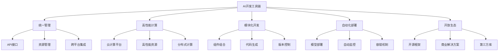

                 

## 1. 背景介绍

### 1.1 问题由来
随着人工智能（AI）技术的不断成熟，企业对于AI应用的需求也日益增长。然而，AI项目开发通常需要跨多个技术领域，包括数据处理、模型构建、训练优化、部署监控等，导致开发过程中工具和方法繁多，缺乏统一的管理和集成。此外，AI项目所需的计算资源也极为庞大，从模型训练到推理部署，都需要高性能的计算环境和强大的算法支撑，进一步增加了开发复杂性。

为解决这些问题，Lepton AI提出了一站式AI开发工具链，旨在通过集成化、模块化的开发框架和资源管理，大幅降低AI项目的开发和部署成本，加速企业AI应用的发展。Lepton AI作为全球领先的人工智能平台，通过提供高效、灵活、可扩展的开发工具和环境，助力企业实现AI项目的快速部署和迭代优化。

### 1.2 问题核心关键点
Lepton AI工具链的核心价值在于其系统性和全面性，能够整合企业AI项目所需的所有资源和工具。通过Lepton AI，开发者可以轻松搭建、训练和部署AI模型，同时享受强大的计算资源和算法库支持。以下是Lepton AI工具链的几个关键特点：

- **统一管理**：Lepton AI提供了统一的界面和API，使得各种AI工具和资源可以通过同一平台进行管理，提升开发效率。
- **高性能计算**：通过与全球领先的云计算平台合作，Lepton AI提供了高性能计算资源，支持大规模的模型训练和推理。
- **模块化开发**：Lepton AI支持模块化开发，开发者可以根据项目需求自由组合和调用不同组件，加速模型构建和迭代。
- **自动化部署**：Lepton AI提供了自动化的模型部署和监控功能，简化了模型部署和运维流程。
- **开放生态**：Lepton AI支持多种开源算法和框架，同时也为开发者提供丰富的商业解决方案，促进AI生态系统的健康发展。

通过这些特点，Lepton AI工具链为企业提供了强大的AI开发基础设施，简化了AI项目的开发流程，提升了项目成功率。

## 2. 核心概念与联系

### 2.1 核心概念概述

为了更好地理解Lepton AI工具链的原理和架构，本节将介绍几个核心概念及其相互联系。

- **AI开发工具链**：指一套集成化、模块化的工具和环境，用于支持AI项目的开发、训练、部署和监控等各个环节。

- **统一管理**：通过统一的接口和API，将各种AI工具和资源整合到同一个平台上，使得开发过程更加高效。

- **高性能计算**：指通过云计算平台提供的强大计算资源，支持大规模的模型训练和推理。

- **模块化开发**：指开发过程可以通过组合和调用不同的模块和组件来实现，支持灵活和高效的开发。

- **自动化部署**：指通过自动化流程实现模型的部署和监控，减少人工操作，提升效率。

- **开放生态**：指Lepton AI支持多种开源算法和框架，同时也为开发者提供商业解决方案，促进AI生态系统的健康发展。

这些核心概念之间存在着密切的联系，共同构成了Lepton AI工具链的基本框架。以下是一个Mermaid流程图，展示了这些概念之间的逻辑关系：



这个流程图展示了AI开发工具链的不同组成部分及其相互关系，揭示了Lepton AI工具链的总体架构。

## 3. 核心算法原理 & 具体操作步骤
### 3.1 算法原理概述

Lepton AI工具链的核心算法原理可以概括为以下几个方面：

- **统一管理**：通过统一的API接口和资源管理，实现对各种AI工具和资源的统一管理和调度。
- **高性能计算**：通过与全球领先的云计算平台合作，提供高性能的计算资源，支持大规模模型训练和推理。
- **模块化开发**：通过组合和调用不同的模块和组件，实现灵活和高效的AI开发。
- **自动化部署**：通过自动化流程，实现模型的快速部署和监控，减少人工操作，提升效率。
- **开放生态**：支持多种开源算法和框架，同时也提供丰富的商业解决方案，促进AI生态系统的健康发展。

这些原理构成了Lepton AI工具链的基础，使得开发者能够高效、灵活地开发和部署AI模型。

### 3.2 算法步骤详解

Lepton AI工具链的开发和部署步骤包括以下几个关键环节：

1. **数据准备**：
   - 数据收集：收集和处理与项目相关的数据，包括结构化和非结构化数据。
   - 数据清洗：处理缺失值、异常值等数据质量问题。
   - 数据增强：对数据进行扩充和增强，提升数据多样性和质量。

2. **模型构建**：
   - 选择算法：根据项目需求选择合适的算法和模型结构。
   - 模型训练：使用Lepton AI提供的计算资源和工具进行模型训练。
   - 超参数调优：通过网格搜索、随机搜索等方式，优化模型的超参数。

3. **模型评估**：
   - 模型验证：在验证集上评估模型的性能，包括准确率、召回率、F1分数等指标。
   - 模型优化：根据评估结果，调整模型结构和超参数。

4. **模型部署**：
   - 模型保存：将训练好的模型保存到指定的存储位置。
   - 模型部署：通过Lepton AI提供的自动化部署工具，将模型部署到生产环境。
   - 模型监控：监控模型在生产环境中的表现，及时发现和解决问题。

5. **模型迭代**：
   - 数据回流：将新数据回流到训练过程，重新训练和优化模型。
   - 模型更新：根据业务需求和数据变化，定期更新和维护模型。

### 3.3 算法优缺点

Lepton AI工具链的优点包括：

- **高效性**：通过统一的API接口和资源管理，提升开发效率。
- **灵活性**：支持模块化开发，可根据项目需求自由组合和调用不同组件。
- **可扩展性**：支持多种开源算法和框架，同时也提供商业解决方案，满足不同企业的需要。
- **自动化**：自动化部署和监控流程，减少人工操作，提升效率。

然而，Lepton AI工具链也存在一些缺点：

- **复杂性**：工具链涉及多个组件和模块，使用不当可能导致开发复杂度增加。
- **资源消耗**：高性能计算和模型训练需要消耗大量资源，增加企业的成本。
- **维护成本**：模型部署和监控需要持续维护，可能带来额外的维护成本。

### 3.4 算法应用领域

Lepton AI工具链适用于各种AI应用场景，包括但不限于：

- **自然语言处理（NLP）**：文本分类、情感分析、机器翻译、聊天机器人等。
- **计算机视觉（CV）**：图像分类、目标检测、图像生成等。
- **语音识别（ASR）**：语音识别、语音合成等。
- **推荐系统**：个性化推荐、广告推荐等。
- **医疗健康**：疾病诊断、药物研发等。
- **金融领域**：风险评估、欺诈检测等。

Lepton AI工具链在这些领域的应用，不仅提升了模型的性能和精度，也缩短了开发周期，降低了企业的开发成本。

## 4. 数学模型和公式 & 详细讲解 & 举例说明

### 4.1 数学模型构建

Lepton AI工具链的数学模型构建主要包括以下几个方面：

- **数据表示**：将数据表示为向量或张量，方便模型处理和计算。
- **模型定义**：使用Lepton AI提供的API，定义模型结构，包括层数、激活函数等。
- **损失函数**：根据任务需求选择合适的损失函数，如交叉熵损失、均方误差损失等。
- **优化器**：选择合适的优化器，如Adam、SGD等，优化模型的参数。

### 4.2 公式推导过程

以线性回归模型为例，推导其数学模型和优化过程：

**线性回归模型**：
$$
y = \theta_0 + \theta_1 x_1 + \theta_2 x_2 + \ldots + \theta_n x_n
$$

**损失函数**：
$$
\mathcal{L}(\theta) = \frac{1}{2N} \sum_{i=1}^N (y_i - \theta_0 - \theta_1 x_{i1} - \theta_2 x_{i2} - \ldots - \theta_n x_{in})^2
$$

**优化过程**：
$$
\nabla_{\theta} \mathcal{L}(\theta) = \begin{bmatrix}
    \frac{\partial \mathcal{L}(\theta)}{\partial \theta_0} \\
    \frac{\partial \mathcal{L}(\theta)}{\partial \theta_1} \\
    \ldots \\
    \frac{\partial \mathcal{L}(\theta)}{\partial \theta_n}
\end{bmatrix}
$$
$$
\theta = \theta - \eta \nabla_{\theta} \mathcal{L}(\theta)
$$

其中，$\eta$为学习率，$N$为样本数量。

### 4.3 案例分析与讲解

以Lepton AI提供的图像分类任务为例，说明如何构建和训练模型：

1. **数据准备**：
   - 收集图像数据集，并进行标注。
   - 对数据进行预处理，如缩放、归一化等。

2. **模型构建**：
   - 使用Lepton AI提供的卷积神经网络（CNN）模型模板，定义模型结构。
   - 在模型中添加全连接层、激活函数、损失函数和优化器等。

3. **模型训练**：
   - 使用Lepton AI的计算资源进行模型训练。
   - 在训练过程中，通过验证集评估模型性能，调整超参数。

4. **模型评估**：
   - 在测试集上评估模型的准确率、精确率、召回率等指标。
   - 根据评估结果，调整模型结构和超参数。

5. **模型部署**：
   - 将训练好的模型保存到指定位置。
   - 通过Lepton AI提供的API，将模型部署到生产环境。
   - 在生产环境中，实时监控模型的表现，发现和解决问题。

## 5. 项目实践：代码实例和详细解释说明

### 5.1 开发环境搭建

Lepton AI工具链提供了一站式开发环境搭建服务，使得开发者可以轻松启动项目。以下是在Lepton AI上搭建项目的基本步骤：

1. **创建项目**：
   - 登录Lepton AI控制台，创建新项目。
   - 选择项目类型，如深度学习、计算机视觉等。
   - 配置项目参数，如计算资源、存储位置等。

2. **安装工具**：
   - 安装Lepton AI提供的各种工具和库，如TensorFlow、PyTorch等。
   - 配置开发环境，如设置Python路径、虚拟环境等。

3. **配置数据**：
   - 将数据上传至Lepton AI云存储，配置数据路径。
   - 进行数据预处理，如缩放、归一化等。

4. **开发模型**：
   - 使用Lepton AI提供的模板，定义模型结构。
   - 添加层、激活函数、损失函数和优化器等。

### 5.2 源代码详细实现

以下是一个Lepton AI上实现图像分类任务的代码示例：

```python
import tensorflow as tf
from tensorflow.keras import layers, models

# 定义模型结构
model = models.Sequential([
    layers.Conv2D(32, (3, 3), activation='relu', input_shape=(224, 224, 3)),
    layers.MaxPooling2D((2, 2)),
    layers.Conv2D(64, (3, 3), activation='relu'),
    layers.MaxPooling2D((2, 2)),
    layers.Conv2D(128, (3, 3), activation='relu'),
    layers.MaxPooling2D((2, 2)),
    layers.Flatten(),
    layers.Dense(64, activation='relu'),
    layers.Dense(10)
])

# 编译模型
model.compile(optimizer=tf.keras.optimizers.Adam(learning_rate=0.001),
              loss=tf.keras.losses.SparseCategoricalCrossentropy(from_logits=True),
              metrics=[tf.keras.metrics.SparseCategoricalAccuracy()])

# 训练模型
model.fit(train_images, train_labels, epochs=10, validation_data=(val_images, val_labels))
```

### 5.3 代码解读与分析

上述代码展示了如何使用TensorFlow实现图像分类模型的训练。其中，`Sequential`模型提供了简单的堆叠层的方式，适合定义线性模型。在模型编译时，我们选择了Adam优化器和SparseCategoricalCrossentropy损失函数，适合多分类任务。在训练过程中，我们通过`fit`方法进行模型训练，`epochs`参数指定训练轮数，`validation_data`参数指定验证集数据。

## 6. 实际应用场景

### 6.1 智能客服系统

Lepton AI工具链在智能客服系统中发挥了重要作用。传统的客服系统需要大量人力支持，响应速度慢，难以应对高峰期的服务需求。而基于Lepton AI的智能客服系统，可以通过预训练模型和微调，实现24小时不间断的服务，快速响应客户咨询，提高客户满意度。

在实际应用中，Lepton AI提供了多种预训练模型，如BERT、GPT等，可以应用于问答、语音识别、情感分析等任务。开发者可以根据实际需求，选择合适的模型，并在Lepton AI上进行调整和优化，快速部署到生产环境中。

### 6.2 金融舆情监测

Lepton AI工具链在金融舆情监测中的应用也十分广泛。金融机构需要实时监控市场舆论动向，及时发现和应对负面信息。基于Lepton AI的情感分析模型，可以自动分析新闻、评论、社交媒体等文本数据，判断情感倾向，预警潜在风险。

具体而言，Lepton AI可以提供预训练的情感分析模型，如VADER、BERT等，通过微调，可以适应特定金融领域的数据特征。开发者可以在Lepton AI上搭建项目，训练和优化模型，部署到金融系统中，实时监控市场舆情变化，帮助金融机构及时采取措施。

### 6.3 个性化推荐系统

Lepton AI工具链在个性化推荐系统中也大显身手。当前的推荐系统往往依赖于用户的过去行为数据，难以捕捉用户的真实兴趣和偏好。而基于Lepton AI的推荐系统，可以通过预训练模型和微调，利用用户的文本数据（如评论、标签）进行推荐，提高推荐的准确性和个性化程度。

在实际应用中，Lepton AI提供了多种预训练模型，如BERT、GPT等，可以应用于推荐任务。开发者可以在Lepton AI上搭建项目，训练和优化模型，部署到推荐系统中，实时生成个性化推荐内容，提升用户体验。

### 6.4 未来应用展望

随着Lepton AI工具链的不断发展和完善，未来其在AI应用场景中的应用将更加广泛和深入。以下列举了几个可能的应用方向：

1. **智能医疗**：Lepton AI可以在医疗领域提供各种AI应用，如疾病诊断、药物研发等。通过预训练模型和微调，可以提升医疗系统的诊断精度和效率。

2. **智能制造**：Lepton AI可以应用于工业领域的智能制造系统，通过图像识别、自然语言处理等技术，实现设备监控、故障预测等功能。

3. **智能交通**：Lepton AI可以应用于智能交通系统，通过图像识别、语音识别等技术，实现交通流量监测、安全预警等功能。

4. **智慧城市**：Lepton AI可以应用于智慧城市建设，通过自然语言处理、计算机视觉等技术，实现城市管理、公共服务等功能。

总之，Lepton AI工具链的未来应用前景广阔，将为各行各业带来智能化、自动化的新变革。

## 7. 工具和资源推荐

### 7.1 学习资源推荐

Lepton AI提供了丰富的学习资源，包括在线课程、文档、博客等，帮助开发者快速掌握AI开发工具链的使用。以下是一些推荐的学习资源：

1. **Lepton AI官方文档**：提供详细的API文档、代码示例和开发指南，帮助开发者快速上手。
2. **Lepton AI博客**：定期发布技术文章，涵盖AI开发工具链的各个方面。
3. **Lepton AI论坛**：提供开发者交流平台，分享经验和解决方案。
4. **Lepton AI在线课程**：提供系统化课程，涵盖AI开发工具链的各个环节。

通过这些学习资源，开发者可以全面掌握Lepton AI工具链的使用，提升AI开发效率。

### 7.2 开发工具推荐

Lepton AI提供了丰富的开发工具，涵盖数据处理、模型训练、部署监控等各个环节。以下是一些推荐的开发工具：

1. **TensorFlow**：全球领先的深度学习框架，支持大规模模型训练和推理。
2. **PyTorch**：灵活易用的深度学习框架，适合快速迭代研究和开发。
3. **Lepton AI控制台**：提供一站式管理平台，方便资源调度、模型训练和部署。
4. **Lepton AI云存储**：提供高性能数据存储服务，支持大数据处理和分析。
5. **Jupyter Notebook**：提供交互式编程环境，支持代码调试和共享。

这些工具帮助开发者高效、灵活地进行AI项目开发和部署，提升开发效率和项目成功率。

### 7.3 相关论文推荐

Lepton AI工具链的开发和应用涉及多个前沿技术，以下列举一些相关论文，供开发者深入学习和研究：

1. **TensorFlow: A System for Large-Scale Machine Learning**：介绍TensorFlow的设计和实现，涵盖大规模模型训练和部署。
2. **PyTorch: An Immediate-Access Deep Learning Library**：介绍PyTorch的设计和实现，涵盖灵活易用的深度学习框架。
3. **A Survey on Automated Machine Learning: Towards Autonomous AI**：介绍自动机器学习的发展现状和未来方向。
4. **A Survey of Object Detection with Deep Learning**：介绍深度学习在目标检测领域的应用现状和未来方向。
5. **Reinforcement Learning for Robotics**：介绍强化学习在机器人领域的应用现状和未来方向。

这些论文提供了深入的技术见解和研究方向，帮助开发者了解Lepton AI工具链的底层原理和前沿技术。

## 8. 总结：未来发展趋势与挑战

### 8.1 研究成果总结

Lepton AI工具链作为一站式AI开发平台，已经在多个领域展示了其强大的应用价值和高效性。通过统一管理、高性能计算、模块化开发、自动化部署和开放生态，Lepton AI简化了AI项目的开发流程，降低了开发成本，提升了项目成功率。Lepton AI已经成为了众多企业AI开发的首选工具，显著提升了企业的AI应用能力和市场竞争力。

### 8.2 未来发展趋势

Lepton AI工具链的未来发展趋势主要包括以下几个方向：

1. **AI模型的自动化生成**：Lepton AI将进一步提升AI模型的自动化生成能力，减少模型构建的复杂度。
2. **AI模型的跨领域迁移**：Lepton AI将进一步提升AI模型的跨领域迁移能力，支持更多领域的AI应用。
3. **AI模型的可解释性**：Lepton AI将进一步提升AI模型的可解释性，增强模型的透明性和可信度。
4. **AI模型的持续学习**：Lepton AI将进一步提升AI模型的持续学习能力，支持模型在实际应用中的动态优化。
5. **AI模型的多模态融合**：Lepton AI将进一步提升AI模型的多模态融合能力，支持视觉、语音、文本等多种数据类型的融合应用。

### 8.3 面临的挑战

Lepton AI工具链在快速发展的过程中，也面临一些挑战：

1. **数据质量问题**：高质量的数据是AI模型性能的保障，但数据收集和处理往往需要大量时间和资源。
2. **计算资源成本**：高性能计算和模型训练需要大量资源，增加了企业的成本负担。
3. **模型可解释性**：AI模型往往被视为"黑盒"，缺乏可解释性，难以满足某些行业的需求。
4. **模型鲁棒性**：AI模型在实际应用中面临各种干扰和噪声，需要提高模型的鲁棒性和稳定性。
5. **跨领域迁移**：AI模型在不同领域和数据集上的迁移能力有限，需要进一步提升。

### 8.4 研究展望

Lepton AI工具链在未来的研究展望中，将从以下几个方面进行突破：

1. **自动数据处理**：进一步提升数据处理和增强能力，减少数据预处理的复杂度。
2. **模型微调优化**：进一步优化模型微调流程，提升模型在特定任务上的性能。
3. **多模态融合**：进一步提升多模态数据融合能力，支持更加全面和复杂的AI应用。
4. **自动化学习**：进一步提升AI模型的自动化学习能力和自适应能力，提升模型的泛化性和鲁棒性。
5. **可解释性增强**：进一步增强AI模型的可解释性，提升模型的可信度和透明性。

通过这些研究方向，Lepton AI工具链将不断提升AI模型的性能和应用范围，成为AI开发的重要基础设施。

## 9. 附录：常见问题与解答

### Q1: Lepton AI工具链有哪些主要特点？

A: Lepton AI工具链的主要特点包括：
1. **统一管理**：通过统一的API接口和资源管理，实现对各种AI工具和资源的统一管理和调度。
2. **高性能计算**：通过与全球领先的云计算平台合作，提供高性能的计算资源，支持大规模模型训练和推理。
3. **模块化开发**：通过组合和调用不同的模块和组件，实现灵活和高效的AI开发。
4. **自动化部署**：通过自动化流程，实现模型的快速部署和监控，减少人工操作，提升效率。
5. **开放生态**：支持多种开源算法和框架，同时也提供商业解决方案，满足不同企业的需要。

### Q2: 如何选择合适的AI模型和算法？

A: 选择合适的AI模型和算法需要考虑以下几个因素：
1. **任务需求**：根据具体任务需求选择模型和算法，如分类、回归、聚类等。
2. **数据特征**：考虑数据类型、数据量和数据分布，选择适合的模型和算法。
3. **计算资源**：考虑模型的复杂度和计算资源，选择可行的模型和算法。
4. **可解释性**：考虑模型的可解释性和透明性，选择适合应用的模型和算法。

### Q3: 如何使用Lepton AI进行模型微调？

A: 使用Lepton AI进行模型微调，需要以下步骤：
1. **数据准备**：收集和处理数据，进行数据增强和预处理。
2. **模型构建**：选择合适的模型和算法，定义模型结构和超参数。
3. **模型训练**：在Lepton AI上搭建项目，使用计算资源进行模型训练。
4. **模型评估**：在验证集上评估模型性能，调整超参数和模型结构。
5. **模型部署**：将训练好的模型部署到生产环境，进行实时监控和优化。

### Q4: Lepton AI工具链有哪些应用场景？

A: Lepton AI工具链适用于以下应用场景：
1. **自然语言处理（NLP）**：文本分类、情感分析、机器翻译、聊天机器人等。
2. **计算机视觉（CV）**：图像分类、目标检测、图像生成等。
3. **语音识别（ASR）**：语音识别、语音合成等。
4. **推荐系统**：个性化推荐、广告推荐等。
5. **医疗健康**：疾病诊断、药物研发等。
6. **金融领域**：风险评估、欺诈检测等。

通过Lepton AI工具链，开发者可以快速构建和部署各种AI应用，提升企业的AI应用能力和市场竞争力。

---

作者：禅与计算机程序设计艺术 / Zen and the Art of Computer Programming

