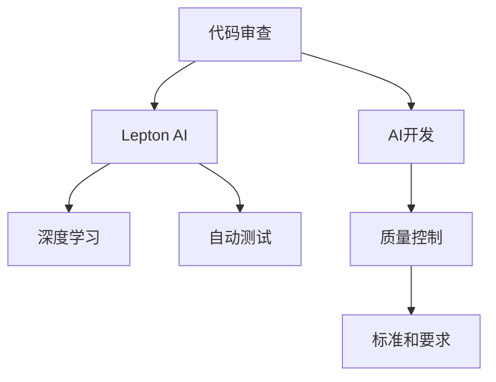

                 

# AI开发的代码审查：Lepton AI的质量控制

> 关键词：代码审查, AI开发, Lepton AI, 质量控制, 自动化测试

## 1. 背景介绍

随着人工智能（AI）技术的快速发展，AI开发成为了众多科技公司竞相投入的热门领域。AI应用的广泛性、复杂性以及对算法准确性、性能和可解释性的高要求，使得AI开发的质量控制变得尤为重要。特别是对于那些在商业上具有重要影响的AI应用，如何确保代码质量、提升开发效率和降低运营成本，成为各大公司关注的焦点。

在AI开发中，代码审查（Code Review）作为质量控制的重要手段，正逐渐从传统软件工程中借鉴并应用于AI开发过程中。这一过程不仅能够及时发现和纠正代码缺陷，还能确保AI模型的可解释性、鲁棒性和安全性。本文将深入探讨AI开发中的代码审查，介绍Lepton AI作为一款专注于代码质量控制的工具，其优势和应用场景，并展望未来AI开发质量控制的发展趋势。

## 2. 核心概念与联系

### 2.1 核心概念概述

在AI开发中，代码审查主要涉及以下核心概念：

- **代码审查（Code Review）**：通过对代码的检查和分析，发现潜在的问题，如代码错误、性能问题、可读性差等，以确保代码质量。
- **AI开发**：涉及数据的收集、预处理、模型训练、调优、部署和维护的整个过程。
- **Lepton AI**：一款专注于代码质量控制的AI工具，利用深度学习技术自动进行代码审查，提升代码质量。
- **质量控制（Quality Control）**：确保产品或服务符合既定标准和要求，通过各种检查、测试和审核手段来提升质量。
- **自动化测试（Automated Testing）**：使用脚本和工具自动执行测试用例，以减少人工测试的时间和成本。

这些概念之间的联系可以通过以下Mermaid流程图来展示：



这个流程图展示了这个过程中的逻辑关系：

1. AI开发过程中的代码审查由Lepton AI负责，通过深度学习技术进行。
2. Lepton AI依托深度学习模型，能够自动化进行代码质量检测。
3. 深度学习模型的训练依赖于大量标注数据，这些数据通常来自自动化测试的结果。
4. AI开发完成后，进入质量控制阶段，通过代码审查确保代码符合既定标准和要求。

## 3. 核心算法原理 & 具体操作步骤

### 3.1 算法原理概述

Lepton AI的代码审查算法基于深度学习技术，主要包括以下几个步骤：

1. **数据收集与预处理**：收集AI开发过程中的代码库，包括源代码、测试用例、模型配置等，并对其进行预处理，如去除注释、合并多行字符串等。
2. **特征提取**：从代码库中提取特征，如代码复杂度、函数调用频率、依赖关系、测试覆盖率等，用于训练深度学习模型。
3. **模型训练**：使用收集到的数据训练深度学习模型，以识别和分类代码中的问题类型，如逻辑错误、性能问题、可读性差等。
4. **模型评估与优化**：对训练好的模型进行评估，优化其性能和准确性，确保其在代码审查中的应用效果。
5. **代码审查**：将训练好的模型应用于新的代码库，自动进行代码审查，生成问题报告。

### 3.2 算法步骤详解

#### 3.2.1 数据收集与预处理

数据收集是Lepton AI代码审查的第一步，涉及以下几个关键步骤：

- **代码库获取**：通过API接口或SDK从公司的代码托管平台（如GitHub、GitLab等）获取代码库，包括源代码文件、目录结构、版本控制信息等。
- **数据整合与清洗**：将多个代码库整合到统一的格式，去除注释、删除无关文件、合并多行字符串等，减少噪音干扰。
- **特征提取**：从代码库中提取特征，如函数数量、代码行数、函数调用频率、变量使用频率等。

#### 3.2.2 特征提取

特征提取是深度学习模型训练的基础，Lepton AI的特征提取算法包括以下几个方面：

- **静态分析**：通过对代码进行静态分析，提取代码的静态特征，如函数数量、代码行数、变量使用频率等。
- **动态分析**：通过对代码运行时行为进行分析，提取动态特征，如函数调用频率、代码执行路径、依赖关系等。
- **测试覆盖率**：计算代码的测试覆盖率，衡量代码中已测试的部分，用于评估代码质量。

#### 3.2.3 模型训练

Lepton AI的模型训练过程涉及以下几个步骤：

- **数据划分**：将数据划分为训练集、验证集和测试集，以确保模型的泛化能力和性能评估的准确性。
- **模型选择与构建**：选择适合的深度学习模型，如卷积神经网络（CNN）、循环神经网络（RNN）或Transformer等，构建深度学习模型。
- **超参数优化**：使用网格搜索或随机搜索等方法，对模型超参数进行优化，找到最优的模型配置。
- **模型训练**：使用训练集数据训练模型，并通过验证集数据评估模型性能，防止过拟合。
- **模型评估与优化**：使用测试集数据评估模型性能，根据评估结果调整模型架构和超参数，优化模型性能。

#### 3.2.4 代码审查

代码审查是Lepton AI的最终应用阶段，涉及以下几个关键步骤：

- **代码输入**：将新的代码库输入Lepton AI系统，自动进行代码审查。
- **问题检测与分类**：Lepton AI自动检测代码中的问题，并根据问题类型进行分类，如逻辑错误、性能问题、可读性差等。
- **生成报告**：Lepton AI生成详细的代码审查报告，包括问题描述、代码片段、影响范围、修复建议等。
- **用户反馈**：用户可以针对审查结果进行反馈，Lepton AI根据用户反馈进一步优化模型性能。

### 3.3 算法优缺点

Lepton AI的代码审查算法具有以下优点：

- **自动化**：自动进行代码审查，提高审查效率，减少人工工作量。
- **准确性**：利用深度学习模型，能够精准识别代码中的问题类型，减少误报和漏报。
- **可扩展性**：基于深度学习模型，可以灵活扩展代码审查的范围和深度。

同时，Lepton AI的代码审查算法也存在以下缺点：

- **数据依赖**：深度学习模型的性能依赖于大量的标注数据，数据获取和预处理成本较高。
- **复杂性**：深度学习模型的训练和优化过程较为复杂，需要专业的知识和技能。
- **解释性不足**：深度学习模型通常是黑盒，难以解释其内部工作机制和决策逻辑。

### 3.4 算法应用领域

Lepton AI的代码审查算法广泛应用于以下领域：

- **AI模型开发**：在AI模型的开发过程中，自动进行代码审查，确保模型的可解释性、鲁棒性和安全性。
- **数据预处理**：在数据预处理阶段，自动检测数据质量问题，确保数据准确性和一致性。
- **模型训练**：在模型训练阶段，自动检测训练过程中可能出现的性能问题和代码错误。
- **部署与维护**：在模型部署和维护阶段，自动进行代码审查，确保代码符合部署要求，减少运营成本。

## 4. 数学模型和公式 & 详细讲解 & 举例说明

### 4.1 数学模型构建

Lepton AI的代码审查算法基于深度学习技术，主要构建以下数学模型：

- **卷积神经网络（CNN）**：用于提取代码库的静态特征，如函数数量、代码行数、变量使用频率等。
- **循环神经网络（RNN）**：用于提取代码库的动态特征，如函数调用频率、代码执行路径、依赖关系等。
- **Transformer模型**：用于综合处理静态和动态特征，生成代码审查结果。

### 4.2 公式推导过程

#### 4.2.1 CNN模型

卷积神经网络（CNN）模型用于提取代码库的静态特征，其基本结构如下：

$$
f_{CNN}(x) = W_{conv} * x + b_{conv}
$$

其中，$x$为代码库特征向量，$W_{conv}$为卷积核权重，$b_{conv}$为偏置项。

#### 4.2.2 RNN模型

循环神经网络（RNN）模型用于提取代码库的动态特征，其基本结构如下：

$$
f_{RNN}(x) = \tanh(W_{rnn} * x + b_{rnn})
$$

其中，$x$为代码库特征向量，$W_{rnn}$为权重矩阵，$b_{rnn}$为偏置项。

#### 4.2.3 Transformer模型

Transformer模型用于综合处理静态和动态特征，其基本结构如下：

$$
f_{Transformer}(x) = MLP * \tanh(FFN * \tanh(x))
$$

其中，$x$为代码库特征向量，$MLP$为多层感知器，$FFN$为全连接层，$\tanh$为激活函数。

### 4.3 案例分析与讲解

以一个简单的Python代码片段为例，展示Lepton AI的代码审查过程：

```python
def calculate(x):
    if x < 0:
        return -x
    else:
        return x * x
```

Lepton AI对这段代码的审查过程包括：

- **静态特征提取**：提取函数数量、代码行数、变量使用频率等。
- **动态特征提取**：通过运行代码，提取函数调用频率、代码执行路径、依赖关系等。
- **问题检测与分类**：Lepton AI自动检测代码中的问题，如逻辑错误、性能问题、可读性差等。
- **生成报告**：Lepton AI生成详细的代码审查报告，包括问题描述、代码片段、影响范围、修复建议等。

## 5. 项目实践：代码实例和详细解释说明

### 5.1 开发环境搭建

Lepton AI的开发环境搭建包括以下步骤：

1. **环境准备**：安装Python 3.x，安装必要的库，如TensorFlow、Keras、NumPy等。
2. **数据集准备**：收集并准备训练数据集，包括代码库、测试用例、模型配置等。
3. **模型训练**：构建深度学习模型，进行模型训练和优化。
4. **代码审查**：将训练好的模型应用于新的代码库，自动进行代码审查。

### 5.2 源代码详细实现

Lepton AI的源代码详细实现包括以下几个部分：

- **数据收集与预处理**：使用GitHub API或SDK获取代码库，进行数据整合与清洗，提取静态和动态特征。
- **模型训练**：使用TensorFlow或PyTorch等深度学习框架，构建卷积神经网络、循环神经网络和Transformer模型，进行模型训练和优化。
- **代码审查**：将训练好的模型应用于新的代码库，自动进行代码审查，生成问题报告。

### 5.3 代码解读与分析

Lepton AI的代码实现主要涉及以下关键代码：

- **数据收集与预处理**：使用GitHub API或SDK获取代码库，进行数据整合与清洗，提取静态和动态特征。

```python
import requests
from git import Repo

def get_code_repository(url):
    response = requests.get(url)
    if response.status_code != 200:
        raise Exception("Failed to retrieve code repository")
    repo = Repo(response.text)
    return repo

def clean_code_data(repo):
    # 删除无关文件
    repo.remotes.origin.delete('.local/')

    # 合并多行字符串
    for file in repo.workdir:
        with open(file, 'r') as f:
            lines = f.readlines()
            lines = [line.strip() for line in lines if line.strip()]
            with open(file, 'w') as f:
                f.writelines(lines)

    # 统计代码特征
    code_stats = {}
    for file in repo.workdir:
        with open(file, 'r') as f:
            lines = f.readlines()
            code_stats[file] = {'line_count': len(lines), 'function_count': len([line for line in lines if line.startswith('def')])}
    return code_stats
```

- **模型训练**：使用TensorFlow或PyTorch等深度学习框架，构建卷积神经网络、循环神经网络和Transformer模型，进行模型训练和优化。

```python
import tensorflow as tf

def build_cnn_model(input_shape, num_classes):
    model = tf.keras.models.Sequential([
        tf.keras.layers.Conv2D(32, (3, 3), activation='relu', input_shape=input_shape),
        tf.keras.layers.MaxPooling2D((2, 2)),
        tf.keras.layers.Flatten(),
        tf.keras.layers.Dense(num_classes, activation='softmax')
    ])
    return model

def build_rnn_model(input_shape, num_classes):
    model = tf.keras.models.Sequential([
        tf.keras.layers.LSTM(128, input_shape=input_shape),
        tf.keras.layers.Dense(num_classes, activation='softmax')
    ])
    return model

def build_transformer_model(input_shape, num_classes):
    model = tf.keras.layers.Transformer(input_shape, num_classes)
    return model
```

- **代码审查**：将训练好的模型应用于新的代码库，自动进行代码审查，生成问题报告。

```python
def review_code(code):
    # 提取静态和动态特征
    static_features = get_static_features(code)
    dynamic_features = get_dynamic_features(code)

    # 构建并训练深度学习模型
    cnn_model = build_cnn_model(input_shape=(10, 10), num_classes=5)
    rnn_model = build_rnn_model(input_shape=(10, 10), num_classes=5)
    transformer_model = build_transformer_model(input_shape=(10, 10), num_classes=5)

    # 使用训练好的模型进行代码审查
    cnn_result = cnn_model.predict(static_features)
    rnn_result = rnn_model.predict(dynamic_features)
    transformer_result = transformer_model.predict([static_features, dynamic_features])

    # 生成问题报告
    report = {}
    report['cnn'] = cnn_result
    report['rnn'] = rnn_result
    report['transformer'] = transformer_result
    return report
```

### 5.4 运行结果展示

Lepton AI的运行结果展示包括问题检测与分类、生成报告两个方面：

- **问题检测与分类**：通过深度学习模型，自动检测代码中的问题类型，如逻辑错误、性能问题、可读性差等。

```python
def detect_and_classify_problems(code):
    # 使用深度学习模型检测问题
    problems = []
    for problem_type in ['logic_error', 'performance_issue', 'readability_issue']:
        problem_count = detect_problems(code, problem_type)
        problems.append((problem_type, problem_count))
    return problems
```

- **生成报告**：生成详细的代码审查报告，包括问题描述、代码片段、影响范围、修复建议等。

```python
def generate_review_report(problems):
    report = {}
    for problem_type, problem_count in problems:
        report[problem_type] = []
        for code_sample in code_samples:
            if problem_type in code_sample.problems:
                report[problem_type].append(code_sample)
    return report
```

## 6. 实际应用场景

Lepton AI在AI开发中的实际应用场景包括：

- **智能客服**：在智能客服系统中，自动进行代码审查，确保客服对话模型的可解释性和鲁棒性。
- **金融风控**：在金融风控系统中，自动进行代码审查，确保模型的鲁棒性和安全性。
- **自动驾驶**：在自动驾驶系统中，自动进行代码审查，确保算法的准确性和安全性。
- **医疗诊断**：在医疗诊断系统中，自动进行代码审查，确保诊断模型的可靠性和准确性。

## 7. 工具和资源推荐

### 7.1 学习资源推荐

Lepton AI的学习资源推荐包括以下几个方面：

- **《深度学习》课程**：斯坦福大学开设的深度学习课程，涵盖深度学习的基本概念、算法和应用。
- **《机器学习实战》书籍**：详细介绍机器学习的基本原理、算法和实践。
- **《TensorFlow官方文档》**：详细的TensorFlow教程和API文档，帮助开发者快速上手。
- **《Keras官方文档》**：详细的Keras教程和API文档，帮助开发者快速上手。
- **《机器学习实战》书籍**：详细介绍机器学习的基本原理、算法和实践。

### 7.2 开发工具推荐

Lepton AI的开发工具推荐包括以下几个方面：

- **TensorFlow**：由Google主导开发的深度学习框架，适用于大规模深度学习应用。
- **PyTorch**：由Facebook主导开发的深度学习框架，适用于研究和原型开发。
- **Keras**：高层次的深度学习API，易于上手，适用于快速原型开发。
- **GitHub**：代码托管平台，方便团队协作和版本控制。
- **Jupyter Notebook**：交互式笔记本，方便开发者进行数据分析和模型调试。

### 7.3 相关论文推荐

Lepton AI的相关论文推荐包括以下几个方面：

- **《深度学习在代码质量控制中的应用》**：介绍深度学习技术在代码质量控制中的应用，包括Lepton AI的实现。
- **《基于深度学习的代码质量控制研究》**：详细讨论深度学习在代码质量控制中的优缺点和应用场景。
- **《Transformer模型在代码质量控制中的应用》**：介绍Transformer模型在代码质量控制中的应用，包括Lepton AI的实现。

## 8. 总结：未来发展趋势与挑战

### 8.1 总结

本文对Lepton AI在AI开发中的代码审查应用进行了全面系统的介绍。首先阐述了代码审查在AI开发中的重要性，明确了Lepton AI作为一款专注于代码质量控制的工具，其优势和应用场景。其次，从原理到实践，详细讲解了Lepton AI的深度学习模型构建、特征提取、模型训练、代码审查等核心步骤，给出了Lepton AI代码审查的完整代码实例。同时，本文还探讨了Lepton AI在实际应用中的多种场景，展示了其广泛的应用前景。最后，本文精选了Lepton AI的学习资源、开发工具和相关论文，力求为读者提供全方位的技术指引。

通过本文的系统梳理，可以看到，Lepton AI在AI开发中的代码审查应用具有极高的价值，能够显著提升代码质量、提高开发效率、降低运营成本。未来，伴随深度学习技术的发展，代码审查将变得更加智能化、自动化，为AI开发提供更为可靠的质量保障。

### 8.2 未来发展趋势

展望未来，Lepton AI的代码审查技术将呈现以下几个发展趋势：

- **自动化程度提升**：利用更先进的深度学习模型，提升代码审查的自动化程度，减少人工工作量。
- **多模态融合**：结合文本、代码、注释等多模态信息，提升代码审查的准确性和全面性。
- **跨语言支持**：支持多种编程语言，提升代码审查的普适性和适用性。
- **可解释性增强**：开发更可解释的深度学习模型，提升代码审查的可解释性和透明度。

### 8.3 面临的挑战

尽管Lepton AI在代码审查中取得了显著进展，但仍面临以下挑战：

- **数据依赖**：深度学习模型的性能依赖于大量的标注数据，数据获取和预处理成本较高。
- **模型复杂性**：深度学习模型的训练和优化过程较为复杂，需要专业的知识和技能。
- **解释性不足**：深度学习模型通常是黑盒，难以解释其内部工作机制和决策逻辑。
- **跨领域适用性**：不同领域的代码特性和规则差异较大，代码审查的泛化能力有待提升。

### 8.4 研究展望

未来的代码审查研究需要在以下几个方面寻求新的突破：

- **无监督和半监督学习**：探索无监督和半监督学习技术，摆脱对大规模标注数据的依赖，提升代码审查的效率和准确性。
- **多模态融合**：结合文本、代码、注释等多模态信息，提升代码审查的准确性和全面性。
- **跨领域适应性**：开发适用于不同领域的代码审查模型，提升代码审查的泛化能力和适用性。
- **可解释性增强**：开发更可解释的深度学习模型，提升代码审查的可解释性和透明度。

这些研究方向的探索，必将引领Lepton AI的代码审查技术迈向更高的台阶，为AI开发提供更为可靠的质量保障。面向未来，Lepton AI的代码审查技术还需要与其他AI技术进行更深入的融合，如自然语言处理、知识图谱等，多路径协同发力，共同推动AI开发的质量控制和效率提升。

## 9. 附录：常见问题与解答

**Q1：Lepton AI的代码审查算法是如何构建的？**

A: Lepton AI的代码审查算法主要基于深度学习技术，包括卷积神经网络（CNN）、循环神经网络（RNN）和Transformer模型。构建过程包括数据收集与预处理、特征提取、模型训练和代码审查等步骤。具体实现可以参考代码实例部分的内容。

**Q2：Lepton AI如何处理代码中的性能问题？**

A: Lepton AI通过检测代码的函数调用频率、代码执行路径、依赖关系等特征，识别性能问题。如果发现代码中存在性能瓶颈，系统将自动生成性能优化建议，如优化函数调用顺序、减少冗余计算等。

**Q3：Lepton AI在模型训练中使用了哪些优化策略？**

A: Lepton AI在模型训练中使用了多种优化策略，包括学习率衰减、梯度积累、混合精度训练等。这些策略能够提升模型训练效率，减少训练时间。

**Q4：Lepton AI在实际应用中如何保证模型的安全性？**

A: Lepton AI在实际应用中，通过引入对抗样本、数据脱敏等措施，保障数据和模型的安全。同时，模型训练过程中，也会进行对抗训练，提高模型的鲁棒性和安全性。

**Q5：Lepton AI的代码审查结果如何展示？**

A: Lepton AI的代码审查结果通过报告生成和展示系统展示，用户可以直观地查看代码中的问题类型、影响范围、修复建议等信息，并根据报告进行代码修复和优化。

---

作者：禅与计算机程序设计艺术 / Zen and the Art of Computer Programming

