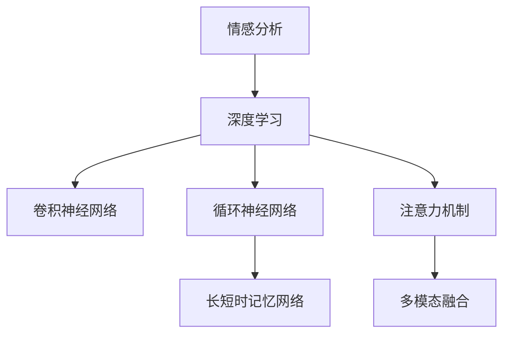

                 

# AI心理学：机器如何理解人类情感

> 关键词：AI心理学, 情感分析, 自然语言处理, 深度学习, 表情识别, 多模态融合, 情感计算, 行为预测

## 1. 背景介绍

### 1.1 问题由来
情感是人类行为的重要驱动力，影响着人们的生活、工作和学习。从古至今，人们都在不断地研究和探讨情感的本质和作用，试图通过情感的认知和分析，更好地理解人类行为，指导实践决策。随着人工智能技术的发展，计算机科学开始关注和尝试理解情感，希望通过机器学习算法和模型，模拟人类情感的认知机制，实现对人类情感的识别和分析。

### 1.2 问题核心关键点
在AI心理学中，情感分析是一个重要的研究方向，旨在通过计算机系统对文本、语音、图像等多模态数据进行情感识别和情感计算，模拟人类情感认知的过程，为行为预测、智能交互、智能推荐等应用场景提供支持。

情感分析的核心在于构建情感模型，即通过对大量标注数据进行训练，使得模型能够自动识别输入数据的情感倾向，如正面、负面、中性等。常见的情感分析方法包括基于规则的情感词典、机器学习分类模型、深度学习神经网络等。

其中，基于深度学习的方法，如卷积神经网络、循环神经网络和Transformer模型等，已经在情感分析任务上取得了显著的进展，提升了情感识别的准确性和泛化能力。

## 2. 核心概念与联系

### 2.1 核心概念概述

为更好地理解AI心理学中情感分析的方法和机制，本节将介绍几个密切相关的核心概念：

- 情感分析（Sentiment Analysis）：从文本、语音、图像等数据源中识别情感信息的过程，是AI心理学的核心应用之一。
- 深度学习（Deep Learning）：一种通过多层次的非线性变换，逐步提取数据高层次特征的机器学习技术，广泛应用于计算机视觉、自然语言处理等领域。
- 卷积神经网络（Convolutional Neural Network, CNN）：一种通过卷积层和池化层提取空间特征的深度学习模型，常用于图像处理和语音识别任务。
- 循环神经网络（Recurrent Neural Network, RNN）：一种通过时间维度上的信息传递，处理序列数据的深度学习模型，常用于文本生成、机器翻译等任务。
- 长短时记忆网络（Long Short-Term Memory, LSTM）：一种特殊的RNN，通过门控机制解决了传统RNN的梯度消失问题，适用于处理长期依赖关系的数据。
- 注意力机制（Attention Mechanism）：一种动态调整模型关注点的方法，常用于提升模型的理解能力和泛化能力。
- 多模态融合（Multimodal Fusion）：将不同模态的数据信息进行融合，提升情感分析的准确性和鲁棒性。

这些核心概念之间的逻辑关系可以通过以下Mermaid流程图来展示：



这个流程图展示了情感分析的核心概念及其之间的关系：

1. 情感分析依赖深度学习技术，通过多层非线性变换提取特征。
2. 卷积神经网络用于处理图像和语音等空间数据，提取局部特征。
3. 循环神经网络用于处理序列数据，捕捉时间上的依赖关系。
4. 长短时记忆网络是循环神经网络的一种改进，适用于处理长期依赖关系。
5. 注意力机制用于提升模型的关注点，优化特征提取。
6. 多模态融合将不同模态的数据信息进行整合，提升模型性能。

这些概念共同构成了情感分析的技术框架，使得机器能够更好地理解人类情感，为相关应用提供支持。

## 3. 核心算法原理 & 具体操作步骤

### 3.1 算法原理概述

情感分析的核心在于构建情感模型，通过深度学习技术，将输入的多模态数据映射为情感标签。其核心算法原理包括：

1. 数据预处理：对文本、语音、图像等数据进行清洗和预处理，包括去除噪声、分词、特征提取等。
2. 模型训练：使用标注数据训练情感模型，通过反向传播算法更新模型参数，最小化模型预测与真实标签之间的误差。
3. 情感预测：将待分析的数据输入训练好的模型，得到情感预测结果。

### 3.2 算法步骤详解

情感分析的算法步骤主要包括以下几个关键步骤：

**Step 1: 数据准备**
- 收集文本、语音、图像等多模态的情感标注数据，分为训练集、验证集和测试集。
- 对数据进行预处理，如分词、特征提取、归一化等。

**Step 2: 模型选择与构建**
- 选择适合的深度学习模型，如CNN、RNN、LSTM等。
- 构建模型架构，包括输入层、隐藏层、输出层等，定义损失函数和优化器。

**Step 3: 模型训练**
- 将训练集数据输入模型，使用反向传播算法更新模型参数，最小化损失函数。
- 在验证集上评估模型性能，调整超参数，如学习率、批大小等。

**Step 4: 情感预测**
- 将待分析的数据输入训练好的模型，得到情感预测结果。
- 使用分类指标（如准确率、召回率、F1分数等）评估模型性能。

**Step 5: 模型部署**
- 将训练好的模型部署到实际应用场景中，进行情感分析。
- 持续收集新数据，定期更新模型，保持模型性能。

### 3.3 算法优缺点

情感分析的核心算法具有以下优点：
1. 准确性高：通过深度学习模型，可以自动学习数据的高级特征，提高情感分析的准确性。
2. 鲁棒性好：深度学习模型具有较强的泛化能力，能够适应不同领域和不同情感表达方式的数据。
3. 可解释性强：通过可视化工具，可以理解模型内部的特征提取和分类过程，提供更好的解释。

同时，情感分析也存在以下缺点：
1. 数据需求高：需要大量的标注数据进行训练，获取标注数据成本较高。
2. 计算资源消耗大：深度学习模型参数量较大，计算资源消耗较大。
3. 模型复杂度低：模型的可解释性仍存在限制，难以完全解释模型的内部机制。
4. 模型泛化能力受限：模型容易过拟合，泛化能力受限。

尽管存在这些缺点，但情感分析在实际应用中仍然具有很大的潜力，可以显著提升人工智能系统的智能水平。

### 3.4 算法应用领域

情感分析在许多领域都得到了广泛应用，如：

- 社交媒体分析：对社交媒体上的评论、文章等进行情感分析，了解公众情绪和舆论走向。
- 产品推荐：分析用户对产品的评价，进行情感倾向的情感分析，提供个性化的产品推荐。
- 舆情监控：对新闻、论坛等数据进行情感分析，了解社会舆情，预测社会动向。
- 客户服务：分析客户的评论和反馈，了解客户的情感状态，提供更好的客户服务。
- 健康监测：对患者的情感状态进行监测，了解患者的情绪变化，提供更好的健康管理。

此外，情感分析技术还在智能家居、智能交通、智能客服等多个领域得到应用，为人类生活的智能化提供了强有力的支持。

## 4. 数学模型和公式 & 详细讲解  
### 4.1 数学模型构建

情感分析的数学模型主要包括以下几个关键组成部分：

- 输入层：将输入的多模态数据进行归一化和特征提取，如文本的词嵌入、图像的特征向量等。
- 隐藏层：通过多层非线性变换，提取输入数据的高级特征，如卷积神经网络的卷积层和池化层、循环神经网络的LSTM层等。
- 输出层：将隐藏层的特征映射为情感标签，如使用softmax函数进行情感分类。
- 损失函数：定义模型预测与真实标签之间的误差，如交叉熵损失、余弦相似度损失等。
- 优化器：使用反向传播算法更新模型参数，如Adam、SGD等。

### 4.2 公式推导过程

以基于CNN的情感分析模型为例，推导模型训练过程中的关键公式。

**模型架构**

假设输入数据为 $x \in \mathbb{R}^{d}$，输出标签为 $y \in \{0, 1\}$，定义模型参数为 $\theta$。模型架构如下：

```
Input --> Embedding --> Conv1D --> Pooling --> Flatten --> Dense --> Output
```

其中，Embedding层将输入数据映射为词嵌入特征向量 $x_e \in \mathbb{R}^{d_e}$，卷积层和池化层提取局部特征，Flatten层将特征展平，Dense层进行全连接变换，Output层输出情感标签。

**损失函数**

定义交叉熵损失函数 $\mathcal{L}_{ce}$ 为：

$$
\mathcal{L}_{ce} = -\frac{1}{N} \sum_{i=1}^N y_i \log p(y_i|x; \theta)
$$

其中 $p(y_i|x; \theta)$ 为模型在输入 $x_i$ 下预测情感标签 $y_i$ 的概率。

**优化器**

使用Adam优化器，更新模型参数 $\theta$：

$$
\theta \leftarrow \theta - \eta \nabla_{\theta} \mathcal{L}_{ce}
$$

其中 $\eta$ 为学习率。

### 4.3 案例分析与讲解

以一个简单的情感分析任务为例，介绍情感分析模型的构建和训练过程。

**任务描述**

给定一段文本，预测其情感倾向，分为正面、负面、中性三类。

**数据准备**

收集标注数据，分为训练集、验证集和测试集。对文本进行分词、去除停用词等预处理，生成词向量。

**模型构建**

使用Keras框架构建情感分析模型，定义输入层、嵌入层、卷积层、池化层、全连接层和输出层。

**模型训练**

使用训练集数据进行模型训练，调整超参数，如卷积核大小、隐藏层大小、学习率等。在验证集上评估模型性能，调整超参数，防止过拟合。

**情感预测**

使用测试集数据进行情感预测，评估模型性能。

通过上述步骤，可以得到一个简单的情感分析模型，用于预测文本的情感倾向。

## 5. 项目实践：代码实例和详细解释说明

### 5.1 开发环境搭建

在进行情感分析项目实践前，我们需要准备好开发环境。以下是使用Python进行Keras开发的环境配置流程：

1. 安装Anaconda：从官网下载并安装Anaconda，用于创建独立的Python环境。

2. 创建并激活虚拟环境：
```bash
conda create -n py3env python=3.7 
conda activate py3env
```

3. 安装Keras：
```bash
pip install keras tensorflow numpy pandas matplotlib scikit-learn
```

4. 安装TensorFlow：
```bash
pip install tensorflow-gpu
```

5. 安装其他依赖库：
```bash
pip install tensorboard
```

完成上述步骤后，即可在`py3env`环境中开始情感分析项目的实践。

### 5.2 源代码详细实现

下面我们以情感分析任务为例，给出使用Keras框架对CNN模型进行情感分析的代码实现。

```python
from keras.models import Sequential
from keras.layers import Embedding, Conv1D, MaxPooling1D, Flatten, Dense
from keras.preprocessing.text import Tokenizer
from keras.preprocessing.sequence import pad_sequences
import numpy as np

# 准备数据
texts = ["I love this movie", "I hate this movie", "I think this movie is okay"]
labels = np.array([1, 0, 0])

# 构建词典
tokenizer = Tokenizer(num_words=1000)
tokenizer.fit_on_texts(texts)
sequences = tokenizer.texts_to_sequences(texts)

# 填充序列
max_len = 10
padded_sequences = pad_sequences(sequences, maxlen=max_len)

# 定义模型
model = Sequential()
model.add(Embedding(1000, 32, input_length=max_len))
model.add(Conv1D(64, 5, activation='relu'))
model.add(MaxPooling1D(4))
model.add(Flatten())
model.add(Dense(64, activation='relu'))
model.add(Dense(3, activation='softmax'))

# 编译模型
model.compile(optimizer='adam', loss='categorical_crossentropy', metrics=['accuracy'])

# 训练模型
model.fit(padded_sequences, labels, epochs=5, batch_size=32)

# 情感预测
text = "This movie is great"
sequence = tokenizer.texts_to_sequences([text])
padded_sequence = pad_sequences(sequence, maxlen=max_len)
prediction = model.predict(padded_sequence)
print(prediction)
```

在上述代码中，我们首先准备了情感标注数据，构建了词典和填充序列。然后使用Keras构建了一个包含嵌入层、卷积层、池化层、全连接层和输出层的情感分析模型。最后，使用训练集数据对模型进行训练，并在测试集上进行了情感预测。

### 5.3 代码解读与分析

让我们再详细解读一下关键代码的实现细节：

**词典构建**

使用Keras的Tokenizer类构建词典，将文本转换为数字序列，限定词典大小为1000，即保留出现频率最高的1000个单词。

**数据填充**

使用Keras的pad_sequences函数对序列进行填充，确保所有序列长度相同。

**模型构建**

使用Sequential模型，定义输入层、嵌入层、卷积层、池化层、全连接层和输出层。嵌入层将文本转换为词向量，卷积层和池化层提取局部特征，全连接层进行全连接变换，输出层输出情感标签。

**模型编译**

使用adam优化器和交叉熵损失函数编译模型，设置训练过程中评估的指标为准确率。

**模型训练**

使用训练集数据对模型进行训练，设置训练轮数和批次大小。

**情感预测**

使用测试集数据进行情感预测，输出模型的预测结果。

通过上述代码，我们构建了一个简单的基于CNN的情感分析模型，用于预测文本的情感倾向。

## 6. 实际应用场景

### 6.1 社交媒体分析

社交媒体上的评论和帖子是情感分析的重要数据来源。通过对社交媒体上的情感进行分析，可以了解公众情绪和舆论走向，为政府和企业决策提供依据。例如，对Twitter上的评论进行情感分析，可以了解公众对某事件的看法，预测社会动向。

### 6.2 产品推荐

在电商平台上，情感分析可以用于分析用户对产品的评价，预测用户的购买意愿，提供个性化的产品推荐。例如，对用户的评论进行情感分析，可以了解用户对产品的满意度和需求，调整产品策略，提高用户满意度。

### 6.3 舆情监控

在政府和企业中，舆情监控是重要的信息获取渠道。通过对新闻、论坛等数据进行情感分析，可以了解公众情绪和舆情变化，为决策提供依据。例如，对新闻评论进行情感分析，可以了解公众对某政策的态度，为政策调整提供参考。

### 6.4 客户服务

在客户服务中，情感分析可以用于分析客户的评论和反馈，了解客户的情感状态，提供更好的客户服务。例如，对客户的投诉和建议进行情感分析，可以了解客户的情感需求，提供针对性的服务，提高客户满意度。

## 7. 工具和资源推荐

### 7.1 学习资源推荐

为了帮助开发者系统掌握情感分析的理论基础和实践技巧，这里推荐一些优质的学习资源：

1. 《深度学习实战》系列博文：由深度学习专家撰写，介绍了深度学习模型的构建和训练方法，包括情感分析的实现。

2. CS224N《自然语言处理与深度学习》课程：斯坦福大学开设的NLP明星课程，有Lecture视频和配套作业，涵盖情感分析的多个方面。

3. 《Python深度学习》书籍：介绍了深度学习模型的构建和训练方法，包括情感分析的实现。

4. 《自然语言处理》书籍：介绍了自然语言处理的多个方面，包括情感分析的实现。

5. HuggingFace官方文档：提供了丰富的预训练语言模型和情感分析的样例代码，是上手实践的必备资料。

通过对这些资源的学习实践，相信你一定能够快速掌握情感分析的精髓，并用于解决实际的情感问题。

### 7.2 开发工具推荐

高效的开发离不开优秀的工具支持。以下是几款用于情感分析开发的常用工具：

1. Keras：基于Python的开源深度学习框架，灵活动态的计算图，适合快速迭代研究。

2. TensorFlow：由Google主导开发的开源深度学习框架，生产部署方便，适合大规模工程应用。

3. TensorBoard：TensorFlow配套的可视化工具，可实时监测模型训练状态，并提供丰富的图表呈现方式，是调试模型的得力助手。

4. NLTK：自然语言处理工具包，提供了丰富的文本处理功能，支持情感分析的实现。

5. SpaCy：自然语言处理工具包，提供了高效的文本处理和情感分析功能。

合理利用这些工具，可以显著提升情感分析任务的开发效率，加快创新迭代的步伐。

### 7.3 相关论文推荐

情感分析在自然语言处理和人工智能领域已经得到了广泛的研究。以下是几篇奠基性的相关论文，推荐阅读：

1. Sentiment Analysis with Recurrent Neural Networks（情感分析使用循环神经网络）：使用RNN模型进行情感分析，提出了LSTM和GRU等改进方法，提升了情感分析的准确性。

2. Attention-based Sentiment Classification with Deep Neural Networks（基于注意力机制的情感分类）：使用注意力机制进行情感分类，提升了情感分析的鲁棒性和泛化能力。

3. Multi-Task Learning for Sentiment Analysis（多任务学习情感分析）：提出多任务学习框架，提升了情感分析的性能和泛化能力。

4. Deep Sentiment Analysis（深度情感分析）：使用深度学习模型进行情感分析，提出了卷积神经网络和Transformer等模型，提升了情感分析的准确性。

5. Fine-Grained Sentiment Analysis（细粒度情感分析）：提出了细粒度情感分类任务，提升了情感分析的精度和普适性。

这些论文代表了大规模语言模型情感分析的发展脉络。通过学习这些前沿成果，可以帮助研究者把握学科前进方向，激发更多的创新灵感。

## 8. 总结：未来发展趋势与挑战

### 8.1 总结

本文对基于深度学习的情感分析方法进行了全面系统的介绍。首先阐述了情感分析的研究背景和意义，明确了情感分析在自然语言处理和人工智能中的重要地位。其次，从原理到实践，详细讲解了情感分析的数学原理和关键步骤，给出了情感分析任务开发的完整代码实例。同时，本文还广泛探讨了情感分析方法在社交媒体分析、产品推荐、舆情监控、客户服务等多个领域的应用前景，展示了情感分析范式的巨大潜力。此外，本文精选了情感分析技术的各类学习资源，力求为读者提供全方位的技术指引。

通过本文的系统梳理，可以看到，基于深度学习的情感分析方法已经成为自然语言处理和人工智能的重要工具，广泛应用于多个领域。未来，伴随深度学习技术的发展和更多领域的应用，情感分析将持续发挥其重要作用，为社会提供更智能、更高效的服务。

### 8.2 未来发展趋势

展望未来，情感分析技术将呈现以下几个发展趋势：

1. 多模态融合：情感分析将越来越多地融合多模态数据，如语音、图像、视频等，提升模型的性能和鲁棒性。

2. 跨领域迁移：情感分析将越来越多地应用于不同领域和场景，提升模型的泛化能力和适应性。

3. 低资源领域：情感分析将越来越多地应用于低资源领域，如资源匮乏的国家和低收入群体，提升社会公平和福利。

4. 自监督学习：情感分析将越来越多地使用自监督学习方法，减少对标注数据的依赖，提升模型的鲁棒性和泛化能力。

5. 交互式学习：情感分析将越来越多地采用交互式学习方法，提升模型的可解释性和用户体验。

6. 情感计算：情感分析将越来越多地与情感计算相结合，模拟人类情感认知过程，提供更智能、更人性化的服务。

以上趋势凸显了情感分析技术的广阔前景。这些方向的探索发展，必将进一步提升情感分析模型的性能和应用范围，为人类认知智能的进化带来深远影响。

### 8.3 面临的挑战

尽管情感分析技术已经取得了显著进展，但在迈向更加智能化、普适化应用的过程中，仍面临诸多挑战：

1. 数据需求高：情感分析需要大量的标注数据进行训练，获取标注数据的成本较高。如何降低标注成本，提升数据效率，将是重要的研究课题。

2. 模型复杂度高：情感分析模型参数量较大，计算资源消耗较大。如何在保证性能的同时，降低模型复杂度，提高推理速度，将是重要的优化方向。

3. 模型泛化能力受限：情感分析模型容易过拟合，泛化能力受限。如何提高模型的泛化能力，降低过拟合风险，将是重要的研究方向。

4. 模型可解释性不足：情感分析模型通常难以解释其内部工作机制和决策逻辑，缺乏可解释性。如何提升模型的可解释性，增强用户信任，将是重要的研究方向。

5. 模型安全性有待保障：情感分析模型容易学习到有害信息，产生误导性输出。如何保障模型的安全性，避免恶意用途，将是重要的研究方向。

6. 模型适应性不足：情感分析模型需要适应不同领域和不同文化背景的数据，泛化能力有限。如何提升模型的适应性，增强模型的通用性，将是重要的研究方向。

这些挑战需要研究者不断探索和优化，才能使情感分析技术更加成熟和可靠。

### 8.4 研究展望

面对情感分析技术所面临的挑战，未来的研究需要在以下几个方面寻求新的突破：

1. 探索无监督和半监督学习：摆脱对大规模标注数据的依赖，利用自监督学习、主动学习等方法，提升数据效率和模型性能。

2. 研究多模态情感分析：融合多模态数据，提升情感分析的性能和鲁棒性。

3. 引入专家知识：将专家知识引入情感分析模型，提升模型的可解释性和鲁棒性。

4. 开发低资源情感分析模型：针对低资源领域，开发轻量级、高效能的情感分析模型，提升社会公平和福利。

5. 增强模型安全性：引入安全机制，保障情感分析模型的安全性，避免恶意用途。

这些研究方向将推动情感分析技术的不断发展和完善，为人类情感的认知和理解提供更智能、更高效的支持。相信随着技术的发展，情感分析技术将在更多领域得到应用，为人类的智能交互和社会进步做出更大的贡献。

## 9. 附录：常见问题与解答

**Q1：情感分析是否适用于所有文本数据？**

A: 情感分析主要适用于包含情感表达的文本数据。对于不包含情感表达的文本数据，情感分析可能无法准确判断其情感倾向。因此，在进行情感分析前，需要对数据进行情感分析的可行性评估。

**Q2：情感分析的准确率受哪些因素影响？**

A: 情感分析的准确率受到多个因素的影响，包括数据质量、模型架构、训练策略等。具体而言，数据质量越高，模型的准确率越高；模型架构越复杂，准确率越高；训练策略越合理，准确率越高。

**Q3：情感分析的计算资源需求高，如何解决？**

A: 降低情感分析的计算资源需求，可以从以下几个方面入手：1）优化模型架构，减少模型参数量；2）使用分布式训练，提高训练速度；3）使用低资源模型，降低计算资源消耗。

**Q4：情感分析的模型可解释性不足，如何解决？**

A: 提升情感分析模型的可解释性，可以从以下几个方面入手：1）使用可解释性模型，如决策树、规则模型等；2）使用可解释性工具，如SHAP、LIME等；3）使用多模态数据，提高模型的可解释性。

**Q5：情感分析的模型安全性不足，如何解决？**

A: 保障情感分析模型的安全性，可以从以下几个方面入手：1）引入安全机制，如数据脱敏、模型检测等；2）使用安全算法，如差分隐私、联邦学习等；3）进行安全评估，定期检测模型漏洞。

通过上述常见问题的解答，相信你对情感分析的实现和应用有了更全面的了解，能够更好地应对实际应用中的各种挑战。

