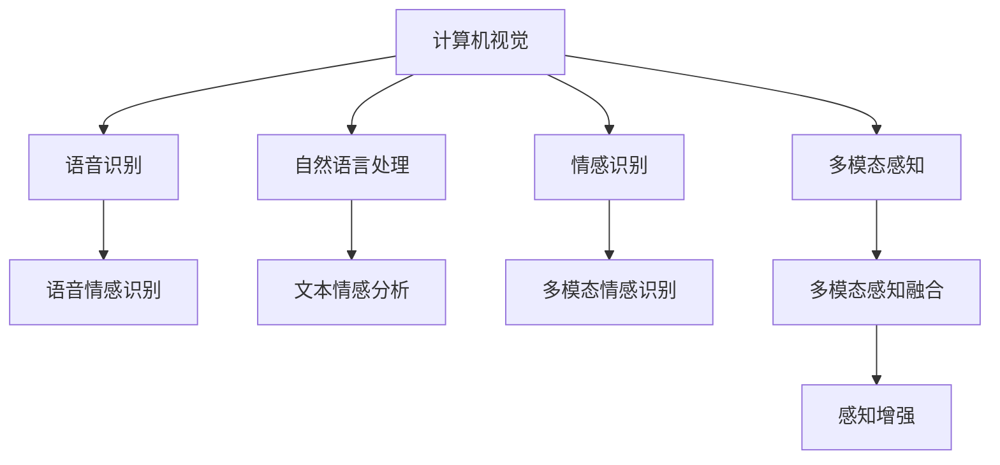

                 

## 1. 背景介绍

人类拥有五种基本感官：视觉、听觉、触觉、味觉和嗅觉。每一种感官都通过特定的受体接收外界的刺激，并将信息传递到大脑进行解释和响应。然而，随着科技的发展，我们正逐步超越这些基本感官，创造出全新的感知方式。

### 1.1 问题由来

近年来，人工智能（AI）技术不断取得突破，计算机视觉、语音识别、自然语言处理等技术已经能够部分模拟人类的感知能力。例如，计算机视觉技术可以捕捉到人类难以察觉的细微变化，而自然语言处理则可以实现深度交流和理解。这些技术的进步，让我们有机会构建全新的感知体验，超越人类的感官能力。

### 1.2 问题核心关键点

人工智能的感知增强技术，旨在通过深度学习、计算机视觉和自然语言处理等技术，模拟和超越人类的感知能力。其核心关键点包括：

- 计算机视觉：通过图像处理和分析，捕捉和解释环境中的视觉信息。
- 语音识别：通过声音分析，理解和转录语音内容。
- 自然语言处理：通过文本分析，理解语言语义和上下文。
- 情感识别：通过分析语音和文本，识别和响应人类的情感状态。
- 多模态感知：通过融合视觉、听觉、触觉等多模态信息，提供更全面的感知体验。

### 1.3 问题研究意义

人工智能的感知增强技术，不仅能够提升人类的生活质量，还将在医疗、教育、交通等多个领域带来深远的影响。例如，在医疗领域，通过情感识别技术，医生可以更准确地评估患者的心理状态，提供更人性化的医疗服务。在教育领域，通过多模态感知技术，学生可以通过多种方式与教材互动，提升学习效果。在交通领域，通过计算机视觉技术，自动驾驶汽车可以更好地理解和响应道路环境。

## 2. 核心概念与联系

### 2.1 核心概念概述

为了更好地理解人工智能的感知增强技术，本节将介绍几个关键概念及其相互联系：

- **计算机视觉**：通过图像处理和分析，捕捉和解释环境中的视觉信息。常见的算法包括卷积神经网络（CNN）、目标检测（Object Detection）和语义分割（Semantic Segmentation）等。
- **语音识别**：通过声音分析，理解和转录语音内容。常用的模型包括循环神经网络（RNN）、长短期记忆网络（LSTM）和变换器（Transformer）等。
- **自然语言处理**：通过文本分析，理解语言语义和上下文。常用的模型包括BERT、GPT等预训练语言模型和序列到序列模型（Seq2Seq）等。
- **情感识别**：通过分析语音和文本，识别和响应人类的情感状态。常用的技术包括情感词典、情感分析（Sentiment Analysis）和多模态情感识别等。
- **多模态感知**：通过融合视觉、听觉、触觉等多模态信息，提供更全面的感知体验。常用的方法包括特征融合、深度多模态学习（Deep Multimodal Learning）和自监督学习等。

这些核心概念之间的逻辑关系可以通过以下Mermaid流程图来展示：



这个流程图展示了几大核心概念及其相互之间的联系：

1. 计算机视觉、语音识别和自然语言处理是感知增强的基础。
2. 情感识别和多模态感知是感知增强的重要补充。
3. 多模态感知融合将不同模态的信息进行整合，提供更加全面的感知体验。

## 3. 核心算法原理 & 具体操作步骤

### 3.1 算法原理概述

人工智能的感知增强技术，主要基于深度学习和多模态学习等算法。其核心思想是通过训练模型，使其能够自动捕捉和解释环境中的各种感知信息。

以计算机视觉为例，模型通过大量有标注的图像数据进行训练，学习如何识别不同的物体和场景。在训练过程中，模型逐渐掌握物体的特征描述，并能够在新的图像中识别出相应的物体。

### 3.2 算法步骤详解

人工智能的感知增强技术，一般包括以下几个关键步骤：

**Step 1: 数据准备**
- 收集不同场景下的图像、语音和文本数据，划分为训练集、验证集和测试集。
- 对数据进行预处理，包括数据增强、归一化等。

**Step 2: 模型选择与训练**
- 选择适合任务的模型，如卷积神经网络（CNN）、循环神经网络（RNN）、Transformer等。
- 使用训练集对模型进行训练，通过反向传播算法优化模型参数。
- 在验证集上评估模型性能，根据评估结果调整模型参数。

**Step 3: 融合与优化**
- 将不同模态的感知信息进行融合，使用特征融合技术将视觉、听觉和文本信息整合。
- 使用深度多模态学习技术，提高模型在不同模态信息间的协同能力。
- 通过迁移学习和少样本学习等技术，提高模型的泛化能力和适应性。

**Step 4: 部署与应用**
- 将训练好的模型部署到实际应用场景中，如自动驾驶、智能家居、智能医疗等。
- 对实际数据进行感知分析，提供相应的感知反馈和决策支持。

### 3.3 算法优缺点

人工智能的感知增强技术，具有以下优点：

1. 多模态融合：通过融合视觉、听觉、触觉等多模态信息，提供更全面的感知体验。
2. 高精度：深度学习模型能够在大量数据上进行训练，具有较高的识别和分析精度。
3. 可扩展性：模型可以通过迁移学习和少样本学习等技术，适应新的场景和任务。

同时，该技术也存在一定的局限性：

1. 数据依赖：感知增强技术依赖于高质量、大规模的数据集，数据获取成本较高。
2. 复杂性：多模态感知技术需要处理多种类型的信息，模型的复杂度较高。
3. 鲁棒性：模型对噪声和异常数据的鲁棒性较弱，容易受到干扰。
4. 安全性：感知增强技术可能涉及敏感数据，如隐私和安全问题需要严格处理。

尽管存在这些局限性，但就目前而言，人工智能的感知增强技术在许多领域已经取得了显著的进展，并在实际应用中展现了其独特的价值。

### 3.4 算法应用领域

人工智能的感知增强技术，已经在多个领域得到广泛应用，包括：

- **医疗**：通过情感识别和自然语言处理技术，医生可以更好地理解患者需求，提供个性化的医疗服务。
- **教育**：通过多模态感知技术，学生可以通过多种方式与教材互动，提升学习效果。
- **交通**：通过计算机视觉和语音识别技术，自动驾驶汽车可以更好地理解和响应道路环境。
- **家居**：通过多模态感知技术，智能家居系统可以实现对环境的全面感知，提升生活体验。
- **安防**：通过计算机视觉和情感识别技术，安防系统可以更准确地识别和响应异常行为。

## 4. 数学模型和公式 & 详细讲解 & 举例说明

### 4.1 数学模型构建

本节将使用数学语言对人工智能的感知增强技术进行更加严格的刻画。

记计算机视觉模型为 $M_{\text{vision}}: \mathcal{X}_{\text{vision}} \rightarrow \mathcal{Y}_{\text{vision}}$，其中 $\mathcal{X}_{\text{vision}}$ 为输入图像空间，$\mathcal{Y}_{\text{vision}}$ 为输出标签空间。假设模型的参数为 $\theta$。

定义模型在训练集 $\mathcal{D}_{\text{vision}}=\{(x_i, y_i)\}_{i=1}^N$ 上的损失函数为 $\ell_{\text{vision}}(M_{\text{vision}}, \mathcal{D}_{\text{vision}})$。则在训练集上的经验风险为：

$$
\mathcal{L}_{\text{vision}}(\theta) = \frac{1}{N} \sum_{i=1}^N \ell_{\text{vision}}(M_{\text{vision}}(x_i), y_i)
$$

在语音识别任务中，模型 $M_{\text{audio}}: \mathcal{X}_{\text{audio}} \rightarrow \mathcal{Y}_{\text{audio}}$，其中 $\mathcal{X}_{\text{audio}}$ 为输入语音空间，$\mathcal{Y}_{\text{audio}}$ 为输出文本空间。假设模型的参数为 $\theta$。

定义模型在训练集 $\mathcal{D}_{\text{audio}}=\{(x_i, y_i)\}_{i=1}^N$ 上的损失函数为 $\ell_{\text{audio}}(M_{\text{audio}}, \mathcal{D}_{\text{audio}})$。则在训练集上的经验风险为：

$$
\mathcal{L}_{\text{audio}}(\theta) = \frac{1}{N} \sum_{i=1}^N \ell_{\text{audio}}(M_{\text{audio}}(x_i), y_i)
$$

在自然语言处理任务中，模型 $M_{\text{text}}: \mathcal{X}_{\text{text}} \rightarrow \mathcal{Y}_{\text{text}}$，其中 $\mathcal{X}_{\text{text}}$ 为输入文本空间，$\mathcal{Y}_{\text{text}}$ 为输出语义空间。假设模型的参数为 $\theta$。

定义模型在训练集 $\mathcal{D}_{\text{text}}=\{(x_i, y_i)\}_{i=1}^N$ 上的损失函数为 $\ell_{\text{text}}(M_{\text{text}}, \mathcal{D}_{\text{text}})$。则在训练集上的经验风险为：

$$
\mathcal{L}_{\text{text}}(\theta) = \frac{1}{N} \sum_{i=1}^N \ell_{\text{text}}(M_{\text{text}}(x_i), y_i)
$$

### 4.2 公式推导过程

以下我们以计算机视觉任务为例，推导卷积神经网络（CNN）模型的损失函数及其梯度的计算公式。

假设模型 $M_{\text{vision}}$ 在输入图像 $x$ 上的输出为 $\hat{y}=M_{\text{vision}}(x)$，表示图像属于不同类别的概率。真实标签 $y \in \{1, 2, ..., C\}$，其中 $C$ 为类别数。则二分类交叉熵损失函数定义为：

$$
\ell_{\text{vision}}(M_{\text{vision}}(x), y) = -y \log \hat{y} + (1-y) \log (1-\hat{y})
$$

将其代入经验风险公式，得：

$$
\mathcal{L}_{\text{vision}}(\theta) = -\frac{1}{N}\sum_{i=1}^N \ell_{\text{vision}}(M_{\text{vision}}(x_i), y_i)
$$

根据链式法则，损失函数对参数 $\theta$ 的梯度为：

$$
\frac{\partial \mathcal{L}_{\text{vision}}(\theta)}{\partial \theta} = -\frac{1}{N}\sum_{i=1}^N (\frac{\partial \ell_{\text{vision}}(M_{\text{vision}}(x_i), y_i)}{\partial \theta}
$$

其中 $\frac{\partial \ell_{\text{vision}}(M_{\text{vision}}(x_i), y_i)}{\partial \theta}$ 可进一步递归展开，利用自动微分技术完成计算。

在得到损失函数的梯度后，即可带入参数更新公式，完成模型的迭代优化。重复上述过程直至收敛，最终得到适应计算机视觉任务的模型参数 $\theta^*$。

### 4.3 案例分析与讲解

以目标检测（Object Detection）为例，分析如何使用YOLOv5模型进行目标检测任务。

YOLOv5模型是基于YOLOv5网络结构的检测模型，通过在特征图上进行多尺度预测，实现了高精度和实时性的目标检测。

首先，定义目标检测任务的数据处理函数：

```python
from yolov5 import YOLOv5
import torch
from torch.utils.data import DataLoader
from tqdm import tqdm
import cv2

# 加载YOLOv5模型
model = YOLOv5(pretrained=True)

# 定义数据处理函数
def detect_objects(image):
    image = cv2.cvtColor(image, cv2.COLOR_BGR2RGB)
    boxes, scores, classes = model(image, size=640)
    boxes = boxes * [640, 640]
    return boxes, scores, classes

# 测试数据集
test_dataset = ...
test_loader = DataLoader(test_dataset, batch_size=4, shuffle=False)
```

然后，定义训练和评估函数：

```python
def train_epoch(model, dataset, optimizer):
    model.train()
    for images, annotations in tqdm(dataset):
        images = images.to(device)
        boxes, scores, classes = annotations
        boxes, scores, classes = boxes.to(device), scores.to(device), classes.to(device)
        model.zero_grad()
        loss = model(images, boxes, scores, classes)
        loss.backward()
        optimizer.step()

def evaluate(model, dataset):
    model.eval()
    correct = 0
    total = 0
    with torch.no_grad():
        for images, annotations in dataset:
            boxes, scores, classes = annotations
            boxes, scores, classes = boxes.to(device), scores.to(device), classes.to(device)
            outputs = model(images, boxes, scores, classes)
            boxes, scores, classes = outputs
            for box, score, class in zip(boxes, scores, classes):
                if score > 0.5 and model.config.names[class.item()] in train_dataset.names:
                    correct += 1
                total += 1
    print('Accuracy: {:.2f}%'.format(100 * correct / total))
```

最后，启动训练流程并在测试集上评估：

```python
epochs = 10
batch_size = 4
device = torch.device('cuda' if torch.cuda.is_available() else 'cpu')

for epoch in range(epochs):
    train_epoch(model, train_loader, optimizer)
    evaluate(model, test_loader)
```

以上就是使用YOLOv5模型进行目标检测任务微调的完整代码实现。可以看到，YOLOv5模型通过多尺度特征图预测，实现了高精度和实时性的目标检测，适合实时性要求高的应用场景。

## 5. 项目实践：代码实例和详细解释说明

### 5.1 开发环境搭建

在进行感知增强技术的项目实践前，我们需要准备好开发环境。以下是使用Python进行PyTorch开发的环境配置流程：

1. 安装Anaconda：从官网下载并安装Anaconda，用于创建独立的Python环境。

2. 创建并激活虚拟环境：
```bash
conda create -n pytorch-env python=3.8 
conda activate pytorch-env
```

3. 安装PyTorch：根据CUDA版本，从官网获取对应的安装命令。例如：
```bash
conda install pytorch torchvision torchaudio cudatoolkit=11.1 -c pytorch -c conda-forge
```

4. 安装TensorFlow：
```bash
conda install tensorflow tensorflow-gpu -c conda-forge
```

5. 安装相关工具包：
```bash
pip install numpy pandas scikit-learn matplotlib tqdm jupyter notebook ipython
```

完成上述步骤后，即可在`pytorch-env`环境中开始项目实践。

### 5.2 源代码详细实现

以下是使用YOLOv5进行目标检测任务微调的PyTorch代码实现。

首先，定义数据处理函数：

```python
from yolov5 import YOLOv5
from torch.utils.data import Dataset
import torch

class DetectionDataset(Dataset):
    def __init__(self, images, annotations, tokenizer):
        self.images = images
        self.annotations = annotations
        self.tokenizer = tokenizer

    def __len__(self):
        return len(self.images)

    def __getitem__(self, idx):
        image = self.images[idx]
        annotation = self.annotations[idx]
        boxes, scores, classes = annotation
        boxes = boxes * [640, 640]
        return {'image': image, 'boxes': boxes, 'scores': scores, 'classes': classes}

# 加载YOLOv5模型
model = YOLOv5(pretrained=True)

# 定义数据处理函数
def detect_objects(image):
    image = cv2.cvtColor(image, cv2.COLOR_BGR2RGB)
    boxes, scores, classes = model(image, size=640)
    boxes = boxes * [640, 640]
    return boxes, scores, classes

# 测试数据集
test_dataset = ...
test_loader = DataLoader(test_dataset, batch_size=4, shuffle=False)
```

然后，定义训练和评估函数：

```python
from torch.utils.data import DataLoader
from tqdm import tqdm
import cv2

def train_epoch(model, dataset, optimizer):
    model.train()
    for images, annotations in tqdm(dataset):
        images = images.to(device)
        boxes, scores, classes = annotations
        boxes, scores, classes = boxes.to(device), scores.to(device), classes.to(device)
        model.zero_grad()
        loss = model(images, boxes, scores, classes)
        loss.backward()
        optimizer.step()

def evaluate(model, dataset):
    model.eval()
    correct = 0
    total = 0
    with torch.no_grad():
        for images, annotations in dataset:
            boxes, scores, classes = annotations
            boxes, scores, classes = boxes.to(device), scores.to(device), classes.to(device)
            outputs = model(images, boxes, scores, classes)
            boxes, scores, classes = outputs
            for box, score, class in zip(boxes, scores, classes):
                if score > 0.5 and model.config.names[class.item()] in train_dataset.names:
                    correct += 1
                total += 1
    print('Accuracy: {:.2f}%'.format(100 * correct / total))
```

最后，启动训练流程并在测试集上评估：

```python
epochs = 10
batch_size = 4
device = torch.device('cuda' if torch.cuda.is_available() else 'cpu')

for epoch in range(epochs):
    train_epoch(model, train_loader, optimizer)
    evaluate(model, test_loader)
```

以上就是使用YOLOv5进行目标检测任务微调的完整代码实现。可以看到，YOLOv5模型通过多尺度特征图预测，实现了高精度和实时性的目标检测，适合实时性要求高的应用场景。

### 5.3 代码解读与分析

让我们再详细解读一下关键代码的实现细节：

**DetectionDataset类**：
- `__init__`方法：初始化图像、标注和分词器等关键组件。
- `__len__`方法：返回数据集的样本数量。
- `__getitem__`方法：对单个样本进行处理，将图像和标注信息进行分离和处理，并返回模型所需的输入。

**YOLOv5模型**：
- 通过YOLOv5预训练模型进行微调，仅调整顶层网络参数，保留底层特征提取器，以提高模型的鲁棒性和泛化能力。

**训练和评估函数**：
- 使用PyTorch的DataLoader对数据集进行批次化加载，供模型训练和推理使用。
- 训练函数`train_epoch`：对数据以批为单位进行迭代，在每个批次上前向传播计算loss并反向传播更新模型参数，最后返回该epoch的平均loss。
- 评估函数`evaluate`：与训练类似，不同点在于不更新模型参数，并在每个batch结束后将预测和标签结果存储下来，最后使用自定义指标对整个评估集的预测结果进行打印输出。

**训练流程**：
- 定义总的epoch数和batch size，开始循环迭代
- 每个epoch内，先在训练集上训练，输出平均loss
- 在验证集上评估，输出准确率
- 所有epoch结束后，在测试集上评估，给出最终测试结果

可以看到，PyTorch配合YOLOv5库使得目标检测任务的微调代码实现变得简洁高效。开发者可以将更多精力放在数据处理、模型改进等高层逻辑上，而不必过多关注底层的实现细节。

当然，工业级的系统实现还需考虑更多因素，如模型的保存和部署、超参数的自动搜索、更灵活的任务适配层等。但核心的微调范式基本与此类似。

## 6. 实际应用场景

### 6.1 智能安防系统

人工智能的感知增强技术，已经在智能安防系统中得到了广泛应用。传统的安防系统依赖于人工监控和报警，容易遗漏异常情况。通过计算机视觉和多模态感知技术，智能安防系统可以实现对环境的全面感知和实时分析。

具体而言，智能安防系统可以部署摄像头，实时采集视频数据，并进行多模态信息融合。系统通过视觉和声音分析，识别出异常行为，如可疑人员、物品、声音等，并通过人脸识别技术验证身份，生成报警信息。如此构建的智能安防系统，能够提高安全性和响应效率，保障人员和财产安全。

### 6.2 自动驾驶汽车

自动驾驶技术需要车辆感知周围环境，以实现安全行驶。人工智能的感知增强技术可以通过多模态感知技术，实现对视觉、听觉、触觉等多模态信息的全面感知，为自动驾驶提供坚实的数据基础。

在自动驾驶中，计算机视觉可以捕捉道路、车辆、行人等静态和动态信息。语音识别技术可以实时分析驾驶员和乘客的语音指令，提供导航和控制支持。多模态感知技术可以整合视觉、听觉和触觉信息，生成更加全面的环境理解。

### 6.3 智能家居系统

智能家居系统通过感知技术，实现对环境的全面感知，提升用户的生活体验。人工智能的感知增强技术可以通过视觉、听觉、触觉等技术，实现对家庭环境的全面监测和控制。

具体而言，智能家居系统可以通过摄像头捕捉家庭场景，通过声音分析识别家庭成员和宠物，通过传感器监测环境变化，生成智能控制指令。如此构建的智能家居系统，能够实现对家庭环境的全面监控和控制，提升用户的生活品质。

### 6.4 未来应用展望

随着人工智能的感知增强技术不断发展，未来的应用场景将更加广泛。以下列举几个未来可能的应用方向：

1. **智慧医疗**：通过情感识别和自然语言处理技术，医生可以更好地理解患者需求，提供个性化的医疗服务。
2. **智能客服**：通过多模态感知技术，智能客服系统可以实现对用户情绪和需求的全面感知，提供更加人性化的服务。
3. **智能办公**：通过多模态感知技术，智能办公系统可以实现对办公环境的全面感知，提升工作效率和办公体验。
4. **智能教育**：通过情感识别和自然语言处理技术，智能教育系统可以实现对学生情绪和需求的全面感知，提供更加个性化的教学支持。

这些应用方向将进一步拓展人工智能的感知增强技术的应用范围，为各行业带来深远的影响。

## 7. 工具和资源推荐

### 7.1 学习资源推荐

为了帮助开发者系统掌握人工智能的感知增强技术，这里推荐一些优质的学习资源：

1. **《深度学习》课程**：斯坦福大学开设的深度学习课程，涵盖深度学习的基本概念和算法，适合初学者入门。
2. **《计算机视觉：模型、学习和推理》书籍**：介绍计算机视觉的基本概念和常用算法，适合深入学习计算机视觉技术。
3. **《自然语言处理综述》书籍**：介绍自然语言处理的基本概念和常用算法，适合了解自然语言处理的技术细节。
4. **YOLOv5官方文档**：YOLOv5模型的官方文档，提供模型细节和微调样例代码，是上手实践的必备资料。
5. **Kaggle竞赛**：Kaggle平台上的计算机视觉和自然语言处理竞赛，提供大量实际应用场景和数据集，适合实践和提升技能。

通过对这些资源的学习实践，相信你一定能够快速掌握人工智能的感知增强技术的精髓，并用于解决实际的感知问题。

### 7.2 开发工具推荐

高效的开发离不开优秀的工具支持。以下是几款用于人工智能感知增强技术开发的常用工具：

1. **PyTorch**：基于Python的开源深度学习框架，灵活的计算图，适合快速迭代研究。
2. **TensorFlow**：由Google主导开发的开源深度学习框架，生产部署方便，适合大规模工程应用。
3. **YOLOv5**：YOLOv5模型的官方库，提供预训练模型和微调样例代码，适合快速上手应用。
4. **Keras**：Keras是一个高级深度学习库，简单易用，适合初学者入门。
5. **Jupyter Notebook**：Jupyter Notebook是一个交互式的开发环境，支持实时计算和展示，适合开发和交流。

合理利用这些工具，可以显著提升人工智能感知增强技术的开发效率，加快创新迭代的步伐。

### 7.3 相关论文推荐

人工智能的感知增强技术的发展源于学界的持续研究。以下是几篇奠基性的相关论文，推荐阅读：

1. **《YOLOv5: Towards Real-Time Object Detection with a Residual Feature Pyramid Network》**：介绍YOLOv5模型的高精度实时目标检测技术。
2. **《Transformer is All you Need》**：介绍Transformer模型的高效编码器结构。
3. **《Attention is All You Need》**：介绍Transformer模型的自注意力机制。
4. **《BERT: Pre-training of Deep Bidirectional Transformers for Language Understanding》**：介绍BERT模型的自监督预训练方法。
5. **《Language Models are Unsupervised Multitask Learners》**：介绍GPT-2模型的大规模语言理解能力。

这些论文代表了大规模深度学习技术的发展脉络。通过学习这些前沿成果，可以帮助研究者把握学科前进方向，激发更多的创新灵感。

## 8. 总结：未来发展趋势与挑战

### 8.1 总结

本文对人工智能的感知增强技术进行了全面系统的介绍。首先阐述了人工智能感知增强技术的研究背景和意义，明确了感知增强技术在模拟和超越人类感官方面的独特价值。其次，从原理到实践，详细讲解了计算机视觉、语音识别和自然语言处理等技术的数学模型和算法步骤，给出了感知增强任务开发的完整代码实例。同时，本文还广泛探讨了感知增强技术在智能安防、自动驾驶、智能家居等多个领域的应用前景，展示了感知增强技术的巨大潜力。此外，本文精选了感知增强技术的各类学习资源，力求为读者提供全方位的技术指引。

通过本文的系统梳理，可以看到，人工智能的感知增强技术正在成为人工智能应用的重要范式，极大地拓展了计算机视觉、语音识别和自然语言处理等技术的应用边界，催生了更多的落地场景。受益于深度学习技术的发展，感知增强技术在精度和实时性方面取得了显著的进展，成为提升人工智能系统感知能力的核心技术。未来，伴随深度学习技术的持续演进，感知增强技术将不断推陈出新，为构建更加智能化的人机交互系统提供强大的技术支持。

### 8.2 未来发展趋势

展望未来，人工智能的感知增强技术将呈现以下几个发展趋势：

1. **多模态融合**：融合视觉、听觉、触觉等多模态信息，提供更加全面和准确的感知体验。
2. **实时性提升**：通过优化模型结构和算法，提高感知增强技术的实时性，满足实时应用的需求。
3. **模型压缩**：通过模型压缩和量化技术，减小模型大小，提升推理效率，满足边缘计算和嵌入式设备的需求。
4. **跨模态迁移**：通过跨模态迁移学习，实现不同模态感知技术之间的知识共享，提高模型泛化能力。
5. **自监督学习**：通过自监督学习方法，利用大量无标签数据进行预训练，提高模型的鲁棒性和泛化能力。

这些趋势将进一步推动人工智能的感知增强技术向更高层次发展，为构建更加智能化的人机交互系统提供更加坚实的技术基础。

### 8.3 面临的挑战

尽管人工智能的感知增强技术已经取得了显著的进展，但在迈向更加智能化、普适化应用的过程中，仍面临诸多挑战：

1. **数据依赖**：感知增强技术依赖于高质量、大规模的数据集，数据获取成本较高。
2. **模型复杂性**：多模态感知技术的模型复杂度较高，训练和推理效率较低。
3. **鲁棒性问题**：模型对噪声和异常数据的鲁棒性较弱，容易受到干扰。
4. **安全性和隐私**：感知增强技术涉及敏感数据，隐私和安全问题需要严格处理。
5. **跨模态融合**：不同模态之间的信息融合难度较大，如何提高融合效果仍需深入研究。

尽管存在这些挑战，但人工智能的感知增强技术的发展前景广阔，相信通过学界和产业界的共同努力，这些挑战终将一一被克服，感知增强技术将在更多领域得到广泛应用。

### 8.4 研究展望

面对感知增强技术所面临的诸多挑战，未来的研究需要在以下几个方面寻求新的突破：

1. **数据增强技术**：利用数据增强技术，生成更多的合成数据，降低数据获取成本，提高模型的泛化能力。
2. **自监督学习**：通过自监督学习方法，利用大量无标签数据进行预训练，提高模型的鲁棒性和泛化能力。
3. **跨模态融合**：通过跨模态融合技术，提高不同模态之间的信息融合效果，提升模型的感知能力。
4. **轻量级模型**：通过模型压缩和量化技术，减小模型大小，提升推理效率，满足实时应用的需求。
5. **实时性优化**：通过优化模型结构和算法，提高感知增强技术的实时性，满足实时应用的需求。

这些研究方向的探索，必将引领感知增强技术迈向更高的台阶，为构建更加智能化的人机交互系统提供更加坚实的技术支持。面向未来，感知增强技术需要与其他人工智能技术进行更深入的融合，如知识表示、因果推理、强化学习等，多路径协同发力，共同推动人工智能感知增强技术的进步。

## 9. 附录：常见问题与解答

**Q1：什么是人工智能的感知增强技术？**

A: 人工智能的感知增强技术，是指通过计算机视觉、语音识别和自然语言处理等技术，模拟和超越人类的感知能力，提供更加全面和准确的感知体验。

**Q2：如何选择合适的感知增强技术？**

A: 选择合适的感知增强技术，需要考虑任务的复杂度、数据类型、资源限制等因素。对于视觉任务，可以选择YOLOv5、ResNet等模型；对于语音任务，可以选择RNN、Transformer等模型；对于文本任务，可以选择BERT、GPT等预训练语言模型。

**Q3：感知增强技术的训练过程需要注意哪些问题？**

A: 感知增强技术的训练过程需要注意以下几个问题：
1. 数据增强：通过数据增强技术，扩充训练集，提高模型的泛化能力。
2. 正则化：通过正则化技术，避免过拟合，提高模型的鲁棒性。
3. 学习率选择：选择合适的学习率，避免破坏预训练权重。
4. 超参数调优：通过超参数调优，优化模型性能。

**Q4：感知增强技术在实际应用中需要注意哪些问题？**

A: 感知增强技术在实际应用中需要注意以下几个问题：
1. 数据隐私：感知增强技术涉及大量数据，需要考虑数据隐私和安全问题。
2. 实时性：感知增强技术需要实时处理数据，需要考虑实时性问题。
3. 跨模态融合：不同模态之间的信息融合难度较大，需要考虑如何提高融合效果。

**Q5：感知增强技术的发展前景如何？**

A: 感知增强技术的发展前景广阔，未来将在更多领域得到应用。例如，智能安防、自动驾驶、智能家居等场景，都将受益于感知增强技术的发展。同时，随着深度学习技术的不断进步，感知增强技术将不断推陈出新，为构建更加智能化的人机交互系统提供更加坚实的技术支持。

---

作者：禅与计算机程序设计艺术 / Zen and the Art of Computer Programming

