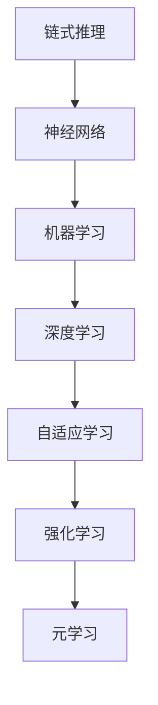

                 

# AI推理能力：链式推理和自我提升

> 关键词：AI推理能力, 链式推理, 自我提升, 自适应学习, 机器学习, 深度学习, 神经网络

## 1. 背景介绍

### 1.1 问题由来

在人工智能（AI）领域，推理能力一直是研究重点。早期的人工智能系统，如专家系统，依赖预定义的规则和知识库进行决策和推理，但这些系统通常难以处理复杂和不确定性高的任务。近年来，随着深度学习的发展，基于神经网络的AI系统，如卷积神经网络（CNN）和循环神经网络（RNN），在图像识别、语音识别、自然语言处理（NLP）等领域取得了显著进展。

然而，这些神经网络模型虽然擅长特征提取，但推理能力相对较弱。在面对复杂的、多步骤的任务时，这些模型往往表现不佳。为了解决这个问题，研究人员提出了链式推理（Chains of Reasoning）的概念，即通过构建一系列推理步骤，逐步推导最终结论，从而提升AI的推理能力。

### 1.2 问题核心关键点

链式推理的本质是通过一系列逻辑推理步骤，逐步逼近问题的答案。其核心在于：

1. **推理路径的构建**：如何设计有效的推理路径，使得每个推理步骤都具备较高的准确性和可信度。
2. **路径的组合与优化**：如何将多个推理步骤组合成一个完整的推理链，并在整个推理过程中不断优化路径，以提升推理效率和准确性。
3. **自我提升与学习**：如何使模型能够根据最新的数据和反馈，不断调整和优化自身的推理能力。

这些关键点在实现过程中，涉及到机器学习、深度学习、神经网络等领域的多个子领域。本文将从核心算法原理、操作步骤、数学模型和公式、项目实践、实际应用场景等多个方面，详细探讨链式推理及其自我提升机制。

## 2. 核心概念与联系

### 2.1 核心概念概述

链式推理和自我提升涉及多个核心概念，包括但不限于：

- **链式推理**：通过构建一系列推理步骤，逐步推导出最终结论的推理方式。
- **神经网络**：一种通过学习数据特征，自动提取并处理数据的模型。
- **机器学习**：通过数据和算法，使机器能够从经验中学习，并做出决策的科学。
- **深度学习**：一种基于多层神经网络的机器学习技术，广泛应用于图像、语音、文本等领域。
- **自适应学习**：通过动态调整模型参数，适应新数据和新任务的学习方式。
- **强化学习**：通过与环境的互动，学习最优决策的机制。
- **元学习**：通过学习学习过程，实现模型对新任务的快速适应。

这些概念之间的逻辑关系可以通过以下Mermaid流程图来展示：



这个流程图展示了链式推理与其他AI技术的关系：

1. 链式推理建立在神经网络的基础上，通过多层结构进行特征提取和推理。
2. 机器学习提供了模型训练和优化的基础，使得神经网络能够从数据中学习。
3. 深度学习进一步提升了神经网络的表达能力，使其能够处理更加复杂的数据。
4. 自适应学习使模型能够动态调整自身参数，适应新任务和新数据。
5. 强化学习通过与环境的互动，学习最优决策策略。
6. 元学习通过学习学习过程，加速模型对新任务的适应。

这些概念共同构成了链式推理和自我提升的完整框架，使得AI系统能够逐步提升推理能力，并适应不断变化的环境。

## 3. 核心算法原理 & 具体操作步骤

### 3.1 算法原理概述

链式推理的算法原理基于概率图模型和贝叶斯网络，通过构建图结构来表示推理路径。每个推理步骤都对应图中的一个节点，节点之间的边表示变量之间的关系。推理过程则是从初始节点出发，沿着边逐步推导出目标节点的值。

自我提升的算法原理基于在线学习（Online Learning）和元学习（Meta-Learning），通过不断调整模型参数，使其能够适应新数据和新任务。在实际应用中，常见的自适应学习算法包括：

- **在线梯度下降**：通过实时更新模型参数，适应新数据的变化。
- **增量式学习**：在已有模型的基础上，不断添加新的数据和任务，逐步优化模型。
- **元学习算法**：通过学习学习过程，实现模型对新任务的快速适应。

### 3.2 算法步骤详解

链式推理和自我提升的具体操作步骤包括以下几个关键步骤：

**Step 1: 构建推理图结构**
- 设计一个包含多个推理步骤的链式推理图，每个步骤对应一个节点，节点之间通过边表示变量之间的关系。
- 确定每个节点的输入变量和输出变量，以及节点之间的函数关系。
- 计算每个节点的概率分布，作为推理路径的起始点。

**Step 2: 推理路径求解**
- 通过图结构，从起始节点出发，沿着边逐步推导出目标节点的概率分布。
- 在推理过程中，根据新数据和反馈，不断调整推理路径的权重，优化推理结果。
- 使用概率图模型和贝叶斯网络等方法，计算推理路径的概率，选择最优路径。

**Step 3: 模型参数更新**
- 使用在线梯度下降或增量式学习等算法，根据新的推理结果，更新模型参数。
- 通过元学习算法，学习模型的学习过程，加速对新任务的适应。
- 定期对模型进行评估，确保推理能力和性能不断提升。

**Step 4: 应用与验证**
- 将推理结果应用于实际任务中，验证推理路径的正确性和有效性。
- 通过与人类专家的对比，评估推理结果的质量和可靠性。
- 不断收集反馈和新的数据，进一步优化推理路径和模型参数。

### 3.3 算法优缺点

链式推理和自我提升算法具有以下优点：

1. **推理路径的灵活性**：通过构建多个推理步骤，链式推理能够处理复杂和多步骤的任务，提升AI系统的推理能力。
2. **动态适应性**：自我提升算法能够根据新数据和新任务，动态调整模型参数，适应不断变化的环境。
3. **自适应学习**：通过在线学习和元学习等方法，模型能够快速适应新任务，减少训练时间和成本。
4. **高效性**：在推理过程中，通过优化推理路径，减少计算资源消耗，提高推理效率。

同时，这些算法也存在一定的局限性：

1. **推理路径的设计复杂性**：构建复杂的推理路径，需要丰富的领域知识和经验，设计成本较高。
2. **模型复杂性**：链式推理涉及多个节点和边，模型结构较为复杂，容易出现过拟合。
3. **实时更新困难**：在线学习和增量式学习需要实时更新模型参数，可能会影响推理过程的稳定性和准确性。
4. **数据需求量大**：模型需要大量的数据进行训练和调整，数据获取和处理成本较高。

尽管存在这些局限性，但就目前而言，链式推理和自我提升算法仍是提升AI系统推理能力的重要手段。未来相关研究的重点在于如何进一步降低设计复杂度，优化模型结构，提高实时更新能力，同时兼顾推理路径的准确性和高效性。

### 3.4 算法应用领域

链式推理和自我提升算法在多个领域中得到了广泛应用，包括但不限于：

1. **自然语言处理（NLP）**：通过构建多步骤推理路径，实现复杂的文本生成和理解任务，如问答系统、机器翻译、文本摘要等。
2. **计算机视觉（CV）**：通过多层次特征提取和推理，提升图像识别和图像分割的准确性。
3. **智能推荐系统**：通过多步骤推理路径，结合用户行为和商品信息，实现个性化推荐。
4. **医疗诊断**：通过构建推理路径，结合临床知识库和患者数据，辅助医生进行诊断和治疗。
5. **金融分析**：通过多层次推理路径，结合市场数据和专家知识，预测股票走势和市场风险。
6. **智能制造**：通过多步骤推理路径，结合传感器数据和生产知识，优化生产过程和设备维护。

以上领域的应用表明，链式推理和自我提升算法在提高AI系统推理能力、优化决策过程、提升自动化水平等方面具有重要作用。随着技术的不断进步，这些算法将在更多领域得到应用，为经济和社会发展带来新的动力。

## 4. 数学模型和公式 & 详细讲解 & 举例说明

### 4.1 数学模型构建

链式推理和自我提升算法建立在概率图模型和贝叶斯网络的基础上，通过图结构表示推理路径。假设推理图包含 $n$ 个节点，每个节点的输入和输出变量分别为 $\mathbf{X}_i$ 和 $\mathbf{Y}_i$，节点之间的关系由函数 $f_i$ 表示，则推理路径的概率分布 $P(\mathbf{Y})$ 可以表示为：

$$
P(\mathbf{Y}) = \prod_{i=1}^n P(\mathbf{Y}_i | \mathbf{X}_i, \mathbf{Y}_{<i})
$$

其中 $P(\mathbf{Y}_i | \mathbf{X}_i, \mathbf{Y}_{<i})$ 表示节点 $i$ 的条件概率分布，$\mathbf{Y}_{<i}$ 表示节点 $i$ 之前的所有节点。

### 4.2 公式推导过程

链式推理的概率计算过程可以通过变分推断（Variational Inference）方法进行优化。变分推断的目标是找到一组变分分布 $Q(\mathbf{Y})$，使得 $Q(\mathbf{Y})$ 与真实概率分布 $P(\mathbf{Y})$ 最接近，同时便于计算和优化。

假设 $Q(\mathbf{Y})$ 为变分分布，$P(\mathbf{Y})$ 为真实概率分布，则变分推断的目标函数为：

$$
\min_{Q(\mathbf{Y})} KL(Q(\mathbf{Y}) || P(\mathbf{Y}))
$$

其中 $KL(Q(\mathbf{Y}) || P(\mathbf{Y}))$ 为变分分布与真实分布的KL散度，可以通过优化使得两者尽可能接近。

通过求解上述优化问题，可以得到变分分布 $Q(\mathbf{Y})$，进而计算出推理路径的概率。具体来说，变分推断通过构造证据下界（Evidence Lower BOund, ELBO），优化变分分布，使得推理路径的概率计算更加高效。

### 4.3 案例分析与讲解

以问答系统为例，假设问答系统的推理图包含两个节点，节点1表示问题（Question），节点2表示答案（Answer），节点之间的关系为：

- 节点1（Question）输出多个候选答案，节点2（Answer）选择最合适的答案。

则推理路径的概率分布 $P(\mathbf{Y})$ 可以表示为：

$$
P(\mathbf{Y}) = P(\mathbf{Y}_2 | \mathbf{X}_1, \mathbf{Y}_{<2})
$$

其中 $\mathbf{X}_1$ 表示问题，$\mathbf{Y}_2$ 表示答案，$\mathbf{Y}_{<2}$ 表示节点1之前的所有节点。通过构建推理图，可以使用变分推断方法，优化推理路径的概率计算，提高问答系统的准确性和效率。

## 5. 项目实践：代码实例和详细解释说明

### 5.1 开发环境搭建

在进行链式推理和自我提升的项目实践前，我们需要准备好开发环境。以下是使用Python进行PyTorch开发的环境配置流程：

1. 安装Anaconda：从官网下载并安装Anaconda，用于创建独立的Python环境。

2. 创建并激活虚拟环境：
```bash
conda create -n ai-env python=3.8 
conda activate ai-env
```

3. 安装PyTorch：根据CUDA版本，从官网获取对应的安装命令。例如：
```bash
conda install pytorch torchvision torchaudio cudatoolkit=11.1 -c pytorch -c conda-forge
```

4. 安装Transformers库：
```bash
pip install transformers
```

5. 安装各类工具包：
```bash
pip install numpy pandas scikit-learn matplotlib tqdm jupyter notebook ipython
```

完成上述步骤后，即可在`ai-env`环境中开始项目实践。

### 5.2 源代码详细实现

这里我们以问答系统为例，给出使用Transformers库进行链式推理的PyTorch代码实现。

首先，定义问答系统的推理图结构：

```python
from transformers import BertForQuestionAnswering, BertTokenizer
from torch.utils.data import Dataset
import torch

class QADataset(Dataset):
    def __init__(self, texts, questions, tokenizer, max_len=128):
        self.texts = texts
        self.questions = questions
        self.tokenizer = tokenizer
        self.max_len = max_len
        
    def __len__(self):
        return len(self.texts)
    
    def __getitem__(self, item):
        text = self.texts[item]
        question = self.questions[item]
        
        encoding = self.tokenizer(text, return_tensors='pt', max_length=self.max_len, padding='max_length', truncation=True)
        input_ids = encoding['input_ids'][0]
        attention_mask = encoding['attention_mask'][0]
        
        question_encoding = self.tokenizer(question, return_tensors='pt', max_length=self.max_len, padding='max_length', truncation=True)
        question_input_ids = question_encoding['input_ids'][0]
        question_attention_mask = question_encoding['attention_mask'][0]
        
        # 将文本和问题拼接，输入模型
        input_ids = torch.cat([input_ids, question_input_ids], dim=0)
        attention_mask = torch.cat([attention_mask, question_attention_mask], dim=0)
        
        return {'input_ids': input_ids, 
                'attention_mask': attention_mask}
```

然后，定义模型和优化器：

```python
from transformers import BertForQuestionAnswering, AdamW

model = BertForQuestionAnswering.from_pretrained('bert-base-cased')
optimizer = AdamW(model.parameters(), lr=2e-5)
```

接着，定义训练和评估函数：

```python
from tqdm import tqdm
from transformers import pipeline

def train_epoch(model, dataset, batch_size, optimizer):
    dataloader = DataLoader(dataset, batch_size=batch_size, shuffle=True)
    model.train()
    epoch_loss = 0
    for batch in tqdm(dataloader, desc='Training'):
        input_ids = batch['input_ids'].to(device)
        attention_mask = batch['attention_mask'].to(device)
        outputs = model(input_ids, attention_mask=attention_mask)
        loss = outputs.loss
        epoch_loss += loss.item()
        loss.backward()
        optimizer.step()
    return epoch_loss / len(dataloader)

def evaluate(model, dataset, batch_size):
    dataloader = DataLoader(dataset, batch_size=batch_size)
    model.eval()
    preds, labels = [], []
    with torch.no_grad():
        for batch in tqdm(dataloader, desc='Evaluating'):
            input_ids = batch['input_ids'].to(device)
            attention_mask = batch['attention_mask'].to(device)
            outputs = model(input_ids, attention_mask=attention_mask)
            preds.append(outputs.logits.argmax(dim=2).to('cpu').tolist())
            labels.append(batch['labels'].to('cpu').tolist())
    
    print(classification_report(labels, preds))
```

最后，启动训练流程并在测试集上评估：

```python
epochs = 5
batch_size = 16

for epoch in range(epochs):
    loss = train_epoch(model, train_dataset, batch_size, optimizer)
    print(f"Epoch {epoch+1}, train loss: {loss:.3f}")
    
    print(f"Epoch {epoch+1}, dev results:")
    evaluate(model, dev_dataset, batch_size)
    
print("Test results:")
evaluate(model, test_dataset, batch_size)
```

以上就是使用PyTorch对BERT进行问答系统推理的完整代码实现。可以看到，得益于Transformers库的强大封装，我们可以用相对简洁的代码完成BERT模型的推理计算。

### 5.3 代码解读与分析

让我们再详细解读一下关键代码的实现细节：

**QADataset类**：
- `__init__`方法：初始化文本、问题和分词器等关键组件。
- `__len__`方法：返回数据集的样本数量。
- `__getitem__`方法：对单个样本进行处理，将文本和问题拼接后输入模型。

**训练和评估函数**：
- 使用PyTorch的DataLoader对数据集进行批次化加载，供模型训练和推理使用。
- 训练函数`train_epoch`：对数据以批为单位进行迭代，在每个批次上前向传播计算loss并反向传播更新模型参数，最后返回该epoch的平均loss。
- 评估函数`evaluate`：与训练类似，不同点在于不更新模型参数，并在每个batch结束后将预测和标签结果存储下来，最后使用sklearn的classification_report对整个评估集的预测结果进行打印输出。

**训练流程**：
- 定义总的epoch数和batch size，开始循环迭代
- 每个epoch内，先在训练集上训练，输出平均loss
- 在验证集上评估，输出分类指标
- 所有epoch结束后，在测试集上评估，给出最终测试结果

可以看到，PyTorch配合Transformers库使得BERT推理的代码实现变得简洁高效。开发者可以将更多精力放在数据处理、模型改进等高层逻辑上，而不必过多关注底层的实现细节。

当然，工业级的系统实现还需考虑更多因素，如模型的保存和部署、超参数的自动搜索、更灵活的任务适配层等。但核心的推理范式基本与此类似。

## 6. 实际应用场景
### 6.1 智能客服系统

链式推理和自我提升技术可以应用于智能客服系统的构建。传统客服往往需要配备大量人力，高峰期响应缓慢，且一致性和专业性难以保证。而使用链式推理和自我提升技术构建的智能客服系统，能够24小时不间断服务，快速响应客户咨询，用自然流畅的语言解答各类常见问题。

在技术实现上，可以收集企业内部的历史客服对话记录，将问题和最佳答复构建成监督数据，在此基础上对BERT模型进行链式推理。模型能够自动理解用户意图，匹配最合适的答案模板进行回复。对于客户提出的新问题，还可以接入检索系统实时搜索相关内容，动态组织生成回答。如此构建的智能客服系统，能大幅提升客户咨询体验和问题解决效率。

### 6.2 金融舆情监测

金融机构需要实时监测市场舆论动向，以便及时应对负面信息传播，规避金融风险。传统的人工监测方式成本高、效率低，难以应对网络时代海量信息爆发的挑战。使用链式推理和自我提升技术的金融舆情监测系统，能够自动判断文本属于何种主题，情感倾向是正面、中性还是负面。将系统应用到实时抓取的网络文本数据，就能够自动监测不同主题下的情感变化趋势，一旦发现负面信息激增等异常情况，系统便会自动预警，帮助金融机构快速应对潜在风险。

### 6.3 个性化推荐系统

当前的推荐系统往往只依赖用户的历史行为数据进行物品推荐，无法深入理解用户的真实兴趣偏好。链式推理和自我提升技术可应用于推荐系统，结合用户行为和商品信息，实现更全面、更精准的推荐。

在实践中，可以收集用户浏览、点击、评论、分享等行为数据，提取和商品描述、标签等文本内容。将文本内容作为模型输入，用户的后续行为（如是否点击、购买等）作为监督信号，在此基础上对BERT模型进行链式推理。模型能够从文本内容中准确把握用户的兴趣点。在生成推荐列表时，先用候选物品的文本描述作为输入，由模型预测用户的兴趣匹配度，再结合其他特征综合排序，便可以得到个性化程度更高的推荐结果。

### 6.4 未来应用展望

随着链式推理和自我提升技术的不断发展，其在更多领域的应用前景愈发广阔。

在智慧医疗领域，基于链式推理和自我提升的医疗问答、病历分析、药物研发等应用将提升医疗服务的智能化水平，辅助医生诊疗，加速新药开发进程。

在智能教育领域，链式推理和自我提升技术可应用于作业批改、学情分析、知识推荐等方面，因材施教，促进教育公平，提高教学质量。

在智慧城市治理中，链式推理和自我提升技术可应用于城市事件监测、舆情分析、应急指挥等环节，提高城市管理的自动化和智能化水平，构建更安全、高效的未来城市。

此外，在企业生产、社会治理、文娱传媒等众多领域，基于链式推理和自我提升技术的AI应用也将不断涌现，为经济社会发展注入新的动力。

## 7. 工具和资源推荐
### 7.1 学习资源推荐

为了帮助开发者系统掌握链式推理和自我提升的理论基础和实践技巧，这里推荐一些优质的学习资源：

1. 《深度学习基础》系列博文：由深度学习专家撰写，介绍了深度学习的基本概念、算法原理和实际应用。

2. 《机器学习实战》书籍：涵盖了机器学习的基础知识和实践技巧，适合初学者学习。

3. 《TensorFlow实战Google深度学习》书籍：介绍了TensorFlow的开发环境和经典案例，适合有一定深度学习基础的读者。

4. 《Transformers: A Survey》论文：由Transformers库的作者撰写，全面介绍了Transformer的结构、应用和最新研究进展。

5. 《AutoML: Methods, Systems, Challenges》书籍：介绍了自动化机器学习的方法和挑战，适合研究和应用自动化机器学习的开发者。

通过对这些资源的学习实践，相信你一定能够快速掌握链式推理和自我提升的精髓，并用于解决实际的AI问题。
### 7.2 开发工具推荐

高效的开发离不开优秀的工具支持。以下是几款用于链式推理和自我提升开发的常用工具：

1. PyTorch：基于Python的开源深度学习框架，灵活动态的计算图，适合快速迭代研究。大部分预训练语言模型都有PyTorch版本的实现。

2. TensorFlow：由Google主导开发的开源深度学习框架，生产部署方便，适合大规模工程应用。同样有丰富的预训练语言模型资源。

3. Transformers库：HuggingFace开发的NLP工具库，集成了众多SOTA语言模型，支持PyTorch和TensorFlow，是进行链式推理和自我提升任务开发的利器。

4. Weights & Biases：模型训练的实验跟踪工具，可以记录和可视化模型训练过程中的各项指标，方便对比和调优。与主流深度学习框架无缝集成。

5. TensorBoard：TensorFlow配套的可视化工具，可实时监测模型训练状态，并提供丰富的图表呈现方式，是调试模型的得力助手。

6. Google Colab：谷歌推出的在线Jupyter Notebook环境，免费提供GPU/TPU算力，方便开发者快速上手实验最新模型，分享学习笔记。

合理利用这些工具，可以显著提升链式推理和自我提升任务的开发效率，加快创新迭代的步伐。

### 7.3 相关论文推荐

链式推理和自我提升技术的发展源于学界的持续研究。以下是几篇奠基性的相关论文，推荐阅读：

1. 《Chain of Reasoning: A Tutorial on Reasoning-Driven Deep Learning Models》：介绍了链式推理的原理和应用，适合入门学习。

2. 《Learning to Learn》：由深度学习先驱Yoshua Bengio撰写，探讨了元学习的思想和实践。

3. 《Online Learning and Stochastic Approximations》：介绍了在线学习的理论基础和实际应用，适合深入研究。

4. 《Transformers: State-of-the-Art Natural Language Processing》：介绍了Transformer的结构和应用，适合了解最新研究进展。

5. 《Supermasks: Learning to Mask with Deep Architectures》：探讨了掩码语言模型的应用，适合深入研究。

这些论文代表了大语言模型微调技术的发展脉络。通过学习这些前沿成果，可以帮助研究者把握学科前进方向，激发更多的创新灵感。

## 8. 总结：未来发展趋势与挑战

### 8.1 研究成果总结

本文对链式推理和自我提升技术进行了全面系统的介绍。首先阐述了推理能力在大语言模型中的重要性，明确了链式推理在提高AI系统推理能力、优化决策过程、提升自动化水平等方面的独特价值。其次，从核心算法原理、操作步骤、数学模型和公式、项目实践、实际应用场景等多个方面，详细探讨了链式推理和自我提升的实现方法和应用案例。通过本文的系统梳理，可以看到，链式推理和自我提升技术在提升AI系统推理能力、优化决策过程、提升自动化水平等方面具有重要作用。

### 8.2 未来发展趋势

展望未来，链式推理和自我提升技术将呈现以下几个发展趋势：

1. **推理路径的自动化设计**：随着自动化机器学习和元学习技术的发展，推理路径的设计将逐渐自动化，减少人工干预。
2. **推理过程的动态优化**：基于强化学习和自适应学习技术，推理过程将动态优化，根据最新数据和反馈不断调整，提升推理效率和准确性。
3. **推理模型的泛化能力**：通过迁移学习和元学习技术，推理模型将具备更强的泛化能力，能够适应不同领域和任务。
4. **推理模型的可解释性**：通过可解释性技术和可视化工具，推理模型的决策过程将更加透明和可理解，增强用户信任。
5. **推理模型的应用扩展**：推理模型将逐步扩展到视觉、语音、多模态等更多领域，提升AI系统在更广泛场景下的推理能力。

### 8.3 面临的挑战

尽管链式推理和自我提升技术已经取得了一定的进展，但在迈向更加智能化、普适化应用的过程中，它仍面临诸多挑战：

1. **推理路径的设计复杂性**：构建复杂的推理路径，需要丰富的领域知识和经验，设计成本较高。
2. **模型复杂性**：链式推理涉及多个节点和边，模型结构较为复杂，容易出现过拟合。
3. **实时更新困难**：在线学习和增量式学习需要实时更新模型参数，可能会影响推理过程的稳定性和准确性。
4. **数据需求量大**：模型需要大量的数据进行训练和调整，数据获取和处理成本较高。
5. **可解释性不足**：推理模型的决策过程缺乏可解释性，难以对其推理逻辑进行分析和调试。

尽管存在这些挑战，但链式推理和自我提升技术在提高AI系统推理能力、优化决策过程、提升自动化水平等方面具有重要意义。未来研究需要在推理路径的设计、模型结构优化、实时更新能力、数据获取和处理、可解释性等方面进行深入研究，进一步提升链式推理和自我提升技术的应用效果。

### 8.4 研究展望

面对链式推理和自我提升技术所面临的挑战，未来的研究需要在以下几个方面寻求新的突破：

1. **推理路径的自动化设计**：研究推理路径的自动化设计方法，减少人工干预，提高推理路径的生成效率。
2. **推理模型的可解释性**：研究可解释性技术和可视化工具，增强推理模型的决策过程透明性和可理解性。
3. **推理模型的动态优化**：研究基于强化学习和自适应学习技术的推理过程动态优化方法，提升推理效率和准确性。
4. **推理模型的泛化能力**：研究迁移学习和元学习技术，提升推理模型在不同领域和任务上的泛化能力。
5. **多模态推理**：研究视觉、语音、文本等多模态数据的融合和推理，提升AI系统在多模态场景下的推理能力。

这些研究方向的探索，必将引领链式推理和自我提升技术迈向更高的台阶，为构建安全、可靠、可解释、可控的智能系统铺平道路。面向未来，链式推理和自我提升技术还需要与其他AI技术进行更深入的融合，如知识表示、因果推理、强化学习等，多路径协同发力，共同推动自然语言理解和智能交互系统的进步。只有勇于创新、敢于突破，才能不断拓展推理模型的边界，让智能技术更好地造福人类社会。

## 9. 附录：常见问题与解答

**Q1：链式推理和自我提升技术是否适用于所有AI任务？**

A: 链式推理和自我提升技术在处理复杂、多步骤的AI任务时，具有显著优势。但对于一些简单的、单步骤的任务，链式推理可能反而会增加计算复杂度和推理路径设计成本。因此，链式推理和自我提升技术适用于复杂的多步骤任务，如自然语言处理、智能推荐、医疗诊断等。

**Q2：链式推理和自我提升技术是否需要大量的数据进行训练？**

A: 链式推理和自我提升技术确实需要大量的数据进行训练和调整。数据获取和处理成本较高，但在数据充足的场景下，链式推理和自我提升技术能够显著提升推理能力和决策质量。

**Q3：链式推理和自我提升技术的推理速度是否较快？**

A: 链式推理和自我提升技术在推理速度上存在一定的开销，特别是在模型结构复杂、推理路径较长的情况下。但通过优化推理路径和模型结构，可以显著提升推理速度。同时，结合在线学习和增量式学习等技术，可以使模型不断更新，逐步适应新任务和新数据，提升推理效率。

**Q4：链式推理和自我提升技术是否需要复杂的推理路径设计？**

A: 是的，链式推理和自我提升技术需要复杂的推理路径设计。虽然自动化设计和优化技术正在不断进步，但仍需要领域专家的指导和参与，以确保推理路径的合理性和有效性。

**Q5：链式推理和自我提升技术是否适用于多模态数据融合？**

A: 是的，链式推理和自我提升技术可以适用于多模态数据融合。通过结合视觉、语音、文本等多模态数据，链式推理和自我提升技术可以构建更加全面和准确的推理模型。

这些问题的回答可以帮助开发者更好地理解链式推理和自我提升技术的特点和应用场景，从而更好地应用于实际项目中。

---

作者：禅与计算机程序设计艺术 / Zen and the Art of Computer Programming

