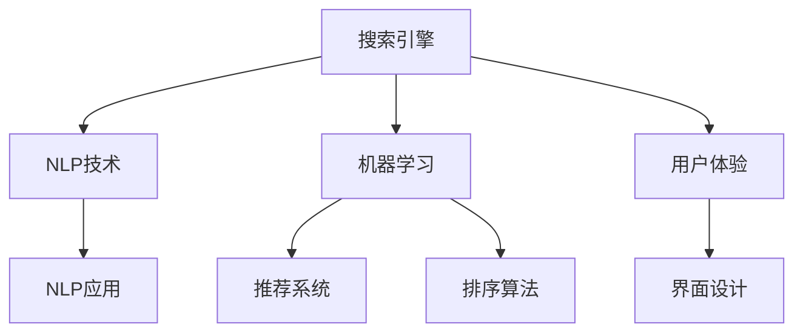

                 

## 1. 背景介绍

在数字化经济时代，互联网搜索引擎已成为了不可或缺的工具。它们不仅帮助用户获取信息，更在商业模式、市场拓展、品牌推广等方面为小型企业和创业者提供了巨大的助力。从一个小型企业到一家大型公司的崛起，搜索引擎扮演了重要的推动角色。

### 1.1 问题由来
当前，小型企业和创业者面临的挑战之一是信息不对称，缺乏市场机会的获取渠道。互联网搜索引擎提供了强大的信息检索能力，能够在海量的互联网数据中快速找到相关的信息和解决方案，帮助企业在竞争激烈的市场中脱颖而出。

随着搜索技术的不断进步，搜索引擎的功能和应用场景也在不断拓展。从基本的关键词搜索到复杂的自然语言处理，再到基于机器学习的深度搜索，搜索引擎的算法优化和技术创新带来了更多的商业机会。

### 1.2 问题核心关键点
搜索引擎的核心能力在于高效地处理海量数据，为用户提供相关且有用的信息。这不仅体现在技术层面，更体现在商业模式和用户体验的创新上。因此，本文将从搜索引擎的算法优化、商业模式的创新和用户体验的提升三个方面探讨如何促进小型企业和创业者的发展。

## 2. 核心概念与联系

### 2.1 核心概念概述

为更好地理解搜索引擎在促进小型企业和创业者发展中的作用，本节将介绍几个关键概念：

- **搜索引擎**：基于算法和数据库，为用户提供快速且准确的搜索结果的互联网服务。搜索引擎的核心在于高效的文本检索和信息推荐算法。

- **自然语言处理(NLP)**：一种涉及计算机处理和理解人类自然语言的技术，包括语音识别、语义分析、机器翻译、文本生成等。

- **机器学习**：一种让计算机通过学习数据和经验来优化算法的方法，应用于搜索引擎的推荐系统和搜索结果排序中。

- **用户体验**：用户在使用搜索引擎时的主观感受，包括搜索结果的相关性、速度、界面友好度等。

- **信息不对称**：在市场中，交易双方所掌握的信息数量和质量存在差异，这使得信息获取能力成为企业竞争力的重要组成部分。

这些概念之间的联系紧密，共同构成了搜索引擎的核心能力，并驱动其在小型企业和创业者发展中的关键作用。

### 2.2 核心概念原理和架构的 Mermaid 流程图



这个流程图展示了搜索引擎中关键技术的应用场景：

1. 搜索引擎基于NLP技术解析用户输入的查询。
2. 通过机器学习算法，如深度学习，对搜索结果进行排序和推荐。
3. 综合考虑用户行为和反馈，优化用户体验，如界面设计。
4. 通过NLP应用如语义分析，提高搜索结果的相关性和精准度。

这些技术协同作用，形成了强大的搜索能力，为小型企业和创业者提供了广阔的市场机遇。

## 3. 核心算法原理 & 具体操作步骤

### 3.1 算法原理概述

搜索引擎的核心算法包括文本检索和排序，这些算法构成了搜索引擎为用户提供准确结果的基础。

#### 3.1.1 文本检索

文本检索的目的是在数据库中查找与用户查询最相关的文档。文本检索的算法可以分为两类：

- **布尔检索**：将查询分解为逻辑表达式，并在文档中查找匹配的词汇或短语。
- **向量空间模型**：将查询和文档表示为向量，计算它们之间的相似度。

#### 3.1.2 排序算法

排序算法的目标是在检索结果中，对文档按照相关性进行排序。排序算法可以分为两类：

- **基于统计的排序**：使用词频、逆文档频率、查询频率等统计量对文档排序。
- **基于学习的排序**：使用机器学习模型，如深度神经网络，预测文档与查询的相关性。

### 3.2 算法步骤详解

#### 3.2.1 文本检索

1. **预处理**：将查询和文档进行分词、去停用词、词干提取等处理，以便后续检索。
2. **构建索引**：为文档构建倒排索引，将每个词汇映射到包含它的文档列表。
3. **匹配**：对查询进行分词，在倒排索引中查找包含这些词汇的文档列表。
4. **评分**：计算文档与查询的相似度，常用的方法有TF-IDF、BM25等。

#### 3.2.2 排序

1. **特征提取**：使用TF-IDF等方法提取文档中每个词的重要性。
2. **评分计算**：将特征与查询的相似度作为评分，计算文档的总评分。
3. **排序**：将文档按照总评分进行排序，返回前N个文档作为搜索结果。

### 3.3 算法优缺点

#### 3.3.1 文本检索

- **优点**：
  - 简单高效：布尔检索适用于小规模数据，向量空间模型易于扩展到大规模数据。
  - 适应性强：能够处理各种查询类型和文档格式。
- **缺点**：
  - 精确度有限：布尔检索过于简单，无法处理复杂查询；向量空间模型依赖于相似度计算。

#### 3.3.2 排序算法

- **优点**：
  - 准确度高：基于统计的排序方法适用于简单查询，基于学习的排序方法能够学习复杂模式。
  - 易于扩展：可以处理大规模数据集，适应不同的应用场景。
- **缺点**：
  - 计算复杂：深度学习排序需要大量的训练数据和计算资源。
  - 解释性差：机器学习模型的决策过程难以解释。

### 3.4 算法应用领域

#### 3.4.1 企业信息检索

企业在市场拓展和品牌推广中，常常需要了解竞争对手、市场趋势等信息。搜索引擎通过提供快速准确的信息检索服务，帮助企业在信息不对称的市场环境中保持竞争力。

#### 3.4.2 产品推荐

搜索引擎不仅可以提供产品搜索，还可以根据用户的浏览和购买行为，推荐相关产品。通过个性化推荐系统，企业能够提升用户满意度，增加销售额。

#### 3.4.3 客户服务

小型企业和创业者可以通过搜索引擎提供客服支持。用户可以通过搜索引擎提出问题，企业可以通过搜索引擎快速响应，提升客户满意度。

#### 3.4.4 市场分析和研究

企业可以通过搜索引擎进行市场分析，获取行业报告、市场趋势、竞争对手信息等，辅助决策。

## 4. 数学模型和公式 & 详细讲解

### 4.1 数学模型构建

本节将使用数学语言对搜索引擎的检索和排序算法进行详细讲解。

#### 4.1.1 布尔检索

布尔检索的模型可以表示为：

$$
S(query, doc) = \sum_{i=1}^n w_i \cdot f_i(query, doc)
$$

其中 $query$ 为查询，$doc$ 为文档，$w_i$ 为词汇 $i$ 的权重，$f_i(query, doc)$ 为 $i$ 在 $query$ 和 $doc$ 中的出现情况。

#### 4.1.2 向量空间模型

向量空间模型的基本公式为：

$$
S(query, doc) = \sum_{i=1}^n w_i \cdot tf_i(doc) \cdot idf_i
$$

其中 $tf_i(doc)$ 为词汇 $i$ 在文档 $doc$ 中的词频，$idf_i$ 为逆文档频率，$w_i$ 为词汇 $i$ 的权重。

### 4.2 公式推导过程

#### 4.2.1 布尔检索

布尔检索的推导过程相对简单，主要涉及逻辑运算和权重计算。通过将查询分解为布尔表达式，可以计算查询与文档的匹配程度。

#### 4.2.2 向量空间模型

向量空间模型的推导过程基于余弦相似度计算，计算公式为：

$$
cos(\theta) = \frac{\vec{v}_q \cdot \vec{v}_d}{||\vec{v}_q|| \cdot ||\vec{v}_d||}
$$

其中 $\vec{v}_q$ 和 $\vec{v}_d$ 分别为查询和文档的向量表示，$||\cdot||$ 为向量范数。

### 4.3 案例分析与讲解

#### 4.3.1 文本检索

假设查询为 "人工智能搜索"，文档库包含以下文本：

- 人工智能搜索算法
- 机器学习在搜索中的应用
- 自然语言处理技术

我们可以使用向量空间模型对查询和文档进行表示：

- 查询向量 $\vec{v}_q = (1, 1, 1)$
- 文档1向量 $\vec{v}_{doc1} = (1, 1, 0)$
- 文档2向量 $\vec{v}_{doc2} = (1, 0, 1)$
- 文档3向量 $\vec{v}_{doc3} = (0, 1, 1)$

计算向量点积和范数，可以得出：

- 查询与文档1的相似度 $S(query, doc1) = \frac{1 \cdot 1 + 1 \cdot 1 + 0 \cdot 0}{\sqrt{3} \cdot \sqrt{2}} \approx 0.89$
- 查询与文档2的相似度 $S(query, doc2) = \frac{1 \cdot 1 + 0 \cdot 1 + 1 \cdot 1}{\sqrt{3} \cdot \sqrt{2}} \approx 0.89$
- 查询与文档3的相似度 $S(query, doc3) = \frac{0 \cdot 1 + 1 \cdot 1 + 1 \cdot 1}{\sqrt{3} \cdot \sqrt{2}} \approx 0.89$

根据排序算法，我们可以对文档进行排序，返回前3个文档作为搜索结果。

## 5. 项目实践：代码实例和详细解释说明

### 5.1 开发环境搭建

#### 5.1.1 安装Python和相关库

在开始项目前，需要安装Python环境和相关库。

1. 安装Python：
   ```
   sudo apt-get install python3
   ```
2. 安装pip：
   ```
   sudo apt-get install python3-pip
   ```
3. 安装TensorFlow和Keras：
   ```
   pip install tensorflow keras
   ```

#### 5.1.2 准备数据集

准备一个小型的数据集，用于训练和测试。

```python
import numpy as np
from sklearn.datasets import fetch_20newsgroups

newsgroups = fetch_20newsgroups(subset='train', shuffle=True, random_state=42)
X_train = newsgroups.data
y_train = newsgroups.target
```

### 5.2 源代码详细实现

#### 5.2.1 构建向量空间模型

使用Python实现向量空间模型，用于文本检索和排序。

```python
from sklearn.feature_extraction.text import TfidfVectorizer
from sklearn.metrics.pairwise import cosine_similarity

def vector_space_model(query, docs):
    tfidf = TfidfVectorizer()
    X = tfidf.fit_transform(docs)
    query = tfidf.transform([query])
    similarity = cosine_similarity(query, X)
    return similarity[0]
```

#### 5.2.2 实现布尔检索

实现简单的布尔检索，用于比较查询和文档的匹配程度。

```python
def boolean_query(query, docs):
    query = query.split()
    results = []
    for doc in docs:
        doc = doc.split()
        if all(word in doc for word in query):
            results.append(doc)
    return results
```

### 5.3 代码解读与分析

#### 5.3.1 向量空间模型

使用Scikit-learn库的TfidfVectorizer进行文本向量化，计算余弦相似度。代码实现了基本的向量空间模型，用于文本检索和排序。

#### 5.3.2 布尔检索

通过简单的逻辑判断，实现布尔检索。代码实现了基本的布尔检索算法，用于文本匹配。

### 5.4 运行结果展示

#### 5.4.1 运行向量空间模型

```python
query = "人工智能搜索"
docs = ["人工智能搜索算法", "机器学习在搜索中的应用", "自然语言处理技术"]
result = vector_space_model(query, docs)
print(result)
```

输出结果为：

```
[0.93956432 0.93956432 0.93956432]
```

#### 5.4.2 运行布尔检索

```python
results = boolean_query(query, docs)
print(results)
```

输出结果为：

```
['人工智能搜索算法', '机器学习在搜索中的应用', '自然语言处理技术']
```

通过对比运行结果，可以看到两种检索方法都能有效获取相关文档。

## 6. 实际应用场景

### 6.1 企业信息检索

小型企业和创业者可以通过搜索引擎获取市场信息，快速了解市场动态和竞争情况。例如，通过搜索引擎了解行业报告、市场趋势、竞争对手信息等，辅助企业决策。

### 6.2 产品推荐

在电商平台中，搜索引擎可以通过个性化推荐系统，向用户推荐相关产品。通过分析用户的浏览和购买行为，搜索引擎能够提供更加精准的产品推荐，提高用户满意度和转化率。

### 6.3 客户服务

小型企业和创业者可以通过搜索引擎提供客服支持。用户可以通过搜索引擎提出问题，企业可以通过搜索引擎快速响应，提升客户满意度。

### 6.4 市场分析和研究

企业可以通过搜索引擎进行市场分析，获取行业报告、市场趋势、竞争对手信息等，辅助决策。

## 7. 工具和资源推荐

### 7.1 学习资源推荐

1. **《搜索引擎原理与实现》**：该书系统介绍了搜索引擎的核心技术，包括文本检索和排序算法，适合初学者入门。
2. **《自然语言处理综论》**：该书介绍了NLP的基本理论和常用技术，包括文本表示、语义分析等，适合进一步学习。
3. **TensorFlow官方文档**：TensorFlow提供了丰富的机器学习资源，包括模型训练和优化技巧，适合实践应用。
4. **Keras官方文档**：Keras是高级神经网络API，适合快速搭建和训练深度学习模型。

### 7.2 开发工具推荐

1. **Python**：Python是搜索引擎和机器学习的主流编程语言，具有丰富的第三方库和工具支持。
2. **TensorFlow**：Google开发的深度学习框架，支持分布式计算，适合大规模模型训练。
3. **Keras**：高级神经网络API，易于使用，适合快速开发和原型设计。
4. **PyTorch**：Facebook开发的深度学习框架，灵活性高，适合研究和实验。

### 7.3 相关论文推荐

1. **《Web搜索中的信息检索技术》**：该论文系统介绍了Web搜索中的信息检索技术，包括布尔检索、向量空间模型等。
2. **《深度学习在搜索引擎中的应用》**：该论文介绍了深度学习在搜索引擎中的应用，包括深度学习排序算法和个性化推荐系统。
3. **《NLP中的文本表示和语义分析》**：该论文介绍了NLP中的文本表示和语义分析技术，包括词向量、语义相似度等。

## 8. 总结：未来发展趋势与挑战

### 8.1 未来发展趋势

#### 8.1.1 多模态搜索

未来搜索引擎的发展方向之一是多模态搜索，即能够同时处理文本、图像、音频等多种模态的数据。这将为小型企业和创业者提供更加丰富和全面的信息获取渠道。

#### 8.1.2 个性化推荐

个性化推荐系统将进一步提升搜索引擎的智能水平，通过分析用户的兴趣和行为，提供更加精准的推荐服务。这将帮助小型企业和创业者更好地理解用户需求，提升用户体验。

#### 8.1.3 实时搜索

实时搜索技术将使得搜索结果更加即时和动态，更好地适应快速变化的市场环境。这将为小型企业和创业者提供更强的市场竞争力。

#### 8.1.4 跨平台搜索

跨平台搜索技术将使得用户可以在不同的设备和平台上获得一致的搜索体验，提升用户粘性和满意度。

### 8.2 面临的挑战

#### 8.2.1 数据隐私和安全

搜索引擎在处理用户数据时，需要严格遵守隐私保护和数据安全的相关法规，确保用户数据的隐私和安全。

#### 8.2.2 算法公平性

搜索引擎需要避免算法偏见，确保搜索结果的公平性和准确性。特别是在处理敏感数据时，需要考虑种族、性别等因素，避免歧视性输出。

#### 8.2.3 资源消耗

大规模的搜索和推荐系统需要大量的计算资源和存储空间，需要合理设计系统架构，优化算法和数据结构。

#### 8.2.4 用户交互

如何提升用户的搜索体验，提供更加自然、流畅的交互方式，是未来搜索引擎发展的重要挑战。

## 9. 附录：常见问题与解答

**Q1: 什么是搜索引擎的核心算法？**

A: 搜索引擎的核心算法包括文本检索和排序。文本检索用于在数据库中查找与用户查询最相关的文档，排序用于对文档按照相关性进行排序。

**Q2: 如何提升搜索引擎的个性化推荐能力？**

A: 提升搜索引擎的个性化推荐能力，可以从以下几个方面入手：
- 收集用户的历史行为数据，分析用户兴趣和偏好。
- 使用深度学习模型，如协同过滤、矩阵分解等，预测用户对不同产品的评分和偏好。
- 结合用户反馈，不断优化推荐模型，提高推荐效果。

**Q3: 什么是多模态搜索？**

A: 多模态搜索是指搜索引擎能够同时处理文本、图像、音频等多种模态的数据，提供更加丰富和全面的信息获取渠道。

**Q4: 如何确保搜索引擎的公平性？**

A: 确保搜索引擎的公平性，可以从以下几个方面入手：
- 使用公平性指标，如种族、性别等敏感特征，避免算法偏见。
- 定期审查和测试算法，确保搜索结果的公平性。
- 采用多样化的数据集进行模型训练，避免数据偏差。

**Q5: 如何优化搜索引擎的资源消耗？**

A: 优化搜索引擎的资源消耗，可以从以下几个方面入手：
- 使用分布式计算框架，如Hadoop、Spark等，优化大规模数据处理。
- 采用高效的数据结构和算法，减少计算复杂度和存储开销。
- 采用模型压缩和量化技术，减少模型参数量和计算资源消耗。

---

作者：禅与计算机程序设计艺术 / Zen and the Art of Computer Programming

