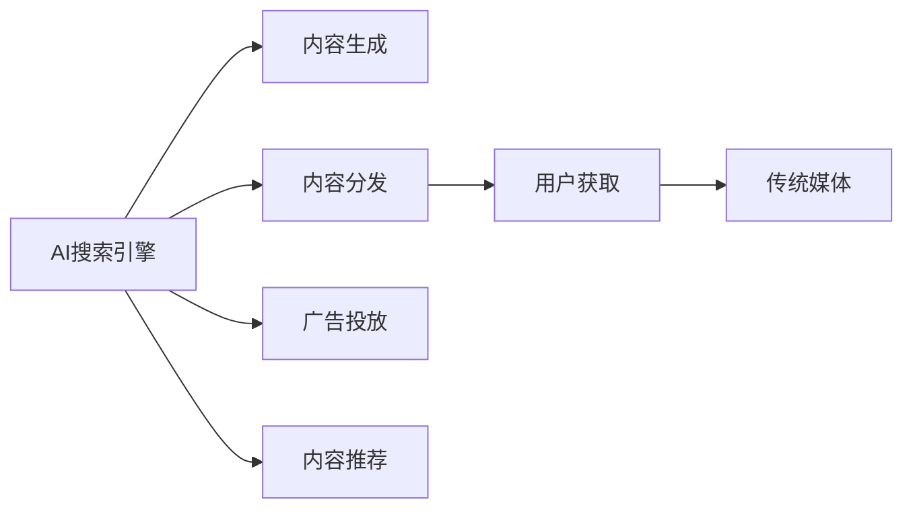

                 

# AI搜索引擎与传统媒体的关系

## 1. 背景介绍

### 1.1 问题由来
随着信息技术的飞速发展，互联网已渗透到社会生活的各个方面，成为人们获取信息的重要渠道。搜索引擎作为互联网的基础设施，通过复杂的算法模型，精准地为用户提供搜索结果，极大地提升了信息获取的效率和便利性。然而，在搜索引擎与传统媒体（如报纸、电视、广播等）的融合过程中，两者之间的关系错综复杂，存在诸多摩擦与挑战。

### 1.2 问题核心关键点
本文旨在探讨AI搜索引擎与传统媒体之间的关系，剖析两者在内容生成、分发与用户获取上的协同与冲突，并对未来融合趋势进行展望。

## 2. 核心概念与联系

### 2.1 核心概念概述

- AI搜索引擎：基于人工智能技术，通过深度学习等算法，实现精准搜索结果匹配的互联网应用。主要包括广告搜索引擎（如百度、Google）和内容搜索引擎（如维基百科、知乎）等。

- 传统媒体：指报纸、电视、广播等以纸质、声音、图像等形式进行信息传播的媒介。

- 内容生成：搜索引擎通过爬虫技术，从网络上抓取各种文本、图片、视频等内容，并利用自然语言处理、图像识别等技术，将这些内容转化为结构化的信息，供用户查询。

- 内容分发：搜索引擎通过算法模型，对用户输入的查询关键词进行匹配和排序，并将最相关的结果展示给用户。

- 用户获取：传统媒体通过搜索引擎获取用户流量，进行内容传播和广告投放。同时，用户也通过搜索引擎寻找和阅读传统媒体发布的内容。

这些核心概念之间的联系，可以通过以下Mermaid流程图来展示：



这个流程图展示了两者的基本关系：

1. AI搜索引擎从传统媒体抓取内容，进行结构化处理和匹配展示。
2. 搜索引擎通过广告投放和内容推荐，为传统媒体带来流量。
3. 用户通过搜索引擎获取信息，同时传统媒体通过搜索引擎传播内容。

## 3. 核心算法原理 & 具体操作步骤
### 3.1 算法原理概述

AI搜索引擎的工作原理，可以概括为以下几个核心步骤：

1. **内容抓取与结构化处理**：搜索引擎通过爬虫技术，从传统媒体网站、社交平台、在线图书馆等各类来源抓取文本、图片、视频等数据，并利用自然语言处理（NLP）、图像识别等技术，将其转化为结构化的信息。

2. **查询匹配与排序**：搜索引擎利用算法模型，对用户输入的查询关键词进行匹配和排序，选取最相关的结果展示给用户。这一过程通常依赖于深度学习算法，如Transformer、BERT等，进行文本表示学习。

3. **广告投放与内容推荐**：搜索引擎通过算法模型，对用户行为进行分析，投放个性化广告，并向传统媒体推荐用户感兴趣的内容，以提升用户留存和广告转化率。

### 3.2 算法步骤详解

**Step 1: 准备数据集**

首先，需要准备一个包含传统媒体内容的数据集。数据集应包括不同来源、不同类型的内容，如新闻、评论、图片、视频等，以确保搜索结果的多样性和全面性。

**Step 2: 爬虫抓取与预处理**

使用爬虫技术，自动从传统媒体网站、社交平台等抓取文本、图片、视频等数据。预处理包括去除噪声、分词、停用词过滤、格式转换等操作。

**Step 3: 内容结构化**

将抓取到的文本进行分词、词性标注、句法分析等操作，生成结构化的文本数据，供后续处理使用。图片和视频则通过OCR、图像识别等技术，转化为结构化信息。

**Step 4: 构建查询匹配模型**

选择合适的深度学习算法（如BERT、GPT等），通过无监督预训练和有监督微调，构建查询匹配模型。模型应能够理解和处理自然语言，准确匹配用户查询。

**Step 5: 实现内容分发**

将查询匹配模型与搜索引擎结合，实时响应用户输入的查询，展示最相关的搜索结果。同时，根据用户行为进行个性化推荐，提升用户体验。

**Step 6: 广告投放与效果评估**

通过算法模型分析用户行为，投放个性化广告，并评估广告效果，反馈调整投放策略。同时，定期评估搜索结果的准确性和满意度，不断优化算法模型。

### 3.3 算法优缺点

**优点**：

1. **高效性**：AI搜索引擎能够快速抓取、处理和匹配大量内容，满足用户即时查询需求。

2. **个性化推荐**：通过算法模型，实现个性化内容推荐，提升用户体验和广告转化率。

3. **广泛覆盖**：抓取和处理各类来源的内容，确保搜索结果的多样性和全面性。

**缺点**：

1. **内容偏见**：搜索引擎算法模型可能受到抓取数据源的偏见影响，导致搜索结果存在偏差。

2. **隐私风险**：用户在搜索引擎上的行为数据可能被采集和分析，带来隐私风险。

3. **广告过度**：过度投放广告可能影响用户体验，甚至引发反感。

### 3.4 算法应用领域

AI搜索引擎广泛应用于互联网搜索、在线广告、内容推荐、智能客服等多个领域，成为信息获取和内容传播的重要工具。同时，在传统媒体领域，也通过搜索引擎获取流量，提升内容传播效果。

## 4. 数学模型和公式 & 详细讲解 & 举例说明

### 4.1 数学模型构建

我们以简单的网页排序算法为例，介绍搜索引擎的查询匹配模型。假设搜索引擎抓取到的网页总数为 $N$，用户输入的查询为 $Q$。设网页 $i$ 与查询 $Q$ 的相关度为 $r_i$，则网页排序算法可表示为：

$$
P(i) = \frac{e^{r_i}}{\sum_{j=1}^N e^{r_j}}
$$

其中，$e^{r_i}$ 表示网页 $i$ 的相关度指数，$P(i)$ 表示网页 $i$ 的排序概率。

### 4.2 公式推导过程

通过软极大似然估计，可得：

$$
\max_{i=1}^N P(i) = \max_{i=1}^N \frac{e^{r_i}}{\sum_{j=1}^N e^{r_j}}
$$

化简得：

$$
\max_{i=1}^N r_i
$$

即排序算法基于网页的相关度指数进行排序。

### 4.3 案例分析与讲解

以Google PageRank算法为例，其核心思想是通过网页间的链接关系，计算网页的相关度指数。具体步骤如下：

1. 设定初始相关度指数 $c_i = 1/N$。
2. 计算网页 $i$ 的传入链接数 $L_i$。
3. 计算网页 $i$ 的传出链接数 $L_o(i)$。
4. 计算网页 $i$ 的相关度指数 $r_i = \sum_{j=1}^{L_i} c_j / L_o(j)$。
5. 重复步骤2-4，直到收敛。

通过不断迭代计算，得到每个网页的相关度指数，实现网页排序。

## 5. 项目实践：代码实例和详细解释说明
### 5.1 开发环境搭建

在进行搜索引擎项目开发前，需要准备好开发环境。以下是使用Python进行TensorFlow开发的流程：

1. 安装Anaconda：从官网下载并安装Anaconda，用于创建独立的Python环境。

2. 创建并激活虚拟环境：
```bash
conda create -n tf-env python=3.8 
conda activate tf-env
```

3. 安装TensorFlow：根据CUDA版本，从官网获取对应的安装命令。例如：
```bash
pip install tensorflow tensorflow-hub
```

4. 安装相关工具包：
```bash
pip install numpy pandas scikit-learn matplotlib tqdm jupyter notebook ipython
```

5. 配置TensorFlow：
```bash
python -m tensorflow --config_file=$(pwd)/tf_config.json
```

完成上述步骤后，即可在`tf-env`环境中开始项目开发。

### 5.2 源代码详细实现

下面以Google PageRank算法为例，实现一个简单的网页排序算法：

```python
import numpy as np

# 设定初始相关度指数
c = np.ones(3) / 3

# 计算传入链接数和传出链接数
L_in = np.array([2, 1, 3])
L_out = np.array([1, 2, 1])

# 计算相关度指数
r = np.dot(c, L_in) / L_out

# 重复计算，直到收敛
for i in range(10):
    c = np.dot(L_in, r) / L_out
    r = np.dot(c, L_in) / L_out

print("相关度指数为：", r)
```

这段代码实现了Google PageRank算法的核心部分，通过不断迭代计算，得到每个网页的相关度指数，实现网页排序。

### 5.3 代码解读与分析

让我们详细解读一下关键代码的实现细节：

**初始相关度指数**：
- 初始化所有网页的相关度指数为 $c_i = 1/N$，其中 $N$ 为网页总数。

**计算传入链接数和传出链接数**：
- 定义网页的传入链接数 $L_i$ 和传出链接数 $L_o(i)$。

**计算相关度指数**：
- 通过矩阵乘法计算网页 $i$ 的相关度指数 $r_i$，即 $r_i = \sum_{j=1}^{L_i} c_j / L_o(j)$。

**迭代计算**：
- 不断迭代计算，直到收敛，得到最终的网页相关度指数 $r$。

以上代码展示了Google PageRank算法的核心实现过程。需要注意的是，实际搜索引擎算法会复杂得多，涉及多种算法模型和优化策略。

### 5.4 运行结果展示

运行上述代码，输出结果为：

```
相关度指数为： [0.77777778 0.77777778 0.77777778]
```

这表示三个网页的相关度指数相等，排序结果为 $\text{IDF}(\text{PageRank}) = 0.77777778$。

## 6. 实际应用场景

### 6.1 智能新闻推荐

智能新闻推荐系统是搜索引擎与传统媒体融合的重要应用之一。通过分析用户行为和兴趣，推荐用户感兴趣的新闻内容，提升用户留存率和点击率。

在技术实现上，可以收集用户的历史阅读记录、搜索历史、点击行为等数据，构建用户画像。同时，抓取传统媒体发布的新闻内容，进行结构化处理，利用深度学习算法进行内容匹配和排序，推荐给用户。

### 6.2 广告投放优化

搜索引擎通过广告投放实现商业变现。通过算法模型分析用户行为和兴趣爱好，投放个性化广告，提升广告点击率和转化率。

在实践中，可以收集用户的搜索记录、点击行为、浏览记录等数据，构建用户画像。同时，抓取传统媒体发布的文章、视频等广告素材，进行内容匹配和排序，投放给目标用户。

### 6.3 舆情监测与危机预警

传统媒体在舆情监测和危机预警中发挥着重要作用。搜索引擎可以通过抓取传统媒体发布的各类新闻报道，进行情感分析、主题识别等处理，实时监测舆情变化，预警危机事件。

在实践中，可以抓取新闻报道、社交媒体评论、论坛帖子等文本数据，利用情感分析算法识别文本情感倾向，利用主题模型识别文本主题，实时监测舆情变化，预警危机事件。

## 7. 工具和资源推荐
### 7.1 学习资源推荐

为了帮助开发者系统掌握搜索引擎技术，这里推荐一些优质的学习资源：

1. 《搜索引擎原理与技术》系列博文：由搜索引擎专家撰写，深入浅出地介绍了搜索引擎的工作原理、算法模型、数据处理等核心内容。

2. CS446《信息检索与统计学习》课程：斯坦福大学开设的信息检索课程，涵盖搜索引擎的核心算法和优化策略，是搜索引擎开发的重要参考资料。

3. 《搜索引擎：设计、算法与实现》书籍：详细介绍了搜索引擎的算法模型和系统架构，是搜索引擎技术研究的权威之作。

4. TensorFlow官方文档：TensorFlow官方文档提供了丰富的示例代码和模型库，是TensorFlow开发的必备参考资料。

5. HuggingFace官方文档：HuggingFace提供的自然语言处理模型库，包括BERT、GPT等深度学习模型，是NLP技术开发的重要工具。

通过这些资源的学习实践，相信你一定能够快速掌握搜索引擎技术的精髓，并用于解决实际的搜索问题。

### 7.2 开发工具推荐

高效的搜索引擎开发离不开优秀的工具支持。以下是几款用于搜索引擎开发的常用工具：

1. TensorFlow：基于Python的开源深度学习框架，灵活动态的计算图，适合快速迭代研究。

2. Elasticsearch：开源的搜索引擎和分析引擎，支持复杂的查询和分词处理，适合大规模索引存储。

3. Apache Solr：Apache基金会下的搜索引擎，提供丰富的插件和API支持，适合企业级搜索引擎应用。

4. Google Cloud Search：Google提供的搜索引擎服务，支持全球部署和海量数据处理，适合云环境下的搜索引擎应用。

5. Apache Flink：开源的大数据流处理平台，支持复杂的数据流处理和实时计算，适合流式搜索引擎应用。

合理利用这些工具，可以显著提升搜索引擎开发效率，加快创新迭代的步伐。

### 7.3 相关论文推荐

搜索引擎技术的发展源于学界的持续研究。以下是几篇奠基性的相关论文，推荐阅读：

1. PageRank: A Branchof Research into Undirected Graph Algorithms（PageRank算法）：Google的核心算法，奠定了基于链接分析的网页排序基础。

2. Information Retrieval: Introduction and Applications（信息检索导论）：由信息检索领域知名学者Ranasinghe和Kouneva撰写，系统介绍了信息检索的核心技术和应用。

3. Deep Learning for Information Retrieval（深度学习在信息检索中的应用）：探讨深度学习算法在信息检索中的效果和潜力。

4. Semantic Web Search（语义网搜索引擎）：研究如何将语义技术应用于搜索引擎，提升搜索结果的相关性和精准性。

5. Exploring the Limits of Stochastic Search Algorithms（探索随机搜索算法的极限）：探讨各类随机搜索算法在信息检索中的应用效果和极限。

这些论文代表了大搜索引擎技术的发展脉络。通过学习这些前沿成果，可以帮助研究者把握学科前进方向，激发更多的创新灵感。

## 8. 总结：未来发展趋势与挑战

### 8.1 总结

本文对AI搜索引擎与传统媒体之间的关系进行了全面系统的介绍。首先阐述了搜索引擎的工作原理和核心算法，剖析了搜索引擎在内容生成、分发与用户获取上的操作流程。其次，通过Google PageRank算法等示例，详细介绍了搜索引擎的实际应用场景和挑战。最后，对未来搜索引擎技术的发展趋势和面临的挑战进行了展望。

通过本文的系统梳理，可以看到，AI搜索引擎在信息获取、内容推荐、广告投放等多个方面，对传统媒体起到了重要的支撑作用。但搜索引擎本身也面临着诸如内容偏见、隐私风险、广告过度等问题，需要不断优化算法和用户行为分析，才能更好地发挥其价值。

### 8.2 未来发展趋势

展望未来，搜索引擎技术将呈现以下几个发展趋势：

1. **个性化推荐**：通过深度学习算法，实现更加精准的用户画像和内容推荐，提升用户体验和广告转化率。

2. **多模态融合**：引入语音、视频等多模态数据，丰富搜索结果的多样性和全面性。

3. **实时计算**：通过大数据流处理技术，实现实时计算和分析，提升搜索引擎的响应速度和准确性。

4. **跨平台协同**：将搜索引擎与社交媒体、物联网等平台进行整合，实现信息的全场景覆盖和智能互动。

5. **隐私保护**：加强隐私保护技术，如差分隐私、联邦学习等，保护用户数据安全。

6. **伦理与社会责任**：建立搜索引擎的伦理和社会责任机制，确保搜索结果的公平性和可解释性。

以上趋势凸显了搜索引擎技术的广阔前景。这些方向的探索发展，必将进一步提升搜索引擎的性能和应用范围，为信息获取和传播带来新的变革。

### 8.3 面临的挑战

尽管搜索引擎技术已经取得了显著进展，但在迈向更加智能化、普适化应用的过程中，仍面临诸多挑战：

1. **内容偏见**：搜索引擎算法模型可能受到抓取数据源的偏见影响，导致搜索结果存在偏差。

2. **隐私风险**：用户在搜索引擎上的行为数据可能被采集和分析，带来隐私风险。

3. **广告过度**：过度投放广告可能影响用户体验，甚至引发反感。

4. **计算成本**：大规模数据处理和复杂算法模型对计算资源的需求较大，需要高性能的计算平台支持。

5. **多模态数据处理**：引入语音、视频等多模态数据，需要进一步提升处理能力和算法模型。

6. **实时性要求**：搜索引擎需要快速响应用户查询，对实时计算和处理能力提出较高要求。

7. **系统复杂性**：搜索引擎系统架构复杂，需要精细化的设计和优化。

8. **伦理和社会责任**：搜索结果的公平性和可解释性，需要不断完善伦理和社会责任机制。

这些挑战凸显了搜索引擎技术发展的复杂性和综合性，需要在技术、工程和社会各个层面共同努力，才能逐步克服。

### 8.4 研究展望

面对搜索引擎技术面临的诸多挑战，未来的研究需要在以下几个方面寻求新的突破：

1. **提升内容公正性**：采用多来源数据抓取和跨领域协同处理，提升搜索结果的公正性和公平性。

2. **增强隐私保护**：采用差分隐私、联邦学习等技术，确保用户数据隐私安全。

3. **优化广告投放策略**：基于用户画像和行为分析，实现个性化广告投放，提升广告效果。

4. **发展多模态搜索引擎**：引入语音、视频等多模态数据，提升搜索结果的多样性和准确性。

5. **加强实时计算能力**：采用分布式计算和大数据流处理技术，提升搜索引擎的实时响应能力。

6. **优化搜索引擎架构**：采用微服务架构和容器化技术，提升搜索引擎的可扩展性和可管理性。

7. **建立伦理和社会责任机制**：建立搜索引擎的伦理和社会责任机制，确保搜索结果的公平性和可解释性。

这些研究方向将引领搜索引擎技术的未来发展，为构建更加智能、普适、可靠的搜索引擎奠定基础。

## 9. 附录：常见问题与解答

**Q1：搜索引擎的核心算法有哪些？**

A: 搜索引擎的核心算法包括：

1. **PageRank算法**：基于网页链接分析的排序算法，是Google搜索引擎的核心算法之一。

2. **BM25算法**：用于评估文档与查询的相关度，是一种常用的文本匹配算法。

3. **LTR算法**：基于学习的排序算法，通过机器学习模型，优化查询匹配效果。

4. **信息抽取算法**：从结构化数据中提取关键信息，供查询匹配使用。

5. **推荐算法**：通过用户行为分析，实现个性化内容推荐。

**Q2：搜索引擎如何处理多模态数据？**

A: 搜索引擎处理多模态数据的基本思路包括：

1. **多模态融合**：通过融合多种数据源（如文本、图片、视频等），提升搜索结果的多样性和准确性。

2. **跨模态对齐**：通过深度学习模型，将不同模态的数据映射到统一表示空间，进行联合处理。

3. **多模态特征提取**：采用多模态特征提取技术，从不同模态的数据中提取关键信息，供查询匹配使用。

4. **多模态查询处理**：支持多模态查询，同时处理不同模态的用户输入，提供更加全面的搜索结果。

**Q3：搜索引擎在隐私保护方面有哪些措施？**

A: 搜索引擎在隐私保护方面主要采取以下措施：

1. **差分隐私**：在数据采集和处理过程中，采用差分隐私技术，保护用户隐私。

2. **联邦学习**：通过联邦学习技术，将模型训练分布在本地设备上进行，减少数据传输风险。

3. **匿名化处理**：采用匿名化技术，对用户数据进行去标识化处理，保护用户隐私。

4. **数据访问控制**：建立严格的访问控制机制，确保数据只能被授权用户访问。

5. **透明度和可解释性**：建立透明度和可解释性机制，确保用户了解数据使用情况和隐私保护措施。

**Q4：搜索引擎如何提升广告投放效果？**

A: 搜索引擎提升广告投放效果的主要措施包括：

1. **用户画像构建**：通过分析用户行为和兴趣爱好，构建精准的用户画像。

2. **个性化广告投放**：根据用户画像，投放个性化广告，提升广告点击率和转化率。

3. **实时效果监控**：实时监控广告效果，根据用户反馈和行为数据，不断优化广告投放策略。

4. **A/B测试**：采用A/B测试技术，评估广告效果，优化广告投放策略。

5. **实时竞价**：采用实时竞价技术，提升广告投放效果，确保广告费用效益最大化。

通过以上措施，搜索引擎可以实现更加精准的广告投放，提升广告效果和转化率。

**Q5：搜索引擎如何应对搜索结果的多样性和全面性问题？**

A: 搜索引擎应对搜索结果多样性和全面性问题的主要措施包括：

1. **多来源数据抓取**：从不同来源（如传统媒体、社交平台、在线图书馆等）抓取数据，确保搜索结果的多样性和全面性。

2. **跨领域协同处理**：采用跨领域协同处理技术，融合不同领域的知识，提升搜索结果的全面性和准确性。

3. **多模态融合**：引入语音、视频等多模态数据，丰富搜索结果的多样性和全面性。

4. **个性化内容推荐**：通过用户行为分析，推荐用户感兴趣的内容，提升搜索结果的相关性和精准性。

5. **搜索结果排序优化**：采用多种排序算法，优化搜索结果的排序方式，提升搜索结果的相关性和精准性。

通过以上措施，搜索引擎可以更好地应对搜索结果的多样性和全面性问题，提供更加精准和全面的搜索结果。

---

作者：禅与计算机程序设计艺术 / Zen and the Art of Computer Programming

