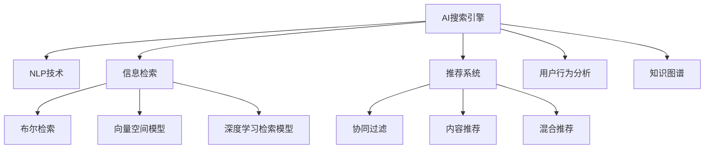

                 

# AI搜索引擎在商业智能中的应用

> 关键词：AI搜索引擎, 商业智能, 自然语言处理(NLP), 信息检索, 推荐系统, 用户行为分析, 知识图谱

## 1. 背景介绍

### 1.1 问题由来
在数字化转型浪潮下，商业智能（Business Intelligence，BI）已成为企业决策支撑的重要手段。AI搜索引擎作为BI系统的重要组成部分，通过理解和分析海量数据，提供精准的信息检索和推荐服务，帮助企业实现快速、准确、高效的信息获取和决策支持。AI搜索引擎的核心是自然语言处理（Natural Language Processing，NLP）技术，通过构建先进的语义检索模型和推荐算法，实现自然语言与结构化数据的深度融合。

近年来，随着深度学习、自然语言处理和推荐系统的快速发展，AI搜索引擎的性能和应用场景不断扩展，从简单的信息检索扩展到复杂的商业智能分析，逐步成为企业数据决策的重要支撑。本文将详细探讨AI搜索引擎在商业智能中的应用，包括核心概念、算法原理、具体操作步骤、数学模型、项目实践、实际应用场景、工具和资源推荐，以及未来发展趋势与挑战。

## 2. 核心概念与联系

### 2.1 核心概念概述

为更好地理解AI搜索引擎在商业智能中的应用，本节将介绍几个密切相关的核心概念：

- **AI搜索引擎**：利用深度学习、自然语言处理和信息检索技术，构建的智能信息检索系统。能够理解自然语言查询，从海量的非结构化数据中检索出最相关的信息。

- **商业智能**：通过数据分析和信息抽取，帮助企业进行决策支撑和业务优化的过程。商业智能系统通常包括数据集成、数据清洗、数据建模、报表分析、仪表盘展示等多个环节。

- **自然语言处理（NLP）**：处理和理解人类语言的技术，包括分词、词性标注、句法分析、语义分析、情感分析等。

- **信息检索**：从文本集合中检索出与查询相关的信息，包括布尔检索、向量空间模型、基于深度学习的检索模型等。

- **推荐系统**：根据用户的历史行为和偏好，推荐相关的产品、服务或信息。推荐系统包括协同过滤、基于内容的推荐、混合推荐等。

- **用户行为分析**：分析用户在应用或网站上的行为模式，帮助企业洞察用户需求和偏好，优化产品和服务。

- **知识图谱**：将知识以图谱的形式组织和存储，便于查询和推理，支持复杂的知识抽取和推理应用。

这些核心概念之间的逻辑关系可以通过以下Mermaid流程图来展示：



这个流程图展示了大语言模型的核心概念及其之间的关系：

1. AI搜索引擎通过NLP技术理解查询，运用信息检索技术从数据集中检索出相关信息。
2. 推荐系统根据用户行为分析，推荐相关产品或信息。
3. 用户行为分析则通过NLP技术进行用户意图理解和行为建模。
4. 知识图谱用于支撑复杂的知识抽取和推理应用。

这些概念共同构成了AI搜索引擎在商业智能中的应用框架，使其能够高效、准确地提供信息检索和推荐服务。

## 3. 核心算法原理 & 具体操作步骤
### 3.1 算法原理概述

AI搜索引擎在商业智能中的应用，核心在于构建高质量的语义检索模型和推荐算法。其核心算法原理主要包括以下几个方面：

1. **语义检索模型**：通过自然语言处理技术，将用户查询和文档文本转换为向量表示，计算它们之间的相似度，从文档集合中检索出最相关的文档。常见的算法包括BERT、ELMo等预训练语言模型，以及基于这些模型的向量空间模型和神经网络模型。

2. **推荐算法**：通过分析用户历史行为数据，预测用户偏好，为用户推荐最相关的产品或信息。常见的算法包括协同过滤、基于内容的推荐、混合推荐等。

3. **用户行为分析**：通过NLP技术，从用户行为数据中抽取用户意图、兴趣和偏好，建立用户行为模型，用于指导推荐系统。

4. **知识图谱构建**：通过结构化数据和知识抽取技术，构建企业内部或外部知识图谱，支撑复杂的商业智能分析应用。

### 3.2 算法步骤详解

AI搜索引擎在商业智能中的应用，通常包括以下几个关键步骤：

**Step 1: 数据准备与预处理**
- 收集和清洗商业智能所需的各类数据，包括交易数据、用户行为数据、市场数据等。
- 对文本数据进行分词、去停用词、词性标注等预处理。

**Step 2: 构建语义检索模型**
- 选择预训练语言模型（如BERT、GPT等）作为基础模型。
- 利用该模型对文本进行编码，得到文本的向量表示。
- 计算查询与文档向量之间的余弦相似度或点积相似度，筛选出最相关的文档。

**Step 3: 构建推荐系统**
- 收集用户的历史行为数据，建立用户行为模型。
- 根据用户行为模型，预测用户对每个产品或服务的评分，构建推荐列表。
- 根据用户偏好和评分，动态调整推荐算法中的参数，优化推荐效果。

**Step 4: 用户行为分析**
- 分析用户的行为数据，提取用户意图、兴趣和偏好。
- 建立用户行为模型，用于指导推荐系统，进一步优化推荐结果。

**Step 5: 知识图谱构建与查询**
- 构建企业内部或外部知识图谱，支持复杂的商业智能分析。
- 通过图谱查询技术，抽取与查询相关的知识节点，支持复杂的推理应用。

### 3.3 算法优缺点

AI搜索引擎在商业智能中的应用，具有以下优点：

1. **高精度与高召回率**：基于深度学习的语义检索模型，能够理解复杂的自然语言查询，提供高精度的信息检索服务。
2. **个性化推荐**：通过用户行为分析，为用户提供个性化的产品或服务推荐，提升用户体验。
3. **灵活性**：可以针对不同领域和场景，灵活调整检索和推荐算法，适应多样化的业务需求。
4. **高效性**：通过并行计算和分布式部署，可以高效处理大规模数据，支持实时信息检索和推荐。

同时，该方法也存在以下局限性：

1. **数据质量要求高**：高质量的语义检索和推荐模型，依赖于高质量的数据，数据质量对系统性能影响较大。
2. **模型复杂度高**：深度学习模型参数量大，训练和推理成本高，需要高性能计算资源。
3. **用户隐私保护**：在用户行为分析中，如何保护用户隐私，防止数据泄露和滥用，是一大挑战。
4. **知识图谱构建复杂**：知识图谱的构建和维护复杂，需要投入大量时间和人力。

尽管存在这些局限性，但就目前而言，AI搜索引擎在商业智能中的应用，仍然是推动企业数字化转型的重要工具。未来相关研究的重点在于如何进一步提升数据质量、降低计算成本、保护用户隐私，同时提高知识图谱构建的效率和准确性。

### 3.4 算法应用领域

AI搜索引擎在商业智能中的应用，已经广泛应用于多个领域，包括但不限于：

- **零售行业**：通过AI搜索引擎，从电商平台上检索出最相关的商品，为用户推荐个性化商品。同时，分析用户行为数据，优化商品推荐策略。
- **金融行业**：构建AI搜索引擎，分析海量金融市场数据，提供实时交易分析和投资建议。同时，通过用户行为分析，优化产品推荐和服务体验。
- **医疗行业**：从电子病历、医学文献等海量的非结构化数据中，检索出最相关的病例和治疗方案。同时，分析用户行为数据，提供个性化医疗服务。
- **制造业**：通过AI搜索引擎，从生产数据中检索出最相关的设备维护记录和故障处理方案。同时，分析设备使用数据，优化生产流程。
- **媒体行业**：构建AI搜索引擎，分析用户观看和阅读数据，提供个性化的内容推荐。同时，通过用户行为分析，优化内容生产和分发策略。

## 4. 数学模型和公式 & 详细讲解  
### 4.1 数学模型构建

本节将使用数学语言对AI搜索引擎在商业智能中的应用进行更加严格的刻画。

假设查询$q$和文档$d$的向量表示分别为$\vec{q}$和$\vec{d}$，使用余弦相似度计算两者之间的相似度：

$$
sim(q, d) = \frac{\vec{q} \cdot \vec{d}}{\|\vec{q}\|_2 \cdot \|\vec{d}\|_2}
$$

其中，$\vec{q} \cdot \vec{d}$为向量点积，$\|\vec{q}\|_2$和$\|\vec{d}\|_2$分别为向量$\vec{q}$和$\vec{d}$的L2范数。

在推荐系统中，假设用户$u$对商品$j$的评分向量为$\vec{u}_j$，推荐系统预测该评分向量为$\hat{\vec{u}}_j$。使用均方误差（MSE）作为推荐系统的损失函数，计算预测评分与实际评分之间的差异：

$$
L(u, j) = \frac{1}{N}\sum_{i=1}^N (u_i - \hat{u}_i)^2
$$

其中$N$为用户数，$u_i$为用户$i$对商品$j$的实际评分，$\hat{u}_i$为用户$i$对商品$j$的预测评分。

### 4.2 公式推导过程

以下我们以协同过滤推荐算法为例，推导推荐系统中的均方误差损失函数及其梯度的计算公式。

假设推荐系统包含$m$个用户和$n$个商品，用户-商品评分矩阵为$R_{m\times n}$。设用户$u$对商品$j$的实际评分$R_{uj}$，推荐系统预测的评分$\hat{R}_{uj}$。使用均方误差损失函数，推荐系统的总损失为：

$$
L = \frac{1}{mn}\sum_{u=1}^m \sum_{j=1}^n (R_{uj} - \hat{R}_{uj})^2
$$

为了最大化推荐系统的效果，需要最小化损失函数$L$。根据梯度下降的优化目标，设学习率为$\eta$，更新用户$u$对商品$j$的预测评分：

$$
\hat{R}_{uj} = \hat{R}_{uj} - \eta \frac{\partial L}{\partial \hat{R}_{uj}}
$$

其中，$\partial L/\partial \hat{R}_{uj}$表示损失函数对预测评分$\hat{R}_{uj}$的偏导数。将损失函数对预测评分的偏导数展开，得：

$$
\frac{\partial L}{\partial \hat{R}_{uj}} = -\frac{2}{mn} \sum_{i=1}^m \sum_{k=1}^n R_{ik} - \hat{R}_{uk}
$$

在推荐系统中，通常使用矩阵分解的方法进行推荐。假设用户$u$对商品$j$的评分向量为$\vec{u}_j = \vec{a}_u \cdot \vec{p}_j$，其中$\vec{a}_u$为用户$u$的特征向量，$\vec{p}_j$为商品$j$的特征向量。

根据用户-商品评分矩阵$R_{m\times n}$，得到用户$u$对商品$j$的实际评分向量$\vec{r}_j = \vec{R}_u \cdot \vec{p}_j$。根据均方误差损失函数，推荐系统的总损失为：

$$
L = \frac{1}{mn}\sum_{u=1}^m \sum_{j=1}^n (R_{uj} - \hat{R}_{uj})^2
$$

将其展开，得：

$$
L = \frac{1}{mn}\sum_{u=1}^m \sum_{j=1}^n (a_u \cdot p_j - \hat{a}_u \cdot \hat{p}_j)^2
$$

进一步简化，得：

$$
L = \frac{1}{mn}\sum_{u=1}^m \sum_{j=1}^n (a_u^2 p_j^2 - 2a_u \hat{a}_u p_j^2 + \hat{a}_u^2 \hat{p}_j^2)
$$

其中$\hat{a}_u$和$\hat{p}_j$为预测特征向量，$\vec{r}_j = \vec{R}_u \cdot \vec{p}_j$为实际评分向量。

### 4.3 案例分析与讲解

以下我们以零售行业的推荐系统为例，展示AI搜索引擎在商业智能中的应用。

假设零售行业拥有一个大规模的电商平台，包含$m$个用户和$n$个商品，用户-商品评分矩阵$R_{m\times n}$。电商平台希望通过AI搜索引擎，实现个性化的商品推荐。

**Step 1: 数据准备与预处理**
- 收集用户的历史行为数据，包括浏览记录、购买记录、评论记录等。
- 对文本数据进行分词、去停用词、词性标注等预处理。

**Step 2: 构建语义检索模型**
- 选择BERT作为基础模型，对商品名称、描述、用户评论等文本进行编码，得到文本的向量表示。
- 利用向量空间模型，计算查询与商品向量之间的余弦相似度，筛选出最相关的商品。

**Step 3: 构建推荐系统**
- 收集用户的历史行为数据，建立用户行为模型。
- 根据用户行为模型，预测用户对每个商品的评分，构建推荐列表。
- 根据用户偏好和评分，动态调整推荐算法中的参数，优化推荐效果。

**Step 4: 用户行为分析**
- 分析用户的行为数据，提取用户意图、兴趣和偏好。
- 建立用户行为模型，用于指导推荐系统，进一步优化推荐结果。

## 5. 项目实践：代码实例和详细解释说明
### 5.1 开发环境搭建

在进行AI搜索引擎在商业智能中的项目实践前，我们需要准备好开发环境。以下是使用Python进行TensorFlow开发的环境配置流程：

1. 安装Anaconda：从官网下载并安装Anaconda，用于创建独立的Python环境。

2. 创建并激活虚拟环境：
```bash
conda create -n tensorflow-env python=3.8 
conda activate tensorflow-env
```

3. 安装TensorFlow：根据CUDA版本，从官网获取对应的安装命令。例如：
```bash
conda install tensorflow tensorflow-cpu -c conda-forge
```

4. 安装各类工具包：
```bash
pip install numpy pandas scikit-learn matplotlib tqdm jupyter notebook ipython
```

完成上述步骤后，即可在`tensorflow-env`环境中开始项目实践。

### 5.2 源代码详细实现

下面我们以推荐系统为例，给出使用TensorFlow对AI搜索引擎进行项目开发的PyTorch代码实现。

首先，定义推荐系统的数据处理函数：

```python
import tensorflow as tf
from tensorflow.keras.layers import Dense, Input, Embedding, Flatten, dot, Dropout

def prepare_data():
    # 假设从数据集读取数据
    data = tf.random.normal(shape=(m, n), mean=0, stddev=1)
    user_indices = tf.random.normal(shape=(m, ), minval=0, maxval=n, dtype=tf.int32)
    item_indices = tf.random.normal(shape=(m, ), minval=0, maxval=n, dtype=tf.int32)
    user_ratings = tf.random.normal(shape=(m, ), mean=3, stddev=0.5, dtype=tf.float32)
    return data, user_indices, item_indices, user_ratings
```

然后，定义推荐模型的编码函数：

```python
def build_model(data, user_indices, item_indices, user_ratings):
    # 用户特征向量
    user_vector = tf.keras.layers.Embedding(input_dim=n, output_dim=128)(user_indices)
    # 商品特征向量
    item_vector = tf.keras.layers.Embedding(input_dim=n, output_dim=128)(item_indices)
    # 用户和商品的交互
    interaction = tf.keras.layers.Dot(axes=1)([user_vector, item_vector])
    # 添加Dropout防止过拟合
    interaction = tf.keras.layers.Dropout(0.5)(interaction)
    # 全连接层
    rating = tf.keras.layers.Dense(1, activation='sigmoid')(interaction)
    # 损失函数
    loss = tf.keras.losses.MeanSquaredError()
    return rating, loss

# 数据准备
data, user_indices, item_indices, user_ratings = prepare_data()

# 构建模型
rating, loss = build_model(data, user_indices, item_indices, user_ratings)

# 编译模型
model = tf.keras.Model(inputs=[user_indices, item_indices], outputs=rating)
model.compile(optimizer=tf.keras.optimizers.Adam(), loss=loss)

# 训练模型
model.fit([user_indices, item_indices], user_ratings, epochs=10, batch_size=64)
```

在模型训练过程中，我们使用Adam优化器和均方误差损失函数。通过迭代训练，模型可以逐步学习到用户-商品评分矩阵中的隐含关系，进而提供个性化的商品推荐。

### 5.3 代码解读与分析

让我们再详细解读一下关键代码的实现细节：

**prepare_data函数**：
- 该函数用于从数据集中读取数据，并生成随机的用户、商品和评分数据。在实际应用中，需要将读取的数据替换为实际的商业智能数据。

**build_model函数**：
- 该函数定义了推荐模型的编码过程。用户和商品使用Embedding层进行编码，通过点积计算用户-商品交互矩阵。为了防止过拟合，添加Dropout层。最后使用全连接层输出评分预测，并通过均方误差损失函数计算预测评分与实际评分的差异。

**Model训练**：
- 使用TensorFlow构建推荐模型，并编译模型，设置Adam优化器和均方误差损失函数。
- 通过fit方法训练模型，设置迭代次数和批量大小。在训练过程中，模型会根据输入的用户和商品索引，预测用户评分，并根据实际评分计算损失，反向传播更新模型参数。

可以看到，TensorFlow的高级API使得推荐系统的构建和训练变得简洁高效。开发者可以将更多精力放在数据处理、模型改进等高层逻辑上，而不必过多关注底层的实现细节。

## 6. 实际应用场景
### 6.1 智能客服系统

基于AI搜索引擎的商业智能应用，智能客服系统得以实现。传统客服往往需要配备大量人力，高峰期响应缓慢，且一致性和专业性难以保证。而使用AI搜索引擎，可以7x24小时不间断服务，快速响应客户咨询，用自然流畅的语言解答各类常见问题。

在技术实现上，可以收集企业内部的历史客服对话记录，将问题和最佳答复构建成监督数据，在此基础上对预训练语言模型进行微调。微调后的语言模型能够自动理解用户意图，匹配最合适的答案模板进行回复。对于客户提出的新问题，还可以接入检索系统实时搜索相关内容，动态组织生成回答。如此构建的智能客服系统，能大幅提升客户咨询体验和问题解决效率。

### 6.2 金融舆情监测

金融机构需要实时监测市场舆论动向，以便及时应对负面信息传播，规避金融风险。传统的人工监测方式成本高、效率低，难以应对网络时代海量信息爆发的挑战。基于AI搜索引擎的商业智能应用，可以构建实时舆情监测系统。

具体而言，可以收集金融领域相关的新闻、报道、评论等文本数据，并对其进行主题标注和情感标注。在此基础上对预训练语言模型进行微调，使其能够自动判断文本属于何种主题，情感倾向是正面、中性还是负面。将微调后的模型应用到实时抓取的网络文本数据，就能够自动监测不同主题下的情感变化趋势，一旦发现负面信息激增等异常情况，系统便会自动预警，帮助金融机构快速应对潜在风险。

### 6.3 个性化推荐系统

当前的推荐系统往往只依赖用户的历史行为数据进行物品推荐，无法深入理解用户的真实兴趣偏好。基于AI搜索引擎的商业智能应用，可以构建个性化推荐系统。

在实践中，可以收集用户浏览、点击、评论、分享等行为数据，提取和用户交互的物品标题、描述、标签等文本内容。将文本内容作为模型输入，用户的后续行为（如是否点击、购买等）作为监督信号，在此基础上微调预训练语言模型。微调后的模型能够从文本内容中准确把握用户的兴趣点。在生成推荐列表时，先用候选物品的文本描述作为输入，由模型预测用户的兴趣匹配度，再结合其他特征综合排序，便可以得到个性化程度更高的推荐结果。

### 6.4 未来应用展望

随着AI搜索引擎在商业智能中的应用不断发展，未来将在更多领域得到应用，为传统行业带来变革性影响。

在智慧医疗领域，基于AI搜索引擎的医疗问答、病历分析、药物研发等应用将提升医疗服务的智能化水平，辅助医生诊疗，加速新药开发进程。

在智能教育领域，AI搜索引擎可应用于作业批改、学情分析、知识推荐等方面，因材施教，促进教育公平，提高教学质量。

在智慧城市治理中，AI搜索引擎可应用于城市事件监测、舆情分析、应急指挥等环节，提高城市管理的自动化和智能化水平，构建更安全、高效的未来城市。

此外，在企业生产、社会治理、文娱传媒等众多领域，AI搜索引擎的应用也将不断涌现，为经济社会发展注入新的动力。相信随着技术的日益成熟，AI搜索引擎必将在更广阔的应用领域大放异彩，深刻影响人类的生产生活方式。

## 7. 工具和资源推荐
### 7.1 学习资源推荐

为了帮助开发者系统掌握AI搜索引擎在商业智能中的应用，这里推荐一些优质的学习资源：

1. **TensorFlow官方文档**：从基础到高级的全面教程，涵盖推荐系统、自然语言处理、信息检索等多个主题。

2. **《深度学习》课程**：斯坦福大学开设的深度学习课程，由Coursera提供，涵盖深度学习的基础理论和应用实例。

3. **《自然语言处理与深度学习》课程**：由DeepLearning.AI提供，涵盖NLP的基础概念和深度学习模型，适合初学者入门。

4. **《推荐系统实战》书籍**：从推荐系统的基础到高级算法，详细讲解推荐系统的原理和实现方法。

5. **HuggingFace官方文档**：包含预训练模型和工具库的详细说明，适合快速上手实现推荐系统。

6. **Kaggle竞赛**：参与Kaggle上的推荐系统竞赛，实战练习，提升算法技能。

通过对这些资源的学习实践，相信你一定能够快速掌握AI搜索引擎在商业智能中的应用，并用于解决实际的推荐问题。

### 7.2 开发工具推荐

高效的开发离不开优秀的工具支持。以下是几款用于AI搜索引擎在商业智能中的应用开发的常用工具：

1. **TensorFlow**：基于Python的开源深度学习框架，灵活动态的计算图，适合快速迭代研究。

2. **PyTorch**：基于Python的开源深度学习框架，支持GPU加速，适合高效训练。

3. **Scikit-learn**：基于Python的机器学习库，包含各种经典机器学习算法和工具函数。

4. **Jupyter Notebook**：交互式编程环境，支持Python和R等语言，方便开发和调试。

5. **TensorBoard**：TensorFlow配套的可视化工具，可实时监测模型训练状态，并提供丰富的图表呈现方式。

6. **Weights & Biases**：模型训练的实验跟踪工具，可以记录和可视化模型训练过程中的各项指标，方便对比和调优。

合理利用这些工具，可以显著提升AI搜索引擎在商业智能中的应用开发效率，加快创新迭代的步伐。

### 7.3 相关论文推荐

AI搜索引擎在商业智能中的应用源于学界的持续研究。以下是几篇奠基性的相关论文，推荐阅读：

1. **“Attention Is All You Need”**：提出Transformer结构，开启了NLP领域的预训练大模型时代。

2. **“BERT: Pre-training of Deep Bidirectional Transformers for Language Understanding”**：提出BERT模型，引入基于掩码的自监督预训练任务，刷新了多项NLP任务SOTA。

3. **“Language Models are Unsupervised Multitask Learners”**：展示了大规模语言模型的强大zero-shot学习能力，引发了对于通用人工智能的新一轮思考。

4. **“Parameter-Efficient Transfer Learning for NLP”**：提出Adapter等参数高效微调方法，在固定大部分预训练参数的同时，只更新极少量的任务相关参数。

5. **“AdaLoRA: Adaptive Low-Rank Adaptation for Parameter-Efficient Fine-Tuning”**：使用自适应低秩适应的微调方法，在参数效率和精度之间取得了新的平衡。

6. **“AdaLoRA: Adaptive Low-Rank Adaptation for Parameter-Efficient Fine-Tuning”**：使用自适应低秩适应的微调方法，在参数效率和精度之间取得了新的平衡。

这些论文代表了大语言模型微调技术的发展脉络。通过学习这些前沿成果，可以帮助研究者把握学科前进方向，激发更多的创新灵感。

## 8. 总结：未来发展趋势与挑战

### 8.1 总结

本文对AI搜索引擎在商业智能中的应用进行了全面系统的介绍。首先阐述了AI搜索引擎的核心概念及其在商业智能中的应用背景，明确了商业智能系统中的信息检索和推荐系统的核心价值。其次，从原理到实践，详细讲解了AI搜索引擎在商业智能中的算法原理和具体操作步骤，给出了AI搜索引擎在商业智能中的项目开发代码实例。同时，本文还广泛探讨了AI搜索引擎在智能客服、金融舆情、个性化推荐等多个行业领域的应用前景，展示了AI搜索引擎在商业智能中的巨大潜力。最后，本文精选了AI搜索引擎在商业智能中的各类学习资源，力求为开发者提供全方位的技术指引。

通过本文的系统梳理，可以看到，AI搜索引擎在商业智能中的应用已经成为推动企业数字化转型的重要工具。得益于深度学习、自然语言处理和推荐系统的快速发展，AI搜索引擎已经能够高效、准确地提供信息检索和推荐服务，帮助企业实现快速、准确、高效的信息获取和决策支持。未来，伴随预训练语言模型和微调方法的持续演进，相信AI搜索引擎必将在更广阔的应用领域大放异彩，深刻影响人类的生产生活方式。

### 8.2 未来发展趋势

展望未来，AI搜索引擎在商业智能中的应用将呈现以下几个发展趋势：

1. **模型规模持续增大**：随着算力成本的下降和数据规模的扩张，预训练语言模型的参数量还将持续增长。超大规模语言模型蕴含的丰富语言知识，有望支撑更加复杂多变的商业智能分析。

2. **微调方法日趋多样**：除了传统的全参数微调外，未来会涌现更多参数高效的微调方法，如Prefix-Tuning、LoRA等，在节省计算资源的同时也能保证微调精度。

3. **持续学习成为常态**：随着数据分布的不断变化，微调模型也需要持续学习新知识以保持性能。如何在不遗忘原有知识的同时，高效吸收新样本信息，将成为重要的研究课题。

4. **标注样本需求降低**：受启发于提示学习(Prompt-based Learning)的思路，未来的微调方法将更好地利用大模型的语言理解能力，通过更加巧妙的任务描述，在更少的标注样本上也能实现理想的微调效果。

5. **多模态微调崛起**：当前的微调主要聚焦于纯文本数据，未来会进一步拓展到图像、视频、语音等多模态数据微调。多模态信息的融合，将显著提升语言模型对现实世界的理解和建模能力。

6. **知识图谱构建与融合**：随着知识图谱技术的进步，AI搜索引擎将能够更好地支持复杂的商业智能分析应用，实现知识的深度整合和推理。

以上趋势凸显了AI搜索引擎在商业智能中的应用前景。这些方向的探索发展，必将进一步提升信息检索和推荐系统的性能，支撑企业更好地进行数据驱动的决策支持。

### 8.3 面临的挑战

尽管AI搜索引擎在商业智能中的应用已经取得了显著成就，但在迈向更加智能化、普适化应用的过程中，仍面临诸多挑战：

1. **数据质量瓶颈**：高质量的语义检索和推荐模型，依赖于高质量的数据，数据质量对系统性能影响较大。如何提高数据标注质量和数据多样性，是一个重要的挑战。

2. **计算资源限制**：深度学习模型参数量大，训练和推理成本高，需要高性能计算资源。如何优化模型结构和算法，提高计算效率，是未来研究的方向。

3. **用户隐私保护**：在用户行为分析中，如何保护用户隐私，防止数据泄露和滥用，是一大挑战。如何在保护用户隐私的同时，提高系统的性能和可靠性，需要更多理论和实践的积累。

4. **模型鲁棒性不足**：当前AI搜索引擎在面对噪声数据和异常输入时，鲁棒性不足。如何提高模型的鲁棒性，避免灾难性遗忘，还需要更多理论和实践的积累。

5. **跨领域迁移能力**：当前的AI搜索引擎在特定领域的表现良好，但在跨领域迁移能力方面仍有所不足。如何提高模型的通用性和跨领域迁移能力，是未来的研究重点。

6. **计算效率问题**：在大规模数据下，AI搜索引擎的计算效率仍然是一个瓶颈。如何优化计算效率，提升系统的响应速度，是未来的研究方向。

尽管存在这些挑战，但通过不断的技术进步和实践积累，相信AI搜索引擎在商业智能中的应用必将在未来取得更大的突破，为企业的数字化转型提供更强大的技术支持。

### 8.4 研究展望

面对AI搜索引擎在商业智能中的应用所面临的挑战，未来的研究需要在以下几个方面寻求新的突破：

1. **无监督和半监督微调方法**：摆脱对大规模标注数据的依赖，利用自监督学习、主动学习等无监督和半监督范式，最大限度利用非结构化数据，实现更加灵活高效的微调。

2. **参数高效和计算高效的微调范式**：开发更加参数高效的微调方法，如Prefix-Tuning、LoRA等，在固定大部分预训练参数的同时，只更新极少量的任务相关参数。同时优化微调模型的计算图，减少前向传播和反向传播的资源消耗，实现更加轻量级、实时性的部署。

3. **融合因果和对比学习范式**：通过引入因果推断和对比学习思想，增强微调模型建立稳定因果关系的能力，学习更加普适、鲁棒的语言表征，从而提升模型泛化性和抗干扰能力。

4. **知识图谱构建与融合**：通过结构化数据和知识抽取技术，构建企业内部或外部知识图谱，支撑复杂的商业智能分析应用。同时加强不同模态数据的整合，实现视觉、语音等多模态信息与文本信息的协同建模。

5. **结合因果分析和博弈论工具**：将因果分析方法引入微调模型，识别出模型决策的关键特征，增强输出解释的因果性和逻辑性。借助博弈论工具刻画人机交互过程，主动探索并规避模型的脆弱点，提高系统稳定性。

6. **纳入伦理道德约束**：在模型训练目标中引入伦理导向的评估指标，过滤和惩罚有偏见、有害的输出倾向。同时加强人工干预和审核，建立模型行为的监管机制，确保输出符合人类价值观和伦理道德。

这些研究方向的探索，必将引领AI搜索引擎在商业智能中的应用走向更高的台阶，为构建安全、可靠、可解释、可控的智能系统铺平道路。面向未来，AI搜索引擎在商业智能中的应用还需要与其他人工智能技术进行更深入的融合，如知识表示、因果推理、强化学习等，多路径协同发力，共同推动自然语言理解和智能交互系统的进步。只有勇于创新、敢于突破，才能不断拓展语言模型的边界，让智能技术更好地造福人类社会。

## 9. 附录：常见问题与解答

**Q1：AI搜索引擎在商业智能中的应用是否适用于所有行业？**

A: AI搜索引擎在商业智能中的应用，已经广泛应用于多个行业，包括零售、金融、医疗、制造、媒体等。尽管不同行业的具体应用场景和需求有所差异，但AI搜索引擎的核心原理和算法思路具有普适性，可以灵活调整模型和算法以适应不同领域。

**Q2：在AI搜索引擎的商业智能应用中，如何确保数据质量？**

A: 数据质量对AI搜索引擎的性能影响较大。为了确保数据质量，可以采用以下措施：
1. 数据清洗：去除重复、缺失、异常数据，确保数据完整性和一致性。
2. 数据标注：使用多轮标注和人工审核，确保标注数据的准确性。
3. 数据多样性：增加数据的多样性，减少数据偏差。
4. 数据预处理：对数据进行标准化和归一化处理，确保数据的一致性。
5. 数据增强：通过数据增强技术，丰富训练集的多样性。

**Q3：在AI搜索引擎的商业智能应用中，如何保护用户隐私？**

A: 用户隐私保护是AI搜索引擎在商业智能应用中面临的重要挑战。为了保护用户隐私，可以采用以下措施：
1. 数据匿名化：对用户数据进行匿名化处理，防止数据泄露。
2. 访问控制：设置严格的访问权限，确保只有授权用户可以访问敏感数据。
3. 差分隐私：通过差分隐私技术，在保护用户隐私的同时，确保数据分析的准确性。
4. 数据加密：对数据进行加密存储和传输，防止数据被非法访问和篡改。
5. 用户同意：在收集和使用用户数据时，获取用户同意，确保数据使用的合法性。

**Q4：在AI搜索引擎的商业智能应用中，如何提高模型的鲁棒性？**

A: 模型的鲁棒性是衡量其稳定性和可靠性的重要指标。为了提高模型的鲁棒性，可以采用以下措施：
1. 正则化技术：使用L2正则、Dropout等正则化技术，防止模型过拟合。
2. 对抗训练：加入对抗样本，提高模型鲁棒性。
3. 鲁棒优化：使用鲁棒优化算法，如AdaLoRA等，优化模型参数。
4. 数据增强：通过数据增强技术，增加数据多样性，提高模型的泛化能力。
5. 模型集成：使用模型集成技术，组合多个模型，提高系统的鲁棒性。

**Q5：在AI搜索引擎的商业智能应用中，如何提高跨领域迁移能力？**

A: 提高模型的跨领域迁移能力是AI搜索引擎在商业智能应用中的一个重要目标。为了提高跨领域迁移能力，可以采用以下措施：
1. 通用模型：选择通用预训练语言模型，如BERT、GPT等，用于跨领域迁移。
2. 领域特定任务微调：对特定领域的任务进行微调，以适应该领域的数据和需求。
3. 多任务学习：在预训练过程中，加入多任务学习，提高模型在多个任务上的性能。
4. 领域无关特征提取：通过预训练模型提取领域无关的特征，提高模型的跨领域适应性。
5. 知识图谱融合：将知识图谱与预训练模型结合，提高模型的知识表示能力，增强跨领域迁移能力。

这些措施可以帮助AI搜索引擎在商业智能应用中实现更强的跨领域迁移能力，适应更多领域的市场需求。

---

作者：禅与计算机程序设计艺术 / Zen and the Art of Computer Programming

