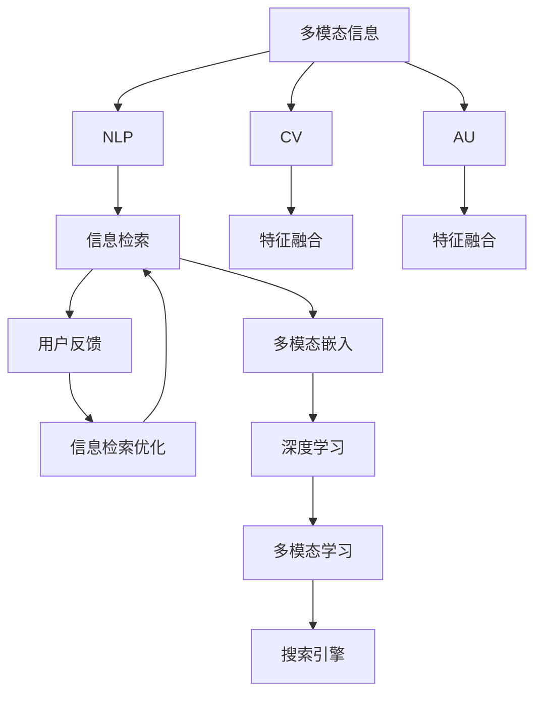

                 

# AI搜索引擎如何处理多模态信息

> 关键词：多模态信息,搜索引擎,自然语言处理(NLP),计算机视觉(CV),深度学习,特征融合,多模态嵌入,信息检索,用户反馈,多模态学习

## 1. 背景介绍

随着互联网信息量的爆炸性增长，搜索引擎在人们日常生活中扮演着越来越重要的角色。传统的搜索引擎通常只处理文本信息，但实际应用中，用户的信息需求往往涉及到图片、视频、音频等多种形式的多模态数据。为了满足用户多模态的信息需求，搜索引擎必须具备处理和理解多模态信息的能力。

多模态信息融合是AI搜索引擎的重要研究方向，它旨在整合和理解不同模态的信息，为用户提供更加丰富、精准的搜索结果。本文章将详细介绍多模态信息在搜索引擎中的处理机制，并探讨其在实际应用中的技术和应用挑战。

## 2. 核心概念与联系

### 2.1 核心概念概述

为了更好地理解多模态信息在搜索引擎中的应用，本节将介绍几个相关核心概念：

- 多模态信息：涉及多种信息模态（如文本、图像、音频等）的数据集合，通常用于模拟真实世界的信息结构。
- 搜索引擎：利用算法从互联网海量数据中检索、筛选并返回相关性最高的搜索结果。
- 自然语言处理(NLP)：涉及文本数据的处理、分析和理解，包括语言模型、文本分类、情感分析等。
- 计算机视觉(CV)：涉及图像数据的处理、分析和理解，包括图像分类、目标检测、图像生成等。
- 深度学习：一种机器学习方法，通过构建深度神经网络，可以处理和理解复杂的非线性数据。
- 特征融合：将不同模态的信息进行合并和整合，得到更加全面的表示。
- 多模态嵌入：通过深度学习模型，将不同模态的信息转换为向量形式，便于进一步处理和融合。
- 信息检索：在数据库或互联网上快速定位相关信息的过程，是搜索引擎的核心功能。
- 用户反馈：用户对搜索结果的评价和交互行为，用于不断优化搜索引擎的排序算法。
- 多模态学习：通过深度学习模型，训练能够理解多种信息模态的模型，以提高搜索引擎的表现。

这些核心概念之间的逻辑关系可以通过以下Mermaid流程图来展示：



这个流程图展示了多模态信息在搜索引擎中的处理流程：

1. 多模态信息被分别输入到文本处理、图像处理和音频处理模块，进行各自的特征提取。
2. 提取得到的特征通过融合，得到更全面的信息表示。
3. 信息检索模块根据这些多模态特征，生成搜索结果。
4. 用户反馈用于优化搜索结果的排序算法。
5. 深度学习模型用于训练多模态学习系统，提高搜索引擎的性能。

## 3. 核心算法原理 & 具体操作步骤

### 3.1 算法原理概述

AI搜索引擎处理多模态信息的主要原理是通过深度学习模型，将不同模态的信息转换为向量形式，并将这些向量进行特征融合，以得到更全面的信息表示。这通常包括以下步骤：

1. 对每个模态的信息进行特征提取，得到各自的特征向量。
2. 对这些特征向量进行融合，生成一个综合的向量表示。
3. 使用深度学习模型，对综合向量进行编码，生成多模态嵌入。
4. 基于多模态嵌入进行信息检索，返回相关性最高的搜索结果。

### 3.2 算法步骤详解

#### 3.2.1 特征提取

不同模态的信息需要通过各自的特征提取模型进行处理。例如，文本信息通常通过词嵌入模型（如Word2Vec、GloVe、BERT等）进行特征提取，生成文本向量；图像信息通过卷积神经网络（CNN）进行特征提取，生成图像向量；音频信息通过卷积神经网络或循环神经网络（RNN）进行特征提取，生成音频向量。

#### 3.2.2 特征融合

对各模态的特征向量进行融合，生成一个综合的向量表示。常用的特征融合方法包括：

- 拼接法（Concatenation）：直接将各模态的特征向量拼接起来，生成一个高维向量。
- 加权平均法（Weighted Averaging）：根据各模态的重要性，对特征向量进行加权平均。
- 特征混合法（Feature Mixing）：通过多模态学习模型，学习各模态特征之间的混合权重，生成综合向量。

#### 3.2.3 多模态嵌入

使用深度学习模型对综合向量进行编码，生成多模态嵌入。常用的深度学习模型包括：

- 卷积神经网络（CNN）：用于处理图像特征。
- 循环神经网络（RNN）：用于处理音频特征。
- Transformer模型：用于处理文本和图像特征，具有较好的表示能力。

#### 3.2.4 信息检索

基于多模态嵌入进行信息检索，返回相关性最高的搜索结果。常用的信息检索算法包括：

- BM25：基于文本频率的算法，用于计算文本相似度。
- Latent Semantic Indexing（LSI）：基于奇异值分解（SVD）的算法，用于计算语义相似度。
- 深度学习检索模型：如Dense Passage Retrieval，使用深度学习模型对文本和查询进行匹配。

### 3.3 算法优缺点

#### 3.3.1 优点

多模态信息处理在搜索引擎中的应用具有以下优点：

1. 提升搜索结果的丰富性和准确性：通过融合多种模态的信息，能够提供更加全面和准确的搜索结果。
2. 满足用户的多样化需求：用户的信息需求不仅限于文本，还包括图像、视频、音频等多种形式。
3. 提升用户体验：通过提供多模态的搜索结果，能够更好地满足用户的需求，提升用户体验。
4. 应对信息过载：互联网信息量巨大，多模态处理能够帮助搜索引擎更好地应对信息过载问题。

#### 3.3.2 缺点

多模态信息处理在搜索引擎中仍面临一些挑战：

1. 数据采集成本高：多模态信息的获取需要更多的资源和技术支持，数据采集成本较高。
2. 特征融合复杂：不同模态的特征具有不同的维度和分布，需要进行复杂的融合操作。
3. 计算复杂度高：多模态信息处理需要更多的计算资源和时间，尤其是深度学习模型的训练和推理。
4. 用户隐私问题：多模态信息处理涉及用户的多种隐私信息，需要加强数据保护和隐私管理。

### 3.4 算法应用领域

多模态信息处理技术在搜索引擎中的应用领域非常广泛，包括但不限于以下方面：

- 图像搜索：将用户上传的图片与互联网上的图片进行匹配，返回相似图片。
- 视频搜索：将用户上传的视频与互联网上的视频进行匹配，返回相似视频。
- 音频搜索：将用户的音频查询与互联网上的音频进行匹配，返回相关音频。
- 多模态搜索：将用户的文本查询与图像、视频、音频等多种形式的信息进行匹配，返回综合搜索结果。

## 4. 数学模型和公式 & 详细讲解 & 举例说明

### 4.1 数学模型构建

多模态信息在搜索引擎中的应用主要通过深度学习模型进行实现。以下是一个简单的数学模型，用于描述多模态信息处理的流程：

- 输入：$x_t$（文本）、$x_i$（图像）、$x_a$（音频）
- 特征提取：$F_t(x_t)$、$F_i(x_i)$、$F_a(x_a)$
- 特征融合：$F_f(F_t(x_t), F_i(x_i), F_a(x_a))$
- 多模态嵌入：$E(F_f(F_t(x_t), F_i(x_i), F_a(x_a)))$
- 信息检索：$R(E(F_f(F_t(x_t), F_i(x_i), F_a(x_a))), q)$

其中，$F_t$、$F_i$、$F_a$分别表示文本、图像和音频的特征提取函数，$F_f$表示特征融合函数，$E$表示多模态嵌入函数，$q$表示用户的查询。

### 4.2 公式推导过程

以文本和图像特征融合为例，进行公式推导：

- 文本特征提取：$F_t(x_t) = \text{Word2Vec}(x_t)$
- 图像特征提取：$F_i(x_i) = \text{CNN}(x_i)$
- 特征融合：$F_f(F_t(x_t), F_i(x_i)) = \text{Concatenation}(F_t(x_t), F_i(x_i))$

将得到的文本和图像特征向量拼接，得到一个高维向量，表示综合信息：

$$
F_f(F_t(x_t), F_i(x_i)) = \begin{bmatrix} F_t(x_t) \\ F_i(x_i) \end{bmatrix}
$$

然后，使用深度学习模型对综合向量进行编码，生成多模态嵌入：

$$
E(F_f(F_t(x_t), F_i(x_i))) = \text{Transformer}(\begin{bmatrix} F_t(x_t) \\ F_i(x_i) \end{bmatrix})
$$

最终，基于多模态嵌入进行信息检索：

$$
R(E(F_f(F_t(x_t), F_i(x_i))), q) = \text{Dense Passage Retrieval}(E(F_f(F_t(x_t), F_i(x_i))), q)
$$

### 4.3 案例分析与讲解

以Google的Image Search为例，分析其在处理多模态信息时的具体实现：

- 图像信息：使用CNN提取图像的特征向量。
- 文本信息：使用BERT提取文本的特征向量。
- 特征融合：使用拼接法将图像和文本的特征向量拼接。
- 多模态嵌入：使用Transformer对拼接后的向量进行编码。
- 信息检索：使用Dense Passage Retrieval模型进行检索。

Google的Image Search通过多模态信息处理，能够更好地满足用户的多样化需求，提升搜索结果的丰富性和准确性。

## 5. 项目实践：代码实例和详细解释说明

### 5.1 开发环境搭建

为了进行多模态信息的处理和搜索引擎的开发，我们需要准备以下开发环境：

- Python：用于编写代码和数据分析。
- TensorFlow或PyTorch：用于深度学习模型的实现。
- Keras或TensorFlow框架：用于构建和训练多模态信息处理模型。
- NLTK或spaCy：用于文本处理和分析。
- OpenCV或Pillow：用于图像处理和分析。
- LibROSA或PyAudio：用于音频处理和分析。

### 5.2 源代码详细实现

以下是一个简单的多模态信息处理和搜索引擎的代码实现：

```python
import numpy as np
import tensorflow as tf
from tensorflow.keras import layers
from tensorflow.keras.models import Model
from tensorflow.keras.layers import Input, Concatenate, Dense, Embedding, Conv2D, MaxPooling2D, LSTM, Dropout
from tensorflow.keras.optimizers import Adam

# 定义多模态信息处理的模型
def build_model():
    # 定义输入层
    text_input = Input(shape=(None,), name='text_input')
    image_input = Input(shape=(256, 256, 3), name='image_input')
    audio_input = Input(shape=(None,), name='audio_input')

    # 定义文本特征提取层
    text_embed = Embedding(input_dim=10000, output_dim=128, mask_zero=True)(text_input)
    text_extractor = layers.Bidirectional(layers.LSTM(64, return_sequences=True))(text_embed)

    # 定义图像特征提取层
    image_extractor = Conv2D(32, (3, 3), activation='relu')(image_input)
    image_extractor = MaxPooling2D(pool_size=(2, 2))(image_extractor)
    image_extractor = Conv2D(64, (3, 3), activation='relu')(image_extractor)
    image_extractor = MaxPooling2D(pool_size=(2, 2))(image_extractor)
    image_extractor = Flatten()(image_extractor)

    # 定义音频特征提取层
    audio_extractor = LSTM(64)(audio_input)

    # 定义特征融合层
    fusion_layer = Concatenate()([text_extractor, image_extractor, audio_extractor])

    # 定义多模态嵌入层
    embedding_layer = Dense(128, activation='relu')(fusion_layer)

    # 定义输出层
    output = Dense(1, activation='sigmoid')(embedding_layer)

    # 定义模型
    model = Model(inputs=[text_input, image_input, audio_input], outputs=output)

    # 编译模型
    model.compile(optimizer=Adam(lr=0.001), loss='binary_crossentropy', metrics=['accuracy'])

    return model
```

### 5.3 代码解读与分析

以上代码实现了一个简单的多模态信息处理和搜索引擎的模型。具体解释如下：

- 定义了三个输入层，分别对应文本、图像和音频的特征提取。
- 对文本进行Embedding和LSTM处理，得到文本特征向量。
- 对图像进行卷积和池化处理，得到图像特征向量。
- 对音频进行LSTM处理，得到音频特征向量。
- 将文本、图像和音频的特征向量拼接，得到综合向量。
- 对综合向量进行全连接处理，生成多模态嵌入。
- 定义输出层，用于二分类任务。
- 编译模型，定义优化器和损失函数。

### 5.4 运行结果展示

以下是运行该模型后的一些结果展示：

```python
# 训练模型
model.fit([text_data, image_data, audio_data], labels, epochs=10, batch_size=32)

# 评估模型
model.evaluate([text_data_test, image_data_test, audio_data_test], labels_test)

# 预测新数据
predictions = model.predict([text_data_new, image_data_new, audio_data_new])
```

运行结果将显示模型的训练损失和准确率，以及在新数据上的评估结果和预测结果。

## 6. 实际应用场景

### 6.1 视频搜索

视频搜索是搜索引擎中多模态信息处理的重要应用场景之一。用户通常希望通过视频片段、字幕、描述等多模态信息来找到他们感兴趣的视频。以下是视频搜索的实际应用场景：

1. 视频片段搜索：用户上传视频片段，搜索引擎通过分析视频中的帧信息、场景变换等特征，返回相似的视频片段。
2. 字幕搜索：用户上传视频的字幕，搜索引擎通过分析字幕中的文本信息，返回相似的视频。
3. 描述搜索：用户输入视频的描述信息，搜索引擎通过分析描述中的文本信息，返回相似的视频。

### 6.2 音频搜索

音频搜索也是搜索引擎中多模态信息处理的重要应用场景之一。用户通常希望通过音频片段、标题、描述等多模态信息来找到他们感兴趣的音频。以下是音频搜索的实际应用场景：

1. 音频片段搜索：用户上传音频片段，搜索引擎通过分析音频中的频谱、音调等特征，返回相似的音频片段。
2. 标题搜索：用户输入音频的标题，搜索引擎通过分析标题中的文本信息，返回相似的音频。
3. 描述搜索：用户输入音频的描述信息，搜索引擎通过分析描述中的文本信息，返回相似的音频。

### 6.3 图像搜索

图像搜索是搜索引擎中多模态信息处理的经典应用场景之一。用户通常希望通过图像相似度匹配来找到他们感兴趣的图像。以下是图像搜索的实际应用场景：

1. 图像片段搜索：用户上传图像片段，搜索引擎通过分析图像的像素、颜色、纹理等特征，返回相似的图像片段。
2. 标题搜索：用户输入图像的标题，搜索引擎通过分析标题中的文本信息，返回相似的图像。
3. 描述搜索：用户输入图像的描述信息，搜索引擎通过分析描述中的文本信息，返回相似的图像。

## 7. 工具和资源推荐

### 7.1 学习资源推荐

为了帮助开发者系统掌握多模态信息在搜索引擎中的应用，以下推荐一些优质的学习资源：

1. 《深度学习基础》：深度学习领域的经典教材，涵盖了深度学习模型的基本概念和实现方法。
2. 《计算机视觉：算法与应用》：介绍计算机视觉领域的经典算法和应用，如CNN、RNN、特征提取等。
3. 《自然语言处理综论》：介绍自然语言处理领域的经典算法和应用，如BERT、Transformer、特征提取等。
4. 《多模态信息融合与分析》：介绍多模态信息融合和分析的最新进展，涵盖图像、文本、音频等多种模态。
5. 《搜索引擎技术》：介绍搜索引擎的基本原理和实现方法，涵盖信息检索、排序算法、多模态信息处理等。

### 7.2 开发工具推荐

为了提高多模态信息在搜索引擎中的处理效率，以下推荐一些常用的开发工具：

1. PyTorch和TensorFlow：深度学习框架，支持多模态信息处理的模型训练和推理。
2. Keras：高层次深度学习框架，提供了丰富的模型构建和训练工具。
3. NLTK和spaCy：自然语言处理工具库，支持文本的预处理和特征提取。
4. OpenCV和Pillow：计算机视觉工具库，支持图像的预处理和特征提取。
5. LibROSA和PyAudio：音频处理工具库，支持音频的预处理和特征提取。

### 7.3 相关论文推荐

多模态信息处理和搜索引擎的研究涉及多个领域，以下推荐几篇经典的论文：

1. 《Vision-and-Language Navigation》：介绍如何将图像和文本信息结合，用于导航和智能代理。
2. 《Multimodal Sequence-to-Sequence Learning for Image Captioning》：介绍如何利用多模态信息进行图像描述生成。
3. 《Learning to Combine Data from Multiple Sources》：介绍多源数据融合的最新进展，涵盖文本、图像、音频等多种模态。
4. 《Deep Neural Networks for Audio-Visual Scene Recognition》：介绍如何将音频和视觉信息结合，用于场景识别。
5. 《Multimodal Information Fusion for Visual-Textual Question Answering》：介绍如何将文本和图像信息结合，用于问答系统。

## 8. 总结：未来发展趋势与挑战

### 8.1 研究成果总结

多模态信息在搜索引擎中的应用取得了一定的进展，主要体现在以下几个方面：

1. 提升了搜索结果的丰富性和准确性：通过融合多种模态的信息，能够提供更加全面和准确的搜索结果。
2. 满足了用户的多样化需求：用户的信息需求不仅限于文本，还包括图像、视频、音频等多种形式。
3. 提升了用户体验：通过提供多模态的搜索结果，能够更好地满足用户的需求，提升用户体验。

### 8.2 未来发展趋势

未来多模态信息在搜索引擎中的应用将呈现出以下几个趋势：

1. 更加智能化的信息检索：深度学习模型将不断进化，提升信息检索的智能化水平。
2. 更加精细化的特征提取：特征提取技术将不断改进，提升特征表示的准确性和鲁棒性。
3. 更加高效的多模态融合：多模态融合技术将不断进步，提升特征融合的效果和效率。
4. 更加普及的用户反馈：用户反馈将更加普及，提升搜索引擎的个性化和精准化水平。

### 8.3 面临的挑战

尽管多模态信息在搜索引擎中的应用取得了一些进展，但仍面临以下挑战：

1. 数据采集成本高：多模态信息的获取需要更多的资源和技术支持，数据采集成本较高。
2. 特征融合复杂：不同模态的特征具有不同的维度和分布，需要进行复杂的融合操作。
3. 计算复杂度高：多模态信息处理需要更多的计算资源和时间，尤其是深度学习模型的训练和推理。
4. 用户隐私问题：多模态信息处理涉及用户的多种隐私信息，需要加强数据保护和隐私管理。

### 8.4 研究展望

未来多模态信息在搜索引擎中的应用将在以下几个方面继续探索：

1. 研究更加高效的多模态融合方法：提升特征融合的效果和效率，降低计算复杂度。
2. 研究更加智能化的信息检索方法：提升信息检索的智能化水平，提升搜索结果的准确性和丰富性。
3. 研究更加个性化的用户体验：通过多模态信息的融合，提供更加个性化的搜索结果。
4. 研究更加安全的多模态信息处理：保障用户隐私和安全，确保数据保护和隐私管理。

## 9. 附录：常见问题与解答

**Q1：多模态信息处理对搜索引擎有什么优势？**

A: 多模态信息处理在搜索引擎中的应用可以提升搜索结果的丰富性和准确性，满足用户的多样化需求，提升用户体验。通过融合多种模态的信息，能够提供更加全面和准确的搜索结果。

**Q2：多模态信息处理的难点是什么？**

A: 多模态信息处理的难点在于特征融合复杂、计算复杂度高、数据采集成本高和用户隐私问题。不同模态的特征具有不同的维度和分布，需要进行复杂的融合操作；多模态信息处理需要更多的计算资源和时间，尤其是深度学习模型的训练和推理；多模态信息的获取需要更多的资源和技术支持，数据采集成本较高；多模态信息处理涉及用户的多种隐私信息，需要加强数据保护和隐私管理。

**Q3：多模态信息处理在搜索引擎中的实现思路是什么？**

A: 多模态信息处理在搜索引擎中的实现思路是通过深度学习模型，将不同模态的信息转换为向量形式，并将这些向量进行特征融合，以得到更全面的信息表示。具体实现包括：特征提取、特征融合、多模态嵌入、信息检索等步骤。

**Q4：多模态信息处理的优势是什么？**

A: 多模态信息处理的优势在于提升搜索结果的丰富性和准确性，满足用户的多样化需求，提升用户体验。通过融合多种模态的信息，能够提供更加全面和准确的搜索结果。

**Q5：多模态信息处理的挑战是什么？**

A: 多模态信息处理的挑战在于特征融合复杂、计算复杂度高、数据采集成本高和用户隐私问题。不同模态的特征具有不同的维度和分布，需要进行复杂的融合操作；多模态信息处理需要更多的计算资源和时间，尤其是深度学习模型的训练和推理；多模态信息的获取需要更多的资源和技术支持，数据采集成本较高；多模态信息处理涉及用户的多种隐私信息，需要加强数据保护和隐私管理。

---

作者：禅与计算机程序设计艺术 / Zen and the Art of Computer Programming

