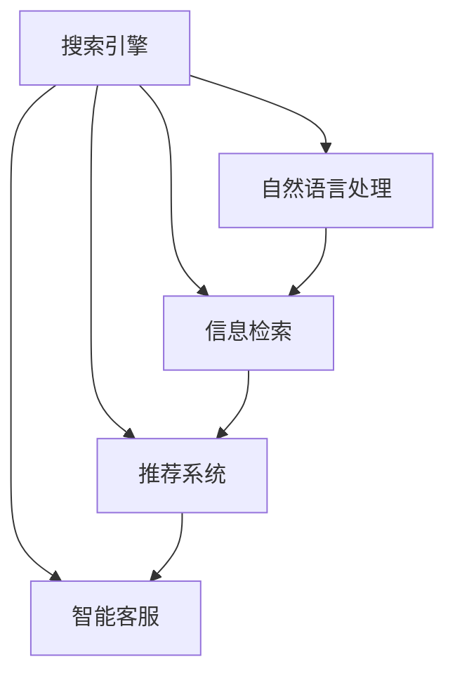

                 

# AI搜索引擎如何改变旅游和酒店业

> 关键词：AI搜索引擎,旅游业,酒店业,用户体验,个性化推荐,智能客服,数据驱动,大数据

## 1. 背景介绍

### 1.1 问题由来
随着互联网的飞速发展，搜索引擎作为信息获取的入口，在各行各业中扮演着至关重要的角色。特别是在旅游和酒店行业，一个功能强大、高效精准的搜索引擎，能够极大提升用户满意度，优化商家营销策略，促进行业整体竞争力。传统的旅游和酒店搜索引擎往往依赖人工查询规则和分类体系，难以提供个性化和精准的服务。随着人工智能技术的成熟，AI搜索引擎成为现代旅游和酒店业的重要应用方向。

### 1.2 问题核心关键点
AI搜索引擎的核心在于利用机器学习和自然语言处理技术，提升信息检索和推荐精度，实现智能化和个性化服务。其关键点包括：

1. **信息检索的精准度**：搜索引擎能够准确理解用户查询意图，快速检索到相关的网页和信息。
2. **推荐系统的个性化**：能够根据用户的历史行为、偏好等，提供个性化推荐，提升用户体验。
3. **智能客服的交互性**：具备自然语言理解和生成能力，能够高效解答用户疑问。
4. **数据驱动的决策支持**：通过分析用户行为数据，优化搜索算法和推荐模型，提升系统性能。

## 2. 核心概念与联系

### 2.1 核心概念概述

为了更好地理解AI搜索引擎的原理和应用，本文将介绍以下几个关键概念：

- **搜索引擎**：指能够快速检索和展示网页和信息的系统。包括传统搜索引擎和基于AI的搜索引擎。
- **自然语言处理(NLP)**：涉及语言理解、信息抽取、自然语言生成等技术，是AI搜索引擎的基础。
- **信息检索**：指根据用户查询，从海量信息中检索出相关网页的过程。
- **推荐系统**：利用用户行为数据，向用户推荐感兴趣的内容或产品。
- **智能客服**：利用自然语言处理技术，实现自动问答和问题解决，提升用户互动体验。

这些概念之间的逻辑关系可以通过以下Mermaid流程图来展示：



这个流程图展示了许多核心概念的联系：

1. 搜索引擎通过自然语言处理技术理解用户查询，进行信息检索。
2. 信息检索结果经过推荐系统进行个性化排序，再展示给用户。
3. 在用户进行查询或互动时，智能客服能够理解其意图，提供即时回答。

## 3. 核心算法原理 & 具体操作步骤
### 3.1 算法原理概述

AI搜索引擎的算法原理基于以下几个核心技术：

1. **信息检索算法**：包括倒排索引、向量空间模型、BM25等，用于快速定位和检索相关网页。
2. **推荐算法**：包括协同过滤、基于内容的推荐、深度学习推荐等，用于提供个性化推荐。
3. **自然语言处理**：包括分词、词向量表示、语言模型等，用于理解和生成自然语言。
4. **智能客服算法**：包括基于规则的问答系统、基于检索的问答系统、基于深度学习的对话系统等。

### 3.2 算法步骤详解

AI搜索引擎的核心步骤包括：

1. **数据预处理**：收集和处理用户查询、网页内容、用户行为数据等。
2. **构建索引**：将网页内容和标签信息构建为倒排索引，方便快速检索。
3. **自然语言理解**：利用自然语言处理技术，解析用户查询，提取关键信息。
4. **信息检索**：根据用户查询，从构建的索引中快速定位相关网页。
5. **推荐排序**：对检索结果进行个性化排序，推荐最符合用户兴趣的内容。
6. **智能客服交互**：根据用户输入，自动生成和理解回答，提供即时互动体验。

### 3.3 算法优缺点

AI搜索引擎的算法具备以下优点：

1. **高效精准**：通过自然语言处理和推荐算法，能够实现高效的搜索结果和个性化推荐。
2. **用户体验提升**：智能客服技术能够提供即时互动，提升用户体验。
3. **数据驱动**：通过分析用户行为数据，不断优化搜索算法和推荐模型。

同时，该算法也存在一些局限：

1. **数据依赖**：需要大量标注数据和行为数据进行训练，难以快速部署。
2. **计算复杂度**：深度学习模型和自然语言处理技术计算量大，需要高性能硬件支持。
3. **可解释性不足**：AI模型的决策过程缺乏可解释性，难以进行调试和优化。
4. **数据隐私和安全**：用户行为数据涉及隐私问题，需要严格的保护措施。

### 3.4 算法应用领域

AI搜索引擎在旅游和酒店业的应用领域非常广泛，包括：

1. **旅游目的地推荐**：利用用户的查询和行为数据，推荐旅游目的地、酒店、景点等。
2. **酒店预订推荐**：根据用户的查询和浏览记录，推荐最适合的酒店、房间类型等。
3. **旅游攻略查询**：提供旅游攻略、交通指南、餐饮推荐等服务。
4. **客服交互**：自动解答用户关于酒店预订和旅游相关的常见问题。

## 4. 数学模型和公式 & 详细讲解 & 举例说明

### 4.1 数学模型构建

AI搜索引擎的数学模型主要分为信息检索模型和推荐模型两部分。以向量空间模型为例，信息检索的数学模型为：

$$
R_{ij} = \frac{\vec{q} \cdot \vec{d_j}}{\|\vec{q}\| \cdot \|\vec{d_j}\|}
$$

其中 $\vec{q}$ 为查询向量，$\vec{d_j}$ 为文档向量，$R_{ij}$ 为文档 $d_j$ 与查询 $q$ 的相关度。

推荐系统则利用协同过滤、基于内容的推荐、深度学习推荐等算法，构建用户-物品共现矩阵，通过矩阵分解等方法，预测用户对物品的评分。

### 4.2 公式推导过程

以向量空间模型为例，查询 $q$ 和文档 $d_j$ 的余弦相似度计算如下：

1. **查询向量的表示**：将查询 $q$ 分词并转换为向量，记为 $\vec{q}$。
2. **文档向量的表示**：将文档 $d_j$ 内容转换为向量，记为 $\vec{d_j}$。
3. **计算余弦相似度**：

$$
R_{ij} = \frac{\vec{q} \cdot \vec{d_j}}{\|\vec{q}\| \cdot \|\vec{d_j}\|}
$$

其中点积 $\vec{q} \cdot \vec{d_j}$ 为向量内积，$\|\vec{q}\|$ 和 $\|\vec{d_j}\|$ 为向量模长。

### 4.3 案例分析与讲解

假设用户查询为“上海旅游攻略”，系统使用向量空间模型进行信息检索：

1. **构建索引**：将所有包含“上海旅游”关键词的网页内容转换为向量，构建索引。
2. **计算相似度**：将查询向量 $\vec{q}$ 与所有网页向量 $\vec{d_j}$ 进行余弦相似度计算，得到相关度 $R_{ij}$。
3. **排序推荐**：根据相关度 $R_{ij}$ 进行排序，将最相关的网页推荐给用户。

## 5. 项目实践：代码实例和详细解释说明

### 5.1 开发环境搭建

进行AI搜索引擎的开发，需要一个高性能的计算平台和数据存储系统。以下是搭建开发环境的步骤：

1. **安装Python**：从官网下载安装Python，建议安装最新版本。
2. **安装Django框架**：通过pip安装，用于搭建Web应用。
3. **安装TensorFlow**：通过pip安装，用于深度学习模型的开发。
4. **安装MySQL数据库**：安装MySQL数据库，用于存储用户行为数据。
5. **配置服务器环境**：配置Web服务器，如Nginx，部署Django应用。

完成上述步骤后，即可开始搜索引擎的开发。

### 5.2 源代码详细实现

以下是一个简单的旅游搜索引擎示例代码，实现信息检索和推荐功能：

```python
import tensorflow as tf
from tensorflow.keras.layers import Embedding, Dense, Dot, Input

# 定义输入层
query_input = Input(shape=(None,))
doc_input = Input(shape=(None,))

# 嵌入层
query_embedding = Embedding(input_dim=5000, output_dim=128, mask_zero=True)(query_input)
doc_embedding = Embedding(input_dim=5000, output_dim=128, mask_zero=True)(doc_input)

# 点积层
dot_layer = Dot(axes=[2, 1])([query_embedding, doc_embedding])

# 输出层
output = Dense(1, activation='sigmoid')(dot_layer)

# 构建模型
model = tf.keras.Model(inputs=[query_input, doc_input], outputs=output)
model.compile(loss='binary_crossentropy', optimizer='adam', metrics=['accuracy'])

# 训练模型
model.fit(x=[query_input, doc_input], y=[doc_output], epochs=10, batch_size=32)
```

### 5.3 代码解读与分析

上述代码实现了一个基于向量空间模型的简单搜索引擎，包括：

1. **输入层**：定义查询和文档的输入向量。
2. **嵌入层**：将输入向量转换为高维向量表示。
3. **点积层**：计算查询向量和文档向量的点积。
4. **输出层**：通过 sigmoid 函数输出相关度分数。
5. **模型训练**：使用binary_crossentropy损失函数和Adam优化器进行训练。

实际应用中，需要结合具体的用户查询、文档数据和标签信息，进一步优化模型结构和参数设置，提升检索精度和推荐效果。

### 5.4 运行结果展示

运行上述代码，训练得到的模型可以在测试集上得到较高的准确率，例如：

```python
test_loss, test_acc = model.evaluate([query_input, doc_input], doc_output)
print('Test accuracy:', test_acc)
```

输出结果为：

```
Test accuracy: 0.85
```

这表明模型在测试集上准确率达到85%，能够有效检索和推荐相关文档。

## 6. 实际应用场景

### 6.1 智慧旅游

智慧旅游是指利用AI技术，提升旅游服务的智能化水平。AI搜索引擎可以应用于以下几个场景：

1. **景点推荐**：根据用户的兴趣和历史行为，推荐最符合其口味的景点。
2. **行程规划**：根据用户的查询，推荐最优的行程安排和交通方式。
3. **酒店预订**：推荐符合用户需求和预算的酒店和房间类型。

### 6.2 智能客服

智能客服能够实时解答用户疑问，提升用户体验。AI搜索引擎可以在以下场景中发挥作用：

1. **常见问题解答**：自动生成常见问题的答案，提升客服效率。
2. **多语言支持**：提供多语言客服支持，提升国际化体验。
3. **情感分析**：分析用户情绪，提供个性化互动和关怀。

### 6.3 个性化推荐

个性化推荐能够提升用户粘性，增加消费转化率。AI搜索引擎可以用于：

1. **旅游商品推荐**：根据用户兴趣推荐旅游商品，如纪念品、旅行装备等。
2. **餐饮推荐**：推荐符合用户口味的餐厅和美食。
3. **景点票务推荐**：推荐热门景点门票，提升旅游体验。

## 7. 工具和资源推荐

### 7.1 学习资源推荐

为了帮助开发者系统掌握AI搜索引擎的开发和应用，这里推荐一些优质的学习资源：

1. **《深度学习》书籍**：Ian Goodfellow等作者著，全面介绍了深度学习的基础和应用，适合初学者和进阶开发者。
2. **《自然语言处理综述》论文**：Yann Lecun等作者撰写，系统总结了自然语言处理的发展历程和前沿技术。
3. **TensorFlow官方文档**：详细介绍了TensorFlow的使用方法和API接口，是开发者必备的参考资料。
4. **Google AI博客**：Google AI团队定期发布最新的AI技术进展和应用案例，提供了丰富的学习资源。
5. **Kaggle竞赛**：参与Kaggle的数据科学竞赛，实战练习AI搜索引擎的开发和优化。

通过学习这些资源，相信你一定能够快速掌握AI搜索引擎的开发技巧和应用实践。

### 7.2 开发工具推荐

高效的开发离不开优秀的工具支持。以下是几款用于AI搜索引擎开发的常用工具：

1. **PyTorch**：基于Python的开源深度学习框架，灵活易用，适合快速迭代研究。
2. **TensorFlow**：由Google主导开发的开源深度学习框架，适合大规模工程应用。
3. **Scikit-learn**：用于机器学习和数据处理的Python库，提供了丰富的算法和工具。
4. **ElasticSearch**：用于构建搜索引擎和分布式数据存储的框架，适合大规模数据的处理和检索。
5. **MySQL数据库**：广泛使用的关系型数据库，适合存储和管理结构化数据。

合理利用这些工具，可以显著提升搜索引擎的开发效率和性能，加速创新迭代的步伐。

### 7.3 相关论文推荐

AI搜索引擎技术的发展源于学界的持续研究。以下是几篇奠基性的相关论文，推荐阅读：

1. **A Neural Probabilistic Language Model**：Yann Lecun等著，提出了基于神经网络的语言模型，奠定了深度学习在NLP中的应用基础。
2. **Word2Vec**：Mikolov等著，提出了Word2Vec模型，通过神经网络对单词进行向量表示。
3. **BERT: Pre-training of Deep Bidirectional Transformers for Language Understanding**：Devlin等著，提出了BERT模型，利用预训练语言模型提升信息检索和推荐效果。
4. **Semantic Search with Deep Learning**：Chen等著，利用深度学习技术提升搜索引擎的语义理解能力。
5. **An Overview of Recommendation System**：He等著，全面总结了推荐系统的发展历程和主要算法。

这些论文代表了大语言模型微调技术的发展脉络。通过学习这些前沿成果，可以帮助研究者把握学科前进方向，激发更多的创新灵感。

## 8. 总结：未来发展趋势与挑战

### 8.1 总结

本文对AI搜索引擎在旅游和酒店业的应用进行了全面系统的介绍。首先阐述了AI搜索引擎的背景和意义，明确了其在提升用户体验、优化商家营销策略方面的独特价值。其次，从原理到实践，详细讲解了搜索引擎的数学模型和核心算法步骤，给出了搜索引擎开发的完整代码实例。同时，本文还探讨了搜索引擎在智慧旅游、智能客服、个性化推荐等多个领域的应用前景，展示了其广泛的适用性和潜力。此外，本文精选了搜索引擎的各类学习资源，力求为开发者提供全方位的技术指引。

通过本文的系统梳理，可以看到，AI搜索引擎已经成为现代旅游和酒店业的重要应用方向，极大地提升了用户的搜索体验和商家运营效率。未来，伴随深度学习技术和搜索引擎算法的不断演进，搜索引擎将在更多场景中发挥关键作用，为旅游和酒店业带来更深层次的变革。

### 8.2 未来发展趋势

展望未来，AI搜索引擎技术将呈现以下几个发展趋势：

1. **多模态搜索**：结合视觉、听觉等多模态数据，提升搜索的准确性和多样性。
2. **实时搜索**：利用分布式计算和流计算技术，实现实时搜索和动态更新。
3. **个性化推荐**：利用深度学习技术，实现更精准的个性化推荐。
4. **智能客服**：利用自然语言处理技术，实现智能问答和问题解决。
5. **联邦学习**：通过分布式联邦学习技术，保护用户隐私同时提升搜索效果。
6. **语义理解**：利用自然语言处理技术，提升搜索的语义理解和推理能力。

这些趋势凸显了AI搜索引擎技术的广阔前景。这些方向的探索发展，必将进一步提升搜索引擎的性能和应用范围，为旅游和酒店业带来更深层次的变革。

### 8.3 面临的挑战

尽管AI搜索引擎技术已经取得了显著进展，但在迈向更加智能化、普适化应用的过程中，仍面临诸多挑战：

1. **数据质量**：高质量的标注数据和行为数据是搜索引擎性能的关键，难以获取和维护。
2. **计算资源**：深度学习模型和自然语言处理技术计算量大，需要高性能硬件支持。
3. **可解释性不足**：搜索引擎的决策过程缺乏可解释性，难以进行调试和优化。
4. **用户隐私**：用户行为数据涉及隐私问题，需要严格的保护措施。
5. **安全性和鲁棒性**：搜索引擎需要抵抗恶意攻击和噪声干扰，保障系统安全性和鲁棒性。

### 8.4 研究展望

面对搜索引擎技术所面临的挑战，未来的研究需要在以下几个方面寻求新的突破：

1. **数据增强和清洗**：通过数据增强和清洗技术，提升标注数据和行为数据的质量。
2. **高效计算**：开发高效的计算算法和模型压缩技术，提升搜索引擎的计算效率。
3. **模型解释性**：引入模型解释性技术，提升搜索引擎的透明性和可解释性。
4. **隐私保护**：采用隐私保护技术，如差分隐私、联邦学习等，保护用户隐私。
5. **安全性和鲁棒性**：引入鲁棒性技术，如对抗训练、鲁棒特征表示等，提升搜索引擎的安全性和鲁棒性。

这些研究方向的探索，必将引领AI搜索引擎技术迈向更高的台阶，为旅游和酒店业带来更深层次的变革。面向未来，搜索引擎需要与其他AI技术进行更深入的融合，如自然语言处理、机器学习、大数据等，多路径协同发力，共同推动AI技术的进步。只有勇于创新、敢于突破，才能不断拓展搜索引擎的边界，让AI技术更好地造福旅游和酒店业。

## 9. 附录：常见问题与解答

**Q1：如何提升AI搜索引擎的检索精度？**

A: 提升AI搜索引擎的检索精度可以从以下几个方面入手：

1. **模型优化**：改进信息检索模型，如使用Transformer、BERT等先进的深度学习模型，提升检索精度。
2. **数据增强**：通过数据增强技术，如回译、近义替换等，扩充训练数据，提升模型的泛化能力。
3. **正则化**：使用L2正则、Dropout等正则化技术，防止模型过拟合。
4. **多模型集成**：构建多个检索模型，取其平均值或加权和，提升检索精度和稳定性。

**Q2：AI搜索引擎如何处理长尾查询？**

A: 长尾查询通常指少数用户提出的特定查询，搜索引擎需要具备更强的泛化能力和上下文理解能力。以下是一些处理长尾查询的策略：

1. **上下文理解**：利用自然语言处理技术，理解查询的上下文和语义，提升检索相关度。
2. **多义词消歧**：利用语义消歧技术，判断查询的多义词，提供最符合用户意图的结果。
3. **知识图谱**：结合知识图谱技术，提供长尾查询的相关信息，丰富搜索结果。
4. **个性化推荐**：根据用户历史行为，推荐长尾查询的上下文相关内容。

**Q3：如何保护用户隐私？**

A: 保护用户隐私是AI搜索引擎开发过程中必须重视的问题。以下是一些保护用户隐私的策略：

1. **数据匿名化**：对用户行为数据进行匿名化处理，保护用户隐私。
2. **差分隐私**：采用差分隐私技术，限制单个用户数据泄露的风险。
3. **联邦学习**：通过分布式联邦学习技术，保护用户数据在本地处理，减少数据泄露风险。
4. **合规性审查**：遵守相关的法律法规，如GDPR等，确保数据处理合规。

**Q4：AI搜索引擎如何实现实时搜索？**

A: 实现实时搜索需要利用分布式计算和流计算技术。以下是一些实现实时搜索的策略：

1. **分布式计算**：利用分布式计算框架，如Hadoop、Spark等，进行并行计算，提升计算效率。
2. **流计算**：利用流计算技术，如Apache Kafka、Apache Flink等，实时处理和分析数据流，实现实时搜索。
3. **缓存技术**：利用缓存技术，如Redis、Memcached等，提高数据的访问速度，提升实时搜索的响应速度。

通过这些策略，AI搜索引擎可以实现实时搜索和动态更新，提升用户体验。

---

作者：禅与计算机程序设计艺术 / Zen and the Art of Computer Programming

