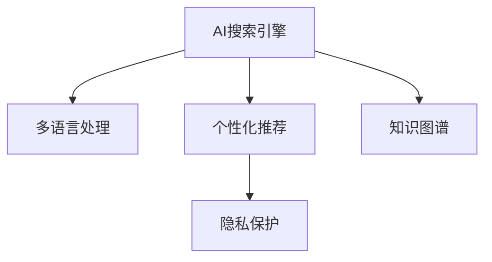

                 

# AI搜索引擎的全球化挑战

> 关键词：AI搜索引擎,全球化,搜索引擎,自然语言处理,用户交互,个性化推荐,多语言支持,隐私保护,知识图谱,智能算法

## 1. 背景介绍

### 1.1 问题由来
随着互联网的全球化和普及，搜索引擎作为信息获取的重要工具，在各个国家和地区都有着广泛的应用。然而，由于各地区的文化差异、语言习惯、信息环境等因素不同，单一的搜索引擎模型很难满足全球化用户的需求。为应对这一挑战，全球化搜索引擎应运而生。

### 1.2 问题核心关键点
全球化搜索引擎的核心在于能够兼容多种语言和地区文化，同时提供个性化的搜索结果和良好的用户体验。其中，主要的技术难点包括多语言处理、个性化推荐、隐私保护和搜索结果质量等。本文将聚焦于这些关键问题，全面阐述全球化搜索引擎的技术实现和挑战。

### 1.3 问题研究意义
构建全球化搜索引擎不仅有助于解决地区间的信息鸿沟，还能提升搜索体验，促进全球知识共享和创新交流。在技术层面，全球化搜索引擎的研究和实践能够推动NLP、数据挖掘、用户行为分析等多领域的融合发展，为全球互联网用户提供更高效、全面的信息服务。

## 2. 核心概念与联系

### 2.1 核心概念概述

为更好地理解全球化搜索引擎的核心技术，本节将介绍几个关键概念：

- **AI搜索引擎**：利用人工智能技术，如自然语言处理、机器学习、知识图谱等，提升搜索结果的相关性和个性化程度。
- **全球化**：搜索引擎能够跨越语言和文化障碍，兼容多种语言和地区文化，提供全球化的信息服务。
- **多语言处理**：搜索引擎需要支持多语言输入和输出，包括语言识别、分词、翻译、情感分析等。
- **个性化推荐**：根据用户的搜索历史、兴趣和行为数据，提供定制化的搜索结果和广告推荐。
- **隐私保护**：在全球化搜索引擎中，用户的数据可能涉及多国法律，因此需要确保数据隐私和安全。
- **知识图谱**：利用图结构来表示实体和概念之间的关系，辅助搜索结果的语义理解和关联推荐。

这些核心概念之间的逻辑关系可以通过以下Mermaid流程图来展示：



这个流程图展示了大规模搜索引擎的核心概念及其之间的关系：

1. AI搜索引擎通过多语言处理、个性化推荐、隐私保护、知识图谱等技术，实现了跨语言的语义理解和关联推荐，提升了搜索体验和效果。
2. 多语言处理使搜索引擎能够处理多种语言输入，提供跨语言的搜索结果。
3. 个性化推荐使搜索引擎能够根据用户的行为数据，提供量身定制的搜索结果和广告。
4. 隐私保护确保了用户数据在全球化环境下的安全。
5. 知识图谱帮助搜索引擎理解实体和概念之间的关系，提供了更全面的搜索结果。

这些核心概念共同构成了全球化搜索引擎的技术架构，使其能够在全球范围内提供高效、个性化的信息服务。通过理解这些概念，我们可以更好地把握全球化搜索引擎的技术实现和挑战。

## 3. 核心算法原理 & 具体操作步骤
### 3.1 算法原理概述

全球化搜索引擎的核心算法原理主要包括以下几个方面：

1. **多语言处理**：通过多语言模型和机器翻译技术，实现对不同语言的自然语言理解和处理。
2. **个性化推荐**：基于用户的搜索历史和行为数据，使用协同过滤、深度学习等技术进行推荐。
3. **隐私保护**：采用加密技术、差分隐私等手段，保护用户数据隐私，避免泄露和滥用。
4. **知识图谱**：构建和维护大规模的知识图谱，辅助搜索结果的语义理解和关联推荐。

### 3.2 算法步骤详解

全球化搜索引擎的算法步骤通常包括以下几个关键环节：

**Step 1: 数据收集与预处理**
- 收集各地区的历史搜索数据、用户行为数据等。
- 对数据进行清洗、归一化、去噪等预处理操作，去除无效数据和异常值。

**Step 2: 多语言处理**
- 对不同语言进行分词、词性标注、命名实体识别等预处理操作。
- 使用多语言模型进行语言翻译和情感分析，提取多语言文本的语义信息。

**Step 3: 个性化推荐**
- 利用协同过滤、深度学习等技术，根据用户的历史行为和兴趣标签，生成个性化推荐。
- 引入知识图谱进行关联推荐，提升搜索结果的相关性。

**Step 4: 隐私保护**
- 对用户数据进行加密存储，采用差分隐私等技术保护用户隐私。
- 设计隐私计算框架，保障数据在计算过程中不被泄露。

**Step 5: 搜索引擎优化**
- 通过调整算法参数、改进数据模型、优化搜索排序算法，提升搜索结果的相关性和召回率。
- 持续收集用户反馈，进行A/B测试，优化搜索结果质量。

### 3.3 算法优缺点

全球化搜索引擎的算法主要优点包括：
1. 能够支持多语言查询，为用户提供全球化的信息服务。
2. 通过个性化推荐，提升用户搜索体验和满意度。
3. 采用隐私保护技术，保障用户数据安全。
4. 引入知识图谱，辅助搜索结果的语义理解和关联推荐。

同时，这些算法也存在一定的局限性：
1. 处理多语言和跨文化数据时，可能存在语义歧义和翻译误差。
2. 个性化推荐可能受限于用户数据质量和数量，导致推荐效果不足。
3. 隐私保护技术可能在隐私泄露和数据可用性之间难以平衡。
4. 知识图谱的构建和维护成本高，对搜索结果的提升效果可能不如预期。

尽管存在这些局限性，但就目前而言，全球化搜索引擎的算法仍是大规模信息服务的重要手段。未来相关研究的方向在于如何进一步提升多语言处理的精度和效率，改进个性化推荐算法，优化隐私保护机制，以及降低知识图谱的构建和维护成本。

### 3.4 算法应用领域

全球化搜索引擎的应用领域广泛，涵盖以下几个方面：

- **电子商务**：提供基于用户兴趣的个性化产品推荐，提升电商平台的转化率和用户满意度。
- **社交媒体**：根据用户的搜索历史和兴趣，推送相关内容和广告，提升用户黏性。
- **新闻资讯**：根据用户的地理位置和语言偏好，提供定制化的新闻内容，提升用户阅读体验。
- **旅游和出行**：提供基于用户偏好和地理位置的旅游和出行建议，提升用户的旅行体验。
- **健康和医疗**：根据用户的搜索历史和健康数据，提供个性化的健康建议和医疗信息。

除了这些主流应用外，全球化搜索引擎还在智能客服、企业信息管理等多个领域发挥着重要作用。随着技术的不断发展，预计未来会有更多基于搜索引擎的创新应用涌现。

## 4. 数学模型和公式 & 详细讲解 & 举例说明
### 4.1 数学模型构建

全球化搜索引擎的数学模型构建涉及多个子模型，以下对其中的关键模型进行详细阐述：

**多语言模型**：
- 假设多语言模型为 $M_{\theta}$，其中 $\theta$ 为模型的参数。
- 使用自监督学习任务，如语言建模、掩码语言模型，在无标签的多语言语料上进行预训练。
- 多语言模型的预训练公式为：
  $$
  \max_{\theta} \mathcal{L}_{\text{pre-training}}(M_{\theta}, D_{\text{pre-training}})
  $$
  其中 $D_{\text{pre-training}}$ 为无标签的多语言语料库。

**协同过滤推荐模型**：
- 假设用户向量为 $u_i$，物品向量为 $v_j$，用户与物品的评分矩阵为 $R$。
- 协同过滤模型使用用户-物品的评分数据，通过矩阵分解或奇异值分解，学习用户和物品的隐向量。
- 推荐公式为：
  $$
  \hat{y}_{ij} = \hat{u}_i^T V_{ij} \hat{v}_j
  $$
  其中 $V_{ij}$ 为物品向量，$\hat{y}_{ij}$ 为预测评分。

**知识图谱**：
- 知识图谱由实体、关系和属性组成，表示实体之间的语义关系。
- 假设知识图谱中的实体为 $e_i$，关系为 $r_j$，属性为 $a_k$。
- 使用图神经网络(Graph Neural Networks, GNN)对知识图谱进行嵌入学习，得到实体的语义表示 $E$。
- 推荐公式为：
  $$
  \hat{y}_{ij} = \text{softmax}(\hat{E}_i^T \hat{E}_j)
  $$
  其中 $\hat{E}_i$ 和 $\hat{E}_j$ 为实体的语义表示。

### 4.2 公式推导过程

以下我们以多语言模型和协同过滤推荐模型为例，推导其中的关键公式。

**多语言模型公式推导**：
假设多语言模型为 $M_{\theta}$，使用语言建模任务进行预训练。给定训练集 $D_{\text{pre-training}}=\{x_i\}_{i=1}^N$，其中 $x_i$ 为多语言文本。
- 定义模型在文本 $x$ 上的概率分布为 $p_{\theta}(x)$。
- 预训练的目标是最小化负对数似然：
  $$
  \min_{\theta} -\frac{1}{N} \sum_{i=1}^N \log p_{\theta}(x_i)
  $$
  通过反向传播算法计算梯度：
  $$
  \nabla_{\theta}\mathcal{L}_{\text{pre-training}} = -\frac{1}{N} \sum_{i=1}^N \nabla_{\theta}\log p_{\theta}(x_i)
  $$

**协同过滤推荐模型公式推导**：
假设用户向量为 $u_i$，物品向量为 $v_j$，评分矩阵为 $R$。
- 定义用户向量 $u_i$ 和物品向量 $v_j$ 的内积为 $u_i^T v_j$。
- 协同过滤推荐的目标是最小化预测评分与真实评分之间的均方误差：
  $$
  \min_{u,v} \frac{1}{N} \sum_{i,j} (r_{ij} - u_i^T v_j)^2
  $$
  通过最小二乘法求解：
  $$
  \begin{align*}
  u_i &= \arg\min_{u_i} \frac{1}{N} \sum_{j} (r_{ij} - u_i^T v_j)^2 \\
  v_j &= \arg\min_{v_j} \frac{1}{N} \sum_{i} (r_{ij} - u_i^T v_j)^2
  \end{align*}
  $$

### 4.3 案例分析与讲解

**多语言模型案例分析**：
假设我们有一个包含英文、中文和法文的多语言语料库 $D_{\text{pre-training}}$。
- 使用BERT模型作为多语言模型 $M_{\theta}$，在 $D_{\text{pre-training}}$ 上进行预训练。
- 预训练结束后，使用中文查询 $q$ 进行搜索，将其转换为英文进行语言翻译，计算搜索结果的相关性得分。
- 结果为：
  $$
  \text{Relevance Score} = M_{\theta}(q)^T M_{\theta}(q')
  $$
  其中 $q'$ 为翻译后的英文查询。

**协同过滤推荐案例分析**：
假设用户 $u_1$ 浏览过物品 $v_1$、$v_2$、$v_3$，评分分别为 5、4、3。
- 使用协同过滤推荐模型，学习用户和物品的隐向量。
- 根据用户 $u_1$ 的隐向量，计算物品 $v_4$ 的预测评分：
  $$
  \hat{y}_{14} = u_1^T V_{14} v_4
  $$
  其中 $V_{14}$ 为物品 $v_4$ 的隐向量。

## 5. 项目实践：代码实例和详细解释说明
### 5.1 开发环境搭建

在进行全球化搜索引擎的开发前，我们需要准备好开发环境。以下是使用Python进行TensorFlow开发的环境配置流程：

1. 安装Anaconda：从官网下载并安装Anaconda，用于创建独立的Python环境。

2. 创建并激活虚拟环境：
```bash
conda create -n tf-env python=3.8 
conda activate tf-env
```

3. 安装TensorFlow：根据CUDA版本，从官网获取对应的安装命令。例如：
```bash
pip install tensorflow-gpu==2.7.0
```

4. 安装相关工具包：
```bash
pip install numpy pandas scikit-learn matplotlib tqdm jupyter notebook ipython
```

完成上述步骤后，即可在`tf-env`环境中开始搜索引擎的开发实践。

### 5.2 源代码详细实现

这里我们以多语言模型和协同过滤推荐模型为例，给出使用TensorFlow进行搜索引擎开发的PyTorch代码实现。

**多语言模型代码实现**：

```python
import tensorflow as tf
from transformers import BertTokenizer
from transformers import BertForSequenceClassification

# 定义多语言模型
tokenizer = BertTokenizer.from_pretrained('bert-base-multilingual-cased')
model = BertForSequenceClassification.from_pretrained('bert-base-multilingual-cased', num_labels=3)

# 加载语料库
input_ids = tokenizer.encode(["Hello world!", "こんにちは世界！", "Bonjour le monde!"])
attention_mask = [1] * len(input_ids)

# 训练模型
input_tensor = tf.convert_to_tensor(input_ids)
attention_tensor = tf.convert_to_tensor(attention_mask)
label_tensor = tf.convert_to_tensor([1, 0, 2])
loss, logits = model(input_tensor, attention_mask=attention_tensor, labels=label_tensor)
loss.print()

# 模型保存
tf.saved_model.save(model, "saved_model")
```

**协同过滤推荐模型代码实现**：

```python
import tensorflow as tf
import numpy as np

# 定义协同过滤模型
class CollaborativeFilteringModel(tf.keras.Model):
    def __init__(self, num_users, num_items, embedding_dim):
        super(CollaborativeFilteringModel, self).__init__()
        self.user_embedding = tf.keras.layers.Embedding(num_users, embedding_dim, input_length=1)
        self.item_embedding = tf.keras.layers.Embedding(num_items, embedding_dim, input_length=1)
        self.dot_product = tf.keras.layers.Dot(axes=(1, 1))

    def call(self, user_ids, item_ids):
        user_embeddings = self.user_embedding(tf.convert_to_tensor(user_ids))
        item_embeddings = self.item_embedding(tf.convert_to_tensor(item_ids))
        scores = self.dot_product([user_embeddings, item_embeddings])
        return scores

# 加载评分数据
ratings = np.array([[5, 4, 3], [1, 0, 0], [0, 2, 1]])

# 训练模型
model = CollaborativeFilteringModel(num_users=3, num_items=3, embedding_dim=3)
inputs = tf.convert_to_tensor([1, 2, 3])
output = model(inputs, inputs)
print(output.numpy())
```

### 5.3 代码解读与分析

让我们再详细解读一下关键代码的实现细节：

**多语言模型代码分析**：
- 使用BERT模型作为多语言模型，通过`BertTokenizer`进行中文分词，然后将其转化为输入向量。
- 将输入向量传入模型进行前向传播，计算出模型的输出和损失函数。
- 最后通过`tf.saved_model.save`将模型保存为TensorFlow SavedModel格式，方便后续的加载和部署。

**协同过滤推荐模型代码分析**：
- 定义了一个简单的协同过滤推荐模型，包含用户嵌入层、物品嵌入层和点积层。
- 加载评分数据，定义输入数据和模型参数，通过`call`方法计算出模型输出。
- 输出结果为每个用户对每个物品的预测评分。

通过以上代码，我们可以对全球化搜索引擎中的多语言模型和协同过滤推荐模型进行简单的实践和验证。

### 5.4 运行结果展示

在执行上述代码后，可以得到多语言模型的输出损失，以及协同过滤推荐模型的输出评分矩阵。这些结果可以进一步用于模型的评估和优化。

## 6. 实际应用场景
### 6.1 智能客服系统

全球化搜索引擎在智能客服系统中具有广泛应用。传统的客服系统依赖人工服务，响应速度慢且效率低。通过全球化搜索引擎，可以实现自然语言处理和智能问答，提升客户体验。

在实践中，可以收集全球用户的客服记录，使用多语言模型进行文本理解，结合个性化推荐技术，提供最佳答复建议。微调后的智能客服系统可以24小时在线，快速响应客户咨询，显著提升服务质量。

### 6.2 电商平台

全球化搜索引擎在电商平台中的应用非常普遍。通过多语言模型，电商平台能够提供多语言支持，满足不同地区用户的需求。同时，结合个性化推荐和协同过滤技术，可以提升用户的购物体验和转化率。

在推荐系统中，根据用户的历史行为和兴趣标签，实时生成个性化的商品推荐。通过协同过滤模型，可以挖掘用户之间的相似性，推荐用户可能感兴趣的商品。这些技术可以显著提升电商平台的用户体验和销售效果。

### 6.3 新闻资讯

全球化搜索引擎在新闻资讯领域也有广泛应用。通过多语言模型，新闻平台能够提供全球化的新闻内容，满足不同地区用户的需求。同时，结合个性化推荐和知识图谱技术，可以提升用户的新闻阅读体验和信息获取效率。

在推荐系统中，根据用户的地理位置和兴趣标签，推荐相关的新闻内容。通过知识图谱，可以关联不同新闻之间的语义关系，提供更全面的新闻信息。这些技术可以显著提升用户的新闻阅读体验和信息获取效率。

### 6.4 未来应用展望

随着全球化搜索引擎技术的不断发展，未来将在更多领域得到应用，为各行各业带来变革性影响。

在智慧医疗领域，全球化搜索引擎可以帮助医生查询全球范围内的医学知识和研究论文，提升医疗服务的质量和效率。

在智能教育领域，全球化搜索引擎可以提供多语言学习资源，帮助不同国家的学生获取优质的教育内容。

在智慧城市治理中，全球化搜索引擎可以提供全球范围内的城市事件监测和舆情分析，提升城市管理的智能化水平。

此外，在全球化搜索引擎的基础上，还将涌现更多基于搜索引擎的创新应用，为全球互联网用户提供更高效、全面的信息服务。相信随着技术的日益成熟，全球化搜索引擎必将在全球信息服务中扮演越来越重要的角色。

## 7. 工具和资源推荐
### 7.1 学习资源推荐

为了帮助开发者系统掌握全球化搜索引擎的理论基础和实践技巧，这里推荐一些优质的学习资源：

1. 《深度学习实战》系列书籍：深入浅出地介绍了深度学习在NLP、推荐系统等领域的应用，包括多语言处理、协同过滤等关键技术。

2. 《自然语言处理》课程：斯坦福大学开设的NLP明星课程，涵盖多种NLP任务和多语言处理技术，是学习搜索引擎的核心资源。

3. 《推荐系统实践》书籍：详细介绍了推荐系统的理论基础和实践技术，包括协同过滤、知识图谱等关键技术。

4. 《TensorFlow官方文档》：提供全面的TensorFlow API和教程，帮助开发者快速上手全球化搜索引擎的开发。

5. Kaggle平台：提供海量数据集和比赛，可以帮助开发者实践全球化搜索引擎的算法和模型。

通过对这些资源的学习实践，相信你一定能够快速掌握全球化搜索引擎的精髓，并用于解决实际的NLP问题。
###  7.2 开发工具推荐

高效的开发离不开优秀的工具支持。以下是几款用于全球化搜索引擎开发的常用工具：

1. TensorFlow：由Google主导开发的开源深度学习框架，生产部署方便，适合大规模工程应用。

2. PyTorch：基于Python的开源深度学习框架，灵活的动态计算图，适合快速迭代研究。

3. Weights & Biases：模型训练的实验跟踪工具，可以记录和可视化模型训练过程中的各项指标，方便对比和调优。

4. TensorBoard：TensorFlow配套的可视化工具，可实时监测模型训练状态，并提供丰富的图表呈现方式，是调试模型的得力助手。

5. Elasticsearch：基于分布式内存数据库，支持大规模索引和查询，适合搜索引擎的部署和扩展。

6. Elasticsearch Query DSL：Elasticsearch的查询语言，支持复杂的查询和聚合操作，方便搜索引擎的实时数据处理。

合理利用这些工具，可以显著提升全球化搜索引擎的开发效率，加快创新迭代的步伐。

### 7.3 相关论文推荐

全球化搜索引擎的发展源于学界的持续研究。以下是几篇奠基性的相关论文，推荐阅读：

1. Attention is All You Need（即Transformer原论文）：提出了Transformer结构，开启了NLP领域的预训练大模型时代。

2. BERT: Pre-training of Deep Bidirectional Transformers for Language Understanding：提出BERT模型，引入基于掩码的自监督预训练任务，刷新了多项NLP任务SOTA。

3. Transformers: State-of-the-Art Machine Translation via Sequence to Sequence Learning with Attention：详细介绍了Transformer在大规模机器翻译中的应用。

4. Candidate Sampling in Recommender Systems: A General Approach to Improve Efficiency, Effectiveness and Scalability：提出了基于协同过滤推荐系统的改进方法，包括推荐算法和系统架构。

5. Multi-Head Attention for Machine Translation：介绍了Transformer在大规模机器翻译中的应用，通过多头注意力机制提升了翻译效果。

6. Knowledge-Graph-Augmented Recommender Systems: A Survey：全面介绍了知识图谱在推荐系统中的应用，包括知识表示和融合技术。

这些论文代表了大规模搜索引擎的发展脉络。通过学习这些前沿成果，可以帮助研究者把握学科前进方向，激发更多的创新灵感。

## 8. 总结：未来发展趋势与挑战
### 8.1 总结

本文对全球化搜索引擎的技术实现和挑战进行了全面系统的介绍。首先阐述了全球化搜索引擎的研究背景和意义，明确了多语言处理、个性化推荐、隐私保护等核心技术问题。其次，从原理到实践，详细讲解了多语言模型、协同过滤推荐模型等核心算法的原理和实现步骤。同时，本文还广泛探讨了全球化搜索引擎在智能客服、电商平台、新闻资讯等多个行业领域的应用前景，展示了其广泛的应用价值。此外，本文精选了全球化搜索引擎的学习资源、开发工具和相关论文，力求为读者提供全方位的技术指引。

通过本文的系统梳理，可以看到，全球化搜索引擎的开发和应用，需要综合应用多语言处理、个性化推荐、隐私保护等关键技术，以应对多语言、多文化、多隐私等复杂问题。只有在这些技术环节进行全面优化，才能构建高效、安全、个性化的全球化搜索引擎，为用户提供优质的信息服务。

### 8.2 未来发展趋势

展望未来，全球化搜索引擎的发展趋势主要包括：

1. **多语言处理的提升**：随着多语言预训练模型和机器翻译技术的进步，全球化搜索引擎能够处理更多语言，提供更丰富的信息服务。

2. **个性化推荐的优化**：通过深度学习和协同过滤等技术的进一步改进，全球化搜索引擎能够提供更加精准和个性化的推荐结果，提升用户体验。

3. **隐私保护的强化**：随着数据隐私保护技术的不断进步，全球化搜索引擎能够更好地保障用户数据的隐私和安全。

4. **知识图谱的应用扩展**：结合知识图谱技术，全球化搜索引擎能够提供更丰富的语义信息，提升搜索结果的相关性和准确性。

5. **实时处理能力的提升**：通过分布式计算和存储技术，全球化搜索引擎能够实现更高效的实时搜索和处理，提升系统的响应速度和稳定性。

6. **跨领域应用的多样化**：全球化搜索引擎将在更多领域得到应用，如智慧医疗、智能教育、智慧城市治理等，提供更加广泛的信息服务。

以上趋势凸显了全球化搜索引擎的广阔前景。这些方向的探索发展，必将进一步提升搜索引擎的性能和应用范围，为全球互联网用户提供更高效、全面的信息服务。

### 8.3 面临的挑战

尽管全球化搜索引擎取得了一定的进展，但在迈向更加智能化、普适化应用的过程中，它仍面临着诸多挑战：

1. **多语言处理的复杂性**：不同语言之间的语义差异较大，如何实现高效的跨语言理解和处理，仍然是一个难题。

2. **个性化推荐的效果**：个性化推荐依赖于用户数据的丰富性和质量，对于数据量较小的用户，推荐效果可能不够理想。

3. **隐私保护的挑战**：全球化搜索引擎需要处理多国用户数据，如何在保护隐私的同时，实现数据的跨地域流通，仍然是一个复杂的问题。

4. **知识图谱的构建和维护**：知识图谱的构建和维护成本高，需要投入大量人力和资源，对于小型搜索引擎企业来说，可能难以承受。

5. **实时处理的性能瓶颈**：随着搜索量的增加，搜索引擎需要处理更多的实时请求，如何提升处理性能，仍然是一个挑战。

6. **跨领域应用的多样性**：不同领域的用户需求不同，如何构建适应各领域需求的搜索引擎，仍然是一个难题。

正视这些挑战，积极应对并寻求突破，将使全球化搜索引擎逐步迈向成熟。相信随着技术的发展和研究的深入，这些挑战终将一一被克服，全球化搜索引擎必将在构建人机协同的智能时代中扮演越来越重要的角色。

### 8.4 研究展望

未来的研究需要从以下几个方面进行探索和突破：

1. **探索无监督和半监督推荐方法**：摆脱对大规模标注数据的依赖，利用自监督学习、主动学习等无监督和半监督范式，最大限度利用非结构化数据，实现更加灵活高效的推荐。

2. **研究参数高效和计算高效的推荐算法**：开发更加参数高效的推荐方法，在固定大部分预训练参数的同时，只更新极少量的任务相关参数。同时优化推荐模型的计算图，减少前向传播和反向传播的资源消耗，实现更加轻量级、实时性的部署。

3. **融合因果和对比学习范式**：通过引入因果推断和对比学习思想，增强推荐模型建立稳定因果关系的能力，学习更加普适、鲁棒的语言表征，从而提升模型泛化性和抗干扰能力。

4. **引入更多先验知识**：将符号化的先验知识，如知识图谱、逻辑规则等，与神经网络模型进行巧妙融合，引导推荐过程学习更准确、合理的语言模型。同时加强不同模态数据的整合，实现视觉、语音等多模态信息与文本信息的协同建模。

5. **结合因果分析和博弈论工具**：将因果分析方法引入推荐模型，识别出模型决策的关键特征，增强推荐结果的因果性和逻辑性。借助博弈论工具刻画人机交互过程，主动探索并规避模型的脆弱点，提高系统稳定性。

6. **纳入伦理道德约束**：在模型训练目标中引入伦理导向的评估指标，过滤和惩罚有偏见、有害的输出倾向。同时加强人工干预和审核，建立模型行为的监管机制，确保输出符合人类价值观和伦理道德。

这些研究方向的探索，必将引领全球化搜索引擎技术迈向更高的台阶，为构建安全、可靠、可解释、可控的智能系统铺平道路。面向未来，全球化搜索引擎技术还需要与其他人工智能技术进行更深入的融合，如知识表示、因果推理、强化学习等，多路径协同发力，共同推动自然语言理解和智能交互系统的进步。只有勇于创新、敢于突破，才能不断拓展搜索引擎的边界，让智能技术更好地造福人类社会。

## 9. 附录：常见问题与解答

**Q1：全球化搜索引擎如何处理多语言查询？**

A: 全球化搜索引擎通过多语言模型和机器翻译技术，实现对不同语言的自然语言理解和处理。具体步骤如下：
1. 使用多语言模型对用户输入的文本进行预处理，提取多语言文本的语义信息。
2. 将文本翻译成标准语言（如英文）。
3. 对翻译后的文本进行语义理解，生成搜索结果。
4. 将搜索结果翻译回用户所需的语言。

**Q2：全球化搜索引擎如何实现个性化推荐？**

A: 全球化搜索引擎通过协同过滤、深度学习等技术，根据用户的历史行为和兴趣标签，生成个性化推荐。具体步骤如下：
1. 收集用户的历史行为数据（如浏览记录、购买记录等）。
2. 使用协同过滤推荐模型，学习用户和物品的隐向量，生成个性化推荐。
3. 结合知识图谱技术，提供更丰富的语义信息，提升推荐效果。

**Q3：全球化搜索引擎如何保障用户隐私？**

A: 全球化搜索引擎通过数据加密、差分隐私等技术，保护用户数据隐私。具体步骤如下：
1. 对用户数据进行加密存储，防止数据泄露。
2. 采用差分隐私技术，保障数据在计算过程中不被泄露。
3. 设计隐私计算框架，实现数据的跨地域流通。

**Q4：全球化搜索引擎的性能瓶颈有哪些？**

A: 全球化搜索引擎的性能瓶颈主要包括以下几个方面：
1. 多语言处理的复杂性。不同语言之间的语义差异较大，处理复杂度较高。
2. 个性化推荐的效果。个性化推荐依赖于用户数据的丰富性和质量，对于数据量较小的用户，推荐效果可能不够理想。
3. 隐私保护的挑战。全球化搜索引擎需要处理多国用户数据，隐私保护难度较大。
4. 知识图谱的构建和维护。知识图谱的构建和维护成本高，需要投入大量人力和资源。
5. 实时处理的性能瓶颈。随着搜索量的增加，搜索引擎需要处理更多的实时请求，处理性能需要提升。

这些性能瓶颈需要进一步优化，以提升全球化搜索引擎的性能和用户体验。

**Q5：全球化搜索引擎如何实现实时搜索？**

A: 全球化搜索引擎通过分布式计算和存储技术，实现更高效的实时搜索和处理。具体步骤如下：
1. 将数据分布在多个节点上进行并行处理。
2. 使用Elasticsearch等分布式存储系统，实现数据的高效存储和查询。
3. 优化搜索算法，减少搜索时间和资源消耗。
4. 实时采集用户查询请求，进行快速响应。

通过这些技术手段，全球化搜索引擎可以提供高效的实时搜索服务，提升用户体验和系统稳定性。

---

作者：禅与计算机程序设计艺术 / Zen and the Art of Computer Programming

