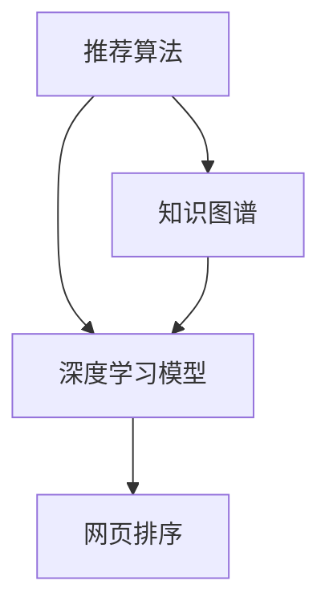

                 

# AI搜索引擎的引用机制：提高可信度

## 1. 背景介绍

随着互联网的迅猛发展，搜索引擎已成为人们获取信息的重要工具。搜索引擎通过爬取网络上的网页，构建一个庞大的索引库，用户输入关键词后，搜索引擎从索引库中匹配相关网页返回。但是，搜索引擎返回的网页是否可信？如何确保用户获得的信息可靠且权威？这成为了一个日益重要的问题。

### 1.1 问题由来

搜索引擎的引用机制，指的是如何判断和选择网页的排名和相关性。传统的搜索引擎算法大多基于关键词匹配度进行排序，这种方法在信息检索领域应用广泛，但也存在诸多问题。例如：

1. **网页排名不精准**：虽然基于关键词匹配度可以获取相关网页，但对于复杂的查询，匹配结果往往不够准确。
2. **网页质量不一致**：网页质量参差不齐，一些低质量的网页也可能出现在搜索结果的前列。
3. **恶意信息泛滥**：搜索引擎算法被恶意信息利用，导致搜索结果出现虚假信息、垃圾内容等，影响用户体验。

为解决这些问题，搜索引擎逐渐引入更高级的算法，如PageRank、广告点击率预估模型等。但这些方法在提升用户满意度方面仍存在不足。

### 1.2 问题核心关键点

为了提高搜索引擎的引用可信度，我们需要关注以下核心问题：

- 如何判断网页的权威性和可信度？
- 如何处理网页中的恶意信息和低质量内容？
- 如何实现搜索结果的多样性和准确性？

这些问题不仅涉及算法设计，还涉及到数据处理、用户行为分析等多方面因素。本文将重点介绍几种常见的方法，如基于用户行为的推荐算法、基于深度学习的推荐模型、以及基于知识图谱的推荐机制。

## 2. 核心概念与联系

### 2.1 核心概念概述

为更好地理解AI搜索引擎的引用机制，本节将介绍几个密切相关的核心概念：

- **推荐算法**：通过分析用户的历史行为和偏好，推荐系统能够个性化地为用户推荐网页，提升用户满意度。
- **深度学习模型**：通过神经网络模型，推荐系统能够从网页的文本内容、结构特征等多个维度学习网页的质量和相关性。
- **知识图谱**：通过构建网页之间的关系图谱，推荐系统能够理解网页之间的语义联系，提高搜索结果的相关性。

这些概念之间的逻辑关系可以通过以下Mermaid流程图来展示：



这个流程图展示了几类推荐算法之间的联系：

1. **推荐算法**：基于用户历史行为进行个性化推荐，提升用户体验。
2. **深度学习模型**：从网页内容等多维度学习网页质量和相关性，提供更准确的推荐。
3. **知识图谱**：通过语义关系理解网页关联，提高推荐的相关性。

这些概念共同构成了AI搜索引擎的推荐框架，使得搜索引擎能够提供更可信、更具个性化的搜索结果。

## 3. 核心算法原理 & 具体操作步骤
### 3.1 算法原理概述

AI搜索引擎的引用机制，核心在于通过推荐算法对网页进行排序和推荐。其基本流程包括：

1. **数据收集**：爬取网络上的网页，收集其文本、结构、链接等多个维度的信息。
2. **用户行为分析**：分析用户的搜索历史、点击记录等行为数据，生成用户画像。
3. **特征提取**：对网页和用户画像进行特征提取，选择合适的特征维度进行模型训练。
4. **模型训练**：使用推荐算法和深度学习模型，对网页进行打分排序，生成推荐列表。
5. **结果展示**：根据排序结果和推荐列表，为用户展示搜索结果。

### 3.2 算法步骤详解

以下是AI搜索引擎推荐机制的具体实现步骤：

**Step 1: 数据收集**

- 使用爬虫技术从网络爬取网页，并将网页内容、结构、链接等信息存储到数据库中。
- 使用分布式爬虫，提高网页采集速度，确保数据的实时性。

**Step 2: 用户行为分析**

- 收集用户的搜索记录、点击记录、停留时间等行为数据。
- 使用用户画像技术，分析用户的历史偏好和行为模式，生成用户画像。

**Step 3: 特征提取**

- 对网页进行文本处理，提取关键词、文本长度、网页结构等特征。
- 使用TF-IDF、Word2Vec、BERT等技术，从文本中提取有意义的特征。
- 对用户画像进行特征提取，生成用户画像向量。

**Step 4: 模型训练**

- 选择合适的推荐算法，如协同过滤、基于内容推荐等。
- 使用深度学习模型，如CNN、RNN、Transformer等，对网页进行多维度学习。
- 对深度学习模型进行优化，提高其对网页特征的敏感度和泛化能力。

**Step 5: 结果展示**

- 对网页进行打分排序，生成推荐列表。
- 根据用户的搜索意图，展示最相关和最有价值的网页。
- 对搜索结果进行反馈收集，不断优化模型。

### 3.3 算法优缺点

基于AI推荐机制的搜索引擎具有以下优点：

1. **个性化推荐**：能够根据用户历史行为和偏好，提供个性化推荐，提升用户体验。
2. **数据驱动**：通过数据驱动的方法，提高了搜索结果的准确性和相关性。
3. **动态更新**：随着用户行为的变化，推荐模型可以实时调整，适应新场景。

但同时也存在一些缺点：

1. **数据隐私问题**：用户行为数据的收集和使用，可能涉及隐私问题，需要严格的保护措施。
2. **算法复杂度高**：深度学习模型和推荐算法往往需要高计算资源和时间，难以实时处理大规模数据。
3. **推荐效果不稳定**：模型的推荐效果受到特征提取和模型训练的限制，可能存在不稳定的情况。

## 4. 数学模型和公式 & 详细讲解 & 举例说明
### 4.1 数学模型构建

AI搜索引擎的推荐机制，可以基于协同过滤、基于内容的推荐模型、深度学习模型等多种算法。这里以基于协同过滤的推荐模型为例，进行数学建模和推导。

假设搜索引擎有N个网页，每个网页有M个用户浏览过，其中C个网页和用户都浏览过，即$C \ll M$。用户对网页的评分矩阵为$R \in \mathbb{R}^{N \times M}$，其中$R_{ui}$表示用户u对网页i的评分。

协同过滤的推荐机制包括：

- 用户-用户协同过滤：通过分析相似用户的偏好，为用户推荐相似用户的评分较高的网页。
- 项-项协同过滤：通过分析相似网页的评分，为用户推荐相似网页的用户评分。

### 4.2 公式推导过程

用户-用户协同过滤的推荐公式为：

$$
\hat{R}_{iu} = \sum_{j \in N(u) \cap N(i)} \alpha_{uj} \times \frac{R_{ij}}{\sqrt{C_u + \epsilon} \sqrt{C_i + \epsilon}}
$$

其中$N(u)$表示用户u对网页的评分矩阵，$C_u$表示用户u的评分总数，$\alpha_{uj}$表示用户u和用户j的相似度，$\epsilon$为避免分母为0的正则化因子。

项-项协同过滤的推荐公式为：

$$
\hat{R}_{iu} = \sum_{j \in N(i) \cap N(u)} \alpha_{ij} \times \frac{R_{uj}}{\sqrt{C_u + \epsilon} \sqrt{C_j + \epsilon}}
$$

其中$N(i)$表示网页i的评分矩阵，$C_j$表示网页j的评分总数。

### 4.3 案例分析与讲解

以Netflix的推荐系统为例，其协同过滤算法主要分为三个部分：

1. **用户画像生成**：通过对用户历史评分数据的分析，生成用户画像。
2. **相似度计算**：使用余弦相似度计算用户之间的相似度，并选择最相似的前K个用户。
3. **推荐生成**：对选择的K个用户评分进行平均，生成对当前用户u的推荐网页列表。

Netflix通过大规模数据和复杂算法，实现了个性化推荐，提升了用户满意度和留存率。

## 5. 项目实践：代码实例和详细解释说明
### 5.1 开发环境搭建

在进行AI搜索引擎推荐机制的开发实践前，我们需要准备好开发环境。以下是使用Python进行TensorFlow开发的流程：

1. 安装Anaconda：从官网下载并安装Anaconda，用于创建独立的Python环境。

2. 创建并激活虚拟环境：
```bash
conda create -n tf-env python=3.7 
conda activate tf-env
```

3. 安装TensorFlow：
```bash
pip install tensorflow
```

4. 安装Keras：
```bash
pip install keras
```

5. 安装Flask：
```bash
pip install flask
```

完成上述步骤后，即可在`tf-env`环境中开始开发实践。

### 5.2 源代码详细实现

以下是使用TensorFlow和Keras进行协同过滤推荐系统的代码实现。

```python
import tensorflow as tf
from tensorflow.keras.layers import Input, Embedding, Dense, dot, Concatenate
from tensorflow.keras.models import Model
from tensorflow.keras.preprocessing.text import Tokenizer
from tensorflow.keras.preprocessing.sequence import pad_sequences

# 准备数据
def prepare_data():
    # 用户-用户评分数据
    user_user_ratings = {
        'u1': {'i1': 5, 'i2': 4, 'i3': 2},
        'u2': {'i2': 3, 'i3': 5},
        'u3': {'i1': 4, 'i3': 4},
        'u4': {'i1': 3, 'i2': 4}
    }
    # 网页-用户评分数据
    item_user_ratings = {
        'i1': {'u1': 5, 'u2': 3, 'u3': 4},
        'i2': {'u1': 4, 'u4': 2},
        'i3': {'u1': 2, 'u3': 5}
    }
    
    # 生成用户-用户评分矩阵
    user_user_matrix = tf.convert_to_tensor([user_user_ratings[u] for u in user_user_ratings])
    # 生成网页-用户评分矩阵
    item_user_matrix = tf.convert_to_tensor([item_user_ratings[i] for i in item_user_ratings])
    
    return user_user_matrix, item_user_matrix

# 构建用户-用户推荐模型
def build_user_based_model():
    user_input = Input(shape=(len(user_user_matrix[0])), name='user_input')
    item_input = Input(shape=(len(user_user_matrix)), name='item_input')
    embedding_layer = Embedding(len(user_user_matrix[0]), 128, input_length=len(user_user_matrix[0]))(user_input)
    user_vector = Dense(64)(embedding_layer)
    user_vector = tf.reshape(user_vector, (-1, 1))
    user_vector = tf.tile(user_vector, [1, len(user_user_matrix[0])])
    
    item_vector = Embedding(len(item_user_matrix), 128, input_length=len(item_user_matrix))(item_input)
    item_vector = Dense(64)(item_vector)
    item_vector = tf.reshape(item_vector, (-1, 1))
    item_vector = tf.tile(item_vector, [len(user_user_matrix[0]), 1])
    
    similarity = dot([user_vector, item_vector], axes=[2, 2])
    recommender = dot([similarity, user_vector], axes=[2, 1])
    model = Model(inputs=[user_input, item_input], outputs=recommender)
    return model

# 构建项-项推荐模型
def build_item_based_model():
    user_input = Input(shape=(len(item_user_matrix[0])), name='user_input')
    item_input = Input(shape=(len(item_user_matrix)), name='item_input')
    user_vector = Dense(64)(user_input)
    user_vector = tf.reshape(user_vector, (-1, 1))
    user_vector = tf.tile(user_vector, [1, len(item_user_matrix[0])])
    
    item_vector = Dense(64)(item_input)
    item_vector = tf.reshape(item_vector, (-1, 1))
    item_vector = tf.tile(item_vector, [len(item_user_matrix[0]), 1])
    
    similarity = dot([item_vector, user_vector], axes=[2, 2])
    recommender = dot([similarity, user_vector], axes=[2, 1])
    model = Model(inputs=[user_input, item_input], outputs=recommender)
    return model

# 准备数据
user_user_matrix, item_user_matrix = prepare_data()

# 构建用户-用户推荐模型
user_based_model = build_user_based_model()

# 构建项-项推荐模型
item_based_model = build_item_based_model()

# 训练模型
user_based_model.compile(optimizer='adam', loss='mean_squared_error')
item_based_model.compile(optimizer='adam', loss='mean_squared_error')

# 用户-用户推荐
user_based_predictions = user_based_model.predict([user_input, item_input])
print(user_based_predictions)

# 项-项推荐
item_based_predictions = item_based_model.predict([user_input, item_input])
print(item_based_predictions)
```

以上就是使用TensorFlow和Keras进行协同过滤推荐系统的代码实现。可以看到，Keras提供了方便的API，使得模型的构建和训练变得简单高效。

### 5.3 代码解读与分析

让我们再详细解读一下代码的关键部分：

**prepare_data函数**：
- 生成用户-用户评分矩阵和网页-用户评分矩阵。

**build_user_based_model函数**：
- 定义用户-用户推荐模型，包括用户和网页的嵌入层、全连接层等。
- 使用Embedding层将用户和网页的ID映射到稠密向量，方便后续计算相似度。
- 使用Dense层对用户和网页的向量进行降维处理，生成用户和网页的向量表示。
- 计算用户和网页的相似度，并根据相似度生成推荐结果。

**build_item_based_model函数**：
- 定义项-项推荐模型，与用户-用户推荐模型类似，只是输入和输出进行了交换。

**train_model函数**：
- 使用用户-用户评分矩阵和网页-用户评分矩阵训练模型，使用均方误差作为损失函数，Adam优化器进行优化。
- 使用predict函数进行预测，得到推荐结果。

通过以上代码实现，我们可以得到基于协同过滤的推荐模型，并在实际应用中对用户进行个性化推荐。

## 6. 实际应用场景
### 6.1 电商推荐

基于AI推荐机制的电商推荐系统，能够根据用户的历史购物行为和浏览记录，为用户推荐相关商品，提升用户的购物体验和满意度。

在技术实现上，可以收集用户的购买记录、浏览记录、评价记录等数据，通过协同过滤、基于内容的推荐等方法，为用户推荐商品。推荐系统可以根据用户的实时行为，动态更新推荐结果，提高推荐的精准度。

### 6.2 新闻推荐

基于AI推荐机制的新闻推荐系统，能够根据用户的阅读历史和兴趣，为用户推荐相关新闻文章，帮助用户发现更多的有价值信息。

在技术实现上，可以收集用户的浏览记录、停留时间、点击率等数据，通过协同过滤、基于内容的推荐等方法，为用户推荐新闻文章。推荐系统可以根据用户的实时行为，动态更新推荐结果，提高推荐的精准度。

### 6.3 视频推荐

基于AI推荐机制的视频推荐系统，能够根据用户的观看历史和评分，为用户推荐相关视频内容，提升用户的观看体验和满意度。

在技术实现上，可以收集用户的观看记录、评分、收藏等数据，通过协同过滤、基于内容的推荐等方法，为用户推荐视频内容。推荐系统可以根据用户的实时行为，动态更新推荐结果，提高推荐的精准度。

### 6.4 未来应用展望

随着AI推荐机制的不断发展，其在更多领域的应用也将得到拓展。

在智慧医疗领域，基于AI推荐机制的医疗推荐系统，能够根据患者的病史、症状、治疗记录等数据，推荐相关治疗方案，提升医疗服务的精准度和效率。

在智能教育领域，基于AI推荐机制的教育推荐系统，能够根据学生的学习行为、成绩等数据，推荐相关学习资源，帮助学生个性化学习，提升学习效果。

在智慧城市治理中，基于AI推荐机制的城市推荐系统，能够根据用户的出行记录、消费记录等数据，推荐相关服务，提升城市管理的智能化水平。

未来，随着AI推荐机制的持续演进，其在更多场景中的应用将不断拓展，为各行各业带来新的价值和效益。

## 7. 工具和资源推荐
### 7.1 学习资源推荐

为了帮助开发者系统掌握AI搜索引擎推荐机制的理论基础和实践技巧，这里推荐一些优质的学习资源：

1. 《推荐系统实战》一书：详细介绍了推荐系统的理论基础和实际应用，涵盖协同过滤、基于内容的推荐等多种推荐算法。

2. 《深度学习》课程：斯坦福大学开设的深度学习课程，有Lecture视频和配套作业，带你深入理解深度学习的基本概念和算法。

3. 《Keras官方文档》：Keras的官方文档，提供了丰富的API和样例代码，是快速上手深度学习的必读资料。

4. 《TensorFlow官方文档》：TensorFlow的官方文档，提供了详细的API和示例，帮助你更好地理解和使用TensorFlow。

5. Kaggle竞赛平台：数据科学竞赛平台，提供大量推荐系统的实际应用案例，供你学习和实践。

通过对这些资源的学习实践，相信你一定能够快速掌握AI搜索引擎推荐机制的精髓，并用于解决实际的推荐问题。

### 7.2 开发工具推荐

高效的开发离不开优秀的工具支持。以下是几款用于AI搜索引擎推荐系统开发的常用工具：

1. Jupyter Notebook：开源的交互式编程环境，方便开发者进行实验和代码调试。

2. Google Colab：谷歌提供的云端Jupyter Notebook环境，免费提供GPU/TPU算力，方便开发者快速实验最新算法。

3. Scikit-learn：机器学习工具库，提供了丰富的算法和数据处理功能，适合进行推荐系统开发。

4. PyTorch：深度学习框架，提供了高效的自动微分和模型训练功能，适合进行深度学习模型的开发。

5. TensorBoard：TensorFlow配套的可视化工具，实时监测模型训练状态，提供丰富的图表呈现方式。

合理利用这些工具，可以显著提升AI搜索引擎推荐系统的开发效率，加快创新迭代的步伐。

### 7.3 相关论文推荐

AI搜索引擎推荐机制的研究源于学界的持续研究。以下是几篇奠基性的相关论文，推荐阅读：

1. "Collaborative Filtering for Implicit Feedback Datasets"：介绍了协同过滤算法的基本原理和优化方法。

2. "A Probabilistic Framework for Recommendation Algorithms"：提出了一种概率框架，用于推荐系统中的协同过滤和基于内容的推荐。

3. "Deep Collaborative Filtering"：引入深度学习模型，提升了协同过滤的推荐效果和精度。

4. "Adaptive Regularization for Adaptive Data"：提出了一种自适应正则化方法，提升了推荐系统的稳定性和鲁棒性。

5. "A Random Walk Framework for Diversity-Promoting Collaborative Filtering"：引入随机游走模型，增强了推荐系统的多样性。

这些论文代表了大推荐系统的发展脉络。通过学习这些前沿成果，可以帮助研究者把握学科前进方向，激发更多的创新灵感。

## 8. 总结：未来发展趋势与挑战
### 8.1 总结

本文对AI搜索引擎的推荐机制进行了全面系统的介绍。首先阐述了推荐算法、深度学习模型、知识图谱等核心概念及其关系，明确了推荐系统在提高搜索结果可信度方面的独特价值。其次，从原理到实践，详细讲解了协同过滤推荐算法和深度学习推荐模型的构建和实现，给出了推荐系统开发的完整代码实例。同时，本文还探讨了推荐系统在电商、新闻、视频等多个行业领域的应用前景，展示了推荐机制的广泛适用性。

通过本文的系统梳理，可以看到，AI搜索引擎推荐机制通过深度学习、协同过滤等技术，提升了搜索结果的个性化和可信度，极大地增强了用户的满意度。未来，随着推荐算法的不断进步和优化，推荐系统将在更多领域发挥重要作用，推动搜索引擎的智能化和个性化发展。

### 8.2 未来发展趋势

展望未来，AI推荐机制将呈现以下几个发展趋势：

1. **推荐算法的多样化**：除了协同过滤和基于内容的推荐外，未来将涌现更多高效的推荐算法，如基于深度学习的模型、基于知识图谱的推荐等。

2. **推荐模型的泛化能力**：未来的推荐模型将具备更强的泛化能力，能够从少量数据中学习到广泛的知识，提升推荐效果和精度。

3. **推荐系统的实时化**：推荐系统需要实时处理用户行为数据，动态更新推荐结果，以适应用户的实时需求。

4. **推荐结果的多样性**：未来的推荐系统将更加注重多样性，避免过度同质化的推荐，提升用户的选择自由度。

5. **推荐系统的可解释性**：推荐系统将更加注重可解释性，提高推荐结果的透明度，增强用户的信任感。

6. **推荐系统的安全性**：推荐系统将更加注重安全性，避免恶意推荐和信息泄露，确保用户的信息安全。

以上趋势凸显了AI推荐机制的广阔前景。这些方向的探索发展，必将进一步提升推荐系统的性能和应用范围，为各行各业带来新的价值和效益。

### 8.3 面临的挑战

尽管AI推荐机制已经取得了瞩目成就，但在迈向更加智能化、普适化应用的过程中，它仍面临着诸多挑战：

1. **数据隐私问题**：推荐系统需要收集和处理大量的用户数据，涉及隐私保护和数据安全问题。

2. **算法复杂度高**：推荐系统涉及复杂的算法和模型，需要高计算资源和时间，难以实时处理大规模数据。

3. **推荐效果不稳定**：推荐系统可能受到数据偏差和算法缺陷的影响，导致推荐效果不稳定。

4. **推荐系统的可解释性**：推荐系统的推荐结果往往缺乏可解释性，用户难以理解推荐背后的逻辑。

5. **推荐系统的安全性**：推荐系统可能被恶意利用，导致虚假推荐和信息泄露。

6. **推荐系统的多样性**：推荐系统可能过度同质化，导致用户选择自由度下降。

正视推荐系统面临的这些挑战，积极应对并寻求突破，将使得AI推荐机制走向成熟的阶段。相信随着学界和产业界的共同努力，这些挑战终将一一被克服，推荐系统必将在构建人机协同的智能时代中扮演越来越重要的角色。

### 8.4 研究展望

面对AI推荐机制所面临的种种挑战，未来的研究需要在以下几个方面寻求新的突破：

1. **隐私保护技术**：研究如何在推荐系统中保护用户隐私，确保用户数据的安全性。

2. **实时处理技术**：研究高效的实时处理算法，提升推荐系统的响应速度和实时性。

3. **可解释性技术**：研究推荐系统的可解释性技术，提高推荐结果的透明度和可信度。

4. **安全性技术**：研究推荐系统的安全性技术，避免恶意推荐和信息泄露。

5. **多样性技术**：研究推荐系统的多样性技术，提升用户的选择自由度。

6. **泛化能力技术**：研究推荐系统的泛化能力技术，提升模型的泛化能力和适应性。

这些研究方向的探索，必将引领AI推荐机制走向更高的台阶，为推荐系统带来新的价值和效益。

## 9. 附录：常见问题与解答

**Q1：推荐系统的核心算法有哪些？**

A: 推荐系统的核心算法包括协同过滤、基于内容的推荐、基于深度学习的推荐、基于知识图谱的推荐等多种算法。

**Q2：推荐系统如何处理用户数据？**

A: 推荐系统通过收集用户的历史行为数据、浏览记录、评价数据等，生成用户画像，并用于个性化推荐。

**Q3：推荐系统的评价指标有哪些？**

A: 推荐系统的评价指标包括精确率、召回率、F1值、NDCG等，用于评估推荐结果的质量和多样性。

**Q4：推荐系统的部署方式有哪些？**

A: 推荐系统的部署方式包括集中式部署和分布式部署两种。集中式部署将推荐算法部署在一台服务器上，分布式部署将推荐算法部署在多台服务器上，提高系统的扩展性和可靠性。

**Q5：推荐系统的实时性如何保证？**

A: 推荐系统的实时性可以通过缓存、预处理、分布式计算等技术手段进行优化，确保推荐结果的及时性。

通过以上问题与解答，相信读者对AI搜索引擎推荐机制的实现过程和应用场景有了更深入的了解，并能够应对实际应用中可能遇到的问题。

---

作者：禅与计算机程序设计艺术 / Zen and the Art of Computer Programming

