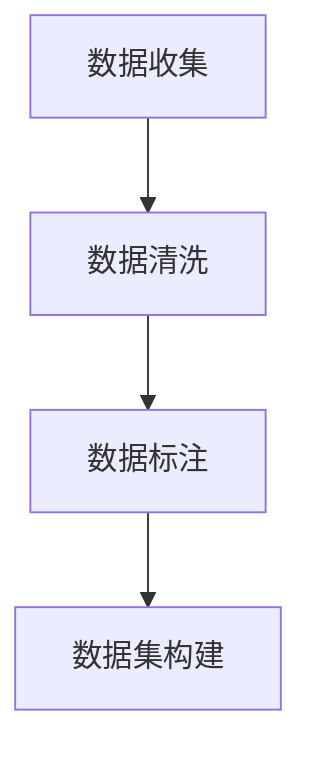
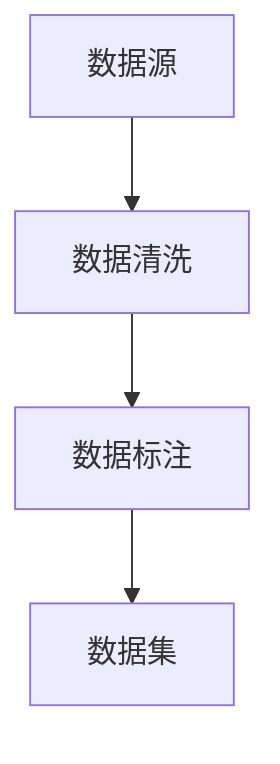

                 

## 1. 背景介绍

### 1.1 问题由来
在人工智能（AI）和机器学习（ML）领域，数据集构建是一项基础而重要的工作。无论是模型训练、推理，还是评估性能，高质量的数据集都是不可或缺的资源。然而，现实中的数据往往存在诸多问题，如数据缺失、噪声、冗余等，严重影响了模型的学习效果和泛化能力。因此，有效的数据收集、清洗和标注，是构建高性能AI模型的前提。本文将详细探讨数据集构建的核心方法，以期为AI研究和应用提供参考。

### 1.2 问题核心关键点
数据集构建涉及数据收集、数据清洗、数据标注等多个环节。关键点包括：
- **数据收集**：选择合适的数据源，确保数据的代表性和多样性。
- **数据清洗**：去除数据中的噪声、异常值，保证数据的质量和一致性。
- **数据标注**：为数据添加标签，使得机器能够理解数据的含义和结构。

这些关键点共同构成了数据集构建的核心框架，对于AI模型的训练和应用至关重要。

### 1.3 问题研究意义
高质量的数据集是AI模型训练和优化的基石。通过系统地学习数据集构建方法，研究者可以：
1. 提升模型性能：确保模型在多样性和复杂性数据上的泛化能力。
2. 加速模型开发：减少数据预处理的时间和成本。
3. 促进领域发展：推动AI技术在各行业中的应用。
4. 保障数据安全：确保数据使用的合规性和隐私保护。

## 2. 核心概念与联系

### 2.1 核心概念概述

数据集构建涉及多个概念，其相互联系和作用可以通过以下Mermaid流程图来展示：



- **数据收集**：指从多个数据源获取数据，确保数据的多样性和代表性。
- **数据清洗**：对原始数据进行去噪、去重、标准化等操作，提升数据质量。
- **数据标注**：为数据添加标签或注释，使机器能够理解数据内容。
- **数据集构建**：将清洗和标注后的数据整合，形成可供模型训练和评估的完整数据集。

这些概念之间相互作用，共同构成了数据集构建的完整流程。

### 2.2 核心概念原理和架构的 Mermaid 流程图

以下是一个简化的Mermaid流程图，展示了数据集构建的逻辑结构：



该图展示了数据从数据源经过清洗和标注，最终形成数据集的基本流程。

## 3. 核心算法原理 & 具体操作步骤

### 3.1 算法原理概述

数据集构建的算法原理主要基于以下原则：
1. **多样性**：数据集应包含多种类型和来源的数据，以反映真实世界的复杂性。
2. **代表性**：数据集应能够代表实际应用场景中的各种情况。
3. **清洗**：去除数据中的噪声和异常值，提升数据质量。
4. **标注**：为数据添加标签或注释，帮助机器理解数据含义。

### 3.2 算法步骤详解

数据集构建的具体步骤包括：
1. **数据收集**：选择多个数据源，如公开数据集、公共数据库、社交媒体等。
2. **数据清洗**：去除噪声、异常值、重复数据等，保证数据一致性和准确性。
3. **数据标注**：为数据添加标签，如分类标签、回归标签、实体标注等。
4. **数据集构建**：将清洗和标注后的数据整合，形成可供模型训练和评估的完整数据集。

### 3.3 算法优缺点

数据集构建的算法具有以下优点：
1. **高效性**：自动化数据处理，减少人工干预。
2. **准确性**：通过系统化的清洗和标注，提升数据质量。
3. **可复用性**：构建好的数据集可被多个模型重复使用，降低成本。

同时，也存在一些缺点：
1. **复杂性**：数据清洗和标注过程复杂，需要专业知识。
2. **成本高**：高质量数据的获取和标注成本较高。
3. **依赖性强**：对数据源和标注工具的依赖较高。

### 3.4 算法应用领域

数据集构建方法广泛应用于多个AI领域，例如：
- **自然语言处理（NLP）**：构建语料库、文本分类数据集等。
- **计算机视觉（CV）**：构建图像识别、目标检测数据集等。
- **医疗健康**：构建医学影像、医疗记录等数据集。
- **金融科技**：构建交易数据、信用评分等数据集。
- **智能制造**：构建传感器数据、生产流程等数据集。

## 4. 数学模型和公式 & 详细讲解 & 举例说明

### 4.1 数学模型构建

数据集构建的数学模型主要基于统计学和机器学习理论。假设有一个数据集 $D = \{(x_i, y_i)\}_{i=1}^N$，其中 $x_i$ 是输入特征，$y_i$ 是目标标签。数据集的构建过程可以通过以下步骤进行：
1. **数据收集**：选择数据源，获取数据。
2. **数据清洗**：去除噪声、异常值，提升数据质量。
3. **数据标注**：为数据添加标签，使得机器能够理解数据含义。
4. **数据集构建**：将清洗和标注后的数据整合，形成可供模型训练和评估的完整数据集。

### 4.2 公式推导过程

假设数据集 $D = \{(x_i, y_i)\}_{i=1}^N$，其中 $x_i \in \mathcal{X}, y_i \in \mathcal{Y}$。数据集构建的目标是最大化数据的多样性和代表性，最小化噪声和异常值。

数学模型可以表示为：
$$
\max_{D} \text{Diversity}(D)
$$
$$
\min_{D} \text{Noise}(D)
$$

其中，$\text{Diversity}(D)$ 表示数据集的多样性，$\text{Noise}(D)$ 表示数据集中的噪声。

### 4.3 案例分析与讲解

假设我们有一个医学影像数据集，用于训练一个癌症检测模型。数据集构建的具体过程如下：

1. **数据收集**：从多个医院获取CT扫描图像和相应的病理诊断结果。
2. **数据清洗**：去除模糊、低质量图像，校正异常值，确保数据一致性。
3. **数据标注**：为每个图像添加癌症类型标签，如良性、恶性等。
4. **数据集构建**：将清洗和标注后的图像和标签整合，形成完整的训练数据集。

## 5. 项目实践：代码实例和详细解释说明

### 5.1 开发环境搭建

在进行数据集构建之前，需要准备好开发环境。以下是使用Python进行数据集构建的开发环境配置流程：

1. 安装Python：
   ```
   pip install python
   ```

2. 安装必要的库：
   ```
   pip install pandas numpy scikit-learn
   ```

3. 配置环境变量：
   ```
   export PYTHONPATH=$PYTHONPATH:/path/to/your/project
   ```

### 5.2 源代码详细实现

以下是一个数据集构建的Python代码实现：

```python
import pandas as pd
from sklearn.preprocessing import StandardScaler

# 加载数据集
df = pd.read_csv('data.csv')

# 数据清洗
df = df.dropna()  # 去除缺失值
df = df.drop_duplicates()  # 去除重复数据
scaler = StandardScaler()
df['scaled_feature'] = scaler.fit_transform(df[['original_feature']])  # 标准化特征

# 数据标注
df['label'] = df['original_label'].map(lambda x: 'class1' if x else 'class2')  # 添加标签

# 数据集构建
X = df.drop(['label', 'scaled_feature'], axis=1)
y = df['label']
```

### 5.3 代码解读与分析

代码中主要进行了以下步骤：
1. 加载数据集，使用Pandas库进行数据处理。
2. 数据清洗，去除缺失值和重复数据，并对特征进行标准化。
3. 数据标注，为数据添加标签。
4. 数据集构建，将处理后的数据分割为输入特征和目标标签。

### 5.4 运行结果展示

运行上述代码后，可以得到一个清洗和标注好的数据集，可以使用Scikit-learn等库进行模型训练和评估。

## 6. 实际应用场景

### 6.1 医疗影像分析

在医疗影像分析中，高质量的数据集对于训练准确的癌症检测模型至关重要。通过数据集构建，可以获取大量的CT扫描图像和病理诊断结果，供模型训练和验证。

### 6.2 自然语言处理

在自然语言处理（NLP）中，构建高质量的文本数据集对于训练高效的文本分类、命名实体识别等模型至关重要。数据集构建可以覆盖多种语言和多种类型的文本数据，如新闻、社交媒体、医学文献等。

### 6.3 计算机视觉

在计算机视觉领域，构建高质量的图像和视频数据集对于训练准确的图像分类、目标检测等模型至关重要。数据集构建可以覆盖各种场景和对象，如人脸识别、交通监控、工业检测等。

## 7. 工具和资源推荐

### 7.1 学习资源推荐

为帮助开发者系统掌握数据集构建的理论基础和实践技巧，以下是一些优质的学习资源：

1. **《Python数据科学手册》**：详细介绍了数据收集、清洗和标注的各个方面，适合初学者和中级开发者。
2. **Coursera《机器学习基础》**：由斯坦福大学提供，涵盖数据预处理、特征工程等关键内容。
3. **Kaggle**：提供大量的公开数据集和数据集构建竞赛，适合练习和实践。
4. **Google AI Blog**：定期发布最新的数据集构建方法和工具，适合跟踪最新进展。

### 7.2 开发工具推荐

数据集构建需要使用各种工具和库，以下是几款常用的开发工具：

1. **Pandas**：数据处理和分析的利器，适合数据清洗和标注。
2. **NumPy**：科学计算库，适合数据处理和数学计算。
3. **Scikit-learn**：机器学习库，适合数据集构建和模型训练。
4. **TensorFlow**：深度学习框架，适合大规模数据集的构建和处理。
5. **Keras**：深度学习库，适合快速搭建和训练模型。

### 7.3 相关论文推荐

数据集构建涉及多个领域，以下是几篇重要的相关论文，推荐阅读：

1. **“Data Collection and Labeling for AI”**：介绍了数据集构建的基本流程和关键技术，适合基础学习。
2. **“Effective Data Collection and Labeling for Machine Learning”**：讨论了数据集构建的实际应用和挑战，适合应用开发。
3. **“Data Augmentation for Deep Learning: A Review”**：介绍了数据增强技术，适合提升数据集的多样性和代表性。

## 8. 总结：未来发展趋势与挑战

### 8.1 研究成果总结

本文系统地介绍了数据集构建的核心方法，包括数据收集、清洗和标注等关键环节。通过数据集构建，可以提升AI模型的性能和泛化能力，推动AI技术的应用和发展。

### 8.2 未来发展趋势

未来，数据集构建将呈现以下几个发展趋势：
1. **自动化**：自动化的数据收集和标注方法将逐渐普及，降低人工成本。
2. **多样性**：构建更多类型和来源的数据集，提升模型的泛化能力。
3. **安全性**：注重数据隐私和安全，确保数据使用的合规性。
4. **协作化**：推动跨领域的数据共享和协作，形成更大规模的数据集。

### 8.3 面临的挑战

数据集构建虽然重要，但也面临诸多挑战：
1. **数据质量**：高质量数据的获取和标注成本较高，依赖领域专家。
2. **数据隐私**：数据隐私和安全问题需引起重视，确保数据使用的合规性。
3. **数据噪声**：数据中可能存在噪声和异常值，需要有效的清洗方法。
4. **数据标注**：数据标注工作量大且成本高，需引入自动化标注技术。

### 8.4 研究展望

未来，数据集构建的研究方向将包括：
1. **自动化标注**：引入自动化标注技术，提升数据标注效率。
2. **数据增强**：开发新的数据增强方法，提升数据集的多样性和代表性。
3. **跨领域协作**：推动跨领域的数据共享和协作，形成更大规模的数据集。
4. **安全性保障**：注重数据隐私和安全，确保数据使用的合规性。

## 9. 附录：常见问题与解答

**Q1: 数据集构建中如何保证数据的多样性和代表性？**

A: 数据集构建中保证数据的多样性和代表性需要综合考虑数据来源、数据类型和数据规模。可以通过以下方法：
1. **数据来源多样化**：从多个数据源获取数据，如公开数据集、公共数据库、社交媒体等。
2. **数据类型多样化**：覆盖多种类型和形式的数据，如文本、图像、视频等。
3. **数据规模多样化**：确保数据集的大小和分布具有代表性。

**Q2: 数据清洗中去除噪声和异常值的方法有哪些？**

A: 数据清洗中去除噪声和异常值的方法包括：
1. **统计方法**：使用均值、中位数等统计量，检测并去除异常值。
2. **可视化方法**：通过箱线图、直方图等可视化方法，发现并去除噪声和异常值。
3. **机器学习方法**：使用分类、回归等机器学习方法，检测并去除噪声和异常值。

**Q3: 数据标注中如何保证标注的准确性和一致性？**

A: 数据标注中保证标注的准确性和一致性需要综合考虑标注人员的专业背景、标注工具的准确性和标注流程的标准化。可以通过以下方法：
1. **标注人员培训**：对标注人员进行专业培训，确保标注准确性和一致性。
2. **标注工具选择**：选择准确性高、易用性好的标注工具，减少人为误差。
3. **标注流程标准化**：制定统一的标注流程和规范，确保标注一致性。

**Q4: 如何构建跨领域的数据集？**

A: 构建跨领域的数据集需要综合考虑不同领域的数据特点和需求。可以通过以下方法：
1. **数据融合**：将不同领域的数据进行融合，形成跨领域的数据集。
2. **领域适应**：在构建数据集时，考虑到不同领域的数据特点，进行领域适应。
3. **数据增强**：使用数据增强技术，提升数据集的多样性和代表性。

**Q5: 数据集构建中如何处理数据隐私问题？**

A: 数据集构建中处理数据隐私问题需要综合考虑数据的使用场景和法律法规。可以通过以下方法：
1. **数据脱敏**：对数据进行脱敏处理，确保数据隐私。
2. **数据匿名化**：将数据匿名化处理，防止数据泄露。
3. **合规审查**：确保数据使用的合规性，遵守相关法律法规。

---
作者：禅与计算机程序设计艺术 / Zen and the Art of Computer Programming

