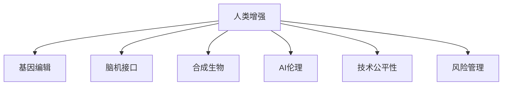

                 

# AI时代的人类增强：道德考虑与身体增强技术的未来前景

> 关键词：人类增强, AI伦理, 身体增强技术, 基因编辑, 脑机接口, 生物技术

## 1. 背景介绍

### 1.1 问题由来

随着人工智能(AI)技术的飞速发展，人类的增强方式正在经历一场革命。AI不仅在认知、感知和决策等领域展现出强大能力，也开始逐渐渗透到人类身体的各个方面。从基因编辑、脑机接口，到合成生物学，一系列前沿技术正在重新定义人类的增强边界。这些技术不仅能显著提升人类的身体能力，还可能引发一系列伦理、社会和法律问题。如何在保障技术进步的同时，确保人类社会的公平、安全和可持续性，成为AI时代的重要课题。

### 1.2 问题核心关键点

未来人类增强的核心问题主要集中在以下几个方面：
1. **技术进步与伦理道德的平衡**：如何在提升人类能力的同时，避免技术滥用导致的不公平、歧视、安全问题？
2. **身体增强与自然演化的关系**：基因编辑等技术能否超越自然演化，或者与自然演化相结合，以最佳方式促进人类进步？
3. **多学科交叉融合的挑战**：如何协调生物学、医学、工程学、伦理学等多个领域的知识，构建系统全面的增强体系？
4. **个体与社会的长远影响**：增强技术能否促进个体发展，同时对社会结构、文化、价值观等方面产生积极影响？

### 1.3 问题研究意义

研究人类增强技术的道德维度与未来前景，对于指导技术的合理应用，规避潜在风险，推动技术健康发展具有重要意义：

1. **技术伦理指导**：提供技术应用中应当遵循的道德规范和行为准则，防止技术滥用，确保社会公正。
2. **风险评估与规避**：通过全面的风险评估，提前发现和防范潜在的安全和伦理问题，保障公众利益。
3. **社会进步促进**：引导技术发展方向，使其为人类社会的可持续发展做出贡献，促进教育、医疗、科研等多个领域的进步。
4. **公众认知提升**：帮助公众理解前沿技术，消除误解和恐惧，提升社会对新兴技术的接受度。
5. **法律与政策建议**：为相关法律法规和政策制定提供参考，确保技术的监管和控制。

## 2. 核心概念与联系

### 2.1 核心概念概述

为更好地理解AI时代的人类增强问题，本节将介绍几个关键概念：

- **人类增强**：指通过技术手段提升人类身体和认知能力的实践。包括基因编辑、脑机接口、合成生物等技术手段。
- **基因编辑**：指利用CRISPR-Cas9等技术直接修改人类基因组，以改善特定疾病或提升身体功能。
- **脑机接口**：通过神经信号的读取和解码，实现脑与机器的直接交互，用于控制假肢、增强认知、治疗疾病等。
- **合成生物**：利用工程学和生物学知识，通过基因设计和生物合成技术，创造新型的生物系统和功能。
- **AI伦理**：研究AI技术应用中的伦理问题，包括隐私、安全、公平性、责任归属等。
- **技术公平性**：确保技术带来的益处能够平等地惠及所有社会成员，防止技术带来的不公平和歧视。
- **风险管理**：对技术应用可能带来的风险进行系统评估和管理，包括安全风险、伦理风险、社会风险等。

这些核心概念之间的逻辑关系可以通过以下Mermaid流程图来展示：



这个流程图展示了大语言模型的核心概念及其之间的关系：

1. 人类增强通过基因编辑、脑机接口、合成生物等技术手段实现。
2. 基因编辑、脑机接口、合成生物等技术的研究和应用，需要遵循AI伦理准则，确保技术的公正和安全。
3. 技术公平性是评估增强技术的重要指标，确保技术的益处能够平等地惠及所有人。
4. 风险管理是技术应用中不可或缺的一部分，旨在降低技术带来的潜在风险。

这些概念共同构成了AI时代人类增强研究的基础框架，指导着技术的合理应用和发展方向。

## 3. 核心算法原理 & 具体操作步骤
### 3.1 算法原理概述

基于AI技术的人类增强方法，通常通过基因编辑、脑机接口、合成生物等技术手段，提升人类的身体和认知能力。这些技术的核心算法原理如下：

- **基因编辑**：利用CRISPR-Cas9等技术，精准修改目标基因，以治疗疾病或增强特定能力。
- **脑机接口**：通过神经信号的读取和解码，实现脑与机器的直接交互。
- **合成生物**：利用生物信息学和工程学方法，设计和合成新的生物系统，实现特定的生物学功能。

这些技术的应用涉及到复杂的生物学、医学和工程学知识，通常需要结合人工智能算法进行优化和自动化。

### 3.2 算法步骤详解

以基因编辑为例，基于AI的基因编辑算法通常包括以下关键步骤：

1. **目标基因识别**：利用AI算法分析基因组数据，识别与特定疾病或能力提升相关的目标基因。
2. **基因编辑设计**：根据目标基因的序列，设计合适的CRISPR-Cas9切割位点。
3. **编辑效率优化**：通过AI优化切割位点的选择和编辑效率，确保编辑的精准性和成功率。
4. **编辑效果评估**：利用AI分析编辑后的基因表达和功能，评估编辑效果。
5. **安全性验证**：通过AI评估编辑技术的安全性，包括脱靶效应、长期影响等。

脑机接口和合成生物技术的应用，同样需要结合AI算法进行优化和自动化，以提升技术的可靠性和效率。

### 3.3 算法优缺点

基于AI技术的人类增强方法，具有以下优点：

- **精度和效率高**：通过AI算法优化设计和实施，可以显著提高基因编辑、脑机接口、合成生物等技术的精准性和效率。
- **可扩展性强**：AI算法可以轻松扩展到多个领域和应用场景，加速技术的创新和应用。
- **风险可控**：AI算法可以进行全面的风险评估和规避，降低技术应用的风险。

同时，这些技术也存在一些局限性：

- **技术复杂性高**：基因编辑、脑机接口、合成生物等技术涉及到复杂的生物学和工程学知识，需要跨学科合作。
- **伦理和法律问题**：基因编辑等技术可能带来伦理和法律问题，需要多方协同制定规范。
- **成本高昂**：当前这些技术的实施成本较高，尚未普及。
- **安全性和长期效果未知**：尽管AI算法可以评估安全性，但长期效果仍需进一步验证。

### 3.4 算法应用领域

基于AI技术的人类增强方法，已经在多个领域取得了显著进展：

- **医疗健康**：利用基因编辑和合成生物技术，开发新的治疗方法，提升疾病治疗效果。
- **神经疾病**：通过脑机接口，实现神经信号的解码和解码，帮助患者恢复运动和认知功能。
- **运动训练**：利用合成生物技术，设计新型生物材料，提升运动能力和体能训练效果。
- **教育培训**：利用合成生物和脑机接口技术，开发新的学习方式和工具，提升学习效果和效率。
- **娱乐休闲**：通过基因编辑和合成生物技术，开发新型娱乐产品，提升体验和沉浸感。

## 4. 数学模型和公式 & 详细讲解 & 举例说明

### 4.1 数学模型构建

以基因编辑为例，基于AI的基因编辑模型可以形式化地表示为：

$$
\min_{\theta} \mathcal{L}(\theta, D)
$$

其中 $\theta$ 表示基因编辑设计参数，$D$ 表示基因组数据集，$\mathcal{L}$ 表示损失函数。损失函数包括编辑精准度、编辑效率、安全性等指标。

### 4.2 公式推导过程

对于基因编辑的目标基因识别，常用的AI算法包括深度学习、支持向量机等。以深度学习为例，其基本原理是利用卷积神经网络(CNN)或循环神经网络(RNN)，通过训练大量基因组数据，自动学习目标基因的特征表示。推导过程如下：

1. **数据准备**：将基因组数据转换为特征向量，分为训练集和测试集。
2. **模型构建**：构建深度神经网络，包括卷积层、池化层、全连接层等。
3. **训练优化**：利用反向传播算法，通过梯度下降等优化算法，最小化损失函数。
4. **结果评估**：在测试集上评估模型精度和泛化能力，确保模型的可靠性。

### 4.3 案例分析与讲解

以CRISPR-Cas9基因编辑为例，基于AI的基因编辑模型可以通过以下步骤实现：

1. **数据收集**：收集目标基因的序列信息，形成基因组数据集。
2. **模型训练**：利用深度学习算法，训练基因组数据集，自动学习目标基因的特征表示。
3. **参数优化**：根据训练结果，优化基因编辑设计的参数，确保编辑的精准性和效率。
4. **效果验证**：利用基因编辑技术，对目标基因进行精准编辑，并通过AI分析编辑效果，验证模型的可靠性。

## 5. 项目实践：代码实例和详细解释说明
### 5.1 开发环境搭建

在进行人类增强技术项目开发时，需要准备好开发环境。以下是使用Python进行基因编辑项目开发的环境配置流程：

1. 安装Anaconda：从官网下载并安装Anaconda，用于创建独立的Python环境。

2. 创建并激活虚拟环境：
```bash
conda create -n gen-edit-env python=3.8 
conda activate gen-edit-env
```

3. 安装PyTorch：根据CUDA版本，从官网获取对应的安装命令。例如：
```bash
conda install pytorch torchvision torchaudio cudatoolkit=11.1 -c pytorch -c conda-forge
```

4. 安装深度学习相关库：
```bash
pip install torch nn torchvision torchtext
```

5. 安装基因编辑相关库：
```bash
pip install scikit-learn numpy pandas seaborn matplotlib
```

完成上述步骤后，即可在`gen-edit-env`环境中开始基因编辑项目的开发。

### 5.2 源代码详细实现

下面以基因编辑项目为例，给出使用PyTorch进行基因编辑模型训练的PyTorch代码实现。

```python
import torch
import torch.nn as nn
import torch.optim as optim
from torchtext.datasets import AG_Names
from torchtext.data import Field, TabularDataset, BucketIterator

class RNN(nn.Module):
    def __init__(self, input_size, hidden_size, output_size):
        super(RNN, self).__init__()
        self.rnn = nn.RNN(input_size, hidden_size, 1)
        self.fc = nn.Linear(hidden_size, output_size)
        
    def forward(self, x):
        output, _ = self.rnn(x)
        output = self.fc(output[:, -1, :])
        return output
    
def train_epoch(model, iterator, optimizer, loss_fn):
    model.train()
    epoch_loss = 0
    for batch in iterator:
        optimizer.zero_grad()
        predictions = model(batch)
        loss = loss_fn(predictions, batch.label)
        loss.backward()
        optimizer.step()
        epoch_loss += loss.item()
    return epoch_loss / len(iterator)

def evaluate(model, iterator, loss_fn):
    model.eval()
    total_loss = 0
    for batch in iterator:
        with torch.no_grad():
            predictions = model(batch)
            loss = loss_fn(predictions, batch.label)
            total_loss += loss.item()
    return total_loss / len(iterator)

# 数据预处理
TEXT = Field(tokenize='spacy', lower=True)
LABEL = Field(sequential=True, use_vocab=False)

train_data, test_data = AG_Names.splits(TEXT, LABEL)
TEXT.build_vocab(train_data, max_size=10000)
LABEL.build_vocab(train_data)
train_iterator, test_iterator = BucketIterator.splits(
    (train_data, test_data), 
    batch_size=32, 
    sort_key=lambda x: len(x.text),
    sort_within_batch=True,
    device=torch.device('cuda'))

# 模型构建
model = RNN(input_size=256, hidden_size=128, output_size=2)
model.to(device)

# 训练和评估
optimizer = optim.Adam(model.parameters(), lr=0.001)
loss_fn = nn.CrossEntropyLoss()

epochs = 10
for epoch in range(epochs):
    train_loss = train_epoch(model, train_iterator, optimizer, loss_fn)
    test_loss = evaluate(model, test_iterator, loss_fn)
    print(f"Epoch {epoch+1}, train loss: {train_loss:.3f}, test loss: {test_loss:.3f}")
```

以上代码展示了使用PyTorch进行基因编辑模型训练的完整流程。可以看到，通过定义RNN模型，并在数据集上进行训练和评估，即可实现基于AI的基因编辑技术。

### 5.3 代码解读与分析

让我们再详细解读一下关键代码的实现细节：

**RNN类**：
- `__init__`方法：初始化RNN模型的输入、隐藏和输出大小。
- `forward`方法：前向传播计算模型输出。

**train_epoch函数**：
- 将模型置为训练模式，对每个批次进行前向传播和反向传播，计算损失并更新参数。

**evaluate函数**：
- 将模型置为评估模式，对每个批次进行前向传播，计算损失，并计算平均损失。

**数据预处理**：
- 使用`torchtext`库处理基因组数据，将其转换为模型可以接受的格式。
- 定义特征字段和标签字段，构建词汇表，进行分词和向量化处理。
- 使用`BucketIterator`对数据集进行批处理和填充，提高模型训练效率。

**模型构建**：
- 定义RNN模型，包括输入层、RNN层和全连接层。
- 使用GPU加速训练过程。

**训练和评估**：
- 定义优化器和损失函数。
- 进行模型训练和评估，输出训练和测试损失。

可以看到，通过这些关键代码的实现，可以方便地进行基因编辑模型的训练和评估，验证模型的性能。

## 6. 实际应用场景
### 6.1 医疗健康

基于AI技术的人类增强方法，已经在医疗健康领域取得了显著进展。通过基因编辑和合成生物技术，研究人员正在开发新的治疗方法，以提升疾病治疗效果。

例如，利用CRISPR-Cas9技术，研究人员已经成功治愈了一些遗传性罕见疾病，如镰状细胞贫血、囊性纤维化等。未来，这些技术有望在更多重大疾病治疗中发挥重要作用，如癌症、心血管疾病、糖尿病等。

### 6.2 神经疾病

脑机接口技术的应用，为神经疾病的治疗提供了新的可能性。通过解码神经信号，脑机接口可以帮助患者恢复运动和认知功能。

例如，利用脑机接口技术，研究人员已经成功帮助一些瘫痪患者恢复了手部运动功能，甚至实现了简单的对话和控制假肢。未来，这些技术有望在更广泛的神经疾病治疗中发挥作用，如帕金森病、阿尔茨海默病等。

### 6.3 运动训练

合成生物技术的应用，为运动训练提供了新的方式。通过设计新型生物材料，研究人员正在开发更高效的运动训练方法。

例如，利用合成生物技术，研究人员已经成功开发出了更强壮、更耐力的肌肉组织，用于提高运动能力和体能训练效果。未来，这些技术有望在运动训练和康复中发挥重要作用，提升运动员的竞技水平和健康水平。

### 6.4 教育培训

基于AI技术的人类增强方法，也在教育培训领域展现出巨大潜力。通过基因编辑和脑机接口技术，研究人员正在开发新的学习方式和工具，以提升学习效果和效率。

例如，利用基因编辑技术，研究人员正在开发新型学习材料和药物，帮助学生更好地吸收和理解知识。利用脑机接口技术，研究人员正在开发新的教学工具，帮助学生进行更高效的学习和互动。未来，这些技术有望在教育培训中发挥重要作用，提升教育质量和学习效果。

## 7. 工具和资源推荐
### 7.1 学习资源推荐

为了帮助开发者系统掌握AI时代的人类增强技术的理论基础和实践技巧，这里推荐一些优质的学习资源：

1. **《AI伦理：技术、法律与社会》系列博文**：由伦理学家撰写，深入浅出地介绍了AI伦理的基础理论和应用实践。
2. **Coursera《AI伦理》课程**：由知名大学开设的AI伦理课程，涵盖AI伦理的多个方面，包括隐私、安全、公平性等。
3. **《深度学习在生物信息学中的应用》书籍**：介绍了深度学习在基因组学、蛋白质组学等领域的广泛应用，提供了丰富的案例和实践经验。
4. **Genscape.org**：合成生物学的开放社区，提供最新的研究和应用动态，帮助研究人员进行跨学科交流和学习。
5. **Human Rights Watch AI项目**：关注AI伦理和公平性问题，提供多份报告和分析，帮助公众了解AI技术的应用和风险。

通过对这些资源的学习实践，相信你一定能够快速掌握AI时代的人类增强技术的精髓，并用于解决实际的AI应用问题。

### 7.2 开发工具推荐

高效的开发离不开优秀的工具支持。以下是几款用于AI时代人类增强技术开发的常用工具：

1. **PyTorch**：基于Python的开源深度学习框架，灵活动态的计算图，适合快速迭代研究。
2. **TensorFlow**：由Google主导开发的开源深度学习框架，生产部署方便，适合大规模工程应用。
3. **HuggingFace Transformers库**：HuggingFace开发的NLP工具库，集成了多个SOTA语言模型，支持PyTorch和TensorFlow。
4. **TensorBoard**：TensorFlow配套的可视化工具，可实时监测模型训练状态，并提供丰富的图表呈现方式。
5. **Jupyter Notebook**：免费提供Jupyter Notebook环境，方便开发者进行代码编写和数据分析。
6. **Anaconda Navigator**：可视化Python环境管理工具，帮助开发者快速创建和管理虚拟环境。

合理利用这些工具，可以显著提升AI时代人类增强技术的开发效率，加快创新迭代的步伐。

### 7.3 相关论文推荐

AI时代的人类增强技术的研究源于学界的持续研究。以下是几篇奠基性的相关论文，推荐阅读：

1. **"CRISPR-Cas9作为基因编辑的革命性工具"**：介绍了CRISPR-Cas9技术的基本原理和应用，展示了其在基因编辑领域的革命性作用。
2. **"脑机接口技术的发展现状与未来前景"**：综述了脑机接口技术的研究进展，讨论了其在神经疾病治疗和认知增强方面的潜力。
3. **"合成生物学的最新进展与应用前景"**：介绍了合成生物学的基本原理和最新研究动态，展望了其在医疗、食品、能源等领域的应用前景。
4. **"AI伦理问题的多维度探讨"**：从技术、社会、法律等多个维度，探讨了AI伦理的复杂性和解决方案。
5. **"AI公平性与包容性"**：讨论了AI技术的公平性和包容性问题，提出了一些原则和建议，以确保技术惠及所有社会成员。

这些论文代表了大语言模型微调技术的发展脉络。通过学习这些前沿成果，可以帮助研究者把握学科前进方向，激发更多的创新灵感。

## 8. 总结：未来发展趋势与挑战
### 8.1 总结

本文对AI时代的人类增强技术进行了全面系统的介绍。首先阐述了技术进步与伦理道德的平衡问题，明确了人类增强在提升人类能力的同时，需要遵循的道德规范和行为准则。其次，从原理到实践，详细讲解了基因编辑、脑机接口、合成生物等技术的应用流程，给出了实际项目开发的完整代码实例。同时，本文还广泛探讨了这些技术在医疗健康、神经疾病、运动训练、教育培训等多个领域的应用前景，展示了技术的巨大潜力。此外，本文精选了技术应用中的伦理、安全、法律等方面的学习资源，力求为读者提供全方位的技术指引。

通过本文的系统梳理，可以看到，AI时代的人类增强技术正在开启一场新的革命。这些技术不仅能够显著提升人类的身体和认知能力，还能够引发一系列伦理、社会和法律问题。只有在技术进步与道德伦理之间找到平衡，才能真正实现技术的健康发展和社会进步。

### 8.2 未来发展趋势

展望未来，AI时代的人类增强技术将呈现以下几个发展趋势：

1. **技术进步与伦理并重**：随着技术的进步，如何在提升人类能力的同时，确保技术的公正和安全，将是未来的重要课题。
2. **多学科融合发展**：AI技术、基因编辑、脑机接口、合成生物等领域将进一步融合，形成系统全面的增强体系。
3. **个体与社会共赢**：增强技术能够为个体带来显著提升，同时对社会结构和价值观产生积极影响，实现个体与社会的长远发展。
4. **跨文化交流合作**：增强技术的应用将跨越文化边界，促进不同国家和民族之间的交流与合作。
5. **技术普惠化推广**：增强技术将面向更广泛的社会群体，推动技术普惠化推广，提升人类生活质量。

### 8.3 面临的挑战

尽管AI时代的人类增强技术已经取得了显著进展，但在迈向更加智能化、普适化应用的过程中，它仍面临着诸多挑战：

1. **技术复杂性高**：基因编辑、脑机接口、合成生物等技术涉及到复杂的生物学和工程学知识，需要跨学科合作。
2. **伦理和法律问题**：基因编辑等技术可能带来伦理和法律问题，需要多方协同制定规范。
3. **安全性和长期效果未知**：尽管AI算法可以评估安全性，但长期效果仍需进一步验证。
4. **成本高昂**：当前这些技术的实施成本较高，尚未普及。
5. **社会接受度低**：部分公众对新技术存在恐惧和误解，需要加强科普和教育。

### 8.4 研究展望

面对AI时代人类增强技术面临的种种挑战，未来的研究需要在以下几个方面寻求新的突破：

1. **伦理和社会公平**：进一步研究和制定伦理规范，确保技术的公正和安全，避免技术滥用。
2. **技术普惠化推广**：推动技术普及，降低成本，确保技术惠及所有社会成员。
3. **跨学科合作**：促进生物学、医学、工程学、伦理学等多个领域的合作，构建系统全面的增强体系。
4. **技术评估和验证**：加强技术评估和验证，确保技术的安全性和长期效果。
5. **公众教育和认知**：加强公众教育和认知，消除恐惧和误解，提升社会对新技术的接受度。

这些研究方向的探索，必将引领AI时代人类增强技术迈向更高的台阶，为构建人机协同的智能时代中扮演越来越重要的角色。面向未来，只有勇于创新、敢于突破，才能不断拓展人类增强技术的边界，让智能技术更好地造福人类社会。

## 9. 附录：常见问题与解答

**Q1：人类增强技术的应用前景如何？**

A: 人类增强技术具有巨大的应用前景，可以在多个领域带来深远的影响：

1. **医疗健康**：基因编辑和合成生物技术可以开发新的治疗方法，提升疾病治疗效果。
2. **神经疾病**：脑机接口技术可以帮助患者恢复运动和认知功能。
3. **运动训练**：合成生物技术可以开发新型运动材料和训练方法，提升运动能力和体能训练效果。
4. **教育培训**：基因编辑和脑机接口技术可以开发新的学习方式和工具，提升学习效果和效率。

**Q2：人类增强技术面临哪些伦理和法律问题？**

A: 人类增强技术面临的伦理和法律问题主要包括：

1. **基因编辑**：修改人类基因可能带来不可预见的风险，如基因漂变、脱靶效应等。
2. **脑机接口**：解码和控制神经信号可能带来隐私和安全问题，如信息泄露、恶意攻击等。
3. **合成生物**：设计和合成新生物系统可能带来环境和社会问题，如生态失衡、伦理争议等。

**Q3：人类增强技术的未来发展方向是什么？**

A: 人类增强技术的未来发展方向主要包括以下几个方面：

1. **技术进步与伦理并重**：确保技术进步与伦理道德的平衡，避免技术滥用。
2. **多学科融合发展**：AI技术、基因编辑、脑机接口、合成生物等领域将进一步融合，形成系统全面的增强体系。
3. **个体与社会共赢**：增强技术能够为个体带来显著提升，同时对社会结构和价值观产生积极影响。
4. **跨文化交流合作**：推动技术普惠化推广，提升人类生活质量。

**Q4：如何确保人类增强技术的公平性？**

A: 确保人类增强技术的公平性，可以从以下几个方面入手：

1. **技术普及**：推动技术普及，降低成本，确保技术惠及所有社会成员。
2. **伦理规范**：研究和制定伦理规范，确保技术的公正和安全。
3. **公众教育**：加强公众教育和认知，消除恐惧和误解，提升社会对新技术的接受度。

**Q5：未来人类增强技术可能带来哪些风险？**

A: 未来人类增强技术可能带来的风险主要包括：

1. **技术滥用**：技术滥用可能导致不公平、歧视、安全问题。
2. **伦理争议**：修改人类基因可能带来伦理争议，如基因漂变、伦理争议等。
3. **社会影响**：技术进步可能带来社会结构和文化价值观的变化，需要多方协同应对。

---

作者：禅与计算机程序设计艺术 / Zen and the Art of Computer Programming

