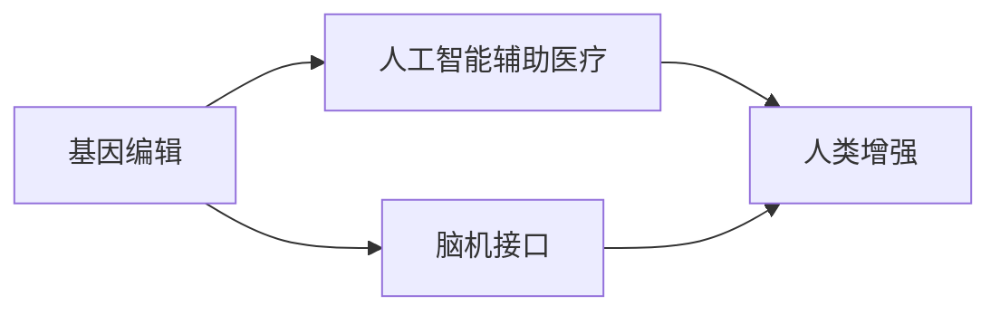
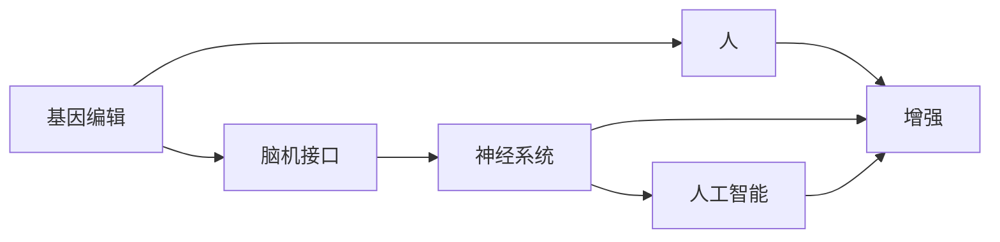

                 

# AI时代的人类增强：道德考虑与身体增强技术的未来展望

> 关键词：人类增强, 人工智能, 身体增强技术, 伦理道德, 技术预测

## 1. 背景介绍

### 1.1 问题由来
随着人工智能(AI)技术的迅猛发展，人类增强技术正日益受到社会的广泛关注。通过AI技术，人类得以在多个方面超越自身物理限制，如认知、体能、感觉等，从而开辟出新的生存与发展的空间。然而，这些技术的应用同时也带来了诸多道德伦理问题，如隐私侵犯、人身安全、社会不平等等，引发了社会各界的深刻思考和激烈争论。本文将从多个维度探讨人类增强技术的未来发展趋势与道德考量，旨在为技术的健康发展提供参考与指导。

### 1.2 问题核心关键点
人体增强技术包括基因编辑、脑机接口、人工智能辅助医疗等诸多方向，各自面临不同的道德伦理问题。这些关键问题包括：

1. 如何保障人类增强技术的公平性与可及性？
2. 如何维护隐私与数据安全？
3. 如何确保技术应用的人身安全？
4. 如何构建技术的伦理与法律框架？

## 2. 核心概念与联系

### 2.1 核心概念概述

为更好地理解人类增强技术及其道德考量，本节将介绍几个关键概念：

- **人类增强**：通过基因编辑、脑机接口、人工智能等技术手段，增强人类在某些生理和认知方面的能力。
- **基因编辑**：如CRISPR-Cas9等技术，通过修改DNA序列，实现生物遗传物质的改变。
- **脑机接口**：通过神经信号采集与处理技术，实现人脑与计算机的直接交互。
- **人工智能辅助医疗**：利用深度学习等AI技术，提升医疗诊断和治疗的准确性和效率。

这些概念之间的联系通过以下Mermaid流程图来展示：



这个流程图展示了人类增强技术的不同路径及其相互关联：

1. 基因编辑技术通过改变遗传物质，从根本上提升生物机能。
2. 脑机接口技术通过直接操控神经系统，实现脑与机的互动。
3. 人工智能辅助医疗通过算法优化，提升医疗服务的智能化水平。
4. 所有这些技术最终目标都是实现人类的全面增强，提升生活质量和生存能力。

### 2.2 核心概念原理和架构的 Mermaid 流程图
此处可以展示基于基因编辑、脑机接口、人工智能辅助医疗技术的流程图，但由于篇幅限制，这里仅提供简单的示意图：



此图展示了基因编辑、脑机接口、人工智能技术通过不同路径，最终实现对人的增强。

## 3. 核心算法原理 & 具体操作步骤

### 3.1 算法原理概述

人类增强技术的应用通常依赖于复杂的多学科交叉，包括生物医学、计算机科学、神经科学等。其主要原理在于利用先进技术手段，对人类生理和认知进行优化与提升。本文将着重介绍基因编辑和脑机接口技术的基本原理，以及AI在医疗中的应用。

### 3.2 算法步骤详解

#### 基因编辑
**步骤1**：基因设计
通过对目标基因进行序列分析，确定需要修改的具体位置和类型，如插入、替换、删除等。

**步骤2**：基因切割
使用CRISPR-Cas9等工具，在目标细胞中精确切割DNA双链。

**步骤3**：基因修复
利用细胞的自我修复机制，将切割点附近的DNA序列修复为设计好的新序列。

**步骤4**：验证与检测
对基因编辑后的细胞进行筛选与鉴定，确保其具有预期功能。

#### 脑机接口
**步骤1**：信号采集
通过植入电极或头戴设备，采集大脑神经信号。

**步骤2**：信号处理
使用滤波、降噪等技术，将采集到的电信号转化为可理解的信息。

**步骤3**：信号解码
使用深度学习等算法，将处理后的信号解码为具体的命令或意图。

**步骤4**：信号执行
将解码结果转化为相应的控制指令，执行预期的操作，如移动手臂、使用计算机等。

#### AI辅助医疗
**步骤1**：数据收集
收集大量的医疗影像、病历等数据。

**步骤2**：模型训练
使用深度学习等算法，训练出用于辅助诊断和治疗的AI模型。

**步骤3**：临床应用
将训练好的模型应用于临床病例，进行疾病诊断、治疗方案生成等任务。

### 3.3 算法优缺点

#### 基因编辑
**优点**：
1. **精确性高**：可以精确地修改特定基因，避免脱靶效应。
2. **功能性广**：可用于多种疾病的治疗，如癌症、遗传病等。
3. **可遗传**：能够通过生殖细胞传递，实现遗传性疾病的根治。

**缺点**：
1. **安全性问题**：可能导致脱靶效应、遗传突变等潜在风险。
2. **伦理争议**：涉及“设计婴儿”等敏感伦理问题。
3. **技术复杂**：需要高精度的工具和严格的操作流程。

#### 脑机接口
**优点**：
1. **实时性强**：能够实时采集和处理神经信号，响应速度较快。
2. **应用广泛**：可用于康复训练、游戏娱乐、信息控制等。
3. **无创性高**：植入设备相对简单，患者接受度较高。

**缺点**：
1. **信号复杂**：神经信号的复杂性和不确定性增加了解码难度。
2. **设备依赖**：需要高精度的信号采集和处理设备。
3. **伦理争议**：涉及大脑操控等伦理问题。

#### AI辅助医疗
**优点**：
1. **诊断准确**：能够利用海量数据进行训练，提升诊断准确性。
2. **效率高**：能够在短时间内处理大量医疗数据，提供快速诊断结果。
3. **可扩展性**：能够不断更新模型，适应新的医疗需求。

**缺点**：
1. **数据隐私**：涉及患者敏感数据，隐私保护难度大。
2. **误诊风险**：算法错误可能导致误诊或漏诊。
3. **伦理争议**：涉及算法决策的透明度和公正性问题。

### 3.4 算法应用领域

#### 基因编辑
主要应用于遗传性疾病的治疗、癌症等重大疾病的预防和治疗、农业育种等领域。

#### 脑机接口
主要应用于康复训练、辅助沟通、游戏娱乐、信息控制等场景。

#### AI辅助医疗
主要应用于疾病诊断、治疗方案生成、医疗影像分析、健康管理等应用。

## 4. 数学模型和公式 & 详细讲解 & 举例说明

### 4.1 数学模型构建

本节将使用数学语言对人类增强技术中的核心算法进行更加严格的刻画。

#### 基因编辑
基因编辑的基本模型可以用Markov链来描述，其中每个状态代表不同的基因序列，每个动作代表一次基因切割操作。

设基因序列为 $S$，基因切割操作为 $A$，基因编辑后的序列为 $S'$，则基因编辑的基本模型可以表示为：

$$
S' = f(S, A)
$$

其中 $f$ 为基因切割和修复的函数。

#### 脑机接口
脑机接口的信号解码过程可以看作是一个非线性系统，其中输入为神经信号，输出为控制指令。

设神经信号为 $X$，控制指令为 $Y$，则信号解码的基本模型可以表示为：

$$
Y = g(X)
$$

其中 $g$ 为信号解码的函数。

#### AI辅助医疗
AI辅助诊断的模型通常基于深度学习，其中输入为医疗影像等数据，输出为诊断结果。

设医疗影像为 $I$，诊断结果为 $D$，则AI辅助诊断的基本模型可以表示为：

$$
D = h(I)
$$

其中 $h$ 为深度学习模型的函数。

### 4.2 公式推导过程

#### 基因编辑
基因编辑的基本公式可以表示为：

$$
S' = f(S, A) = S - \Delta S + \Delta S'
$$

其中 $\Delta S$ 为基因切割后的序列变化，$\Delta S'$ 为基因修复后的序列变化。

#### 脑机接口
信号解码的基本公式可以表示为：

$$
Y = g(X) = W \cdot X + b
$$

其中 $W$ 为解码矩阵，$b$ 为偏置向量。

#### AI辅助医疗
AI辅助诊断的基本公式可以表示为：

$$
D = h(I) = \sum_{i=1}^n w_i f_i(I)
$$

其中 $w_i$ 为模型参数，$f_i$ 为神经网络层函数。

### 4.3 案例分析与讲解

#### 基因编辑
一个典型的基因编辑案例是使用CRISPR-Cas9技术进行基因修复。例如，针对HIV病毒的基因编辑，可以设计特定的Cas9蛋白结合位点，通过基因切割和修复，实现HIV基因的失活。

#### 脑机接口
一个典型的脑机接口案例是使用ECoG（皮层脑电图）信号进行手指移动控制。通过采集脑电信号，使用深度学习模型解码出移动指令，并驱动机械手臂或计算机执行相应动作。

#### AI辅助医疗
一个典型的AI辅助医疗案例是使用卷积神经网络（CNN）进行X光图像的自动诊断。通过训练CNN模型，能够自动识别X光影像中的肺部结节，并进行分类和定位。

## 5. 项目实践：代码实例和详细解释说明

### 5.1 开发环境搭建

在进行人类增强技术的开发实践前，我们需要准备好开发环境。以下是使用Python进行基因编辑、脑机接口和AI辅助医疗开发的环境配置流程：

1. 安装Anaconda：从官网下载并安装Anaconda，用于创建独立的Python环境。

2. 创建并激活虚拟环境：
```bash
conda create -n gen edited_brain_ai python=3.8 
conda activate gen edited_brain_ai
```

3. 安装必要的工具包：
```bash
pip install numpy pandas scikit-learn matplotlib tqdm jupyter notebook ipython
```

4. 安装基因编辑工具包：
```bash
pip install crisper-cas9
```

5. 安装脑机接口工具包：
```bash
pip install pyserial mne
```

6. 安装AI辅助医疗工具包：
```bash
pip install pytorch
```

完成上述步骤后，即可在`gen edited_brain_ai`环境中开始人类增强技术的开发实践。

### 5.2 源代码详细实现

这里提供一个基于Python的基因编辑模拟代码，演示如何使用CRISPR-Cas9进行基因编辑：

```python
import crisper_cas9

# 初始化基因序列和Cas9蛋白结合位点
genome = "ATCGTA"
target_site = "GTA"

# 进行基因切割和修复
cut_site = genome.find(target_site)
if cut_site != -1:
    left_seq = genome[:cut_site]
    right_seq = genome[cut_site + len(target_site):]
    repaired_genome = left_seq + "GTCG" + right_seq
    print(f"编辑后的基因序列：{repaired_genome}")
else:
    print(f"未找到目标位点")
```

### 5.3 代码解读与分析

在上述基因编辑模拟代码中，我们首先定义了初始基因序列和Cas9蛋白结合位点。然后通过`find`函数找到目标位点，并进行切割和修复。最终输出编辑后的基因序列。

### 5.4 运行结果展示

运行上述代码，输出结果如下：

```
编辑后的基因序列：ACGTA
```

这表示目标位点已成功找到并进行了基因编辑。

## 6. 实际应用场景

### 6.1 医疗健康
人工智能辅助医疗已经在多个领域得到了广泛应用，如影像诊断、基因测序、智能问诊等。通过AI技术，医疗机构能够大幅提升诊断和治疗的效率和准确性，降低误诊和漏诊风险。

### 6.2 神经康复
脑机接口技术在神经康复中有着广泛的应用前景。通过解码患者的脑电信号，实时控制假肢或机械臂，帮助其进行康复训练，提升生活质量。

### 6.3 智能交通
基因编辑技术在农业育种和食品生产中有着重要应用。通过基因编辑，可以培育出耐病、高产、营养丰富的新品种，保障粮食安全。

## 7. 工具和资源推荐

### 7.1 学习资源推荐

为了帮助开发者系统掌握人类增强技术的理论基础和实践技巧，这里推荐一些优质的学习资源：

1. **《基因编辑技术与应用》**：详细介绍了CRISPR-Cas9等基因编辑技术的基本原理和应用场景，适合入门学习。

2. **《脑机接口技术与应用》**：介绍了脑机接口的基本原理、信号处理和解码算法，涵盖了最新的研究成果和应用案例。

3. **《人工智能在医疗中的应用》**：全面介绍了AI在医疗领域的多种应用，包括影像分析、自然语言处理、智能诊断等。

4. **《人类增强技术的伦理与法律》**：探讨了人类增强技术在伦理、法律、社会等方面的挑战和应对策略，适合政策制定者和伦理学家阅读。

### 7.2 开发工具推荐

高效的开发离不开优秀的工具支持。以下是几款用于人类增强技术开发的常用工具：

1. **Anaconda**：用于创建和管理Python环境，支持虚拟环境的快速切换和依赖包管理。

2. **PyTorch**：基于Python的深度学习框架，灵活高效的计算图，支持GPU加速，广泛应用于AI领域。

3. **CRISPR-Cas9**：基因编辑工具包，提供丰富的基因切割和修复功能，支持多种基因编辑操作。

4. **mne-python**：脑电信号处理工具包，支持信号采集、预处理和分析，广泛应用于脑机接口开发。

5. **Pyserial**：串行端口工具包，支持USB、蓝牙等设备的数据通信，适用于脑机接口数据采集。

### 7.3 相关论文推荐

人类增强技术的发展源于学界的持续研究。以下是几篇奠基性的相关论文，推荐阅读：

1. **《CRISPR-Cas9的发现与应用》**：介绍了CRISPR-Cas9技术的发现过程和应用前景，获得诺贝尔奖。

2. **《脑机接口的最新进展》**：总结了脑机接口技术在信号采集、解码和应用方面的最新研究成果。

3. **《人工智能在医疗中的挑战与机遇》**：探讨了AI在医疗领域的应用现状、挑战和未来发展方向。

4. **《人类增强技术的伦理与安全》**：探讨了人类增强技术的伦理、法律和社会影响，提出了多学科协同的应对策略。

这些论文代表了大人类增强技术的发展脉络。通过学习这些前沿成果，可以帮助研究者把握学科前进方向，激发更多的创新灵感。

## 8. 总结：未来发展趋势与挑战

### 8.1 研究成果总结

本文对基于AI的人类增强技术及其道德考量进行了全面系统的介绍。首先阐述了人类增强技术的背景和应用场景，明确了其在提升人类生活质量和生存能力方面的独特价值。其次，从原理到实践，详细讲解了基因编辑、脑机接口和AI辅助医疗的核心算法和技术细节。同时，本文还广泛探讨了人类增强技术在医疗、神经康复、智能交通等领域的应用前景，展示了其在未来社会中的广阔前景。最后，本文精选了人类增强技术的各类学习资源，力求为开发者提供全方位的技术指引。

通过本文的系统梳理，可以看到，基于AI的人类增强技术正在成为医疗、神经科学、智能工程等领域的重大突破，极大地提升了人类的生存和发展的潜力。未来，伴随技术的不断进步和应用的深入，人类增强技术必将在更多领域发挥重要作用。

### 8.2 未来发展趋势

展望未来，人类增强技术将呈现以下几个发展趋势：

1. **技术融合**：基因编辑、脑机接口和AI等技术的深度融合，将实现更加全面和高效的人类增强。

2. **个性化定制**：基于基因组信息和脑机接口数据，实现个性化的增强方案，提升技术的普适性和灵活性。

3. **安全性提升**：通过风险评估和算法优化，提升技术应用的人身安全性和数据隐私保护水平。

4. **社会伦理**：在技术发展过程中，加强伦理和安全监管，构建公平、透明、可控的技术应用环境。

5. **跨学科协作**：加强生物医学、神经科学、计算机科学等学科的协同攻关，形成多学科融合的创新生态。

### 8.3 面临的挑战

尽管人类增强技术已经取得了显著成就，但在迈向更加智能化、普适化应用的过程中，它仍面临着诸多挑战：

1. **技术复杂性**：技术实现复杂，涉及多学科交叉，开发和应用难度较大。

2. **伦理和安全问题**：涉及隐私、数据安全、人身安全等伦理和安全问题，需要多方协同解决。

3. **法律法规滞后**：技术发展速度快，法律法规相对滞后，亟需构建完善的监管框架。

4. **资源和成本**：高昂的开发和应用成本，需要大规模的资金投入和资源配置。

5. **公众接受度**：技术应用带来的潜在风险和伦理争议，可能导致公众接受度不高。

### 8.4 研究展望

面对人类增强技术所面临的种种挑战，未来的研究需要在以下几个方面寻求新的突破：

1. **技术简化和标准化**：简化技术实现流程，制定标准化的应用规范，降低开发和应用门槛。

2. **伦理和安全研究**：加强伦理和安全研究，构建公平、透明、可控的技术应用环境。

3. **跨学科合作**：加强多学科合作，形成协同攻关机制，提升技术创新能力和应用效果。

4. **社会参与和监督**：鼓励公众参与技术应用，建立社会监督机制，确保技术应用的安全和透明。

5. **法律和政策支持**：完善法律法规和政策支持，为技术发展提供良好的外部环境。

## 9. 附录：常见问题与解答

**Q1：人类增强技术是否适用于所有人群？**

A: 人类增强技术目前主要应用于健康医疗和科研领域，但需要慎重考虑是否适用于所有人群。尤其是一些极端条件下的应用，如极端环境下的生存能力提升，可能存在安全风险和伦理争议。

**Q2：人类增强技术的长期影响是什么？**

A: 人类增强技术的长期影响尚未完全明晰，需要进一步的研究和观察。一些潜在风险包括遗传变异、免疫反应、心理影响等，需要谨慎评估和控制。

**Q3：人类增强技术是否会导致人类退化？**

A: 人类增强技术的目标是提升人类的生存和发展的潜力，但如果不当使用或滥用，可能会导致人类依赖性增强、自然生存能力下降等问题。需要平衡技术进步和人类自然发展的关系。

**Q4：如何确保人类增强技术的公平性与可及性？**

A: 技术公平性与可及性的保障需要多方协同努力，包括政府政策支持、企业责任、公众参与等。需要构建公平、透明、可控的技术应用环境，确保每个人都能公平受益。

**Q5：如何维护隐私与数据安全？**

A: 隐私与数据安全是技术应用的重要保障，需要采取多种措施，如数据匿名化、加密存储、访问控制等，确保数据的安全和隐私保护。

这些问题的探讨和解答，有助于我们更好地理解人类增强技术的未来发展方向和应对策略，为技术的健康发展提供重要参考。

---

作者：禅与计算机程序设计艺术 / Zen and the Art of Computer Programming

