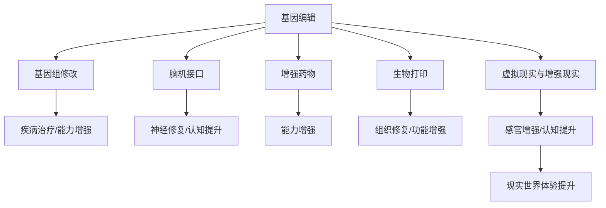

                 

## 1. 背景介绍

### 1.1 问题由来
随着人工智能技术的迅猛发展，其在提升人类生产效率、改善生活质量等方面的潜力日益显现。然而，在享受技术红利的同时，我们也需要深思其对人类道德伦理的冲击，特别是身体增强技术的应用。身体增强（Human Augmentation）涉及生物医学、工程学、伦理学等多个领域，包括基因编辑、脑机接口、增强药物等技术。这些技术不仅能显著提升人体能力，还可能带来前所未有的伦理挑战。本文旨在探讨身体增强技术在未来发展中可能面临的机遇与挑战，并提出相应的伦理考量。

### 1.2 问题核心关键点
本文重点关注以下几个问题：
- 身体增强技术的当前发展状态和未来趋势。
- 这些技术在提升人类能力方面的机遇。
- 潜在的伦理挑战，如技术滥用、社会不公等问题。
- 如何平衡技术发展与伦理道德。
- 政策制定与公众接受度。

### 1.3 问题研究意义
通过对身体增强技术的深入分析，我们可以更好地理解其对人类社会的影响，为制定合理的政策提供依据。同时，探讨如何在一个追求进步与维护伦理道德之间找到平衡点，对于构建一个负责任的科技社会具有重要意义。

## 2. 核心概念与联系

### 2.1 核心概念概述

身体增强技术涉及多个交叉学科领域，包括但不限于：

- **基因编辑**：利用CRISPR-Cas9等技术对基因组进行精确修改，实现对遗传疾病的治疗或增强特定能力。
- **脑机接口**：通过脑电信号与计算机的直接互动，实现对大脑功能的增强或替代，如神经修复、认知提升等。
- **增强药物**：利用化学、生物工程等手段，开发能够增强人体功能的药物，如认知增强剂、肌肉生长剂等。
- **生物打印**：通过3D打印技术打印人体组织、器官，用于修复或增强身体功能。
- **虚拟现实与增强现实**：通过虚拟环境或叠加信息增强对现实世界的感知与互动，提高人类体验和认知能力。

这些技术各自具备不同的应用场景和潜在影响，在伦理和社会影响方面也有各自的考量。

### 2.2 核心概念原理和架构的 Mermaid 流程图



这个流程图展示了身体增强技术的各个分支及其相互联系。基因编辑、脑机接口、增强药物、生物打印和虚拟现实与增强现实技术共同构成了未来身体增强的总体框架。

## 3. 核心算法原理 & 具体操作步骤

### 3.1 算法原理概述

身体增强技术的原理可以分为直接增强与间接增强两类。直接增强涉及直接对生物系统进行干预，如基因编辑和生物打印；间接增强则是通过外部设备或技术手段来提升身体功能，如脑机接口和增强药物。

在算法的实现上，通常包括以下几个关键步骤：

1. **数据收集与处理**：收集与目标功能增强相关的生理数据、行为数据等，进行预处理和特征提取。
2. **模型训练**：利用机器学习算法（如神经网络）对数据进行分析，寻找与目标功能增强的相关模式。
3. **算法实施**：根据训练得到的模型，对目标系统进行相应的增强干预。
4. **效果评估与迭代**：评估增强效果，根据反馈调整模型和算法，持续优化。

### 3.2 算法步骤详解

以基因编辑技术为例，其操作流程大致如下：

1. **靶点选择**：确定需要编辑的基因位点。
2. **设计编辑工具**：设计CRISPR-Cas9等基因编辑工具，确保特异性与准确性。
3. **导入工具到细胞**：通过病毒载体或电转等方法将编辑工具导入目标细胞。
4. **编辑验证**：通过PCR、测序等技术验证基因编辑的准确性。
5. **功能评估**：评估编辑后的细胞功能是否增强或恢复。

### 3.3 算法优缺点

基因编辑等身体增强技术具备以下优点：

- **高精准性**：能够精准定位和修改基因，减少不必要的副作用。
- **长效性**：基因编辑的效果往往是长期的，甚至可能遗传给下一代。
- **广泛应用前景**：可以用于治疗遗传性疾病、增强特定能力等，潜力巨大。

但同时也存在一些问题：

- **伦理争议**：基因编辑涉及基因干预，可能引发遗传问题和社会不公。
- **安全风险**：非特异性的编辑可能导致不可预知的副作用，甚至基因突变。
- **成本高昂**：高昂的技术开发和临床试验成本限制了其普及应用。

### 3.4 算法应用领域

身体增强技术在多个领域都有广泛应用：

- **医学**：治疗遗传性疾病、增强免疫系统等。
- **体育**：增强肌肉力量、提高认知能力等。
- **娱乐**：虚拟现实与增强现实，提供全新的感官体验。
- **军事**：增强士兵的感官和体能，提升战斗能力。
- **教育**：通过增强认知药物提高学习效率。

这些应用领域不仅展现了身体增强技术的强大潜力，也提示我们必须谨慎处理其伦理和法律问题。

## 4. 数学模型和公式 & 详细讲解 & 举例说明

### 4.1 数学模型构建

在身体增强的某些领域，如增强药物的开发，可以通过数学模型来优化药物设计。例如，利用计算机模拟药物与受体结合的过程，预测药物的药效和副作用。

设药物分子为M，靶标受体为R，相互作用能量为E。药物与受体的结合过程可以用以下数学模型描述：

$$ E = \Delta G_{off} + \Delta G_{bind} \cdot K_d $$

其中，$\Delta G_{off}$ 表示药物解离的自由能变化，$\Delta G_{bind}$ 表示药物结合的自由能变化，$K_d$ 表示解离常数。

### 4.2 公式推导过程

以CRISPR-Cas9技术为例，基因编辑的效果可以通过以下步骤推导：

1. **靶点选择**：确定需要编辑的基因位点。
2. **设计gRNA**：根据靶点设计向导RNA（gRNA）序列，引导Cas9酶到目标位点。
3. **导入工具**：将gRNA和Cas9酶导入目标细胞。
4. **编辑验证**：通过PCR、测序等技术验证基因编辑的准确性。

### 4.3 案例分析与讲解

以基因编辑技术为例，其案例分析如下：

- **案例**：利用CRISPR-Cas9技术编辑人类胚胎中的SCN5A基因，治疗先天性心律不齐。
- **分析**：该案例展示了基因编辑技术在治疗遗传疾病方面的潜力。但由于基因编辑的长期影响和伦理争议，这类技术的应用受到严格监管。

## 5. 项目实践：代码实例和详细解释说明

### 5.1 开发环境搭建

为了进行基因编辑相关的实验，我们需要搭建相应的开发环境。

1. **安装Python**：确保系统中安装了Python 3.x版本。
2. **安装CRISPR相关库**：如CRISPR-Cas9-Python等库，用于设计和分析基因编辑工具。
3. **配置生物信息学工具**：如Blast、Clustal等，用于基因组分析。

### 5.2 源代码详细实现

以下是一个简化的基因编辑设计的Python代码示例：

```python
from crispr import CRISPR, gRNA, Cas9

# 定义靶点
target = "ATCGGTTG"

# 设计gRNA
gRNA = gRNA(target)

# 导入Cas9酶
cas9 = Cas9()

# 开始编辑
result = cas9.guide(gRNA, target)

# 输出结果
print(result)
```

### 5.3 代码解读与分析

上述代码主要实现了以下功能：

- **靶点选择**：定义需要编辑的基因序列。
- **设计gRNA**：根据靶点设计向导RNA序列。
- **导入Cas9酶**：使用CRISPR库中的Cas9类导入Cas9酶。
- **开始编辑**：调用Cas9的guide方法进行基因编辑。
- **输出结果**：打印编辑结果。

## 6. 实际应用场景

### 6.1 医疗健康

**应用场景**：
- **遗传病治疗**：通过基因编辑技术修复致病基因，治愈遗传性疾病。
- **器官修复**：利用生物打印技术打印出受损器官，进行组织修复和再生。

**前景展望**：
- **未来发展**：随着技术的成熟和伦理的规范化，基因编辑和生物打印技术有望广泛应用于器官移植和个性化医疗。
- **面临挑战**：高昂的成本和严格的伦理监管仍是主要障碍。

### 6.2 体育竞技

**应用场景**：
- **增强肌肉力量**：利用增强药物和基因编辑技术提升运动员的肌肉力量和耐力。
- **提升认知能力**：通过增强药物提高运动员的注意力和反应速度。

**前景展望**：
- **未来发展**：体育竞技中引入身体增强技术，将极大提升比赛水平和观赏性。
- **面临挑战**：伦理争议和技术滥用风险需要严格监管。

### 6.3 娱乐休闲

**应用场景**：
- **虚拟现实体验**：通过虚拟现实和增强现实技术，提供沉浸式的娱乐体验。
- **感官增强**：利用增强药物提升感官体验，如视觉、听觉等。

**前景展望**：
- **未来发展**：虚拟现实和增强现实技术将成为娱乐行业的新常态。
- **面临挑战**：技术普及和设备成本问题需要解决。

### 6.4 军事安全

**应用场景**：
- **增强士兵能力**：利用基因编辑和脑机接口技术增强士兵的感官和体能。
- **信息作战**：利用增强现实和脑机接口技术，提高信息接收和处理速度。

**前景展望**：
- **未来发展**：身体增强技术将极大提升军事作战能力。
- **面临挑战**：伦理争议和战争伦理问题需要关注。

## 7. 工具和资源推荐

### 7.1 学习资源推荐

1. **《基因编辑技术基础》**：全面介绍基因编辑技术的原理和应用。
2. **《脑机接口原理与应用》**：讲解脑机接口技术的基本原理和应用场景。
3. **《药物设计与优化》**：介绍药物设计的数学模型和优化方法。
4. **Coursera《生物信息学基础》课程**：系统学习生物信息学的基础知识和技能。

### 7.2 开发工具推荐

1. **Python**：广泛应用的编程语言，拥有丰富的科学计算库和生物信息学工具。
2. **CRISPR-Cas9-Python**：用于设计和分析基因编辑工具的Python库。
3. **Blast**：生物信息学中最常用的序列比对工具之一。
4. **Clustal**：序列比对工具，用于基因序列分析和比较。

### 7.3 相关论文推荐

1. **《CRISPR-Cas9基因编辑系统研究进展》**：总结CRISPR-Cas9技术的最新研究进展。
2. **《脑机接口技术发展与未来展望》**：分析脑机接口技术的发展现状和未来方向。
3. **《药物设计中的数学建模与优化》**：介绍药物设计的数学模型和优化算法。
4. **《虚拟现实与增强现实技术综述》**：系统总结虚拟现实和增强现实技术的发展和应用。

## 8. 总结：未来发展趋势与挑战

### 8.1 总结

本文对未来身体增强技术的发展趋势进行了全面分析。通过介绍基因编辑、脑机接口、增强药物等技术，探讨了其在医疗健康、体育竞技、娱乐休闲和军事安全等领域的应用前景。同时，我们也在探讨这些技术面临的伦理和法律挑战，提出了相应的应对措施。

### 8.2 未来发展趋势

未来身体增强技术的发展将呈现出以下几个趋势：

- **技术融合**：跨学科的融合将推动技术创新，如基因编辑与脑机接口的结合。
- **伦理规范**：随着技术的发展，伦理规范和法律框架将日益完善，指导技术应用。
- **普及应用**：随着技术成本的降低和应用场景的拓展，身体增强技术将逐渐普及。

### 8.3 面临的挑战

尽管身体增强技术前景广阔，但仍面临以下挑战：

- **伦理争议**：基因编辑和增强药物可能引发伦理争议和社会不公。
- **技术滥用**：缺乏监管的技术可能被滥用于非法目的。
- **社会公平**：技术的不公平应用可能导致新的社会分层。
- **安全性**：技术的安全性和长期效果仍需验证。

### 8.4 研究展望

为应对这些挑战，未来的研究需要在以下方面寻求突破：

- **伦理审查机制**：建立完善的伦理审查机制，确保技术应用的合法性和安全性。
- **公众参与与教育**：加强公众对新技术的理解和接受，建立良好的社会共识。
- **技术监管与标准化**：制定统一的技术标准和监管政策，规范技术应用。
- **跨学科合作**：促进科技、医学、伦理学等领域的合作，共同推进技术发展。

## 9. 附录：常见问题与解答

### Q1: 基因编辑技术的安全性和伦理问题如何解决？

**A**：解决基因编辑的安全性和伦理问题需要多方面的努力：

1. **严格监管**：建立严格的监管机制，确保技术的合法应用。
2. **科学验证**：通过严谨的实验和临床试验，验证技术的安全性和有效性。
3. **公众参与**：加强公众对基因编辑的认识和理解，促进社会共识的形成。
4. **国际合作**：全球范围内建立合作机制，共同制定和执行伦理规范。

### Q2: 如何应对脑机接口技术的伦理争议？

**A**：脑机接口技术的伦理争议主要集中在隐私、隐私泄露和误用方面，解决方式包括：

1. **数据保护**：加强数据保护措施，确保用户隐私不受侵害。
2. **透明性**：提高技术的透明度，让公众了解技术的原理和应用范围。
3. **伦理审查**：建立伦理审查机制，确保技术应用符合伦理规范。
4. **法律框架**：制定相应的法律法规，规范技术应用和监管。

### Q3: 增强药物的滥用问题如何解决？

**A**：增强药物的滥用问题需要通过以下措施来解决：

1. **严格管控**：加强对增强药物的管控，确保其仅用于合法和合乎道德的用途。
2. **医学监督**：由医疗专业人员监管药物的使用，避免滥用和误用。
3. **公众教育**：加强对公众的宣传教育，提高对增强药物的认识和防范意识。
4. **法律规范**：制定法律规范，明确增强药物的使用范围和监管机制。

### Q4: 虚拟现实与增强现实技术如何避免沉迷问题？

**A**：虚拟现实与增强现实技术的沉迷问题可以通过以下措施解决：

1. **时间管理**：制定合理的使用时间，避免过度使用。
2. **内容分级**：对虚拟现实和增强现实内容进行分级，保护未成年人。
3. **心理辅导**：提供心理辅导和干预，帮助用户控制使用习惯。
4. **技术限制**：设计技术限制措施，防止过度沉迷。

---

作者：禅与计算机程序设计艺术 / Zen and the Art of Computer Programming

