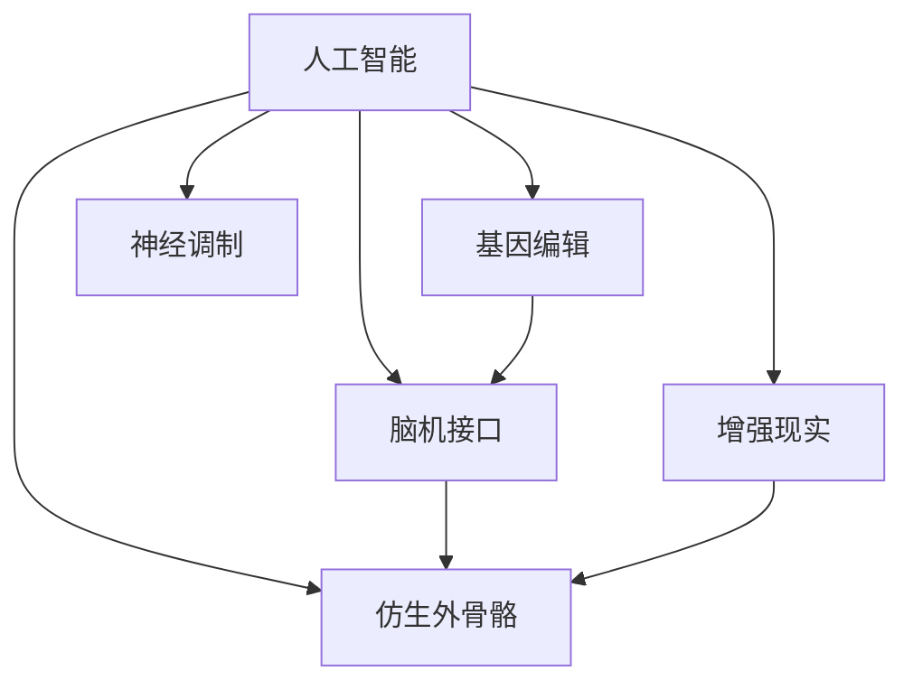

                 

# AI时代的人类增强：道德考虑与身体增强的未来发展机遇挑战机遇

> 关键词：人工智能,人类增强,身体增强,伦理道德,基因编辑,生物医疗

## 1. 背景介绍

### 1.1 问题由来
随着人工智能技术的飞速发展，尤其是深度学习、机器视觉和自然语言处理等技术的突破，人类在增强自身能力的道路上开启了新篇章。越来越多的技术手段被应用到身体增强领域，如基因编辑、脑机接口、仿生外骨骼等。这些技术为人类的身体机能提升、疾病治疗和健康改善提供了新的可能。

然而，与此同时，人体增强技术也引发了一系列伦理道德问题。如何确保技术的公正性、安全性、可控性，避免滥用和误用，成为一个亟待解决的关键问题。

### 1.2 问题核心关键点
在AI时代，人体增强技术面临的核心挑战主要包括：

- **伦理道德边界**：如何在提升人类能力和保障伦理道德之间找到平衡点。
- **安全性与可控性**：如何确保增强技术的安全使用，避免潜在的健康风险和滥用风险。
- **技术普及与公平性**：如何确保技术的普惠性，避免技术资源的不平等分配。
- **隐私保护与数据安全**：如何保护参与者隐私和数据安全，防止数据泄露和滥用。
- **监管政策与法律法规**：如何在技术快速发展与法规制定之间保持同步，形成有效的监管框架。

这些关键点共同构成了当前人体增强技术的核心问题，需要通过技术创新、政策制定和社会共识等多种手段来解决。

### 1.3 问题研究意义
研究AI时代的人体增强技术，不仅有助于提升人类健康和能力，还可以推动生物医学、工程学、伦理学等多学科的交叉融合，为未来的科技发展和社会进步提供重要支持。

- **推动生物医学发展**：通过基因编辑、细胞治疗等手段，可以解决部分遗传性疾病和疾病难题。
- **促进工程学创新**：人工智能技术在仿生学、生物机械等领域的创新应用，将为工程学带来新的方向和挑战。
- **推动伦理道德进步**：通过技术讨论和伦理反思，引导社会对于人类增强技术的健康发展和合理应用形成共识。
- **促进社会公平与包容**：通过技术普及，减少社会不平等，提升全体公民的福祉。

总之，研究人体增强技术对于推动科技发展、改善人类福祉和社会进步具有重要意义。

## 2. 核心概念与联系

### 2.1 核心概念概述

为了更好地理解AI时代人体增强技术的伦理道德和应用前景，本节将介绍几个密切相关的核心概念：

- **人工智能（AI）**：利用算法和模型，通过数据驱动的方式模拟和扩展人类智能的技术。
- **基因编辑（Gene Editing）**：利用CRISPR-Cas9等技术手段，修改生物体的DNA序列，实现特定基因的增加、删除或替换。
- **脑机接口（Brain-Computer Interface, BCI）**：通过信号采集和数据分析，实现人脑与计算机之间的信息交互。
- **仿生外骨骼（Bionic Exoskeleton）**：通过机械和电子技术，增强人类的运动能力和生理机能。
- **增强现实（Augmented Reality, AR）**：通过虚拟信息叠加，增强人类对现实世界的感知和互动能力。
- **神经调制（Neural Modulation）**：通过药物、电流等方式，调节大脑活动和认知功能。

这些核心概念之间的逻辑关系可以通过以下Mermaid流程图来展示：



这个流程图展示了大语言模型的核心概念及其之间的关系：

1. 人工智能作为技术基础，对基因编辑、脑机接口等技术进行驱动和应用。
2. 基因编辑、脑机接口、仿生外骨骼等技术，共同构成了人体增强的多种手段。
3. 增强现实、神经调制等技术，与上述技术相互结合，进一步增强人体感知和认知能力。

## 3. 核心算法原理 & 具体操作步骤
### 3.1 算法原理概述

人工智能技术在人体增强领域的应用，主要通过数据驱动和模型优化来实现。其核心思想是：通过收集大量的生物医学数据、行为数据等，利用深度学习等算法，构建出能够模拟和增强人体机能的模型。

形式化地，假设有一个生物医学数据集 $D=\{(x_i,y_i)\}_{i=1}^N$，其中 $x_i$ 表示输入的生物特征、行为数据等，$y_i$ 表示对应的输出结果（如身体增强的效果）。则利用深度学习算法，构建模型 $M_{\theta}$，最小化损失函数 $\mathcal{L}$，使得模型能够预测新的输入数据的输出结果：

$$
\hat{y} = M_{\theta}(x)
$$

其中，$\theta$ 为模型参数。通过反向传播算法等优化算法，不断更新模型参数 $\theta$，最小化损失函数 $\mathcal{L}$，最终得到适应特定任务或目标的模型。

### 3.2 算法步骤详解

基于人工智能技术的人体增强，一般包括以下几个关键步骤：

**Step 1: 数据收集与预处理**
- 收集与人体增强相关的生物医学数据、行为数据等，划分为训练集、验证集和测试集。
- 对数据进行预处理，包括数据清洗、归一化、特征提取等操作，以便模型训练。

**Step 2: 模型构建与训练**
- 选择合适的深度学习模型（如CNN、RNN、Transformer等），根据任务需求进行构建。
- 设置模型的超参数，如学习率、批大小、迭代轮数等。
- 使用优化算法（如Adam、SGD等），在训练集上进行模型训练，最小化损失函数。

**Step 3: 模型评估与优化**
- 在验证集上评估模型的性能，选择最优模型进行测试集上的最终测试。
- 使用交叉验证、网格搜索等方法，优化模型的超参数，提升模型性能。
- 进行模型部署，实现人体增强功能的落地应用。

### 3.3 算法优缺点

基于人工智能技术的人体增强方法具有以下优点：

1. **高效性**：通过大量数据的训练，模型能够快速学习并预测新的增强效果，提升效率。
2. **通用性**：深度学习模型具有很强的泛化能力，可以应用于多种人体增强任务，如基因编辑、脑机接口等。
3. **可解释性**：深度学习模型的决策过程透明，便于理解和解释。

同时，该方法也存在一定的局限性：

1. **依赖数据质量**：模型性能高度依赖于数据的质量和数量，数据不足或质量不佳会影响模型效果。
2. **模型复杂性**：深度学习模型往往较为复杂，训练和部署成本较高。
3. **技术门槛高**：需要具备深度学习和数据分析等专业知识，对技术门槛较高。

尽管存在这些局限性，但就目前而言，基于人工智能的人体增强方法仍是大规模应用的主流范式。未来相关研究的重点在于如何进一步降低技术门槛，提高模型性能，同时兼顾伦理和安全因素。

### 3.4 算法应用领域

基于人工智能技术的人体增强方法，在多个领域得到了广泛的应用，包括但不限于：

- **基因编辑**：利用深度学习模型对基因编辑效果进行预测和优化，提高基因编辑的安全性和准确性。
- **脑机接口**：通过深度学习模型对脑电信号进行分析，实现人脑与计算机之间的信息交互。
- **仿生外骨骼**：利用深度学习模型对运动数据进行预测和优化，提升仿生外骨骼的稳定性和舒适性。
- **增强现实**：通过深度学习模型对虚拟信息进行优化，增强人类对现实世界的感知和互动能力。
- **神经调制**：利用深度学习模型对神经信号进行分析和预测，调节大脑活动和认知功能。

除了上述这些经典应用外，人工智能技术在人体增强领域的应用还在不断创新，如智能假肢、生物传感、健康监测等，为人类的生活品质提升带来了新的可能性。

## 4. 数学模型和公式 & 详细讲解 & 举例说明

### 4.1 数学模型构建

为了更好地理解基于人工智能技术的人体增强方法，本节将介绍几个关键的数学模型和公式。

假设有一组基因编辑数据 $D=\{(x_i,y_i)\}_{i=1}^N$，其中 $x_i$ 表示基因序列，$y_i$ 表示编辑效果。则可以利用回归模型来预测基因编辑的效果，具体如下：

$$
y_i = f(x_i;\theta) + \epsilon_i
$$

其中 $f(x_i;\theta)$ 为回归模型，$\epsilon_i$ 为噪声项。回归模型可以通过多种算法构建，如线性回归、多项式回归、神经网络等。

### 4.2 公式推导过程

以线性回归模型为例，推导其在人体增强中的应用：

设回归模型为：

$$
y_i = \theta_0 + \theta_1x_{i1} + \theta_2x_{i2} + \cdots + \theta_kx_{ik} + \epsilon_i
$$

其中 $\theta_j$ 为模型参数，$x_{ij}$ 为输入变量。通过对数据集 $D$ 进行最小二乘法拟合，得到：

$$
\hat{\theta} = \mathop{\arg\min}_{\theta} \frac{1}{N}\sum_{i=1}^N (y_i - f(x_i;\theta))^2
$$

解得最优参数 $\hat{\theta}$，从而得到回归模型：

$$
\hat{y} = f(x;\hat{\theta}) = \hat{\theta}_0 + \hat{\theta}_1x_{1} + \hat{\theta}_2x_{2} + \cdots + \hat{\theta}_kx_{k}
$$

### 4.3 案例分析与讲解

以基因编辑为例，分析深度学习模型在其中的应用：

假设有一组基因编辑数据 $D=\{(x_i,y_i)\}_{i=1}^N$，其中 $x_i$ 表示基因序列，$y_i$ 表示编辑效果。利用深度学习模型对基因编辑效果进行预测，具体如下：

1. **数据预处理**：对基因序列进行标准化处理，提取特征。
2. **模型构建**：选择深度神经网络模型，如卷积神经网络（CNN）、循环神经网络（RNN）等。
3. **模型训练**：利用反向传播算法对模型进行训练，最小化损失函数。
4. **模型评估**：在验证集上评估模型性能，选择最优模型进行测试集上的最终测试。
5. **模型应用**：将训练好的模型应用于新的基因编辑任务中，预测编辑效果。

## 5. 项目实践：代码实例和详细解释说明

### 5.1 开发环境搭建

在进行人体增强技术的研究和开发前，我们需要准备好开发环境。以下是使用Python进行TensorFlow开发的环境配置流程：

1. 安装Anaconda：从官网下载并安装Anaconda，用于创建独立的Python环境。

2. 创建并激活虚拟环境：
```bash
conda create -n tf-env python=3.8 
conda activate tf-env
```

3. 安装TensorFlow：根据CUDA版本，从官网获取对应的安装命令。例如：
```bash
conda install tensorflow tensorflow-gpu -c conda-forge
```

4. 安装相关库：
```bash
pip install numpy pandas scikit-learn matplotlib tensorflow-datasets
```

完成上述步骤后，即可在`tf-env`环境中开始人体增强技术的开发。

### 5.2 源代码详细实现

下面我们以基因编辑预测为例，给出使用TensorFlow进行基因编辑效果预测的代码实现。

首先，定义基因编辑数据集：

```python
import numpy as np
from tensorflow import keras

# 假设有20个基因编辑样本，每个样本有10个特征
x_train = np.random.rand(20, 10)
y_train = np.random.rand(20)

# 构建数据集对象
train_dataset = keras.utils.data新生数据集(x_train, y_train, batch_size=4)
```

然后，定义模型并训练：

```python
from tensorflow.keras import layers

# 定义线性回归模型
model = keras.Sequential([
    layers.Dense(16, input_shape=(10, ), activation='relu'),
    layers.Dense(1)
])

# 定义损失函数和优化器
model.compile(loss='mse', optimizer='adam')

# 训练模型
model.fit(train_dataset, epochs=100)
```

最后，使用训练好的模型进行预测：

```python
# 定义新的基因编辑样本
x_test = np.random.rand(5, 10)

# 使用训练好的模型进行预测
y_pred = model.predict(x_test)
print(y_pred)
```

以上就是使用TensorFlow进行基因编辑效果预测的完整代码实现。可以看到，TensorFlow提供了强大的深度学习框架，使得模型的构建、训练和预测变得简单高效。

### 5.3 代码解读与分析

让我们再详细解读一下关键代码的实现细节：

**数据预处理**：
- `numpy`库用于生成随机数据。在实际应用中，应该使用真实基因编辑数据。

**模型构建**：
- `keras.Sequential`用于构建线性回归模型，包含两个全连接层，其中第一个层有16个神经元，激活函数为ReLU。
- `input_shape`指定输入数据的维度，即基因序列的长度。

**模型训练**：
- `compile`方法用于指定损失函数和优化器。
- `fit`方法用于训练模型，通过反向传播算法不断更新模型参数，最小化损失函数。

**模型预测**：
- `predict`方法用于对新基因编辑样本进行预测，得到编辑效果。

可以看出，TensorFlow提供了便捷的API接口，使得模型的构建、训练和预测变得简单明了。开发者可以根据实际应用需求，灵活选择模型结构，优化训练过程，提升预测性能。

## 6. 实际应用场景
### 6.1 智能假肢

基于深度学习技术的人体增强，可以应用于智能假肢的开发。传统假肢往往只能实现基本的运动功能，缺乏智能感知和自适应能力。通过深度学习技术，可以训练假肢的智能感知系统，使其能够根据用户的行为数据进行自适应调节，提升假肢的舒适性和可控性。

在技术实现上，可以收集用户穿戴假肢时的运动数据、肌电信号等，利用深度学习模型训练智能感知系统。训练好的模型可以对用户的动作进行识别和预测，实时调整假肢的参数设置，使得假肢能够更加智能地辅助用户行动。

### 6.2 健康监测

深度学习技术在人体增强领域还可以应用于健康监测。通过穿戴式设备收集用户的生理数据，利用深度学习模型进行数据分析，预测用户的健康状况，提供健康建议和预警。

具体而言，可以收集用户的生理指标、运动数据、环境数据等，利用深度学习模型构建健康监测模型。训练好的模型可以对用户的健康状况进行实时监测，提供个性化的健康建议，如饮食、运动等方面的指导，及时预警潜在健康问题。

### 6.3 脑机接口

脑机接口技术将深度学习技术与人脑的神经信号分析相结合，实现了人脑与计算机之间的信息交互。通过深度学习模型对脑电信号进行分析，可以将用户的思想和命令转化为计算机的指令，实现智能控制、虚拟现实等应用。

在技术实现上，可以收集用户的脑电信号数据，利用深度学习模型训练神经信号分析模型。训练好的模型可以对脑电信号进行分析和预测，实现对人脑命令的识别和解码，从而实现人机交互。

### 6.4 未来应用展望

随着深度学习技术的不断进步，基于人工智能的人体增强技术将呈现出以下几个发展趋势：

1. **技术融合加速**：未来的增强技术将更加注重与其他技术的融合，如脑机接口与神经调制、增强现实与基因编辑等，形成更全面、多功能的人体增强系统。
2. **个性化定制**：通过深度学习模型对用户数据进行分析和预测，实现个性化定制的增强方案，满足用户的个性化需求。
3. **实时性提升**：随着计算资源和硬件设备的提升，深度学习模型将能够实现实时性增强，提升用户体验。
4. **数据安全保障**：随着数据隐私和安全问题的日益突出，未来的增强技术将更加注重数据隐私保护和安全性，防止数据泄露和滥用。

以上趋势展示了深度学习技术在人体增强领域的巨大潜力和发展方向，为未来的技术应用提供了新的方向和机遇。

## 7. 工具和资源推荐
### 7.1 学习资源推荐

为了帮助开发者系统掌握深度学习技术在人体增强中的应用，这里推荐一些优质的学习资源：

1. **《深度学习》课程**：由斯坦福大学开设的深度学习课程，涵盖了深度学习的基本概念和常用算法，适合初学者学习。
2. **TensorFlow官方文档**：TensorFlow官方提供的文档和教程，提供了详细的API接口和示例代码，是学习TensorFlow的必备资源。
3. **Keras官方文档**：Keras官方提供的文档和教程，提供了简洁易用的API接口和示例代码，适合初学者快速上手。
4. **CS229《机器学习》课程**：斯坦福大学开设的机器学习课程，涵盖了机器学习的基本概念和常用算法，适合进一步深造。
5. **Deep Learning Specialization**：由Andrew Ng教授主持的深度学习专项课程，涵盖了深度学习的基础理论和应用实践，适合深入学习。

通过对这些资源的学习实践，相信你一定能够快速掌握深度学习技术在人体增强中的应用，并用于解决实际的增强问题。

### 7.2 开发工具推荐

高效的开发离不开优秀的工具支持。以下是几款用于深度学习技术在人体增强领域开发的常用工具：

1. **TensorFlow**：由Google主导开发的深度学习框架，支持多种计算设备，提供丰富的API接口和优化工具。
2. **Keras**：基于TensorFlow的高级深度学习库，提供简洁易用的API接口，适合初学者快速上手。
3. **PyTorch**：Facebook开源的深度学习框架，提供灵活的计算图和丰富的优化工具，适合研究和实验。
4. **Caffe**：由加州大学伯克利分校开发的深度学习框架，适用于图像和视频处理，支持GPU加速。
5. **MXNet**：由Apache基金会维护的深度学习框架，支持多种计算设备，提供灵活的计算图和优化工具。

合理利用这些工具，可以显著提升深度学习技术在人体增强领域的开发效率，加快创新迭代的步伐。

### 7.3 相关论文推荐

深度学习技术在人体增强领域的应用，源于学界的持续研究。以下是几篇奠基性的相关论文，推荐阅读：

1. **深度学习在医学影像中的应用**：利用深度学习模型对医学影像进行分类和分析，提高疾病的早期诊断和治疗效果。
2. **神经网络在脑机接口中的应用**：利用深度学习模型对脑电信号进行分析，实现人脑与计算机之间的信息交互。
3. **基因编辑技术的深度学习应用**：利用深度学习模型对基因编辑效果进行预测和优化，提高基因编辑的安全性和准确性。
4. **增强现实技术在医疗中的应用**：利用深度学习模型对增强现实场景进行优化，提升医疗可视化和交互体验。
5. **深度学习在健康监测中的应用**：利用深度学习模型对生理数据进行分析，提供健康建议和预警。

这些论文代表了大规模学习技术在人体增强领域的发展脉络。通过学习这些前沿成果，可以帮助研究者把握学科前进方向，激发更多的创新灵感。

## 8. 总结：未来发展趋势与挑战

### 8.1 总结

本文对基于深度学习技术的人体增强技术进行了全面系统的介绍。首先阐述了AI时代人体增强技术的背景和意义，明确了深度学习在提升人类能力和保障伦理道德方面的独特价值。其次，从原理到实践，详细讲解了深度学习模型在基因编辑、脑机接口等任务中的应用，给出了基于TensorFlow的代码实现。同时，本文还广泛探讨了深度学习技术在智能假肢、健康监测、脑机接口等多个行业领域的应用前景，展示了深度学习技术在人体增强领域的巨大潜力和发展方向。

通过本文的系统梳理，可以看到，基于深度学习的人体增强技术正在成为AI时代的重要范式，极大地提升了人类健康和能力，推动了多学科的交叉融合。未来，伴随深度学习技术的不断进步，人体增强技术将变得更加高效、智能和普惠，为社会的全面进步带来新的机遇和挑战。

### 8.2 未来发展趋势

展望未来，深度学习技术在人体增强领域将呈现以下几个发展趋势：

1. **技术融合加速**：未来的增强技术将更加注重与其他技术的融合，如脑机接口与神经调制、增强现实与基因编辑等，形成更全面、多功能的人体增强系统。
2. **个性化定制**：通过深度学习模型对用户数据进行分析和预测，实现个性化定制的增强方案，满足用户的个性化需求。
3. **实时性提升**：随着计算资源和硬件设备的提升，深度学习模型将能够实现实时性增强，提升用户体验。
4. **数据安全保障**：随着数据隐私和安全问题的日益突出，未来的增强技术将更加注重数据隐私保护和安全性，防止数据泄露和滥用。
5. **伦理道德规范**：未来的增强技术将更加注重伦理道德规范，确保技术的公正性、安全性、可控性，避免滥用和误用。

以上趋势展示了深度学习技术在人体增强领域的巨大潜力和发展方向，为未来的技术应用提供了新的方向和机遇。

### 8.3 面临的挑战

尽管深度学习技术在人体增强领域取得了瞩目成就，但在迈向更加智能化、普适化应用的过程中，它仍面临着诸多挑战：

1. **伦理道德争议**：深度学习技术在提升人类能力的同时，也引发了一系列伦理道德问题，如基因编辑技术的滥用、脑机接口的隐私保护等。
2. **技术复杂性**：深度学习模型往往较为复杂，训练和部署成本较高，需要具备较高的技术门槛。
3. **数据隐私安全**：深度学习技术在应用过程中需要大量的用户数据，如何保护用户隐私和数据安全，防止数据泄露和滥用，是一个重要的挑战。
4. **公平性和可访问性**：深度学习技术的应用往往依赖于高质量的数据和计算资源，如何确保技术的公平性、可访问性和普惠性，是一个重要的社会问题。
5. **技术可解释性**：深度学习模型的决策过程透明性较差，如何提高模型的可解释性和可理解性，是一个重要的研究方向。

这些挑战凸显了深度学习技术在人体增强领域的应用复杂性和社会责任。未来需要在技术创新、政策制定和社会共识等多个方面共同努力，才能推动深度学习技术在人体增强领域的健康发展。

### 8.4 研究展望

面对深度学习技术在人体增强领域所面临的种种挑战，未来的研究需要在以下几个方面寻求新的突破：

1. **技术伦理规范**：建立深度学习技术的伦理规范和标准，确保技术的公正性、安全性、可控性，避免滥用和误用。
2. **数据隐私保护**：开发数据隐私保护技术，确保用户数据的隐私和安全，防止数据泄露和滥用。
3. **技术普及与公平性**：推动深度学习技术的普及和公平性，确保技术资源的普惠性，缩小技术鸿沟。
4. **技术可解释性**：开发可解释性技术，提高深度学习模型的透明性和可理解性，增强系统的可靠性和可信度。
5. **技术融合与创新**：推动深度学习技术与多学科的交叉融合，推动技术创新和应用创新，拓展人体增强技术的应用边界。

这些研究方向将引领深度学习技术在人体增强领域的健康发展，为社会的全面进步带来新的机遇和挑战。

## 9. 附录：常见问题与解答

**Q1：深度学习在人体增强技术中的应用，是否会带来新的伦理道德问题？**

A: 深度学习技术在人体增强中的应用，确实带来了一些新的伦理道德问题。如基因编辑技术可能引发基因多样性的减少、遗传疾病的增加等问题。脑机接口技术可能带来隐私泄露、信息安全等问题。因此，在技术应用过程中，需要建立伦理规范和法律框架，确保技术的公正性、安全性、可控性。

**Q2：深度学习在人体增强技术中，如何确保数据隐私和安全？**

A: 深度学习技术在人体增强中的应用，需要大量的用户数据进行训练和测试。为了确保数据隐私和安全，可以采用数据匿名化、差分隐私等技术手段，防止数据泄露和滥用。此外，还需要建立严格的数据访问权限和隐私保护措施，确保数据在传输和存储过程中的安全。

**Q3：深度学习在人体增强技术中，如何实现个性化定制？**

A: 深度学习技术在人体增强中的应用，可以通过对用户数据的分析和预测，实现个性化定制的增强方案。具体而言，可以收集用户的生理数据、行为数据等，利用深度学习模型构建用户画像，根据用户画像提供个性化的增强方案。这样可以满足用户的个性化需求，提升用户体验。

**Q4：深度学习在人体增强技术中，如何确保技术的公平性和普惠性？**

A: 深度学习技术在人体增强中的应用，需要确保技术的公平性和普惠性，避免技术资源的不平等分配。可以采用公开数据集、开源算法等措施，推动技术的普及和普惠。同时，还需要建立公平的政策和标准，确保技术应用的公正性。

**Q5：深度学习在人体增强技术中，如何提高技术的可解释性？**

A: 深度学习模型的决策过程透明性较差，难以解释其内部工作机制和决策逻辑。为了提高模型的可解释性，可以采用可解释性技术，如局部可解释性模型、可视化工具等，帮助用户理解和信任深度学习模型。同时，还需要建立透明的数据来源和算法标准，确保技术的可靠性和可信度。

总之，深度学习技术在人体增强领域的应用，既有巨大的潜力，也面临诸多挑战。只有在技术创新、政策制定和社会共识等多个方面共同努力，才能推动深度学习技术在人体增强领域的健康发展，为社会的全面进步带来新的机遇和挑战。

---

作者：禅与计算机程序设计艺术 / Zen and the Art of Computer Programming

