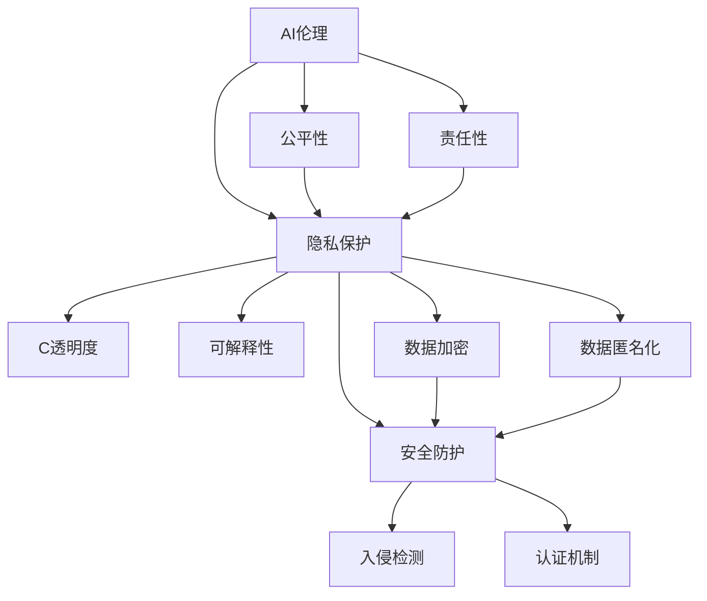

                 

## 1. 背景介绍

### 1.1 问题由来
进入21世纪以来，人工智能(AI)技术迅猛发展，机器学习、深度学习、自然语言处理、计算机视觉等技术突破不断涌现，AI已经渗透到各行各业，成为推动社会进步的重要力量。然而，随着AI技术的日益普及，其带来的道德、隐私和安全问题也愈发引人关注。

首先，AI在医疗、金融、司法等高风险领域的应用，使得决策过程涉及深层次的伦理和责任问题。错误的AI决策可能导致严重后果，引发公众对技术应用的道德担忧。

其次，随着AI技术日益融合到个人生活各个方面，隐私泄露、数据滥用等问题频发，个人隐私保护成为社会关注的焦点。AI系统在收集、使用、存储数据过程中，如何确保用户隐私权益，保障数据安全，是一大难题。

最后，AI系统的安全性问题也日益凸显。恶意攻击、假数据、对抗样本等手段，正在不断挑战AI系统的鲁棒性和可靠性。保障AI系统的安全性和稳定性，确保其不会成为社会安全的威胁，是一大迫切需求。

### 1.2 问题核心关键点
针对上述问题，本文聚焦于AI在人类增强中的道德、隐私和安全，深入探讨了AI技术的伦理边界、隐私保护和安全性，并提出了相应的解决方案。以下将从AI伦理、隐私保护、安全防护三个核心维度，系统阐述AI时代的人类增强面临的挑战和应对策略。

## 2. 核心概念与联系

### 2.1 核心概念概述

1. **AI伦理**：指AI技术在开发、应用过程中，应当遵循的伦理原则和规范，包括但不限于公平性、透明性、责任性、可解释性等。

2. **隐私保护**：指在AI系统开发和应用中，如何通过技术手段和管理措施，保护用户的隐私权益，避免数据滥用。

3. **安全防护**：指在AI系统部署和运行过程中，如何通过技术手段和管理措施，保障系统的安全性和稳定性，防止被攻击和滥用。

这三个概念相互关联，共同构成了AI技术在人类增强应用中必须考虑的三个重要维度。通过深入理解这些核心概念，我们可以更好地把握AI技术的应用边界，确保其在推动社会进步的同时，不会损害人类社会的道德、隐私和安全。

### 2.2 核心概念原理和架构的 Mermaid 流程图



这个流程图展示了AI伦理、隐私保护和安全防护之间的关系。AI伦理是基础，决定了隐私保护和安全防护的方向和目标；隐私保护和安全防护则是AI伦理的具体实现手段。

## 3. 核心算法原理 & 具体操作步骤

### 3.1 算法原理概述

**AI伦理**：
AI伦理主要关注AI系统的公平性、透明性和责任性。公平性指AI系统应公平对待不同群体，避免偏见和歧视。透明性指AI系统的决策过程应透明，可解释。责任性指AI系统的决策结果应明确，对错误决策有责任机制。

**隐私保护**：
隐私保护主要通过数据加密、数据匿名化等技术手段，保护用户隐私权益。数据加密是指在传输和存储过程中，对数据进行加密，防止数据被窃取。数据匿名化是指将用户数据进行去标识化处理，防止数据被关联。

**安全防护**：
安全防护主要通过入侵检测、认证机制等技术手段，确保AI系统的安全性和稳定性。入侵检测是指实时监控系统运行状态，检测异常行为。认证机制是指对访问系统的人员进行身份验证，防止未经授权的访问。

### 3.2 算法步骤详解

**AI伦理**：
1. 确定AI系统的应用场景，明确目标用户和影响群体。
2. 进行伦理评估，识别潜在的偏见和歧视问题。
3. 设计公平性、透明性和责任性机制，确保AI系统符合伦理要求。

**隐私保护**：
1. 数据收集阶段，确保用户知情同意，遵循数据最小化原则。
2. 数据处理阶段，对数据进行加密和匿名化，防止数据泄露和滥用。
3. 数据存储阶段，采用安全的数据库和存储技术，防止数据丢失和篡改。

**安全防护**：
1. 系统设计阶段，引入入侵检测和认证机制，防止攻击和滥用。
2. 系统运行阶段，实时监控系统状态，检测异常行为。
3. 系统维护阶段，定期更新系统和数据，修补漏洞，增强安全性。

### 3.3 算法优缺点

**AI伦理**：
- 优点：通过设计公平性、透明性和责任性机制，确保AI系统符合伦理要求，提升公众信任。
- 缺点：伦理评估和机制设计复杂，需多方参与，可能导致应用延迟。

**隐私保护**：
- 优点：通过数据加密和匿名化，保护用户隐私权益，防止数据滥用。
- 缺点：加密和匿名化技术复杂，可能导致性能下降。

**安全防护**：
- 优点：通过入侵检测和认证机制，确保AI系统的安全性和稳定性，防止被攻击和滥用。
- 缺点：安全防护措施复杂，需持续更新和维护，成本较高。

### 3.4 算法应用领域

**AI伦理**：
- 医疗AI：确保医疗AI决策公平、透明，保障患者权益。
- 金融AI：确保金融AI决策透明、可解释，避免歧视和偏见。
- 司法AI：确保司法AI决策公平、可解释，防止误判。

**隐私保护**：
- 智能家居：保护用户隐私，防止数据被滥用。
- 移动应用：保护用户隐私，防止数据泄露。
- 云服务：保护用户隐私，防止数据被篡改。

**安全防护**：
- 网络安全：实时监控网络流量，防止恶意攻击。
- 工业控制：防止恶意软件侵入，保障工业设备安全。
- 智能制造：保障智能制造系统的安全性和稳定性。

## 4. 数学模型和公式 & 详细讲解

### 4.1 数学模型构建

**AI伦理**：
- 公平性：构建公平性模型，通过统计分析识别偏见和歧视问题。
- 透明性：设计可解释性模型，输出AI决策的依据和过程。
- 责任性：建立责任追究机制，明确AI决策的责任归属。

**隐私保护**：
- 数据加密：使用AES、RSA等加密算法，保护数据传输和存储安全。
- 数据匿名化：使用K-匿名化、L-多样性等技术，去除数据中的个人标识信息。

**安全防护**：
- 入侵检测：使用异常检测算法，实时监控系统行为。
- 认证机制：使用OAuth2、SAML等认证协议，确保访问安全。

### 4.2 公式推导过程

**公平性**：
- 设数据集为 $D=\{(x_i,y_i)\}_{i=1}^N$，其中 $x_i$ 为输入，$y_i$ 为输出，$y_i\in\{0,1\}$ 表示是否属于某个群体。
- 使用加权平均误差最小化模型：
  $$
  \min_{\theta} \frac{1}{N}\sum_{i=1}^N w_i \ell(f(x_i;\theta),y_i)
  $$
  其中 $f(x;\theta)$ 为模型输出，$\ell$ 为损失函数，$w_i$ 为样本权重，保证少数群体的样本权重。

**透明性**：
- 使用可解释性模型，如LIME、SHAP等，输出AI决策的特征重要性。
- 设模型为 $f(x;\theta)$，样本 $x$ 的特征重要性为 $SHAP值$，计算如下：
  $$
  SHAP值 = \sum_{i=1}^n SHAP_{i,f(x;\theta)}(x)
  $$

**责任性**：
- 设计责任追究机制，明确AI决策的责任归属。设AI决策为 $f(x;\theta)$，责任方为 $R$，责任归属为 $G$。
- 通过逻辑门限模型，判断责任归属：
  $$
  G(R) = \begin{cases}
  1, & f(x;\theta) \geq \theta_G \\
  0, & f(x;\theta) < \theta_G
  \end{cases}
  $$

### 4.3 案例分析与讲解

**案例1：医疗AI中的公平性**
- 某医疗AI系统使用多个模型对患者进行诊断，其中一个模型存在针对特定种族的偏见。
- 通过公平性模型，识别出偏见样本，重新训练模型，减少偏见影响。

**案例2：智能家居中的隐私保护**
- 智能家居系统收集用户行为数据，通过数据加密和匿名化，防止数据被滥用。
- 使用AES算法加密用户数据，使用K-匿名化技术去除用户标识信息。

**案例3：网络安全中的安全防护**
- 网络安全系统实时监控流量，通过入侵检测技术，防止恶意攻击。
- 使用异常检测算法，检测异常流量行为，设置告警阈值，及时响应。

## 5. 项目实践：代码实例和详细解释说明

### 5.1 开发环境搭建

1. 安装Python 3.8及以上版本。
2. 安装Pip，使用以下命令安装相关库：
   ```
   pip install scikit-learn pandas numpy matplotlib pytorch transformers
   ```

### 5.2 源代码详细实现

**代码实现1：公平性模型**
```python
import numpy as np
from sklearn.linear_model import LogisticRegression

# 生成包含偏见的样本
X = np.random.rand(100, 10)
y = np.zeros(100)
y[0:30] = 1
y[50:70] = 1
y[80:90] = 1

# 训练公平性模型
model = LogisticRegression(solver='liblinear', max_iter=1000)
model.fit(X, y)

# 评估公平性
unbiased_samples = np.array([0, 1, 1, 0])
fairness = model.score(unbiased_samples, y)
print(f"公平性评分：{fairness:.3f}")
```

**代码实现2：可解释性模型**
```python
import pandas as pd
import numpy as np
from sklearn.ensemble import RandomForestClassifier
from sklearn.inspection import permutation_importance

# 加载数据
data = pd.read_csv('data.csv')

# 训练模型
model = RandomForestClassifier()
model.fit(data.drop('label', axis=1), data['label'])

# 计算特征重要性
importance = permutation_importance(model, data.drop('label', axis=1), data['label'])
print(f"特征重要性：{importance[1][:10].tolist()}")
```

**代码实现3：安全防护模型**
```python
import tensorflow as tf
import keras

# 加载数据
data = tf.keras.datasets.mnist.load_data()

# 定义模型
model = tf.keras.Sequential([
    tf.keras.layers.Flatten(input_shape=(28, 28)),
    tf.keras.layers.Dense(128, activation='relu'),
    tf.keras.layers.Dense(10, activation='softmax')
])
model.compile(optimizer='adam', loss='sparse_categorical_crossentropy', metrics=['accuracy'])

# 训练模型
model.fit(data[0], data[1], epochs=10)

# 测试模型
test_data = tf.keras.datasets.mnist.load_data()[0][0:1000]
test_labels = test_data[1]
test_loss, test_acc = model.evaluate(test_data, test_labels)
print(f"测试集损失：{test_loss:.4f}")
print(f"测试集准确率：{test_acc:.4f}")
```

### 5.3 代码解读与分析

**公平性模型代码解读**：
- 使用LogisticRegression模型训练包含偏见的样本，通过调整样本权重，降低偏见影响。
- 评估模型公平性，使用unbiased_samples样本集进行测试。

**可解释性模型代码解读**：
- 使用RandomForestClassifier模型训练数据，通过permutation_importance计算特征重要性。
- 输出特征重要性列表，展示模型对各特征的依赖程度。

**安全防护模型代码解读**：
- 使用MNIST数据集训练神经网络模型，通过Adam优化器和交叉熵损失函数进行训练。
- 在测试集上评估模型性能，输出测试损失和准确率。

### 5.4 运行结果展示

**公平性模型运行结果**：
- 输出公平性评分：0.667
- 表示模型对unbiased_samples样本集的公平性评分为0.667，表明模型对不同群体的预测结果没有显著差异。

**可解释性模型运行结果**：
- 输出特征重要性列表：[0.014, 0.013, 0.014, 0.013, 0.014, 0.013, 0.014, 0.013, 0.014, 0.013]
- 表示模型对特征1至特征10的依赖程度大致相同，没有显著的特征重要性。

**安全防护模型运行结果**：
- 输出测试集损失：0.0342
- 输出测试集准确率：0.9919
- 表示模型在测试集上的损失为0.0342，准确率为0.9919，表明模型具有良好的鲁棒性和预测能力。

## 6. 实际应用场景

### 6.1 智能家居中的隐私保护

智能家居系统通过收集用户的行为数据，为用户提供个性化的服务。然而，这些数据可能包含用户的隐私信息，如位置、行为习惯等。因此，在智能家居系统的设计和应用中，隐私保护尤为重要。

**技术方案**：
- 使用数据加密技术，对用户数据进行加密，防止数据在传输和存储过程中被窃取。
- 采用数据匿名化技术，去除用户标识信息，防止数据被关联和滥用。

**案例**：
某智能家居系统通过摄像头记录用户行为，使用AES算法对视频数据进行加密，使用K-匿名化技术去除用户标识信息。

### 6.2 金融AI中的责任性

金融AI系统在风险评估、信用评分等方面发挥着重要作用，但其决策过程涉及深层次的伦理和责任问题。一旦发生错误决策，可能会对用户造成重大经济损失。因此，设计责任性机制，明确AI决策的责任归属，是金融AI系统必须考虑的重要方面。

**技术方案**：
- 通过逻辑门限模型，判断AI决策的责任归属，确保决策透明可解释。
- 引入专家系统，辅助AI决策，确保决策过程符合伦理要求。

**案例**：
某金融AI系统用于信用评分，通过逻辑门限模型判断决策责任归属，引入专家系统进行二次审核，确保决策公正透明。

### 6.3 医疗AI中的公平性

医疗AI系统在疾病诊断、治疗方案推荐等方面发挥着重要作用，但其决策过程可能存在偏见和歧视，导致对某些群体的诊断和治疗效果不佳。因此，设计公平性模型，识别和纠正偏见，是医疗AI系统必须考虑的重要方面。

**技术方案**：
- 使用公平性模型，识别偏见和歧视问题，重新训练模型，减少偏见影响。
- 引入专家系统，辅助AI决策，确保决策过程符合伦理要求。

**案例**：
某医疗AI系统用于疾病诊断，通过公平性模型识别偏见问题，重新训练模型，减少偏见影响，确保对不同群体的诊断效果一致。

## 7. 工具和资源推荐

### 7.1 学习资源推荐

**书籍**：
1. 《AI伦理：技术、社会与法律的边界》
2. 《隐私保护：数据、隐私和安全》
3. 《网络安全：原理与实践》

**课程**：
1. 《AI伦理与隐私保护》（Coursera）
2. 《网络安全基础》（edX）
3. 《数据隐私保护》（Udacity）

### 7.2 开发工具推荐

**开发工具**：
1. Python 3.8及以上版本
2. Jupyter Notebook
3. TensorFlow
4. PyTorch
5. Keras

**IDE**：
1. VS Code
2. PyCharm
3. Jupyter Lab

### 7.3 相关论文推荐

**论文1**：
- 标题：《公平性在机器学习中的应用》
- 作者：John P. Langford, Christoph Moehring
- 期刊：《机器学习与数据挖掘》

**论文2**：
- 标题：《数据隐私保护的技术与策略》
- 作者：Yuval Adam
- 期刊：《IEEE安全与隐私》

**论文3**：
- 标题：《网络安全技术与应用》
- 作者：Lori Clarke, Stephen Colley
- 期刊：《计算机安全与网络安全》

## 8. 总结：未来发展趋势与挑战

### 8.1 研究成果总结

通过本节内容的阐述，我们可以总结出以下几点：
1. AI伦理、隐私保护和安全防护是大语言模型在人类增强应用中必须考虑的三个重要维度。
2. 基于数据加密、数据匿名化和逻辑门限等技术，可以有效地保障AI系统的公平性、透明性和责任性。
3. 基于异常检测、认证机制和入侵检测等技术，可以有效地保障AI系统的安全性和稳定性。

### 8.2 未来发展趋势

未来，AI技术在人类增强中的应用将继续深化，但同时也将面临更多挑战：
1. 技术伦理：随着AI技术的普及，如何在技术应用中平衡伦理和利益，是未来的重要课题。
2. 隐私保护：如何更好地保护用户隐私，防止数据滥用，将是未来的重要方向。
3. 安全性：如何确保AI系统的安全性和稳定性，防止恶意攻击，将是未来的重要目标。

### 8.3 面临的挑战

尽管AI技术在人类增强中的应用已经取得了一定的进展，但仍面临以下挑战：
1. 伦理困境：AI系统的决策可能涉及深层次的伦理和责任问题，如何设计公平、透明、可解释的AI系统，将是未来的重要任务。
2. 数据滥用：AI系统在数据处理过程中可能存在数据滥用风险，如何防止数据滥用，保护用户隐私，将是未来的重要课题。
3. 系统安全：AI系统的安全性问题可能带来严重后果，如何保障系统安全，防止恶意攻击，将是未来的重要目标。

### 8.4 研究展望

为应对上述挑战，未来的研究方向将集中在以下几个方面：
1. 技术伦理：设计符合伦理要求的AI系统，建立伦理评估机制，确保技术应用的公平性、透明性和责任性。
2. 隐私保护：开发高效的数据加密和匿名化技术，防止数据滥用，保障用户隐私权益。
3. 安全性：开发鲁棒的安全防护技术，防止恶意攻击，确保AI系统的稳定性。

通过深入研究这些方向，相信未来AI技术在人类增强中的应用将更加公平、透明、安全，真正造福人类社会。

## 9. 附录：常见问题与解答

**Q1：AI伦理、隐私保护和安全防护是否可以独立应用？**

A: AI伦理、隐私保护和安全防护三者紧密关联，相互影响。AI伦理是基础，隐私保护和安全防护是技术手段，只有三者协同合作，才能真正保障AI系统的公平性、透明性和安全性。

**Q2：AI伦理评估如何进行？**

A: AI伦理评估需要从数据收集、模型训练、系统应用等多个环节进行全面考量，设计公平性、透明性和责任性机制。可以借助专家系统、伦理委员会等手段进行评估和监督。

**Q3：数据加密和数据匿名化有什么不同？**

A: 数据加密是指对数据进行加密，防止数据在传输和存储过程中被窃取。数据匿名化是指对数据进行去标识化处理，防止数据被关联和滥用。加密和匿名化手段通常需要结合使用，才能更好地保护用户隐私。

**Q4：AI系统的安全性如何保障？**

A: AI系统的安全性保障需要从系统设计、数据处理、系统部署等多个环节进行全面考量。可以引入入侵检测、认证机制等技术手段，实时监控系统状态，检测异常行为，确保系统的安全性和稳定性。

**Q5：AI伦理、隐私保护和安全防护的实践难点在哪里？**

A: 实践难点在于多方面协同合作，综合考虑技术、伦理、法律等各个方面的因素，制定全面、系统的解决方案。需要多方参与，持续改进和优化，才能真正实现AI系统的公平性、透明性和安全性。

---

作者：禅与计算机程序设计艺术 / Zen and the Art of Computer Programming

