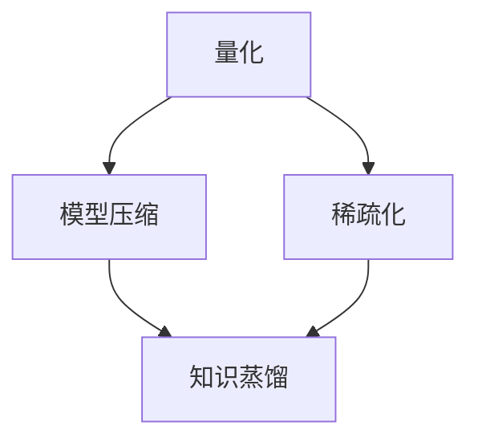

                 

# AI模型压缩：从量化到知识蒸馏

在人工智能领域，大模型因其卓越的性能和广泛的应用前景而备受关注。然而，大模型的高参数量和计算资源需求，也成为了其广泛应用的主要瓶颈。为了解决这一问题，模型压缩技术应运而生，主要包括量化和知识蒸馏两类方法。本文将详细探讨这两种技术，并给出实践中的具体操作和应用案例，希望能够帮助读者更好地理解并应用这些技术。

## 1. 背景介绍

### 1.1 问题由来
随着深度学习技术的迅猛发展，大模型在图像识别、自然语言处理、语音识别等领域取得了显著成果。然而，这些模型的参数数量庞大，动辄达到亿级，对计算资源和存储空间提出了极高的要求。例如，BERT模型拥有超过1.1亿个参数，GPT-3模型拥有175亿个参数，这些超大规模模型虽然在性能上表现出色，但实际部署和应用过程中面临诸多挑战。

量化和知识蒸馏技术，正是在这种背景下被提出并广泛应用于模型压缩领域，旨在减少模型参数量，提高推理效率，同时尽可能保留模型性能。

### 1.2 问题核心关键点
量化和知识蒸馏技术主要有以下关键点：
- **量化**：通过减少模型参数的位宽，降低计算和存储需求。
- **知识蒸馏**：通过将大型模型的知识压缩到小型模型中，实现性能的提升。
- **优势**：量化可以减少模型大小，提高计算效率，而知识蒸馏则可以在不增加额外计算成本的情况下提升模型性能。
- **挑战**：量化可能带来性能损失，知识蒸馏则难以避免泛化性能下降。

这些关键点构成了量化和知识蒸馏技术的研究基础，本文将逐一探讨。

## 2. 核心概念与联系

### 2.1 核心概念概述

为更好地理解量化和知识蒸馏技术的核心原理，本节将介绍几个关键概念及其之间的联系。

- **量化(Quantization)**：通过降低模型参数的位宽来压缩模型大小，降低计算和存储需求。量化方法主要包括静态量化和动态量化。
- **知识蒸馏(Knowledge Distillation)**：将大型模型的知识（如特征表示、概率分布等）压缩到小型模型中，提升小型模型的性能。知识蒸馏的核心在于如何有效传递和提取知识。
- **模型压缩**：通过量化和知识蒸馏等方法，减少模型参数量和计算复杂度，提高模型推理效率。
- **稀疏化**：减少模型中的非必要参数，进一步压缩模型规模。

这些概念之间的逻辑关系可以通过以下Mermaid流程图来展示：



这个流程图展示了量化和知识蒸馏在模型压缩中的地位及其关系：

1. 量化通过参数位宽的降低，直接减少模型规模。
2. 稀疏化进一步减少非必要参数，进一步压缩模型。
3. 知识蒸馏则通过将大型模型知识传递到小型模型，间接提升模型性能。

这些方法共同作用，使得模型压缩成为可能，进而实现高性能、低计算需求的模型应用。

## 3. 核心算法原理 & 具体操作步骤

### 3.1 算法原理概述

量化和知识蒸馏的原理，分别对应模型参数的数值表示和知识传递两个方面。

**量化**的核心在于减少模型参数的数值表示范围，从而减少存储和计算需求。例如，将8位浮点数参数量化为4位整数，可以减少约80%的存储空间。量化方法主要包括符号量化和权重剪枝等。

**知识蒸馏**的核心在于将大型模型的知识（如特征表示、概率分布等）传递给小型模型，提升小型模型的性能。知识蒸馏方法主要包括特征蒸馏、概率蒸馏等。

### 3.2 算法步骤详解

**量化**的详细步骤：

1. **符号量化**：将浮点数参数转换为整数或固定点参数。
   - **步骤一**：选择量化位宽（如4位、8位等）。
   - **步骤二**：计算量化参数的最大绝对值。
   - **步骤三**：将参数缩放到指定区间，进行整数化。
   - **步骤四**：使用校正方法（如符号零点、零点漂移等）进行去量化。

2. **权重剪枝**：通过删除不重要的权重，减少模型参数量。
   - **步骤一**：计算每个权重的重要性。
   - **步骤二**：选择重要性低的权重进行剪枝。
   - **步骤三**：对剪枝后的权重进行量化。

**知识蒸馏**的详细步骤：

1. **特征蒸馏**：将大型模型的特征表示传递给小型模型。
   - **步骤一**：将大型模型和目标模型的输入数据输入模型，计算大型模型的输出特征。
   - **步骤二**：将大型模型的特征表示作为目标模型的输入，训练目标模型。

2. **概率蒸馏**：将大型模型的概率分布传递给小型模型。
   - **步骤一**：计算大型模型对输入数据的预测概率分布。
   - **步骤二**：将大型模型的概率分布作为目标模型的损失函数，训练目标模型。

### 3.3 算法优缺点

量化和知识蒸馏技术具有以下优点：

- **量化**：显著降低模型大小，提高计算和存储效率。适用于需要高效推理的应用场景。
- **知识蒸馏**：在保持较低计算需求的情况下，显著提升模型性能。适用于资源受限但性能要求高的场景。

同时，这些技术也存在一些局限性：

- **量化**：可能带来一定的性能损失，特别是在高精度计算需求的应用场景中。
- **知识蒸馏**：可能会导致泛化性能下降，尤其是在模型结构和目标模型结构差异较大的情况下。

## 4. 数学模型和公式 & 详细讲解 & 举例说明

### 4.1 数学模型构建

量化和知识蒸馏的数学模型可以表示为：

$$
\text{Quantized Model} = \mathcal{Q}(\text{Full Model})
$$

其中，$\mathcal{Q}$ 表示量化函数，将全模型参数映射为量化后的参数。

知识蒸馏的目标是：

$$
\min_{\theta_t} \mathcal{L}(\theta_s, \theta_t) + \lambda \mathcal{L}(\theta_t, D)
$$

其中，$\theta_s$ 表示大型模型的参数，$\theta_t$ 表示目标模型的参数，$\lambda$ 表示知识蒸馏的权重，$D$ 表示目标模型的训练数据集。$\mathcal{L}(\theta_s, \theta_t)$ 表示大型模型和目标模型之间的差异损失，$\mathcal{L}(\theta_t, D)$ 表示目标模型在训练数据集上的损失。

### 4.2 公式推导过程

以量化和知识蒸馏为例，推导具体公式。

**量化公式推导**：

假设一个浮点数参数 $x$ 量化为 $k$ 位整数 $q$，量化范围为 $[0, 2^k-1]$。量化过程可以表示为：

$$
q = \text{clip}(\text{round}(x \times \frac{2^k}{\text{max}(|x|)}), 0, 2^k-1)
$$

其中，$\text{round}$ 表示四舍五入，$\text{clip}$ 表示剪枝到指定范围。

**知识蒸馏公式推导**：

假设一个大型模型的预测概率分布为 $p_s(x)$，目标模型的预测概率分布为 $p_t(x)$。知识蒸馏的目标是最大化两者之间的KL散度，即：

$$
\mathcal{L}(p_s(x), p_t(x)) = \frac{1}{N} \sum_{i=1}^N KL(p_s(x_i), p_t(x_i))
$$

其中，$N$ 表示样本数量，$KL$ 表示KL散度。

### 4.3 案例分析与讲解

**量化案例**：

以MobileNet为例，MobileNet通过深度可分离卷积（Depthwise Separable Convolution）来降低计算量，同时采用全局平均池化（Global Average Pooling）和线性变换（Linear Transformation）来减少参数量。MobileNet V3通过引入Per Channel Quantization（PCQ），进一步压缩模型参数，使其在保持较高性能的同时，模型大小减少了约80%。

**知识蒸馏案例**：

以ResNet为例，ResNet通过特征蒸馏方法，将大型模型ResNet-50的知识传递给目标模型ResNet-18，显著提升了目标模型的性能。具体来说，ResNet-50在ImageNet数据集上预训练，ResNet-18在CIFAR-10数据集上进行微调，使用特征蒸馏方法，将ResNet-50的特征表示作为ResNet-18的输入，从而提升了目标模型的准确率。

## 5. 项目实践：代码实例和详细解释说明

### 5.1 开发环境搭建

量化和知识蒸馏的实践环境一般包括：

1. Python编程语言：用于编写模型压缩代码。
2. PyTorch或TensorFlow框架：支持深度学习模型的训练和推理。
3. CUDA/ROCm环境：支持GPU加速计算。
4. 必要的库和工具：如TensorBoard、Weights & Biases等，用于模型监控和调试。

### 5.2 源代码详细实现

以MobileNet为例，给出量化和知识蒸馏的代码实现。

```python
import torch
import torch.nn as nn
import torch.nn.quantization as nnq

# 定义MobileNet模型
class MobileNet(nn.Module):
    def __init__(self):
        super(MobileNet, self).__init__()
        # MobileNet各层的定义
        # ...

    def forward(self, x):
        # MobileNet的推理过程
        # ...

# 量化MobileNet模型
def quantize_model(model, bit=8):
    quant_model = nnq.QConfig(model.qconfig)(model)
    return quant_model

# 知识蒸馏过程
def distillation(model_s, model_t, data_loader, num_epochs=10, learning_rate=0.001):
    criterion = nn.KLDivLoss()
    optimizer = torch.optim.Adam(model_t.parameters(), lr=learning_rate)
    for epoch in range(num_epochs):
        for i, (input, target) in enumerate(data_loader):
            # 计算大型模型和目标模型的损失
            # ...
            # 反向传播更新目标模型参数
            # ...
```

### 5.3 代码解读与分析

上述代码展示了MobileNet的量化和知识蒸馏过程。

- **量化**：通过`nnq.QConfig`创建量化配置，并将模型量化为`quant_model`。
- **知识蒸馏**：在目标模型`model_t`上进行训练，使用`nn.KLDivLoss`计算KL散度损失，并使用`Adam`优化器进行模型参数的更新。

### 5.4 运行结果展示

通过对比量化前后的模型大小和推理速度，以及知识蒸馏前后的模型性能，可以直观展示量化和知识蒸馏的效果。

## 6. 实际应用场景

### 6.1 手机应用优化

在手机应用中，模型的计算资源和存储空间有限，因此量化和知识蒸馏技术可以有效提升模型的推理效率，使得大模型能在低功耗设备上得到应用。例如，MobileNet在Android手机中得到广泛应用，极大地提升了手机图像识别和视频处理的速度。

### 6.2 自动驾驶系统

自动驾驶系统需要实时处理大量数据，因此对计算效率有较高要求。通过量化和知识蒸馏技术，可以在不增加额外硬件成本的情况下，显著提升系统性能，保障自动驾驶的安全性和可靠性。

### 6.3 云服务优化

云服务提供商需要支持大规模用户并发请求，因此优化模型的计算和存储效率至关重要。量化和知识蒸馏技术可以使得大模型在云端高效运行，降低服务成本，提升用户体验。

### 6.4 未来应用展望

未来，量化和知识蒸馏技术将进一步发展，应用范围将更加广泛。例如：

- **多模态模型**：结合量化和知识蒸馏技术，可以提升多模态模型的性能，如视觉-语言、语音-文本等。
- **联邦学习**：通过量化和知识蒸馏技术，可以在保护隐私的前提下，实现分布式模型训练，提升模型性能。
- **边缘计算**：结合量化和知识蒸馏技术，可以在边缘设备上高效运行大模型，降低通信延迟，提高系统响应速度。

## 7. 工具和资源推荐

### 7.1 学习资源推荐

为了帮助开发者系统掌握量化和知识蒸馏技术的理论基础和实践技巧，这里推荐一些优质的学习资源：

1. **《深度学习入门：量化与稀疏化》书籍**：系统介绍了量化和稀疏化的理论基础和实践方法，涵盖从符号量化到动态量化、从权重剪枝到网络稀疏化等各个方面。
2. **《知识蒸馏：从模型压缩到迁移学习》论文**：详细探讨了知识蒸馏的理论基础和实践方法，提供了大量实验结果和案例分析。
3. **HuggingFace官方文档**：提供了丰富的预训练模型和知识蒸馏样例代码，是实践量化和知识蒸馏技术的重要参考。
4. **TensorFlow Quantization Guide**：提供了TensorFlow框架下的量化和知识蒸馏指南，详细介绍了各种量化和蒸馏技术。

### 7.2 开发工具推荐

量化和知识蒸馏技术的实践开发需要借助一些工具和库，以下是几款推荐的工具：

1. **PyTorch**：支持深度学习模型的训练和推理，提供了丰富的量化和蒸馏工具。
2. **TensorFlow**：支持大规模分布式模型训练，提供了丰富的量化和蒸馏工具。
3. **Quantization Toolkit**：提供了全面的量化工具，支持多种量化方法。
4. **TensorBoard**：提供了模型监控和调试功能，支持可视化量化和蒸馏过程。
5. **Weights & Biases**：提供了模型训练实验的跟踪和管理功能，支持量化和蒸馏实验的记录和分析。

### 7.3 相关论文推荐

量化和知识蒸馏技术的发展得益于学界的持续研究。以下是几篇奠基性的相关论文，推荐阅读：

1. **《ImageNet Classification with Deep Convolutional Neural Networks》**：提出了AlexNet模型，奠定了深度卷积神经网络在图像分类中的地位，为后续的模型压缩技术奠定了基础。
2. **《Quantization and Pruning of Deep Convolutional Networks for Real-Time Mobile Applications》**：系统介绍了量化和剪枝技术在移动设备中的应用，为量化技术的实际应用提供了重要参考。
3. **《Knowledge Distillation》**：提出了知识蒸馏的概念，展示了如何通过蒸馏方法将大型模型知识传递给小型模型，提升了模型性能。
4. **《Pruning Neural Networks with Random Structured Connections》**：提出了随机结构化剪枝方法，进一步优化了模型的压缩效果。

## 8. 总结：未来发展趋势与挑战

### 8.1 总结

本文对量化和知识蒸馏技术进行了全面系统的介绍。首先阐述了这两种技术的研究背景和意义，明确了其在模型压缩和优化方面的独特价值。其次，从原理到实践，详细讲解了量化和知识蒸馏的数学模型和操作步骤，给出了代码实例和详细解释说明。同时，本文还广泛探讨了这两种技术在多个行业领域的应用前景，展示了其在实际应用中的巨大潜力。

通过本文的系统梳理，可以看到，量化和知识蒸馏技术正在成为模型压缩的重要范式，极大地提升了模型性能和应用效率。未来，伴随量化和知识蒸馏方法的持续演进，相信其在人工智能技术落地应用中的作用将更加显著。

### 8.2 未来发展趋势

展望未来，量化和知识蒸馏技术将呈现以下几个发展趋势：

1. **多模态量化**：量化技术将进一步扩展到多模态数据，如视觉、语音等，提升多模态模型在实际应用中的性能和效率。
2. **联邦蒸馏**：知识蒸馏技术将结合联邦学习方法，实现分布式模型训练，保障模型隐私和安全。
3. **自适应蒸馏**：通过动态调整蒸馏参数，实现更加高效和灵活的知识传递，提升模型性能。
4. **混合蒸馏**：结合量化和蒸馏方法，进一步提升模型的压缩效率和推理速度。
5. **融合新理论**：结合新的理论方法，如自适应学习、强化学习等，提升模型的泛化能力和适应性。

这些趋势凸显了量化和知识蒸馏技术的广阔前景。这些方向的探索发展，必将进一步提升人工智能模型的性能和应用范围，为构建高效、智能的AI系统铺平道路。

### 8.3 面临的挑战

尽管量化和知识蒸馏技术已经取得了显著成果，但在迈向更加智能化、普适化应用的过程中，仍面临诸多挑战：

1. **性能损失**：量化方法可能会带来一定的性能损失，尤其是在高精度计算需求的应用场景中。
2. **模型泛化**：知识蒸馏方法可能会导致模型的泛化性能下降，特别是在模型结构和目标模型结构差异较大的情况下。
3. **资源需求**：大规模量化和蒸馏操作需要高计算资源和高存储需求，增加了实际应用的成本。
4. **模型复杂性**：量化和蒸馏方法增加了模型的复杂性，增加了模型调试和维护的难度。
5. **模型解释性**：量化和蒸馏方法使得模型的可解释性降低，增加了模型调试和维护的难度。

这些挑战需要在未来的研究中加以解决，才能使得量化和蒸馏技术在实际应用中发挥更大的作用。

### 8.4 研究展望

未来的研究需要在以下几个方面寻求新的突破：

1. **混合量化**：结合符号量化和线性量化方法，进一步提升量化效果。
2. **自适应蒸馏**：动态调整蒸馏参数，实现更加高效和灵活的知识传递。
3. **融合新理论**：结合自适应学习、强化学习等新理论方法，提升模型的泛化能力和适应性。
4. **可解释性增强**：开发可解释的量化方法和蒸馏方法，增强模型的可解释性。
5. **分布式训练**：结合联邦学习等分布式训练方法，实现分布式模型训练，保障模型隐私和安全。

这些研究方向将引领量化和蒸馏技术迈向更高的台阶，为构建安全、可靠、可解释、可控的智能系统铺平道路。面向未来，量化和蒸馏技术还需要与其他人工智能技术进行更深入的融合，如知识表示、因果推理、强化学习等，多路径协同发力，共同推动人工智能技术的发展。

## 9. 附录：常见问题与解答

**Q1：量化和知识蒸馏技术如何影响模型的泛化性能？**

A: 量化和知识蒸馏技术可能会对模型的泛化性能产生一定的影响。量化方法通过减少模型参数的数值范围，可能会降低模型的表达能力，从而影响泛化性能。知识蒸馏方法通过将大型模型的知识传递给小型模型，可能会在一定程度上降低小型模型的泛化能力。为了缓解这些问题，可以结合多种量化和蒸馏方法，并在实际应用中不断优化调整。

**Q2：量化和知识蒸馏技术对模型的推理速度和存储需求有何影响？**

A: 量化和知识蒸馏技术可以显著降低模型的推理速度和存储需求，提升模型在实际应用中的性能和效率。量化方法通过减少模型参数的数值范围，可以直接降低模型的存储空间和计算需求。知识蒸馏方法通过将大型模型的知识传递给小型模型，可以在不增加额外计算成本的情况下，显著提升小型模型的性能，从而降低推理时间和计算资源需求。

**Q3：如何平衡量化和知识蒸馏技术的优化目标？**

A: 量化和知识蒸馏技术的优化目标是一致的，即在保持模型性能的同时，尽可能减少模型的参数量和计算资源需求。为了平衡这两者，可以采用混合量化和蒸馏方法，结合符号量化、线性量化和知识蒸馏等多种技术手段，优化模型的压缩效果。同时，根据具体应用场景的需求，合理设置量化位宽和蒸馏参数，以实现最佳的性能和效率。

**Q4：量化和知识蒸馏技术对模型的解释性有何影响？**

A: 量化和知识蒸馏技术可能会降低模型的可解释性，尤其是量化方法将浮点数参数转换为整数参数后，模型的内部结构和参数值变得更加复杂，难以直接解释。知识蒸馏方法通过将大型模型的知识传递给小型模型，也会使得小型模型的推理过程变得更加复杂，难以解释。为了提高模型的可解释性，可以采用可解释的量化方法和蒸馏方法，或者结合其他可解释技术，如注意力机制、可解释性学习等。

**Q5：量化和知识蒸馏技术在实际应用中需要注意哪些问题？**

A: 量化和知识蒸馏技术在实际应用中需要注意以下问题：
1. 量化位宽的选择：选择合适的量化位宽，平衡性能和压缩效果。
2. 知识蒸馏参数的设置：合理设置蒸馏参数，避免过拟合或欠拟合。
3. 模型压缩后的调试：压缩后的模型可能需要重新调整模型结构和超参数，以保持性能。
4. 模型部署的优化：优化模型推理过程，提升推理速度和计算效率。
5. 模型解释性的增强：增强模型的可解释性，保障模型安全和透明。

通过这些问题，可以更全面地考虑量化和蒸馏技术在实际应用中的细节和挑战，提升模型的性能和可用性。

---

作者：禅与计算机程序设计艺术 / Zen and the Art of Computer Programming

