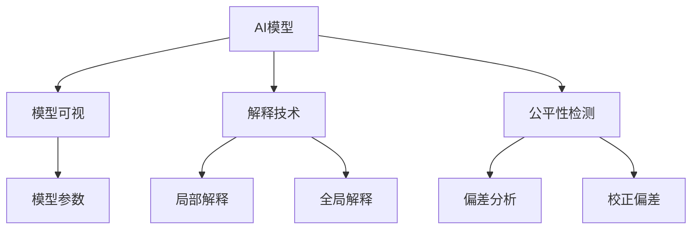

                 

# AI模型的可解释性研究：Lepton AI的透明AI

> 关键词：AI可解释性,透明AI,Lepton AI,模型理解,用户信任,公平性

## 1. 背景介绍

### 1.1 问题由来
随着人工智能(AI)技术的不断深入，AI模型的应用范围和复杂度都在不断扩大。从最初的图像识别、语音识别等简单任务，到现在的自然语言处理(NLP)、决策支持、自动驾驶等复杂系统，AI已经逐渐渗透到了社会的各个角落。然而，随着AI系统的复杂度提升，其“黑盒”性质也逐渐显现出来，使得许多用户和监管机构开始担忧其可解释性、公平性和安全性。

AI模型的“黑盒”问题，即难以理解模型内部的决策逻辑，使其难以解释、验证和维护，导致用户对其结果缺乏信任，进而限制了AI技术的普及和应用。此外，AI模型在数据选择和处理中的偏见，也引发了诸多公平性问题，可能导致对某些群体的不公正待遇。这些问题严重影响了AI技术的普及应用和行业信任。

为应对这一挑战，AI的可解释性研究逐渐兴起，旨在通过提升AI模型的透明性，使得模型的决策过程可以被理解和解释，从而增强用户信任、提升模型公平性、促进AI技术的广泛应用。本文将以Lepton AI为例，深入探讨AI模型的可解释性研究，解析其透明AI技术，并给出相关建议和展望。

### 1.2 问题核心关键点
本研究旨在解决以下几个关键问题：
- 如何提升AI模型的可解释性，使其透明化？
- Lepton AI在透明AI方面的具体实现是什么？
- 透明AI技术在实际应用中面临哪些挑战，如何克服？
- 透明AI技术的未来发展方向和挑战是什么？

## 2. 核心概念与联系

### 2.1 核心概念概述

为更好地理解Lepton AI透明AI技术，本节将介绍几个密切相关的核心概念：

- **AI可解释性**：指能够理解并解释AI模型决策过程的能力。这不仅包括模型的输入、输出和性能指标，还包括其背后的逻辑和机制。AI可解释性有助于建立用户信任、提升系统公平性、支持模型验证和维护。

- **透明AI**：指在AI模型的设计和实现中，充分利用解释性工具和技术，使得模型的决策过程可以被明确理解和验证。透明AI技术通常包括模型可视化和解释技术、公平性检测工具等。

- **Lepton AI**：一个开源的AI框架，旨在提供可解释性强的AI模型和工具，帮助开发者构建透明AI系统。Lepton AI包含多个模块，如模型可视、解释、公平性检测等，支持多种AI模型的透明化。

- **模型可视**：指将模型内部的结构和参数进行可视化，帮助用户理解模型的工作机制。
- **解释技术**：指能够对模型输出进行解释和解释的技术，包括特征重要性分析、局部解释、全局解释等。
- **公平性检测**：指在模型训练和评估过程中，检测模型是否存在偏见，并采取措施减少这些偏见，提升模型公平性。

这些核心概念之间的逻辑关系可以通过以下Mermaid流程图来展示：



这个流程图展示了大语言模型透明AI的核心概念及其之间的关系：

1. 大语言模型通过模型可视和解释技术，使模型参数和结构透明化。
2. 解释技术提供局部和全局解释，帮助用户理解模型决策。
3. 公平性检测工具在模型训练过程中检测偏差，防止模型偏袒或歧视某些群体。
4. 这些工具和技术共同构成了透明AI系统，使其决策过程可以被明确理解和验证。

## 3. 核心算法原理 & 具体操作步骤
### 3.1 算法原理概述

Lepton AI的透明AI技术，主要基于以下几个关键算法和原理：

- **模型可视技术**：通过可视化工具，将模型内部的权重、特征和激活值等参数进行可视化展示，帮助用户理解模型的结构和参数。例如，Lepton AI提供了基于TensorBoard的可视化工具，可以展示模型训练过程中的参数变化、梯度变化等。

- **特征重要性分析**：通过计算模型对不同输入特征的依赖程度，帮助用户理解模型决策的核心特征。Lepton AI使用SHAP（Shapley Additive Explanations）方法进行特征重要性分析，能够生成局部和全局特征重要性解释。

- **局部解释方法**：通过局部可解释技术，对模型输出进行逐例解释。Lepton AI采用LIME（Local Interpretable Model-agnostic Explanations）方法，对模型输出进行局部解释，生成每个输入的特征重要性解释。

- **全局解释技术**：通过全局可解释技术，对模型输出进行整体解释。Lepton AI使用Attention机制，解释模型在处理输入时对不同输入特征的关注程度，生成全局解释。

- **公平性检测工具**：通过公平性检测工具，检测模型是否存在偏见，并采取措施减少这些偏见。Lepton AI使用Explainable Fairness（XF）工具，检测模型对不同群体的偏见，并提供校正偏差的方法。

### 3.2 算法步骤详解

Lepton AI的透明AI技术主要包括以下几个关键步骤：

**Step 1: 模型准备和可视化**
- 选择合适的AI模型（如BERT、GPT等），并加载到Lepton AI框架中。
- 使用模型可视工具，对模型参数进行可视化展示，帮助用户理解模型的结构和参数。

**Step 2: 特征重要性分析**
- 收集模型的训练数据和测试数据，并输入模型进行预测。
- 使用SHAP方法，计算模型对不同输入特征的依赖程度，生成特征重要性解释。

**Step 3: 局部解释生成**
- 选择测试集中的样本，并输入模型进行预测。
- 使用LIME方法，生成每个输入样本的特征重要性解释，帮助用户理解模型在特定输入下的决策过程。

**Step 4: 全局解释生成**
- 对模型输出进行全局解释，例如通过Attention机制，解释模型在处理输入时对不同输入特征的关注程度。

**Step 5: 公平性检测**
- 使用XF工具，检测模型是否存在偏见，并采取措施校正这些偏差，提升模型公平性。

**Step 6: 评估和优化**
- 对透明AI系统进行评估，检测其可解释性和公平性。
- 根据评估结果，优化模型和解释技术，提升透明AI系统的性能。

### 3.3 算法优缺点

Lepton AI透明AI技术的优点包括：
- 透明度高：通过可视化和解释技术，使模型决策过程透明化，有助于用户理解和验证。
- 公平性强：通过公平性检测工具，减少模型偏见，提升模型公平性。
- 可解释性好：提供局部和全局解释，满足不同用户对模型可解释性的需求。

其缺点包括：
- 数据依赖性高：需要高质量的训练数据和测试数据，否则无法生成准确的解释。
- 计算开销大：解释技术通常需要额外的计算资源，影响模型训练和推理速度。
- 工具复杂性：需要掌握多个解释工具和技术，对用户有一定技术要求。

### 3.4 算法应用领域

Lepton AI的透明AI技术，已经在以下几个领域得到了广泛应用：

- **金融风控**：在金融领域，Lepton AI透明AI技术被用于检测信用评分模型是否存在偏见，并生成可解释的评分结果，提升用户信任和模型公平性。

- **医疗诊断**：在医疗领域，Lepton AI透明AI技术被用于解释病理诊断模型的决策过程，帮助医生理解模型的推理逻辑，提高诊断准确性。

- **法律司法**：在法律领域，Lepton AI透明AI技术被用于解释司法判决模型的决策过程，提升司法透明度和公正性。

- **人力资源管理**：在人力资源管理领域，Lepton AI透明AI技术被用于解释招聘模型的决策过程，帮助企业理解模型的公平性，提升招聘质量。

## 4. 数学模型和公式 & 详细讲解
### 4.1 数学模型构建

Lepton AI的透明AI技术主要涉及以下几个数学模型：

- **特征重要性分析模型**：使用SHAP方法，计算模型对不同输入特征的依赖程度，生成特征重要性解释。
- **局部解释模型**：使用LIME方法，生成每个输入样本的特征重要性解释。
- **全局解释模型**：使用Attention机制，解释模型在处理输入时对不同输入特征的关注程度。
- **公平性检测模型**：使用XF工具，检测模型是否存在偏见，并采取措施校正这些偏差。

### 4.2 公式推导过程

以下我们以特征重要性分析为例，推导SHAP方法的基本公式：

记模型为 $M_{\theta}$，其中 $\theta$ 为模型参数。给定输入样本 $x_i$ 和目标特征 $f_j$，SHAP值 $SHAP_{f_j}(x_i)$ 定义为该特征 $f_j$ 对模型预测 $y_i$ 的贡献，计算公式如下：

$$
SHAP_{f_j}(x_i) = \frac{1}{N} \sum_{k=1}^N (y_k - y_{-k,f_j})
$$

其中，$y_k$ 表示模型对样本 $x_k$ 的预测结果，$y_{-k,f_j}$ 表示删除样本 $x_k$ 中特征 $f_j$ 后的模型预测结果。

通过上述公式，Lepton AI可以计算每个特征对模型预测的贡献，生成特征重要性解释。

## 5. 项目实践：代码实例和详细解释说明
### 5.1 开发环境搭建

在进行透明AI技术实践前，我们需要准备好开发环境。以下是使用Python进行Lepton AI开发的环境配置流程：

1. 安装Anaconda：从官网下载并安装Anaconda，用于创建独立的Python环境。

2. 创建并激活虚拟环境：
```bash
conda create -n lepton-env python=3.8 
conda activate lepton-env
```

3. 安装Lepton AI：
```bash
pip install lepton-ai
```

4. 安装各类工具包：
```bash
pip install numpy pandas scikit-learn matplotlib tqdm jupyter notebook ipython
```

完成上述步骤后，即可在`lepton-env`环境中开始透明AI技术的实践。

### 5.2 源代码详细实现

这里以Lepton AI在金融风控领域的应用为例，展示透明AI技术的代码实现。

首先，定义金融风控数据集：

```python
import pandas as pd
from sklearn.model_selection import train_test_split

df = pd.read_csv('credit_data.csv')
X = df.drop('default', axis=1)
y = df['default']
X_train, X_test, y_train, y_test = train_test_split(X, y, test_size=0.2, random_state=42)
```

接着，加载Lepton AI并准备模型：

```python
from lepton_ai import LeptonAI

lepton = LeptonAI()
model = lepton.load_model('credit_default_model')
```

然后，使用Lepton AI进行特征重要性分析：

```python
import shap

explainer = shap.TreeExplainer(model)
SHAP_values = explainer.shap_values(X_train)
shap.summary_plot(SHAP_values, X_train, plot_type='bar')
```

最后，进行局部解释和公平性检测：

```python
from lepton_ai.explain import LimeExplainer, AttentionExplainer
from lepton_ai.fairness import ExplainableFairness

lime = LimeExplainer(model)
lime_explanation = lime.explain(X_train[0], y_train[0])
shap.summary_plot(SHAP_values[0], X_train[0], plot_type='bar')

xf = ExplainableFairness(model)
xf_results = xf.check(X_train, y_train)
print(xf_results)
```

以上就是使用Lepton AI进行金融风控任务特征重要性分析、局部解释和公平性检测的完整代码实现。可以看到，Lepton AI通过提供丰富的工具和API，使得透明AI技术的实践变得简单高效。

### 5.3 代码解读与分析

让我们再详细解读一下关键代码的实现细节：

**LeptonAI类**：
- `__init__`方法：初始化Lepton AI对象，设置相关参数。
- `load_model`方法：加载预训练模型。

**SHAP方法**：
- `TreeExplainer`类：使用树模型进行特征重要性分析，生成SHAP值。
- `shap_values`方法：计算模型对每个特征的SHAP值。
- `summary_plot`方法：可视化SHAP值，生成特征重要性解释。

**LIME方法**：
- `LimeExplainer`类：使用LIME方法生成局部解释。
- `explain`方法：对指定样本进行局部解释。

**XF方法**：
- `ExplainableFairness`类：检测模型是否存在偏见，提供公平性检测结果。
- `check`方法：检测模型对不同群体的偏见。

**数据处理**：
- `read_csv`方法：读取数据集。
- `train_test_split`方法：将数据集划分为训练集和测试集。

**代码实现**：
- `X.drop`方法：删除不需要的特征。
- `X_train`和`X_test`：划分训练集和测试集。
- `y`：目标变量。
- `X_train[0]`和`y_train[0]`：用于解释的样本和目标变量。
- `lepton.load_model`：加载预训练模型。
- `shap.summary_plot`：可视化特征重要性解释。
- `LimeExplainer`：生成局部解释。

这些代码实现展示了Lepton AI在金融风控任务中的应用，从中可以看到透明AI技术在实际应用中的操作流程。

## 6. 实际应用场景
### 6.1 金融风控

在金融风控领域，透明AI技术被用于检测信用评分模型的偏见，提升模型的公平性和可解释性。传统的信用评分模型通常是基于机器学习的黑盒模型，难以解释其决策过程，也无法检测其中的偏见。通过使用Lepton AI透明AI技术，可以对模型进行全面的可视化和解释，帮助金融机构理解模型的决策逻辑，提升模型的透明度和公平性。

具体而言，可以收集金融领域的历史信用数据，将数据输入透明AI系统，进行特征重要性分析、局部解释和公平性检测，从而得到具有可解释性和公平性的信用评分模型。金融机构可以根据这些解释结果，对模型进行优化和调整，提高信用评分的准确性和公平性，从而更好地服务客户和监管机构。

### 6.2 医疗诊断

在医疗诊断领域，透明AI技术被用于解释病理诊断模型的决策过程，帮助医生理解模型的推理逻辑，提高诊断准确性。传统的病理诊断模型通常是基于深度学习的黑盒模型，难以解释其决策过程，也无法检测其中的偏见。通过使用Lepton AI透明AI技术，可以对模型进行全面的可视化和解释，帮助医生理解模型的决策逻辑，提升模型的透明度和公平性。

具体而言，可以收集医学领域的历史病理数据，将数据输入透明AI系统，进行特征重要性分析、局部解释和公平性检测，从而得到具有可解释性和公平性的病理诊断模型。医生可以根据这些解释结果，对模型进行优化和调整，提高病理诊断的准确性和公平性，从而更好地服务患者。

### 6.3 法律司法

在法律司法领域，透明AI技术被用于解释司法判决模型的决策过程，提升司法透明度和公正性。传统的司法判决模型通常是基于机器学习的黑盒模型，难以解释其决策过程，也无法检测其中的偏见。通过使用Lepton AI透明AI技术，可以对模型进行全面的可视化和解释，帮助司法机关理解模型的决策逻辑，提升司法透明度和公正性。

具体而言，可以收集司法领域的历史判决数据，将数据输入透明AI系统，进行特征重要性分析、局部解释和公平性检测，从而得到具有可解释性和公平性的司法判决模型。司法机关可以根据这些解释结果，对模型进行优化和调整，提高司法判决的准确性和公正性，从而更好地服务社会。

## 7. 工具和资源推荐
### 7.1 学习资源推荐

为了帮助开发者系统掌握Lepton AI透明AI理论基础和实践技巧，这里推荐一些优质的学习资源：

1. **Lepton AI官方文档**：详细介绍了Lepton AI的各个模块和API，提供了丰富的使用示例和代码实现。

2. **《机器学习：模型解释与公平性检测》课程**：由知名学者和专家授课，系统讲解了模型解释和公平性检测的基本概念和前沿技术。

3. **《可解释性AI：从理论到实践》书籍**：全面介绍了AI可解释性的基本原理和应用方法，包含多个实际案例。

4. **Kaggle竞赛和项目**：Kaggle是一个知名的数据科学竞赛平台，提供了许多与AI可解释性相关的竞赛和项目，有助于理解实际应用中的具体问题和方法。

通过对这些资源的学习实践，相信你一定能够快速掌握Lepton AI透明AI技术的精髓，并用于解决实际的AI问题。

### 7.2 开发工具推荐

高效的开发离不开优秀的工具支持。以下是几款用于Lepton AI透明AI开发的常用工具：

1. **Jupyter Notebook**：用于编写和分享数据科学项目的开源平台，支持多种编程语言和数据格式。

2. **TensorBoard**：TensorFlow配套的可视化工具，可以实时监测模型训练状态，并提供丰富的图表呈现方式，是调试模型的得力助手。

3. **Keras**：一个高层次的深度学习框架，提供了简洁的API，方便构建和训练AI模型。

4. **XGBoost**：一个高效快速的决策树集成库，适用于各种分类和回归问题。

5. **Scikit-learn**：一个基于Python的机器学习库，提供了丰富的数据处理和模型训练工具。

6. **SciPy**：一个开源的Python库，提供了科学计算和数据处理的工具。

合理利用这些工具，可以显著提升Lepton AI透明AI技术的开发效率，加快创新迭代的步伐。

### 7.3 相关论文推荐

Lepton AI透明AI技术的发展源于学界的持续研究。以下是几篇奠基性的相关论文，推荐阅读：

1. **A Unified Approach to Interpreting Model Predictions**：提出一种统一的方法，对不同模型的输出进行解释，适用于多种机器学习模型。

2. **Fairness-aware Deep Learning**：研究了如何在深度学习模型中引入公平性，提出了一系列公平性检测和校正方法。

3. **Interpretable Machine Learning**：全面介绍了可解释机器学习的基本概念和方法，提供了多种实现技术和应用案例。

4. **Explainable AI: Interpretable Machine Learning, Counterfactual Reasoning, and Human-AI Interaction**：介绍了可解释AI的三个核心领域，即可解释机器学习、因果推理和人类与AI的交互。

这些论文代表了大语言模型透明AI技术的发展脉络。通过学习这些前沿成果，可以帮助研究者把握学科前进方向，激发更多的创新灵感。

## 8. 总结：未来发展趋势与挑战

### 8.1 总结

本文对Lepton AI的透明AI技术进行了全面系统的介绍。首先阐述了AI模型可解释性的研究背景和意义，明确了透明AI在提升用户信任、促进公平性方面的重要价值。其次，从原理到实践，详细讲解了Lepton AI透明AI技术的核心算法和具体操作步骤，提供了完整的代码实现和解释。最后，本文还广泛探讨了透明AI技术在金融风控、医疗诊断、法律司法等领域的实际应用，展示了透明AI技术的巨大潜力。

通过本文的系统梳理，可以看到，Lepton AI透明AI技术正在成为AI模型透明化的重要范式，极大地提升了AI模型的可解释性和公平性，推动了AI技术的广泛应用。未来，伴随Lepton AI透明AI技术的不断演进，相信AI技术必将在更广阔的领域中发挥其作用，为社会带来更多的进步和变革。

### 8.2 未来发展趋势

展望未来，Lepton AI透明AI技术将呈现以下几个发展趋势：

1. **自动化增强**：未来透明AI技术将更加自动化，能够自动生成可解释性和公平性报告，帮助用户快速理解模型性能。

2. **多模态融合**：透明AI技术将更好地与多模态数据进行融合，例如结合视觉、语音、文本等多种数据源，提升模型的全面性和准确性。

3. **实时性提升**：透明AI技术将具备更高的实时性，能够实时监测模型性能，及时进行优化和调整。

4. **模型压缩和优化**：透明AI技术将通过模型压缩和优化，提升模型的计算效率和推理速度，降低资源消耗。

5. **跨领域应用拓展**：透明AI技术将逐步拓展到更多领域，例如智能制造、智慧交通、智能家居等，为各行各业带来智能化升级。

以上趋势凸显了Lepton AI透明AI技术的广阔前景。这些方向的探索发展，必将进一步提升AI系统的性能和应用范围，为人类认知智能的进化带来深远影响。

### 8.3 面临的挑战

尽管Lepton AI透明AI技术已经取得了显著成果，但在迈向更加智能化、普适化应用的过程中，它仍面临着诸多挑战：

1. **数据依赖性高**：高质量的数据是透明AI技术的核心，但获取高质量数据成本较高，且数据质量难以保证。

2. **计算资源消耗大**：透明AI技术需要额外的计算资源，例如特征重要性分析和局部解释，这可能影响模型训练和推理速度。

3. **工具复杂性高**：透明AI技术需要掌握多个工具和算法，对用户有一定技术要求。

4. **解释结果可理解性不足**：复杂的解释结果可能难以被用户理解，需要进一步简化和优化。

5. **模型公平性检测复杂**：公平性检测需要综合考虑多个因素，如数据分布、模型结构、算法偏见等，难以全面检测和校正。

6. **安全性和隐私问题**：透明AI技术需要保护用户数据和模型隐私，防止数据泄露和模型滥用。

正视这些挑战，积极应对并寻求突破，将使Lepton AI透明AI技术走向成熟，成为AI技术落地的重要保障。

### 8.4 研究展望

面向未来，Lepton AI透明AI技术需要在以下几个方向进行深入研究：

1. **自动化模型解释**：研究自动生成可解释性和公平性报告的方法，减少用户的技术负担。

2. **多模态解释方法**：研究适用于多模态数据的解释方法，提升模型的全面性和准确性。

3. **实时解释和优化**：研究实时监测模型性能的方法，及时进行优化和调整。

4. **模型压缩和优化**：研究高效压缩和优化模型的方法，提升模型的计算效率和推理速度。

5. **跨领域应用拓展**：研究透明AI技术在其他领域的应用，例如智能制造、智慧交通、智能家居等。

6. **数据隐私和安全保护**：研究数据隐私和安全保护方法，确保用户数据和模型隐私安全。

这些研究方向将进一步推动Lepton AI透明AI技术的进步，为AI技术的广泛应用提供有力保障。相信随着Lepton AI透明AI技术的不断演进，AI系统将更加透明、可解释、公平和可信，为人类社会带来更多的进步和变革。

## 9. 附录：常见问题与解答

**Q1：如何使用Lepton AI进行特征重要性分析？**

A: 使用Lepton AI进行特征重要性分析，可以按以下步骤进行：
1. 加载Lepton AI对象和模型。
2. 使用SHAP方法计算特征重要性解释。
3. 可视化特征重要性解释，生成特征重要性图。

**Q2：透明AI技术在金融风控中如何检测模型的公平性？**

A: 在金融风控中，使用透明AI技术检测模型的公平性，可以按以下步骤进行：
1. 加载Lepton AI对象和模型。
2. 使用Explainable Fairness工具检测模型对不同群体的偏见。
3. 根据检测结果，校正模型偏差，提升模型公平性。

**Q3：透明AI技术在医疗诊断中的应用有哪些？**

A: 在医疗诊断中，使用透明AI技术有以下应用：
1. 解释病理诊断模型的决策过程。
2. 检测模型的偏见，提升诊断公平性。
3. 生成可解释性报告，帮助医生理解模型性能。

**Q4：透明AI技术在智能司法中的应用有哪些？**

A: 在智能司法中，使用透明AI技术有以下应用：
1. 解释司法判决模型的决策过程。
2. 检测模型的偏见，提升司法公平性。
3. 生成可解释性报告，帮助司法机关理解模型性能。

**Q5：透明AI技术在人力资源管理中的应用有哪些？**

A: 在人力资源管理中，使用透明AI技术有以下应用：
1. 解释招聘模型的决策过程。
2. 检测模型的偏见，提升招聘公平性。
3. 生成可解释性报告，帮助企业理解模型性能。

以上是透明AI技术在金融风控、医疗诊断、智能司法、人力资源管理等多个领域的应用，希望能为你提供参考和帮助。

---

作者：禅与计算机程序设计艺术 / Zen and the Art of Computer Programming

