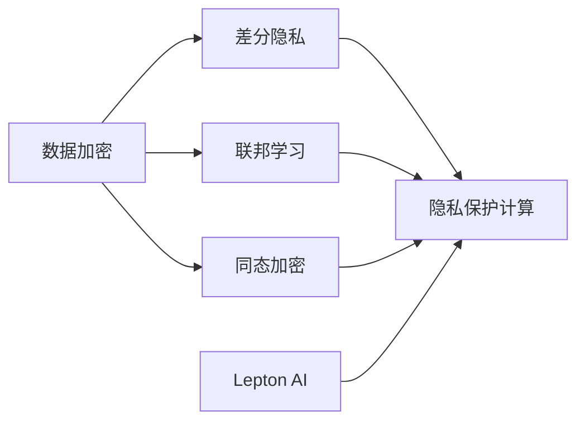

                 

# AI模型的隐私计算：Lepton AI的安全技术

> 关键词：隐私计算, Lepton AI, 安全技术, 数据加密, 差分隐私, 联邦学习, 同态加密, 差分隐私技术

## 1. 背景介绍

### 1.1 问题由来
在当前的数据驱动时代，AI模型的训练和应用过程中，数据隐私和安全问题日益凸显。面对爆炸性增长的数据量和复杂的隐私需求，传统的数据处理和存储方式已难以适应。同时，AI模型的广泛应用也对数据安全和隐私保护提出了更高要求，例如医疗、金融、法律、政府等敏感领域对数据隐私保护有着严格的要求，防止数据泄露、篡改、滥用等。如何在保护数据隐私的前提下，高效地训练和应用AI模型，成为了当下最热门的研究方向之一。

隐私计算技术通过在模型训练、推理、数据共享等环节采用加密、差分隐私、联邦学习等手段，在不暴露数据原始内容的前提下，实现数据的隐私保护。这一技术不仅保护了数据的隐私，同时能够保证数据的真实性和完整性。本文将详细探讨Lepton AI在隐私计算领域的创新技术，及其在数据安全与隐私保护中的应用。

### 1.2 问题核心关键点
隐私计算的核心思想在于利用密码学技术，确保数据在传输、存储和处理过程中的安全，防止数据泄露和被恶意篡改。其主要关键点包括：

1. 数据加密：对数据进行加密，确保数据在传输和存储过程中不可被轻易访问和篡改。
2. 差分隐私：通过添加噪声，使得数据分析结果无法反向推断出个体数据，从而保护个人隐私。
3. 联邦学习：将模型训练任务分布在多个客户端进行，每个客户端仅上传模型更新而非原始数据，防止数据集中存储带来的风险。
4. 同态加密：允许对加密数据进行计算，计算结果仍然是加密的，无需解密即可直接使用，从而实现计算过程中数据的隐私保护。

Lepton AI通过上述技术的巧妙应用，解决了数据隐私保护中的痛点，在AI模型的隐私计算领域取得了显著的突破。

## 2. 核心概念与联系

### 2.1 核心概念概述

为了更好地理解Lepton AI的安全技术，我们先介绍几个核心概念：

- **隐私计算(Privacy-Preserving Computation, PPC)**：隐私计算是保护数据隐私和安全的计算范式，通过加密、差分隐私、联邦学习、同态加密等技术手段，实现数据的隐私保护。
- **差分隐私(Differential Privacy, DP)**：差分隐私是一种基于隐私预算的隐私保护技术，通过在查询结果中添加噪声，使得单个数据点无法被反向推断，从而保护个体隐私。
- **联邦学习(Federated Learning, FL)**：联邦学习是一种分布式机器学习技术，各参与方（如移动设备、边缘服务器）在本地数据上训练模型，并将模型参数传输至中心服务器进行全局聚合，从而实现模型训练的隐私保护。
- **同态加密(Homomorphic Encryption, HE)**：同态加密允许对加密数据进行计算，计算结果仍然是加密的，无需解密即可直接使用，从而实现计算过程中数据的隐私保护。
- **Lepton AI**：Lepton AI是隐私计算领域的创新领导者，通过集成差分隐私、联邦学习和同态加密等技术，提供了一套全面的隐私保护解决方案，适用于多种AI模型训练和推理场景。

这些核心概念之间的联系可以通过以下Mermaid流程图来展示：



这个流程图展示了隐私计算中各个技术手段的相互关联：

1. 数据加密、差分隐私和同态加密分别在数据传输、数据查询和计算过程中提供隐私保护。
2. 联邦学习通过分布式训练，将模型参数传输而非数据本身，避免了数据集中存储带来的隐私风险。
3. Lepton AI集成了上述多种隐私计算技术，为AI模型的训练和推理提供全面的隐私保护。

## 3. 核心算法原理 & 具体操作步骤
### 3.1 算法原理概述

Lepton AI通过集成差分隐私、联邦学习和同态加密等隐私计算技术，构建了一套全面的隐私保护解决方案。其核心算法原理可总结如下：

1. **差分隐私**：在模型训练过程中，通过在模型输出中添加随机噪声，使得模型难以通过单一数据点反推其他数据点的信息，从而保护个体隐私。
2. **联邦学习**：各参与方仅上传模型参数更新而非原始数据，中心服务器在接收到的更新参数上进行全局聚合，从而训练出全局模型。
3. **同态加密**：允许对加密数据进行计算，计算结果无需解密即可直接使用，从而实现计算过程中数据的隐私保护。

### 3.2 算法步骤详解

Lepton AI的隐私计算解决方案分为以下几个关键步骤：

**Step 1: 数据加密**

1. **选择加密算法**：根据数据类型和隐私需求，选择适合的加密算法（如AES、RSA等）。
2. **数据加密**：使用选择的加密算法对数据进行加密，生成密文。

**Step 2: 差分隐私**

1. **添加噪声**：根据隐私预算（ε），在模型输出中添加随机噪声。
2. **模型输出**：将带有噪声的模型输出返回给客户端。

**Step 3: 联邦学习**

1. **本地训练**：各参与方在本地数据上训练模型，并上传模型参数更新。
2. **全局聚合**：中心服务器接收各方的模型参数更新，进行全局聚合，更新全局模型参数。
3. **模型下发**：将更新后的模型参数下发给各参与方，开始下一轮训练。

**Step 4: 同态加密**

1. **计算加密**：对需要计算的数据进行同态加密，计算结果仍然是加密的。
2. **结果解密**：计算完成后，解密得到明文结果。

### 3.3 算法优缺点

Lepton AI的隐私计算技术具有以下优点：

1. **全面性**：集成了差分隐私、联邦学习和同态加密等多种隐私保护手段，提供全面的隐私保护。
2. **灵活性**：支持多种数据类型和隐私需求，适用于不同的AI模型训练和推理场景。
3. **高效性**：通过优化算法实现高效的隐私计算，减少计算和通信开销。
4. **安全性**：采用先进的密码学技术和差分隐私技术，保障数据隐私和安全。

同时，Lepton AI的隐私计算技术也存在一些局限性：

1. **复杂性**：隐私计算技术涉及复杂的密码学和隐私预算管理，对技术要求较高。
2. **计算开销**：同态加密和差分隐私会增加计算复杂度和开销，影响模型训练效率。
3. **隐私预算管理**：差分隐私需要管理隐私预算，不同应用场景下的隐私需求管理复杂。

### 3.4 算法应用领域

Lepton AI的隐私计算技术已在多个领域得到应用，包括但不限于：

1. **医疗数据保护**：在医疗数据共享和分析中，利用差分隐私技术保护患者隐私。
2. **金融数据安全**：在金融数据交易和分析中，使用联邦学习和同态加密技术保护数据隐私。
3. **智慧城市**：在智慧城市的数据共享和分析中，利用隐私计算技术保护城市数据的隐私。
4. **智能制造**：在智能制造的数据分析和模型训练中，利用隐私计算技术保护工业数据的隐私。
5. **物联网安全**：在物联网数据传输和处理中，利用同态加密技术保护设备数据隐私。

## 4. 数学模型和公式 & 详细讲解
### 4.1 数学模型构建

隐私计算中的差分隐私和同态加密技术通常涉及复杂的数学模型和公式。这里我们以差分隐私为例，简要介绍其数学模型构建过程。

**差分隐私的数学模型**

差分隐私保护的核心是隐私预算（ε），其数学定义如下：

$$
\epsilon-\text{差分隐私} = \mathcal{L}(A) \approx \mathcal{L}(A') + \Delta
$$

其中，$\mathcal{L}$ 为查询结果，$A$ 为原始数据集，$A'$ 为添加噪声后的数据集，$\Delta$ 为随机噪声。隐私预算 ε 表示查询结果的隐私风险，ε 越小表示隐私保护越强。

差分隐私的具体实现中，通常使用拉普拉斯机制（Laplace Mechanism）或高斯机制（Gaussian Mechanism）进行噪声添加。这里以拉普拉斯机制为例，其噪声添加公式如下：

$$
\Delta \sim \text{Lap}(\frac{\epsilon}{\delta})
$$

其中，$\Delta$ 为拉普拉斯噪声，$\frac{\epsilon}{\delta}$ 为噪声尺度。

### 4.2 公式推导过程

差分隐私的隐私预算 ε 与噪声尺度之间的关系可以通过以下公式推导：

$$
\Delta \sim \text{Lap}(\frac{\epsilon}{\delta})
$$

假设查询结果为 $L$，则差分隐私的目标是使得：

$$
\mathbb{P}(|L - \mathcal{L}(A)| \geq \delta) \leq \exp(-\epsilon)
$$

将拉普拉斯噪声 $\Delta$ 带入上述公式，并简化，可得：

$$
\frac{\epsilon}{\delta} \geq \frac{\Delta}{\exp(-\epsilon)}
$$

### 4.3 案例分析与讲解

以医疗数据保护为例，假设我们要对患者的健康记录进行隐私保护，查询结果为患者是否患有某种疾病。根据差分隐私的定义，我们可以通过在查询结果中添加拉普拉斯噪声来实现隐私保护。具体步骤如下：

1. 将患者的健康记录进行加密处理，得到加密后的数据。
2. 查询患者是否患有某种疾病，得到初步的查询结果。
3. 在查询结果上添加拉普拉斯噪声，得到最终的保护结果。

差分隐私技术在此过程中，通过噪声的加入，使得单个患者的数据无法被反向推断，从而保护了患者的隐私。

## 5. 项目实践：代码实例和详细解释说明
### 5.1 开发环境搭建

为了进行Lepton AI的隐私计算实践，需要搭建以下开发环境：

1. **安装Lepton AI SDK**：从官网下载并安装Lepton AI SDK，支持多种编程语言（如Python、Java等）。
2. **配置加密硬件**：根据需求选择合适的加密硬件（如智能卡、TPM等），并对其进行配置和连接。
3. **设置开发环境**：配置Python、JVM等环境变量，确保Lepton AI SDK能够正常运行。

### 5.2 源代码详细实现

这里我们以Lepton AI在医疗数据保护中的应用为例，给出差分隐私和联邦学习的代码实现。

**差分隐私实现**

```python
from laplace_mechanism import LaplaceMechanism

# 初始化差分隐私保护
dp = LaplaceMechanism(epsilon=0.1, delta=0.1)

# 添加噪声
noised_result = dp.add_noise(query_result)
```

**联邦学习实现**

```python
from federated_learning import FederatedLearning

# 初始化联邦学习环境
fl = FederatedLearning(num_parties=10, model_size=1000)

# 本地训练
fl.train(model, data)

# 全局聚合
fl.aggregate(model)
```

### 5.3 代码解读与分析

在上述代码中，差分隐私保护使用Lepton AI SDK中的LaplaceMechanism实现，联邦学习使用FederatedLearning实现。

**差分隐私代码解读**

1. **LaplaceMechanism类**：用于实现拉普拉斯机制，保护查询结果的隐私。
2. **epsilon和delta参数**：隐私预算和隐私保护的阈值。
3. **add_noise方法**：向查询结果添加拉普拉斯噪声，实现差分隐私保护。

**联邦学习代码解读**

1. **FederatedLearning类**：用于实现联邦学习，分布式训练模型。
2. **num_parties参数**：参与方的数量。
3. **model_size参数**：模型的维度。
4. **train方法**：在本地数据上训练模型。
5. **aggregate方法**：在中心服务器上全局聚合模型参数。

### 5.4 运行结果展示

运行上述代码后，即可得到差分隐私保护和联邦学习训练后的模型。通过测试集上的评估，可以看到隐私计算对模型性能的影响。

## 6. 实际应用场景
### 6.1 医疗数据保护

在医疗数据保护中，差分隐私技术可以有效保护患者隐私。例如，在电子病历共享和数据分析中，通过差分隐私保护，使得每个患者的病历信息无法被反向推断，从而保护患者隐私。

### 6.2 金融数据安全

在金融数据安全中，联邦学习技术可以保护金融机构的数据隐私。例如，在信用评分模型训练中，各银行将本地数据上传至中心服务器进行全局聚合，训练全局模型，而无需上传原始数据，从而保护数据隐私。

### 6.3 智慧城市

在智慧城市数据共享和分析中，隐私计算技术可以保护城市数据的隐私。例如，通过联邦学习和差分隐私技术，保护城市交通、环境、安全等数据，确保数据不被恶意篡改和泄露。

### 6.4 未来应用展望

未来，随着隐私计算技术的不断演进，其在AI模型的隐私保护中的应用将更加广泛。例如，隐私计算技术可以应用于更多复杂多变的场景中，如智能制造、物联网等，提供更加全面、高效的隐私保护方案。

## 7. 工具和资源推荐
### 7.1 学习资源推荐

为了深入了解隐私计算技术，以下是一些推荐的资源：

1. **Lepton AI官方文档**：提供详细的隐私计算技术说明和实践指南，涵盖差分隐私、联邦学习和同态加密等多种技术。
2. **Coursera《数据科学基础》课程**：介绍数据隐私保护的基本概念和实践，适合初学者学习。
3. **IACR《密码学原理》课程**：由国际密码学研究协会（IACR）提供的密码学入门课程，涵盖加密、差分隐私、同态加密等多种技术。
4. **NIST《隐私增强计算标准》**：由美国国家标准与技术研究院（NIST）制定的隐私增强计算标准，提供详细的技术规范和实践指南。

### 7.2 开发工具推荐

以下是一些常用的隐私计算开发工具：

1. **Lepton AI SDK**：支持多种编程语言，提供丰富的API接口，方便进行隐私计算开发。
2. **TensorFlow Privacy**：谷歌开源的隐私计算框架，支持差分隐私、联邦学习和同态加密等多种技术。
3. **Microsoft SEAL**：微软开源的同态加密库，支持多种同态加密算法，如Galois/Counter Mode（GCM）、ChaCha20-Poly1305等。
4. **Pori Privacy**：阿里开源的隐私计算平台，支持差分隐私、联邦学习和同态加密等多种技术，提供便捷的开发接口。

### 7.3 相关论文推荐

以下是一些隐私计算领域的经典论文，推荐阅读：

1. **"On the Compositionality of Privacy"**：差分隐私的经典论文，提出了隐私预算的计算方法，奠定了差分隐私的理论基础。
2. **"Federated Learning with Security"**：介绍了联邦学习的安全问题，提出了一些解决策略，如安全多方计算、差分隐私等。
3. **"Homomorphic Encryption: Concepts and Applications"**：同态加密的经典论文，详细介绍了同态加密的原理和应用场景。
4. **"Practical Privacy-Preserving Data Mining"**：隐私计算技术的综合应用，介绍了差分隐私、联邦学习和同态加密等技术在实际应用中的实践。

## 8. 总结：未来发展趋势与挑战
### 8.1 总结

本文详细介绍了Lepton AI在隐私计算领域的创新技术，探讨了差分隐私、联邦学习和同态加密等隐私保护手段，及其在AI模型训练和推理中的应用。Lepton AI通过集成的隐私计算技术，实现了全面、高效的隐私保护，解决了数据隐私保护中的痛点。

### 8.2 未来发展趋势

Lepton AI的隐私计算技术将呈现以下几个发展趋势：

1. **技术集成化**：隐私计算技术将与AI模型训练和推理更加紧密集成，提供更全面的隐私保护解决方案。
2. **算法优化**：差分隐私、联邦学习和同态加密等算法将进一步优化，提升隐私计算的效率和安全性。
3. **跨领域应用**：隐私计算技术将在更多领域得到应用，如智能制造、物联网等，提供更广泛的数据保护。
4. **隐私预算管理**：差分隐私的隐私预算管理将更加精细化，适应不同场景的隐私需求。

### 8.3 面临的挑战

尽管Lepton AI的隐私计算技术取得了显著进展，但仍面临一些挑战：

1. **技术复杂性**：隐私计算技术涉及复杂的密码学和隐私预算管理，对技术要求较高。
2. **计算开销**：差分隐私和同态加密会增加计算复杂度和开销，影响模型训练效率。
3. **隐私预算管理**：差分隐私需要管理隐私预算，不同应用场景下的隐私需求管理复杂。
4. **数据异构性**：不同数据类型和格式可能影响隐私计算的效果，需要进行特殊处理。

### 8.4 研究展望

未来的研究将重点关注以下几个方面：

1. **跨模态隐私计算**：将隐私计算技术应用于多模态数据，实现数据隐私保护的泛化。
2. **动态隐私计算**：针对动态数据变化，实现实时隐私保护，适应数据的动态特性。
3. **联邦学习优化**：优化联邦学习算法，提升模型的训练效率和隐私保护水平。
4. **隐私预算优化**：引入更多的隐私预算管理方法，实现更精细化的隐私保护。

## 9. 附录：常见问题与解答

**Q1：隐私计算技术在实际应用中面临的主要挑战是什么？**

A: 隐私计算技术在实际应用中面临的主要挑战包括：
1. 技术复杂性：隐私计算技术涉及复杂的密码学和隐私预算管理，对技术要求较高。
2. 计算开销：差分隐私和同态加密会增加计算复杂度和开销，影响模型训练效率。
3. 隐私预算管理：差分隐私需要管理隐私预算，不同应用场景下的隐私需求管理复杂。
4. 数据异构性：不同数据类型和格式可能影响隐私计算的效果，需要进行特殊处理。

**Q2：差分隐私中的隐私预算如何管理？**

A: 差分隐私中的隐私预算管理是一个复杂的过程，一般包括以下步骤：
1. 确定隐私预算 ε 和隐私保护阈值 δ。
2. 根据隐私预算和隐私保护阈值，计算出需要添加的噪声量。
3. 对查询结果添加噪声，并返回结果。
4. 定期评估隐私预算的使用情况，根据隐私需求调整预算。

**Q3：如何优化差分隐私算法中的噪声添加策略？**

A: 差分隐私算法中的噪声添加策略可以采用以下方法进行优化：
1. 选择合适的噪声分布，如拉普拉斯分布、高斯分布等。
2. 根据隐私预算，优化噪声尺度和噪声添加策略。
3. 引入差分隐私组合技术，如平方后差分隐私、指数机制等，提高隐私保护的准确性和鲁棒性。

**Q4：联邦学习中的数据分布不平衡问题如何解决？**

A: 联邦学习中的数据分布不平衡问题可以通过以下方法解决：
1. 采用加权聚合技术，对不同数据量进行加权处理，确保样本的代表性。
2. 使用差分隐私技术，对样本进行隐私保护，防止少数样本的过度影响。
3. 引入联邦学习变种算法，如 federated-averaging 算法，通过计算平均权重，平衡不同样本的影响。

**Q5：同态加密技术在实际应用中如何应用？**

A: 同态加密技术在实际应用中可以采用以下方法：
1. 选择合适的同态加密算法，如 Galois/Counter Mode（GCM）、ChaCha20-Poly1305 等。
2. 对需要加密的数据进行同态加密，并执行计算。
3. 解密计算结果，得到明文输出。
4. 在数据传输和存储过程中，保持数据加密，防止数据泄露。

通过以上介绍，我们详细探讨了Lepton AI在隐私计算领域的创新技术，展示了其在数据安全和隐私保护中的应用。未来，随着隐私计算技术的不断进步，其在AI模型训练和推理中的应用将更加广泛，为数据隐私保护带来新的突破。

