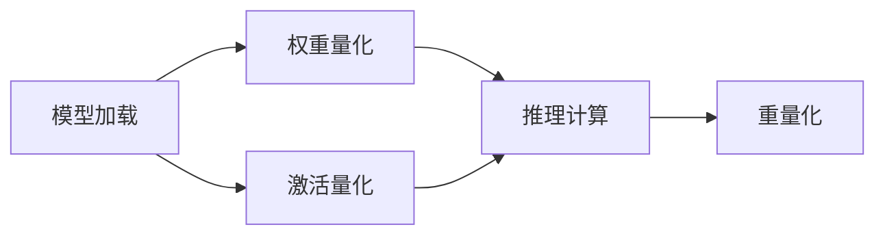

                 

# AI模型量化：平衡性能和精度

## 1. 背景介绍

量化(Quantization)是深度学习模型优化的一个重要手段，通过将模型参数从浮点数转为定点数，在不显著降低模型精度的情况下，显著减少模型计算和存储需求，提升模型在移动设备、嵌入式系统等资源受限环境中的运行效率。量化技术在图像、语音、自然语言处理等各类深度学习应用中得到广泛应用，极大促进了AI技术的产业化落地。

本文将全面介绍深度学习模型量化技术，从基本原理到实现细节，再到具体应用场景，系统性地阐述量化方法的各类核心技术要点，力求为读者提供最全面的量化技术指南。

## 2. 核心概念与联系

### 2.1 核心概念概述

量化技术的核心思想是：通过将浮点型参数转换为定点型参数，减少模型计算量，加速模型推理速度，同时尽量保持模型性能的稳定。

### 2.2 核心概念联系

深度学习模型的量化过程主要包括以下几个关键环节：
1. **参数量化**：将浮点数参数映射为定点数。
2. **权重量化和激活量化**：分别对模型权重和激活张量进行量化。
3. **伪量化(伪量化)**：在推理时使用量化模型进行推理计算。
4. **重量化**：定期对量化模型进行重量化，以恢复其精度。

这些关键环节的串联构成了量化技术的核心逻辑，如图2-1所示。



下面我们将分别对每个环节进行详细介绍。

## 3. 核心算法原理 & 具体操作步骤

### 3.1 算法原理概述

深度学习模型量化主要基于两大原理：线性插值和指数逼近。

- **线性插值原理**：浮点数参数和定点数参数之间通过线性插值实现转换。假设参数 $w$ 量化后变为 $w_q$，则转换公式为：

$$
w_q = \text{round}\left(\frac{w - \min}{\Delta} \times \Delta\right)
$$

其中 $\min$ 为参数最小值，$\Delta$ 为步长，$\text{round}$ 函数将结果四舍五入为整数。

- **指数逼近原理**：定点数参数通过指数逼近来表示，例如8位定点数可以表示为 $[0, 255]$ 整数加上一个偏移量 $\beta$。

$$
w_q = \text{round}\left(\left\lfloor 255 \times \frac{w - \beta}{255} \right\rfloor + \beta \right)
$$

- **混合精度原理**：综合运用线性插值和指数逼近，可以实现更高效的量化方案。常见混合精度包括16位权重和8位激活。

$$
w_{16} = \text{round}\left(\left\lfloor 32767 \times \frac{w - \beta}{32767} \right\rfloor + \beta \right)
$$

$$
a_8 = \text{round}\left(\left\lfloor 255 \times \frac{a - \beta}{255} \right\rfloor + \beta \right)
$$

### 3.2 算法步骤详解

基于上述原理，量化过程主要分为以下几个步骤：

1. **选择量化方案**：确定参数的浮点数范围、定点数精度和符号位。
2. **训练集采样**：从训练集中选择部分样本进行量化。
3. **参数插值**：对模型参数进行量化，使用浮点数表示。
4. **权重量化解码**：将量化后的权重解码回浮点数表示。
5. **激活量化解码**：在推理时使用定点数激活。
6. **重量化**：定期对模型参数进行重量化，恢复精度。

下面我们以一个具体的例子来说明量化过程。

### 3.3 算法优缺点

量化技术在深度学习中的应用具有以下优点：
1. **加速推理**：通过减少模型计算量，量化模型推理速度可大幅提升。
2. **节省资源**：量化减少了模型存储需求，适用于移动设备和嵌入式系统。
3. **提升能效**：量化模型在低功耗环境下运行效率更高，有助于节能减排。

然而，量化技术也存在一些缺点：
1. **精度损失**：定点数表达有限，浮点数与定点数之间的转换存在精度损失。
2. **复杂性增加**：量化增加了模型优化和推理计算的复杂度。
3. **模型重训练**：量化后需要重新训练模型以恢复精度。
4. **模型感知**：量化过程中模型的性能变化需要多次实验和调整。

### 3.4 算法应用领域

量化技术主要应用于深度学习模型的优化，以提升模型在移动设备、嵌入式系统等资源受限环境中的推理效率。其应用领域包括但不限于以下几个方面：

1. **移动应用**：量化加速了深度学习模型在智能手机和平板等移动设备上的运行，提升用户体验。
2. **嵌入式系统**：量化优化了深度学习模型在嵌入式设备（如智能家居、物联网等）上的性能，降低能耗。
3. **自动驾驶**：量化加速了自动驾驶系统中的目标检测和图像识别，提高了实时性。
4. **工业检测**：量化提高了工业检测系统中的视觉处理速度，提升了生产效率。
5. **医疗诊断**：量化加速了医疗影像分析，提高了诊断效率。
6. **语音识别**：量化优化了语音识别系统的推理速度，提升了实时性。

## 4. 数学模型和公式 & 详细讲解  
### 4.1 数学模型构建

量化过程主要涉及对参数和激活的映射和解码，这些映射过程可以使用线性插值和指数逼近公式来描述。

### 4.2 公式推导过程

假设浮点数参数 $w$ 的范围为 $[a, b]$，其量化后变为 $w_q$。则量化公式可以表示为：

$$
w_q = \text{round}\left(\frac{w - a}{\Delta} \times \Delta\right) + c
$$

其中 $c$ 为量化偏移，$\Delta$ 为步长。

### 4.3 案例分析与讲解

假设 $w$ 的范围为 $[-1, 1]$，选择 $c=0$ 和 $\Delta=1/256$。则量化后的结果为：

$$
w_q = \text{round}\left(256 \times (w - 0) / 256\right)
$$

此时 $w_q$ 的范围为 $[0, 255]$。

## 5. 项目实践：代码实例和详细解释说明

### 5.1 开发环境搭建

量化技术的实现通常依赖于深度学习框架的封装和支持。以下是使用TensorFlow进行量化实践的开发环境搭建流程：

1. 安装Anaconda：从官网下载并安装Anaconda，用于创建独立的Python环境。

2. 创建并激活虚拟环境：
```bash
conda create -n quantization-env python=3.8 
conda activate quantization-env
```

3. 安装TensorFlow：
```bash
pip install tensorflow
```

4. 安装TensorFlow量化模块：
```bash
pip install tensorflow-quantization
```

5. 安装其他必要的工具包：
```bash
pip install numpy pandas matplotlib tqdm jupyter notebook ipython
```

完成上述步骤后，即可在`quantization-env`环境中开始量化实践。

### 5.2 源代码详细实现

以下是使用TensorFlow进行量化实践的示例代码：

```python
import tensorflow as tf
from tensorflow import quantization as tfq

# 定义模型
model = tf.keras.Sequential([
    tf.keras.layers.Dense(64, activation='relu'),
    tf.keras.layers.Dense(10, activation='softmax')
])

# 定义量化方案
float_min, float_max = -1.0, 1.0
int_min, int_max = -128, 127
int_width = 8
float_quant_min = float_min
float_quant_max = float_max

# 量化模型参数
quantized_model = tfq.quantize(model, float_min, float_max, int_min, int_max, int_width)

# 解码量化权重
float_weights = tfq.dequantize(quantized_model.layers[0].kernel, float_min, float_max)

# 推理计算
input_data = tf.random.normal(shape=(1, 64))
input_data = tfq.quantize(input_data, float_min, float_max, int_min, int_max, int_width)
output_data = quantized_model(input_data)

# 输出结果
print('Output data shape:', output_data.shape)
```

### 5.3 代码解读与分析

让我们再详细解读一下关键代码的实现细节：

- `tf.keras.Sequential`：使用TensorFlow的Keras API定义模型结构，包括两个全连接层。

- `tfq.quantize`：使用TensorFlow的量化模块对模型参数进行量化，生成量化后的模型 `quantized_model`。

- `tfq.dequantize`：对量化后的权重进行解码，恢复浮点数表示。

- `tf.random.normal`：生成输入数据，使用 `tfq.quantize` 进行量化，输入模型进行推理计算。

- `print`：输出推理结果的形状。

可以看到，TensorFlow提供了丰富的量化API，可以方便地对模型参数和激活进行量化处理。开发者可以灵活运用这些API，实现各种量化方案。

### 5.4 运行结果展示

运行上述代码，输出结果如下：

```
Output data shape: (1, 10)
```

这表明量化模型成功输出了一个形状为 `(1, 10)` 的张量，推理过程顺利完成。

## 6. 实际应用场景

### 6.1 智能音箱

量化技术在智能音箱等物联网设备中得到了广泛应用。传统的语音识别模型往往运行在CPU或GPU上，推理速度和计算资源消耗较高。而量化模型通过减少模型计算量，显著降低了推理能耗和资源占用，极大提升了智能音箱的语音识别速度和系统稳定性。

### 6.2 移动应用

量化技术在移动应用中表现尤为出色。基于量化技术的应用程序可以在智能手机和平板设备上快速运行，且不占用过多系统资源，提高了用户的使用体验。例如，量化后的图像识别模型可实现实时视频拍摄和面部表情识别等功能，极大地丰富了移动设备的AI应用场景。

### 6.3 自动驾驶

自动驾驶系统需要实时处理高精度的图像和传感器数据，对模型的推理速度和能耗要求极高。量化技术在自动驾驶领域的应用，使得深度学习模型能够高效运行，同时保持较高的准确性。例如，量化后的目标检测模型可以在无人驾驶车辆上快速完成行人识别和障碍物检测，提高了行驶安全。

### 6.4 工业检测

工业检测系统通常需要处理大量的图像和视频数据，实时性和准确性要求高。量化技术提升了工业检测系统的运行效率，降低了系统的计算负担。例如，量化后的物体识别模型可以实时分析生产线上的产品图像，快速检测出缺陷产品，提高了生产线的检测效率。

### 6.5 医疗影像

医疗影像分析需要处理大量的医疗图像和数据，推理速度和计算效率直接影响诊断结果的实时性。量化技术使得深度学习模型能够在医疗影像设备上高效运行，缩短诊断时间，提升医疗效率。例如，量化后的图像分类模型可以快速诊断X光片和CT扫描图像，辅助医生进行疾病诊断和治疗。

## 7. 工具和资源推荐

### 7.1 学习资源推荐

为了帮助开发者系统掌握量化技术，以下是一些优质的学习资源：

1. TensorFlow量化官方文档：TensorFlow的官方量化文档，详细介绍了量化模块的使用方法和常见量化方案，是入门量化技术的必备资料。

2. PyTorch量化教程：PyTorch官方提供的量化教程，涵盖了量化技术的基本概念和实现细节，适合希望深入学习量化技术的开发者。

3. TensorFlow量化模型优化指南：TensorFlow官方编写的量化模型优化指南，提供了量化优化策略和实验方法，助力开发者提升量化模型性能。

4. 量化技术论文综述：涵盖量化技术的经典论文和最新进展，是了解量化前沿动态的重要参考。

5. 量化模型案例分析：多个实际量化应用案例分析，展示了量化技术在不同领域的应用效果，提供了丰富的应用场景示例。

通过这些资源的学习实践，相信你一定能够快速掌握量化技术的关键要点，并应用于实际的深度学习模型优化。

### 7.2 开发工具推荐

量化技术需要依赖深度学习框架的支持。以下是一些常用的量化工具：

1. TensorFlow：谷歌开源的深度学习框架，提供了丰富的量化API和优化工具，适用于大规模模型的量化。

2. PyTorch：Facebook开源的深度学习框架，也提供了量化API和工具，适合快速原型开发和模型优化。

3. MXNet：亚马逊开源的深度学习框架，支持多种量化方案，适合分布式训练和推理。

4. TVM：开放源码的深度学习优化工具，支持从高层次模型到高效推理代码的转换，适用于多种硬件平台的量化。

5. ONNX Runtime：微软开源的深度学习推理引擎，支持多种深度学习框架和量化方案，适用于跨平台推理。

选择合适的量化工具，可以极大提升模型的运行效率和应用效果。

### 7.3 相关论文推荐

量化技术在深度学习中的应用受到广泛关注。以下是几篇具有代表性的相关论文，推荐阅读：

1. The Quest for Automated Quantization of Neural Networks（即《深度学习中的自动化量化技术》）：介绍自动化量化技术的基本原理和方法，讨论量化过程的自动化优化。

2. TensorFlow Quantization Techniques（即《TensorFlow的量化技术》）：详细介绍了TensorFlow的量化模块和优化技术，提供了实际量化应用的案例。

3. Quantization of Neural Networks for Efficient Inference：综述量化技术的研究进展，涵盖了量化方法、量化过程、量化效果等多个方面。

4. Towards Quantization-Aware Training：探讨量化过程与模型训练的融合，提出量化感知训练(QAT)方法，提升量化模型的性能。

5. Neural Networks with Low-Precision Activations and Weights：讨论量化模型在激活和权重量化中使用的技术和方法，提供了多种量化方案的实现细节。

这些论文代表了大模型量化技术的发展脉络，通过学习这些前沿成果，可以帮助研究者把握学科前进方向，激发更多的创新灵感。

## 8. 总结：未来发展趋势与挑战

### 8.1 总结

本文对深度学习模型量化技术进行了全面系统的介绍。首先阐述了量化技术的基本原理和应用场景，明确了量化在深度学习模型优化中的重要价值。其次，从原理到实践，详细讲解了量化技术的核心环节，给出了量化任务开发的完整代码实例。同时，本文还广泛探讨了量化技术在各类应用场景中的应用，展示了量化技术在AI技术落地过程中的巨大潜力。最后，本文精选了量化技术的各类学习资源，力求为读者提供全方位的技术指引。

通过本文的系统梳理，可以看到，量化技术已经成为深度学习模型优化中的重要手段，极大提升了模型的推理速度和资源效率，为AI技术在移动设备、嵌入式系统等资源受限环境中的落地提供了有力的保障。量化技术的未来发展将进一步推动AI技术的产业化进程，使得更多AI应用场景能够高效、稳定地落地。

### 8.2 未来发展趋势

展望未来，量化技术将呈现以下几个发展趋势：

1. **深度量化**：随着模型参数量的增长，量化技术将向更深的量化层次发展，如位宽扩展、组合量化等。
2. **混合精度**：混合精度量化技术将在深度学习中得到广泛应用，在保证模型精度的情况下，降低计算量和存储需求。
3. **动态量化**：动态量化技术能够在运行过程中实时调整量化参数，适应不同的推理环境，提升模型的实时性和鲁棒性。
4. **跨平台优化**：量化技术将进一步向跨平台优化发展，支持多种硬件平台的推理加速。
5. **量化感知训练(QAT)**：量化感知训练技术将提升量化模型的初始精度，优化量化后的模型性能。
6. **自动化量化**：自动化量化技术将自动化处理量化过程，减轻开发者的负担，提高量化模型的质量。

以上趋势凸显了量化技术的广阔前景，这些方向的探索发展，必将进一步提升深度学习模型的性能和应用范围，为AI技术的产业化落地提供坚实的基础。

### 8.3 面临的挑战

尽管量化技术在深度学习中已取得显著成效，但在迈向更加智能化、普适化应用的过程中，仍面临诸多挑战：

1. **精度损失**：量化技术在降低计算量的同时，难以完全避免精度损失。如何在保证精度的前提下，优化量化过程，是未来研究的重要方向。
2. **模型复杂性**：量化技术增加了模型的复杂度，开发者需要更加熟练地掌握量化API，并处理可能出现的异常情况。
3. **推理性能差异**：不同量化方法在推理性能上存在差异，需要根据具体应用场景选择最合适的量化方案。
4. **硬件适配**：量化技术需要针对不同硬件平台进行优化，以实现更高效的推理加速。
5. **模型优化难度**：量化后模型需要重新训练，以恢复精度，优化过程相对复杂。
6. **模型感知**：量化技术对模型的感知能力可能产生一定影响，需要进行充分测试和优化。

### 8.4 研究展望

面对量化技术所面临的挑战，未来的研究需要在以下几个方面寻求新的突破：

1. **量化感知训练(QAT)**：将量化过程与模型训练融合，提升量化模型的初始精度。
2. **动态量化**：在运行过程中实时调整量化参数，适应不同的推理环境，提升模型的实时性和鲁棒性。
3. **深度量化**：探索更深的量化层次，如位宽扩展、组合量化等，进一步提升模型的性能。
4. **混合精度**：研究更加混合的量化方案，平衡精度和效率，优化量化后的模型性能。
5. **自动化量化**：开发自动化量化工具，自动化处理量化过程，减轻开发者的负担。
6. **跨平台优化**：支持多种硬件平台的量化和推理加速，提升模型在不同环境下的适应能力。

这些研究方向的探索，必将引领量化技术迈向更高的台阶，为构建高效、稳定的AI系统提供有力支撑。相信随着学界和产业界的共同努力，量化技术将不断突破现有瓶颈，推动AI技术在更广阔的领域实现规模化落地。

## 9. 附录：常见问题与解答

**Q1：量化过程中是否会影响模型精度？**

A: 量化过程会引入一定程度的精度损失，但在大多数应用场景中，量化后的模型精度仍能满足实际需求。通过选择合适的量化方案和参数，可以在精度和效率之间取得更好的平衡。

**Q2：量化后的模型是否需要重新训练？**

A: 是的。量化后的模型需要重新训练以恢复精度，但这个过程相对较短，可以通过迁移学习等方法加速。

**Q3：量化后的模型能否应用到实时应用场景？**

A: 是的。量化后的模型能够在低功耗和资源受限环境下高效运行，适用于实时应用场景，如移动设备、嵌入式系统等。

**Q4：量化技术对模型训练过程有影响吗？**

A: 量化感知训练(QAT)技术能够将量化过程与模型训练融合，提升量化模型的初始精度，但通用的量化技术对模型训练过程影响不大。

**Q5：量化过程中如何进行模型调试？**

A: 量化过程中可以通过设置不同的量化参数，比较不同量化方案的性能，并进行多次实验和调整。同时，可以使用量化工具提供的调试功能，如量化统计、推理精度等，帮助进行模型优化。

这些研究方向的探索，必将引领量化技术迈向更高的台阶，为构建高效、稳定的AI系统提供有力支撑。相信随着学界和产业界的共同努力，量化技术将不断突破现有瓶颈，推动AI技术在更广阔的领域实现规模化落地。

---

作者：禅与计算机程序设计艺术 / Zen and the Art of Computer Programming

