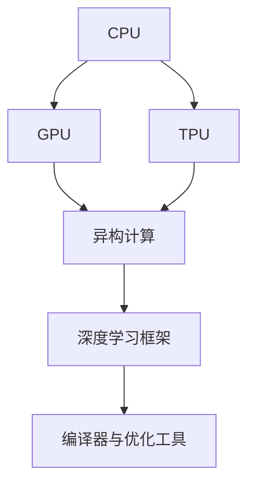

                 

# AI硬件加速：CPU与GPU的选择与应用

## 1. 背景介绍

随着人工智能(AI)技术的飞速发展，算力需求日益增长，传统CPU已无法满足复杂计算任务的要求。为了提升AI系统的性能，硬件加速成为了必不可少的解决方案。而CPU与GPU作为两类主流的硬件加速方案，各自具有显著的优势与劣势。本文旨在探讨如何选择和应用CPU与GPU进行AI硬件加速，以实现最佳的计算效果。

## 2. 核心概念与联系

### 2.1 核心概念概述

为更好地理解AI硬件加速及其在CPU与GPU之间的选择与应用，本节将介绍几个密切相关的核心概念：

- **CPU（中央处理器）**：作为计算机的运算和控制核心，CPU主要负责指令解码、数据处理、计算逻辑等任务。具备通用性、稳定性、易扩展等特点。

- **GPU（图形处理器）**：最初用于加速图形渲染，GPU具有极高的并行计算能力和能耗效率，近年来被广泛用于AI计算。

- **TPU（Tensor Processing Unit）**：谷歌推出的专用AI加速器，针对TensorFlow优化，专为AI计算而设计，具备极高的计算密度和能效比。

- **异构计算**：将不同类型的处理器（如CPU、GPU、TPU）结合，利用其各自优势，提升整体的计算性能与效率。

- **深度学习框架**：如TensorFlow、PyTorch、MXNet等，提供高层抽象接口，支持CPU、GPU、TPU等多种硬件加速方案。

- **编译器与优化工具**：如OpenCL、CUDA、NNPACK等，提供底层硬件指令优化，进一步提升硬件加速效率。

这些核心概念之间的逻辑关系可以通过以下Mermaid流程图来展示：



这个流程图展示了CPU、GPU和TPU的相互关系及在AI硬件加速中的应用：

1. CPU通过通用性优势作为计算的主力军。
2. GPU利用并行计算能力辅助CPU完成复杂计算任务。
3. TPU作为谷歌推出的专用AI加速器，进一步提升了AI计算效率。
4. 通过异构计算，将不同类型处理器结合，提升整体性能。
5. 深度学习框架和编译器/优化工具对硬件加速进行上层和底层优化。

## 3. 核心算法原理 & 具体操作步骤
### 3.1 算法原理概述

AI硬件加速的核心原理在于利用硬件的并行计算能力，加速神经网络的训练与推理。CPU与GPU的选择与应用，主要基于以下几方面考虑：

1. **计算能力**：不同类型处理器的浮点运算速度和并行处理能力。
2. **能耗效率**：处理器在单位时间内的计算性能和能耗比。
3. **内存带宽**：处理器与内存之间的数据传输速率，影响数据处理效率。
4. **编程复杂度**：处理器对上层算法的支持程度，包括编程难度和优化工具的可用性。
5. **应用场景**：不同任务对处理器的具体需求，如实时性、稳定性和扩展性。

### 3.2 算法步骤详解

选择合适的硬件加速方案，一般遵循以下步骤：

**Step 1: 需求分析**
- 明确任务类型（如训练、推理、实时处理等），确定性能与能耗的要求。
- 评估数据规模、模型复杂度和计算负载。

**Step 2: 硬件选择**
- 基于需求分析结果，选择CPU、GPU或TPU等硬件平台。
- 综合考虑计算能力、内存带宽和编程复杂度等因素。

**Step 3: 优化与调试**
- 设计高效的算法和数据结构，利用编译器与优化工具进行优化。
- 测试与调优，确保硬件与软件高效协同工作。

**Step 4: 部署与监控**
- 将优化后的应用部署到目标硬件平台。
- 监控系统性能，根据实际运行情况进行进一步优化。

### 3.3 算法优缺点

CPU与GPU的选择与应用，各有其优缺点：

**CPU的优点**：
1. **通用性**：广泛用于通用计算任务，兼容性好。
2. **稳定性**：具有高可靠性和稳定性。
3. **编程灵活性**：易于使用高层次编程语言（如Python）进行开发。

**CPU的缺点**：
1. **计算能力有限**：浮点运算速度相对较慢，并发处理能力较低。
2. **能耗高**：相同计算任务下，能耗较大。

**GPU的优点**：
1. **计算能力强**：具有极高的并行处理能力和浮点运算速度。
2. **能效比高**：能耗相对较低，单位能耗下计算性能更高。
3. **内存带宽高**：数据传输速率快，适合大规模数据处理。

**GPU的缺点**：
1. **编程复杂**：编程模型复杂，需熟悉低层次的并行编程。
2. **片内缓存小**：内存与处理器之间的数据传输速度受限。

### 3.4 算法应用领域

AI硬件加速技术在不同领域的应用场景中，表现出显著的优势：

- **深度学习**：在深度神经网络的训练与推理中，GPU凭借高并行能力和低能耗，显著提升了训练效率和推理速度。
- **计算机视觉**：GPU的图形渲染能力，使其在图像处理、视频分析等视觉任务中表现出色。
- **自然语言处理**：GPU的并行能力适用于自然语言模型的训练，加速了语言模型的生成与推理。
- **数据分析**：GPU的高计算能力和低能耗，使其在大数据分析、数据挖掘等任务中具有竞争优势。
- **游戏与虚拟现实**：GPU在图形渲染和动态效果生成中不可或缺，是支持游戏与虚拟现实体验的关键硬件。

## 4. 数学模型和公式 & 详细讲解

### 4.1 数学模型构建

基于GPU加速的AI计算模型，可以表示为：

$$
\text{Output} = f(\text{Data}, \text{Model}, \text{Hardware})
$$

其中：
- $\text{Data}$：输入数据，如图像、文本、音频等。
- $\text{Model}$：神经网络模型，包含多个计算层。
- $\text{Hardware}$：硬件加速平台，如CPU、GPU、TPU等。

### 4.2 公式推导过程

以深度学习为例，使用GPU加速的计算过程可以表示为：

$$
\begin{aligned}
&\text{Forward Pass} \\
&y = Wx + b \\
&\text{Backward Pass} \\
&\frac{\partial L}{\partial W} = \frac{\partial L}{\partial y}\frac{\partial y}{\partial W} \\
&\frac{\partial L}{\partial b} = \frac{\partial L}{\partial y}\frac{\partial y}{\partial b} \\
&\frac{\partial L}{\partial x} = \frac{\partial L}{\partial y}\frac{\partial y}{\partial x}
\end{aligned}
$$

其中 $L$ 为损失函数，$x$ 为输入，$W$ 为权重，$b$ 为偏置，$y$ 为输出。通过反向传播算法，计算梯度并更新模型参数。

### 4.3 案例分析与讲解

以卷积神经网络（CNN）为例，CNN模型的加速过程如下：

**Step 1: 数据并行化**
- 将数据分为多个小块，分别在GPU的不同核心上并行处理。

**Step 2: 模型并行化**
- 将模型中不同的计算层分配到不同的GPU核心上，并行执行。

**Step 3: 参数共享**
- 对于共享参数，如卷积核，可以在GPU之间共享，减少内存使用。

**Step 4: 优化算法**
- 使用优化算法（如SGD、Adam）加速模型训练过程。

## 5. 项目实践：代码实例和详细解释说明
### 5.1 开发环境搭建

在进行AI硬件加速实践前，我们需要准备好开发环境。以下是使用Python和CUDA进行GPU加速开发的环境配置流程：

1. 安装Anaconda：从官网下载并安装Anaconda，用于创建独立的Python环境。

2. 创建并激活虚拟环境：
```bash
conda create -n pytorch-env python=3.8 
conda activate pytorch-env
```

3. 安装PyTorch：根据CUDA版本，从官网获取对应的安装命令。例如：
```bash
conda install pytorch torchvision torchaudio cudatoolkit=11.1 -c pytorch -c conda-forge
```

4. 安装TensorFlow：通过pip安装TensorFlow及其GPU版本。例如：
```bash
pip install tensorflow-gpu==2.5
```

5. 安装CUDA与CUDNN：从NVIDIA官网下载对应版本的CUDA与CUDNN，并配置环境变量。

完成上述步骤后，即可在`pytorch-env`环境中开始AI硬件加速的开发实践。

### 5.2 源代码详细实现

以下是使用PyTorch和CUDA实现GPU加速卷积神经网络的代码实现：

```python
import torch
import torch.nn as nn
import torch.cuda as cuda

class ConvNet(nn.Module):
    def __init__(self):
        super(ConvNet, self).__init__()
        self.conv1 = nn.Conv2d(3, 16, kernel_size=3, stride=1, padding=1)
        self.conv2 = nn.Conv2d(16, 32, kernel_size=3, stride=1, padding=1)
        self.fc1 = nn.Linear(32*8*8, 64)
        self.fc2 = nn.Linear(64, 10)
        
    def forward(self, x):
        x = self.conv1(x)
        x = nn.functional.relu(x)
        x = self.conv2(x)
        x = nn.functional.relu(x)
        x = nn.functional.max_pool2d(x, 2)
        x = x.view(-1, 32*8*8)
        x = self.fc1(x)
        x = nn.functional.relu(x)
        x = self.fc2(x)
        return nn.functional.log_softmax(x, dim=1)

model = ConvNet().cuda()

# 使用GPU进行计算
data = torch.randn(64, 3, 224, 224)
labels = torch.empty(64, dtype=torch.long).random_(10)
optimizer = torch.optim.SGD(model.parameters(), lr=0.01, device=cuda.current_device())
criterion = nn.CrossEntropyLoss()

output = model(data)
loss = criterion(output, labels)
loss.backward()
optimizer.step()
```

### 5.3 代码解读与分析

让我们再详细解读一下关键代码的实现细节：

**ConvNet类**：
- `__init__`方法：初始化卷积层、池化层和全连接层。
- `forward`方法：定义前向传播过程，将输入数据通过卷积层、池化层和全连接层，最后输出预测结果。

**模型部署与计算**：
- `model.cuda()`：将模型部署到GPU上，使用`cuda.current_device()`指定GPU设备。
- `data = torch.randn(...)`：创建随机输入数据。
- `labels = ...`：创建随机标签。
- `optimizer`：定义优化器，指定学习率和设备。
- `criterion`：定义损失函数，使用`nn.CrossEntropyLoss()`进行交叉熵损失计算。
- `output = model(data)`：在GPU上前向传播计算输出。
- `loss = criterion(output, labels)`：计算损失。
- `loss.backward()`：反向传播计算梯度。
- `optimizer.step()`：更新模型参数。

## 6. 实际应用场景
### 6.1 自动驾驶

自动驾驶系统需要实时处理大量的传感器数据，进行环境感知、路径规划和决策等复杂计算任务。GPU的高并行处理能力和低能耗，使其在自动驾驶领域具有重要应用。

在自动驾驶中，GPU可以加速深度神经网络的训练与推理，进行高分辨率地图处理、障碍物检测、路径规划等任务。同时，GPU的图形渲染能力，也能支持虚拟驾驶模拟和环境渲染，提升驾驶安全性。

### 6.2 金融风控

金融行业对实时计算和复杂模型训练有着极高的要求。GPU在金融风控中的应用主要集中在数据预处理、风险评估和实时交易等方面。

通过GPU加速，金融公司可以高效处理大规模数据集，实时计算风险评估模型，预测市场波动和交易风险。同时，GPU的高并行能力也支持高频交易系统的构建，提升交易效率和市场反应速度。

### 6.3 医疗影像诊断

医疗影像诊断需要处理大量的医学图像，进行特征提取、分类和分析。GPU的并行处理能力和高计算密度，使其在医疗影像处理中具有显著优势。

在医疗影像诊断中，GPU可以加速深度学习模型的训练与推理，进行图像分割、病灶检测、病理学分析等任务。同时，GPU的高能效比也降低了能源消耗，降低了医疗成本。

### 6.4 未来应用展望

随着AI技术的发展，AI硬件加速在更多领域将得到应用，推动产业变革。

在智能制造中，AI硬件加速可以优化生产调度、质量检测和设备维护等环节，提升生产效率和产品质量。

在智慧城市中，AI硬件加速可以支持城市管理、智能交通和环境监测等任务，提升城市管理水平和居民生活质量。

在教育领域，AI硬件加速可以加速教育资源获取、智能辅导和个性化学习等应用，提升教育公平和教学质量。

## 7. 工具和资源推荐
### 7.1 学习资源推荐

为了帮助开发者系统掌握AI硬件加速的理论基础和实践技巧，这里推荐一些优质的学习资源：

1. **《深度学习》**系列书籍：如《深度学习》（Goodfellow等著）、《动手学深度学习》等，提供深入浅出的深度学习理论知识。
2. **《GPU编程指南》**系列书籍：如《CUDA by Example》等，详细介绍了GPU编程技术和实践经验。
3. **在线课程**：如Coursera的《深度学习专项课程》、edX的《GPU编程与深度学习》等，提供系统化的学习路径。
4. **官方文档**：如PyTorch的官方文档、TensorFlow的官方文档等，提供详尽的API使用指南和样例代码。
5. **开源项目**：如TensorFlow、PyTorch等，提供丰富的预训练模型和微调范式，助力快速开发。

通过对这些资源的学习实践，相信你一定能够快速掌握AI硬件加速的理论基础和实践技巧，并用于解决实际的AI计算问题。

### 7.2 开发工具推荐

高效的开发离不开优秀的工具支持。以下是几款用于AI硬件加速开发的常用工具：

1. **PyTorch**：基于Python的开源深度学习框架，灵活动态的计算图，适合快速迭代研究。提供丰富的GPU加速支持。
2. **TensorFlow**：由Google主导开发的开源深度学习框架，生产部署方便，适合大规模工程应用。支持GPU加速和分布式训练。
3. **CUDA**：NVIDIA推出的GPU编程平台，提供高性能GPU计算库和优化工具。
4. **OpenCL**：跨平台GPU编程标准，支持GPU、FPGA等多种硬件加速平台。
5. **NNPACK**：开源的神经网络加速库，提供高效的矩阵运算和优化算法。

合理利用这些工具，可以显著提升AI硬件加速任务的开发效率，加快创新迭代的步伐。

### 7.3 相关论文推荐

AI硬件加速技术的发展源于学界的持续研究。以下是几篇奠基性的相关论文，推荐阅读：

1. **CUDA并行编程**：NVIDIA的《CUDA并行编程指南》，详细介绍了CUDA编程技术和优化策略。
2. **深度学习GPU加速**：AlexNet和ResNet等经典论文，展示了深度学习模型在GPU上的高效加速效果。
3. **混合精度训练**：Google的《Mixed-Precision Training with TensorFlow》等论文，介绍了混合精度训练技术，提升模型训练效率。
4. **模型并行与分布式训练**：NVIDIA的《Model Parallelism and Distributed Training in PyTorch》等论文，介绍了模型并行与分布式训练的优化方法。

这些论文代表了大语言模型微调技术的发展脉络。通过学习这些前沿成果，可以帮助研究者把握学科前进方向，激发更多的创新灵感。

## 8. 总结：未来发展趋势与挑战
### 8.1 研究成果总结

本文对AI硬件加速及其在CPU与GPU之间的选择与应用进行了全面系统的介绍。首先阐述了AI硬件加速的背景和需求分析，明确了硬件加速的重要性。其次，从原理到实践，详细讲解了CPU与GPU的计算能力、能耗效率、内存带宽、编程复杂度等关键因素，给出了硬件选择与应用的具体步骤。同时，本文还广泛探讨了AI硬件加速在自动驾驶、金融风控、医疗影像诊断等领域的实际应用前景，展示了硬件加速的巨大潜力。最后，本文精选了学习资源、开发工具和相关论文，力求为读者提供全方位的技术指引。

通过本文的系统梳理，可以看到，AI硬件加速在提升AI系统性能、优化资源利用率、降低计算成本等方面具有重要意义。CPU与GPU作为两种主流硬件加速方案，各自具有显著的优势与劣势。合理选择与搭配，可以最大化地发挥硬件的计算潜力，推动AI技术的发展与应用。

### 8.2 未来发展趋势

展望未来，AI硬件加速技术将呈现以下几个发展趋势：

1. **异构计算的发展**：CPU、GPU、TPU等不同类型处理器的结合，将进一步提升整体计算性能和能效比。
2. **低功耗加速器的普及**：低功耗的AI加速器（如RISC-V、Sparse-ML等）逐渐应用于实际应用中，降低能耗和成本。
3. **边缘计算的崛起**：将AI计算任务从中心服务器转移到边缘设备（如嵌入式设备、IoT设备）上，提升计算效率和响应速度。
4. **数据中心架构的优化**：数据中心将更多地采用混合计算架构，结合CPU、GPU、FPGA等多种硬件加速资源，提升整体计算能力。
5. **跨平台优化**：开发跨平台硬件加速方案，支持多种硬件平台（如CPU、GPU、FPGA、ARM等），实现更广泛的硬件兼容性。

这些趋势将推动AI硬件加速技术的不断发展，带来更高的计算性能和更低的能耗成本，提升AI技术在各行各业的应用效果。

### 8.3 面临的挑战

尽管AI硬件加速技术已经取得了显著成就，但在迈向更加智能化、普适化应用的过程中，它仍面临着诸多挑战：

1. **能耗与散热**：大规模AI计算任务带来的大量热量和能耗，对硬件设备的散热和能耗控制提出了更高的要求。
2. **编程复杂性**：不同硬件平台的编程模型和优化工具各异，开发者需要具备多方面的编程技能和优化经验。
3. **数据传输瓶颈**：处理器与内存之间的数据传输速率，影响计算效率，需要优化数据传输机制。
4. **模型可移植性**：不同硬件平台的模型性能差异较大，模型在不同硬件上的可移植性问题仍需解决。
5. **硬件兼容性**：不同硬件平台之间的兼容性问题，影响软硬件协同工作的效果。

解决这些挑战，需要硬件、软件和算法三方面的协同创新，推动AI硬件加速技术的全面发展。

### 8.4 研究展望

面对AI硬件加速面临的挑战，未来的研究需要在以下几个方面寻求新的突破：

1. **新型硬件的研发**：开发新型低功耗、高并行度的AI加速器，提升硬件的计算能力和能效比。
2. **编程框架的优化**：开发跨平台、易用、高效的编程框架，降低编程复杂性，提升软硬件协同效率。
3. **数据传输优化**：研究高效的存储与传输机制，降低数据传输开销，提升计算效率。
4. **模型优化与编译**：通过模型压缩、量化、优化编译等技术，提升模型的可移植性和计算效率。
5. **算法优化与调优**：研究高效的算法模型和优化策略，提升算法在硬件上的表现。

这些研究方向将推动AI硬件加速技术的不断进步，为构建高效、智能、普适的AI系统提供坚实的基础。未来，伴随着硬件加速技术的持续发展，AI系统将能够更高效地处理海量数据和复杂计算任务，推动AI技术在各行各业的应用与普及。

## 9. 附录：常见问题与解答

**Q1：如何选择适合的AI硬件加速方案？**

A: 选择适合的AI硬件加速方案，需要综合考虑以下几个因素：

1. **计算需求**：根据任务类型和数据规模，确定计算负载。
2. **能耗要求**：考虑实际应用场景的能耗限制，如数据中心、移动设备等。
3. **编程复杂度**：评估不同硬件平台的编程复杂性和优化工具的可用性。
4. **扩展性**：考虑硬件设备的可扩展性和维护成本。

选择合适的硬件加速方案，可以最大化地提升计算性能和系统稳定性，降低能耗成本，推动AI技术的应用与发展。

**Q2：如何进行高效的GPU编程？**

A: 进行高效的GPU编程，需要掌握以下几个关键步骤：

1. **数据并行化**：将数据划分为多个小块，并行处理。
2. **模型并行化**：将模型中的不同计算层分配到不同的GPU核心上，并行执行。
3. **参数共享**：对于共享参数，如卷积核，可以在GPU之间共享，减少内存使用。
4. **优化算法**：使用高效的优化算法（如SGD、Adam）加速模型训练过程。
5. **内存管理**：合理管理内存，减少内存交换和数据传输开销。
6. **性能监控**：实时监控系统性能，根据实际运行情况进行进一步优化。

通过上述步骤，可以显著提升GPU编程的效率和性能，推动AI任务的加速发展。

**Q3：如何进行高效的混合精度训练？**

A: 混合精度训练（Mixed-Precision Training）是提升GPU计算效率的重要手段。具体步骤如下：

1. **数据类型选择**：选择float16或bfloat16等低精度数据类型进行计算。
2. **模型优化**：使用深度网络压缩和量化技术，优化模型结构。
3. **硬件支持**：确保硬件平台（如NVIDIA GPU）支持混合精度计算。
4. **软件优化**：使用深度学习框架（如TensorFlow、PyTorch）提供的混合精度训练接口。

通过混合精度训练，可以显著提升模型训练效率，降低计算成本，推动AI任务的加速发展。

**Q4：如何优化AI模型在边缘设备上的性能？**

A: 优化AI模型在边缘设备上的性能，需要考虑以下几个关键点：

1. **模型压缩**：使用模型压缩技术，如剪枝、量化、知识蒸馏等，减小模型体积和计算量。
2. **边缘计算平台**：选择支持低功耗、高并行度的边缘计算平台，如RISC-V、Sparse-ML等。
3. **本地数据处理**：将数据预处理、模型推理等任务转移到边缘设备上，减少数据传输开销。
4. **优化算法**：使用高效的优化算法和数据结构，提升边缘设备上的计算效率。

通过上述步骤，可以显著提升AI模型在边缘设备上的性能，降低计算开销，推动AI技术在物联网、智能家居等场景中的应用与发展。

**Q5：如何进行高效的AI硬件加速系统的部署与监控？**

A: 进行高效的AI硬件加速系统的部署与监控，需要考虑以下几个关键点：

1. **系统架构设计**：合理设计系统的硬件架构，支持多层次、多类型的硬件加速资源。
2. **应用部署优化**：优化应用在硬件加速系统上的部署，如内存分配、线程调度等。
3. **性能监控与调优**：实时监控系统性能，根据实际运行情况进行进一步优化。
4. **故障处理与恢复**：建立故障处理机制，快速恢复系统故障，确保系统稳定运行。

通过上述步骤，可以显著提升AI硬件加速系统的性能和稳定性，推动AI技术在实际应用中的落地与发展。

---

作者：禅与计算机程序设计艺术 / Zen and the Art of Computer Programming

