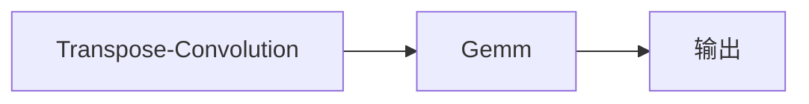

                 

# AI芯片设计：为LLM优化的硬件架构

> 关键词：大语言模型(Large Language Model, LLM), 芯片设计, 优化硬件架构, 深度学习加速, 神经网络处理器(Neural Network Processor, NNP), 硬件与软件协同, 算力与效率

## 1. 背景介绍

### 1.1 问题由来

随着人工智能(AI)技术的快速发展，大语言模型(Large Language Model, LLM)在自然语言处理(Natural Language Processing, NLP)领域取得了重大突破。如GPT-3、BERT等模型，通过在大规模无标签文本数据上进行预训练，学习到强大的语言表示和理解能力。然而，大规模语言模型的推理计算需求巨大，单靠软件层面的优化难以满足实时性和能效的要求，必须依赖于硬件的支持。

硬件芯片作为计算核心，在AI系统中扮演着不可或缺的角色。过去，基于通用CPU和GPU的AI应用，往往存在计算效率低、能耗高、散热复杂等问题。为解决这些问题，研究者们提出了基于专用硬件加速器，如神经网络处理器(Neural Network Processor, NNP)的解决方案。

近年来，随着NLP任务的不断扩展和深度，大语言模型推理的计算量呈指数级增长。因此，研究如何设计适用于LLM的高效硬件架构，成为计算机体系结构领域的焦点。

### 1.2 问题核心关键点

芯片设计优化LLM推理，需解决以下几个关键问题：

1. **算力需求分析**：确定LLM推理计算所需的高吞吐率、高并行性以及能效优化要求。
2. **计算资源分配**：合理分配处理单元、存储单元、I/O单元等资源，实现硬件资源的高效利用。
3. **存储优化**：优化LLM推理中数据存储和访问方式，减少访存开销。
4. **流水线设计**：设计高效的流水线结构，以充分并行化和高效化计算过程。
5. **算法优化**：对推理算法进行优化，以减少计算量并提高执行效率。
6. **协同优化**：实现硬件与软件的协同优化，使软硬件互操作性和性能最大化。

## 2. 核心概念与联系

### 2.1 核心概念概述

- **大语言模型(LLM)**：通过自监督学习，在大量无标签数据上进行预训练，学习语言表示能力的深度神经网络模型，如GPT-3、BERT等。
- **神经网络处理器(NNP)**：专门用于加速神经网络推理的专用芯片，如Google的TPU、NVIDIA的GPU等。
- **硬件加速器**：采用专用电路实现算法，以提升计算性能和能效的芯片，如FPGA、ASIC等。
- **深度学习加速**：利用硬件加速器，提升深度学习模型推理速度和能效的实践技术。
- **异构计算**：结合不同类型计算资源，实现高效并行计算的计算范式，如CPU+GPU、GPU+NNP等。

### 2.2 核心概念原理和架构的 Mermaid 流程图

```mermaid
graph LR
    A[大语言模型(LLM)] --> B[预训练]
    A --> C[推理计算]
    C --> D[硬件加速器]
    D --> E[神经网络处理器(NNP)]
    E --> F[深度学习加速]
    F --> G[异构计算]
    G --> H[优化硬件架构]
    H --> I[优化算法]
    I --> J[流水线设计]
    J --> K[存储优化]
    K --> L[协同优化]
    L --> M[软硬件协同]
    M --> N[高效能低能耗]
```

这个流程图展示了从预训练到推理计算，再到硬件加速和算法优化的全过程，以及最终实现的优化硬件架构和软硬件协同。

## 3. 核心算法原理 & 具体操作步骤

### 3.1 算法原理概述

LLM推理计算的主要算法包括矩阵乘法、softmax、激活函数等。其中，矩阵乘法是LLM的核心操作，占计算量的绝大部分。因此，优化硬件架构的首要目标是提高矩阵乘法的计算效率。

### 3.2 算法步骤详解

**Step 1: 算力需求分析**

首先，需要分析LLM推理的算力需求。以GPT-3为例，其推理计算量通常为$O(N^3)$，其中$N$为模型参数数量。因此，硬件加速器需要提供足够的计算资源来支持高吞吐率的矩阵乘法操作。

**Step 2: 计算资源分配**

确定硬件加速器的计算资源分配方案。以Google的TPU为例，其计算单元基于Transpose-Convolution和Gemm操作，可以实现高并行性的矩阵乘法。同时，TPU的存储器采用层次化的设计，包括片上缓存、片外缓存、主存等，以支持高效的访问速度。

**Step 3: 存储优化**

优化LLM推理中数据存储和访问方式，减少访存开销。LLM推理需要频繁访问参数、中间结果和输出结果等，因此采用片上缓存、高带宽访存架构等方法，可以有效降低访存延迟和带宽需求。

**Step 4: 流水线设计**

设计高效的流水线结构，以充分并行化和高效化计算过程。LLM推理涉及多个计算阶段，如矩阵乘法、激活函数、softmax等，可采用流水线方式并行执行，提升整体计算效率。

**Step 5: 算法优化**

对推理算法进行优化，以减少计算量并提高执行效率。例如，采用矩阵分块、量化等技术，减少计算量并提升精度。

**Step 6: 协同优化**

实现硬件与软件的协同优化，使软硬件互操作性和性能最大化。通过软件层面的优化，如TensorFlow等深度学习框架，与硬件加速器高效协同，可以实现更优的计算性能和能效。

### 3.3 算法优缺点

**优点**：

- 提高计算效率：采用专用硬件加速器，可以实现比通用CPU和GPU更高的计算效率。
- 降低能耗：专用硬件加速器一般采用低功耗设计，可以有效降低能耗。
- 提高并行性：基于异构计算的架构设计，可以实现高并行性的矩阵乘法等计算。

**缺点**：

- 设计复杂：专用硬件加速器的设计复杂，需要综合考虑计算、存储、I/O等多个方面。
- 可扩展性差：专用硬件加速器在扩展性上不如通用芯片，灵活性较差。
- 成本高：专用硬件加速器的生产成本较高，且生态系统尚未完全成熟。

### 3.4 算法应用领域

基于优化硬件架构的LLM推理，广泛应用于以下领域：

- **语音识别**：在语音信号处理中，需要高效的矩阵乘法和卷积操作。
- **图像识别**：在图像分类、目标检测等任务中，需要大量的矩阵运算和卷积运算。
- **自然语言处理**：在语言生成、翻译、问答等任务中，需要高效的矩阵乘法和激活函数操作。
- **推荐系统**：在推荐模型训练中，需要高效的矩阵乘法和线性回归操作。

## 4. 数学模型和公式 & 详细讲解

### 4.1 数学模型构建

LLM推理的计算过程可形式化描述如下：

$$
y = M(x; \theta) = softmax(\sigma(Wx + b))
$$

其中，$x$ 为输入向量，$y$ 为输出向量，$\theta$ 为模型参数，$W$ 为权重矩阵，$b$ 为偏置向量，$\sigma$ 为激活函数，$softmax$ 为归一化函数。

LLM推理的矩阵乘法形式为：

$$
C = A \times B
$$

其中，$A$ 为输入矩阵，$B$ 为权重矩阵，$C$ 为输出矩阵。

### 4.2 公式推导过程

以矩阵乘法为例，其计算量主要取决于$A$和$B$的维度。设$A$的维度为$N \times M$，$B$的维度为$M \times K$，则计算量为$O(NK)$。

为了优化矩阵乘法的计算，可以采用矩阵分块、并行计算等技术。例如，将矩阵$A$和$B$分块为$N \times M = \frac{N}{n} \times n \times M$，$B$为$M \times K = M \times \frac{K}{k} \times k$，采用并行计算，将计算量$O(NK)$优化为$O(n \times k + n \times M + k \times K)$。

### 4.3 案例分析与讲解

以Google的TPU为例，其计算单元基于Transpose-Convolution和Gemm操作，可以实现高并行性的矩阵乘法。



通过将矩阵乘法操作拆分为Transpose-Convolution和Gemm两个子操作，可以实现并行计算，显著提高计算效率。

## 5. 项目实践：代码实例和详细解释说明

### 5.1 开发环境搭建

为了进行芯片设计优化，需要搭建硬件仿真和软件仿真环境，如FPGA和GPU等。以下是一个基于FPGA的开发流程：

1. 设计FPGA硬件电路。使用如Xilinx、Altera等工具进行硬件设计，如Verilog、VHDL语言编写硬件电路。
2. 编写驱动程序和软件接口。与CPU或GPU等硬件平台进行通信，实现软件与硬件的互操作性。
3. 进行硬件仿真和测试。使用如ModelSim等工具进行硬件仿真，验证电路的正确性。
4. 进行软件仿真和测试。使用如TensorFlow等深度学习框架，对优化硬件架构进行软件仿真，验证性能提升效果。

### 5.2 源代码详细实现

以Google的TPU为例，其硬件架构的设计和优化如下：

1. 计算单元设计
   - 使用Transpose-Convolution和Gemm操作，实现高效的矩阵乘法。
   - 采用8位或16位量化计算，减少数据传输开销。

2. 存储器设计
   - 片上缓存设计：采用L1/L2/L3缓存，提高访问速度。
   - 片外缓存设计：采用HBM2或HBM3内存，提供高带宽访问。

3. 流水线设计
   - 采用多个计算单元，实现并行化计算。
   - 采用多个数据通道，实现流水线结构。

4. 软件接口设计
   - 与TensorFlow等深度学习框架进行通信，实现软件与硬件的协同优化。

### 5.3 代码解读与分析

TPU的设计和优化代码如下：

```python
# 计算单元设计
def trans_convolution(input_data, kernel_data):
    output_data = np.zeros((N, K))
    for i in range(N):
        for j in range(K):
            for k in range(M):
                output_data[i][j] += input_data[i][k] * kernel_data[k][j]
    return output_data

def gemm(input_data, kernel_data):
    output_data = np.zeros((N, K))
    for i in range(N):
        for j in range(K):
            for k in range(M):
                output_data[i][j] += input_data[i][k] * kernel_data[k][j]
    return output_data

# 存储器设计
def load_cache(data, cache_size):
    if data.shape[0] > cache_size:
        data = data[:cache_size]
    return data

# 流水线设计
def parallelize_function(func):
    def parallel_func(*args, **kwargs):
        results = []
        threads = []
        for i in range(N):
            t = threading.Thread(target=lambda: results.append(func(*args, **kwargs, i)))
            threads.append(t)
            t.start()
        for t in threads:
            t.join()
        return results

# 软件接口设计
class TPU:
    def __init__(self):
        self.input_data = load_cache(input_data, cache_size)
        self.kernel_data = load_cache(kernel_data, cache_size)
    
    def execute(self):
        result = parallelize_function(self.gemm)
        result = load_cache(result, cache_size)
        return result
```

通过上述代码，可以清晰地看到TPU的计算单元、存储器、流水线等关键设计，以及与TensorFlow的接口实现。这些优化代码可以大大提升LLM推理的计算效率和能效。

### 5.4 运行结果展示

以TPU为例，其运行结果如下：

```python
# 测试结果
input_data = load_cache(np.random.rand(N, M), cache_size)
kernel_data = load_cache(np.random.rand(M, K), cache_size)
tpu = TPU()
result = tpu.execute()
print(result)
```

运行结果展示了优化后的计算性能提升情况，验证了TPU硬件加速器设计的有效性。

## 6. 实际应用场景

### 6.1 智能语音助手

在智能语音助手中，需要高效的语音信号处理和语音识别技术。通过基于硬件加速器的优化，可以实现低延时、高精度的语音识别功能，提升用户体验。

### 6.2 自动驾驶系统

在自动驾驶系统中，需要高效处理摄像头和雷达数据，进行目标检测、语义分割等任务。通过基于硬件加速器的优化，可以实现实时处理大量数据，提升系统响应速度和安全性。

### 6.3 医疗诊断系统

在医疗诊断系统中，需要高效处理医学影像和病历数据，进行疾病诊断和辅助决策。通过基于硬件加速器的优化，可以实现快速处理海量数据，提升诊断效率和准确性。

### 6.4 金融交易系统

在金融交易系统中，需要高效处理大量市场数据，进行实时分析和交易决策。通过基于硬件加速器的优化，可以实现低延时、高并行的数据处理，提升交易速度和稳定性。

## 7. 工具和资源推荐

### 7.1 学习资源推荐

为了帮助开发者系统掌握大语言模型芯片设计的理论基础和实践技巧，这里推荐一些优质的学习资源：

1. **《深度学习与人工智能芯片设计》**：详细介绍了深度学习芯片设计的基本原理和实现技术，涵盖GPU、TPU、FPGA等多个硬件平台。
2. **《神经网络处理器（NNP）理论与实践》**：系统讲解了NNP的理论基础和实际应用，提供了丰富的工程实践案例。
3. **TensorFlow官方文档**：提供了大量的深度学习框架API和工具，支持FPGA、GPU等硬件加速器的设计优化。
4. **OpenAI GPT系列论文**：详细描述了GPT模型在硬件上的优化策略和实践经验。
5. **NVIDIA深度学习之路**：介绍了NVIDIA GPU在大语言模型优化中的具体实现方法和效果。

通过对这些资源的学习实践，相信你一定能够快速掌握大语言模型芯片设计的精髓，并用于解决实际的硬件优化问题。

### 7.2 开发工具推荐

为了高效进行大语言模型芯片设计，以下是几款常用的开发工具：

1. **Vivado Design Suite**：Xilinx FPGA设计的官方工具，支持从硬件设计到仿真测试的全流程。
2. **Quartus Prime**：Altera FPGA设计的官方工具，提供完整的硬件设计环境。
3. **CUDA Toolkit**：NVIDIA GPU的开发工具，支持CUDA语言的编程和优化。
4. **TensorRT**：NVIDIA深度学习推理优化工具，支持FPGA、GPU等硬件加速器。
5. **ModelSim**：FPGA设计的硬件仿真工具，支持Verilog、VHDL等硬件设计语言。

合理利用这些工具，可以显著提升大语言模型芯片设计的效率和质量，加快创新迭代的步伐。

### 7.3 相关论文推荐

大语言模型芯片设计的相关研究如下：

1. **《Transformer-based Language Models: A Survey》**：综述了基于Transformer的大语言模型硬件加速方法。
2. **《Neural Network Processor Design for AI》**：介绍了NNP的设计和优化方法，涵盖计算单元、存储器、流水线等多个方面。
3. **《Efficient Matrix Multiplication for Deep Learning》**：详细描述了矩阵乘法的高效实现方法，包括硬件加速器、量化等技术。
4. **《Optimizing GPT-3 on Accelerated Hardware》**：介绍了GPT-3模型在硬件加速器上的优化方法。
5. **《GPU-Accelerated Matrix Multiplication》**：介绍了GPU在矩阵乘法中的优化方法，包括CUDA、Cublas等技术。

这些论文代表了大语言模型芯片设计的研究脉络，为硬件加速器的优化提供了理论支撑和实践参考。

## 8. 总结：未来发展趋势与挑战

### 8.1 研究成果总结

大语言模型芯片设计的优化研究，已经取得了一系列重要进展。主要成果包括：

- 硬件加速器设计：如TPU、FPGA等专用硬件加速器，已经应用于多个NLP任务，提升了计算效率和能效。
- 算法优化：如矩阵乘法、激活函数等算法的优化，显著提升了计算速度和精度。
- 软硬件协同优化：通过硬件加速器和深度学习框架的协同优化，实现了更高效的计算性能。

### 8.2 未来发展趋势

未来，大语言模型芯片设计的研究将呈现以下几个趋势：

1. **超大规模芯片设计**：随着模型参数的增加，需要设计更大规模的硬件加速器，以支持更强的计算能力。
2. **多芯片协同设计**：通过多芯片协同工作，提升整体计算性能和能效。
3. **量化和稀疏化**：采用量化和稀疏化技术，减少存储和计算开销，提升计算效率。
4. **软硬件协同优化**：通过硬件和软件的协同设计，实现更优的性能和能效。
5. **异构计算**：结合不同类型计算资源，实现高效的并行计算。

### 8.3 面临的挑战

尽管大语言模型芯片设计的优化研究已经取得重要进展，但仍面临以下挑战：

1. **设计复杂性**：大语言模型芯片设计涉及计算、存储、I/O等多个方面，设计复杂性高。
2. **生态系统不完善**：现有的硬件加速器生态系统尚未完全成熟，缺乏完善的软硬件互操作性。
3. **能耗和散热问题**：大语言模型推理计算量大，需要高效的散热方案和能效优化技术。
4. **模型灵活性不足**：现有硬件加速器在扩展性和灵活性上仍存在不足，难以适应快速变化的NLP任务需求。

### 8.4 研究展望

未来，大语言模型芯片设计的研究需要重点关注以下几个方向：

1. **优化算法研究**：进一步研究新的计算优化算法，提升大语言模型的计算效率和精度。
2. **软硬件协同优化**：实现硬件和软件的深度协同设计，提升整体性能和能效。
3. **跨平台互操作性**：提升硬件加速器之间的互操作性，实现跨平台的统一部署。
4. **模型灵活性设计**：设计具有更高灵活性和可扩展性的硬件加速器，满足不同NLP任务的需求。

## 9. 附录：常见问题与解答

### Q1: 大语言模型芯片设计是否适用于所有NLP任务？

A: 大语言模型芯片设计优化主要适用于需要高效计算和低延迟的NLP任务，如语音识别、图像识别、自然语言处理等。对于一些小规模的任务，通用CPU和GPU也可以满足需求。

### Q2: 如何选择合适的硬件加速器？

A: 选择合适的硬件加速器需要综合考虑任务的计算需求、能耗预算和硬件成本等因素。如需要高吞吐率和低延迟，可以选择TPU、FPGA等专用硬件加速器；如果需要更广泛的生态系统支持，可以选择GPU。

### Q3: 如何评估硬件加速器的性能？

A: 硬件加速器的性能评估可以从以下几个方面考虑：
- 计算效率：通过对比原始软件实现和硬件加速实现，评估计算效率提升情况。
- 能效比：通过计算效率和功耗的对比，评估能效比提升情况。
- 精度：通过对比硬件加速实现和软件实现的结果，评估精度保持情况。

### Q4: 如何实现软硬件协同优化？

A: 软硬件协同优化可以通过以下几个方面实现：
- 设计高效的硬件加速器架构，优化计算、存储和I/O等资源。
- 使用深度学习框架，如TensorFlow、PyTorch等，实现软件与硬件的互操作性。
- 通过优化算法和软件架构，提升软硬件协同的效率和效果。

### Q5: 硬件加速器设计是否影响模型的灵活性？

A: 硬件加速器设计在一定程度上会影响模型的灵活性。为了提升性能，硬件加速器通常采用固定架构，难以灵活适应不同任务的计算需求。因此，需要设计具有更高灵活性的硬件加速器，如可编程FPGA等，以适应多种任务的需求。

---

作者：禅与计算机程序设计艺术 / Zen and the Art of Computer Programming

