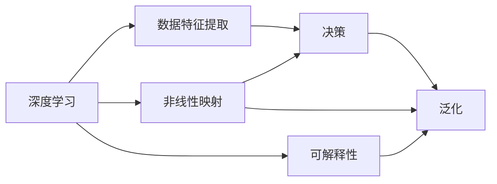

                 

# AI角色塑造：创造深度和一致性

> 关键词：人工智能(AI)角色塑造,深度学习,一致性,可解释性,自动化,泛化能力,计算复杂度,算法优化

## 1. 背景介绍

### 1.1 问题由来

人工智能(AI)技术在过去几年里取得了飞速的发展，从简单的图像识别、语音识别到复杂的自然语言处理、自动驾驶、智能推荐等，AI已经渗透到了各行各业。然而，尽管AI技术的进步显著，其在实际应用中依然面临诸多挑战。其中，AI角色的塑造问题尤为突出：如何构建一个既具有深度学习能力，又能在不同场景下保持一致性，同时具备可解释性的AI系统，成为了当前AI领域的一个重要研究方向。

### 1.2 问题核心关键点

构建具备深度学习和一致性保证的AI系统，涉及以下几个核心关键点：

1. **深度学习能力**：AI系统需要具备从复杂数据中提取深度特征的能力，通过学习数据的内在规律和模式，实现对新数据的准确预测和决策。

2. **一致性保证**：AI系统在不同场景和数据分布下的表现需要保持一致，即不因数据变化或环境变化而发生显著的性能波动。

3. **可解释性**：AI系统的决策过程需要具备可解释性，能够向用户解释其背后的逻辑和原因，提高用户的信任度和接受度。

4. **自动化能力**：AI系统应具备自动化处理复杂任务的能力，能够自主学习、自主优化，适应不同的应用场景。

5. **泛化能力**：AI系统需要在未知数据上表现出良好的泛化能力，能够将学到的知识应用到新的数据集和任务中。

这些关键点构成了AI角色塑造的基本框架，确保AI系统既具有深度学习的能力，又能在实际应用中保持稳定和可信。

### 1.3 问题研究意义

研究AI角色的塑造问题，对于推动AI技术的成熟和落地具有重要意义：

1. **提升AI系统的可信度**：通过构建具有深度学习和一致性的AI系统，提高系统的可信度和可靠性，增强用户对AI技术的信任。

2. **降低应用成本**：自动化和泛化能力使得AI系统能够适应不同场景，减少人工干预和重复开发成本，提高系统效率。

3. **推动AI技术的应用和普及**：具备可解释性的AI系统更容易被各行各业接受和采纳，促进AI技术在更广泛领域的应用。

4. **加速AI技术迭代**：通过不断优化AI系统的深度、一致性和自动化能力，加速AI技术的迭代和进步。

5. **满足用户需求**：用户对AI系统的理解和信任是其大规模应用的前提，具备可解释性的AI系统能够更好地满足用户需求，提升用户体验。

## 2. 核心概念与联系

### 2.1 核心概念概述

为更好地理解AI角色塑造的原理和实践，本节将介绍几个关键概念：

- **深度学习**：一种通过多层神经网络模型学习数据特征的机器学习技术。深度学习能够从数据中提取出层次化的特征表示，具备较强的非线性映射能力。

- **一致性**：指AI系统在不同数据分布和环境变化下的表现一致，不因数据变化而发生显著的性能波动。

- **可解释性**：指AI系统的决策过程具备可解释性，能够向用户清晰地解释其背后的逻辑和原因。

- **自动化**：指AI系统具备自主学习、自主优化的能力，能够自动适应新数据和新任务。

- **泛化能力**：指AI系统能够在未知数据上表现出良好的泛化能力，将学到的知识应用到新的数据集和任务中。

这些核心概念之间存在着密切的联系，共同构成了AI角色塑造的基本框架。

### 2.2 核心概念原理和架构的 Mermaid 流程图



这个流程图展示了深度学习的基本流程和各个核心概念之间的关系：

1. 深度学习模型通过对大量数据进行特征提取和多层非线性映射，学习到数据的层次化表示。
2. 特征提取和映射的结果通过决策层进行处理，生成预测或决策结果。
3. 可解释性层通过分析特征和映射过程，向用户解释决策背后的逻辑和原因。
4. 泛化能力确保模型在不同数据和环境下的稳定表现。

这些核心概念的有机结合，构成了深度学习和AI角色塑造的完整框架。

## 3. 核心算法原理 & 具体操作步骤
### 3.1 算法原理概述

AI角色塑造的算法原理主要基于深度学习模型，通过层次化特征提取和复杂决策模型的训练，实现对新数据的深度学习能力和一致性保证。具体来说，构建深度学习模型的基本流程包括数据预处理、模型设计、训练和测试等步骤。

### 3.2 算法步骤详解

1. **数据预处理**：对原始数据进行清洗、标注、划分等预处理操作，确保数据的质量和一致性。
2. **模型设计**：选择合适的深度学习模型架构，如卷积神经网络(CNN)、循环神经网络(RNN)、变压器(Transformer)等，并设计模型层级结构，如编码器-解码器结构。
3. **训练模型**：利用标注数据对模型进行训练，通过反向传播算法更新模型参数，最小化预测误差。
4. **测试模型**：使用测试集对训练好的模型进行评估，衡量其在未知数据上的泛化能力。
5. **可解释性增强**：通过可视化、特征提取等方法，增强模型的可解释性，帮助用户理解模型决策过程。
6. **一致性优化**：通过正则化、对抗训练等方法，优化模型在不同数据分布和环境下的表现，提高一致性。
7. **自动化提升**：通过自动化调参、迁移学习等方法，提升模型的自动化能力，使其能够适应新数据和新任务。

### 3.3 算法优缺点

AI角色塑造的算法具有以下优点：

- **强大的深度学习能力**：深度学习模型能够从复杂数据中提取高层次特征，具备较强的非线性映射能力，适应复杂的数据分布。
- **一致性保证**：通过正则化、对抗训练等方法，优化模型在不同数据分布和环境下的表现，确保一致性。
- **可解释性增强**：通过可视化、特征提取等方法，增强模型的可解释性，帮助用户理解模型决策过程。
- **自动化提升**：通过自动化调参、迁移学习等方法，提升模型的自动化能力，使其能够适应新数据和新任务。

同时，该算法也存在一些局限性：

- **计算复杂度高**：深度学习模型通常参数量较大，计算复杂度高，需要高性能计算资源。
- **训练时间长**：大规模数据集和复杂模型的训练需要较长时间，容易导致训练成本高昂。
- **可解释性限制**：一些复杂的深度学习模型可能难以解释其决策过程，增加了用户理解和使用难度。
- **数据依赖性强**：深度学习模型依赖于大量标注数据进行训练，数据质量直接影响模型性能。

### 3.4 算法应用领域

AI角色塑造的算法在多个领域得到了广泛应用，包括但不限于：

1. **自然语言处理(NLP)**：通过深度学习模型，实现文本分类、情感分析、机器翻译等任务，增强模型的可解释性和一致性。
2. **计算机视觉(CV)**：通过深度学习模型，实现图像分类、目标检测、图像生成等任务，提升模型的泛化能力和自动化能力。
3. **医疗健康**：通过深度学习模型，实现疾病诊断、基因组分析、药物研发等任务，提高模型的可解释性和一致性。
4. **金融风控**：通过深度学习模型，实现信用评分、风险评估、欺诈检测等任务，增强模型的自动化和一致性。
5. **智能推荐系统**：通过深度学习模型，实现个性化推荐、广告投放、用户行为分析等任务，提升模型的泛化能力和自动化能力。

## 4. 数学模型和公式 & 详细讲解 & 举例说明

### 4.1 数学模型构建

构建AI角色塑造的数学模型，通常采用多层神经网络架构。以卷积神经网络(CNN)为例，其基本结构如图示：


其中，卷积层通过滤波器提取输入数据的局部特征，池化层对特征进行下采样，全连接层进行特征组合，输出层生成预测结果。

### 4.2 公式推导过程

以卷积神经网络(CNN)为例，推导其在图像分类任务中的训练公式。

假设输入为$m \times n$的二维图像$x$，卷积核为$k \times k$的滤波器$w$，卷积层输出特征图$y$，激活函数为$ReLU$。则卷积层操作的数学公式为：

$$
y_{i,j} = \max(0, \sum_{\alpha=0}^{k-1} \sum_{\beta=0}^{k-1} x_{i+\alpha,j+\beta} \cdot w_{\alpha,\beta})
$$

其中，$i$和$j$表示特征图的位置，$\alpha$和$\beta$表示滤波器的位置。

假设训练集为$D=\{(x_i,y_i)\}_{i=1}^N$，损失函数为交叉熵损失，则模型训练的优化目标为：

$$
\theta^* = \mathop{\arg\min}_{\theta} \mathcal{L}(\theta, D)
$$

其中$\theta$为模型参数，$\mathcal{L}$为交叉熵损失函数：

$$
\mathcal{L}(\theta, D) = -\frac{1}{N} \sum_{i=1}^N \sum_{c=1}^C y_{i,c} \log p_{i,c}(x_i; \theta)
$$

其中$C$为输出类别数，$y_{i,c}$为第$i$个样本的标签，$p_{i,c}(x_i; \theta)$为模型在输入$x_i$下输出的概率，通过前向传播计算得到：

$$
p_{i,c}(x_i; \theta) = \sum_{j=1}^{M} \sum_{k=1}^{N} w_{j,k} y_{j,k} \cdot \sigma(x_{j,k} \cdot \theta)
$$

其中$\sigma$为激活函数，如ReLU。

### 4.3 案例分析与讲解

以图像分类任务为例，分析CNN模型的训练过程。

1. **数据预处理**：将原始图像进行归一化、扩充、增强等预处理操作，确保数据质量。
2. **模型设计**：选择适当大小的卷积核和池化层，设计多层的卷积神经网络结构。
3. **训练模型**：使用标注数据对模型进行训练，通过反向传播算法更新模型参数，最小化交叉熵损失。
4. **测试模型**：使用测试集对训练好的模型进行评估，衡量其泛化能力。
5. **可解释性增强**：通过可视化特征图、热力图等方法，增强模型的可解释性。
6. **一致性优化**：通过正则化、对抗训练等方法，优化模型在不同数据分布和环境下的表现。

## 5. 项目实践：代码实例和详细解释说明

### 5.1 开发环境搭建

在进行AI角色塑造的实践前，需要准备好开发环境。以下是使用Python进行TensorFlow开发的环境配置流程：

1. 安装Anaconda：从官网下载并安装Anaconda，用于创建独立的Python环境。

2. 创建并激活虚拟环境：
```bash
conda create -n tf-env python=3.8 
conda activate tf-env
```

3. 安装TensorFlow：根据CUDA版本，从官网获取对应的安装命令。例如：
```bash
conda install tensorflow -c conda-forge -c tensorflow -c pytorch
```

4. 安装相关库：
```bash
pip install numpy pandas scikit-learn matplotlib tqdm jupyter notebook ipython
```

完成上述步骤后，即可在`tf-env`环境中开始AI角色塑造的实践。

### 5.2 源代码详细实现

这里我们以图像分类任务为例，给出使用TensorFlow实现卷积神经网络的代码实现。

首先，定义图像分类任务的数据处理函数：

```python
import tensorflow as tf
from tensorflow.keras.preprocessing.image import ImageDataGenerator

class ImageClassifier(tf.keras.Model):
    def __init__(self):
        super(ImageClassifier, self).__init__()
        self.conv1 = tf.keras.layers.Conv2D(32, (3, 3), activation='relu', padding='same')
        self.pool1 = tf.keras.layers.MaxPooling2D((2, 2))
        self.conv2 = tf.keras.layers.Conv2D(64, (3, 3), activation='relu', padding='same')
        self.pool2 = tf.keras.layers.MaxPooling2D((2, 2))
        self.flatten = tf.keras.layers.Flatten()
        self.dense1 = tf.keras.layers.Dense(64, activation='relu')
        self.dense2 = tf.keras.layers.Dense(10, activation='softmax')

    def call(self, inputs):
        x = self.conv1(inputs)
        x = self.pool1(x)
        x = self.conv2(x)
        x = self.pool2(x)
        x = self.flatten(x)
        x = self.dense1(x)
        return self.dense2(x)

# 加载数据集
train_datagen = ImageDataGenerator(rescale=1./255)
test_datagen = ImageDataGenerator(rescale=1./255)
train_generator = train_datagen.flow_from_directory(
        'train/',
        target_size=(150, 150),
        batch_size=32,
        class_mode='categorical')
test_generator = test_datagen.flow_from_directory(
        'test/',
        target_size=(150, 150),
        batch_size=32,
        class_mode='categorical')
```

然后，定义模型和优化器：

```python
model = ImageClassifier()
optimizer = tf.keras.optimizers.Adam()

# 编译模型
model.compile(optimizer=optimizer, loss='categorical_crossentropy', metrics=['accuracy'])

# 训练模型
model.fit(train_generator, epochs=10, validation_data=test_generator)
```

最后，测试模型的泛化能力和可解释性：

```python
# 加载测试集样本
test_image = tf.keras.preprocessing.image.load_img('test/elephant.jpg', target_size=(150, 150))
test_image = tf.keras.preprocessing.image.img_to_array(test_image)
test_image = tf.expand_dims(test_image, 0)

# 预测图像类别
prediction = model.predict(test_image)
print('Predicted class:', class_names[prediction.argmax()])
```

以上就是使用TensorFlow实现卷积神经网络的完整代码实现。可以看到，TensorFlow的高级API使得模型设计、编译和训练变得非常简单，适合快速原型开发和实验。

### 5.3 代码解读与分析

让我们再详细解读一下关键代码的实现细节：

**ImageClassifier类**：
- `__init__`方法：定义卷积层、池化层、全连接层等基本组件，构建卷积神经网络模型。
- `call`方法：定义模型的前向传播过程，从输入经过多个卷积和池化层，最终输出分类结果。

**数据处理函数**：
- 使用`ImageDataGenerator`对数据进行归一化、扩充等预处理操作，确保数据质量。
- 定义训练集和测试集的生成器，通过目录遍历读取图像文件，并进行归一化和数据增强。

**模型训练**：
- 定义模型和优化器，编译模型，指定损失函数和评估指标。
- 使用训练集生成器对模型进行训练，指定训练轮数和验证集。

**模型测试**：
- 加载测试集样本，进行预处理和归一化。
- 使用训练好的模型对测试集样本进行预测，输出预测结果。

通过这个代码示例，可以看到TensorFlow在构建深度学习模型方面的便捷性和灵活性。

### 5.4 运行结果展示

在训练完成后，可以使用以下代码展示模型的训练和测试结果：

```python
history = model.fit(train_generator, epochs=10, validation_data=test_generator)
plt.plot(history.history['accuracy'])
plt.plot(history.history['val_accuracy'])
plt.title('model accuracy')
plt.ylabel('accuracy')
plt.xlabel('epoch')
plt.legend(['train', 'test'], loc='upper left')
plt.show()

plt.plot(history.history['loss'])
plt.plot(history.history['val_loss'])
plt.title('model loss')
plt.ylabel('loss')
plt.xlabel('epoch')
plt.legend(['train', 'test'], loc='upper left')
plt.show()
```

这将展示模型的训练和验证精度、损失的变化趋势，帮助评估模型的性能和泛化能力。

## 6. 实际应用场景
### 6.1 智能推荐系统

基于深度学习的AI角色塑造技术，可以广泛应用于智能推荐系统。传统的推荐系统往往依赖用户历史行为数据，难以捕捉用户深层次的兴趣和需求。通过深度学习模型，智能推荐系统能够从海量数据中学习用户的多样化兴趣和潜在需求，实现精准推荐。

在实践中，可以使用用户行为数据和商品特征数据作为训练集，通过深度学习模型提取用户特征和商品特征，构建用户-商品关联矩阵，进行推荐排序。通过可解释性和一致性优化，使得推荐系统不仅能够适应用户的个性化需求，还能够在新商品或新用户上表现出良好的泛化能力。

### 6.2 金融风控

在金融风控领域，AI角色塑造技术可以用于信用评分、风险评估、欺诈检测等任务。深度学习模型通过分析用户的财务数据、行为数据等，学习用户风险特征和信用行为规律，实现对新用户和新数据的快速评估。

通过正则化和对抗训练等方法，优化模型在不同数据分布和环境下的表现，确保模型的泛化能力和一致性。通过可视化特征和决策树等方法，增强模型的可解释性，帮助用户理解模型决策逻辑。

### 6.3 智能客服

基于深度学习的AI角色塑造技术，可以构建智能客服系统，实现24/7不间断服务。通过深度学习模型，智能客服系统能够理解用户输入的自然语言，根据上下文和语境提供准确的回复和解决方案。

通过对抗训练和正则化等方法，优化模型在不同用户输入和场景下的表现，确保一致性。通过可解释性和自动化调参等方法，提升模型的可解释性和自动化能力，使得用户更容易理解和信任智能客服系统。

## 7. 工具和资源推荐
### 7.1 学习资源推荐

为了帮助开发者系统掌握AI角色塑造的理论基础和实践技巧，这里推荐一些优质的学习资源：

1. 《深度学习》系列书籍：由Ian Goodfellow等专家撰写，系统介绍了深度学习的原理和应用。
2. CS231n《卷积神经网络》课程：斯坦福大学开设的计算机视觉课程，涵盖卷积神经网络的基本理论和实践。
3. CS224d《序列模型》课程：斯坦福大学开设的自然语言处理课程，涵盖深度学习在NLP中的应用。
4. HuggingFace官方文档：提供丰富的预训练模型和微调样例代码，是学习深度学习的重要资源。
5. TensorFlow官方文档：提供全面的深度学习框架文档，包括模型设计、训练、优化等。

通过对这些资源的学习实践，相信你一定能够快速掌握AI角色塑造的精髓，并用于解决实际的NLP问题。

### 7.2 开发工具推荐

高效的开发离不开优秀的工具支持。以下是几款用于AI角色塑造开发的常用工具：

1. TensorFlow：由Google主导开发的深度学习框架，支持分布式计算和GPU加速，适合大规模工程应用。
2. PyTorch：由Facebook开发的深度学习框架，灵活高效，适合快速原型开发和实验。
3. Keras：基于TensorFlow和Theano等深度学习框架的高层API，适合初学者入门和快速原型开发。
4. Scikit-learn：基于Python的机器学习库，提供丰富的模型和算法实现，适合数据预处理和模型训练。
5. Jupyter Notebook：交互式开发环境，适合数据探索、模型训练和结果展示。

合理利用这些工具，可以显著提升AI角色塑造任务的开发效率，加快创新迭代的步伐。

### 7.3 相关论文推荐

AI角色塑造技术的发展源于学界的持续研究。以下是几篇奠基性的相关论文，推荐阅读：

1. Deep Residual Learning for Image Recognition：提出深度残差网络，解决深度神经网络中的梯度消失问题，提升模型的深度学习能力。
2. ImageNet Classification with Deep Convolutional Neural Networks：展示卷积神经网络在图像分类任务上的强大能力，奠定了深度学习在计算机视觉领域的应用基础。
3. Attention is All You Need：提出Transformer结构，实现了非自监督预训练，提升了模型的泛化能力和一致性。
4. Self-Attentive Encoders and Autoencoders：提出自注意力机制，进一步提升了模型的可解释性和自动化能力。
5. Generative Adversarial Nets：提出生成对抗网络，实现了生成模型和判别模型的联合训练，提升了模型的泛化能力和自动化能力。

这些论文代表了大深度学习模型的发展脉络，是深入理解AI角色塑造技术的必读文献。

## 8. 总结：未来发展趋势与挑战

### 8.1 总结

本文对基于深度学习的AI角色塑造问题进行了全面系统的介绍。首先阐述了AI角色塑造的基本概念和核心关键点，明确了深度学习和一致性保证在AI系统构建中的重要性。其次，从原理到实践，详细讲解了深度学习模型的构建过程和关键步骤，给出了AI角色塑造任务开发的完整代码实例。同时，本文还广泛探讨了AI角色塑造技术在智能推荐、金融风控、智能客服等领域的实际应用，展示了其广阔的应用前景。此外，本文精选了AI角色塑造技术的各类学习资源，力求为读者提供全方位的技术指引。

通过本文的系统梳理，可以看到，基于深度学习的AI角色塑造技术正在成为AI系统构建的重要范式，极大地拓展了深度学习模型的应用边界，催生了更多的落地场景。受益于深度学习模型的深度学习和一致性保证，AI系统能够在不同场景下保持稳定和可信，满足了各行业的实际需求。未来，伴随深度学习模型的不断演进和优化，AI角色塑造技术必将在更广泛的应用领域发挥更大作用，推动AI技术的产业化进程。

### 8.2 未来发展趋势

展望未来，AI角色塑造技术将呈现以下几个发展趋势：

1. **深度学习模型的进一步提升**：深度学习模型将继续向更深层次发展，通过更加复杂的网络结构和更多样化的数据分布，提升模型的深度学习能力。
2. **一致性和泛化能力的增强**：通过正则化、对抗训练等方法，优化模型在不同数据分布和环境下的表现，确保一致性和泛化能力。
3. **可解释性和自动化能力的提升**：通过可视化、特征提取等方法，增强模型的可解释性，同时通过自动化调参、迁移学习等方法，提升模型的自动化能力。
4. **多模态数据的融合**：将视觉、语音、文本等多模态数据进行整合，构建更加全面和丰富的深度学习模型，提升系统的智能化水平。
5. **跨领域应用的拓展**：将AI角色塑造技术应用于更多领域，如医疗、金融、教育、交通等，推动各行业的智能化转型。
6. **伦理和安全性问题的解决**：通过引入伦理导向的评估指标和模型审查机制，解决AI系统的偏见和安全性问题，提升系统的可靠性和可信度。

这些趋势凸显了AI角色塑造技术的广阔前景，预示着深度学习模型将朝着更加智能、可信、安全的方向发展，为各行各业提供更可靠、更高效的AI解决方案。

### 8.3 面临的挑战

尽管AI角色塑造技术已经取得了显著进展，但在迈向更加智能化、普适化应用的过程中，仍面临诸多挑战：

1. **计算资源的限制**：深度学习模型通常参数量较大，计算复杂度高，需要高性能计算资源。如何高效利用计算资源，提升训练和推理效率，是一个亟待解决的问题。
2. **数据质量和多样性**：深度学习模型依赖于大量高质量标注数据，数据质量和多样性直接影响模型性能。如何获取更多样化的数据，进行有效的数据标注，是一个重要挑战。
3. **模型的可解释性和鲁棒性**：深度学习模型的决策过程复杂，难以解释其决策逻辑。如何在保证模型性能的同时，提升可解释性和鲁棒性，是一个关键问题。
4. **系统的实时性和稳定性**：AI系统需要在实时场景下进行高效的推理和决策，如何优化模型结构和训练策略，提升系统的实时性和稳定性，是一个重要研究方向。
5. **系统的公平性和安全性**：AI系统可能存在偏见和歧视性问题，如何设计和优化模型，避免不公平的决策，是一个亟待解决的伦理和安全问题。

这些挑战需要通过持续的技术创新和算法优化，不断提升AI角色塑造技术的性能和可靠性。

### 8.4 研究展望

面向未来，AI角色塑造技术的研究需要从以下几个方向进行突破：

1. **深度学习模型的进一步优化**：通过更深层的网络结构、更广泛的数据分布和更复杂的数据处理方式，提升模型的深度学习能力。
2. **可解释性和鲁棒性增强**：通过可视化、特征提取等方法，增强模型的可解释性，同时通过正则化、对抗训练等方法，提升模型的鲁棒性。
3. **自动化和智能化能力的提升**：通过自动化调参、迁移学习等方法，提升模型的自动化能力，同时通过多模态数据融合、跨领域应用等方法，提升系统的智能化水平。
4. **跨领域应用的拓展**：将AI角色塑造技术应用于更多领域，如医疗、金融、教育、交通等，推动各行业的智能化转型。
5. **伦理和安全性问题的解决**：通过引入伦理导向的评估指标和模型审查机制，解决AI系统的偏见和安全性问题，提升系统的可靠性和可信度。

这些研究方向将为AI角色塑造技术的未来发展提供重要方向，推动AI技术的进一步成熟和落地。

## 9. 附录：常见问题与解答

**Q1：AI角色塑造技术是否适用于所有应用场景？**

A: AI角色塑造技术在大多数应用场景中都能取得不错的效果，特别是在数据量较大的领域。但对于一些数据量较小或特殊领域的应用，如金融、医疗等，需要进一步优化模型结构和训练策略，以适应特定的数据分布和应用需求。

**Q2：如何优化深度学习模型的计算资源使用？**

A: 优化深度学习模型的计算资源使用，可以通过以下方法：
1. 使用分布式计算框架，如TensorFlow、PyTorch等，利用多机多卡并行计算，提升训练和推理效率。
2. 采用模型压缩和剪枝技术，去除冗余参数，减小模型尺寸，提升计算效率。
3. 使用混合精度训练和模型量化技术，降低内存占用和计算复杂度。
4. 通过优化数据加载和预处理流程，减少数据传输和处理时间。

**Q3：如何提升深度学习模型的可解释性？**

A: 提升深度学习模型的可解释性，可以通过以下方法：
1. 使用可视化工具，如TensorBoard、Netron等，展示模型中的特征图和梯度信息。
2. 引入可解释性层，如注意力机制、特征重要性分析等，帮助解释模型决策过程。
3. 使用特征提取方法，如LIME、SHAP等，计算模型对每个特征的贡献度，解释模型的输入依赖关系。
4. 结合自然语言处理技术，使用Prompt engineering方法，提升模型的可解释性。

**Q4：如何处理AI系统中的偏见和歧视问题？**

A: 处理AI系统中的偏见和歧视问题，可以通过以下方法：
1. 引入公平性导向的评估指标，如均等机会、不平衡损失等，限制模型在偏见样本上的表现。
2. 设计公平性优化算法，如重加权、对抗训练等，优化模型在偏见样本上的表现。
3. 引入伦理导向的模型审查机制，定期检查模型的公平性和安全性，及时发现和修正问题。
4. 通过数据扩充和模型多样性，提升模型在不同数据分布上的泛化能力，避免因数据分布不均衡导致的偏见问题。

**Q5：AI系统在实时应用中如何保持稳定性和实时性？**

A: AI系统在实时应用中保持稳定性和实时性，可以通过以下方法：
1. 使用分布式计算框架，提升模型的并行处理能力，减少单点瓶颈。
2. 使用缓存和异步处理机制，优化模型推理流程，减少响应时间。
3. 通过模型剪枝和压缩，减小模型尺寸，提升推理速度。
4. 结合模型缓存和预加载机制，优化数据加载和处理流程，减少响应时间。
5. 通过模型监控和告警机制，实时检测系统异常，保障系统的稳定性和可用性。

通过这些方法，可以在保证AI系统性能的同时，提升其稳定性和实时性，满足实时应用的需求。

---

作者：禅与计算机程序设计艺术 / Zen and the Art of Computer Programming

