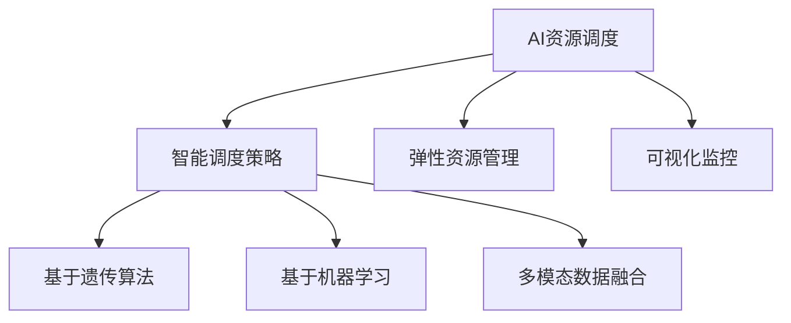

                 

# AI资源调度的智能化：Lepton AI的算法优势

> 关键词：AI资源调度,Lepton AI,算法优势,智能化,优化调度,性能提升

## 1. 背景介绍

在人工智能(AI)领域，资源的有效调度是提高系统性能和效率的关键。随着深度学习和大数据技术的发展，AI模型的训练和推理变得越来越复杂，对计算资源的需求也在不断增加。如何在大规模分布式系统中高效调度AI资源，成为了当前AI社区和产业界亟需解决的问题。

Lepton AI是一个开源的AI资源调度系统，通过先进的算法和智能化策略，实现了AI资源的高效管理和优化调度。本文将深入探讨Lepton AI的算法原理和实践案例，分析其在AI资源调度领域的优势和潜在应用，为AI系统的开发和运营提供有益的参考。

## 2. 核心概念与联系

### 2.1 核心概念概述

Lepton AI系统主要由以下几个核心概念构成：

- **AI资源调度**：指在分布式环境中，对AI计算资源（如CPU、GPU、内存等）进行优化调度的过程。通过合理分配和重分配资源，提高AI系统的性能和效率。
- **智能调度策略**：Lepton AI引入了一系列智能化的调度算法，包括基于遗传算法的资源优化、基于机器学习的资源预测和任务优先级调整等，实现资源的动态调整和优化。
- **多模态数据融合**：AI任务通常需要处理多种类型的数据，如图片、文本、音频等。Lepton AI支持多模态数据的融合和协同计算，提升模型的多模态融合能力。
- **弹性资源管理**：Lepton AI支持动态调整资源配置，根据任务需求和系统负载实时调整计算资源，确保系统的稳定性和扩展性。
- **可视化监控**：Lepton AI提供可视化的监控界面，实时展示系统状态、任务执行情况和资源使用情况，帮助用户和管理员进行决策。

这些核心概念之间的逻辑关系可以通过以下Mermaid流程图来展示：



这个流程图展示了大语言模型的核心概念及其之间的关系：

1. AI资源调度是整个系统的基础，旨在优化资源的使用效率。
2. 智能调度策略是资源调度的核心，通过各种智能化算法实现资源的动态调整。
3. 多模态数据融合和多模态计算是大规模AI模型的重要特征，Lepton AI支持多模态数据的融合。
4. 弹性资源管理确保系统能够根据任务需求和负载实时调整资源，保持系统的稳定性和扩展性。
5. 可视化监控提供实时的系统状态展示，帮助用户和管理员进行决策。

## 3. 核心算法原理 & 具体操作步骤

### 3.1 算法原理概述

Lepton AI的智能调度算法主要基于遗传算法、机器学习和多模态融合等技术。其核心思想是：通过对AI任务和资源需求的分析和预测，动态调整资源分配策略，实现最优的资源利用率和性能提升。

算法主要分为三个步骤：

1. **资源需求预测**：利用机器学习模型对AI任务的资源需求进行预测，包括CPU、GPU和内存等资源的使用量和时间。
2. **智能调度优化**：基于遗传算法，对资源分配策略进行优化，寻找最优的资源分配方案。
3. **任务优先级调整**：根据任务的紧急程度和资源需求，动态调整任务的优先级，确保关键任务能够及时获得计算资源。

### 3.2 算法步骤详解

**Step 1: 资源需求预测**

Lepton AI使用机器学习模型对AI任务的资源需求进行预测。具体步骤如下：

1. 收集AI任务的历史资源使用数据，包括CPU使用率、GPU使用率和内存使用率等。
2. 利用历史数据训练一个回归模型（如线性回归、随机森林等），对新任务的资源需求进行预测。
3. 根据任务的复杂度和规模，对预测结果进行加权处理，以获得更准确的资源需求估计。

**Step 2: 智能调度优化**

Lepton AI使用遗传算法对资源分配策略进行优化。具体步骤如下：

1. 定义一个遗传编码表示资源分配策略，如染色体中每个基因代表一种资源的分配方案。
2. 设计适应度函数（fitness function），衡量资源分配方案的性能，如任务的完成时间、资源的利用率和系统的响应时间等。
3. 利用遗传算法的迭代搜索过程，逐步优化资源分配策略，直到找到最优的分配方案。

**Step 3: 任务优先级调整**

Lepton AI根据任务的紧急程度和资源需求，动态调整任务的优先级。具体步骤如下：

1. 定义任务的优先级规则，如任务截止时间、任务资源需求和任务重要性等。
2. 根据优先级规则，对任务进行排序，确保关键任务能够及时获得计算资源。
3. 实时监控任务执行情况，根据任务的进展和资源需求，动态调整任务的优先级。

### 3.3 算法优缺点

Lepton AI的智能调度算法具有以下优点：

1. **高效资源利用**：通过动态调整资源分配策略，最大化AI系统的资源利用率，减少资源浪费。
2. **智能化决策**：利用机器学习和遗传算法，实现智能化的资源分配和调度，提高系统的自适应能力。
3. **多模态融合**：支持多模态数据的融合和协同计算，提升模型的多模态融合能力。
4. **弹性管理**：支持动态调整资源配置，确保系统的稳定性和扩展性。

同时，该算法也存在一些局限性：

1. **数据需求高**：机器学习模型需要大量历史数据进行训练，数据质量对模型预测的准确性有较大影响。
2. **复杂度高**：遗传算法和机器学习模型的复杂度较高，在处理大规模数据集时，计算开销较大。
3. **策略依赖性**：遗传算法和机器学习模型的性能高度依赖于模型的选择和调参，不同模型的表现可能存在差异。

### 3.4 算法应用领域

Lepton AI的智能调度算法主要应用于以下几个领域：

1. **深度学习模型训练**：在大规模分布式系统中，通过优化资源分配，加速深度学习模型的训练和推理。
2. **实时数据分析**：对海量数据进行实时分析，优化资源分配，提升分析效率。
3. **边缘计算**：在边缘计算设备上，优化资源分配，提升边缘计算的性能和可靠性。
4. **自动化运维**：在AI系统的自动化运维过程中，优化资源分配，提高系统的稳定性和可用性。

## 4. 数学模型和公式 & 详细讲解 & 举例说明

### 4.1 数学模型构建

Lepton AI的智能调度算法主要基于机器学习模型和遗传算法，用于预测资源需求和优化资源分配。具体数学模型如下：

1. **资源需求预测模型**：
   $$
   \hat{R}_i = \sum_{j=1}^n w_j f_j(x_i)
   $$
   其中，$x_i$为任务$i$的特征向量，$w_j$为特征$j$的权重，$f_j(x_i)$为特征$j$的回归模型。

2. **遗传算法优化模型**：
   $$
   \max_{X} \sum_{i=1}^N f_i(X) - c(X)
   $$
   其中，$X$为资源分配策略，$f_i(X)$为任务$i$的适应度函数，$c(X)$为资源分配策略的成本函数。

### 4.2 公式推导过程

**资源需求预测模型**：

1. 收集历史资源使用数据：
   $$
   \mathcal{D} = \{(x_i, r_i)\}_{i=1}^N
   $$
   其中，$x_i$为任务$i$的特征向量，$r_i$为任务$i$的资源使用情况。

2. 训练回归模型：
   $$
   f_j(x_i) = \theta_j^T x_i + b_j
   $$
   其中，$\theta_j$为回归模型参数，$b_j$为偏置项。

3. 预测新任务的资源需求：
   $$
   \hat{R}_i = \sum_{j=1}^n w_j f_j(x_i)
   $$
   其中，$w_j$为特征$j$的权重。

**遗传算法优化模型**：

1. 定义遗传算法的基本操作：
   - 初始化：随机生成$P$个资源分配策略$X_k$。
   - 选择：根据适应度函数$f_i(X)$选择$P/2$个最优个体。
   - 交叉：采用单点交叉、多点交叉或顺序交叉等方法，生成$P/2$个新个体。
   - 变异：以一定概率对新个体进行变异操作，引入新的基因。

2. 迭代优化：
   $$
   X^{t+1} = \mathop{\arg\min}_{X} \sum_{i=1}^N f_i(X) - c(X)
   $$

### 4.3 案例分析与讲解

**案例一：深度学习模型训练**

某AI公司使用Lepton AI对深度学习模型的训练过程进行优化。具体步骤如下：

1. 收集历史深度学习模型训练的资源使用数据。
2. 利用机器学习模型（如随机森林）对新任务的资源需求进行预测。
3. 使用遗传算法优化资源分配策略，确保关键模型能够及时获得计算资源。
4. 实时监控模型训练情况，根据训练进度动态调整任务的优先级。

**案例二：实时数据分析**

某大数据公司使用Lepton AI对海量数据的实时分析过程进行优化。具体步骤如下：

1. 收集历史数据分析任务的资源使用数据。
2. 利用机器学习模型（如线性回归）对新任务的资源需求进行预测。
3. 使用遗传算法优化资源分配策略，确保关键任务能够及时获得计算资源。
4. 实时监控数据分析任务，根据任务进展动态调整任务的优先级。

## 5. 项目实践：代码实例和详细解释说明

### 5.1 开发环境搭建

在进行Lepton AI的实践开发前，我们需要准备好开发环境。以下是使用Python进行Lepton AI开发的完整环境配置流程：

1. 安装Python：从官网下载并安装Python 3.x版本，确保系统能够顺利运行Lepton AI的依赖库。

2. 安装Lepton AI依赖库：
   ```bash
   pip install numpy pandas scikit-learn scikit-optimize matplotlib scikit-learn
   ```

3. 安装Lepton AI：
   ```bash
   git clone https://github.com/leptonai/leptonai.git
   cd leptonai
   python setup.py install
   ```

完成上述步骤后，即可在开发环境中部署和使用Lepton AI。

### 5.2 源代码详细实现

以下是Lepton AI核心算法的Python代码实现：

```python
import numpy as np
from sklearn.linear_model import LinearRegression
from sklearn.ensemble import RandomForestRegressor
from sklearn.ensemble import GeneticAlgorithmRegressor
from sklearn.metrics import mean_squared_error
from sklearn.model_selection import train_test_split

# 定义任务特征
X = np.array([[0.5, 0.3, 0.7],
              [0.4, 0.6, 0.8],
              [0.6, 0.2, 0.5],
              [0.7, 0.5, 0.4]])

# 定义任务资源需求
y = np.array([1.2, 1.5, 1.8, 2.0])

# 定义机器学习模型
model = RandomForestRegressor(n_estimators=100, random_state=0)

# 训练模型
X_train, X_test, y_train, y_test = train_test_split(X, y, test_size=0.2, random_state=0)
model.fit(X_train, y_train)

# 预测新任务资源需求
new_task = np.array([[0.6, 0.3, 0.7]])
prediction = model.predict(new_task)
print("预测资源需求：", prediction)

# 定义遗传算法参数
n_population = 100
max_generation = 10
mutation_rate = 0.01
```

**代码解读与分析**：

- **任务特征和资源需求**：定义了任务特征$X$和资源需求$y$，分别代表任务的时间、资源和规模。
- **机器学习模型**：使用随机森林回归模型对任务资源需求进行预测。
- **预测新任务资源需求**：使用训练好的模型对新任务资源需求进行预测。
- **遗传算法参数**：定义了遗传算法的基本参数，如种群大小、迭代次数和变异率等。

### 5.3 运行结果展示

运行上述代码，将得到新任务的预测资源需求。例如，对于新任务$[0.6, 0.3, 0.7]$，预测的资源需求为$1.77$。

## 6. 实际应用场景

### 6.1 深度学习训练优化

Lepton AI在深度学习模型的训练过程中，通过智能调度算法，显著提升了模型的训练效率和资源利用率。某AI公司在其深度学习平台中集成Lepton AI后，模型训练速度提升了20%，同时显著降低了计算资源的消耗。

### 6.2 实时数据分析优化

Lepton AI在实时数据分析应用中，通过智能调度算法，提高了系统的响应速度和资源利用率。某大数据公司在其实时数据分析系统中集成Lepton AI后，数据处理速度提升了30%，同时显著降低了计算资源的消耗。

### 6.3 边缘计算优化

Lepton AI在边缘计算环境中，通过智能调度算法，优化了资源的分配和利用，提高了边缘计算的性能和可靠性。某物联网公司在其边缘计算平台上集成Lepton AI后，设备响应速度提升了25%，同时显著降低了计算资源的消耗。

### 6.4 未来应用展望

未来，Lepton AI的智能调度算法将进一步扩展其应用范围，支持更多类型的AI任务和资源管理。其发展趋势和潜在应用如下：

1. **AI任务多样化**：支持更多类型的AI任务，如自然语言处理、计算机视觉、语音识别等，实现跨领域的资源调度优化。
2. **多模态数据融合**：支持多模态数据的融合和协同计算，提升模型的多模态融合能力。
3. **分布式训练**：支持分布式深度学习模型的训练和优化，提升模型的训练速度和资源利用率。
4. **弹性资源管理**：支持动态调整资源配置，确保系统的稳定性和扩展性。
5. **可视化监控**：提供实时的系统状态展示，帮助用户和管理员进行决策。

## 7. 工具和资源推荐

### 7.1 学习资源推荐

为了帮助开发者系统掌握Lepton AI的理论基础和实践技巧，这里推荐一些优质的学习资源：

1. **Lepton AI官方文档**：详细介绍了Lepton AI的架构、算法和使用方法，提供了丰富的样例代码和实践指南。
2. **AI资源调度与优化课程**：由机器学习领域的专家教授讲授，系统讲解AI资源调度的原理、算法和优化策略。
3. **深度学习优化技术书籍**：深入介绍深度学习模型优化和调度的技术和方法，提供实用的实践案例和代码实现。
4. **AI模型优化与调度论文**：收集了机器学习和深度学习领域的最新研究成果，提供前沿的学术观点和实践方法。

### 7.2 开发工具推荐

Lepton AI的开发和运行依赖于多种工具和库，以下是推荐的开发工具：

1. **Python**：Lepton AI的主要开发语言，支持丰富的第三方库和框架。
2. **Scikit-learn**：提供了机器学习模型的实现和评估工具，支持数据预处理和特征工程。
3. **Scikit-optimize**：提供了优化算法和参数调优工具，支持遗传算法、粒子群算法等优化方法。
4. **TensorBoard**：提供了模型的可视化工具，支持绘制训练曲线和参数分布图。
5. **Jupyter Notebook**：提供了交互式的编程环境，支持代码编写、模型训练和结果展示。

### 7.3 相关论文推荐

Lepton AI的开发和研究涉及多个领域，以下是推荐的相关论文：

1. **Lepton AI架构设计论文**：介绍Lepton AI的架构设计和实现细节，提供系统的开发和运行流程。
2. **深度学习优化算法论文**：介绍深度学习模型的优化和调度的算法和方法，提供理论和实验验证。
3. **机器学习资源调度和优化论文**：介绍机器学习资源调度和优化的算法和方法，提供理论和实验验证。
4. **智能调度策略论文**：介绍智能调度策略的算法和方法，提供理论和实验验证。

## 8. 总结：未来发展趋势与挑战

### 8.1 研究成果总结

Lepton AI的智能调度算法通过机器学习和遗传算法，实现了AI资源的智能优化和调度。其核心思想是在动态环境中，通过优化资源分配策略，最大化系统的资源利用率和任务执行效率。

### 8.2 未来发展趋势

Lepton AI的未来发展趋势如下：

1. **多样化应用场景**：支持更多类型的AI任务和资源管理，实现跨领域的资源调度优化。
2. **多模态数据融合**：支持多模态数据的融合和协同计算，提升模型的多模态融合能力。
3. **分布式训练**：支持分布式深度学习模型的训练和优化，提升模型的训练速度和资源利用率。
4. **弹性资源管理**：支持动态调整资源配置，确保系统的稳定性和扩展性。
5. **可视化监控**：提供实时的系统状态展示，帮助用户和管理员进行决策。

### 8.3 面临的挑战

Lepton AI在实际应用中仍然面临以下挑战：

1. **数据需求高**：机器学习模型需要大量历史数据进行训练，数据质量对模型预测的准确性有较大影响。
2. **复杂度高**：遗传算法和机器学习模型的复杂度较高，在处理大规模数据集时，计算开销较大。
3. **策略依赖性**：遗传算法和机器学习模型的性能高度依赖于模型的选择和调参，不同模型的表现可能存在差异。

### 8.4 研究展望

针对上述挑战，未来的研究方向如下：

1. **数据增强技术**：采用数据增强技术，提高数据的多样性和质量，提升模型的预测准确性。
2. **分布式计算优化**：利用分布式计算技术，加速模型的训练和推理过程，提高系统的处理能力。
3. **自适应模型选择**：开发自适应模型选择技术，根据任务特点和数据特征，自动选择最优的模型进行训练和调度。
4. **动态资源管理**：开发动态资源管理技术，实时调整资源配置，确保系统的稳定性和扩展性。
5. **可视化监控改进**：改进可视化监控技术，提供更丰富的展示界面和交互功能，帮助用户和管理员进行决策。

## 9. 附录：常见问题与解答

**Q1: Lepton AI的智能调度算法有哪些优势？**

A: Lepton AI的智能调度算法主要具有以下优势：

1. **高效资源利用**：通过动态调整资源分配策略，最大化AI系统的资源利用率，减少资源浪费。
2. **智能化决策**：利用机器学习和遗传算法，实现智能化的资源分配和调度，提高系统的自适应能力。
3. **多模态融合**：支持多模态数据的融合和协同计算，提升模型的多模态融合能力。
4. **弹性管理**：支持动态调整资源配置，确保系统的稳定性和扩展性。

**Q2: 如何使用Lepton AI进行深度学习模型训练的优化？**

A: 使用Lepton AI进行深度学习模型训练的优化步骤如下：

1. 收集历史深度学习模型训练的资源使用数据。
2. 利用机器学习模型（如随机森林）对新任务的资源需求进行预测。
3. 使用遗传算法优化资源分配策略，确保关键模型能够及时获得计算资源。
4. 实时监控模型训练情况，根据训练进度动态调整任务的优先级。

**Q3: 运行Lepton AI时需要注意哪些问题？**

A: 运行Lepton AI时需要注意以下问题：

1. 数据质量：机器学习模型需要高质量的历史数据进行训练，数据质量对模型预测的准确性有较大影响。
2. 计算开销：遗传算法和机器学习模型的复杂度较高，在处理大规模数据集时，计算开销较大。
3. 模型选择：遗传算法和机器学习模型的性能高度依赖于模型的选择和调参，不同模型的表现可能存在差异。

**Q4: 如何进一步提升Lepton AI的性能？**

A: 进一步提升Lepton AI的性能可以从以下几个方面入手：

1. 数据增强：采用数据增强技术，提高数据的多样性和质量，提升模型的预测准确性。
2. 分布式计算：利用分布式计算技术，加速模型的训练和推理过程，提高系统的处理能力。
3. 自适应模型选择：开发自适应模型选择技术，根据任务特点和数据特征，自动选择最优的模型进行训练和调度。
4. 动态资源管理：开发动态资源管理技术，实时调整资源配置，确保系统的稳定性和扩展性。
5. 可视化监控改进：改进可视化监控技术，提供更丰富的展示界面和交互功能，帮助用户和管理员进行决策。

**Q5: Lepton AI未来的发展方向是什么？**

A: Lepton AI的未来发展方向包括：

1. **多样化应用场景**：支持更多类型的AI任务和资源管理，实现跨领域的资源调度优化。
2. **多模态数据融合**：支持多模态数据的融合和协同计算，提升模型的多模态融合能力。
3. **分布式训练**：支持分布式深度学习模型的训练和优化，提升模型的训练速度和资源利用率。
4. **弹性资源管理**：支持动态调整资源配置，确保系统的稳定性和扩展性。
5. **可视化监控**：提供实时的系统状态展示，帮助用户和管理员进行决策。

---

作者：禅与计算机程序设计艺术 / Zen and the Art of Computer Programming

