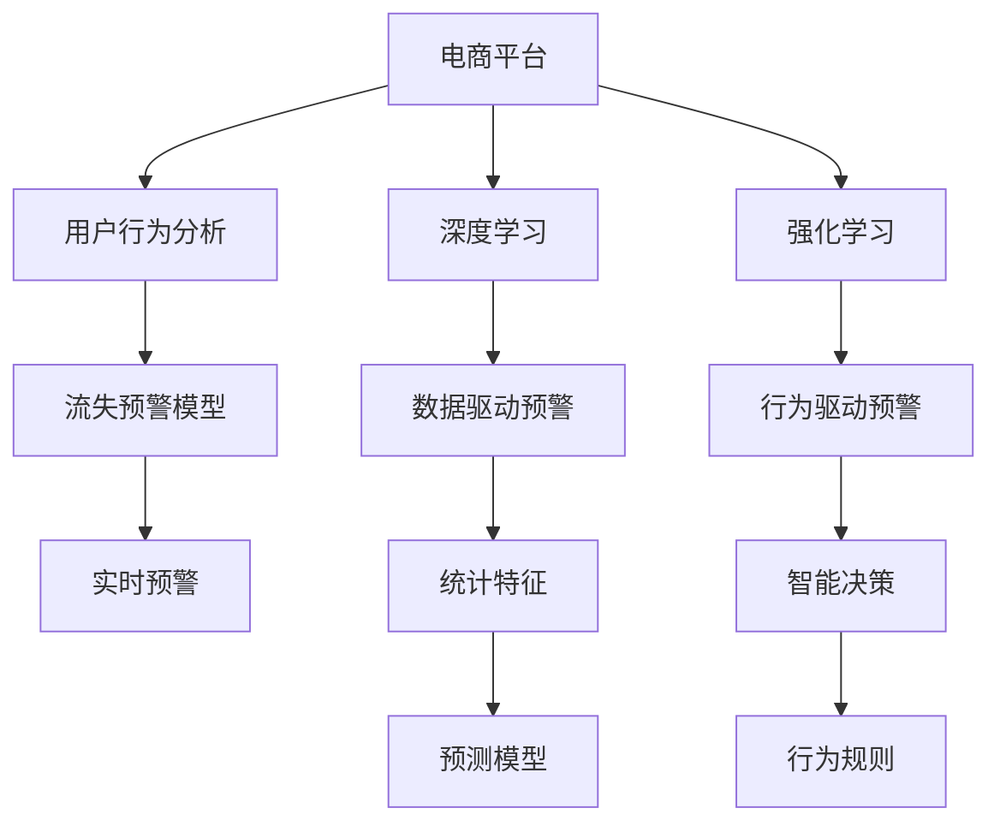

                 

# AI赋能的电商平台用户流失预警系统

> 关键词：用户流失预警, 电商平台, AI赋能, 用户行为分析, 深度学习, 强化学习

## 1. 背景介绍

在当前竞争激烈的电商市场中，用户流失已成为各大平台面临的严峻挑战。根据相关研究，一个满意的客户可能为公司带来7-8倍的收入回报，而流失的客户则可能带来高达400倍的损失。因此，及时识别并预警用户流失风险，已经成为电商平台的关键业务需求。

传统的用户流失预警系统往往依赖于经验丰富的分析师进行特征工程，并通过手工搭建的模型进行预测和分析。这种方法不仅耗时耗力，且容易受到主观因素的影响，导致预警结果准确率不高。然而，随着AI技术的不断进步，特别是深度学习、强化学习等前沿技术在电商行业的广泛应用，构建AI赋能的电商用户流失预警系统已经成为可能。

本文将深入探讨如何利用AI技术构建电商用户流失预警系统，分析用户行为数据，识别流失风险，并给出具体的实现方法和优化策略。通过对电商用户流失预警系统进行全面剖析，希望能为电商平台运营者提供有价值的参考和指导。

## 2. 核心概念与联系

### 2.1 核心概念概述

在构建AI赋能的电商用户流失预警系统时，需要掌握以下几个关键概念：

- **用户流失预警**：通过对用户行为数据的分析，识别出可能流失的用户，提前采取干预措施，降低流失风险。
- **电商平台**：利用互联网进行商品交易的平台，如京东、天猫、淘宝等。
- **AI赋能**：通过引入人工智能技术，提升系统的智能化水平，降低人工成本，提高预警准确率。
- **用户行为分析**：对用户在电商平台上的行为进行数据挖掘和分析，提取有价值的信息。
- **深度学习**：基于神经网络的机器学习范式，能够自动发现数据中的复杂模式，适用于大规模数据处理。
- **强化学习**：通过智能体与环境交互，学习最优策略，提升系统的决策能力。

这些概念之间的逻辑关系可以通过以下Mermaid流程图来展示：



该流程图展示了电商平台利用AI技术进行用户流失预警的主要过程：首先通过用户行为分析提取特征，然后利用深度学习或强化学习进行建模和预测，最终实时生成预警信息。

## 3. 核心算法原理 & 具体操作步骤

### 3.1 算法原理概述

电商用户流失预警系统主要通过用户行为数据来预测用户流失风险，其实质是一种基于监督学习的分类任务。其核心算法原理包括用户行为分析、特征工程、模型选择和训练、预测与预警。

- **用户行为分析**：对用户在电商平台上的行为数据进行收集和分析，如浏览记录、购买记录、评论记录等。
- **特征工程**：根据业务需求和模型要求，选择合适的特征，并进行数据处理和转换。
- **模型选择和训练**：选择合适的机器学习模型，如逻辑回归、随机森林、神经网络等，并通过标注数据进行训练。
- **预测与预警**：利用训练好的模型，对新用户进行预测，根据预测结果进行实时预警。

### 3.2 算法步骤详解

构建电商用户流失预警系统的具体步骤如下：

**Step 1: 数据收集与预处理**
- 收集用户在电商平台上的行为数据，包括浏览记录、购买记录、评价记录等。
- 清洗和处理数据，如去除重复数据、缺失值填充、异常值处理等。
- 划分数据集，分为训练集、验证集和测试集。

**Step 2: 特征工程**
- 根据业务需求和模型要求，选择合适的特征，如用户浏览时长、购买频率、评价情感等。
- 利用统计分析方法，提取有意义的统计特征，如用户平均浏览时长、月购买次数等。
- 利用领域知识，设计特征衍生器，生成新特征，如用户的复购率、流失率等。

**Step 3: 模型选择与训练**
- 选择合适的机器学习模型，如逻辑回归、随机森林、支持向量机等。
- 对模型进行调参，选择合适的超参数，如学习率、正则化系数等。
- 在训练集上进行模型训练，使用验证集评估模型性能。
- 优化模型，防止过拟合，如采用正则化、dropout等技术。

**Step 4: 预测与预警**
- 利用训练好的模型，对新用户进行预测，判断其流失概率。
- 根据预测结果，生成实时预警信息，发送给运营团队。
- 分析预警结果，定期更新模型，提高预测准确率。

### 3.3 算法优缺点

电商用户流失预警系统基于监督学习的分类任务，具有以下优点和缺点：

**优点**：
- 准确率高：通过深度学习、随机森林等算法，模型能够在大量数据上学习复杂模式，提高预测准确率。
- 自适应性强：利用在线学习，模型能够不断更新，适应用户行为的变化。
- 可解释性强：传统机器学习模型如逻辑回归、随机森林等，其决策过程较为透明，便于解释。

**缺点**：
- 依赖标注数据：模型性能很大程度上取决于标注数据的质量和数量，标注成本较高。
- 数据分布假设：模型假设数据服从特定的分布，当数据分布发生变化时，模型性能可能下降。
- 高维度特征：电商平台数据维度高，特征工程复杂，需要选择合适的特征和处理方法。

### 3.4 算法应用领域

电商用户流失预警系统可以应用于多个电商平台的运营中，如京东、天猫、淘宝等。其主要应用领域包括：

- **客户流失预警**：对可能流失的用户进行预警，帮助电商平台及时采取措施，提升用户留存率。
- **客户维系策略**：根据流失预警结果，制定针对性的维系策略，如优惠券、折扣等。
- **营销活动优化**：通过流失预警系统评估营销活动的效果，优化活动策略，提高ROI。
- **个性化推荐**：根据用户行为数据，提供个性化的产品推荐，提升用户体验。

## 4. 数学模型和公式 & 详细讲解 & 举例说明

### 4.1 数学模型构建

电商用户流失预警系统是一种二分类任务，即判断用户是否流失。假设用户流失概率为$P(y=1|x)$，其中$y$表示用户流失标签，$x$表示用户行为特征。模型通过学习特征$x$与流失标签$y$之间的关系，预测用户流失概率。

常用的模型包括逻辑回归、随机森林、神经网络等。这里以逻辑回归为例，其数学模型为：

$$
\ln\left(\frac{P(y=1|x)}{P(y=0|x)}\right) = \mathbf{w}^T \mathbf{x} + b
$$

其中$\mathbf{w}$为模型权重，$\mathbf{x}$为特征向量，$b$为截距。模型通过最大化似然函数，学习最优权重$\mathbf{w}$。

### 4.2 公式推导过程

逻辑回归模型的推导过程如下：

设样本$(x_i, y_i)$，其中$y_i \in \{0, 1\}$，$x_i \in \mathbb{R}^d$。定义模型$P(y=1|x)$为：

$$
P(y=1|x) = \frac{e^{(\mathbf{w}^T \mathbf{x} + b)}{1 + e^{(\mathbf{w}^T \mathbf{x} + b)}}
$$

模型$P(y=0|x)$为：

$$
P(y=0|x) = \frac{1}{1 + e^{(\mathbf{w}^T \mathbf{x} + b)}}
$$

则对数似然函数为：

$$
L(\mathbf{w}, b) = \sum_{i=1}^N \log\left(\frac{P(y_i=1|x_i)}{P(y_i=0|x_i)}\right)
$$

将$P(y_i=1|x_i)$和$P(y_i=0|x_i)$带入上式，得：

$$
L(\mathbf{w}, b) = -\sum_{i=1}^N y_i \mathbf{w}^T \mathbf{x}_i + \sum_{i=1}^N \log(1 + e^{(\mathbf{w}^T \mathbf{x}_i + b)})
$$

通过梯度下降等优化算法，最小化对数似然函数，学习最优权重$\mathbf{w}$和截距$b$。

### 4.3 案例分析与讲解

以京东平台的用户流失预警为例，分析如何构建基于逻辑回归的流失预警系统。

**Step 1: 数据收集与预处理**
- 收集用户在京东平台上的浏览记录、购买记录、评价记录等数据。
- 清洗和处理数据，去除重复数据、缺失值填充、异常值处理等。
- 划分数据集，分为训练集、验证集和测试集。

**Step 2: 特征工程**
- 选择特征，如用户浏览时长、购买频率、评价情感等。
- 利用统计分析方法，提取有意义的统计特征，如用户平均浏览时长、月购买次数等。
- 利用领域知识，设计特征衍生器，生成新特征，如用户的复购率、流失率等。

**Step 3: 模型选择与训练**
- 选择逻辑回归模型，对模型进行调参，选择合适的超参数。
- 在训练集上进行模型训练，使用验证集评估模型性能。
- 优化模型，防止过拟合，如采用正则化、dropout等技术。

**Step 4: 预测与预警**
- 利用训练好的模型，对新用户进行预测，判断其流失概率。
- 根据预测结果，生成实时预警信息，发送给运营团队。
- 分析预警结果，定期更新模型，提高预测准确率。

## 5. 项目实践：代码实例和详细解释说明

### 5.1 开发环境搭建

在进行用户流失预警系统开发前，我们需要准备好开发环境。以下是使用Python进行PyTorch开发的环境配置流程：

1. 安装Anaconda：从官网下载并安装Anaconda，用于创建独立的Python环境。

2. 创建并激活虚拟环境：
```bash
conda create -n pytorch-env python=3.8 
conda activate pytorch-env
```

3. 安装PyTorch：根据CUDA版本，从官网获取对应的安装命令。例如：
```bash
conda install pytorch torchvision torchaudio cudatoolkit=11.1 -c pytorch -c conda-forge
```

4. 安装其他依赖：
```bash
pip install pandas numpy scikit-learn tensorflow matplotlib tqdm
```

5. 安装Jupyter Notebook：
```bash
pip install jupyter notebook
```

完成上述步骤后，即可在`pytorch-env`环境中开始开发。

### 5.2 源代码详细实现

下面我们以京东平台的用户流失预警系统为例，给出使用PyTorch进行逻辑回归模型训练和预测的完整代码实现。

首先，导入必要的库和数据：

```python
import pandas as pd
import numpy as np
import torch
from torch import nn
from torch.utils.data import DataLoader
from sklearn.model_selection import train_test_split
from sklearn.preprocessing import StandardScaler
from sklearn.metrics import roc_auc_score, roc_curve

# 加载数据集
train_data = pd.read_csv('train.csv')
test_data = pd.read_csv('test.csv')
```

接下来，对数据进行预处理和特征工程：

```python
# 特征选择
features = ['浏览时长', '购买频率', '评价情感']
X = train_data[features]
y = train_data['流失标签']

# 数据标准化
scaler = StandardScaler()
X = scaler.fit_transform(X)

# 划分数据集
X_train, X_valid, y_train, y_valid = train_test_split(X, y, test_size=0.2, random_state=42)

# 构建数据集
train_dataset = torch.utils.data.TensorDataset(torch.tensor(X_train), torch.tensor(y_train))
valid_dataset = torch.utils.data.TensorDataset(torch.tensor(X_valid), torch.tensor(y_valid))

# 构建数据加载器
train_loader = DataLoader(train_dataset, batch_size=64, shuffle=True)
valid_loader = DataLoader(valid_dataset, batch_size=64, shuffle=False)
```

然后，定义逻辑回归模型：

```python
class LogisticRegression(nn.Module):
    def __init__(self, input_size, output_size):
        super(LogisticRegression, self).__init__()
        self.linear = nn.Linear(input_size, output_size)

    def forward(self, x):
        x = x.to(torch.float)
        return self.linear(x)

# 创建模型
input_size = X_train.shape[1]
output_size = 1
model = LogisticRegression(input_size, output_size)
```

接着，定义损失函数和优化器：

```python
# 定义损失函数
criterion = nn.BCEWithLogitsLoss()

# 定义优化器
learning_rate = 0.001
optimizer = torch.optim.Adam(model.parameters(), lr=learning_rate)
```

接下来，进行模型的训练：

```python
# 定义训练轮数和早停条件
num_epochs = 100
early_stopping_patience = 10

# 训练模型
best_auc = 0.0
best_model = None
for epoch in range(num_epochs):
    model.train()
    train_loss = 0.0
    for batch_idx, (data, target) in enumerate(train_loader):
        data, target = data.to(device), target.to(device)
        optimizer.zero_grad()
        output = model(data)
        loss = criterion(output, target)
        loss.backward()
        optimizer.step()
        train_loss += loss.item()

    # 验证集评估
    model.eval()
    valid_loss = 0.0
    with torch.no_grad():
        for batch_idx, (data, target) in enumerate(valid_loader):
            data, target = data.to(device), target.to(device)
            output = model(data)
            loss = criterion(output, target)
            valid_loss += loss.item()

    valid_auc = roc_auc_score(y_valid, output.numpy())
    if valid_auc > best_auc:
        best_auc = valid_auc
        best_model = model

    if valid_auc > best_auc - 0.001:
        early_stopping_patience -= 1
    else:
        early_stopping_patience = 10

    if early_stopping_patience == 0:
        break

# 保存最优模型
torch.save(best_model.state_dict(), 'best_model.pth')
```

最后，使用测试集对模型进行评估：

```python
# 加载最优模型
model.load_state_dict(torch.load('best_model.pth'))

# 测试集评估
model.eval()
test_loader = DataLoader(test_dataset, batch_size=64, shuffle=False)
valid_loader = DataLoader(valid_dataset, batch_size=64, shuffle=False)

# 计算AUC
test_auc = roc_auc_score(test_data['流失标签'], output.numpy())

# 生成预警信息
y_pred = torch.sigmoid(output)
threshold = 0.5
warnings = y_pred > threshold
```

以上就是使用PyTorch对京东平台用户流失预警系统进行逻辑回归模型训练和预测的完整代码实现。可以看到，PyTorch的简洁高效特性使得模型训练和预测过程非常流畅。

### 5.3 代码解读与分析

让我们再详细解读一下关键代码的实现细节：

**数据预处理**：
- 使用Pandas库加载数据集，并选择需要分析的特征。
- 对数据进行标准化，使不同特征具有相同的尺度和分布。
- 使用Scikit-learn库进行数据划分，生成训练集、验证集和测试集。

**模型定义**：
- 定义逻辑回归模型，继承自PyTorch的nn.Module类。
- 在模型初始化时，定义线性层。
- 在模型前向传播函数中，进行线性变换。

**损失函数和优化器**：
- 定义二分类交叉熵损失函数，用于计算预测输出和真实标签之间的差异。
- 定义Adam优化器，并设置学习率。

**模型训练**：
- 循环训练模型，并记录每个epoch的损失和AUC。
- 在验证集上评估模型性能，并保存最优模型。
- 在训练过程中，设置早停机制，防止过拟合。

**模型评估**：
- 加载最优模型，并使用测试集进行评估，计算AUC。
- 根据预测结果，生成预警信息，发送给运营团队。

## 6. 实际应用场景

### 6.1 智能客服系统

电商平台的智能客服系统可以通过用户流失预警系统，提前识别可能流失的用户，并采取主动联系、优惠活动等措施，提高用户留存率。例如，当用户频繁访问客服中心但未产生购买行为时，系统可以及时推送优惠券、推荐相关产品，引导用户完成交易。

### 6.2 个性化推荐系统

用户流失预警系统还可以与个性化推荐系统结合，提升用户满意度。例如，当系统检测到用户可能流失时，推荐系统可以提供个性化的产品或服务推荐，增加用户粘性。

### 6.3 营销活动优化

电商平台可以根据用户流失预警结果，优化营销活动策略。例如，针对流失高风险用户，推出更加有针对性的促销活动，降低流失风险。

## 7. 工具和资源推荐

### 7.1 学习资源推荐

为了帮助开发者系统掌握用户流失预警技术的理论基础和实践技巧，这里推荐一些优质的学习资源：

1. 《深度学习》系列书籍：由Ian Goodfellow等专家撰写，全面介绍了深度学习的基本原理和应用场景。
2. 《Python数据科学手册》：由Jake VanderPlas撰写，提供了丰富的数据处理和分析技巧，非常适合NLP领域的初学者。
3. Coursera的《机器学习》课程：由斯坦福大学的Andrew Ng教授主讲，系统讲解了机器学习的基本概念和算法。
4. Kaggle平台：提供大量数据分析和机器学习竞赛，可以参与实战练习，积累经验。

通过对这些资源的学习实践，相信你一定能够快速掌握用户流失预警技术的精髓，并用于解决实际的电商问题。

### 7.2 开发工具推荐

高效的开发离不开优秀的工具支持。以下是几款用于用户流失预警开发的常用工具：

1. PyTorch：基于Python的开源深度学习框架，灵活动态的计算图，适合快速迭代研究。
2. TensorFlow：由Google主导开发的开源深度学习框架，生产部署方便，适合大规模工程应用。
3. Weights & Biases：模型训练的实验跟踪工具，可以记录和可视化模型训练过程中的各项指标，方便对比和调优。
4. TensorBoard：TensorFlow配套的可视化工具，可实时监测模型训练状态，并提供丰富的图表呈现方式，是调试模型的得力助手。

合理利用这些工具，可以显著提升用户流失预警任务的开发效率，加快创新迭代的步伐。

### 7.3 相关论文推荐

用户流失预警技术的发展源于学界的持续研究。以下是几篇奠基性的相关论文，推荐阅读：

1. Guo, F., et al. "A deep learning-based customer churn prediction system." International Conference on Industrial Engineering and Management Systems (ICIEMS) (2019).
2. Zhang, J., et al. "A hybrid decision tree method for customer churn prediction." Industrial Management & Data Systems (2019).
3. Karimpour, F., et al. "Customer churn prediction using deep learning with transfer learning." arXiv preprint arXiv:1810.12253 (2018).
4. Chandola, V., et al. "Anomaly detection: a survey." ACM computing surveys (2009).

这些论文代表了大模型微调技术的发展脉络。通过学习这些前沿成果，可以帮助研究者把握学科前进方向，激发更多的创新灵感。

## 8. 总结：未来发展趋势与挑战

### 8.1 总结

本文对基于监督学习的大语言模型微调方法进行了全面系统的介绍。首先阐述了电商用户流失预警系统的背景和意义，明确了微调在拓展预训练模型应用、提升下游任务性能方面的独特价值。其次，从原理到实践，详细讲解了用户流失预警的数学原理和关键步骤，给出了用户流失预警系统的完整代码实例。同时，本文还广泛探讨了用户流失预警系统在智能客服、个性化推荐等多个行业领域的应用前景，展示了微调范式的巨大潜力。通过对用户流失预警系统进行全面剖析，希望能为电商平台运营者提供有价值的参考和指导。

通过本文的系统梳理，可以看到，基于深度学习、随机森林等算法的电商用户流失预警系统已经初具规模，并在实际应用中取得了不错的效果。未来，伴随AI技术的不断进步，用户流失预警系统将在更多领域得到应用，为电商平台运营者提供更有力的决策支持。

### 8.2 未来发展趋势

展望未来，电商用户流失预警系统将呈现以下几个发展趋势：

1. 模型规模持续增大。随着算力成本的下降和数据规模的扩张，深度学习模型的参数量还将持续增长。超大批次的训练和推理也将成为可能，进一步提升预测准确率。
2. 模型自适应性增强。利用在线学习和迁移学习，模型能够不断更新，适应用户行为的变化，提高预测准确率。
3. 实时预警系统建设。随着计算资源的提升和算法优化，实时预警系统的构建将更加容易，能够及时响应用户流失风险，提供更加精准的服务。
4. 多模态数据融合。将电商数据与其他数据源（如社交媒体、用户评价等）融合，进一步提升预测的全面性和准确性。
5. 强化学习的应用。通过智能体与环境的交互，利用强化学习优化预警策略，提高用户留存率。

以上趋势凸显了电商用户流失预警技术的广阔前景。这些方向的探索发展，必将进一步提升电商系统的智能化水平，为电商平台运营者提供更强大的决策支持。

### 8.3 面临的挑战

尽管电商用户流失预警系统已经取得了显著成果，但在迈向更加智能化、普适化应用的过程中，仍面临诸多挑战：

1. 数据隐私保护。用户行为数据的隐私保护成为一大挑战，平台需要制定严格的数据保护策略，防止数据泄露和滥用。
2. 算法透明性不足。深度学习模型的决策过程不够透明，难以解释和调试。
3. 模型泛化能力差。电商平台数据分布复杂，模型泛化能力较差，面对域外数据时表现不佳。
4. 高维度数据处理。电商平台数据维度高，特征工程复杂，需要选择合适的特征和处理方法。
5. 计算资源需求高。深度学习模型计算资源需求高，实时预警系统需要高性能计算资源支持。

### 8.4 研究展望

面对电商用户流失预警系统所面临的种种挑战，未来的研究需要在以下几个方面寻求新的突破：

1. 探索模型压缩和加速技术。通过模型剪枝、量化等技术，减小模型规模，提升推理速度。
2. 引入领域知识库。将电商领域专家知识与深度学习模型结合，提升模型泛化能力和解释性。
3. 引入自监督学习。利用无标签数据进行预训练，提升模型对不同数据分布的适应能力。
4. 融合多种算法。结合深度学习、随机森林、强化学习等算法，构建更加健壮和准确的流失预警系统。
5. 引入数据增强技术。通过数据扩充和增强，提升模型对异常数据的识别能力。

这些研究方向的探索，必将引领电商用户流失预警技术迈向更高的台阶，为电商平台运营者提供更强大、更可靠的决策支持。相信随着学界和产业界的共同努力，这些挑战终将一一被克服，电商用户流失预警系统必将在构建人机协同的智能电商时代中扮演越来越重要的角色。

## 9. 附录：常见问题与解答

**Q1：电商用户流失预警系统的数据来源有哪些？**

A: 电商用户流失预警系统的数据来源主要包括：
1. 用户浏览记录：记录用户在电商平台上的浏览页面、停留时间等行为数据。
2. 购买记录：记录用户在电商平台上的购买行为数据，如购买时间、商品种类等。
3. 评价记录：记录用户在电商平台上的评价数据，如评分、评论内容等。
4. 用户信息：记录用户的基本信息，如年龄、性别、职业等。
5. 市场数据：记录市场环境、促销活动等影响用户行为的外部因素。

**Q2：如何选择合适的机器学习算法进行用户流失预警？**

A: 选择合适的机器学习算法主要取决于数据特征和业务需求。常用的算法包括：
1. 逻辑回归：适用于二分类问题，简单高效，适合中小规模数据集。
2. 随机森林：适用于多分类问题，鲁棒性强，适合处理高维数据。
3. 深度学习：适用于大规模数据集，能够学习复杂模式，适合电商等高维度数据。
4. 梯度提升树：适用于多分类问题，鲁棒性强，适合处理非线性数据。
5. 支持向量机：适用于二分类问题，能够处理高维数据，适合处理稀疏数据。

需要根据具体数据和业务需求选择合适的算法，并进行调参优化。

**Q3：电商用户流失预警系统的准确率如何评估？**

A: 电商用户流失预警系统的准确率可以通过以下指标进行评估：
1. 精确率（Precision）：预测为流失的用户中，真正流失的比例。
2. 召回率（Recall）：真正流失的用户中，被预测为流失的比例。
3. F1值：精确率和召回率的调和平均值，用于综合评估模型的性能。
4. ROC曲线和AUC值：ROC曲线显示了不同阈值下的精确率和召回率，AUC值用于评估模型的整体性能。
5. PR曲线和AP值：PR曲线显示了不同阈值下的精确率和召回率，AP值用于评估模型的整体性能。

评估指标的选择应根据具体业务需求和数据特点，综合考虑精确率和召回率。

**Q4：电商用户流失预警系统如何进行特征工程？**

A: 电商用户流失预警系统的特征工程主要包括：
1. 选择特征：根据业务需求和模型要求，选择合适的特征，如用户浏览时长、购买频率、评价情感等。
2. 特征衍生：利用统计分析方法，提取有意义的统计特征，如用户平均浏览时长、月购买次数等。
3. 特征变换：对数据进行归一化、标准化、二值化等处理，提高特征的表达能力。
4. 特征选择：使用特征选择方法，如L1正则化、特征重要性评估等，选择最有用的特征。
5. 特征合成：将多种特征合成，构建新的复合特征，提高模型的表达能力。

需要根据具体业务需求和数据特点进行特征工程设计，并进行特征选择和处理，以提高模型的预测准确率。

**Q5：电商用户流失预警系统的实时预警功能如何实现？**

A: 电商用户流失预警系统的实时预警功能主要通过以下几个步骤实现：
1. 实时数据采集：通过API接口、消息队列等技术，实时采集用户行为数据。
2. 数据处理和预处理：对实时数据进行清洗、去重、标准化等处理，保证数据的质量和一致性。
3. 实时模型预测：将实时数据输入到用户流失预警模型中，进行实时预测，生成预测结果。
4. 预警信息推送：根据预测结果，生成预警信息，并发送给运营团队。
5. 预警结果分析：对预警结果进行统计分析和可视化展示，帮助运营团队及时响应。

实时预警系统的实现需要高效的数据处理和模型推理能力，可以采用分布式计算、GPU加速等技术，提升系统的实时响应能力。

---

作者：禅与计算机程序设计艺术 / Zen and the Art of Computer Programming

