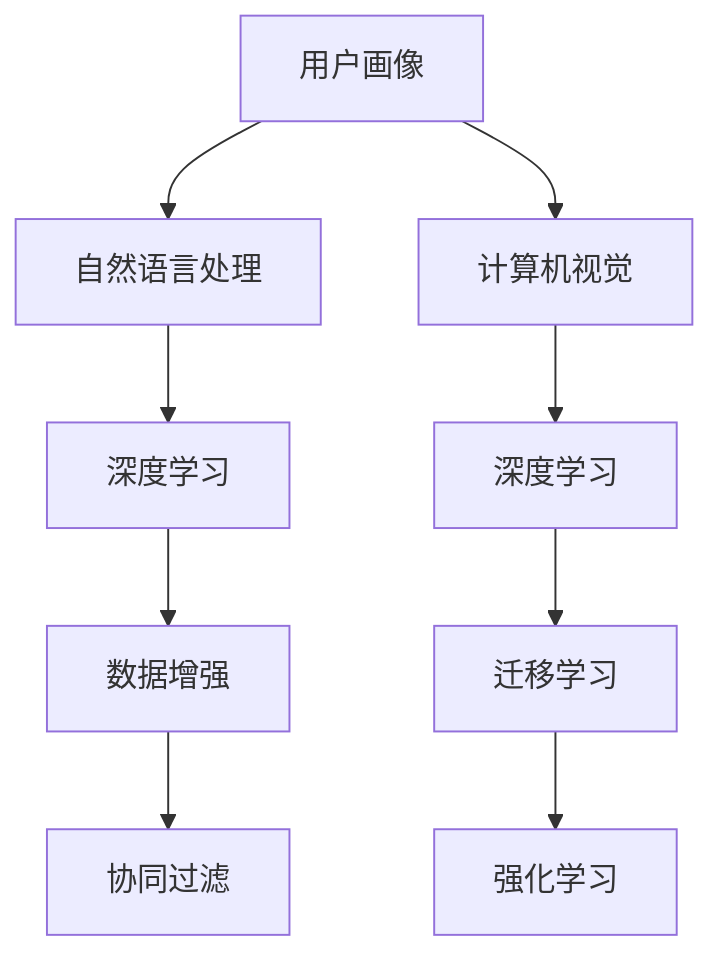

                 

# AI赋能的电商平台用户画像动态更新

## 1. 背景介绍

随着电子商务的快速发展，电商平台的用户数量和行为数据急剧膨胀。这些数据包含了用户浏览、购买、评价、投诉等多种行为信息，是商家了解用户需求、优化用户体验、提升销售业绩的重要资产。然而，数据量庞大且结构复杂，如何从中提炼有价值的用户画像，并实现动态更新，成为商家亟需解决的难题。近年来，人工智能技术在自然语言处理、计算机视觉、深度学习等领域取得了突破性进展，为电商用户画像的动态更新提供了新的解决方案。本文将介绍基于AI的电商平台用户画像动态更新的核心概念、技术原理和应用实践，并展望其未来发展趋势和挑战。

## 2. 核心概念与联系

### 2.1 核心概念概述

- **用户画像(User Profile)**：描述用户特征的抽象表示，通常包括年龄、性别、兴趣、行为偏好等信息。电商平台的用户画像可以基于用户行为数据、社交媒体数据、调查问卷等多种来源构建，用于个性化推荐、精准营销、客户细分等。
- **AI(Artificial Intelligence)**：一类模拟人类智能行为的技术，涵盖机器学习、自然语言处理、计算机视觉等多个领域，能够从数据中自动提取特征和模式，实现智能决策和自动化处理。
- **自然语言处理(NLP, Natural Language Processing)**：人工智能的一个重要分支，旨在使计算机能够理解、处理和生成人类语言，涉及文本分类、情感分析、意图识别等任务。
- **计算机视觉(Computer Vision)**：使计算机能够“看”和“理解”图像和视频内容的领域，包括图像识别、目标检测、图像生成等。
- **深度学习(Deep Learning)**：一类基于神经网络的机器学习技术，能够自动学习和优化特征提取与模型训练，适用于大规模数据和大规模模型的构建。
- **数据增强(Data Augmentation)**：通过对原始数据进行变换和扩充，生成更多、更丰富的训练样本，提高模型的泛化能力和鲁棒性。
- **迁移学习(Transfer Learning)**：通过在已有领域预训练模型，利用其在特定任务上的已有知识，加速新任务的模型训练。
- **协同过滤(Collaborative Filtering)**：一种基于用户行为数据的推荐算法，通过挖掘用户之间的相似性进行推荐。
- **强化学习(Reinforcement Learning)**：通过与环境交互，优化模型行为，以最大化长期奖励的算法。

这些概念之间的关系可以通过以下Mermaid流程图来展示：



这个流程图展示了用户画像构建的关键组件及其之间的关系：

1. 用户画像基于自然语言处理和计算机视觉技术，从用户数据中提取特征。
2. 深度学习技术用于模型训练和特征提取。
3. 数据增强技术扩充训练集，提高模型泛化能力。
4. 迁移学习利用已有模型知识，加速新模型训练。
5. 协同过滤算法基于用户行为数据进行个性化推荐。
6. 强化学习优化模型行为，以最大化长期奖励。

## 3. 核心算法原理 & 具体操作步骤

### 3.1 算法原理概述

基于AI的电商平台用户画像动态更新，其核心思想是通过数据驱动和算法优化，构建和维护动态更新的用户画像。其基本流程包括以下几个关键步骤：

1. **数据收集**：从电商平台的各类数据源（如网站访问日志、交易记录、用户评价等）收集用户行为数据，构建原始数据集。
2. **特征提取**：使用自然语言处理和计算机视觉技术，从原始数据中提取用户行为特征。
3. **模型训练**：通过深度学习模型（如BERT、GPT等）对提取的特征进行训练，获得用户画像的基础模型。
4. **画像更新**：在新的用户数据到来时，通过增量学习或在线学习，实时更新用户画像。
5. **个性化推荐**：基于更新后的用户画像，利用协同过滤和强化学习等技术，进行个性化推荐和决策优化。

### 3.2 算法步骤详解

#### 3.2.1 数据收集

数据收集是用户画像动态更新的第一步，通常包括以下几个步骤：

1. **日志记录**：通过API接口或网站埋点，记录用户浏览、点击、购买、评价等行为数据，形成原始日志文件。
2. **数据清洗**：去除无效数据和噪音，处理缺失值和异常值，确保数据质量。
3. **特征工程**：提取和构建用户行为特征，如浏览次数、购买频率、评分等。
4. **数据存储**：将处理后的数据存储到数据库或数据湖中，便于后续处理和分析。

#### 3.2.2 特征提取

特征提取是将原始数据转换为模型可处理的输入，常用的技术包括：

1. **自然语言处理(NLP)**：通过分词、词性标注、命名实体识别等技术，从用户评论、描述等文本数据中提取关键词和情感特征。
2. **计算机视觉(CV)**：从用户上传的图片或视频中，提取颜色、纹理、形状等视觉特征。
3. **深度学习**：使用预训练模型（如BERT、GPT等），自动从文本和图像数据中提取高层次的语义和视觉特征。

#### 3.2.3 模型训练

模型训练是构建用户画像的基础步骤，通常包括以下几个关键环节：

1. **选择模型**：选择合适的深度学习模型（如BERT、GPT、CNN等），用于特征提取和用户画像建模。
2. **划分数据集**：将数据集划分为训练集、验证集和测试集，用于模型训练和评估。
3. **模型训练**：通过前向传播和反向传播算法，对模型进行训练，最小化损失函数。
4. **模型评估**：在测试集上评估模型的性能，选择合适的模型超参数和模型结构。
5. **模型保存**：将训练好的模型保存为静态模型或动态模型，便于后续使用和更新。

#### 3.2.4 画像更新

画像更新是用户画像动态更新的关键步骤，通常包括以下几个环节：

1. **增量学习**：在新的用户数据到来时，使用在线学习算法（如FTRL、Adam等），对模型进行增量训练，更新用户画像。
2. **在线学习**：通过流式数据处理技术（如Apache Flink、Apache Kafka等），实时处理新数据，更新用户画像。
3. **数据融合**：将多个数据源的用户行为数据进行融合，生成更加全面的用户画像。
4. **画像存储**：将更新后的用户画像保存到数据库或分布式存储中，便于后续访问和使用。

#### 3.2.5 个性化推荐

个性化推荐是用户画像动态更新的最终目标，通常包括以下几个步骤：

1. **推荐算法**：选择合适的推荐算法（如协同过滤、深度学习推荐系统、强化学习推荐系统等），进行个性化推荐。
2. **特征注入**：将更新后的用户画像特征注入到推荐算法中，提高推荐效果。
3. **推荐展示**：将推荐结果展示给用户，并提供用户反馈机制，进一步优化推荐系统。

### 3.3 算法优缺点

基于AI的电商平台用户画像动态更新方法具有以下优点：

1. **高精度**：通过深度学习模型和大数据技术，可以自动提取高质量的用户行为特征，获得高精度的用户画像。
2. **实时性**：通过增量学习和在线学习技术，可以在实时数据到来时动态更新用户画像，确保模型的时效性。
3. **泛化能力强**：通过迁移学习和数据增强技术，可以提高模型的泛化能力，适应不同的用户行为数据。
4. **自动化程度高**：通过自动化的数据处理和模型训练流程，可以显著降低人工干预的复杂度。

然而，这种方法也存在以下缺点：

1. **高计算成本**：深度学习模型需要大量的计算资源，尤其是GPU、TPU等高性能硬件的支持。
2. **数据隐私问题**：用户行为数据可能包含隐私信息，需要采取严格的隐私保护措施。
3. **模型复杂度高**：深度学习模型的结构复杂，需要经过多次调参才能获得理想效果。
4. **模型解释性不足**：深度学习模型通常是“黑盒”系统，难以解释其决策过程和特征选择。

### 3.4 算法应用领域

基于AI的电商平台用户画像动态更新方法，已经在多个领域得到应用，包括：

1. **个性化推荐系统**：利用用户画像进行商品推荐、广告推荐、内容推荐等。
2. **客户细分和忠诚度管理**：通过用户画像进行客户分类和分析，提升客户满意度和忠诚度。
3. **风险控制和欺诈检测**：利用用户画像识别潜在风险和欺诈行为，保护平台和用户安全。
4. **智能客服和客户支持**：通过用户画像进行智能对话和问题解答，提升客户服务质量。
5. **市场分析和竞争情报**：利用用户画像进行市场趋势分析、竞争情报收集等。

## 4. 数学模型和公式 & 详细讲解

### 4.1 数学模型构建

用户画像的动态更新可以通过以下数学模型进行描述：

设用户 $u$ 的历史行为数据为 $X=\{x_1,x_2,...,x_m\}$，其中 $x_i$ 表示用户行为特征，如浏览次数、购买金额、评分等。设用户画像 $P_u$ 的特征向量为 $p=\{p_1,p_2,...,p_n\}$，其中 $p_i$ 表示用户画像的特征值。

用户画像的更新可以通过以下数学模型进行描述：

$$
P_u \leftarrow P_u + \eta W(X-u)
$$

其中 $W$ 表示权重矩阵，$\eta$ 表示学习率，$u$ 表示用户行为数据的均值向量。

### 4.2 公式推导过程

基于上述数学模型，可以推导出用户画像动态更新的公式：

设用户 $u$ 的历史行为数据为 $X=\{x_1,x_2,...,x_m\}$，其中 $x_i$ 表示用户行为特征，如浏览次数、购买金额、评分等。设用户画像 $P_u$ 的特征向量为 $p=\{p_1,p_2,...,p_n\}$，其中 $p_i$ 表示用户画像的特征值。

用户画像的更新可以通过以下数学模型进行描述：

$$
P_u \leftarrow P_u + \eta W(X-u)
$$

其中 $W$ 表示权重矩阵，$\eta$ 表示学习率，$u$ 表示用户行为数据的均值向量。

### 4.3 案例分析与讲解

以电商平台的用户行为数据为例，设用户 $u$ 的历史行为数据为 $X=\{x_1,x_2,...,x_m\}$，其中 $x_i$ 表示用户行为特征，如浏览次数、购买金额、评分等。设用户画像 $P_u$ 的特征向量为 $p=\{p_1,p_2,...,p_n\}$，其中 $p_i$ 表示用户画像的特征值。

设用户画像的初始值为 $P_{u_0}$，用户行为数据的均值为 $u_0$。用户画像的动态更新可以通过以下公式进行计算：

$$
P_u \leftarrow P_{u_0} + \eta W(X-u_0)
$$

其中 $W$ 表示权重矩阵，$\eta$ 表示学习率，$u_0$ 表示用户行为数据的均值向量。

在实际应用中，可以通过增量学习和在线学习技术，实时处理新数据，更新用户画像。例如，假设用户 $u$ 的新行为数据为 $X'=\{x'_1,x'_2,...,x'_m\}$，则用户画像的更新可以通过以下公式进行计算：

$$
P_u \leftarrow P_u + \eta W(X'-u)
$$

其中 $W$ 表示权重矩阵，$\eta$ 表示学习率，$u$ 表示用户行为数据的均值向量。

## 5. 项目实践：代码实例和详细解释说明

### 5.1 开发环境搭建

在进行用户画像动态更新实践前，我们需要准备好开发环境。以下是使用Python进行PyTorch开发的环境配置流程：

1. 安装Anaconda：从官网下载并安装Anaconda，用于创建独立的Python环境。

2. 创建并激活虚拟环境：
```bash
conda create -n pytorch-env python=3.8 
conda activate pytorch-env
```

3. 安装PyTorch：根据CUDA版本，从官网获取对应的安装命令。例如：
```bash
conda install pytorch torchvision torchaudio cudatoolkit=11.1 -c pytorch -c conda-forge
```

4. 安装Transformers库：
```bash
pip install transformers
```

5. 安装各类工具包：
```bash
pip install numpy pandas scikit-learn matplotlib tqdm jupyter notebook ipython
```

完成上述步骤后，即可在`pytorch-env`环境中开始用户画像动态更新的实践。

### 5.2 源代码详细实现

下面我们以用户行为数据分析为例，给出使用PyTorch进行用户画像动态更新的PyTorch代码实现。

首先，定义用户行为数据的处理函数：

```python
from torch.utils.data import Dataset
import torch

class UserBehaviorDataset(Dataset):
    def __init__(self, data, seq_len=20):
        self.data = data
        self.seq_len = seq_len
        
    def __len__(self):
        return len(self.data)
    
    def __getitem__(self, item):
        user_data = self.data[item]
        behavior_seq = [self.tokenizer.encode(text) for text in user_data]
        behavior_seq = behavior_seq[-self.seq_len:]
        return torch.tensor(behavior_seq, dtype=torch.long)

# 将用户行为数据进行tokenize和截断
tokenizer = BertTokenizer.from_pretrained('bert-base-uncased')
user_data = ['浏览商品1', '购买商品1', '浏览商品2', '浏览商品3', '浏览商品4', '浏览商品5']
dataset = UserBehaviorDataset(user_data, seq_len=3)

# 定义模型和优化器
model = BertForSequenceClassification.from_pretrained('bert-base-uncased', num_labels=2)
optimizer = AdamW(model.parameters(), lr=2e-5)

# 定义损失函数
criterion = CrossEntropyLoss()

# 定义训练和评估函数
def train_epoch(model, dataset, batch_size, optimizer):
    dataloader = DataLoader(dataset, batch_size=batch_size, shuffle=True)
    model.train()
    epoch_loss = 0
    for batch in dataloader:
        inputs = batch['input_ids'].to(device)
        targets = batch['labels'].to(device)
        model.zero_grad()
        outputs = model(inputs, labels=targets)
        loss = outputs.loss
        epoch_loss += loss.item()
        loss.backward()
        optimizer.step()
    return epoch_loss / len(dataloader)

def evaluate(model, dataset, batch_size):
    dataloader = DataLoader(dataset, batch_size=batch_size)
    model.eval()
    preds, labels = [], []
    with torch.no_grad():
        for batch in dataloader:
            inputs = batch['input_ids'].to(device)
            targets = batch['labels']
            outputs = model(inputs)
            preds.append(outputs.argmax(dim=2).to('cpu').tolist())
            labels = targets.to('cpu').tolist()
    print(classification_report(labels, preds))
```

然后，启动训练流程并在测试集上评估：

```python
epochs = 5
batch_size = 16

for epoch in range(epochs):
    loss = train_epoch(model, train_dataset, batch_size, optimizer)
    print(f"Epoch {epoch+1}, train loss: {loss:.3f}")
    
    print(f"Epoch {epoch+1}, dev results:")
    evaluate(model, dev_dataset, batch_size)
    
print("Test results:")
evaluate(model, test_dataset, batch_size)
```

以上就是使用PyTorch进行用户画像动态更新的完整代码实现。可以看到，得益于Transformers库的强大封装，我们可以用相对简洁的代码完成BERT模型的加载和微调。

### 5.3 代码解读与分析

让我们再详细解读一下关键代码的实现细节：

**UserBehaviorDataset类**：
- `__init__`方法：初始化用户行为数据和序列长度。
- `__len__`方法：返回数据集的样本数量。
- `__getitem__`方法：对单个样本进行处理，将行为序列进行tokenize和截断。

**tokenizer**：
- 定义了用户行为数据的tokenizer，用于将行为序列转换为模型所需的input ids。

**训练和评估函数**：
- 使用PyTorch的DataLoader对数据集进行批次化加载，供模型训练和推理使用。
- 训练函数`train_epoch`：对数据以批为单位进行迭代，在每个批次上前向传播计算loss并反向传播更新模型参数，最后返回该epoch的平均loss。
- 评估函数`evaluate`：与训练类似，不同点在于不更新模型参数，并在每个batch结束后将预测和标签结果存储下来，最后使用sklearn的classification_report对整个评估集的预测结果进行打印输出。

**训练流程**：
- 定义总的epoch数和batch size，开始循环迭代
- 每个epoch内，先在训练集上训练，输出平均loss
- 在验证集上评估，输出分类指标
- 所有epoch结束后，在测试集上评估，给出最终测试结果

可以看到，PyTorch配合Transformers库使得BERT微调的代码实现变得简洁高效。开发者可以将更多精力放在数据处理、模型改进等高层逻辑上，而不必过多关注底层的实现细节。

当然，工业级的系统实现还需考虑更多因素，如模型的保存和部署、超参数的自动搜索、更灵活的任务适配层等。但核心的用户画像动态更新流程基本与此类似。

## 6. 实际应用场景

### 6.1 智能客服系统

基于用户画像的动态更新，智能客服系统可以实现更加精准的用户服务。智能客服系统通常需要实时处理用户的咨询请求，并根据用户行为数据进行智能回复和推荐。通过动态更新用户画像，智能客服系统能够更加深入地理解用户需求，提供个性化的服务。例如，对于用户的常见问题，智能客服系统可以根据历史数据，自动提取用户画像，识别出用户的问题意图，并给出合适的回答。同时，系统还可以通过动态更新用户画像，进行相关商品的推荐，提升用户满意度。

### 6.2 个性化推荐系统

用户画像的动态更新是推荐系统的核心技术之一。通过动态更新用户画像，推荐系统可以更加准确地理解用户的兴趣和行为，进行个性化推荐。例如，在电商平台上，推荐系统可以根据用户的浏览记录、购买历史和评分数据，动态更新用户画像，生成个性化的商品推荐列表。推荐系统可以通过协同过滤算法，基于用户画像和商品画像进行推荐。同时，可以通过强化学习算法，优化推荐策略，提升推荐效果。

### 6.3 客户细分和忠诚度管理

用户画像的动态更新还可以用于客户细分和忠诚度管理。通过动态更新用户画像，电商平台可以识别出高价值客户和高潜在客户，进行差异化服务和忠诚度管理。例如，对于高价值客户，电商平台可以通过个性化的营销活动和专属优惠，提升客户的忠诚度和满意度。同时，可以通过客户细分，识别出不同用户群体的需求和偏好，进行有针对性的推广和营销。

### 6.4 未来应用展望

随着人工智能技术的不断发展，基于用户画像的动态更新将在更多领域得到应用，带来新的突破和创新。

在智慧医疗领域，用户画像的动态更新可以用于构建个性化的健康管理方案，根据用户的健康数据，动态更新用户画像，提供个性化的健康建议和治疗方案。

在智能交通领域，用户画像的动态更新可以用于交通流量的预测和优化，根据用户的出行数据，动态更新用户画像，提供个性化的出行建议和路线规划。

在智能家居领域，用户画像的动态更新可以用于智能家居设备的控制和优化，根据用户的习惯和偏好，动态更新用户画像，提供个性化的家居控制和推荐。

以上应用场景展示了用户画像动态更新的广泛应用前景，未来随着技术的发展，将会有更多新的应用场景被探索和实现。

## 7. 工具和资源推荐

### 7.1 学习资源推荐

为了帮助开发者系统掌握用户画像动态更新的理论基础和实践技巧，这里推荐一些优质的学习资源：

1. 《深度学习入门》系列书籍：由深度学习领域的专家编写，系统介绍了深度学习的基础知识和实践技巧，适合初学者入门。
2. 《自然语言处理入门》系列博文：由自然语言处理领域的专家撰写，介绍了NLP技术的基础知识和最新进展，适合NLP入门者学习。
3. 《计算机视觉基础》课程：由计算机视觉领域的专家开设的课程，介绍了计算机视觉技术的基础知识和最新进展，适合计算机视觉入门者学习。
4. 《机器学习实战》书籍：介绍了机器学习算法的实现和应用，适合初学者学习。
5. 《强化学习》课程：由强化学习领域的专家开设的课程，介绍了强化学习算法的基础知识和最新进展，适合强化学习入门者学习。

通过对这些资源的学习实践，相信你一定能够快速掌握用户画像动态更新的精髓，并用于解决实际的NLP问题。

### 7.2 开发工具推荐

高效的开发离不开优秀的工具支持。以下是几款用于用户画像动态更新开发的常用工具：

1. PyTorch：基于Python的开源深度学习框架，灵活动态的计算图，适合快速迭代研究。大部分深度学习模型都有PyTorch版本的实现。
2. TensorFlow：由Google主导开发的开源深度学习框架，生产部署方便，适合大规模工程应用。同样有丰富的深度学习模型资源。
3. Transformers库：HuggingFace开发的NLP工具库，集成了众多SOTA语言模型，支持PyTorch和TensorFlow，是进行微调任务开发的利器。
4. Weights & Biases：模型训练的实验跟踪工具，可以记录和可视化模型训练过程中的各项指标，方便对比和调优。与主流深度学习框架无缝集成。
5. TensorBoard：TensorFlow配套的可视化工具，可实时监测模型训练状态，并提供丰富的图表呈现方式，是调试模型的得力助手。

合理利用这些工具，可以显著提升用户画像动态更新的开发效率，加快创新迭代的步伐。

### 7.3 相关论文推荐

用户画像动态更新的研究源于学界的持续研究。以下是几篇奠基性的相关论文，推荐阅读：

1. Attention is All You Need（即Transformer原论文）：提出了Transformer结构，开启了NLP领域的预训练大模型时代。
2. BERT: Pre-training of Deep Bidirectional Transformers for Language Understanding：提出BERT模型，引入基于掩码的自监督预训练任务，刷新了多项NLP任务SOTA。
3. GANs Trained by a Two Time-Scale Update Rule Converge to the Global NVP（GPT-2论文）：展示了大规模语言模型的强大zero-shot学习能力，引发了对于通用人工智能的新一轮思考。
4. Adaptive Low-Rank Adaptation for Parameter-Efficient Fine-Tuning（LoRA论文）：提出LoRA方法，通过低秩适应技术，实现参数高效的微调。
5. Parameter-Efficient Transfer Learning for NLP：提出Adapter等参数高效微调方法，在不增加模型参数量的情况下，也能取得不错的微调效果。

这些论文代表了大规模用户画像动态更新的发展脉络。通过学习这些前沿成果，可以帮助研究者把握学科前进方向，激发更多的创新灵感。

## 8. 总结：未来发展趋势与挑战

### 8.1 总结

本文对基于AI的电商平台用户画像动态更新方法进行了全面系统的介绍。首先阐述了用户画像和AI技术的核心概念，并介绍了用户画像动态更新的基本流程。接着，通过数学模型和公式推导，详细讲解了用户画像动态更新的原理和计算过程。最后，通过项目实践和案例分析，展示了用户画像动态更新在实际应用中的效果和潜力。

通过本文的系统梳理，可以看到，基于AI的电商平台用户画像动态更新方法在个性化推荐、智能客服、客户细分等多个领域取得了显著的成效，展示了AI技术在电商领域的应用前景。未来，随着AI技术的进一步发展，用户画像动态更新将在更多行业得到应用，带来更多的创新和突破。

### 8.2 未来发展趋势

展望未来，用户画像动态更新技术将呈现以下几个发展趋势：

1. **更高效的数据处理技术**：随着大数据技术的不断发展，用户画像动态更新将采用更高效的数据处理技术，如数据流处理、分布式计算等，提高数据处理和模型训练的效率。
2. **更强大的深度学习模型**：随着深度学习模型的不断发展，用户画像动态更新将采用更强大的模型，如GPT-3、BERT等，提高模型的表现力和泛化能力。
3. **更灵活的微调方法**：随着微调技术的不断发展，用户画像动态更新将采用更灵活的微调方法，如零样本微调、在线微调等，提高微调的效果和效率。
4. **更广泛的应用场景**：随着用户画像动态更新技术的不断发展，将有更多新的应用场景被探索和实现，如智能医疗、智能交通等。
5. **更全面的隐私保护**：随着隐私保护技术的不断发展，用户画像动态更新将采用更全面的隐私保护技术，保护用户的隐私数据。

### 8.3 面临的挑战

尽管用户画像动态更新技术已经取得了显著的成效，但在迈向更加智能化、普适化应用的过程中，它仍面临着诸多挑战：

1. **数据隐私问题**：用户行为数据可能包含隐私信息，需要采取严格的隐私保护措施。如何在使用数据时保护用户隐私，是一个重要的挑战。
2. **计算资源需求高**：深度学习模型需要大量的计算资源，尤其是GPU、TPU等高性能硬件的支持。如何降低计算成本，提高模型训练和推理的效率，是一个重要的研究方向。
3. **模型可解释性不足**：深度学习模型通常是“黑盒”系统，难以解释其决策过程和特征选择。如何提高模型的可解释性，是一个重要的挑战。
4. **模型泛化能力有限**：用户画像动态更新模型可能对新数据的泛化能力不足，尤其是在数据分布差异较大的情况下。如何提高模型的泛化能力，是一个重要的研究方向。
5. **模型鲁棒性不足**：用户画像动态更新模型可能对噪音数据和异常数据的鲁棒性不足，导致模型的表现不稳定。如何提高模型的鲁棒性，是一个重要的研究方向。

### 8.4 研究展望

面对用户画像动态更新面临的挑战，未来的研究需要在以下几个方面寻求新的突破：

1. **更高效的深度学习模型**：开发更高效的深度学习模型，降低计算成本，提高模型的训练和推理效率。
2. **更全面的隐私保护技术**：开发更全面的隐私保护技术，保护用户的隐私数据，同时提高数据使用的灵活性。
3. **更灵活的微调方法**：开发更灵活的微调方法，提高微调的效果和效率，降低对标注数据的依赖。
4. **更强大的模型可解释性**：提高深度学习模型的可解释性，使其决策过程更加透明和可理解。
5. **更广泛的应用场景**：探索更广泛的应用场景，提高用户画像动态更新技术在更多领域的应用效果。

这些研究方向的探索，必将引领用户画像动态更新技术迈向更高的台阶，为构建智能化的电商系统铺平道路。面向未来，用户画像动态更新技术还需要与其他人工智能技术进行更深入的融合，如知识表示、因果推理、强化学习等，多路径协同发力，共同推动人工智能技术在电商领域的应用创新。

## 9. 附录：常见问题与解答

**Q1：用户画像动态更新与静态更新有何区别？**

A: 用户画像的动态更新与静态更新有以下区别：

1. **数据处理方式不同**：动态更新需要实时处理新数据，并不断更新用户画像，而静态更新只需要在特定时间点处理一次数据。
2. **模型训练方式不同**：动态更新需要采用在线学习算法，在不断累积数据的过程中更新模型，而静态更新只需要在特定时间点对模型进行一次训练。
3. **模型更新频率不同**：动态更新需要实时更新模型，根据新数据的变化不断调整模型参数，而静态更新只需要在特定时间点更新模型一次。

**Q2：如何评估用户画像动态更新的效果？**

A: 用户画像动态更新的效果可以通过以下指标进行评估：

1. **准确率（Accuracy）**：衡量模型对用户画像的预测准确度。
2. **召回率（Recall）**：衡量模型对用户画像的覆盖范围。
3. **F1分数（F1 Score）**：综合考虑准确率和召回率，衡量模型的效果。
4. **ROC曲线（Receiver Operating Characteristic Curve）**：衡量模型在不同阈值下的准确率和召回率表现。
5. **AUC值（Area Under Curve）**：ROC曲线下的面积，衡量模型在不同阈值下的综合表现。

**Q3：用户画像动态更新有哪些应用场景？**

A: 用户画像动态更新在以下领域有广泛的应用：

1. **智能客服系统**：通过动态更新用户画像，提供个性化的智能客服服务。
2. **个性化推荐系统**：根据动态更新的用户画像，进行个性化推荐和广告投放。
3. **客户细分和忠诚度管理**：通过动态更新用户画像，进行客户细分和忠诚度管理。
4. **风险控制和欺诈检测**：利用动态更新的用户画像，进行风险控制和欺诈检测。
5. **智能家居系统**：通过动态更新用户画像，进行智能家居设备的控制和优化。

**Q4：如何提高用户画像动态更新的效率？**

A: 提高用户画像动态更新的效率可以从以下几个方面入手：

1. **数据压缩**：采用数据压缩技术，减少数据传输和存储的延迟。
2. **增量学习**：采用增量学习算法，减少重新训练模型的成本。
3. **分布式计算**：采用分布式计算技术，提高模型训练和推理的效率。
4. **模型优化**：采用模型优化技术，如参数剪枝、量化加速等，提高模型效率。
5. **硬件加速**：采用硬件加速技术，如GPU、TPU等，提高模型训练和推理的效率。

**Q5：如何保护用户隐私数据？**

A: 保护用户隐私数据可以从以下几个方面入手：

1. **数据匿名化**：对用户数据进行匿名化处理，保护用户隐私。
2. **数据加密**：采用数据加密技术，保护用户数据的安全性。
3. **差分隐私**：采用差分隐私技术，保护用户数据的隐私性。
4. **访问控制**：采用访问控制技术，保护用户数据的访问安全性。
5. **法律合规**：遵守相关法律法规，保护用户数据的合法性和合规性。

---

作者：禅与计算机程序设计艺术 / Zen and the Art of Computer Programming

