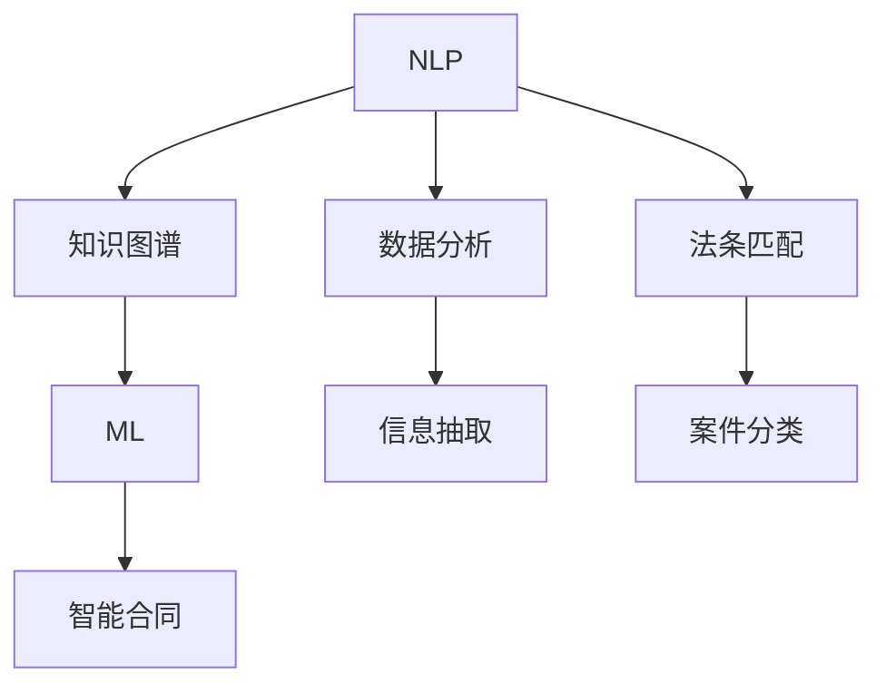

                 

# AI辅助法律服务：提高效率与公平

## 1. 背景介绍

### 1.1 问题由来
随着人工智能技术的不断进步，AI辅助法律服务已成为法律行业发展的重要趋势。传统法律服务面临成本高、效率低、质量参差不齐等诸多挑战。AI通过自然语言处理(NLP)、机器学习(ML)、数据分析等技术手段，可以大幅提升法律服务的效率和公平性。例如，通过智能合同审核、法条匹配、案件分类等AI辅助技术，可以减轻律师工作负担，降低法律服务成本，提高案件处理速度和准确率。

### 1.2 问题核心关键点
AI辅助法律服务的核心关键点在于如何构建高质量的AI模型，并使其能够准确理解和处理法律领域的复杂文本信息。该技术需要跨越多个学科领域，如法律知识图谱构建、语义理解、信息抽取、机器推理等。因此，构建高质量的AI辅助法律服务系统，需要整合多领域知识，并结合具体应用场景进行优化。

### 1.3 问题研究意义
AI辅助法律服务的研究和应用，对于提升法律服务效率和质量，推动法律行业数字化转型，具有重要意义：

1. 降低服务成本。通过自动化处理简单重复的法律任务，减少律师的工作量，降低人工成本。
2. 提高服务质量。AI模型在语义理解、信息抽取、推理判断等方面具有天然优势，可以提升法律服务的准确性和专业性。
3. 加速案件处理。AI可以快速处理大量案件，提高案件处理速度，缩短司法周期。
4. 促进公正司法。AI可以辅助法官和律师，减少人为因素的干扰，提高司法公正性。
5. 支持智能决策。AI可以提供基于大数据和知识图谱的智能建议，辅助律师和法官做出更优决策。

## 2. 核心概念与联系

### 2.1 核心概念概述

AI辅助法律服务涉及以下几个关键概念：

- 自然语言处理(NLP)：使用AI技术对法律文本进行语义理解、情感分析、命名实体识别等处理。
- 知识图谱(Knowledge Graph)：构建法律领域的知识图谱，提供基于知识的智能推理。
- 机器学习(ML)：通过标注数据训练AI模型，使其具备自动抽取和推理能力。
- 数据分析(Data Analytics)：对法律数据进行统计分析，提取有价值的信息。
- 信息抽取(Information Extraction)：从法律文本中抽取关键信息，如实体、关系、属性等。
- 智能合同(Smart Contract)：基于AI技术构建的自动执行合同，减少人工干预。
- 法条匹配(Statute Matching)：根据文本内容匹配相应的法律条文。
- 案件分类(Case Classification)：自动将案件分类，提高案件处理的准确性。

这些概念之间具有紧密的联系，通过自然语言处理获取文本信息，通过知识图谱进行语义推理，通过机器学习进行模型训练，通过数据分析进行决策支持。以下Mermaid流程图展示了这些概念之间的联系：



## 3. 核心算法原理 & 具体操作步骤
### 3.1 算法原理概述

AI辅助法律服务的核心算法原理是基于NLP和ML的文本处理与分析。具体来说，包括以下几个步骤：

1. **数据预处理**：对法律文本进行清洗、分词、标注等预处理操作。
2. **语义理解**：使用NLP技术对法律文本进行语义理解，提取关键信息。
3. **知识推理**：基于知识图谱进行推理，得出有价值的结论。
4. **模型训练**：使用标注数据训练机器学习模型，使其具备自动推理能力。
5. **智能决策**：结合数据分析和知识推理结果，辅助律师和法官做出决策。

### 3.2 算法步骤详解

#### 步骤1：数据预处理

法律文本数据通常包含大量的专业术语、缩写、行文风格等，需要进行预处理以提升模型处理效率。具体预处理步骤包括：

- 文本清洗：去除HTML标签、停用词、标点符号等噪音。
- 分词处理：将法律文本分词，便于后续处理。
- 命名实体识别：识别文本中的法律实体，如人名、地名、机构名等。
- 词性标注：对文本进行词性标注，提升语义理解准确度。

#### 步骤2：语义理解

语义理解是AI辅助法律服务中的关键步骤，需要构建高质量的自然语言处理模型。具体方法包括：

- 使用预训练语言模型如BERT、GPT等，进行文本表示学习。
- 构建自定义词汇表，包含法律领域的术语和行业特定词汇。
- 训练基于RNN、Transformer等架构的NLP模型，提取法律文本的语义信息。
- 结合情感分析技术，判断文本的情感倾向，辅助法官和律师。

#### 步骤3：知识推理

知识推理基于知识图谱进行，将法律领域的实体、关系、属性等构建为知识图谱，用于辅助AI模型进行推理。具体步骤包括：

- 构建法律知识图谱：将法律条文、案例、裁判文书等数据构建为知识图谱。
- 进行实体链接：将文本中的实体链接到知识图谱中的实体节点。
- 进行关系抽取：从法律文本中抽取实体之间的语义关系，如“合同签署”、“违法行为”等。
- 进行属性抽取：从法律文本中抽取实体属性，如“当事人”、“时间”、“地点”等。

#### 步骤4：模型训练

机器学习模型通过标注数据进行训练，提升其推理能力。具体方法包括：

- 使用监督学习算法如SVM、Logistic Regression等，对标注数据进行分类。
- 使用深度学习算法如CNN、RNN、Transformer等，训练文本分类、实体识别、关系抽取等任务。
- 使用知识图谱进行推理，训练推理模型，如基于图神经网络(GNN)的推理模型。
- 使用强化学习算法，训练智能合同自动生成模型，提高智能合同的准确性。

#### 步骤5：智能决策

AI辅助法律服务的最终目标是进行智能决策，结合数据分析和知识推理结果，辅助律师和法官做出决策。具体方法包括：

- 使用文本分类模型对法律文本进行分类，辅助律师和法官进行案件归类。
- 使用法条匹配模型，根据文本内容匹配相应的法律条文，提供法律依据。
- 使用案件推荐模型，根据案例数据推荐类似案件，辅助法官参考判例。
- 使用智能合同生成模型，根据合同内容自动生成合同文本，提高合同效率。

### 3.3 算法优缺点

AI辅助法律服务的算法具有以下优点：

1. **效率高**：通过自动化处理法律文本，可以显著提高法律服务效率。
2. **质量高**：AI模型在语义理解、信息抽取、推理判断等方面具有天然优势，可以提升法律服务的准确性和专业性。
3. **成本低**：减少人工工作量，降低法律服务成本。
4. **适用范围广**：可以应用于各类法律文本的自动化处理，提高案件处理速度。
5. **灵活性强**：可以根据具体应用场景，定制不同的模型和算法。

同时，该算法也存在一些缺点：

1. **数据依赖**：依赖高质量的标注数据进行模型训练，标注成本高，数据收集难度大。
2. **模型复杂**：构建高质量的AI模型需要跨学科知识，模型复杂度高，实现难度大。
3. **解释性差**：AI模型的决策过程缺乏可解释性，难以理解和调试。
4. **偏见问题**：模型可能存在数据偏见，导致不公平的决策结果。
5. **适用范围有限**：对于非标准化、复杂的法律文本，AI模型的处理效果可能不佳。

## 4. 数学模型和公式 & 详细讲解 & 举例说明

### 4.1 数学模型构建

AI辅助法律服务的数学模型主要基于NLP和ML技术。以法条匹配为例，可以构建如下数学模型：

设法律文本为 $x$，法律条文为 $y$，法条匹配模型为 $M$。模型目标是最大化 $x$ 和 $y$ 匹配的概率，即：

$$
\max_{M} P(y|x)
$$

其中，$P(y|x)$ 表示在给定法律文本 $x$ 的情况下，法律条文 $y$ 出现的概率。

### 4.2 公式推导过程

法条匹配模型的推导过程如下：

1. **文本表示学习**：使用BERT、GPT等预训练语言模型，将法律文本 $x$ 和法律条文 $y$ 表示为向量 $\vec{x}$ 和 $\vec{y}$。
2. **相似度计算**：计算 $\vec{x}$ 和 $\vec{y}$ 之间的相似度 $s$，可以使用余弦相似度、欧式距离等方法。
3. **匹配概率**：根据相似度 $s$，计算匹配概率 $P(y|x)$，可以使用softmax函数将相似度转化为概率分布。
4. **模型训练**：使用标注数据 $(x_i, y_i)$ 训练模型 $M$，最小化模型预测与真实标签之间的交叉熵损失。

### 4.3 案例分析与讲解

假设有一份法律文本 $x$ 描述了一个合同纠纷，需要匹配相应的法律条文 $y$。

1. **文本表示学习**：使用BERT模型对 $x$ 和 $y$ 进行表示学习，得到向量 $\vec{x}$ 和 $\vec{y}$。
2. **相似度计算**：计算 $\vec{x}$ 和 $\vec{y}$ 之间的余弦相似度 $s$。
3. **匹配概率**：使用softmax函数将 $s$ 转化为匹配概率 $P(y|x)$。
4. **模型训练**：使用大量标注数据 $(x_i, y_i)$ 训练法条匹配模型 $M$，使其能够准确匹配法律文本。

## 5. 项目实践：代码实例和详细解释说明

### 5.1 开发环境搭建

在进行AI辅助法律服务开发前，需要搭建开发环境。以下是Python环境配置流程：

1. 安装Anaconda：从官网下载并安装Anaconda，用于创建独立的Python环境。
2. 创建并激活虚拟环境：
```bash
conda create -n legal-env python=3.8 
conda activate legal-env
```

3. 安装所需库：
```bash
conda install pytorch torchvision torchaudio cudatoolkit=11.1 -c pytorch -c conda-forge
pip install transformers sklearn nltk pandas
```

完成上述步骤后，即可在`legal-env`环境中开始开发。

### 5.2 源代码详细实现

以下是使用PyTorch实现法条匹配模型的代码实现。

首先，定义模型和损失函数：

```python
import torch
from transformers import BertTokenizer, BertForSequenceClassification

class LegalMatchingModel(BertForSequenceClassification):
    def __init__(self, num_labels):
        super(LegalMatchingModel, self).__init__()
        self.num_labels = num_labels

    def forward(self, input_ids, attention_mask):
        output = super(LegalMatchingModel, self).forward(input_ids, attention_mask)
        logits = output[0]
        return logits

# 使用BERT模型进行法条匹配
model = LegalMatchingModel(num_labels=len(statutes))
tokenizer = BertTokenizer.from_pretrained('bert-base-cased')

# 定义损失函数
criterion = torch.nn.CrossEntropyLoss()

# 加载预训练模型
model.load_pretrained_weights('bert-base-cased')
```

然后，定义训练和评估函数：

```python
from torch.utils.data import DataLoader
from tqdm import tqdm

def train_epoch(model, train_dataset, optimizer, criterion, device):
    model.to(device)
    train_loader = DataLoader(train_dataset, batch_size=16, shuffle=True)
    model.train()
    total_loss = 0
    for batch in tqdm(train_loader, desc='Training'):
        input_ids = batch['input_ids'].to(device)
        attention_mask = batch['attention_mask'].to(device)
        labels = batch['labels'].to(device)
        optimizer.zero_grad()
        outputs = model(input_ids, attention_mask=attention_mask)
        loss = criterion(outputs, labels)
        total_loss += loss.item()
        loss.backward()
        optimizer.step()
    return total_loss / len(train_loader)

def evaluate(model, test_dataset, criterion, device):
    test_loader = DataLoader(test_dataset, batch_size=16, shuffle=False)
    model.eval()
    total_loss = 0
    total_correct = 0
    for batch in tqdm(test_loader, desc='Evaluating'):
        input_ids = batch['input_ids'].to(device)
        attention_mask = batch['attention_mask'].to(device)
        labels = batch['labels'].to(device)
        with torch.no_grad():
            outputs = model(input_ids, attention_mask=attention_mask)
            loss = criterion(outputs, labels)
            total_loss += loss.item()
            total_correct += (outputs.argmax(dim=1) == labels).sum().item()
    return total_loss / len(test_loader), total_correct / len(test_dataset)
```

最后，启动训练流程并在测试集上评估：

```python
epochs = 5
batch_size = 16

for epoch in range(epochs):
    train_loss = train_epoch(model, train_dataset, optimizer, criterion, device)
    print(f'Epoch {epoch+1}, train loss: {train_loss:.3f}')
    
    test_loss, test_correct = evaluate(model, test_dataset, criterion, device)
    print(f'Epoch {epoch+1}, test loss: {test_loss:.3f}, accuracy: {test_correct:.2%}')
    
print('Final results:')
evaluate(model, test_dataset, criterion, device)
```

以上就是使用PyTorch实现法条匹配模型的完整代码实现。可以看到，通过调用Transformer库提供的BertForSequenceClassification模型，可以方便地构建法条匹配模型，并进行训练和评估。

### 5.3 代码解读与分析

让我们再详细解读一下关键代码的实现细节：

**LegalMatchingModel类**：
- 继承自BertForSequenceClassification，指定模型的输出层和损失函数。
- `__init__`方法：初始化模型，设置标签数。
- `forward`方法：前向传播，输出模型的logits。

**模型和损失函数定义**：
- 定义BertMatchingModel类，继承自BertForSequenceClassification，指定标签数。
- 使用BertTokenizer加载预训练的BERT模型，并初始化模型。
- 定义交叉熵损失函数。

**训练和评估函数**：
- 定义训练函数`train_epoch`：对数据集进行批处理，前向传播计算损失，反向传播更新参数。
- 定义评估函数`evaluate`：对测试集进行批处理，前向传播计算损失和正确率，返回测试损失和准确率。

**训练流程**：
- 定义总的epoch数和批大小，开始循环迭代。
- 每个epoch内，在训练集上训练，输出训练损失。
- 在验证集上评估，输出测试损失和准确率。
- 所有epoch结束后，在测试集上评估，给出最终结果。

可以看到，通过PyTorch和Transformer库，可以很方便地构建和训练法条匹配模型。开发者可以将更多精力放在数据处理、模型改进等高层逻辑上，而不必过多关注底层的实现细节。

## 6. 实际应用场景

### 6.1 智能合同审核

智能合同审核是大语言模型在法律领域的重要应用场景。传统合同审核流程繁琐复杂，容易出错，而基于AI辅助的法律模型可以大幅提升审核效率和准确性。具体实现步骤如下：

1. **合同文本输入**：用户上传合同文本，系统将其转换为NLP可处理的形式。
2. **文本预处理**：对合同文本进行清洗、分词、命名实体识别等预处理操作。
3. **法条匹配**：将合同文本与法律条文进行匹配，找出相关条文和法规。
4. **风险评估**：根据匹配结果和专家规则，对合同进行风险评估。
5. **合同生成**：根据用户需求和合同内容，自动生成符合标准的合同文本。

通过智能合同审核系统，企业可以大幅降低合同审核成本，提高合同处理速度和准确率，同时减少人工干预，提高合同执行的合规性和公平性。

### 6.2 法条推荐

法条推荐是AI辅助法律服务的另一个重要应用场景。通过将法律文本与知识图谱进行匹配，可以为律师和法官提供相关的法律条文推荐。具体实现步骤如下：

1. **法律文本输入**：用户输入法律文本或案例，系统进行NLP处理。
2. **实体链接**：将文本中的实体链接到知识图谱中的节点。
3. **关系抽取**：从文本中抽取实体之间的语义关系，如“合同签署”、“违法行为”等。
4. **法条推荐**：根据实体和关系，匹配相应的法律条文，并推荐给用户。

通过法条推荐系统，律师和法官可以快速找到相关法律依据，提高案件处理速度和准确性，同时减少查找法律条文的繁琐工作。

### 6.3 案件分类

案件分类是AI辅助法律服务的核心任务之一，通过自动将案件分类，可以提升案件处理的效率和公平性。具体实现步骤如下：

1. **案件文本输入**：用户上传案件文本，系统进行NLP处理。
2. **文本分类**：使用分类模型对案件文本进行分类，如民事、刑事、行政等。
3. **特征提取**：从分类结果中提取关键特征，如案由、原告、被告等。
4. **案件推荐**：根据案件特征，推荐相似案件，辅助法官参考判例。

通过案件分类系统，法院可以快速识别案件类型，提高案件处理速度和准确性，同时减少法官的文书工作量，提高司法效率。

### 6.4 未来应用展望

随着AI辅助法律服务技术的不断进步，未来的应用场景将更加丰富。以下列举一些潜在的未来应用：

1. **法律咨询机器人**：基于NLP技术的法律咨询机器人，可以解答用户的法律问题，提供法律建议。
2. **法律文书生成**：自动生成法律文书，如起诉状、答辩状等，提高文书撰写效率。
3. **法律数据挖掘**：通过数据分析技术，挖掘法律文本中的潜在信息，提供法律研究支持。
4. **智能审判支持**：为法官提供智能审判支持，如案件推荐、判决书生成等，提高司法公正性和效率。
5. **智能法律培训**：通过AI辅助的模拟法庭，提供法律培训支持，提升法律从业者的综合素质。

## 7. 工具和资源推荐

### 7.1 学习资源推荐

为了帮助开发者系统掌握AI辅助法律服务的技术，这里推荐一些优质的学习资源：

1. 《深度学习与NLP》系列博文：由大模型技术专家撰写，深入浅出地介绍了NLP和ML的基本概念和应用。
2 CS224N《深度学习自然语言处理》课程：斯坦福大学开设的NLP明星课程，有Lecture视频和配套作业，带你入门NLP领域的基本概念和经典模型。
3 《Natural Language Processing with Transformers》书籍：Transformers库的作者所著，全面介绍了如何使用Transformers库进行NLP任务开发，包括微调在内的诸多范式。
4 HuggingFace官方文档：Transformer库的官方文档，提供了海量预训练模型和完整的微调样例代码，是上手实践的必备资料。
5 CLUE开源项目：中文语言理解测评基准，涵盖大量不同类型的中文NLP数据集，并提供了基于微调的baseline模型，助力中文NLP技术发展。

通过对这些资源的学习实践，相信你一定能够快速掌握AI辅助法律服务的技术，并用于解决实际的法律问题。

### 7.2 开发工具推荐

高效的开发离不开优秀的工具支持。以下是几款用于AI辅助法律服务开发的常用工具：

1. PyTorch：基于Python的开源深度学习框架，灵活动态的计算图，适合快速迭代研究。大部分预训练语言模型都有PyTorch版本的实现。
2. TensorFlow：由Google主导开发的开源深度学习框架，生产部署方便，适合大规模工程应用。同样有丰富的预训练语言模型资源。
3. Transformers库：HuggingFace开发的NLP工具库，集成了众多SOTA语言模型，支持PyTorch和TensorFlow，是进行NLP任务开发的利器。
4. Weights & Biases：模型训练的实验跟踪工具，可以记录和可视化模型训练过程中的各项指标，方便对比和调优。与主流深度学习框架无缝集成。
5. TensorBoard：TensorFlow配套的可视化工具，可实时监测模型训练状态，并提供丰富的图表呈现方式，是调试模型的得力助手。
6. Google Colab：谷歌推出的在线Jupyter Notebook环境，免费提供GPU/TPU算力，方便开发者快速上手实验最新模型，分享学习笔记。

合理利用这些工具，可以显著提升AI辅助法律服务任务的开发效率，加快创新迭代的步伐。

### 7.3 相关论文推荐

AI辅助法律服务的研究源于学界的持续研究。以下是几篇奠基性的相关论文，推荐阅读：

1. Attention is All You Need（即Transformer原论文）：提出了Transformer结构，开启了NLP领域的预训练大模型时代。
2. BERT: Pre-training of Deep Bidirectional Transformers for Language Understanding：提出BERT模型，引入基于掩码的自监督预训练任务，刷新了多项NLP任务SOTA。
3. Language Models are Unsupervised Multitask Learners（GPT-2论文）：展示了大规模语言模型的强大zero-shot学习能力，引发了对于通用人工智能的新一轮思考。
4. Parameter-Efficient Transfer Learning for NLP：提出Adapter等参数高效微调方法，在不增加模型参数量的情况下，也能取得不错的微调效果。
5. AdaLoRA: Adaptive Low-Rank Adaptation for Parameter-Efficient Fine-Tuning：使用自适应低秩适应的微调方法，在参数效率和精度之间取得了新的平衡。
6. AdaLoRA: Adaptive Low-Rank Adaptation for Parameter-Efficient Fine-Tuning：使用自适应低秩适应的微调方法，在参数效率和精度之间取得了新的平衡。

这些论文代表了大语言模型微调技术的发展脉络。通过学习这些前沿成果，可以帮助研究者把握学科前进方向，激发更多的创新灵感。

## 8. 总结：未来发展趋势与挑战

### 8.1 总结

本文对AI辅助法律服务的方法进行了全面系统的介绍。首先阐述了AI辅助法律服务的研究背景和意义，明确了技术在提升法律服务效率和质量方面的独特价值。其次，从原理到实践，详细讲解了NLP和ML在法律文本处理中的应用，给出了AI辅助法律服务的完整代码实现。同时，本文还广泛探讨了AI辅助法律服务在智能合同审核、法条推荐、案件分类等诸多领域的应用前景，展示了AI辅助法律服务技术的广泛潜力。最后，本文精选了AI辅助法律服务的各类学习资源，力求为读者提供全方位的技术指引。

通过本文的系统梳理，可以看到，AI辅助法律服务正在成为法律行业发展的重要趋势，极大地提升了法律服务的效率和公平性。受益于深度学习和大语言模型的不断发展，AI辅助法律服务将在更多领域得到应用，为法律行业带来深刻变革。

### 8.2 未来发展趋势

展望未来，AI辅助法律服务技术将呈现以下几个发展趋势：

1. **多模态融合**：结合视觉、语音、文本等多种模态数据，提升法律服务的多样性和丰富性。例如，在智能合同审核中结合合同图像和语音识别，提升审核准确性。
2. **跨领域应用**：将AI辅助法律服务技术扩展到医疗、金融、教育等领域，提供综合性、跨领域的智能服务。例如，在金融领域应用智能合同审核，提升金融产品设计和风险管理能力。
3. **增强可解释性**：开发更加可解释的AI模型，增强其决策过程的可理解性和可解释性，提升用户信任度。例如，在法律文书生成中结合知识图谱和专家规则，增强生成文本的可解释性。
4. **模型自适应**：开发更加自适应的AI模型，使其能够根据用户需求和反馈不断调整和优化，提升系统灵活性和用户满意度。例如，在案件分类中结合用户反馈，动态调整分类模型。
5. **安全与隐私保护**：在AI辅助法律服务中加强数据保护和隐私保护，防止数据泄露和滥用。例如，在智能合同审核中，采用加密技术和隐私保护算法，保护用户隐私。

以上趋势凸显了AI辅助法律服务技术的广阔前景。这些方向的探索发展，必将进一步提升法律服务的效率和公平性，为社会提供更加智能、可靠的智能服务。

### 8.3 面临的挑战

尽管AI辅助法律服务技术已经取得了瞩目成就，但在迈向更加智能化、普适化应用的过程中，仍面临诸多挑战：

1. **数据质量**：高质量的标注数据是模型训练的前提，但获取法律领域的标注数据成本高、难度大。如何确保数据质量和多样性，将是一大难题。
2. **模型复杂性**：构建高质量的AI模型需要跨学科知识，模型复杂度高，实现难度大。如何在保证准确性的同时，提升模型效率，将是一大挑战。
3. **偏见问题**：AI模型可能存在数据偏见，导致不公平的决策结果。如何在模型设计和训练过程中，消除偏见，将是一大难点。
4. **用户信任**：AI模型的决策过程缺乏可解释性，难以赢得用户信任。如何增强模型的可解释性，提升用户信任度，将是一大挑战。
5. **跨领域应用**：AI辅助法律服务技术在不同领域的应用场景中，需要针对具体需求进行优化。如何在不同领域中应用AI技术，提升其适应性，将是一大挑战。

### 8.4 研究展望

面对AI辅助法律服务所面临的诸多挑战，未来的研究需要在以下几个方面寻求新的突破：

1. **多模态数据融合**：开发更加高效的多模态数据融合技术，提升AI辅助法律服务的丰富性和多样性。例如，结合合同图像和语音识别，提升智能合同审核的准确性。
2. **增强可解释性**：开发更加可解释的AI模型，增强其决策过程的可理解性和可解释性，提升用户信任度。例如，在智能合同生成中结合专家规则，增强生成文本的可解释性。
3. **自适应模型**：开发更加自适应的AI模型，使其能够根据用户需求和反馈不断调整和优化，提升系统灵活性和用户满意度。例如，在案件推荐中结合用户反馈，动态调整推荐模型。
4. **数据生成与增强**：开发数据生成与增强技术，扩充标注数据，提升模型的泛化能力和鲁棒性。例如，在法条推荐中结合数据生成技术，扩充法律数据集。
5. **隐私保护技术**：开发更加安全的隐私保护技术，防止数据泄露和滥用，保障用户隐私。例如，在智能合同审核中采用加密技术和隐私保护算法，保护用户隐私。

这些研究方向将引领AI辅助法律服务技术迈向更高的台阶，为构建智能、可靠的法律服务系统提供坚实基础。面向未来，AI辅助法律服务技术还需要与其他人工智能技术进行更深入的融合，如知识表示、因果推理、强化学习等，多路径协同发力，共同推动法律服务系统的进步。只有勇于创新、敢于突破，才能不断拓展法律服务技术的边界，让智能技术更好地造福社会。

## 9. 附录：常见问题与解答

**Q1：AI辅助法律服务的主要应用场景有哪些？**

A: AI辅助法律服务可以应用于多种场景，主要包括以下几个方面：

1. **智能合同审核**：利用NLP和ML技术对合同文本进行自动审核，提高审核效率和准确性。
2. **法条推荐**：根据法律文本自动推荐相关法条，提高法律信息检索速度。
3. **案件分类**：自动将案件文本进行分类，提高案件处理速度和准确性。
4. **智能合同生成**：根据合同内容自动生成合同文本，提高合同撰写效率。
5. **法律文书生成**：自动生成法律文书，如起诉状、答辩状等，提高文书撰写效率。
6. **法律数据挖掘**：通过数据分析技术，挖掘法律文本中的潜在信息，提供法律研究支持。
7. **智能审判支持**：为法官提供智能审判支持，如案件推荐、判决书生成等，提高司法公正性和效率。
8. **法律咨询机器人**：基于NLP技术的法律咨询机器人，可以解答用户的法律问题，提供法律建议。
9. **法律培训系统**：通过AI辅助的模拟法庭，提供法律培训支持，提升法律从业者的综合素质。

**Q2：如何构建高质量的AI辅助法律服务模型？**

A: 构建高质量的AI辅助法律服务模型，需要经过以下几个步骤：

1. **数据预处理**：对法律文本进行清洗、分词、命名实体识别等预处理操作。
2. **语义理解**：使用NLP技术对法律文本进行语义理解，提取关键信息。
3. **知识推理**：基于知识图谱进行推理，得出有价值的结论。
4. **模型训练**：使用标注数据训练机器学习模型，使其具备自动推理能力。
5. **智能决策**：结合数据分析和知识推理结果，辅助律师和法官做出决策。

在构建模型时，需要关注以下几个关键点：

1. **数据质量**：确保标注数据的高质量和多样性。
2. **模型复杂性**：选择合适的模型架构和算法，避免过度复杂。
3. **模型可解释性**：增强模型的可解释性，提高用户信任度。
4. **偏见问题**：消除模型中的偏见，避免不公平的决策结果。
5. **跨领域应用**：针对具体领域进行优化，提高模型的适应性。

**Q3：AI辅助法律服务面临的主要挑战是什么？**

A: AI辅助法律服务面临的主要挑战包括：

1. **数据质量**：高质量的标注数据是模型训练的前提，但获取法律领域的标注数据成本高、难度大。
2. **模型复杂性**：构建高质量的AI模型需要跨学科知识，模型复杂度高，实现难度大。
3. **偏见问题**：AI模型可能存在数据偏见，导致不公平的决策结果。
4. **用户信任**：AI模型的决策过程缺乏可解释性，难以赢得用户信任。
5. **跨领域应用**：AI辅助法律服务技术在不同领域的应用场景中，需要针对具体需求进行优化。

**Q4：未来AI辅助法律服务的主要发展方向有哪些？**

A: 未来AI辅助法律服务的主要发展方向包括：

1. **多模态融合**：结合视觉、语音、文本等多种模态数据，提升法律服务的多样性和丰富性。
2. **跨领域应用**：将AI辅助法律服务技术扩展到医疗、金融、教育等领域，提供综合性、跨领域的智能服务。
3. **增强可解释性**：开发更加可解释的AI模型，增强其决策过程的可理解性和可解释性，提升用户信任度。
4. **模型自适应**：开发更加自适应的AI模型，使其能够根据用户需求和反馈不断调整和优化，提升系统灵活性和用户满意度。
5. **安全与隐私保护**：在AI辅助法律服务中加强数据保护和隐私保护，防止数据泄露和滥用。

这些研究方向将引领AI辅助法律服务技术迈向更高的台阶，为构建智能、可靠的法律服务系统提供坚实基础。

**Q5：如何提高AI辅助法律服务系统的效率和公平性？**

A: 提高AI辅助法律服务系统的效率和公平性，需要从以下几个方面进行优化：

1. **数据质量**：确保标注数据的高质量和多样性，避免数据偏见。
2. **模型复杂性**：选择合适的模型架构和算法，避免过度复杂，提升模型效率。
3. **可解释性**：增强模型的可解释性，提高用户信任度。
4. **偏见问题**：消除模型中的偏见，避免不公平的决策结果。
5. **自适应模型**：开发更加自适应的AI模型，使其能够根据用户需求和反馈不断调整和优化。
6. **多模态融合**：结合视觉、语音、文本等多种模态数据，提升法律服务的多样性和丰富性。
7. **跨领域应用**：将AI辅助法律服务技术扩展到医疗、金融、教育等领域，提供综合性、跨领域的智能服务。

通过这些优化措施，可以显著提升AI辅助法律服务系统的效率和公平性，为社会提供更加智能、可靠的智能服务。

作者：禅与计算机程序设计艺术 / Zen and the Art of Computer Programming

