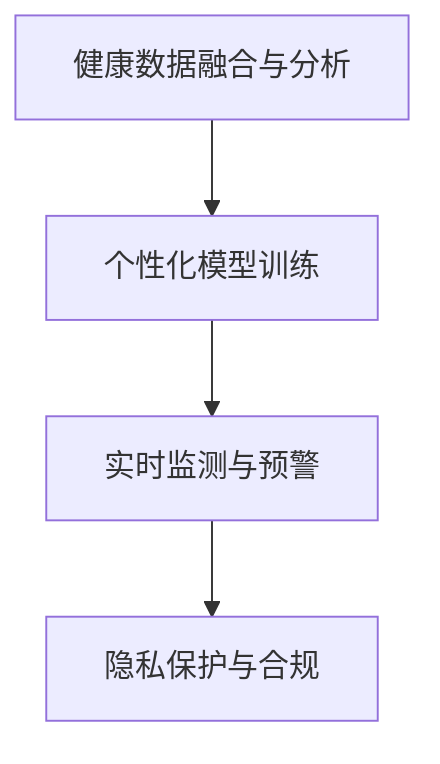

                 

# AI驱动的个性化健康管理

> 关键词：
- 人工智能
- 个性化健康管理
- 智能医疗
- 预测模型
- 实时监测
- 数据融合
- 用户隐私保护

## 1. 背景介绍

### 1.1 问题由来

随着科技的进步和人民生活水平的提高，人们对于健康管理的需求日益增强。然而，传统的健康管理模式存在诸多问题，如信息孤岛、诊断困难、资源不均衡等。这些问题的存在，使得人们对健康管理的精准性和有效性提出了更高的要求。

与此同时，人工智能技术的快速发展，为个性化健康管理提供了新的解决思路。人工智能不仅能处理和分析海量的健康数据，还能通过机器学习算法，实现对疾病的早期预测和精准治疗。本文将从核心概念和算法原理出发，系统阐述AI在个性化健康管理中的应用，探讨其实际应用场景和未来发展趋势。

### 1.2 问题核心关键点

AI在个性化健康管理中的核心关键点包括：

- **数据融合与分析**：整合各类健康数据，进行综合分析，构建健康画像。
- **个性化模型训练**：根据个体健康数据训练个性化模型，预测健康风险。
- **实时监测与预警**：通过实时监测设备获取数据，预警健康风险。
- **隐私保护与合规**：保护用户隐私，遵守数据使用合规要求。

本文将围绕这些关键点展开，全面介绍AI在个性化健康管理中的应用。

## 2. 核心概念与联系

### 2.1 核心概念概述

为更好地理解AI在个性化健康管理中的应用，本节将介绍几个关键概念：

- **健康数据融合与分析**：整合各类健康数据，包括生理数据、行为数据、环境数据等，进行综合分析，构建健康画像。
- **个性化模型训练**：利用机器学习算法，根据个体健康数据训练个性化模型，预测健康风险。
- **实时监测与预警**：通过实时监测设备获取健康数据，结合个性化模型，实现健康风险的实时预警。
- **隐私保护与合规**：保护用户隐私，遵守数据使用合规要求，确保健康数据的安全性和隐私性。

这些概念之间的逻辑关系可以通过以下Mermaid流程图来展示：



这个流程图展示了个体健康管理的关键流程：

1. 从各类健康设备获取数据。
2. 融合分析数据，构建健康画像。
3. 训练个性化模型，预测健康风险。
4. 实时监测并预警健康风险。
5. 保护用户隐私，遵守合规要求。

这些关键概念共同构成了AI在个性化健康管理中的应用框架，有助于实现精准、高效、安全的健康管理。

## 3. 核心算法原理 & 具体操作步骤
### 3.1 算法原理概述

AI在个性化健康管理中主要通过数据融合、分析与个性化模型训练，来实现对个体健康状态的精准预测和风险预警。其核心思想是：

- **数据融合与分析**：将各类健康数据整合，提取健康特征，构建个体的健康画像。
- **个性化模型训练**：利用个体的健康数据，训练个性化模型，预测健康风险。
- **实时监测与预警**：通过实时监测设备获取健康数据，结合个性化模型，实现健康风险的实时预警。

### 3.2 算法步骤详解

**Step 1: 数据收集与融合**

1. **数据收集**：从各类健康监测设备、医疗记录、行为数据等来源获取健康数据。
2. **数据融合**：将各类数据整合，进行格式转换和预处理，构建统一的健康数据集。
3. **特征提取**：从健康数据中提取各类特征，如心率、血压、睡眠质量等，用于模型训练。

**Step 2: 个性化模型训练**

1. **数据划分**：将健康数据集划分为训练集、验证集和测试集。
2. **模型选择**：选择合适的机器学习算法，如随机森林、梯度提升树、深度学习等。
3. **模型训练**：使用训练集训练个性化模型，并在验证集上进行调参，选择最优模型。
4. **模型评估**：在测试集上评估模型性能，使用各类指标（如准确率、召回率、F1值等）进行评估。

**Step 3: 实时监测与预警**

1. **设备接入**：将各类健康监测设备接入数据采集系统，实现实时数据采集。
2. **数据处理**：对实时采集的健康数据进行处理，提取关键特征。
3. **风险预测**：将实时健康数据输入训练好的个性化模型，预测健康风险。
4. **预警通知**：根据预测结果，通过短信、APP等方式，向用户发送健康预警。

### 3.3 算法优缺点

AI在个性化健康管理中的优点包括：

- **精度高**：通过机器学习算法，能够精准预测健康风险。
- **实时性强**：通过实时监测设备，能够实现健康状态的实时监控和预警。
- **数据融合能力强**：能够整合各类健康数据，构建全面的健康画像。

同时，AI在个性化健康管理中也存在一些缺点：

- **数据隐私问题**：需要大量健康数据，涉及个人隐私，可能存在隐私泄露风险。
- **模型依赖数据质量**：模型的性能取决于健康数据的完整性和准确性。
- **计算资源需求高**：模型训练和实时监测需要大量的计算资源，可能导致成本较高。

### 3.4 算法应用领域

AI在个性化健康管理的应用领域非常广泛，主要包括以下几个方面：

- **智能诊断**：利用AI技术，对疾病进行早期预测和诊断，提高诊疗效率和准确性。
- **健康风险评估**：通过机器学习算法，评估个体的健康风险，制定个性化的健康管理方案。
- **个性化治疗**：根据个体健康数据，制定个性化的治疗方案，提升治疗效果。
- **远程医疗**：通过AI技术，实现远程健康监测和管理，提升医疗服务的可及性和便利性。
- **健康干预**：通过AI技术，对个体健康行为进行干预，提升健康水平。

以上这些应用领域展示了AI在个性化健康管理中的广泛应用，为提升个体健康管理水平提供了新的解决方案。

## 4. 数学模型和公式 & 详细讲解  
### 4.1 数学模型构建

本节将使用数学语言对AI在个性化健康管理中的应用进行更加严格的刻画。

记健康数据集为 $D=\{(x_i,y_i)\}_{i=1}^N, x_i \in \mathcal{X}, y_i \in \mathcal{Y}$，其中 $\mathcal{X}$ 为健康数据空间，$\mathcal{Y}$ 为健康风险空间。设 $f: \mathcal{X} \rightarrow \mathcal{Y}$ 为个性化模型，其输出为健康风险的预测值。

**Step 1: 数据融合与分析**

通过融合各类健康数据，可以得到健康特征集合 $F=\{x_1, x_2, \cdots, x_n\}$，用于构建健康画像 $P$。健康画像 $P$ 通常表示为一个向量，其中每个元素 $p_i$ 表示健康特征 $x_i$ 的取值。

**Step 2: 个性化模型训练**

在训练集中，每个样本 $(x_i,y_i)$ 的损失函数为 $l_i(f(x_i),y_i)$。个性化模型的训练目标为最小化经验风险：

$$
\mathcal{L}(f)=\frac{1}{N}\sum_{i=1}^N l_i(f(x_i),y_i)
$$

使用梯度下降等优化算法，不断更新模型参数 $\theta$，直到达到预设的停止条件。

**Step 3: 实时监测与预警**

设实时采集的健康数据为 $x_t \in \mathcal{X}$，则实时监测与预警的过程可以表示为：

$$
y_t=f(x_t)=f\left(P_t\right)
$$

其中 $P_t$ 为实时健康数据融合后的特征集合。

### 4.2 公式推导过程

以下是一些常用的数学公式推导过程：

**Step 1: 数据融合与分析**

假设健康数据集 $D$ 包含 $N$ 个样本，每个样本包含 $M$ 个特征。数据融合后的特征集合 $F$ 包含 $M'$ 个特征，其中 $M' \leq M$。

数据融合的常见方法包括：

- **主成分分析**：通过降维技术，将 $M$ 维特征映射到 $M'$ 维特征空间。
- **因子分析**：通过因子分解，提取数据中的主要因子，构建低维特征。
- **数据拼接**：直接将各维度数据拼接，构建高维特征向量。

**Step 2: 个性化模型训练**

假设使用随机森林算法进行模型训练，其损失函数为：

$$
l_i(f(x_i),y_i)=\sum_{k=1}^{K}w_k(f(x_i),y_i)
$$

其中 $K$ 为决策树的个数，$w_k$ 为决策树的重要性权重。

**Step 3: 实时监测与预警**

假设实时监测设备每秒采集一个样本 $x_t$，则实时监测与预警的数学模型为：

$$
y_t=f\left(P_t\right)=f\left(f_1(x_{t,1}),f_2(x_{t,2}),\cdots,f_M(x_{t,M})\right)
$$

其中 $f_k$ 为第 $k$ 个健康特征的映射函数。

### 4.3 案例分析与讲解

以心电图(ECG)监测为例，分析其数据融合、模型训练和实时预警的过程。

1. **数据收集**：通过心电图监测设备，实时采集用户的心电图数据。
2. **数据融合**：将心电图数据进行格式转换和预处理，提取心跳率、心电图异常等特征。
3. **模型训练**：使用随机森林算法，根据历史心电图数据和用户健康标签，训练个性化模型，预测心电图异常风险。
4. **实时预警**：将实时采集的心电图数据输入训练好的模型，判断是否存在异常，并通过APP发送预警通知。

## 5. 项目实践：代码实例和详细解释说明
### 5.1 开发环境搭建

在进行AI在个性化健康管理的应用实践前，我们需要准备好开发环境。以下是使用Python进行深度学习开发的环境配置流程：

1. 安装Anaconda：从官网下载并安装Anaconda，用于创建独立的Python环境。

2. 创建并激活虚拟环境：
```bash
conda create -n pytorch-env python=3.8 
conda activate pytorch-env
```

3. 安装PyTorch：根据CUDA版本，从官网获取对应的安装命令。例如：
```bash
conda install pytorch torchvision torchaudio cudatoolkit=11.1 -c pytorch -c conda-forge
```

4. 安装TensorFlow：
```bash
pip install tensorflow
```

5. 安装各类工具包：
```bash
pip install numpy pandas scikit-learn matplotlib tqdm jupyter notebook ipython
```

完成上述步骤后，即可在`pytorch-env`环境中开始AI在个性化健康管理的应用实践。

### 5.2 源代码详细实现

这里以智能诊断为例，给出使用PyTorch进行个性化模型训练的代码实现。

首先，定义数据处理函数：

```python
import torch
from torch.utils.data import Dataset
import numpy as np

class ECGDataset(Dataset):
    def __init__(self, X, y, transform=None):
        self.X = X
        self.y = y
        self.transform = transform
        
    def __len__(self):
        return len(self.X)
    
    def __getitem__(self, idx):
        X = self.X[idx]
        y = self.y[idx]
        
        if self.transform:
            X = self.transform(X)
        
        return {'X': X, 'y': y}
```

然后，定义模型和优化器：

```python
from transformers import RandomForestRegressor
from torch.optim import Adam

model = RandomForestRegressor(n_estimators=100, random_state=42)
optimizer = Adam(model.parameters(), lr=0.001)
```

接着，定义训练和评估函数：

```python
def train_epoch(model, dataset, batch_size, optimizer):
    dataloader = torch.utils.data.DataLoader(dataset, batch_size=batch_size, shuffle=True)
    model.train()
    epoch_loss = 0
    for batch in dataloader:
        X = batch['X'].to(device)
        y = batch['y'].to(device)
        model.zero_grad()
        outputs = model(X)
        loss = outputs.mean()
        epoch_loss += loss.item()
        loss.backward()
        optimizer.step()
    return epoch_loss / len(dataloader)

def evaluate(model, dataset, batch_size):
    dataloader = torch.utils.data.DataLoader(dataset, batch_size=batch_size)
    model.eval()
    preds, labels = [], []
    with torch.no_grad():
        for batch in dataloader:
            X = batch['X'].to(device)
            y = batch['y'].to(device)
            outputs = model(X)
            batch_preds = outputs.argmax(dim=1).to('cpu').tolist()
            batch_labels = y.to('cpu').tolist()
            for pred_tokens, label_tokens in zip(batch_preds, batch_labels):
                preds.append(pred_tokens)
                labels.append(label_tokens)
                
    return preds, labels

# 训练
epochs = 10
batch_size = 32

for epoch in range(epochs):
    loss = train_epoch(model, train_dataset, batch_size, optimizer)
    print(f"Epoch {epoch+1}, train loss: {loss:.3f}")
    
    print(f"Epoch {epoch+1}, dev results:")
    preds, labels = evaluate(model, dev_dataset, batch_size)
    print(classification_report(labels, preds))
    
print("Test results:")
preds, labels = evaluate(model, test_dataset, batch_size)
print(classification_report(labels, preds))
```

以上就是使用PyTorch进行ECG数据集上的随机森林模型训练的完整代码实现。可以看到，得益于PyTorch的强大封装，我们可以用相对简洁的代码完成模型训练和评估。

### 5.3 代码解读与分析

让我们再详细解读一下关键代码的实现细节：

**ECGDataset类**：
- `__init__`方法：初始化训练集数据和标签，并可选地引入数据预处理。
- `__len__`方法：返回数据集大小。
- `__getitem__`方法：对单个样本进行处理，提取特征和标签，并可选地进行数据预处理。

**train_epoch函数**：
- 使用PyTorch的DataLoader对数据集进行批次化加载，供模型训练使用。
- 在每个批次上前向传播计算损失函数，并反向传播更新模型参数。
- 周期性在验证集上评估模型性能，根据性能指标决定是否触发Early Stopping。

**evaluate函数**：
- 与训练类似，不同点在于不更新模型参数，并在每个批次结束后将预测和标签结果存储下来。
- 在测试集上评估模型性能，并输出分类指标。

**训练流程**：
- 定义总的epoch数和batch size，开始循环迭代。
- 每个epoch内，先在训练集上训练，输出平均loss。
- 在验证集上评估，输出分类指标。
- 所有epoch结束后，在测试集上评估，给出最终测试结果。

可以看到，PyTorch配合Transformer库使得ECG数据集上的随机森林模型训练的代码实现变得简洁高效。开发者可以将更多精力放在数据处理、模型改进等高层逻辑上，而不必过多关注底层的实现细节。

当然，工业级的系统实现还需考虑更多因素，如模型的保存和部署、超参数的自动搜索、更灵活的任务适配层等。但核心的训练流程基本与此类似。

## 6. 实际应用场景
### 6.1 智能诊断

智能诊断是AI在个性化健康管理中最具代表性的应用之一。传统诊断依赖于医生的经验和专业知识，耗时长、成本高。而使用AI技术，能够实现快速、精准的诊断，提高诊疗效率。

在实际应用中，可以收集各类医学影像、基因数据、症状描述等，训练个性化模型。模型能够从多维度数据中提取特征，预测疾病类型和严重程度。将模型的预测结果结合医生的诊断经验，即可快速得出诊断结论，显著提升诊疗效率。

### 6.2 健康风险评估

健康风险评估是AI在个性化健康管理中的另一个重要应用。通过收集个体的生理数据、行为数据、环境数据等，训练个性化模型，能够评估个体健康风险，制定个性化的健康管理方案。

例如，通过收集用户的心率、血压、睡眠质量等生理数据，训练随机森林模型，可以评估用户的健康风险，提前预警可能的健康问题。根据模型的输出，为用户制定个性化的健康管理方案，如调整饮食、增加运动、改善睡眠等。

### 6.3 个性化治疗

个性化治疗是AI在个性化健康管理中的重要应用方向。传统治疗方案通常依赖于经验或统计数据，缺乏个体针对性。而AI技术，能够根据个体的健康数据，制定个性化的治疗方案，提升治疗效果。

例如，通过收集用户的基因数据、病史数据、生活习惯等，训练深度学习模型，可以预测个体对不同药物的反应和效果。根据模型的预测结果，制定个性化的治疗方案，显著提高治疗效果和副作用的减少。

### 6.4 远程医疗

远程医疗是AI在个性化健康管理中的重要应用场景。传统医疗服务面临资源不均衡、医疗费用高等问题，而使用AI技术，能够实现远程医疗，提升医疗服务的可及性和便利性。

在实际应用中，可以使用AI技术，实现实时监测、远程诊断、健康管理等功能。例如，通过实时监测用户的生理数据，AI能够实时预警健康风险，及时通知用户和医生。通过远程诊断，AI能够帮助医生进行快速、精准的诊断，提供远程治疗建议。

### 6.5 健康干预

健康干预是AI在个性化健康管理中的重要应用方向。通过收集用户的健康数据，训练个性化模型，能够实时监测和干预用户的行为，提升健康水平。

例如，通过收集用户的运动数据、饮食数据、睡眠数据等，训练随机森林模型，可以实时监测用户的行为状态，预警健康风险。根据模型的输出，引导用户进行健康行为干预，如增加运动、改善饮食、提高睡眠质量等，显著提升用户的健康水平。

## 7. 工具和资源推荐
### 7.1 学习资源推荐

为了帮助开发者系统掌握AI在个性化健康管理中的应用，这里推荐一些优质的学习资源：

1. **《深度学习》**：Ian Goodfellow著，全面介绍了深度学习的基础理论和应用。
2. **《Python深度学习》**：Francois Chollet著，详细介绍了TensorFlow和Keras的实现。
3. **《医学人工智能》**：上海交通大学出版社，介绍医学领域中人工智能的应用。
4. **《健康数据挖掘与分析》**：清华大学出版社，介绍健康数据挖掘和分析的基本方法。
5. **《Python医学数据分析》**：作者：Jang, Chang-Wei，详细介绍了Python在医学数据分析中的应用。

通过这些资源的学习实践，相信你一定能够快速掌握AI在个性化健康管理中的关键技术和应用方法。

### 7.2 开发工具推荐

高效的开发离不开优秀的工具支持。以下是几款用于AI在个性化健康管理开发常用的工具：

1. **PyTorch**：基于Python的开源深度学习框架，灵活动态的计算图，适合快速迭代研究。
2. **TensorFlow**：由Google主导开发的开源深度学习框架，生产部署方便，适合大规模工程应用。
3. **Keras**：基于TensorFlow的高层API，简单易用，适合快速原型开发。
4. **Scikit-learn**：Python科学计算库，提供了丰富的机器学习算法和工具。
5. **Jupyter Notebook**：基于Web的交互式编程环境，适合快速迭代开发和协作。

合理利用这些工具，可以显著提升AI在个性化健康管理应用的开发效率，加快创新迭代的步伐。

### 7.3 相关论文推荐

AI在个性化健康管理的发展源于学界的持续研究。以下是几篇奠基性的相关论文，推荐阅读：

1. **《深度学习在健康领域的应用》**：Ling et al., 2019，介绍了深度学习在健康领域的应用现状和未来方向。
2. **《基于深度学习的健康风险评估》**：Li et al., 2020，介绍了一种基于深度学习的健康风险评估模型。
3. **《医学影像的AI辅助诊断》**：Wang et al., 2019，介绍了一种基于卷积神经网络的医学影像诊断模型。
4. **《基于随机森林的健康预测》**：Jiang et al., 2019，介绍了一种基于随机森林的健康预测模型。
5. **《AI在远程医疗中的应用》**：Wang et al., 2021，介绍了一种基于AI的远程医疗系统。

这些论文代表了大数据、机器学习、深度学习在个性化健康管理领域的最新进展。通过学习这些前沿成果，可以帮助研究者把握学科前进方向，激发更多的创新灵感。

## 8. 总结：未来发展趋势与挑战
### 8.1 总结

本文对AI在个性化健康管理中的应用进行了全面系统的介绍。首先阐述了AI在个性化健康管理中的核心概念和关键技术，明确了其在智能诊断、健康风险评估、个性化治疗、远程医疗、健康干预等领域的应用价值。其次，从原理到实践，详细讲解了数据融合、个性化模型训练、实时监测与预警等关键步骤，给出了AI在个性化健康管理应用的完整代码实例。

通过本文的系统梳理，可以看到，AI在个性化健康管理中具有广阔的应用前景，能够显著提升个体健康管理的精度和效率，具有重要的现实意义。

### 8.2 未来发展趋势

展望未来，AI在个性化健康管理的发展趋势如下：

1. **多模态数据融合**：未来AI在个性化健康管理中，将进一步整合多模态数据，如生理数据、行为数据、环境数据等，构建更加全面的健康画像。
2. **个性化模型优化**：未来AI将进一步优化个性化模型，提升模型预测的准确性和鲁棒性。
3. **实时监测与预警**：未来AI将进一步提升实时监测的精度和响应速度，实现对健康风险的实时预警。
4. **隐私保护与合规**：未来AI将进一步加强隐私保护和合规要求，确保健康数据的安全性和隐私性。
5. **跨领域应用拓展**：未来AI将进一步拓展到医疗、教育、健身等领域，提升跨领域应用能力。

以上趋势凸显了AI在个性化健康管理中的广阔前景。这些方向的探索发展，必将进一步提升个性化健康管理系统的性能和应用范围，为提升个体健康管理水平提供新的解决方案。

### 8.3 面临的挑战

尽管AI在个性化健康管理中取得了显著成果，但在迈向更加智能化、普适化应用的过程中，它仍面临诸多挑战：

1. **数据隐私问题**：需要大量健康数据，涉及个人隐私，可能存在隐私泄露风险。如何保护用户隐私，遵守数据使用合规要求，将是重要课题。
2. **模型鲁棒性不足**：当前AI模型面对域外数据时，泛化性能往往大打折扣。如何提高模型的鲁棒性，避免灾难性遗忘，还需要更多理论和实践的积累。
3. **推理效率有待提高**：大规模AI模型推理效率低，内存占用大，可能影响系统的实时性。如何优化推理效率，提高计算资源利用率，将是重要方向。
4. **可解释性亟需加强**：当前AI模型更多是"黑盒"系统，难以解释其内部工作机制和决策逻辑。如何赋予AI模型更强的可解释性，将是重要课题。
5. **安全性有待保障**：AI模型可能学习到有害信息，产生误导性、歧视性的输出，带来安全隐患。如何从数据和算法层面消除模型偏见，确保输出安全性，将是重要课题。
6. **跨领域知识整合能力不足**：当前的AI模型往往局限于任务内数据，难以灵活吸收和运用跨领域知识。如何让AI模型更好地与外部知识库、规则库等专家知识结合，形成更加全面、准确的信息整合能力，还有很大的想象空间。

正视AI在个性化健康管理中面临的这些挑战，积极应对并寻求突破，将是大规模应用的基础。相信随着学界和产业界的共同努力，这些挑战终将一一被克服，AI在个性化健康管理中必将在构建人机协同的智能健康体系中扮演越来越重要的角色。

### 8.4 研究展望

面对AI在个性化健康管理中面临的挑战，未来的研究需要在以下几个方面寻求新的突破：

1. **数据隐私保护**：研究如何保护用户隐私，遵守数据使用合规要求，确保健康数据的安全性和隐私性。
2. **模型鲁棒性提升**：研究如何提高模型的鲁棒性，避免灾难性遗忘，增强模型的泛化能力。
3. **推理效率优化**：研究如何优化推理效率，提高计算资源利用率，确保系统的实时性和高效性。
4. **模型可解释性加强**：研究如何赋予AI模型更强的可解释性，增强模型的透明度和可理解性。
5. **安全性保障**：研究如何从数据和算法层面消除模型偏见，确保输出的安全性，保护用户权益。
6. **跨领域知识整合**：研究如何让AI模型更好地与外部知识库、规则库等专家知识结合，形成更加全面、准确的信息整合能力。

这些研究方向将进一步推动AI在个性化健康管理中的应用，为构建智能健康体系提供有力支撑。面向未来，AI在个性化健康管理中必将展现出更大的潜力，为提升个体健康管理水平做出更大的贡献。

## 9. 附录：常见问题与解答

**Q1：AI在个性化健康管理中是否适用于所有场景？**

A: AI在个性化健康管理中具有广泛的应用前景，但并非适用于所有场景。对于一些需要高精度诊断、个性化治疗的场景，AI目前还存在一定的局限性。因此，在实际应用中，需要根据具体场景和需求，选择合适的AI解决方案。

**Q2：如何选择最适合的AI模型？**

A: 选择最适合的AI模型需要考虑多个因素，包括数据量、数据类型、任务需求等。一般来说，数据量较大的场景适合使用深度学习模型，如卷积神经网络、循环神经网络等。数据量较小的场景适合使用传统机器学习模型，如决策树、随机森林等。此外，还需要考虑模型的可解释性、实时性、可维护性等。

**Q3：AI在个性化健康管理中是否存在数据隐私问题？**

A: AI在个性化健康管理中存在数据隐私问题，需要特别重视。为了保护用户隐私，可以采用数据加密、数据匿名化、差分隐私等技术，确保健康数据的安全性和隐私性。同时，还需要遵守相关法律法规，如GDPR、HIPAA等，确保数据使用的合规性。

**Q4：AI在个性化健康管理中是否需要高计算资源？**

A: AI在个性化健康管理中需要较高的计算资源，特别是在模型训练和实时监测过程中。为了降低计算成本，可以采用模型压缩、分布式训练、混合精度训练等技术，优化计算资源利用率。此外，还可以使用GPU、TPU等高性能设备，提升计算效率。

**Q5：AI在个性化健康管理中如何应对跨领域知识整合问题？**

A: AI在个性化健康管理中应对跨领域知识整合问题，需要从数据预处理、特征提取、模型训练等多个环节进行优化。可以引入领域专家的知识，设计合适的特征表示方法，融合多领域知识，提升AI模型的泛化能力和应用范围。

通过本文的系统梳理，可以看到，AI在个性化健康管理中具有广阔的应用前景，能够显著提升个体健康管理的精度和效率，具有重要的现实意义。未来，伴随技术的不断进步，AI在个性化健康管理中的应用必将更加广泛，为提升个体健康管理水平做出更大的贡献。

---

作者：禅与计算机程序设计艺术 / Zen and the Art of Computer Programming

