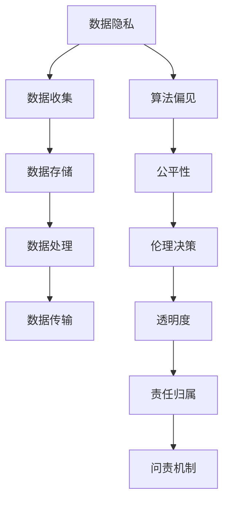

                 

# AI驱动的创新：人类计算在商业中的道德考虑因素与应用前景预测分析

> 关键词：人工智能,人类计算,商业应用,道德伦理,数据隐私,技术创新

## 1. 背景介绍

### 1.1 问题由来

在数字化和智能化的时代浪潮中，人工智能（AI）已经成为商业和科技创新的重要推动力。人类计算，即利用计算技术来模拟、延伸人类智能的过程，在这个过程中占据了关键地位。从数据分析、模式识别到决策辅助，AI系统在各个商业领域中展现了强大的应用潜力。然而，随着AI技术的不断深入，商业应用中不可避免地会出现一些道德伦理问题。

例如，数据隐私和安全问题。企业在使用AI进行商业决策时，往往会收集、处理大量个人数据。如果这些数据处理不当，可能会造成隐私泄露、数据滥用甚至商业欺诈。此外，算法偏见问题也引发了广泛关注。如果AI模型在训练过程中受到数据偏见的影响，可能会在商业应用中产生歧视性结果，对不同群体造成不公平待遇。这些问题不仅损害了消费者的利益，也威胁到了社会的公平正义。

### 1.2 问题核心关键点

为了深入探讨这些问题，以下将围绕几个核心关键点展开：

- **数据隐私与安全**：企业如何合法、合规地处理用户数据，避免隐私泄露。
- **算法偏见与公平性**：如何确保AI模型不带有偏见，公平地对待不同群体。
- **伦理决策与透明度**：如何赋予AI决策以道德逻辑，并提高模型的透明度。
- **责任归属与问责机制**：如何明确AI决策的责任主体，确保问责制的建立。

## 2. 核心概念与联系

### 2.1 核心概念概述

为更好地理解这些关键点，首先介绍几个核心概念：

- **人工智能（AI）**：利用计算机技术模拟、延伸人类智能的过程。包括机器学习、深度学习、自然语言处理等子领域。
- **人类计算**：将人类思维与计算机算法结合起来，以提高计算效率和智能水平。例如，利用人工智能来处理复杂决策、优化商业流程。
- **数据隐私与安全**：保护个人信息，避免数据被未授权访问或滥用。
- **算法偏见**：AI模型由于训练数据的不平衡或模型结构设计不当，可能产生的对特定群体的歧视性结果。
- **伦理决策**：利用伦理逻辑指导AI决策，确保其符合社会价值和道德标准。
- **透明度**：AI决策过程的可解释性和可审计性。
- **责任归属与问责机制**：明确AI决策的责任主体，建立健全的责任追究机制。

这些概念构成了AI商业应用的道德和法律框架，需要在技术实践和商业策略中加以考虑。

### 2.2 核心概念原理和架构的 Mermaid 流程图



这个流程图展示了数据从收集到应用的全过程，以及各个环节中需要注意的伦理问题。

## 3. 核心算法原理 & 具体操作步骤

### 3.1 算法原理概述

AI驱动的商业应用中，数据隐私和安全是关键考虑因素。算法偏见与公平性问题则在决策过程中起着决定性作用。伦理决策和透明度确保了AI系统的道德可接受性。责任归属和问责机制则为这些系统的可持续运行提供了保障。

以下是各个核心概念的算法原理概述：

- **数据隐私与安全**：利用加密技术、匿名化处理等手段，保护用户数据不被未授权访问或滥用。例如，在数据传输过程中采用SSL/TLS协议加密，存储时使用哈希函数进行数据加密。
- **算法偏见与公平性**：通过公平性检测算法，如De-biasing算法，识别并消除数据和模型中的偏见。使用随机权重采样等方法，确保模型在多族群中的公平性。
- **伦理决策**：在模型决策中加入伦理约束条件，如利用公平性算法和伦理约束优化模型训练。利用可解释性模型，提高决策过程的透明度。
- **透明度**：利用可解释性AI技术，如特征重要性分析、决策树可视化等，提高模型的透明度。确保用户和监管者能够理解模型的工作原理。
- **责任归属与问责机制**：在AI决策中加入责任标记，记录决策依据和过程。建立问责机制，确保责任归属明确，便于监督和问责。

### 3.2 算法步骤详解

以下详细阐述各个算法步骤，以及其具体操作步骤：

#### 数据隐私与安全

**Step 1: 数据收集与匿名化**
- 收集用户数据时，采用匿名化处理，避免收集敏感个人信息。
- 使用加密技术保护数据传输过程，确保数据不被截获或篡改。

**Step 2: 数据存储与访问控制**
- 在数据存储时，使用哈希函数进行加密，防止数据被未授权访问。
- 设置严格的访问控制策略，仅授权员工可以访问敏感数据。

**Step 3: 数据处理与数据最小化**
- 仅收集与业务需求直接相关的数据，避免数据冗余。
- 对数据进行去重、去噪处理，减少数据泄露的风险。

**Step 4: 数据生命周期管理**
- 对数据进行定期备份，确保数据安全。
- 设定数据保留期限，避免数据过期或被不当使用。

#### 算法偏见与公平性

**Step 1: 偏见检测与分析**
- 利用公平性检测算法，如De-biasing算法，对数据和模型进行偏见检测。
- 分析数据和模型的公平性指标，识别潜在的偏见来源。

**Step 2: 偏见修正与模型优化**
- 采用随机权重采样等方法，消除数据和模型中的偏见。
- 优化模型结构，引入公平性约束，确保模型在多族群中的公平性。

**Step 3: 偏见监测与持续改进**
- 建立偏见监测机制，定期评估模型的公平性。
- 根据监测结果，持续改进模型，确保其公平性。

#### 伦理决策与透明度

**Step 1: 伦理约束与模型训练**
- 在模型训练过程中，加入伦理约束条件，如公平性、隐私保护等。
- 利用可解释性模型，提高决策过程的透明度。

**Step 2: 伦理逻辑与决策推理**
- 在决策推理过程中，利用伦理逻辑指导模型行为。
- 确保决策结果符合社会价值和道德标准。

**Step 3: 决策可解释性与审计**
- 利用可解释性AI技术，如决策树可视化，提高决策过程的可解释性。
- 建立审计机制，确保决策过程的透明度和可追溯性。

#### 责任归属与问责机制

**Step 1: 决策责任标记**
- 在决策过程中，加入责任标记，记录决策依据和过程。
- 确保责任归属明确，便于监督和问责。

**Step 2: 问责机制建立**
- 建立健全的问责机制，明确责任归属。
- 在决策过程中，确保责任追究的透明性和公正性。

**Step 3: 问责过程监督**
- 定期审查问责机制的有效性，确保问责过程的公正和透明。
- 根据审查结果，持续改进问责机制。

### 3.3 算法优缺点

#### 数据隐私与安全

**优点**：
- 加密技术、匿名化处理等手段可以有效保护用户数据，避免隐私泄露。
- 严格的访问控制和数据生命周期管理，确保数据安全。

**缺点**：
- 加密和匿名化处理可能增加数据处理复杂度，影响数据可用性。
- 数据生命周期管理需要持续投入资源，增加运营成本。

#### 算法偏见与公平性

**优点**：
- 公平性检测和修正算法，可以有效消除数据和模型中的偏见。
- 优化模型结构，确保模型在多族群中的公平性。

**缺点**：
- 偏见检测和修正可能影响模型性能，增加开发复杂度。
- 持续的公平性监测和改进，需要大量资源和人力投入。

#### 伦理决策与透明度

**优点**：
- 利用伦理约束和可解释性模型，确保AI决策符合道德标准，提高透明度。
- 可解释性技术，使决策过程透明，便于监督和问责。

**缺点**：
- 可解释性模型的开发复杂度较高，可能影响模型性能。
- 建立和维护问责机制，需要大量资源和精力。

#### 责任归属与问责机制

**优点**：
- 明确决策责任标记，确保问责制的建立。
- 健全的问责机制，确保责任追究的透明性和公正性。

**缺点**：
- 责任标记和问责机制的建立和维护，可能增加系统复杂度。
- 问责过程的监督和改进，需要持续投入资源。

### 3.4 算法应用领域

基于上述算法原理，AI驱动的商业应用可以覆盖多个领域，如：

- **金融**：利用AI进行风险评估、反欺诈检测、投资决策等。
- **医疗**：利用AI进行疾病诊断、治疗方案推荐、药物研发等。
- **零售**：利用AI进行需求预测、个性化推荐、库存管理等。
- **制造**：利用AI进行质量控制、设备维护、供应链管理等。
- **交通**：利用AI进行路线规划、自动驾驶、安全监控等。

## 4. 数学模型和公式 & 详细讲解 & 举例说明

### 4.1 数学模型构建

以下是基于伦理约束和公平性检测的数据模型构建过程：

**Step 1: 定义公平性指标**
- 使用平衡准确率(Balanced Accuracy)、等值错误率(Equal Opportunity)等指标，评估模型的公平性。

**Step 2: 公平性约束优化**
- 在模型训练过程中，加入公平性约束条件，如FPR50-FNR50公平性约束。
- 利用公平性约束优化模型训练，确保模型在多族群中的公平性。

**Step 3: 偏见修正与模型优化**
- 利用随机权重采样等方法，消除数据和模型中的偏见。
- 优化模型结构，引入公平性约束，确保模型在多族群中的公平性。

### 4.2 公式推导过程

#### 平衡准确率（Balanced Accuracy）

平衡准确率是衡量模型在多类分类任务中公平性的常用指标。其定义为：

$$
\text{Balanced Accuracy} = \frac{1}{N}\sum_{i=1}^{N}\frac{\text{TP}_{i}+\text{TN}_{i}}{\text{TP}_{i}+\text{TN}_{i}+\text{FP}_{i}+\text{FN}_{i}}
$$

其中，$\text{TP}_{i}$、$\text{TN}_{i}$、$\text{FP}_{i}$、$\text{FN}_{i}$分别为第$i$类别的真阳性、真阴性、假阳性和假阴性数量。

#### 等值错误率（Equal Opportunity）

等值错误率是衡量模型在二分类任务中公平性的指标。其定义为：

$$
\text{Equal Opportunity} = \frac{\text{TP}^{+}}{\text{TP}^{+}+\text{FP}^{-}}
$$

其中，$\text{TP}^{+}$为正类的真阳性数量，$\text{FP}^{-}$为负类的假阳性数量。

### 4.3 案例分析与讲解

以一个金融风险评估模型为例，分析其在处理多族群客户时如何保证公平性。

**数据与模型**
- 收集不同族群客户的信用评分数据。
- 使用随机森林模型进行风险评估。

**公平性检测**
- 使用平衡准确率评估模型在不同族群中的表现。
- 发现模型在低信用评分族群中的准确率显著低于高信用评分族群。

**偏见修正**
- 采用随机权重采样方法，消除数据和模型中的偏见。
- 优化模型结构，引入公平性约束，确保模型在多族群中的公平性。

**结果与分析**
- 修正后的模型在多族群中的平衡准确率显著提升。
- 等值错误率也从0.5下降到0.4，表明模型对不同族群客户的决策更加公平。

## 5. 项目实践：代码实例和详细解释说明

### 5.1 开发环境搭建

以下是在Python中使用PyTorch进行AI驱动的商业应用的开发环境搭建流程：

1. 安装Anaconda：从官网下载并安装Anaconda，用于创建独立的Python环境。

2. 创建并激活虚拟环境：
```bash
conda create -n ai-env python=3.8 
conda activate ai-env
```

3. 安装必要的库：
```bash
pip install torch torchvision torchaudio transformers scikit-learn pandas
```

4. 安装PyTorch和Transformers库，并检查版本：
```bash
pip install torch torchvision torchaudio transformers
python -c "import torch; print(torch.__version__)"
```

5. 安装模型和数据集：
```bash
git clone https://github.com/huggingface/transformers.git
cd transformers
python setup.py install
```

### 5.2 源代码详细实现

以下是一个使用PyTorch进行数据隐私保护的示例代码：

```python
import torch
from torch.utils.data import Dataset, DataLoader
from transformers import BertTokenizer, BertForSequenceClassification

class MyDataset(Dataset):
    def __init__(self, data, tokenizer):
        self.data = data
        self.tokenizer = tokenizer

    def __len__(self):
        return len(self.data)

    def __getitem__(self, idx):
        text = self.data[idx]
        labels = torch.tensor(self.data[idx]['label'])

        encoding = self.tokenizer(text, return_tensors='pt', padding='max_length', truncation=True)
        input_ids = encoding['input_ids']
        attention_mask = encoding['attention_mask']
        return {'input_ids': input_ids, 'attention_mask': attention_mask, 'labels': labels}

tokenizer = BertTokenizer.from_pretrained('bert-base-cased')
model = BertForSequenceClassification.from_pretrained('bert-base-cased', num_labels=2)

# 加载数据集
train_dataset = MyDataset(train_data, tokenizer)
val_dataset = MyDataset(val_data, tokenizer)
test_dataset = MyDataset(test_data, tokenizer)

# 设置数据加载器
train_loader = DataLoader(train_dataset, batch_size=16, shuffle=True)
val_loader = DataLoader(val_dataset, batch_size=16, shuffle=False)
test_loader = DataLoader(test_dataset, batch_size=16, shuffle=False)

# 训练模型
model.train()
optimizer = torch.optim.Adam(model.parameters(), lr=1e-5)
criterion = torch.nn.CrossEntropyLoss()

for epoch in range(10):
    train_loss = 0
    train_correct = 0

    for batch in train_loader:
        input_ids = batch['input_ids'].to(device)
        attention_mask = batch['attention_mask'].to(device)
        labels = batch['labels'].to(device)

        optimizer.zero_grad()
        outputs = model(input_ids, attention_mask=attention_mask)
        loss = criterion(outputs.logits, labels)
        loss.backward()
        optimizer.step()

        train_loss += loss.item()
        train_correct += torch.sum(torch.argmax(outputs.logits, dim=1) == labels).item()

    train_loss /= len(train_loader)
    train_acc = train_correct / len(train_loader.dataset)
    print(f'Epoch {epoch+1}, Train Loss: {train_loss:.4f}, Train Acc: {train_acc:.4f}')

# 评估模型
model.eval()
val_loss = 0
val_correct = 0

for batch in val_loader:
    input_ids = batch['input_ids'].to(device)
    attention_mask = batch['attention_mask'].to(device)
    labels = batch['labels'].to(device)

    with torch.no_grad():
        outputs = model(input_ids, attention_mask=attention_mask)
        loss = criterion(outputs.logits, labels)
        val_loss += loss.item()
        val_correct += torch.sum(torch.argmax(outputs.logits, dim=1) == labels).item()

val_loss /= len(val_loader)
val_acc = val_correct / len(val_loader.dataset)
print(f'Epoch {epoch+1}, Val Loss: {val_loss:.4f}, Val Acc: {val_acc:.4f}')
```

### 5.3 代码解读与分析

**数据准备与处理**

- 首先，定义一个`MyDataset`类，继承自`Dataset`，用于处理和加载数据。
- 在`__getitem__`方法中，对文本进行分词和编码，并将标签转换为Tensor。

**模型训练与评估**

- 使用BertForSequenceClassification模型进行训练和评估。
- 定义`Adam`优化器和`CrossEntropyLoss`损失函数。
- 在每个epoch中，对训练集进行前向传播和反向传播，更新模型参数。
- 计算训练集和验证集的损失和准确率，并在每个epoch结束时打印输出。

**运行结果展示**

- 运行上述代码后，可以在训练集和验证集上获得损失和准确率的评估结果，以监控模型的训练过程。

## 6. 实际应用场景

### 6.1 智能客服系统

智能客服系统是AI驱动商业应用的重要场景之一。在智能客服系统中，AI模型需要处理大量的客户咨询请求，并根据客户需求提供准确、及时的回复。

**数据收集与处理**

- 收集历史客服对话数据，标注客户的意图和回答。
- 使用自然语言处理技术，将对话数据转换为模型训练所需的形式。

**模型训练与微调**

- 使用预训练的BERT模型进行微调，适应智能客服任务。
- 在微调过程中，加入伦理约束和公平性检测，确保模型输出符合道德标准。

**系统部署与应用**

- 将微调后的模型部署到智能客服系统中，处理客户咨询请求。
- 实时监测系统的运行情况，确保模型的稳定性和可靠性。

### 6.2 金融风险评估

金融风险评估是AI驱动商业应用的另一重要场景。在金融领域，AI模型需要根据客户的信用评分、交易记录等数据，评估其信用风险，并提出相应的风险管理建议。

**数据收集与处理**

- 收集客户的信用评分、交易记录等数据，标注其是否存在风险。
- 使用自然语言处理技术，将数据转换为模型训练所需的形式。

**模型训练与微调**

- 使用预训练的BERT模型进行微调，适应金融风险评估任务。
- 在微调过程中，加入伦理约束和公平性检测，确保模型输出符合道德标准。

**系统部署与应用**

- 将微调后的模型部署到金融风险评估系统中，处理客户的信用评估请求。
- 实时监测系统的运行情况，确保模型的稳定性和可靠性。

### 6.3 零售个性化推荐

零售个性化推荐是AI驱动商业应用的典型场景。在零售领域，AI模型需要根据客户的浏览、购买等行为数据，推荐符合其兴趣的商品。

**数据收集与处理**

- 收集客户的浏览、购买等行为数据，标注其兴趣标签。
- 使用自然语言处理技术，将数据转换为模型训练所需的形式。

**模型训练与微调**

- 使用预训练的BERT模型进行微调，适应零售个性化推荐任务。
- 在微调过程中，加入伦理约束和公平性检测，确保模型输出符合道德标准。

**系统部署与应用**

- 将微调后的模型部署到个性化推荐系统中，推荐符合客户兴趣的商品。
- 实时监测系统的运行情况，确保模型的稳定性和可靠性。

## 7. 工具和资源推荐

### 7.1 学习资源推荐

为帮助开发者深入理解AI驱动的商业应用，以下推荐一些优质的学习资源：

1. 《Python机器学习》：适合初学者的入门书籍，详细介绍了机器学习和深度学习的基本概念和实现。
2. 《深度学习》（Goodfellow等人）：深度学习领域的经典教材，涵盖深度学习的各个方面，包括模型设计、优化算法等。
3. 《自然语言处理综述》：自然语言处理领域的综述性论文，详细介绍了NLP技术和应用的最新进展。
4. 《AI商业应用实战》：基于Python的AI商业应用实战教程，涵盖AI驱动的多个商业场景，提供丰富的实践案例。
5. 《TensorFlow官方文档》：TensorFlow的官方文档，提供详尽的API文档和示例代码，适合学习和使用TensorFlow。

### 7.2 开发工具推荐

以下是几款用于AI驱动商业应用开发的常用工具：

1. PyTorch：基于Python的开源深度学习框架，灵活高效，适用于各种机器学习任务。
2. TensorFlow：由Google主导开发的开源深度学习框架，支持分布式计算，适用于大规模机器学习任务。
3. Keras：基于TensorFlow和Theano的高级神经网络API，易于上手，适合快速原型开发。
4. Jupyter Notebook：开源的Jupyter Notebook，提供交互式编程环境，适合数据处理和模型训练。
5. VS Code：跨平台的代码编辑器，支持多种编程语言，提供了丰富的插件和扩展。

### 7.3 相关论文推荐

为深入理解AI驱动的商业应用，以下推荐一些前沿的AI研究论文：

1. 《公平性、透明性和解释性：在机器学习中平衡道德与技术》：探讨如何平衡AI模型的公平性、透明性和解释性，确保其道德可接受性。
2. 《AI伦理与治理：一种系统化方法》：提出一种系统化的方法，探讨AI伦理和治理问题，建立AI伦理框架。
3. 《深度学习与商业应用：理论与实践》：深度探讨深度学习在商业应用中的理论和技术，提出实际应用中的方法和策略。
4. 《AI驱动的金融风险管理：技术、应用与挑战》：探讨AI在金融风险管理中的应用，提出相关技术和策略。
5. 《智能客服系统的设计与实现》：介绍智能客服系统的设计与实现过程，探讨AI在智能客服中的应用。

## 8. 总结：未来发展趋势与挑战

### 8.1 总结

本文对AI驱动的商业应用中面临的道德考虑因素进行了系统介绍，分析了数据隐私与安全、算法偏见与公平性、伦理决策与透明度、责任归属与问责机制等核心概念及其应用。通过具体案例分析，展示了AI驱动的商业应用在实际场景中的具体应用。

通过本文的系统梳理，可以看到，AI驱动的商业应用在提升效率、优化决策、改善用户体验等方面具有巨大潜力，但也面临着数据隐私、算法偏见、伦理决策等诸多挑战。解决这些问题，需要从技术、法律、伦理等多个维度协同发力，共同推动AI技术在商业应用的可持续发展。

### 8.2 未来发展趋势

展望未来，AI驱动的商业应用将呈现以下几个发展趋势：

1. **数据隐私保护技术进步**：随着数据隐私保护技术的不断发展，AI模型在处理敏感数据时将更加安全可靠。
2. **算法公平性检测与修正**：AI模型在训练过程中将更加注重公平性，减少算法偏见，提高模型在多族群中的公平性。
3. **伦理决策与透明化**：AI模型的决策过程将更加透明，便于监督和问责，提高决策的公正性和可解释性。
4. **责任归属机制完善**：AI模型的责任归属将更加明确，建立健全的问责机制，确保模型的可持续运行。
5. **跨领域应用的普及**：AI技术将广泛应用于金融、医疗、零售、制造等多个领域，推动产业数字化转型。

### 8.3 面临的挑战

尽管AI驱动的商业应用具备巨大潜力，但在实际应用中仍面临诸多挑战：

1. **数据隐私与安全的保障**：如何保护用户隐私，防止数据滥用和泄露，是AI应用必须解决的首要问题。
2. **算法偏见与公平性**：AI模型在训练过程中可能带有偏见，如何消除这些偏见，确保模型公平性，是当前研究的热点问题。
3. **伦理决策与透明性**：如何赋予AI决策以道德逻辑，提高模型的透明性和可解释性，是确保AI系统可接受性的关键。
4. **责任归属与问责机制**：如何明确AI决策的责任主体，建立健全的问责机制，确保系统的可持续运行，是当前研究的重要方向。
5. **跨领域应用的多样性**：AI技术在跨领域应用中面临的复杂性和多样性，需要更加灵活、高效的解决方案。

### 8.4 研究展望

面对AI驱动的商业应用所面临的挑战，未来的研究需要在以下几个方面寻求新的突破：

1. **数据隐私保护技术**：开发更加安全可靠的数据隐私保护技术，确保AI模型在处理敏感数据时的安全性和可靠性。
2. **算法公平性检测与修正**：研究更加有效的算法公平性检测与修正方法，确保AI模型在多族群中的公平性。
3. **伦理决策与透明化**：探索如何将伦理逻辑融入AI决策过程，提高模型的透明性和可解释性。
4. **责任归属与问责机制**：建立健全的AI责任归属机制，确保系统的可持续运行。
5. **跨领域应用的多样性**：开发更加灵活、高效的跨领域AI应用方案，推动AI技术在各个领域的广泛应用。

这些研究方向的探索，将为AI驱动的商业应用提供更全面的保障，推动AI技术在各个领域的广泛应用和可持续发展。

## 9. 附录：常见问题与解答

**Q1：如何保护用户数据隐私？**

A: 数据隐私保护可以通过以下几种方式实现：
- 数据加密：使用加密技术对数据进行加密处理，防止数据被未授权访问。
- 数据匿名化：将用户数据进行匿名化处理，去除敏感信息。
- 访问控制：严格控制数据访问权限，仅授权员工可以访问敏感数据。

**Q2：如何检测和消除算法偏见？**

A: 检测和消除算法偏见可以通过以下几种方式实现：
- 数据预处理：在数据预处理阶段，进行数据平衡和去偏处理，消除数据集中的偏见。
- 算法设计：在设计算法时，加入公平性约束条件，确保算法在多族群中的公平性。
- 公平性检测：利用公平性检测算法，如De-biasing算法，对数据和模型进行偏见检测。

**Q3：如何确保AI决策的透明性和可解释性？**

A: 确保AI决策的透明性和可解释性可以通过以下几种方式实现：
- 可解释性模型：使用可解释性模型，如决策树、LIME等，提高决策过程的可解释性。
- 决策日志：记录AI决策的依据和过程，建立决策日志，便于监督和问责。
- 可视化技术：利用可视化技术，如决策树可视化，提高决策过程的透明性。

**Q4：如何建立健全的AI问责机制？**

A: 建立健全的AI问责机制可以通过以下几种方式实现：
- 责任标记：在AI决策过程中，加入责任标记，记录决策依据和过程。
- 问责机制设计：设计并建立AI问责机制，明确责任归属。
- 问责过程监督：定期审查问责机制的有效性，确保问责过程的公正和透明。

**Q5：AI在商业应用中的伦理挑战有哪些？**

A: AI在商业应用中的伦理挑战主要包括以下几个方面：
- 数据隐私与安全：如何保护用户隐私，防止数据滥用和泄露。
- 算法偏见与公平性：如何确保AI模型在多族群中的公平性。
- 伦理决策与透明性：如何赋予AI决策以道德逻辑，提高模型的透明性和可解释性。
- 责任归属与问责机制：如何明确AI决策的责任主体，建立健全的问责机制。

---

作者：禅与计算机程序设计艺术 / Zen and the Art of Computer Programming

