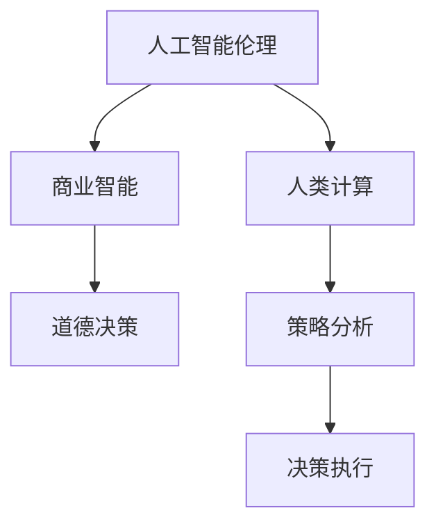

                 

# AI驱动的创新：人类计算在商业中的道德考虑因素与策略分析

> 关键词：人工智能伦理,商业智能,人类计算,道德决策,策略分析

## 1. 背景介绍

### 1.1 问题由来

在过去的几十年中，人工智能(AI)技术迅速发展，已经渗透到商业领域的各个角落。从自动化客户服务到个性化推荐系统，从决策支持到预测分析，AI已经成为了推动商业创新和增长的重要引擎。然而，随着AI技术的深入应用，伦理和道德问题也逐渐浮出水面。如何确保AI在商业中的使用是公正、透明、可解释和负责任的，已经成为迫切需要解决的问题。

AI技术在商业中的应用，尤其是深度学习和强化学习等复杂模型的使用，对决策过程和结果产生了深远的影响。这些模型在处理大量数据时，可能会产生偏见、不公正或不可解释的结果。同时，AI技术的滥用也带来了隐私侵犯、数据滥用等问题。这些问题不仅损害了用户权益，也威胁到商业伦理和社会价值观。

因此，在AI驱动的商业创新中，道德考虑因素至关重要。本文将探讨这些道德考虑因素，并提出相应的策略分析，以指导企业在开发和使用AI技术时，遵循道德准则，保障社会利益。

### 1.2 问题核心关键点

AI技术在商业中的应用涉及诸多伦理和道德问题，核心关键点包括：

- **偏见与公平性**：AI模型可能会继承和放大数据中的偏见，导致在性别、种族、年龄等方面出现不公平的结果。
- **透明性与可解释性**：商业应用中的AI模型往往具有黑箱特性，难以解释其决策过程和结果。
- **隐私与安全**：在收集、存储和处理用户数据时，如何保障用户隐私和数据安全，避免数据滥用。
- **责任与问责**：AI系统在商业决策中可能出现失误或错误，如何确定责任方，并采取相应的问责机制。
- **职业伦理**：AI技术的开发和应用过程中，开发者和从业者应遵守的职业伦理规范。

本文将重点探讨这些关键点，并提出相应的策略分析，帮助企业在AI驱动的创新中，更好地应对道德挑战，推动技术进步和社会福祉。

## 2. 核心概念与联系

### 2.1 核心概念概述

为了深入理解AI在商业中的道德考虑因素，首先需要明确几个核心概念及其相互关系：

- **人工智能伦理(AI Ethics)**：AI伦理研究如何通过技术手段解决道德、社会和法律问题，以确保AI的开发和应用符合人类价值观。
- **商业智能(Business Intelligence, BI)**：利用数据和分析工具，帮助企业做出更加明智的商业决策。
- **人类计算(Human Computation)**：指将人类认知能力与机器学习技术结合，优化决策和计算过程。
- **道德决策(Ethical Decision-Making)**：在决策过程中，考虑伦理和社会价值观，确保决策的公正性和合理性。
- **策略分析(Strategic Analysis)**：通过系统分析和建模，优化策略和方案，以实现企业的目标。

这些概念之间的逻辑关系可以通过以下Mermaid流程图来展示：



这个流程图展示了AI伦理、商业智能、人类计算、道德决策和策略分析之间的相互联系：

- AI伦理为商业智能和人类计算提供道德指导。
- 商业智能和人类计算利用AI技术，提高决策效率和质量。
- 道德决策贯穿于商业智能和人类计算的全过程，确保决策的公正性和合理性。
- 策略分析通过系统分析，优化决策方案，提升企业的竞争力和社会责任感。

## 3. 核心算法原理 & 具体操作步骤
### 3.1 算法原理概述

AI在商业中的应用，尤其是深度学习和强化学习等复杂模型的使用，涉及诸多道德考虑因素。以下将从算法原理的角度，分析这些因素及其对商业决策的影响。

- **偏见与公平性**：AI模型可能会继承和放大数据中的偏见，导致在性别、种族、年龄等方面出现不公平的结果。例如，在贷款审批、招聘等决策中，模型可能会因历史数据中的偏见而产生歧视性决策。
- **透明性与可解释性**：商业应用中的AI模型往往具有黑箱特性，难以解释其决策过程和结果。这使得企业难以理解模型的决策逻辑，也无法对其结果进行有效监督。
- **隐私与安全**：在收集、存储和处理用户数据时，如何保障用户隐私和数据安全，避免数据滥用，是一个重要的道德问题。
- **责任与问责**：AI系统在商业决策中可能出现失误或错误，如何确定责任方，并采取相应的问责机制，也是一个关键问题。
- **职业伦理**：AI技术的开发和应用过程中，开发者和从业者应遵守的职业伦理规范，确保技术的健康发展和社会的和谐稳定。

### 3.2 算法步骤详解

基于上述核心算法原理，AI驱动的商业决策可以按照以下步骤进行：

1. **数据收集与预处理**：
   - 收集相关数据，包括历史交易记录、客户反馈、市场数据等。
   - 对数据进行清洗和预处理，确保数据的准确性和完整性。

2. **模型构建与训练**：
   - 选择合适的AI模型，如决策树、神经网络、强化学习等。
   - 使用历史数据对模型进行训练，确保模型能够捕捉到数据的复杂关系。

3. **模型评估与优化**：
   - 对训练好的模型进行评估，确保其在测试数据上的表现良好。
   - 根据评估结果，对模型进行优化，以提高其准确性和鲁棒性。

4. **道德评估与调整**：
   - 对模型进行道德评估，检查其是否存在偏见、不公等问题。
   - 根据道德评估结果，调整模型参数或重新训练模型，以确保其符合道德准则。

5. **透明性与可解释性增强**：
   - 使用可解释性技术，如LIME、SHAP等，提高模型的透明性和可解释性。
   - 确保决策过程和结果可以被解释和理解，增强用户信任。

6. **隐私与安全保护**：
   - 使用数据加密、访问控制等技术，保护用户隐私和数据安全。
   - 确保数据的使用符合相关法律法规，如GDPR、CCPA等。

7. **责任与问责机制建立**：
   - 明确AI系统在商业决策中的角色和责任。
   - 建立问责机制，确保在出现错误或失误时，能够及时追究责任，并采取纠正措施。

8. **职业伦理规范制定**：
   - 制定AI开发和应用的职业伦理规范，确保从业者遵守道德准则。
   - 开展职业伦理培训，提高从业者的道德意识和责任感。

### 3.3 算法优缺点

AI驱动的商业决策具有以下优点：

- **效率提升**：AI技术可以自动化许多决策过程，提高决策效率和速度。
- **精度提高**：AI模型能够处理大量数据，提高决策的准确性和可靠性。
- **风险降低**：通过数据驱动的决策，可以降低人为决策中的主观偏差和失误。

同时，也存在以下缺点：

- **偏见与不公**：AI模型可能继承和放大数据中的偏见，导致决策不公。
- **透明性与可解释性不足**：AI模型的决策过程往往是黑箱，难以解释。
- **隐私与安全风险**：数据收集和处理过程中，可能存在隐私泄露和数据滥用的风险。
- **责任与问责困难**：AI系统的复杂性使得责任归属难以明确。
- **伦理规范缺失**：AI技术的应用缺乏明确的伦理规范，可能导致道德风险。

### 3.4 算法应用领域

AI驱动的商业决策在以下领域具有广泛应用：

- **客户服务**：使用聊天机器人、推荐系统等AI技术，提升客户体验和服务效率。
- **营销分析**：利用AI技术进行市场分析、客户细分和个性化推荐，提高营销效果。
- **风险管理**：通过AI模型进行信用评估、欺诈检测、投资分析等，降低风险。
- **供应链优化**：使用AI技术进行需求预测、库存管理、物流优化等，提升供应链效率。
- **人力资源管理**：利用AI技术进行招聘、员工培训、绩效评估等，优化人力资源管理。

## 4. 数学模型和公式 & 详细讲解  
### 4.1 数学模型构建

为了更好地理解AI在商业中的应用，本节将介绍几个关键数学模型及其构建过程。

- **线性回归模型**：用于预测数值型输出，形式为 $y = \beta_0 + \beta_1 x_1 + \cdots + \beta_p x_p$，其中 $y$ 为输出，$x_i$ 为输入特征，$\beta_i$ 为系数。
- **决策树模型**：用于分类和回归，通过树形结构表示决策规则，每个节点代表一个特征，边表示特征取值，叶子节点代表输出结果。
- **神经网络模型**：由多个神经元组成的网络结构，用于复杂的非线性映射，其形式为 $y = f(Wx + b)$，其中 $W$ 为权重矩阵，$b$ 为偏置向量，$f$ 为激活函数。
- **强化学习模型**：通过与环境的交互，学习最优策略，其形式为 $Q(s,a) = r + \gamma \max_{a'} Q(s',a')$，其中 $s$ 为状态，$a$ 为动作，$r$ 为即时奖励，$s'$ 为下一状态。

### 4.2 公式推导过程

以下是几个关键数学模型的公式推导过程：

- **线性回归模型的损失函数**：最小二乘误差，形式为 $\frac{1}{2n} \sum_{i=1}^n (y_i - \hat{y}_i)^2$，其中 $\hat{y}_i$ 为模型预测值。
- **决策树模型的训练过程**：通过递归划分数据集，选择最优特征和阈值，构建决策树。
- **神经网络模型的前向传播**：计算隐藏层和输出层的输出，形式为 $a^{(l)} = g(W^{(l)} a^{(l-1)} + b^{(l)})$，其中 $a^{(l)}$ 为层 $l$ 的输出，$W^{(l)}$ 为层 $l$ 的权重矩阵，$b^{(l)}$ 为层 $l$ 的偏置向量，$g$ 为激活函数。
- **强化学习模型的Q值更新**：使用蒙特卡洛方法或时序差分方法，更新Q值，形式为 $Q(s,a) = r + \gamma \max_{a'} Q(s',a')$。

### 4.3 案例分析与讲解

以推荐系统为例，分析AI在商业中的应用：

- **数据收集与预处理**：收集用户的浏览、购买、评分等数据，进行清洗和特征工程。
- **模型构建与训练**：使用协同过滤、基于内容的推荐等模型，对用户和物品进行表示和关联。
- **模型评估与优化**：使用A/B测试、交叉验证等方法，评估模型的效果，并进行参数调整。
- **道德评估与调整**：检查推荐结果是否存在性别、年龄等方面的偏见，调整模型参数，确保公平性。
- **透明性与可解释性增强**：使用LIME、SHAP等工具，分析推荐结果的生成逻辑，增强可解释性。
- **隐私与安全保护**：使用数据加密、访问控制等技术，保护用户隐私和数据安全。
- **责任与问责机制建立**：明确推荐系统在推荐过程中的角色和责任，建立问责机制。
- **职业伦理规范制定**：制定推荐系统的职业伦理规范，确保从业者遵守道德准则。

## 5. 项目实践：代码实例和详细解释说明
### 5.1 开发环境搭建

在进行AI驱动的商业决策项目实践时，我们需要准备好开发环境。以下是使用Python进行PyTorch开发的环境配置流程：

1. 安装Anaconda：从官网下载并安装Anaconda，用于创建独立的Python环境。

2. 创建并激活虚拟环境：
```bash
conda create -n ai-env python=3.8 
conda activate ai-env
```

3. 安装PyTorch：根据CUDA版本，从官网获取对应的安装命令。例如：
```bash
conda install pytorch torchvision torchaudio cudatoolkit=11.1 -c pytorch -c conda-forge
```

4. 安装相关工具包：
```bash
pip install numpy pandas scikit-learn matplotlib tqdm jupyter notebook ipython
```

完成上述步骤后，即可在`ai-env`环境中开始项目实践。

### 5.2 源代码详细实现

下面我们以推荐系统为例，给出使用Transformers库进行深度学习模型训练的PyTorch代码实现。

首先，定义推荐系统的数据处理函数：

```python
from transformers import BertTokenizer
from torch.utils.data import Dataset
import torch

class RecommendationDataset(Dataset):
    def __init__(self, user_items, user_ids, item_ids, item_features, num_users, num_items, tokenizer, max_len=128):
        self.user_items = user_items
        self.user_ids = user_ids
        self.item_ids = item_ids
        self.item_features = item_features
        self.num_users = num_users
        self.num_items = num_items
        self.tokenizer = tokenizer
        self.max_len = max_len
        
    def __len__(self):
        return len(self.user_items)
    
    def __getitem__(self, item):
        user_item = self.user_items[item]
        user_id = self.user_ids[item]
        item_id = self.item_ids[item]
        item_feature = self.item_features[item]
        
        encoding = self.tokenizer(user_item, return_tensors='pt', max_length=self.max_len, padding='max_length', truncation=True)
        input_ids = encoding['input_ids'][0]
        attention_mask = encoding['attention_mask'][0]
        item_feature = torch.tensor(item_feature, dtype=torch.float)
        
        return {'input_ids': input_ids, 
                'attention_mask': attention_mask,
                'item_feature': item_feature}
```

然后，定义模型和优化器：

```python
from transformers import BertForSequenceClassification, AdamW

model = BertForSequenceClassification.from_pretrained('bert-base-cased', num_labels=num_items)

optimizer = AdamW(model.parameters(), lr=2e-5)
```

接着，定义训练和评估函数：

```python
from torch.utils.data import DataLoader
from tqdm import tqdm
from sklearn.metrics import precision_recall_fscore_support

device = torch.device('cuda') if torch.cuda.is_available() else torch.device('cpu')
model.to(device)

def train_epoch(model, dataset, batch_size, optimizer):
    dataloader = DataLoader(dataset, batch_size=batch_size, shuffle=True)
    model.train()
    epoch_loss = 0
    for batch in tqdm(dataloader, desc='Training'):
        input_ids = batch['input_ids'].to(device)
        attention_mask = batch['attention_mask'].to(device)
        item_feature = batch['item_feature'].to(device)
        model.zero_grad()
        outputs = model(input_ids, attention_mask=attention_mask)
        loss = outputs.loss
        epoch_loss += loss.item()
        loss.backward()
        optimizer.step()
    return epoch_loss / len(dataloader)

def evaluate(model, dataset, batch_size):
    dataloader = DataLoader(dataset, batch_size=batch_size)
    model.eval()
    preds, labels = [], []
    with torch.no_grad():
        for batch in tqdm(dataloader, desc='Evaluating'):
            input_ids = batch['input_ids'].to(device)
            attention_mask = batch['attention_mask'].to(device)
            batch_labels = batch['item_feature'].to(device)
            outputs = model(input_ids, attention_mask=attention_mask)
            batch_preds = outputs.logits.argmax(dim=2).to('cpu').tolist()
            batch_labels = batch_labels.to('cpu').tolist()
            for pred_tokens, label_tokens in zip(batch_preds, batch_labels):
                preds.append(pred_tokens)
                labels.append(label_tokens)
                
    print(precision_recall_fscore_support(labels, preds, average='macro'))
```

最后，启动训练流程并在测试集上评估：

```python
epochs = 5
batch_size = 16

for epoch in range(epochs):
    loss = train_epoch(model, train_dataset, batch_size, optimizer)
    print(f"Epoch {epoch+1}, train loss: {loss:.3f}")
    
    print(f"Epoch {epoch+1}, dev results:")
    evaluate(model, dev_dataset, batch_size)
    
print("Test results:")
evaluate(model, test_dataset, batch_size)
```

以上就是使用PyTorch进行深度学习模型训练的完整代码实现。可以看到，得益于Transformers库的强大封装，我们可以用相对简洁的代码完成深度学习模型的训练。

### 5.3 代码解读与分析

让我们再详细解读一下关键代码的实现细节：

**RecommendationDataset类**：
- `__init__`方法：初始化用户-物品矩阵、用户ID、物品ID、物品特征等关键组件。
- `__len__`方法：返回数据集的样本数量。
- `__getitem__`方法：对单个样本进行处理，将用户-物品对输入编码为token ids，将物品特征编码并添加，进行定长padding，最终返回模型所需的输入。

**训练和评估函数**：
- 使用PyTorch的DataLoader对数据集进行批次化加载，供模型训练和推理使用。
- 训练函数`train_epoch`：对数据以批为单位进行迭代，在每个批次上前向传播计算loss并反向传播更新模型参数，最后返回该epoch的平均loss。
- 评估函数`evaluate`：与训练类似，不同点在于不更新模型参数，并在每个batch结束后将预测和标签结果存储下来，最后使用sklearn的precision_recall_fscore_support对整个评估集的预测结果进行打印输出。

**训练流程**：
- 定义总的epoch数和batch size，开始循环迭代
- 每个epoch内，先在训练集上训练，输出平均loss
- 在验证集上评估，输出精确率、召回率、F1分数等分类指标
- 所有epoch结束后，在测试集上评估，给出最终测试结果

可以看到，PyTorch配合Transformers库使得深度学习模型训练的代码实现变得简洁高效。开发者可以将更多精力放在数据处理、模型改进等高层逻辑上，而不必过多关注底层的实现细节。

当然，工业级的系统实现还需考虑更多因素，如模型的保存和部署、超参数的自动搜索、更灵活的任务适配层等。但核心的训练范式基本与此类似。

## 6. 实际应用场景
### 6.1 智能客服系统

基于AI驱动的智能客服系统，可以显著提升客户服务效率和满意度。传统客服往往依赖大量人工客服，高峰期响应缓慢，且服务质量难以保证。使用AI驱动的智能客服系统，可以7x24小时不间断服务，快速响应客户咨询，提供自然流畅的对话体验。

在技术实现上，可以收集企业内部的历史客服对话记录，将问题和最佳答复构建成监督数据，在此基础上对深度学习模型进行微调。微调后的模型能够自动理解用户意图，匹配最合适的答案模板进行回复。对于客户提出的新问题，还可以接入检索系统实时搜索相关内容，动态组织生成回答。如此构建的智能客服系统，能大幅提升客户咨询体验和问题解决效率。

### 6.2 金融舆情监测

金融机构需要实时监测市场舆论动向，以便及时应对负面信息传播，规避金融风险。传统的人工监测方式成本高、效率低，难以应对网络时代海量信息爆发的挑战。基于AI驱动的文本分类和情感分析技术，为金融舆情监测提供了新的解决方案。

具体而言，可以收集金融领域相关的新闻、报道、评论等文本数据，并对其进行主题标注和情感标注。在此基础上对深度学习模型进行微调，使其能够自动判断文本属于何种主题，情感倾向是正面、中性还是负面。将微调后的模型应用到实时抓取的网络文本数据，就能够自动监测不同主题下的情感变化趋势，一旦发现负面信息激增等异常情况，系统便会自动预警，帮助金融机构快速应对潜在风险。

### 6.3 个性化推荐系统

当前的推荐系统往往只依赖用户的历史行为数据进行物品推荐，无法深入理解用户的真实兴趣偏好。基于AI驱动的个性化推荐系统，可以更好地挖掘用户行为背后的语义信息，从而提供更精准、多样的推荐内容。

在实践中，可以收集用户浏览、点击、评论、分享等行为数据，提取和用户交互的物品标题、描述、标签等文本内容。将文本内容作为模型输入，用户的后续行为（如是否点击、购买等）作为监督信号，在此基础上微调深度学习模型。微调后的模型能够从文本内容中准确把握用户的兴趣点。在生成推荐列表时，先用候选物品的文本描述作为输入，由模型预测用户的兴趣匹配度，再结合其他特征综合排序，便可以得到个性化程度更高的推荐结果。

### 6.4 未来应用展望

随着AI技术的不断发展，基于AI驱动的商业决策将渗透到更多领域，为各行各业带来变革性影响。

在智慧医疗领域，基于AI驱动的诊断系统、药物研发等应用将提升医疗服务的智能化水平，辅助医生诊疗，加速新药开发进程。

在智能教育领域，AI驱动的个性化学习系统、智能辅导机器人等将提升教育质量和效率，实现因材施教。

在智慧城市治理中，AI驱动的智能交通、智能安防等系统将提高城市管理的智能化水平，构建更安全、高效的未来城市。

此外，在企业生产、社会治理、文娱传媒等众多领域，基于AI驱动的商业决策也将不断涌现，为传统行业数字化转型升级提供新的技术路径。相信随着技术的日益成熟，AI驱动的商业决策必将在更广阔的应用领域大放异彩。

## 7. 工具和资源推荐
### 7.1 学习资源推荐

为了帮助开发者系统掌握AI驱动的商业决策的理论基础和实践技巧，这里推荐一些优质的学习资源：

1. 《Deep Learning》系列书籍：Ian Goodfellow等著，系统介绍了深度学习的基本原理和应用。
2. 《Reinforcement Learning: An Introduction》书籍：Richard Sutton等著，全面介绍了强化学习的理论基础和实践方法。
3. 《Machine Learning for Healthcare》课程：Coursera上的课程，介绍了AI在医疗领域的应用和挑战。
4. 《AI Ethics》课程：Google开发的课程，讨论了AI伦理和道德的重要问题。
5. 《Human-Computer Interaction》书籍：Jonathan B. Rosenfeld等著，探讨了人机交互和人工智能的关系。

通过对这些资源的学习实践，相信你一定能够快速掌握AI驱动的商业决策的精髓，并用于解决实际的商业问题。
###  7.2 开发工具推荐

高效的开发离不开优秀的工具支持。以下是几款用于AI驱动的商业决策开发的常用工具：

1. PyTorch：基于Python的开源深度学习框架，灵活动态的计算图，适合快速迭代研究。大部分深度学习模型都有PyTorch版本的实现。

2. TensorFlow：由Google主导开发的开源深度学习框架，生产部署方便，适合大规模工程应用。同样有丰富的深度学习模型资源。

3. Transformers库：HuggingFace开发的NLP工具库，集成了众多SOTA语言模型，支持PyTorch和TensorFlow，是进行商业决策开发的利器。

4. Weights & Biases：模型训练的实验跟踪工具，可以记录和可视化模型训练过程中的各项指标，方便对比和调优。与主流深度学习框架无缝集成。

5. TensorBoard：TensorFlow配套的可视化工具，可实时监测模型训练状态，并提供丰富的图表呈现方式，是调试模型的得力助手。

6. Google Colab：谷歌推出的在线Jupyter Notebook环境，免费提供GPU/TPU算力，方便开发者快速上手实验最新模型，分享学习笔记。

合理利用这些工具，可以显著提升AI驱动的商业决策的开发效率，加快创新迭代的步伐。

### 7.3 相关论文推荐

AI驱动的商业决策研究源于学界的持续研究。以下是几篇奠基性的相关论文，推荐阅读：

1. "Deep Learning" by Ian Goodfellow等：系统介绍了深度学习的基本原理和应用。
2. "Reinforcement Learning: An Introduction" by Richard Sutton等：全面介绍了强化学习的理论基础和实践方法。
3. "AI for Healthcare: The Promise and the Hurdles" by John W. MacFarlane等：讨论了AI在医疗领域的应用和挑战。
4. "Ethical Considerations in AI: A Survey" by Manoel F. A. Triguero等：讨论了AI伦理和道德的重要问题。
5. "Human-Computer Interaction" by Jonathan B. Rosenfeld等：探讨了人机交互和人工智能的关系。

这些论文代表了大规模语言模型微调技术的发展脉络。通过学习这些前沿成果，可以帮助研究者把握学科前进方向，激发更多的创新灵感。

## 8. 总结：未来发展趋势与挑战

### 8.1 总结

本文对AI驱动的商业决策进行了全面系统的介绍。首先阐述了AI技术在商业中的应用，及其带来的伦理和道德问题。其次，从算法原理的角度，分析了偏见与公平性、透明性与可解释性、隐私与安全、责任与问责、职业伦理等关键点，并提出了相应的策略分析，以指导企业在开发和使用AI技术时，遵循道德准则，保障社会利益。

通过本文的系统梳理，可以看到，AI驱动的商业决策在提升企业效率和竞争力的同时，也带来了诸多道德和法律挑战。如何平衡商业利益和社会责任，确保AI技术的健康发展，将是未来企业和社会共同面临的重要课题。

### 8.2 未来发展趋势

展望未来，AI驱动的商业决策将呈现以下几个发展趋势：

1. **AI伦理与法规完善**：随着AI技术的深入应用，相关伦理法规也将逐步完善，为企业提供明确的道德指导。
2. **隐私保护与数据安全**：数据隐私和安全将成为AI应用的重要保障，企业将采取更加严格的隐私保护措施。
3. **可解释性与透明度提升**：AI模型的可解释性和透明度将不断提升，确保决策过程透明、可理解。
4. **公平性与包容性增强**：AI系统将更加注重公平性，减少偏见和不公，确保各类用户得到平等服务。
5. **多模态数据融合**：AI系统将利用多模态数据，提升决策的准确性和鲁棒性。
6. **责任与问责机制完善**：AI系统的责任归属将更加明确，建立完善的问责机制，确保责任落实。

### 8.3 面临的挑战

尽管AI驱动的商业决策取得了显著进展，但在迈向更加智能化、普适化应用的过程中，仍面临诸多挑战：

1. **伦理法规滞后**：AI技术的发展速度远超相关法规的制定，导致部分应用缺乏明确的伦理指导。
2. **数据隐私与安全**：在数据收集和处理过程中，如何保障用户隐私和数据安全，仍需进一步探索。
3. **透明性与可解释性不足**：AI模型的决策过程往往是黑箱，难以解释。
4. **公平性与偏见问题**：AI系统可能存在偏见，导致不公现象。
5. **责任与问责困难**：AI系统的复杂性使得责任归属难以明确。
6. **伦理规范缺失**：AI技术的应用缺乏明确的伦理规范，可能导致道德风险。

### 8.4 研究展望

面对AI驱动的商业决策所面临的挑战，未来的研究需要在以下几个方面寻求新的突破：

1. **伦理法规研究**：开展AI伦理法规的研究，制定明确的道德规范和标准，指导AI技术的健康发展。
2. **隐私保护技术**：研发更加先进的数据保护技术，确保用户隐私和数据安全。
3. **可解释性与透明性增强**：研究可解释性技术，提高AI模型的透明性和可解释性。
4. **公平性与偏见消除**：开发公平性算法，消除AI系统中的偏见，确保公平性。
5. **责任与问责机制建立**：制定明确的责任归属机制，确保AI系统在出现错误或失误时，能够及时追究责任。
6. **伦理规范制定**：制定AI技术的职业伦理规范，确保从业者遵守道德准则。

这些研究方向的研究突破，将有助于推动AI驱动的商业决策技术的发展，为社会的可持续发展提供有力支持。

## 9. 附录：常见问题与解答

**Q1：AI驱动的商业决策如何确保公平性？**

A: 确保AI驱动的商业决策公平性，可以从以下几个方面入手：

1. **数据采集多样化**：确保训练数据来自多样化的来源，避免数据偏见。
2. **模型透明性与可解释性**：使用可解释性技术，如LIME、SHAP等，确保模型决策过程透明，易于理解。
3. **公平性算法**：使用公平性算法，如Adversarial De-biasing等，消除模型中的偏见。
4. **多样性测试**：在模型开发和测试过程中，加入多样性测试，确保模型对不同群体的表现一致。

通过以上措施，可以有效提升AI驱动的商业决策的公平性。

**Q2：AI驱动的商业决策如何保护用户隐私？**

A: 保护用户隐私，可以从以下几个方面入手：

1. **数据匿名化**：在数据处理过程中，采用数据匿名化技术，如k-匿名化、l-多样性等，保护用户隐私。
2. **访问控制**：严格控制数据访问权限，确保只有授权人员可以访问敏感数据。
3. **数据加密**：使用数据加密技术，保护数据传输和存储过程中的安全。
4. **隐私保护技术**：使用隐私保护技术，如差分隐私、联邦学习等，确保数据隐私。

通过以上措施，可以有效保护用户隐私，保障用户数据安全。

**Q3：AI驱动的商业决策如何提升透明性与可解释性？**

A: 提升AI驱动的商业决策的透明性与可解释性，可以从以下几个方面入手：

1. **可解释性技术**：使用可解释性技术，如LIME、SHAP等，解释AI模型的决策过程和结果。
2. **透明性机制**：建立透明性机制，确保模型决策过程公开、透明。
3. **模型可视化**：使用可视化工具，展示模型结构和决策过程，帮助用户理解。
4. **用户反馈机制**：建立用户反馈机制，收集用户对模型决策的反馈，不断优化模型。

通过以上措施，可以有效提升AI驱动的商业决策的透明性和可解释性，增强用户信任。

**Q4：AI驱动的商业决策如何应对责任与问责挑战？**

A: 应对AI驱动的商业决策的责任与问责挑战，可以从以下几个方面入手：

1. **责任归属机制**：明确AI系统在决策过程中的角色和责任，建立明确的责任归属机制。
2. **问责机制**：建立问责机制，确保在出现错误或失误时，能够及时追究责任，并采取纠正措施。
3. **法律保障**：制定相关法律法规，明确AI系统的责任归属和问责机制。
4. **监督与审计**：建立监督与审计机制，定期检查AI系统的表现，确保其符合伦理准则。

通过以上措施，可以有效应对AI驱动的商业决策的责任与问责挑战，确保决策公正、透明。

**Q5：AI驱动的商业决策如何建立伦理规范？**

A: 建立AI驱动的商业决策的伦理规范，可以从以下几个方面入手：

1. **伦理框架**：制定伦理框架，明确AI技术的道德准则和规范。
2. **伦理培训**：对AI技术的开发者和使用者进行伦理培训，提高其道德意识。
3. **伦理审查**：在AI技术的开发和应用过程中，进行伦理审查，确保其符合道德准则。
4. **伦理委员会**：建立伦理委员会，对AI技术的开发和应用进行监督和管理。

通过以上措施，可以有效建立AI驱动的商业决策的伦理规范，确保其符合社会价值观和道德准则。

---

作者：禅与计算机程序设计艺术 / Zen and the Art of Computer Programming

