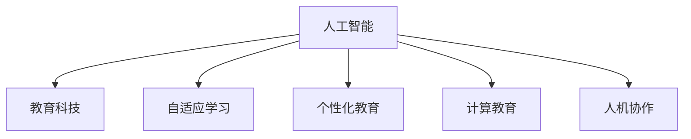

                 

# AI驱动的创新：人类计算在教育中的作用

> 关键词：人工智能,教育,教育科技,自适应学习,个性化教育,计算教育,人机协作,计算教育平台

## 1. 背景介绍

在21世纪这个知识快速迭代和智能科技迅猛发展的时代，教育系统正经历着前所未有的变革。传统的教学模式已不再适应现代社会对人才的需求，教育系统亟需创新以培养具备应对未来挑战能力的新一代。AI技术的崛起，为教育带来了新的可能。

人类计算，即通过计算设备辅助人类进行各种智力活动，不仅提高了计算效率，也为教育创新提供了新的方向。本文将探讨AI如何结合人类计算，推动教育技术的创新发展，以实现个性化、自适应、高效且具有人机协作特性的教育体系。

## 2. 核心概念与联系

### 2.1 核心概念概述

为更好地理解AI如何推动教育创新，本节将介绍几个核心概念及其相互关系。

- **人工智能(AI)**：通过计算机模拟人类智能过程的技术，涵盖机器学习、深度学习、自然语言处理、计算机视觉等多个领域。
- **教育科技(Education Technology, EdTech)**：利用信息技术（特别是AI技术）改革教育方式，提升教育质量与效率。
- **自适应学习(Adaptive Learning)**：根据学生的能力和进度，动态调整学习内容与方法。
- **个性化教育(Personalized Education)**：根据学生的兴趣、能力和学习习惯，定制化教学计划。
- **计算教育(Computational Education)**：结合计算思维与编程教学，培养学生的计算能力与逻辑思维。
- **人机协作(Human-Machine Collaboration)**：将AI系统与人类的智慧结合，共同完成复杂任务。

这些概念之间的联系可以通过以下Mermaid流程图来展示：



这个流程图展示了AI如何通过计算设备在教育中的不同应用，以实现自适应学习、个性化教育、计算教育和人机协作等目标。

## 3. 核心算法原理 & 具体操作步骤
### 3.1 算法原理概述

AI在教育中的创新应用，其核心在于通过数据驱动和算法驱动的方式，实现教育的个性化和自适应。在算法层面，主要依赖于机器学习、深度学习、自然语言处理等技术，构建智能教育系统。这些系统通过学习分析海量教育数据，提供精准的教育建议和个性化学习路径。

具体而言，自适应学习算法通过对学生学习行为的数据采集与分析，动态调整课程难度和教学内容。个性化教育算法通过分析学生兴趣和能力，推荐符合其特质的学习资源。计算教育算法通过编程任务和算法问题，培养学生的计算思维。人机协作算法通过AI辅助教师教学，优化教学效果。

### 3.2 算法步骤详解

以自适应学习算法为例，其操作步骤包括：

1. **数据收集**：从学生的作业、测试成绩、课堂互动等多个维度收集数据。
2. **数据预处理**：清洗、转换、归一化数据，准备输入模型。
3. **模型训练**：选择合适的机器学习模型（如决策树、支持向量机、深度神经网络等），训练模型以预测学生的学习能力和兴趣。
4. **学习路径生成**：根据模型预测结果，动态生成个性化的学习路径，并推送给学生。
5. **学习效果评估**：跟踪学生的学习效果，不断调整模型和算法，优化学习路径。

### 3.3 算法优缺点

AI在教育中的应用，具有以下优点：

- **高效性**：AI系统能自动分析大量数据，快速生成个性化学习路径。
- **精准性**：AI算法能通过模型训练提高预测准确性，推荐符合学生特质的学习资源。
- **自适应性**：AI系统能根据学生的实时反馈和进步，动态调整教学策略。
- **普及性**：AI技术可应用于各类教育场景，提升教育质量与效率。

然而，这些算法也存在一些缺点：

- **依赖数据质量**：AI系统的效果很大程度上依赖于数据的质量和多样性。
- **公平性问题**：AI系统可能加剧学习资源分配的不平等，需要特别关注。
- **隐私风险**：大量教育数据的收集和使用，可能带来隐私和安全风险。
- **伦理挑战**：AI在教育中的应用需要处理复杂的伦理问题，如数据使用、责任归属等。

### 3.4 算法应用领域

AI在教育中的应用领域非常广泛，包括但不限于以下几个方面：

- **自适应学习系统**：提供个性化、动态调整的学习路径，如Knewton、DreamBox等。
- **智能辅导系统**：通过AI技术辅助教师教学，如Socratic、Wolfram Alpha等。
- **学习分析平台**：分析学生学习行为，提供教育建议，如Canvas、Edmodo等。
- **虚拟助教**：通过自然语言处理技术，提供24/7的学习支持，如ChatGPT、Omni等。
- **在线教育平台**：提供大规模在线课程，如Coursera、Udacity等。

## 4. 数学模型和公式 & 详细讲解 & 举例说明

### 4.1 数学模型构建

以自适应学习系统为例，其核心算法为决策树算法。决策树通过树形结构表示决策过程，每个节点代表一个特征或条件，每条边代表一个决策结果。在教育中，决策树可以用于预测学生的学习能力和兴趣，并生成个性化的学习路径。

### 4.2 公式推导过程

假设有学生$S$的特征向量$X=[x_1, x_2, ..., x_n]$，其中$x_i$代表第$i$个特征（如作业成绩、课堂表现等）。通过训练数据，构建决策树模型，其公式为：

$$
T = \{(X_1,Y_1),(X_2,Y_2),...(X_m,Y_m)\}
$$

其中$T$为训练集，$X_i$为输入特征，$Y_i$为目标变量（学习能力和兴趣）。决策树模型的构建过程可以表示为：

$$
T = \{(X_1,Y_1),(X_2,Y_2),...(X_m,Y_m)\}
$$

其中$T$为训练集，$X_i$为输入特征，$Y_i$为目标变量（学习能力和兴趣）。决策树模型的构建过程可以表示为：

$$
T = \{(X_1,Y_1),(X_2,Y_2),...(X_m,Y_m)\}
$$

通过不断划分特征空间，构建决策树：

$$
T = \{(X_1,Y_1),(X_2,Y_2),...(X_m,Y_m)\}
$$

### 4.3 案例分析与讲解

以一个虚拟的学习平台为例，该平台通过收集学生历史学习数据，使用决策树算法预测学生的学习能力和兴趣，并动态生成个性化学习路径。该平台通过以下步骤实现：

1. **数据收集**：平台从学生的作业、测试成绩、课堂互动等多个维度收集数据。
2. **数据预处理**：清洗、转换、归一化数据，准备输入模型。
3. **模型训练**：使用决策树算法训练模型，以预测学生的学习能力和兴趣。
4. **学习路径生成**：根据模型预测结果，动态生成个性化的学习路径，并推送给学生。
5. **学习效果评估**：跟踪学生的学习效果，不断调整模型和算法，优化学习路径。

## 5. 项目实践：代码实例和详细解释说明
### 5.1 开发环境搭建

在进行教育科技项目开发前，需要准备相应的开发环境。以下是使用Python进行开发的简单配置步骤：

1. 安装Python：从官网下载并安装Python 3.9及以上版本。
2. 安装虚拟环境：使用pip安装virtualenv模块，创建虚拟环境。
3. 安装依赖包：使用pip安装所需依赖包，如TensorFlow、Scikit-learn、Pandas等。

### 5.2 源代码详细实现

以下是一个虚拟学习平台的部分代码实现，以决策树模型为例，使用Scikit-learn库进行训练和预测：

```python
from sklearn.tree import DecisionTreeClassifier
from sklearn.model_selection import train_test_split
import pandas as pd

# 数据准备
data = pd.read_csv('student_data.csv')

# 特征工程
X = data[['作业成绩', '课堂表现', '兴趣倾向']]
y = data['学习能力']

# 划分数据集
X_train, X_test, y_train, y_test = train_test_split(X, y, test_size=0.2)

# 模型训练
clf = DecisionTreeClassifier()
clf.fit(X_train, y_train)

# 模型预测
predictions = clf.predict(X_test)

# 结果分析
print(classification_report(y_test, predictions))
```

### 5.3 代码解读与分析

**数据准备**：从csv文件中读取学生数据，并进行基本的特征工程。

**模型训练**：使用Scikit-learn库中的DecisionTreeClassifier类训练决策树模型，以预测学生的学习能力。

**模型预测**：在测试集上使用训练好的模型进行预测，并输出分类报告。

## 6. 实际应用场景
### 6.1 智能辅导系统

智能辅导系统通过AI技术辅助教师教学，提供个性化的学习指导。例如，Socratic平台能够通过自然语言处理技术，解析学生的数学问题，并给出详细的解答步骤。

### 6.2 虚拟助教

虚拟助教通过AI技术提供24/7的学习支持，例如，ChatGPT能够回答学生的各类学习问题，并提供学习资源推荐。

### 6.3 在线教育平台

在线教育平台通过AI技术提供大规模在线课程，例如，Coursera平台能够根据学生的学习进度和表现，动态调整课程内容和难度。

### 6.4 未来应用展望

未来的教育将更加依赖AI技术，实现以下目标：

- **全面自适应**：通过AI技术实现全面的个性化教育，满足不同学生的需求。
- **智能评估**：利用AI技术进行智能评估，及时发现学生的薄弱环节，提供有针对性的辅导。
- **协作学习**：构建基于AI的协作学习平台，促进学生之间的交流与合作。
- **计算教育普及**：通过AI技术普及计算教育，培养学生的计算思维和编程能力。

## 7. 工具和资源推荐
### 7.1 学习资源推荐

- **Kaggle**：在线学习平台，提供大量机器学习项目和数据集，适合实战练习。
- **Coursera**：提供各类在线课程，涵盖AI与教育技术等主题。
- **edX**：提供各类在线课程和MOOCs，适合不同层次的学习者。

### 7.2 开发工具推荐

- **Python**：适合AI开发，具备丰富的第三方库和工具。
- **TensorFlow**：适合深度学习开发，具有强大的计算能力和丰富的资源。
- **Jupyter Notebook**：适合数据科学和AI开发，支持代码块、图形和注释的交互式编写。

### 7.3 相关论文推荐

- **"Artificial Intelligence in Education: A Survey and Future Directions"**：综述AI在教育中的应用现状和未来方向。
- **"Personalized Learning in Higher Education: A Systematic Review of Empirical Research"**：系统回顾个性化学习在高等教育中的应用研究。
- **"Computational Thinking in Education: Challenges and Opportunities"**：探讨计算思维在教育中的应用挑战与机遇。

## 8. 总结：未来发展趋势与挑战
### 8.1 总结

本文系统探讨了AI在教育中的应用，从核心概念、算法原理、操作步骤到实际应用场景，全面梳理了AI如何通过计算设备辅助教育创新。通过案例分析和代码实例，展示了AI在教育中的具体应用和实现方法。

## 8.2 未来发展趋势

未来，AI在教育中的应用将呈现以下趋势：

- **自适应学习**：通过AI技术实现全面的个性化教育，满足不同学生的需求。
- **智能评估**：利用AI技术进行智能评估，及时发现学生的薄弱环节，提供有针对性的辅导。
- **协作学习**：构建基于AI的协作学习平台，促进学生之间的交流与合作。
- **计算教育普及**：通过AI技术普及计算教育，培养学生的计算思维和编程能力。

## 8.3 面临的挑战

尽管AI在教育中的应用前景广阔，但仍面临以下挑战：

- **数据隐私和安全**：大量教育数据的收集和使用，可能带来隐私和安全风险。
- **公平性问题**：AI系统可能加剧学习资源分配的不平等，需要特别关注。
- **伦理挑战**：AI在教育中的应用需要处理复杂的伦理问题，如数据使用、责任归属等。
- **技术普及**：AI技术在教育中的应用需要广泛的普及和推广，面临诸多障碍。

## 8.4 研究展望

未来研究应在以下方面进行探讨：

- **数据隐私保护**：开发保护学生隐私的AI算法，确保数据安全。
- **公平性保障**：构建公平的AI教育系统，减少学习资源的不平等。
- **伦理规范**：制定AI在教育中的伦理规范，确保合规性和可解释性。
- **技术普及**：推广AI教育技术，提升教育质量和效率。

## 9. 附录：常见问题与解答

**Q1: AI在教育中的应用前景如何？**

A: AI在教育中的应用前景广阔，能够通过数据驱动和算法驱动的方式，实现教育的个性化、自适应和高效化。通过AI技术，可以构建自适应学习系统、智能辅导系统、学习分析平台等，提升教育质量与效率。

**Q2: AI在教育中面临哪些挑战？**

A: AI在教育中的应用面临数据隐私、公平性、伦理等挑战。数据隐私和安全问题需要通过技术手段和法律法规进行保护。公平性问题需要通过合理的数据分布和算法设计进行解决。伦理问题需要通过透明和可解释的算法实现。

**Q3: AI在教育中的应用案例有哪些？**

A: AI在教育中的应用案例包括自适应学习系统、智能辅导系统、虚拟助教、在线教育平台等。例如，Knewton平台通过自适应学习系统，提供个性化的学习路径；Socratic平台通过智能辅导系统，解析学生的数学问题并给出解答。

**Q4: AI在教育中的开发流程是怎样的？**

A: AI在教育中的开发流程包括数据收集、特征工程、模型训练、模型预测和结果分析等步骤。开发者需要选择合适的算法和工具，通过实验和迭代优化，实现教育系统的智能化和个性化。

**Q5: 如何评估AI在教育中的效果？**

A: 评估AI在教育中的效果需要考虑多个指标，如学习效果、学生满意度、学习进度、资源利用率等。开发者可以通过实验和问卷调查等方法，收集数据并评估AI系统的性能。

通过深入探索AI在教育中的应用，我们可以更好地理解AI技术的潜力和价值，推动教育系统的创新与发展。未来，随着AI技术的不断进步和普及，教育系统将变得更加智能化、个性化和高效化，为社会培养更多具备未来竞争力的高素质人才。

