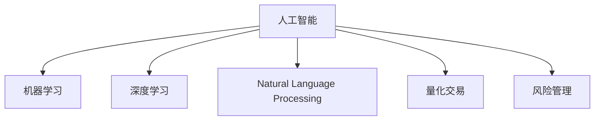

                 

# AI驱动的创新：人类计算在金融行业的未来发展

## 1. 背景介绍

随着人工智能(AI)技术的快速发展，AI在金融行业的应用也日渐深入。从传统的量化交易、风险管理，到智能投顾、智能风控，AI正在推动金融行业的数字化转型，开启新的发展篇章。

AI技术的引入，使得金融行业能够更好地应对复杂多变的外部环境，提升决策的准确性和效率。以机器学习、深度学习为代表的AI技术，通过大数据分析和计算建模，揭示金融市场运行的内在规律，为投资者提供更为精准的风险评估和策略建议。

## 2. 核心概念与联系

### 2.1 核心概念概述

为更好地理解AI在金融行业的创新应用，本节将介绍几个密切相关的核心概念：

- 人工智能(AI)：通过模拟人类智能，实现自主学习、推理、决策等功能。在金融行业，AI主要用于量化交易、风险评估、智能投顾等领域。

- 机器学习(ML)：指利用数据驱动的方法，训练模型进行预测、分类等任务。机器学习是AI的子领域，主要依赖算法和统计学方法。

- 深度学习(Deep Learning)：基于神经网络，通过多层次的特征提取和表示学习，实现复杂模式识别和建模。深度学习在图像、语音等领域表现突出。

- 自然语言处理(NLP)：利用计算方法，理解、生成、处理人类语言。在金融行业，NLP被用于金融市场分析、舆情监测、客户沟通等。

- 量化交易(Quantitative Trading)：通过数学模型和算法，自动化地进行股票、期货等金融产品的交易。量化交易是AI在金融行业的重要应用之一。

- 风险管理(Risk Management)：通过量化模型，评估和控制金融产品的风险水平，保护投资者利益。风险管理也是AI在金融行业的重要应用。

这些核心概念之间的逻辑关系可以通过以下Mermaid流程图来展示：



这个流程图展示了许多AI技术在金融行业的应用场景，每个核心概念都发挥了独特的作用。

## 3. 核心算法原理 & 具体操作步骤
### 3.1 算法原理概述

AI在金融行业的创新应用，主要依赖于机器学习和深度学习的核心算法。这些算法通过训练模型，从大量历史数据中提取规律，并用于预测未来的市场趋势和风险状况。

具体而言，AI在金融行业的主要算法原理包括：

- 监督学习：通过标注的数据集，训练模型进行分类、回归等任务。
- 非监督学习：从未标注数据中学习数据的内在结构，进行聚类、降维等任务。
- 强化学习：通过与环境的交互，训练模型进行决策和优化。
- 生成模型：通过学习数据的概率分布，生成新的数据样本。

这些算法通过不同的方式，帮助金融行业更好地理解和应用数据，提升金融服务的质量和效率。

### 3.2 算法步骤详解

AI在金融行业的应用，通常包括以下关键步骤：

**Step 1: 数据准备**
- 收集历史交易数据、市场指数、宏观经济指标等，作为训练模型的数据源。
- 对数据进行清洗和预处理，去除噪声和异常值。

**Step 2: 模型训练**
- 选择合适的算法和模型结构，如线性回归、随机森林、卷积神经网络(CNN)、循环神经网络(RNN)、Transformer等。
- 对模型进行参数初始化，并使用训练数据进行迭代优化。
- 使用验证集评估模型的性能，调整超参数以提升模型效果。

**Step 3: 模型评估与部署**
- 在测试集上评估模型性能，验证模型的泛化能力。
- 将模型集成到金融系统中，进行实时预测和决策。
- 持续收集新数据，周期性地重新训练和更新模型。

### 3.3 算法优缺点

AI在金融行业的应用，具有以下优点：

- 提升决策效率：通过自动化决策模型，能够快速处理海量数据，提高决策的效率和准确性。
- 降低人力成本：自动化和智能化的AI系统能够替代部分人工操作，降低人力成本。
- 提供个性化服务：AI系统能够根据用户行为和偏好，提供个性化的投资建议和风险管理策略。

同时，AI在金融行业的应用也存在一些局限：

- 模型依赖数据质量：模型的性能高度依赖于数据的准确性和完整性，数据质量差可能导致模型误判。
- 存在算法偏见：训练数据和模型结构可能导致算法偏见，产生不公平或歧视性决策。
- 模型可解释性不足：深度学习模型通常被认为是"黑箱"，难以解释其决策过程。
- 技术门槛较高：金融领域的专业性较强，AI技术的引入需要跨学科的知识和经验。

### 3.4 算法应用领域

AI在金融行业的广泛应用，覆盖了以下多个领域：

- **量化交易**：利用AI模型进行高频交易、套利、市场预测等。
- **智能投顾**：通过自然语言处理和推荐系统，提供个性化的投资建议。
- **风险管理**：利用AI模型评估信用风险、市场风险、操作风险等。
- **智能风控**：利用AI模型进行欺诈检测、反洗钱等。
- **大数据分析**：利用AI技术进行市场分析、舆情监测等。
- **智能客服**：利用AI技术提升客服效率和客户满意度。

这些应用领域展示了AI在金融行业的多样性和广泛性，推动了金融行业的数字化转型。

## 4. 数学模型和公式 & 详细讲解 & 举例说明

### 4.1 数学模型构建

AI在金融行业的核心算法，大多依赖于数学模型。以下以线性回归模型为例，进行详细讲解。

设金融市场价格 $y$ 与影响因素 $x_1, x_2, \cdots, x_n$ 之间的关系为：

$$
y = \beta_0 + \beta_1 x_1 + \beta_2 x_2 + \cdots + \beta_n x_n + \epsilon
$$

其中 $\beta_0, \beta_1, \cdots, \beta_n$ 为回归系数，$\epsilon$ 为误差项。

线性回归模型的目标是最小化预测误差，即：

$$
\min_{\beta_0, \beta_1, \cdots, \beta_n} \sum_{i=1}^N (y_i - (\beta_0 + \beta_1 x_{1i} + \beta_2 x_{2i} + \cdots + \beta_n x_{ni}))^2
$$

### 4.2 公式推导过程

使用最小二乘法求解线性回归模型，得到回归系数为：

$$
\beta_j = \frac{\sum_{i=1}^N x_{ji}(y_i - \bar{y})}{\sum_{i=1}^N x_{ji}^2 - \sum_{i=1}^N x_{ji} \bar{x}_j}
$$

其中 $\bar{x}_j = \frac{\sum_{i=1}^N x_{ji}}{N}$，$\bar{y} = \frac{\sum_{i=1}^N y_i}{N}$。

将得到的回归系数代入原回归方程，即可得到预测值 $\hat{y}_i$：

$$
\hat{y}_i = \beta_0 + \beta_1 x_{1i} + \beta_2 x_{2i} + \cdots + \beta_n x_{ni}
$$

### 4.3 案例分析与讲解

以下以一个简单的金融市场预测为例，说明线性回归模型的应用。

假设我们要预测某只股票的价格变化，收集了过去一年该股票的日收盘价和相应的宏观经济指标数据，如GDP增长率、通货膨胀率等。

使用线性回归模型对这些数据进行训练，得到回归方程：

$$
\hat{y}_i = \beta_0 + \beta_1 x_{1i} + \beta_2 x_{2i} + \cdots + \beta_n x_{ni}
$$

其中 $x_{1i}, x_{2i}, \cdots, x_{ni}$ 分别代表过去一年的GDP增长率、通货膨胀率等，$\hat{y}_i$ 代表第 $i$ 天的预测收盘价。

使用训练好的模型对未来一天的股票价格进行预测，结果与实际价格误差较小，说明模型的预测能力较好。

## 5. 项目实践：代码实例和详细解释说明

### 5.1 开发环境搭建

在进行AI应用开发前，我们需要准备好开发环境。以下是使用Python进行TensorFlow开发的环境配置流程：

1. 安装Anaconda：从官网下载并安装Anaconda，用于创建独立的Python环境。

2. 创建并激活虚拟环境：
```bash
conda create -n tf-env python=3.8 
conda activate tf-env
```

3. 安装TensorFlow：根据CUDA版本，从官网获取对应的安装命令。例如：
```bash
conda install tensorflow tensorflow-gpu=2.7.0 -c pytorch -c conda-forge
```

4. 安装其他相关库：
```bash
pip install numpy pandas scikit-learn matplotlib
```

完成上述步骤后，即可在`tf-env`环境中开始AI应用开发。

### 5.2 源代码详细实现

这里我们以一个简单的股票价格预测模型为例，给出使用TensorFlow进行线性回归的PyTorch代码实现。

首先，定义模型和损失函数：

```python
import tensorflow as tf
from tensorflow.keras import layers, models

model = models.Sequential([
    layers.Dense(64, activation='relu', input_shape=(5,)),
    layers.Dense(1)
])

loss_fn = tf.keras.losses.MeanSquaredError()

optimizer = tf.keras.optimizers.Adam(learning_rate=0.01)
```

然后，定义训练和评估函数：

```python
def train_step(inputs, targets):
    with tf.GradientTape() as tape:
        predictions = model(inputs)
        loss = loss_fn(targets, predictions)
    gradients = tape.gradient(loss, model.trainable_variables)
    optimizer.apply_gradients(zip(gradients, model.trainable_variables))
    return loss

def evaluate_step(inputs, targets):
    predictions = model(inputs)
    mse = loss_fn(targets, predictions)
    return mse
```

最后，启动训练流程并在测试集上评估：

```python
epochs = 100

for epoch in range(epochs):
    for (inputs, targets) in train_dataset:
        loss = train_step(inputs, targets)
        if epoch % 10 == 0:
            mse = evaluate_step(dev_dataset)
            print(f"Epoch {epoch}, train loss: {loss:.3f}, dev mse: {mse:.3f}")

print("Test mse:")
mse = evaluate_step(test_dataset)
print(f"Test mse: {mse:.3f}")
```

以上就是使用TensorFlow进行线性回归模型的完整代码实现。可以看到，TensorFlow的高级API使得模型训练和评估变得简洁高效。

### 5.3 代码解读与分析

让我们再详细解读一下关键代码的实现细节：

**train_step函数**：
- 定义了训练过程中的前向传播和反向传播，使用Adam优化器更新模型参数。

**evaluate_step函数**：
- 定义了模型在测试集上的评估过程，计算均方误差作为指标。

**训练流程**：
- 定义总的epoch数，开始循环迭代
- 每个epoch内，对训练集数据进行迭代，计算损失并更新模型参数
- 每隔10个epoch，在验证集上评估一次模型性能
- 所有epoch结束后，在测试集上评估，给出最终测试结果

可以看到，TensorFlow的高级API使得AI模型训练的代码实现变得简洁高效。开发者可以将更多精力放在数据处理、模型改进等高层逻辑上，而不必过多关注底层的实现细节。

当然，工业级的系统实现还需考虑更多因素，如模型的保存和部署、超参数的自动搜索、更灵活的算法组合等。但核心的AI模型训练流程基本与此类似。

## 6. 实际应用场景

### 6.1 智能投顾

AI在金融行业的一个重要应用是智能投顾系统。智能投顾系统通过大数据分析和机器学习，为用户提供个性化的投资建议和资产管理方案。

在技术实现上，可以收集用户的投资偏好、风险承受能力、财务状况等数据，训练模型学习用户画像。模型能够根据市场行情和用户行为，自动生成投资组合和策略调整建议，帮助用户实现财富增值。智能投顾系统不仅能提升用户体验，还能降低人工投资顾问的成本，提高投资决策的科学性和准确性。

### 6.2 信用风险管理

AI技术在信用风险管理中的应用，主要体现在信用评分模型和欺诈检测系统上。通过AI模型，金融机构能够更准确地评估借款人的信用风险，并及时发现潜在的欺诈行为。

在信用评分模型中，AI系统能够结合历史数据和用户行为，预测借款人的违约概率。利用深度学习模型，还能发现异常交易行为，识别出潜在的信用风险和欺诈行为。这不仅提高了风险评估的精度，还能降低坏账率，保护金融机构资产安全。

### 6.3 量化交易

量化交易是AI在金融行业的重要应用之一。通过机器学习和大数据建模，量化交易系统能够实时分析市场数据，识别交易机会，并进行高频交易。

量化交易系统能够处理海量数据，快速生成交易策略和指令，极大地提高了交易效率和盈利能力。AI系统在量化交易中的应用，不仅提升了交易策略的科学性，还能有效控制风险，提高交易稳定性。

### 6.4 未来应用展望

展望未来，AI在金融行业的应用将更加广泛和深入，为金融行业带来更多的创新和变革：

1. **智能风控**：AI系统能够实时监控和评估金融风险，自动识别异常交易行为，降低欺诈和信用风险。
2. **智能投顾**：AI系统能够根据市场行情和用户行为，动态调整投资组合和策略，提高投资收益和风险控制能力。
3. **金融科技**：AI技术在金融科技领域的应用，如数字身份验证、智能合约等，将提升金融服务的便利性和安全性。
4. **金融市场分析**：AI系统能够实时分析金融市场数据，预测市场趋势，提供精准的投资建议。
5. **金融舆情监测**：AI系统能够自动监测金融舆情，实时发现市场热点和风险，辅助投资者决策。

这些应用领域展示了AI在金融行业的广泛性和深度，推动了金融行业的数字化和智能化转型。

## 7. 工具和资源推荐

### 7.1 学习资源推荐

为了帮助开发者系统掌握AI在金融行业的应用，这里推荐一些优质的学习资源：

1. TensorFlow官方文档：TensorFlow的官方文档，提供了详细的API说明和样例代码，是入门学习的重要资料。

2. PyTorch官方文档：PyTorch的官方文档，提供了丰富的模型和算法库，是AI开发的重要工具。

3. Kaggle金融数据集：Kaggle提供了大量的金融市场数据集，适合进行机器学习和深度学习实践。

4. Coursera《机器学习与金融工程》课程：由斯坦福大学教授讲授，系统介绍了机器学习在金融工程中的应用。

5. Udacity《深度学习与金融》课程：由谷歌工程师讲授，介绍了深度学习在金融领域的具体应用。

通过这些学习资源的学习实践，相信你一定能够快速掌握AI在金融行业的应用精髓，并用于解决实际的金融问题。

### 7.2 开发工具推荐

高效的开发离不开优秀的工具支持。以下是几款用于AI金融应用开发的常用工具：

1. Jupyter Notebook：基于Web的交互式开发环境，支持Python、R等多种编程语言，适合数据处理和模型训练。

2. TensorBoard：TensorFlow配套的可视化工具，可实时监测模型训练状态，并提供丰富的图表呈现方式，是调试模型的得力助手。

3. Weights & Biases：模型训练的实验跟踪工具，可以记录和可视化模型训练过程中的各项指标，方便对比和调优。

4. Scikit-learn：基于Python的机器学习库，提供了丰富的算法和工具，适合数据预处理和模型训练。

5. PyTorch Lightning：基于PyTorch的高级框架，简化了模型训练和部署过程，适合快速原型开发。

合理利用这些工具，可以显著提升AI金融应用的开发效率，加快创新迭代的步伐。

### 7.3 相关论文推荐

AI在金融行业的发展得益于学界的持续研究。以下是几篇奠基性的相关论文，推荐阅读：

1. A Deep Learning Framework for Quantitative Trading：提出了基于深度学习的量化交易模型，取得了显著的盈利效果。

2. Risk Assessment via Deep Learning：利用深度学习模型进行信用风险评估，提高了评估精度和效率。

3. Predicting Market Prices using Deep Learning：利用深度学习模型进行股票价格预测，取得了较高的预测准确率。

4. Fraud Detection with Machine Learning：利用机器学习模型进行欺诈检测，提高了检测精度和效率。

5. Sentiment Analysis for Financial Text：利用自然语言处理技术进行金融文本情感分析，辅助投资者决策。

这些论文代表了大AI在金融行业的发展脉络。通过学习这些前沿成果，可以帮助研究者把握学科前进方向，激发更多的创新灵感。

## 8. 总结：未来发展趋势与挑战

### 8.1 总结

本文对AI在金融行业的创新应用进行了全面系统的介绍。首先阐述了AI在金融行业的广泛应用，明确了AI在量化交易、风险管理、智能投顾等领域的独特价值。其次，从原理到实践，详细讲解了AI在金融行业应用的数学模型和关键步骤，给出了AI模型训练的完整代码实例。同时，本文还广泛探讨了AI在金融行业的多样应用场景，展示了AI在金融行业的多样性和广泛性，推动了金融行业的数字化和智能化转型。

通过本文的系统梳理，可以看到，AI在金融行业的应用正处于快速发展阶段，极大地提升了金融服务的质量和效率。未来，伴随AI技术的不断演进，AI在金融行业的应用还将进一步深化，推动金融行业的数字化转型。

### 8.2 未来发展趋势

展望未来，AI在金融行业的应用将呈现以下几个发展趋势：

1. **模型复杂度提升**：随着深度学习技术的发展，AI模型将变得更加复杂，具备更强的建模能力。未来，AI模型将能够处理更复杂的金融问题，提供更精准的预测和建议。

2. **实时性提升**：AI系统将具备更强的实时计算能力，能够实时处理海量数据，快速响应市场变化。实时AI系统将成为金融决策的重要工具。

3. **跨领域融合**：AI技术将与金融工程、量化交易、大数据分析等学科进行更深入的融合，提升金融系统的整体性能。

4. **自动化程度提升**：AI系统将具备更强的自主学习能力和决策能力，能够自动进行策略调整和风险管理，降低人工操作成本。

5. **可解释性增强**：AI系统将具备更强的可解释性，能够提供透明和可信的决策过程，增强用户对AI系统的信任。

6. **伦理和安全保障**：AI系统将更加注重伦理和安全保障，避免算法偏见和歧视性决策，保护用户隐私和数据安全。

以上趋势凸显了AI在金融行业的应用前景，将进一步推动金融行业的数字化和智能化转型。

### 8.3 面临的挑战

尽管AI在金融行业的应用已经取得了一定的进展，但仍面临诸多挑战：

1. **数据隐私和安全**：金融数据涉及用户隐私和商业机密，如何保护数据安全和隐私，是AI系统面临的重要挑战。

2. **算法偏见和歧视**：AI系统在训练过程中可能引入算法偏见，产生不公平或歧视性决策，影响用户信任。

3. **模型可解释性不足**：深度学习模型通常被认为是"黑箱"，难以解释其决策过程，降低了用户对AI系统的信任。

4. **技术复杂性高**：AI系统在金融领域的应用，需要跨学科的知识和经验，对技术水平和人才需求提出了较高要求。

5. **计算资源需求高**：AI系统需要大量的计算资源进行模型训练和推理，如何降低计算成本，是AI系统面临的重要挑战。

6. **监管和合规**：AI系统在金融领域的应用，需要遵守各项法律法规和合规要求，这对AI系统的设计和部署提出了较高要求。

这些挑战需要在技术、伦理、监管等多方面协同努力，才能确保AI系统在金融行业的应用安全和稳定。

### 8.4 研究展望

面对AI在金融行业的应用挑战，未来的研究需要在以下几个方面寻求新的突破：

1. **数据隐私和安全技术**：研发更加安全可靠的数据保护技术，保护用户隐私和数据安全。

2. **公平性和透明性算法**：开发更加公平和透明的AI算法，避免算法偏见和歧视性决策。

3. **模型可解释性技术**：研发更强的可解释性技术，提高AI系统的透明性和可信度。

4. **跨学科融合技术**：加强AI技术与其他学科的融合，提升金融系统的整体性能。

5. **计算资源优化技术**：研发更加高效、低成本的计算资源优化技术，降低AI系统的部署和运营成本。

6. **合规性保障技术**：开发符合法律法规的AI系统设计和部署技术，确保AI系统在金融领域的合规应用。

这些研究方向的探索，将进一步推动AI在金融行业的应用发展，为金融行业的数字化和智能化转型提供新动力。总之，AI在金融行业的应用前景广阔，未来的研究需要在技术、伦理、监管等多方面协同发力，共同推动金融行业的数字化和智能化转型。

## 9. 附录：常见问题与解答

**Q1：AI在金融行业的应用是否会影响金融机构的竞争优势？**

A: AI技术在金融行业的应用，能够提升金融机构的服务效率和决策精度，从而提高市场竞争力。AI系统不仅能够处理海量数据，还能够实时分析市场变化，提供精准的投资建议和风险管理方案，帮助金融机构在竞争中获得优势。

**Q2：AI在金融行业的应用是否会增加运营成本？**

A: 初期开发和部署AI系统需要一定的成本，但长期来看，AI系统能够显著提升金融机构的运营效率和决策准确性，降低运营成本。AI系统能够自动化处理大量重复性任务，减少人力成本和操作风险。

**Q3：AI在金融行业的应用是否会导致金融风险增加？**

A: AI系统在金融行业的应用，能够提升金融机构的风险管理能力，降低风险损失。AI系统能够实时监测和评估金融风险，自动识别异常交易行为，降低欺诈和信用风险。

**Q3：AI在金融行业的应用是否会导致算法偏见和歧视？**

A: 在使用AI系统时，需要严格控制数据来源和数据质量，避免引入算法偏见和歧视性决策。同时，应定期进行模型审计和公平性评估，确保AI系统的公正性和透明性。

**Q5：AI在金融行业的应用是否会替代金融专业人士？**

A: AI系统在金融行业的应用，并不是替代金融专业人士，而是辅助专业人士进行决策和分析。AI系统能够提供精准的投资建议和风险管理方案，帮助金融专业人士提高工作效率和决策精度。

总之，AI在金融行业的应用能够提升金融机构的服务效率和决策精度，降低运营成本，降低金融风险，提升市场竞争力。AI技术在金融行业的应用前景广阔，未来将有更多金融领域引入AI技术，推动金融行业的数字化和智能化转型。

---

作者：禅与计算机程序设计艺术 / Zen and the Art of Computer Programming

