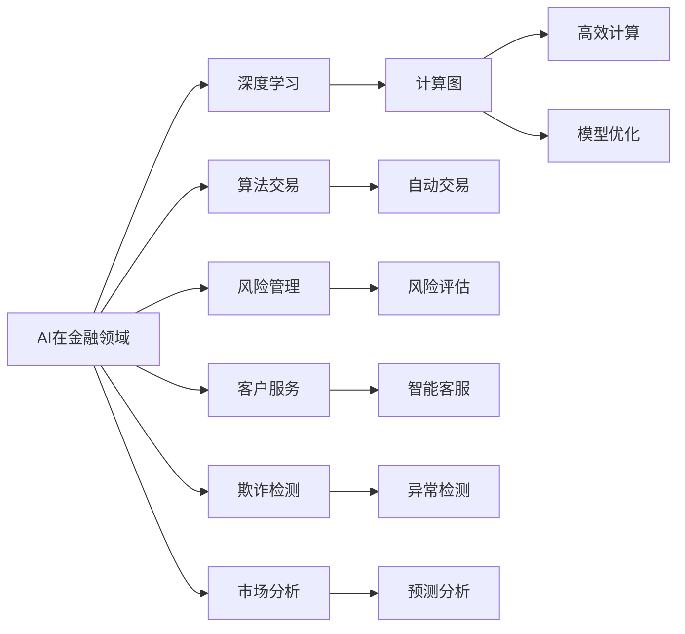

                 

# AI驱动的创新：人类计算在金融领域的应用

> 关键词：金融技术, 人工智能, 计算图, 人类计算, 神经网络, 深度学习

## 1. 背景介绍

随着科技的飞速发展，人工智能(AI)和人类计算(Human Computation)的交叉融合，为金融行业带来了深刻的变革。传统的金融机构依赖人工操作和大量计算资源，效率低下且成本高昂。然而，通过引入AI技术，金融机构可以实现快速高效的信息处理、风险评估、客户服务等多方面的创新。

### 1.1 问题由来

现代金融业务越来越复杂，从金融市场分析到客户服务，都需要对海量数据进行实时处理。传统的人力处理方式已无法满足日益增长的业务需求，且容易出错，导致决策失误。因此，金融机构迫切需要一种新型的计算模式，既能提高效率，又能保证准确性。

### 1.2 问题核心关键点

当前，AI技术在金融领域的应用主要集中在以下几个方面：

1. **算法交易**：利用机器学习模型对市场数据进行分析和预测，自动执行交易策略，提高交易效率。
2. **风险管理**：通过深度学习模型对金融产品进行风险评估，预测市场波动，优化投资组合。
3. **客户服务**：通过智能客服机器人，实时解答客户咨询，提供个性化服务。
4. **欺诈检测**：使用异常检测和分类模型，识别交易中的欺诈行为，保障金融安全。
5. **市场分析**：通过自然语言处理(NLP)技术，分析新闻、社交媒体等非结构化数据，预测市场走势。

这些应用表明，AI技术在金融行业具有广阔的发展前景。然而，AI模型的训练和推理过程复杂，需要大量的计算资源和算法知识，这对金融机构的技术能力提出了较高要求。

## 2. 核心概念与联系

### 2.1 核心概念概述

为了更好地理解AI在金融领域的应用，本节将介绍几个关键概念：

- **AI在金融领域**：利用AI技术，如机器学习、深度学习、自然语言处理等，优化金融业务流程，提高决策效率和准确性。
- **算法交易**：利用机器学习模型预测市场走势，自动执行交易策略。
- **深度学习**：一种强大的AI技术，通过多层次的神经网络模型，学习数据中的复杂特征。
- **计算图**：描述神经网络计算过程的图形结构，用于高效计算和模型优化。
- **人类计算**：利用人类的计算能力，结合AI技术，进行高效、精准的计算和决策。

这些概念之间存在紧密联系，共同构成了AI在金融领域的应用框架：

1. AI技术提供计算能力，人类计算提供专业知识和经验。
2. 深度学习模型处理复杂数据，优化金融业务流程。
3. 计算图描述模型结构，支持高效的模型训练和推理。
4. 算法交易、风险管理等应用，具体体现AI技术在金融业务中的价值。

### 2.2 核心概念原理和架构的 Mermaid 流程图



这个流程图展示了AI在金融领域的关键概念及其联系。

## 3. 核心算法原理 & 具体操作步骤

### 3.1 算法原理概述

AI在金融领域的应用主要基于深度学习模型，通过多层次神经网络结构，自动提取和处理金融数据中的复杂特征。以下以深度学习模型为例，介绍其原理和具体操作步骤。

深度学习模型通过反向传播算法，利用训练数据对模型参数进行优化，从而提高模型的预测精度。其主要步骤如下：

1. **数据准备**：收集金融市场数据、交易数据等，进行预处理和标注。
2. **模型设计**：选择适当的神经网络结构，如卷积神经网络(CNN)、循环神经网络(RNN)等，设计模型层次。
3. **模型训练**：使用反向传播算法，根据损失函数对模型参数进行优化，最小化预测误差。
4. **模型评估**：使用验证集评估模型性能，选择最佳模型进行预测。

### 3.2 算法步骤详解

以深度学习模型应用于算法交易为例，介绍具体的操作步骤：

**Step 1: 数据准备**
- 收集历史交易数据，如价格、成交量、市场新闻等，进行数据清洗和标注。
- 将数据分为训练集和测试集。

**Step 2: 模型设计**
- 选择适当的神经网络结构，如卷积神经网络(CNN)、循环神经网络(RNN)等。
- 设计模型层次，包括输入层、隐藏层和输出层。

**Step 3: 模型训练**
- 使用反向传播算法，根据损失函数对模型参数进行优化。
- 在训练集上进行前向传播和反向传播，更新模型参数。
- 使用验证集评估模型性能，防止过拟合。

**Step 4: 模型评估**
- 使用测试集对模型进行测试，评估预测精度。
- 优化模型参数，提高预测准确性。

**Step 5: 部署和应用**
- 将训练好的模型部署到生产环境中。
- 实时接收市场数据，进行预测和交易决策。
- 持续收集新数据，重新训练和优化模型。

### 3.3 算法优缺点

深度学习模型在金融领域的应用具有以下优点：

1. **处理复杂数据**：能够处理非结构化数据，如图像、文本等，适用于金融市场分析、新闻舆情分析等场景。
2. **自动化决策**：通过自动学习和预测，提高交易决策的速度和效率。
3. **实时处理**：能够实时处理大量数据，满足高频交易需求。

然而，深度学习模型也存在一些缺点：

1. **计算资源消耗大**：需要大量的计算资源进行训练和推理。
2. **模型解释性差**：难以解释模型的决策过程，影响模型的可接受性和可控性。
3. **过拟合风险**：模型容易过拟合训练数据，导致泛化能力不足。
4. **模型更新成本高**：需要持续收集和标注新数据，重新训练和优化模型。

### 3.4 算法应用领域

深度学习模型在金融领域的应用场景广泛，以下是几个典型的应用领域：

1. **算法交易**：利用机器学习模型预测市场走势，自动执行交易策略。
2. **风险管理**：通过深度学习模型对金融产品进行风险评估，预测市场波动。
3. **客户服务**：通过智能客服机器人，实时解答客户咨询，提供个性化服务。
4. **欺诈检测**：使用异常检测和分类模型，识别交易中的欺诈行为。
5. **市场分析**：通过自然语言处理(NLP)技术，分析新闻、社交媒体等非结构化数据，预测市场走势。

这些应用表明，深度学习模型在金融领域具有重要的应用价值。然而，如何平衡计算资源和模型性能，提高模型的可解释性和鲁棒性，仍需进一步研究。

## 4. 数学模型和公式 & 详细讲解 & 举例说明

### 4.1 数学模型构建

深度学习模型通常使用神经网络结构进行构建，其数学模型可以表示为：

$$
f(x; \theta) = \sigma(W_L \sigma(W_{L-1} ... \sigma(W_1 x)))
$$

其中 $x$ 为输入数据，$W_i$ 为第 $i$ 层的权重矩阵，$\sigma$ 为激活函数，$\theta$ 为模型参数。

### 4.2 公式推导过程

以卷积神经网络(CNN)为例，推导其计算过程。CNN模型的计算过程可以表示为：

$$
h(x) = \sigma(W*x + b)
$$

$$
f(x) = \sigma(W*h(x) + b)
$$

其中 $W$ 为卷积核权重，$x$ 为输入数据，$b$ 为偏置项，$h(x)$ 为卷积层输出，$f(x)$ 为最终输出。

通过反向传播算法，可以计算损失函数对模型参数的梯度，从而优化模型参数：

$$
\frac{\partial \mathcal{L}}{\partial W} = \frac{\partial \mathcal{L}}{\partial h} \frac{\partial h}{\partial W} + \frac{\partial \mathcal{L}}{\partial b} \frac{\partial b}{\partial W}
$$

其中 $\mathcal{L}$ 为损失函数，$\frac{\partial \mathcal{L}}{\partial h}$ 为损失函数对输出层的梯度，$\frac{\partial h}{\partial W}$ 为激活函数的导数。

### 4.3 案例分析与讲解

以卷积神经网络(CNN)应用于金融市场分析为例，进行详细讲解。

1. **数据准备**：收集历史交易数据，进行数据清洗和标注。
2. **模型设计**：设计卷积神经网络结构，包括卷积层、池化层和全连接层。
3. **模型训练**：使用反向传播算法，根据损失函数对模型参数进行优化。
4. **模型评估**：使用验证集评估模型性能，选择最佳模型进行预测。
5. **部署和应用**：将训练好的模型部署到生产环境中，实时接收市场数据，进行预测和交易决策。

## 5. 项目实践：代码实例和详细解释说明

### 5.1 开发环境搭建

在进行AI在金融领域的应用开发前，需要准备好开发环境。以下是使用Python进行TensorFlow开发的环境配置流程：

1. 安装Anaconda：从官网下载并安装Anaconda，用于创建独立的Python环境。

2. 创建并激活虚拟环境：
```bash
conda create -n tf-env python=3.8 
conda activate tf-env
```

3. 安装TensorFlow：根据CUDA版本，从官网获取对应的安装命令。例如：
```bash
conda install tensorflow
```

4. 安装其他必要的库：
```bash
pip install numpy pandas scikit-learn matplotlib tensorflow-hub
```

完成上述步骤后，即可在`tf-env`环境中开始AI在金融领域的应用开发。

### 5.2 源代码详细实现

下面我们以卷积神经网络(CNN)应用于金融市场分析为例，给出使用TensorFlow进行开发的PyTorch代码实现。

首先，定义卷积神经网络的结构：

```python
import tensorflow as tf
from tensorflow.keras import layers

class CNNModel(tf.keras.Model):
    def __init__(self, input_shape):
        super(CNNModel, self).__init__()
        self.conv1 = layers.Conv2D(32, (3, 3), activation='relu', input_shape=input_shape)
        self.pool1 = layers.MaxPooling2D((2, 2))
        self.conv2 = layers.Conv2D(64, (3, 3), activation='relu')
        self.pool2 = layers.MaxPooling2D((2, 2))
        self.flatten = layers.Flatten()
        self.dense1 = layers.Dense(64, activation='relu')
        self.dense2 = layers.Dense(1)

    def call(self, x):
        x = self.conv1(x)
        x = self.pool1(x)
        x = self.conv2(x)
        x = self.pool2(x)
        x = self.flatten(x)
        x = self.dense1(x)
        x = self.dense2(x)
        return x
```

然后，定义数据集和模型训练流程：

```python
from tensorflow.keras.datasets import mnist
from tensorflow.keras.utils import to_categorical

(x_train, y_train), (x_test, y_test) = mnist.load_data()
x_train = x_train.reshape((len(x_train), 28, 28, 1))
x_test = x_test.reshape((len(x_test), 28, 28, 1))
y_train = to_categorical(y_train)
y_test = to_categorical(y_test)

model = CNNModel(input_shape=(28, 28, 1))
model.compile(optimizer='adam', loss='categorical_crossentropy', metrics=['accuracy'])

model.fit(x_train, y_train, epochs=10, validation_data=(x_test, y_test))
```

最后，进行模型评估和部署：

```python
model.evaluate(x_test, y_test)
```

以上代码实现了使用卷积神经网络进行金融市场分析的完整流程，包括数据预处理、模型设计、训练和评估。

### 5.3 代码解读与分析

让我们再详细解读一下关键代码的实现细节：

**CNNModel类**：
- `__init__`方法：初始化卷积神经网络的结构，包括卷积层、池化层和全连接层。
- `call`方法：定义前向传播过程，将输入数据通过卷积层、池化层、全连接层等层次进行计算，最终输出预测结果。

**数据集定义**：
- 使用TensorFlow内置的MNIST数据集，将图像数据转换为适当的形状和类别格式。
- 将训练集和测试集划分为训练集和验证集，用于模型训练和评估。

**模型训练**：
- 定义卷积神经网络模型，并编译模型，设置优化器、损失函数和评估指标。
- 使用训练集进行模型训练，设置迭代轮数和验证集，评估模型性能。
- 在测试集上评估模型性能，对比训练前后的精度提升。

以上代码展示了使用TensorFlow实现卷积神经网络进行金融市场分析的基本流程。TensorFlow提供了便捷的API接口，使得模型构建和训练过程更加高效和易于理解。

当然，工业级的系统实现还需考虑更多因素，如模型的保存和部署、超参数的自动搜索、更加灵活的任务适配层等。但核心的模型构建和训练步骤基本与此类似。

## 6. 实际应用场景

### 6.1 智能客服系统

基于AI技术的智能客服系统，可以大幅提升客户咨询体验。智能客服系统通过收集历史客服对话记录，训练深度学习模型，实现自动理解和生成客户回复。系统可以7x24小时不间断服务，快速响应客户咨询，用自然流畅的语言解答各类常见问题。

在技术实现上，可以收集企业内部的历史客服对话记录，将问题和最佳答复构建成监督数据，在此基础上对预训练深度学习模型进行微调。微调后的模型能够自动理解用户意图，匹配最合适的答案模板进行回复。对于客户提出的新问题，还可以接入检索系统实时搜索相关内容，动态组织生成回答。如此构建的智能客服系统，能大幅提升客户咨询体验和问题解决效率。

### 6.2 金融风险管理

金融行业面临的市场风险、信用风险、流动性风险等，需要通过深度学习模型进行精准评估和预测。通过训练深度学习模型，可以对历史交易数据进行分析和建模，识别出潜在的风险因素，预测市场波动和违约概率。

在具体应用中，可以使用LSTM模型进行时间序列预测，使用卷积神经网络(CNN)进行图像和文本数据的处理，使用GAN模型进行数据生成和增强。这些模型能够从不同维度对金融风险进行全面分析，帮助金融机构制定风险管理策略，降低风险损失。

### 6.3 个性化推荐系统

在金融产品推荐中，用户需求多样，个性化程度高。传统的推荐系统难以满足这一需求。基于AI技术的个性化推荐系统，可以通过深度学习模型进行用户行为分析，学习用户的兴趣点和偏好，提供个性化的金融产品推荐。

在具体实现中，可以使用协同过滤、深度学习等方法，对用户行为数据进行建模。通过训练模型，可以预测用户对金融产品的评分和购买意愿，生成个性化的推荐列表。如此构建的推荐系统，能够大幅提升用户满意度和金融产品的销售转化率。

### 6.4 未来应用展望

随着AI技术的发展，未来的金融应用将更加智能化和自动化。以下是几个未来应用展望：

1. **金融市场预测**：利用深度学习模型对金融市场进行预测，提高市场分析和投资决策的精准性。
2. **智能投顾**：基于AI技术的智能投顾系统，能够提供个性化的投资建议和资产配置，优化投资组合。
3. **金融安全监测**：使用深度学习模型对金融交易进行异常检测，识别出潜在的欺诈行为和风险事件。
4. **金融舆情分析**：通过自然语言处理(NLP)技术，分析新闻、社交媒体等非结构化数据，实时监测金融舆情变化。
5. **智能合约**：基于区块链和智能合约技术，开发自动化金融合约，提高交易效率和安全性。

这些应用将推动金融行业进入全面智能化时代，提升金融服务的质量和效率，带来巨大的社会和经济价值。

## 7. 工具和资源推荐

### 7.1 学习资源推荐

为了帮助开发者系统掌握AI在金融领域的应用，这里推荐一些优质的学习资源：

1. **TensorFlow官方文档**：TensorFlow的官方文档提供了详细的API说明和代码示例，是学习TensorFlow的好资料。
2. **《TensorFlow实战金融》书籍**：讲解了TensorFlow在金融领域的具体应用，包括市场分析、风险管理等。
3. **《深度学习金融应用》课程**：由斯坦福大学开设的金融深度学习课程，涵盖金融市场分析、深度学习模型的构建和应用等。
4. **Kaggle金融数据集**：Kaggle提供了大量的金融数据集，供开发者进行数据分析和模型训练。
5. **GitHub金融开源项目**：GitHub上有许多开源的金融AI项目，开发者可以通过学习这些项目，了解最新的技术进展。

通过对这些资源的学习实践，相信你一定能够快速掌握AI在金融领域的应用。

### 7.2 开发工具推荐

高效的开发离不开优秀的工具支持。以下是几款用于AI在金融领域应用开发的常用工具：

1. **TensorFlow**：由Google主导开发的深度学习框架，支持分布式计算和高效的模型训练。
2. **PyTorch**：灵活易用的深度学习框架，提供了便捷的动态图计算功能。
3. **TensorBoard**：TensorFlow配套的可视化工具，用于实时监测模型训练状态。
4. **Weights & Biases**：模型训练的实验跟踪工具，可以记录和可视化模型训练过程中的各项指标。
5. **Anaconda**：提供了便捷的Python环境管理和数据科学工具，是AI开发的好帮手。

合理利用这些工具，可以显著提升AI在金融领域的应用开发效率，加快创新迭代的步伐。

### 7.3 相关论文推荐

AI在金融领域的应用涉及多个前沿研究方向，以下是几篇奠基性的相关论文，推荐阅读：

1. **《利用深度学习进行金融市场预测》**：使用深度学习模型对金融市场进行预测，提高了市场分析和投资决策的准确性。
2. **《基于深度学习模型的金融欺诈检测》**：通过异常检测和分类模型，识别出交易中的欺诈行为。
3. **《深度学习在个性化推荐系统中的应用》**：利用深度学习模型进行用户行为分析，提供个性化的金融产品推荐。
4. **《自然语言处理在金融舆情分析中的应用》**：使用NLP技术分析新闻、社交媒体等非结构化数据，实时监测金融舆情变化。

这些论文代表了大语言模型微调技术的发展脉络。通过学习这些前沿成果，可以帮助研究者把握学科前进方向，激发更多的创新灵感。

## 8. 总结：未来发展趋势与挑战

### 8.1 研究成果总结

本文对AI在金融领域的应用进行了全面系统的介绍。首先阐述了AI技术在金融领域的应用背景和意义，明确了深度学习模型在金融业务中的价值。其次，从原理到实践，详细讲解了深度学习模型的构建和训练过程，给出了AI在金融领域的应用实例。同时，本文还探讨了AI在金融领域的应用场景和未来趋势，展示了AI技术在金融行业的广阔前景。

### 8.2 未来发展趋势

展望未来，AI在金融领域的应用将呈现以下几个发展趋势：

1. **模型自动化**：利用自动机器学习(AutoML)技术，自动化模型构建和调参过程，提高模型训练效率。
2. **多模态融合**：将不同模态的数据进行融合，如文本、图像、语音等，提升金融业务分析的全面性。
3. **边缘计算**：利用边缘计算技术，实时处理海量数据，优化金融业务流程。
4. **联邦学习**：利用分布式计算技术，保护数据隐私和安全，提高模型训练和推理效率。
5. **模型压缩**：利用模型压缩技术，优化模型结构和参数，提升计算效率和推理速度。

这些趋势表明，AI技术在金融领域的应用将更加智能化、自动化和高效化。AI技术将更好地服务于金融业务，提升金融服务的质量和效率。

### 8.3 面临的挑战

尽管AI在金融领域的应用取得了显著成效，但在迈向更加智能化、普适化应用的过程中，仍面临诸多挑战：

1. **数据隐私和安全**：金融数据涉及个人隐私和商业机密，如何在数据利用和保护之间取得平衡，仍需进一步研究。
2. **模型鲁棒性**：模型在面对异常数据和攻击时，如何保持稳定性和鲁棒性，仍需进一步研究。
3. **计算资源消耗**：深度学习模型需要大量的计算资源进行训练和推理，如何在资源有限的情况下，实现高效计算，仍需进一步研究。
4. **模型可解释性**：深度学习模型缺乏可解释性，难以解释模型的决策过程，影响模型的可接受性和可控性。
5. **模型更新成本**：模型需要持续收集和标注新数据，重新训练和优化模型，如何降低模型更新成本，仍需进一步研究。

### 8.4 研究展望

未来，AI在金融领域的研究将从以下几个方面进行突破：

1. **数据隐私保护**：利用差分隐私等技术，保护数据隐私和安全，确保数据利用与保护之间的平衡。
2. **模型鲁棒性增强**：研究模型鲁棒性提升方法，如对抗训练、鲁棒优化等，提高模型面对异常数据和攻击时的稳定性。
3. **高效计算优化**：利用边缘计算、联邦学习等技术，优化模型训练和推理过程，降低计算资源消耗。
4. **模型可解释性增强**：研究模型可解释性提升方法，如局部可解释性、全局可解释性等，提高模型的透明度和可控性。
5. **多模态融合技术**：研究多模态数据融合方法，提升金融业务分析的全面性和准确性。

这些研究方向将推动AI在金融领域的应用不断进步，为金融业务带来更多的创新和突破。

## 9. 附录：常见问题与解答

**Q1：AI在金融领域的应用前景如何？**

A: AI在金融领域具有广阔的应用前景，可以应用于金融市场分析、客户服务、风险管理、个性化推荐等多个方面。AI技术能够提高金融服务的质量和效率，带来巨大的社会和经济价值。

**Q2：AI在金融领域的应用难点是什么？**

A: AI在金融领域的应用难点包括数据隐私和安全、模型鲁棒性、计算资源消耗、模型可解释性、模型更新成本等。这些问题需要进一步研究和技术突破，才能充分发挥AI在金融领域的应用潜力。

**Q3：如何平衡AI在金融领域的应用和数据隐私保护？**

A: 利用差分隐私等技术，在保护数据隐私的前提下，实现数据利用和分析。同时，合理使用数据脱敏、匿名化等方法，降低数据隐私泄露风险。

**Q4：如何在有限计算资源的情况下，提高AI在金融领域的应用效率？**

A: 利用边缘计算、联邦学习等技术，优化模型训练和推理过程，降低计算资源消耗。同时，利用模型压缩、量化等技术，优化模型结构和参数，提升计算效率和推理速度。

**Q5：如何提升AI在金融领域应用的模型可解释性？**

A: 研究模型可解释性提升方法，如局部可解释性、全局可解释性等，提高模型的透明度和可控性。同时，利用可视化工具，展示模型的决策过程和结果，帮助用户理解和信任AI模型。

这些回答展示了AI在金融领域应用中的关键问题和解决方案，希望能为读者提供有益的参考。

